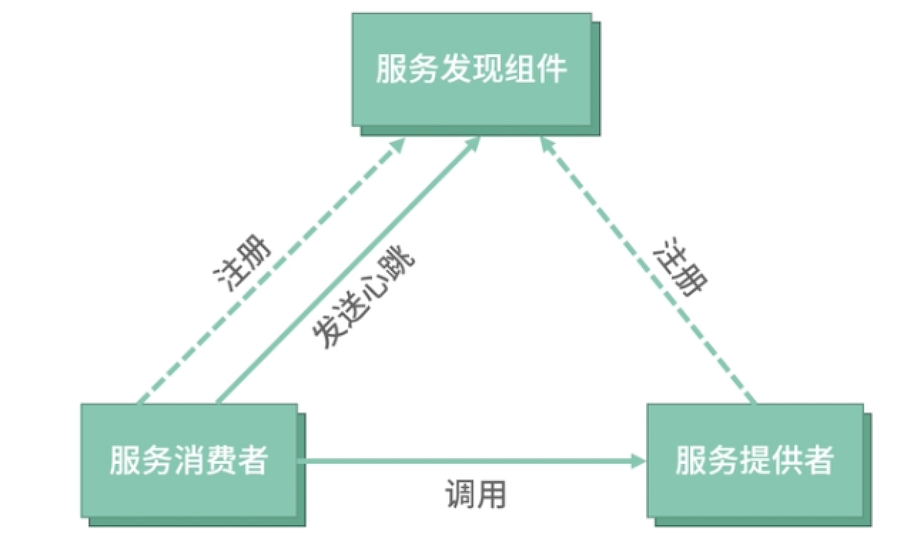

# **第二节 服务注册中心**

微服务其中服务注册发现，是最先需要解决的问题。简单来说，**服务注册与发现就是保证当服务上下线发生变更时，服务消费者和服务提供者能够保持正常通信。**

而在分布式架构中，服务会注册到注册中心，当服务需要调用其他服务时，就到这里找到服务的地址，进行调用。

**注册中心是微服务中最重要的内容，也是和 SOA 架构中的集中总线通信最大的区别点**。

## **1、服务注册发现**

假设在单体服务架构中，我们只有一个服务，这个服务前面就是像 Nginx 这样的网关系统，负责负载均衡，而后端的机器节点也是我们手动配置上去的，比如

```
upstream backend { 
  server 10.0.0.1:80; 
  server 10.0.0.2:80; 
}
```

如果机器不够用了，增加一个节点，然后 reload 一下 Nginx 就好了。**这样的配置，架构运行得还算稳定，维护成本公司也还可以接受**。

随着项目越来越复杂，修正 Bug 和正确地添加新功能变得更加困难，你选择继续拆分服务。慢慢地，你拆分的服务数量上升到了两位数，**但是你发现每次因为机器负载瓶颈而增加机器时，需要修改很多份内网网关配置**， 这无形中可以预料到，修改配置带来的维护成本和出错的概率都会呈指数级增加。

**解决上述问题的办法：服务注册发现。**

 


* 服务在启动时，将自己的信息注册到服务发现组件中，服务发现组件会存储这些信息。
* **服务消费者可从服务发现组件查询服务提供者的网络地址，并使用该地址调用服务提供者接口**。
* **而当服务提供者网络地址发生变更时，会重新注册到服务发现组件**。
* 使用这种方式，服务消费者就无须人工修改提供者的网络地址了。


## **2、服务注册中心**

**具体怎样利用服务注册发现解决多个服务间的通信问题呢？**

解决多个服务间通信问题的工具，我们称之为服务注册中心 所以有些人也会把注册中心叫作名字服务，顾名思义，**也就是通过 服务名查找对应的服务地址的服务，在分布式架构中，注册中心承接了服务的地址录入和查找功能**

## **3、注册中心的健康检查设计**

### **3-1 服务主动探活**

**<mark>服务通过定时发送续租信息到注册中心，以表明自己节点的存活</mark>**。

主动探活的方式其实是我们在使用注册中心时用得最多的一种方式，**如果你的服务集群规模不大，或者选用了类似 Eureka 这样的最终一致性的注册中心，服务主动探活绝对是你的最优的选择**

这种方式最大程度避免了在Kubernetes环境中，因为 IP 重用导致节点在旧的服务上依然存活的问题，毕竟续租信息都是带着服务信息上报到注册中心的。


**<mark>主动探活的最大问题： 造成注册中心的写操作变多</mark>**

在服务发布时，节点会产生比较大的变动，注册中心的写压力也就会变大。

而且强一致性的注册中心，节点变化一定要主节点确认，如果没有做注册中心的读写分离，就会产生大量的通知事件，对带宽、CPU 来说都是灾难性的问题，这个时候注册中心已经完全没有办法响应 TTL 的租约请求，也会导致大量的节点失效


**主动租约，其实并不足以说明服务是健康的，毕竟有些情况下，服务虽然无法对外提供服务了，但还是可以对外发送租约请求的。**

### **3-2 注册中心主动发起健康检查**

**<mark>服务在进行服务注册时，向注册中心表明自己的健康检查接口，比如 /ping 或者 TCP 端口，注册中心通过定时访问的方式，探明节点是否存活。</mark>**


第二种方案在**一定程度上解决了服务主动探活并不能说明服务健康的问题**，毕竟通过 `/ping `这种健康检查接口很大程度上可以说明服务的健康度。在Kubernetes环境中，也是通过对 Pod 进行主动健康检查来判定 Pod 的健康度的。

但这个方案也有一些问题：

比如上面提到的 IP 重用问题，如果两个服务都用了 `/ping `接口做健康检查，并且端口一致，就很容易发生节点在旧服务被重新激活的问题。当然也有相应的解决方案，就是参考 `Envoy` 做服务名称的 `check`。

### **3-3 注册中心不进行任何健康检查，由调用方负载均衡器进行健康检查**

**<mark>注册中心不进行任何探活机制，全部由调用方的负载均衡器进行主动和被动探活。</mark>**

第三种方案就比较极端了，不做任何健康检查，完全靠负载均衡器的能力。

这种方式也是有应用场景的，如果使用了 gRPC 这样比较完善的 RPC 库，一般都有自动摘除节点的能力。但我们也要考虑到这个方案的不足，如果 IP 被重用，节点很大概率会一直存在在旧服务中，这样的脏数据随时都是风险点。

当然我们可以结合前面两个方案，优化此方案。**你可以在做健康检查的同时，注册中心下发包含健康节点和非健康节点的数据到服务节点，并针对健康检查未通过的删除节点设置一个较长的过期时间，这样就可以解决 IP 重用产生脏数据的问题了。**

## **4、注册中心选型**

 

我来简单解释一下 CAP 理论，一致性（Consistency）、可用性（Availability）、分区容错性（Partition tolerance），CAP 不可能都取，只能取其中2个。

**所以在选型的时候，优先选择 AP 的系统。如果技术栈是 Go ，但又担心 Java 的组件不好维护，你也可以考虑自研注册中心，当然 CP 的注册中心并非不可用，在服务集群规模比较小的情况下，也是可以选择的。**

## **5、搭建一个高可用、健壮的注册中心**

### **5-1 在引入注册中心可能会遇的问题**

* 注册中心完全故障了，服务是否还能正常访问？
* 注册中心因为高负载，推送了异常的数据，服务是否还能正常访问？
* 新加入的机器，出现了网络连通性问题（注册中心和机器网络正常，但服务机器之间网络异常），应该怎样应对？
* 服务是否应该完全信任注册中心推送的数据？
* 服务发布后，节频繁变更造成 N×M 次事件通知，形成广播风暴，该如何解决？

第三方基础设施，比如 MySQL 、Redis ，这种数据层的中间件，我们肯定是要完全信任其中的数据的。但对于注册中心，信任推送数据的风险非常大。

**1. 注册中心完全故障了，服务是否还能正常访问？**

所以只要在进程中缓存服务的节点，影响面就可控。

**当注册中心完全故障的时候，服务注册功能是失效的，此时的扩容操作无法进行**。

如果在容器中，因为 Pod 滚动升级的原因造成会先启动新的 Pod，一定要在程序启动注册失败时抛出异常，使程序无法启动，否则容器 IP 的变化也会导致服务的访问异常。

**2. 注册中心因为高负载，推送了异常的数据，服务是否还能正常访问？**

但随着微服务规模的增大，注册中心很有可能遇到瓶颈。一旦出现高负载，会使服务和注册中心之间的健康检查或保活出现问题，注册中心使节点异常下线，只推送部分节点数据到订阅的服务。

这个问题看似不严重，但一旦推送了过少的节点到服务，会导致主调服务打挂被调服务，长时间不能恢复，甚至会导致整个微服务集群雪崩。

解决此类问题，

* **我们可以在客户端的服务发现 SDK 中加入自我保护机制**：
* **一旦服务的节点数量下降超过一定阈值，就进入自我保护状态，放弃使用新推送过来的服务注册信息**。

**3. 新加入的机器，出现了网络连通性问题（注册中心和机器网络正常，但服务机器之间网络异常），应该怎样应对？**


实际上网络连通性问题是比较容易发生的，往往出于安全考虑，各个部门之间可能会处在不同的 VPC ，但现实中又有互相访问的情况，**一旦网络规则维护不好，很容易出现新添加的机器注册中心的网段可以访问，但是服务之间却无法访问的情况**。

在注册中心的使用场景中，网络故障是我们最优先考虑的问题，如果发生了分区故障，问题 2 描述的情况也会发生。

解决此类问题呢，这个就要发挥负载均衡器模块的作用了：**在负载均衡中我们可以加入被动健康检查（节点熔断）和主动健康检查来在客户端主动剔除失效的节点**。


**4. 服务是否应该完全信任注册中心推送的数据？**

Service Mesh 数据面之一 Envoy 的做法：

* 相比注册中心的数据
* 更信任本地数据
* 所以 Envoy 设计了 2×2 矩阵来决定节点是否应该路由。

 

**只有在健康检查失败和注册中心未发现的情况才会删除节点，只要健康检查成功，无论是否发现此节点，都会路由。**

**5. 服务发布后，节点频繁变更造成 N×M 次事件通知，形成广播风暴，该如何解决？**

可能导致问题 2 的发生。**大量广播事件的发生，挤占网络带宽，甚至会导致网络带宽占满，此时注册中心和服务间的健康检查或保活，都会因为带宽不足造成信息丢失，使注册中心推送错误的数据。**

如何解决呢？

其实很简单，我们可以将事件消息合并推送。**在 Istio 的 Pilot 的模块中，实现了一种合并机制，100ms 内有新的事件消息时，便会继续等待下一条，最多等待 1s，当然时间的参数是可以配置的，这里我们说的是默认参数。**

## **6、Service Mesh 中的注册中心**

实际上在 Service Mesh 方案中，服务节点发现的问题用传统的注册中心方案也是可以解决的，但如果涉及 Kubernetes 和 ECS 跨集群访问，**最好还是支持 Envoy 定义的 xDS 协议中的 EDS 协议**。

EDS是 endpoint discovery service 的缩写，无论是 Istio，还是最新版本的 gRPC，都已经默认支持了 EDS 协议，可以说**EDS 实际上已经是服务发现的规范了**。

在 Service Mesh 方案中，因为大多是和 Kubernetes 集群结合的方案，**所以你要特别注意发版或者自动扩缩容引起的节点 IP 变化的问题**。节点的频繁变化，对注册中心的健壮性提出了更高的要求

除了用传统的注册中心组件外，Kubernetes 内部的发现机制在 Service Mesh 中也得到了广泛应用，例如 Istio通过监听 Kubernetes Pod 的变化，实现服务发现的功能，这样就不需要服务自身来做服务注册了。

## **7、Service Mesh 中实现的注册发现功能优势**
 
### **7-1 无须服务自身注册，由 sidecar 代理注册**

sidecar 通过接受控制面下发的配置信息，进行服务注册。**相对于服务自身注册，这样可以减少服务自身开发的工作量，同时也很容易做到注册的配置信息一致化。**

比如如果服务自己注册，其实很难控制服务注册的 metadata 信息，在 SDK 中很难约束和升级，比如运行环境、地域、健康检查方式等。

**sidecar 代理还带来了可以随时更新 meta 信息的好处**

在传统的 SDK 模式中，你想要动态调整服务的权重、metadata 等信息的时候，需要重新发布版本，或者依靠配置中心的能力，但这些控制信息往往散落在各个服务中，不方便管理，在 Service Mesh 中你只需要依靠控制面的能力，就可以轻松做到了。


### **7-2 通过控制面聚合多种、多个注册中心数据**

像 Istio 的 pilot 模块，在 1.1 版本就支持了单控制面多集群的功能，通过 pilot 将多个注册中心的数据聚合，**可以有效降低单一注册中心的读写压力，使注册中心更容易水平扩展**。

比如在实践中，我就将多个 Consul 数据中心的数据通过 pilot 模块聚合，然后提供 xDS 协议，供服务发现使用，实现了虚拟机到 Kubernetes 环境的无缝迁移。

### **7-3 通过 sidecar 提供服务正确性 check 功能**

际上如果服务 IP 发生变化，又用了同样的 ping 接口时，健康检查会出现错误。而通过 sidecar 模式，**当发现服务 ping 接口过来的流量时，进行服务名称的检测，通过 header 中增加服务名称与本地服务名称做校验的方式进行检测，可以有效避免这样的错误**。

 

