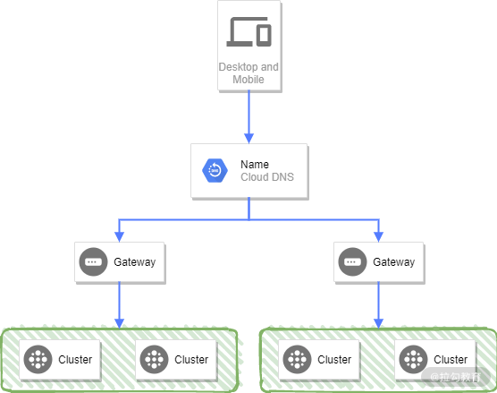
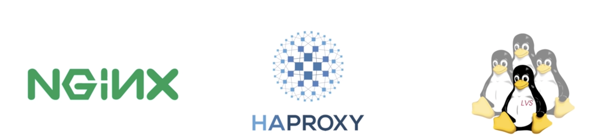
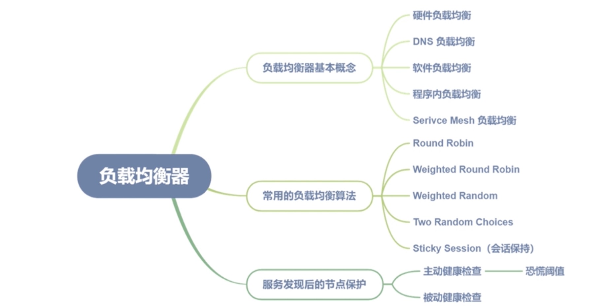
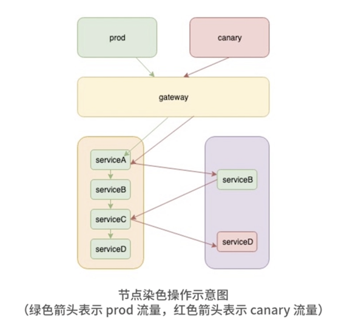
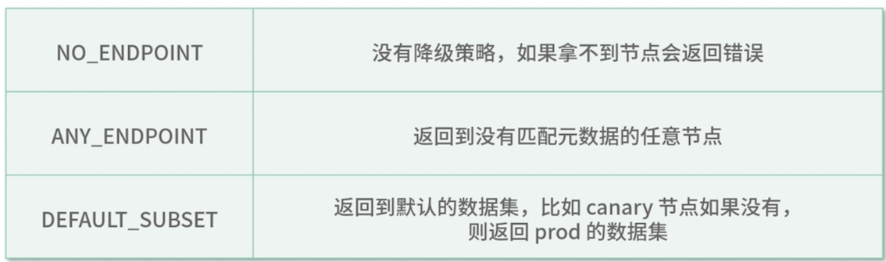

# **第三节 负载均衡器**

## **1、服务发现后如何实现节点保护**

### **1-1 服务发现后如何实现节点保护**

**负载均衡（Load Balance），是一种网络流量分配技术，用于解决单台机器性能出现瓶颈时，需要多台机器分摊处理流量的情况**

load 在中文里也有“量”的意思，在这里可以理解为机器的工作量，那么 Load Balance 就是让每台机器平摊处理的工作量（请求量）。

负载均衡器，有以下几种实现方式。


* **硬件负载均衡**：比较常见的硬件负载均衡器有NetScaler、F5、Radware，Array 等，由专业的硬件公司生产，一般在互联网公司的早期阶段进行使用，但是由于价格昂贵，现在互联网公司很少使用了。

* **DNS 负载均衡**：**通过域名返回后端节点 IP 进行负载均衡，也可以为每个后端 IP 设置权重**。因为 DNS 解析存在缓存延时的问题，所以在内网较少使用。但对于大流量的 Web 和 App，入口层一般会使用此种方式做负载均衡，后端多组四层 LB 做负载均衡。

 

* **软件负载均衡**：比较流行的是 Nginx、HAproxy、LVS 等，
	* **像 LVS 是四层负载均衡器**，性能较高；
	* **Nginx、HAproxy 主要用于七层的负载均衡**，有较多的负载均衡策略，同时流量相对于四层会更加均衡。
	* 像我们常用的云厂商，比如阿里云的 SLB 同时提供了基于 LVS 的四层负载均衡器和基于七层的 Tengine 负载均衡器供大家选择。

 


* **程序内负载均衡**：严格来说它属于软件负载均衡的一种，只是**把负载均衡的策略放在了服务内部。**对于微服务架构来说，服务内部做负载均衡更合适，因为微服务就是通过服务发现发现服务节点的，在程序内部选取合适的流量节点自然更加合理。

* **Serivce Mesh 负载均衡**：利用 sidecar 做程序内的负载均衡，属于软件负载均衡的一种，相比 SDK 内负载均衡，可以随时更新各种负载均衡策略。

### **1-2 常用的负载均衡算法**


* **Round Robin**：简单轮询算法，适合后端节点权重一致的情况。应用场景较少，但算法时间复杂度为 `O(1)`， 可以在预先判断后端节点权重一致的情况下使用。

* **Weighted Round Robin**：通过取最大公约数的方式，做简单轮询。因为权重多的节点会比较集中，Nginx发明了一种平滑加权轮询，通过算法将权重大的节点分散开，但在服务重启时依然会出现节点请求较为集中的情况。

* **Weighted Random**：通过随机的方式进行负载均衡，配合二分查找，可以将时间复杂度降到`O(log^n)`。该算法对于后端节点非常均衡，不会出现加权轮询导致的重启时节点请求较为集中的情况。


* **Two Random Choices**：目前比较流行的算法，适合后端节点权重一致的情况，**通过两次随机算法，获取到两个节点，然后对比节点的 CPU 负载，延时情况等信息，获取一个最优的节点，好处是后端节点的 CPU 或者延时会比较均衡**，因为分区和虚拟机硬件配置的原因，此种做法可以动态调节后端节点负载，在生产中是非常好的选择。

* **Sticky Session（会话保持）**：根据客户端 IP 或者 Cookie 进行会话保持，实际上就是同一个客户端，每次选取的后端节点 IP 保持一致，主要是用于登录验证的会话保持。**实际上此种算法让服务变成了有状态服务，另外对于后端负载也会不均衡，在微服务架构中已经较少使用**。如果想要进行 Session 的保持，大多是将 Session 存储在外部存储中，比如 Redis 等。

### **1-3 服务发现后的节点保护**

#### **1-3-1 主动健康检查**

受注册中心的网络分区故障等原因影响，**在负载均衡器中进行主动健康检查**，是避免此类情况发生的最佳模式，但长时间的主动健康检查会产生大量无用的 ping 操作，造成不必要的机器负载损失。

**所以在实践中，建议选择获取过少的节点时才触发主动健康检查模式**。

当获取节点过少、进入主动健康检查的模式时会触发对后端节点的 ping 操作，这个过少的阈值可以根据公司负载情况确定。比如在实际操作中，如果机器负载长期处于比较高的水位，你可以采用一个比较保守的数值，比如小于 80% 的时候触发。

为了能够保证两台机器至少能够下掉一台，采用了 

```
(currentNodeNum+1)/nodeCount < 80% 
```
以保证至少下掉一个节点。其中 nodeCount 为 15 分钟前的服务节点总数，当然这样是一个经验值，你也可以根据公司的实际情况适当调整。

**在容器环境中，扩缩容时可能会触发节点的自我保护模式，造成一定的短时间流量损失，但相对于因为流量打到了错误的节点上引发的雪崩，我认为此种情况还是可以接受的。**


#### **1-3-2 恐慌阈值**

依据健康检查的结果判断后端节点是否正常，这种方式虽然可以保证网络分区异常情况下节点间的连通性

**但如果后端节点大量不可用的情况下，只有少数节点能够通过健康检查。此种情况下，少量的节点显然是无法提供正常服务的。**

**回滚:**

因为服务发版导致的服务节点多数或者全部不可用的情况也很容易出现，此时你的首选操作一定是回滚。

**回滚期间，节点的可用是有先后顺序的，这个时候如果完全信任主动健康检查的结果，会导致流量全部路由到新回滚成功的节点上，造成新启动的节点会立即被打挂**。

* **解决上面两种问题的办法一种是服务治理中的限流**，
* **另外一种办法就是负载均衡器中的恐慌阈值**。 

当健康检查后节点依然少于设定的阈值，则忽略健康检查结果，将流量路由到全部的节点，包括不健康的节点，这样就可以保证负载的均衡，也不会把流量集中到过少的节点，导致服务处于“雪崩”的状态。

这个阈值的设置也是比较讲究的，虽然 Envoy 官方默认值是 50%，但我觉得这并不是最合适的设置：**50% 的阈值太过激进，很容易达到触发条件**。

而当你理解了这个阈值的作用，就会明白当线上出现故障的时候，节点是会趋于全部不可用的，所以线上我把这个值设置为 10%。**因为随着故障节点变多，剩下的少量节点也扛不住调用方的所有流量，剩余的节点会慢慢趋近我们设置的阈值，一样可以达到恐慌阈值设置的目的**，而且也不会因为只是少量节点故障，触发阈值导致的错误流量。

#### **1-3-3 被动健康检查**

有些时候单纯靠主动健康检查依然无法避免错误的流量，毕竟主动健康检查只是通过特定的 ping 接口或者 TCP 探活进行健康检查的，这些并不是服务的真实流量，特别是在使用 TCP 探活的时候，更容易出现问题。

**这个时候就需要被动健康检查了，通过真实流量来判断节点是否正常，也就是利用节点熔断器。**

**和服务级别的熔断器一样，节点熔断器也是通过状态码判断服务是否正常，假如后端是 HTTP 服务，我们通常会将 499 以上的错误码认为是后端服务错误。**

通过记录 10s 的滑动窗口内的错误码比例，当后端节点的错误比例达到我们设置的阈值时，便将后端节点从负载均衡器中移除。当然你也要考虑不能摘除过多的节点，所以熔断器需要设置和自我保护相同的触发阈值，以避免过多的节点被移出引发“雪崩”。


 

## **2、如何实现染色和地域优先**

### **2-1 节点染色**

节点染色，简单来说就是把某一类节点打上相同的标签，然后负载均衡器根据标签来分发流量。

**在微服务架构中，染色有很多作用，比如金丝雀发布、A/B测试、故障演练、流量区分，都可以通过染色来实现**。

### **2-1-1 如何操作呢**

* **首先我们需要在网关层，根据 header 信息或者权重对流量进行染色**。

比如在客户端的某些版本中写入染色的 header，就像 `X-TAG=canary`；也可以在网关层对流量按照比例分流，比如 1% 的流量打上金丝雀的标签进行灰度测试。

* **在注册中心也需要写入对应的 MetaData 信息，用于在负载均衡层进行流量的过滤**

比如在注册中心的 MetaData 信息中定义 `lb_tags` 的字段，数据为 `[stage:canary, v:1.2]`，在 LB 进行匹配的时候，带有金丝雀 header 的请求，就会请求到 `lb_tags` 包含 canary 的节点上面。

 

另外我们也需要考虑没有匹配到对应节点时的降级策略，参考 Envoy 中的配置，一般有如下几种：

 

**比如在金丝雀这种策略中，我们将标注 canary 的 tag 的节点，配置 `DEFAULT_SUBSET`，这样如果金丝雀的节点不存在的话，就会访问 prod 的节点，**

**将标注 prod 的节点配置 `NO_ENDPOINT`，这样 prod 的节点就不会有染色的降级策略，而是使用我们之前配置的自我保护策略了。**

染色是负载均衡器利用节点上的标签进行流量路由，同样地域优先访问也需要利用在节点上打上地域标签，让负载均衡器进行地域优先。


### **2-2 地域优先访问**

#### **2-2-1 地域优先访问**

在 Envoy 中也被称为 zone 感知路由

* **始发集群：调用方，也就是 Client 端的服务节点集合**。
* **上游集群：被调用方，也就是 Server 端的服务节点集合**。
* **zone: 区域（Region）和可用区（Availability Zone，AZ**）

<mark>**zone 感知路由，会根据始发集群的所在区节点数量和目标集群的所在区节点数量，动态计算出一个对应的比例。**</mark>

#### **2-2-2 地域所在区静态加权**

这种算法最大的问题，是很难保证始发集群和上游集群的所在区是一一对应且比例相同的，

比如始发集群 A 所在的 c 区是 50%，而上游集群 B 所在的 c 区只有 20%，这样如果只是简单的静态加权，就会导致始发集群 c 区的流量将上游集群 c 区打挂。

实际上在微服务框架 Dubbo 中也采用了类似的算法，<mark>**但这种算法对运维环境要求比较高，并不适合用在真实的环境中。**</mark>

zone 感知路由解决的最大的问题，**就是对运维环境的依赖**。通过动态计算上下游的节点数，将流量正确地路由到各个分区。虽然会产生一些因环境带来的延时问题，但避免了打挂上游集群的风险。

**这个过程会出现以下两种情况：**

**1.始发集群的本地 zone 节点数量小于或者等于上游集群所在 zone 节点数量**

只需将流量全部打到对应的上游集群所在 zone 的节点就可以了，另外计算出的上游集群所在区剩余的流量比例，用于服务其他所在区集群的流量。

**2. 始发集群的本地 zone 节点数量大于或者等于上游集群所在 zone 节点数量**


这个时候就没办法将所有流量路由到上游集群所在 zone 了，因为此种做法很明显会导致上游集群所在区的流量不均衡。这时我们就需要将剩余的流量路由到其他 zone 的上游集群了。

zone 感知路由对于降低因为跨地域跨区的请求引起的延时增高问题，有明显的效果，但依赖于获取本地所在 zone 的始发集群节点数量。

在分布式场景中，**如果节点数量发生变化，可能会导致瞬间的流量不均衡**，此时我们要及时退出此种模式以避免引发雪崩，也因为这种问题，**我们引入了基于 P2C 技术（Pick of two choices，两种随机选择）的动态加权负载均衡模式**。


### **2-3 延时、负载加权（EWMA）**

**实际上基于 P2C 算法的负载均衡，是近年来最流行的负载均衡算法，我们常见的 Service Mesh 控制面，比如 Envoy、Linkerd，默认都提供基于 P2C 的负载均衡算法，另外最常用的七层负载均衡器 Nginx，在其收费版本 NGINX plus 中，同样提供了 P2C 的负载均衡算法**。

 

**相对于传统的动态加权负载均衡，P2C 解决的最大问题，就是“羊群效应”。**

> 羊群效应：当某一节点出现延时或者 CPU 负载过高时，始发集群的多个节点都发现了这个节点延时/CPU 负载过高的问题，很容易造成过多的流量路由到同一节点，造成负载不均衡。

因为 P2C 是随机获取两个节点，然后获得加权值算法后最大的节点，所以需要一个加权算法用来判断哪个节点的加权值更大。负载率的算法如下：

```
client_success / server_cpumath.Sqrt(latency+1)(inflight+1)
```

下面简单解释一下各参数的意义。

* `client_success`: 客户端的请求成功率
* `server_cpu`: 通过每次请求 response 的 header 返回，服务端的 CPU 瞬时值
* latency：客户端计算的延时
* inflight： 正在发送中的请求数量


在这里的公式中，**我们并没有加上节点的静态权重**。和 Envoy 一样，我们只在节点权重一致的情况下采用此种算法，**因为P2C 算法会导致后端节点的实际权重和配置的权重相差比较大，给运维中的临时调整节点权重和金丝雀发布带来一定的困扰**。

### **2-4 EWMA 计算延时和客户端成功率**

可以通过滑动窗口的方式计算 10s 内的延时平均值和客户端成功率，但这种方式消耗的内存比较大，所以这里我们选择 EWMA（Exponentially Weighted Averages，指数移动加权平均）的算法来计算延时和客户端成功率。

 

* Vt 代表第 t 次请求时的 EWMA 值，Vt-1 代表第 t-1 次请求的 EWMA 值；
* θt 代表第 t 次请求的实际耗时，所以β越小，Vt 越接近本次请求耗时。

在实际中β值的公式：`β= math.Exp(float64(-td) / float64(tau))`， 其中 td 为当前时间和上次响应后之间的时间差，tau 为衰减系数。

### **2-5 负载均衡中的常见问题**

#### **2-5-1 为什么四层负载均衡中流量会不均衡？**

**Nginx 这样的七层负载均衡器消耗比较大，理论上一台高配置的服务器大概能承受 10w 级别 QPS 的负载，让我们过早地遇到了单机瓶颈。**所以在这种情况下通常我们会选取四层负载均衡器，但四层负载均衡器最大的问题就是流量不均衡。

因为四层负载均衡器基于连接做负载均衡，<mark>**当我们摘掉某一个节点，也就是把某个节点的权重设置为 0 的时候，由于连接还是保持的，流量依然会打到这个节点**</mark>，所以使用四层负载均衡器很多时候要等待一整天才能将节点无损地摘掉。这在外网网关的摘取中也特别常见。

也正是这种基于连接的机制，导致某些连接请求 QPS 高、某些连接请求 QPS 低的情况也很容易出现。

另外当我们做服务发布时，某个节点重启后会出现流量很低的情况，也是因为四层的负载均衡器已经在其他节点上建立了连接，新加入的节点往往需要较长时间才会负载趋于均衡。


#### **2-5-2 负载均衡后各节点流量均衡，后端服务的负载就一定一致吗？**

实际上，因为服务器硬件的差异，特别是虚拟机存在超卖等现象，很难保证同规格的服务器能够处理同样的 QPS 量级，所以后端服务器的负载很难一致，<mark>**这个时候就需要根据延时和 CPU 情况的一些加权策略做处理了。**</mark>


#### **2-5-3 节点下线后如何及时摘掉节点？**

一般情况下我们会等待注册中心的通知，但因为注册中心的中心化异步推送机制，往往收到信息不够及时，可以通过 upsteam 节点返回服务健康检查失败的头信息，让客户端可以快速摘掉不健康的节点。

