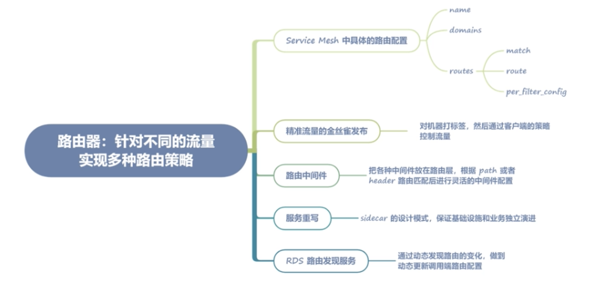
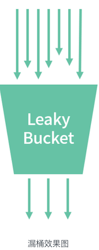
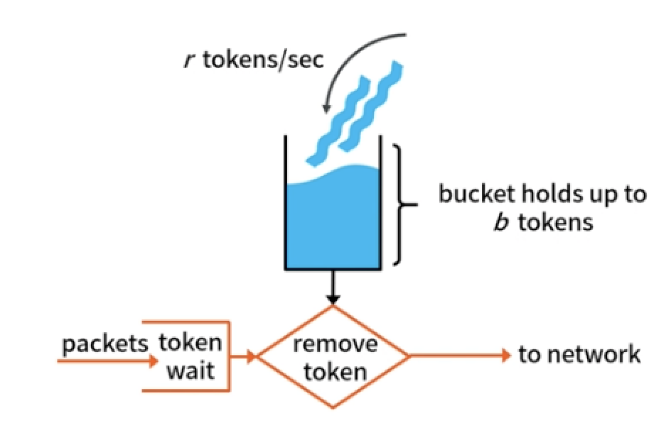
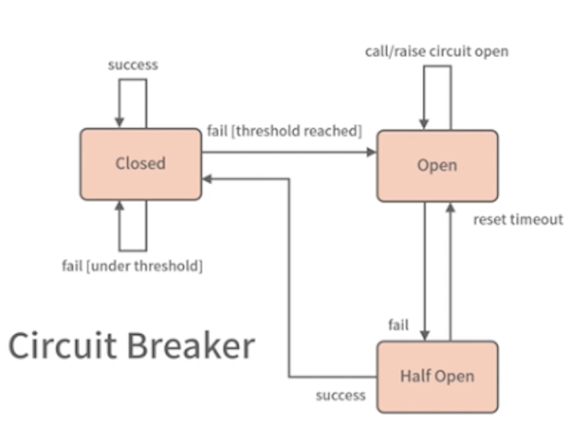

# **第四节 路由器及其限流熔断路由策略**

## **1、针对不同的流量实现多种路由策略**

<mark>**路由器: 根据不同规则进行流量控制和转发**</mark>

实际上路由这个抽象的概念被提及，甚至达到核心的位置，更多的是在 Service Mesh 架构中。在传统的微服务架构中，路由虽然也存在，但因为不需要进行主动配置，存在感并不是很强。

而在 Service Mesh 架构中，**数据面都是通过控制面的配置下发驱动的，也就是说必须强行声明路由配置，否则会导致调用出现 404 的错误**。

这种声明式的架构方式也许因为配置带来了一些不便，却提高了架构的可控性，不会出现传统微服务架构中无法知道调用了几个服务的问题。

### **1-1 Envoy 中的路由配置**

```
{
	"version_info": "2020-12-07T01:38:20Z",
	"route_config": {
		"name": "9080",
		"virtual_hosts": [{
			"name": "details.default.svc.cluster:9080",
			"domains": [
				"details.default.svc.cluster:9080",
			],
			"routes": [{
				"match": {
					"prefix": "/"
				},
				"route": {
					"cluster": "outbound|9080||details.default.svc.cluster",
					"timeout": "10s",
					"max_grpc_timeout": "10s"
				},
				"per_filter_config": {
					"mixer": {
					}
				}
			}]
		}]
	}
}
```

* <mark>**name：主要是对应 listener（监听器，可以理解为 sidecar 的监听端口）的名称，这里用端口作为名字，已经确保了唯一性。通常我们的路由配置针对每种协议会有两份（Client 端路由和 Server 端路由），这一讲，我们主要讲解 Client 端，也就是调用方的路由配置**</mark>。因为调用方的路由配置相对比较复杂，理解了调用方配置，被调用端就很容易理解了。


* <mark>**domains：在 Envoy 中会先做一层初步的过滤，这层过滤就是服务域名（名称），这层匹配非常简单**</mark>，基本上就是字符串的对比，所以速度会很快，这样就避免了直接遍历所有路由带来的不必要的性能消耗。

* <mark>**routes：服务的路由配置，可以注意到这是一个数组**</mark>，在这里我们可以针对要访问的服务设置多条路由配置。可以针对不同的路由规则，进行不同的 filter 配置。

* <mark>**routes：服务的路由配置，可以注意到这是一个数组**</mark>，在这里我们可以针对要访问的服务设置多条路由配置。可以针对不同的路由规则，进行不同的 filter 配置。

**routers 数组结构**

* <mark>**match： 用于路由匹配，程序会遍历匹配此字段到对应的路由设置**</mark>，可以配置 header、path、pathPrefix 等。
* <mark>**route： 主要是匹配到这条路由的基本规则设置。比如 Cluster 字段是这条路由对应的服务名，这也是路由模块最核心的作用，通过路由规则匹配到合适的服务名，然后进行转发**</mark>。 
	* 比如在此配置实例中`"details.default.svc.cluster:9080"`的服务会被转发到`"outbound|9080||details.default.svc.cluster"`对应的服务节点上面。另外两个字段则是服务转发的超时时间。
* <mark>**`per_filter_config`： 路由对应的中间件配置，用于服务治理的限流、熔断等**</mark>。


### **1-2 精准流量的金丝雀发布**

金丝雀发布也叫灰度发布，**实际上就是将少量的生产流量路由到线上服务的新版本中，以验证新版本的准确性和稳定性**。

```
{
  "route_config": {
    "virtual_hosts": [
      {
        "name": "helloworld",
        "domains": ["*"],
        "routes": [
          {
            "prefix": "/",
            "weighted_clusters": {
              "clusters" : [
                { "name" : "helloworld|stage=canary", "weight" : 1},
                { "name" : "helloworld|stage=prod", "weight" : 99 },
              ]
            }
          }
        ]
      }
    ]
  }
}
```

相对于前面的 Cluster 的配置，这里多出了 `weighted_clusters` 的配置，也就是说，Envoy 会按照权重将流量路由到 `HelloWorld `这个服务不同的版本中，name 中的 `stage=canary` 可以理解为注册中心的针对不同节点的 tag，在 Pilot 中会被当作服务名的一部分拼在服务名中。


当然，和之前在负载均衡模块中讲到的染色一样，我们需要针对机器或者 Pod 打上标签，比如在进行 CD 发布的时候，将用于金丝雀的 Pod 打上 stage=canary 的标签，这样我们再更新客户端的路由配置，就会有 1% 的流量路由到金丝雀的 Pod 上了

**其实，相对于传统的 Kubernetes 或者 ECS 灰度发布只能进行节点维度的灰度，这里的金丝雀发布将流量变得更加精准可控**。

我们在入口网关层，进行路由流量分配，这个时候划出一部分流量用作 canary 的灰度，剩余的更多流量用于正式版本，这样就无须在 CD 发布时做改变调用方配置的操作了，只需要启动一个带有金丝雀 stage=canary 标签的 Pod，就可以以最小化的代价完成灰度服务了。

### **1-3 路由中间件**

为了配置的灵活性，**一般我们会把各种中间件放在路由层，这样就能根据 path 或者 header 路由匹配后进行灵活的中间件配置**。

比如我们需要对服务 A 的 `"/test"` 的 path 进行单独的限流配置，就可以建立一个 route 的match 设置为` path:/test`，这样就做到针对某一个 `path` 进行限流，而这个配置不会影响其他的路由规则。

虽然这里只举例了限流，但其他的中间件，比如熔断、故障注入、日志，都是一样的道理。

### **1-4 服务重写**

Cluster 的配置放在了路由里，也就是根据不同的路由可以配置不同的 Cluster，这样我们就能根据不同的 path 将流量路由到不同的 upstream 服务了。

### **1-5 RDS 路由发现服务**

和服务节点发现一样，引入路由发现的功能，通过动态发现路由的变化，**做到动态更新调用端路由配置，以达到路由中间件等配置更新的功能。这种做法也让路由这个功能在 Service Mesh 架构中发挥更大的价值。**

 

## **2、服务治理之限流熔断**

微服务需要治理是因为影响了微服务集群的稳定性。所以我们需要一些手段进行干预，比如限流、熔断、降级等，确保微服务集群的稳定性。

### **2-1 限流**

限流是指当流量超出服务设计之初的承载量时，通过一定的算法，将无法处理的流量丢弃，以保证服务的稳定性。

#### **2-1-1 常用的限流算法**

**计数器 :**

**计数器是最容易实现的限流算法**，其实它的原理非常简单：记录一定时间内的请求数量，将超过阈值的请求拦截掉。

这种算法对于微服务限流这个场景来说其实也够用了，**但计数器算法有个很明显的问题：在临界区间容易促发错误的限流判定**。

假如设定请求记录时间为 1s，限流触发阈值为 100，在上一个记录区间的最后 100ms 和当前记录区间的前 100ms 都发生了接近阈值的请求量 90，很明显这样就无法触发限流阈值，但却超过了系统的最大负载。


#### **2-1-2 滑动窗口**

**<mark>滑动窗口就是为了解决简单计数器的问题。</mark>**

假定设置 100ms 为一个窗口，那么 1s 内会有 10 个窗口，这样即便两个临近的窗口都发生了接近阈值的请求量，也能够通过计算前 10 个窗口的总量，触发限流阈值。

按照计数器中的情况，两个临近窗口的请求量共计 180，显然会触发阈值。

 


#### **2-1-3 漏桶**

**<mark>漏桶是一种非常平滑的限流算法。</mark>**

它在一定时间内允许通过恒定数量请求，如果这个时间内请求数量超过这个量，就会触发限流。举个简单的例子，比如 1s 内设置允许 1000 个请求的阈值，那么每 1ms 就会产生一个允许通过的请求。如果超过这个值，就会被限制掉。

这种算法虽然非常平滑，但却带来了另外一个问题：**限流过于严格**。

虽然我们设置了每秒 1000 个请求，但如果这 1s 内的请求不均匀也会触发限流。实际上，**这种算法并不太适合微服务场景，它更适合限制我们请求外部第三方服务的情况**，比如某个第三方推送的接口限制了我们每秒的请求量，这个时候我们用漏桶算法可以限制自身的对外请求量。

 

#### **2-1-4 令牌桶**


**<mark>令牌桶（Token Bucket）是漏桶限流的一种优化方案。在微服务场景中，基本上都选择了此种方法，因为这种方式限流比较平滑，也不会产生漏桶错杀请求的问题。令牌桶允许一定的突发流量，所以非常适合微服务场景。</mark>**

令牌桶和漏桶在基本实现原理上差不多，最大的区别是限制角度不同，**漏桶是限制流出的速度，而令牌桶是限制令牌流入的速度**。

令牌桶会单独维护一个令牌的存储桶，这个桶会持续放入令牌，并且配合设置一个 burst 的参数，作为令牌的存储上限；而放入令牌的每秒速度为每秒 limit 个，用户请求会源源不断地消耗桶中的令牌。当令牌桶内的令牌耗光，就会触发限流

 

* limit：每秒往桶中放入的令牌数量。因为名称的原因，这个值很容易被理解为限流值，这样的理解实际上是错误的，令牌桶的限流值需要结合 burst 一起确定。
* burst：字面上看是突发的意思，虽然它能起到突发的作用，但实际意思是令牌桶的容量大小。

**在某个时间片内，消耗的速度大于了令牌的生成速度，又没有存量，就会触发限流了。**


#### **2-1-5 单机限流和全局限流**

**全局限流：指的是一组微服务集群**，通过外部存储对集群整体流量做限流。

这种情况因为需要依赖外部存储所以比较难实现，毕竟和外部存储的交互需要增加额外延时。**全局限流比较适合后端 DB 有吞吐量限制的情况**，有些场景需要扩容 Web 机器，这个时候请求量可能会增加，会造成对 DB 请求量的增加，所以需要设置一个全局限流值防止对 DB 的冲击。

**单机限流：指的是一组微服务集群，通过对单个机器的限流，达到服务整体限流的目的。**

**在微服务场景中，因为全局限流比较难做到，所以单机限流应用得比较多**。单机限流可以适应大部分场景，毕竟在分布式场景中，**单一机器负载控制住，大多数场景也就能控制住整个集群的负载**。

这种限流也不影响扩缩容，Web 机器因为负载不足可以随时横向扩容，此时单机限流值不需要改动；

而在全局限流中，当 Web 机器扩容时，也需要限流值随之改动，为扩缩容带来了不便。


### **2-2 熔断**

熔断也叫断路器，断路器是一种开关模式，这种方式可以参考电路系统中的过载保护机制。**当线路发生短路或者过载时，断路器能够及时切断电路，防止发生过热、起火等故障**

熔断组件有三种状态

* Closed（关闭）：默认初始状态为关闭。
* Open（开启）：假定我们设置 10s 的滑动窗口，当 10s 内的错误比例达到我们设定阈值的 90% ，此时状态会从 Closed 改变为 Open。
* HalfOpen（半开）：再经过一个 10s 的窗口期，此时熔断器会自动从 Open 转移到 HalfOpen 状态。在这个状态下，我们会按照线性的方式来放行流量，公式如下：`0.5 * (Now() - Start())/Duration`

**直到 10s 的滑动窗口内接口成功率重新恢复到 90% 才会转移到 Closed 状态，反之继续变更为 Open 状态。**

熔断的原理和实现都比较简单，但注意以下参数要根据实际情况设置。

 

* **滑动窗口时间**：在生产环境中，我一般设置为 10s，**注意这个值不能太长，否则熔断的恢复时间也会随之变长**。
* **触发条件**：假如是 HTTP 服务，在生产环境下，这个值我设置为 `499-600` 之间的错误码，可以理解为 499 错误码和 5xx 的错误码（499 错误码代表客户端主动断开，一般是超时引起的，而 5xx 错误码在 HTTP 中是服务端错误）。

如果是非 HTTP 服务，在 Service Mesh 体系下，我会把 gRPC 或者 Dubbo 的错误码转成对应的 HTTP 错误码进行统一的处理。具体的转换规则，就需要你根据自己的理解进行设置了。

**<mark>注意一般 Service Mesh 中的熔断不会统计业务的错误码做熔断处理，只统计系统层面的错误。</mark>**

 
