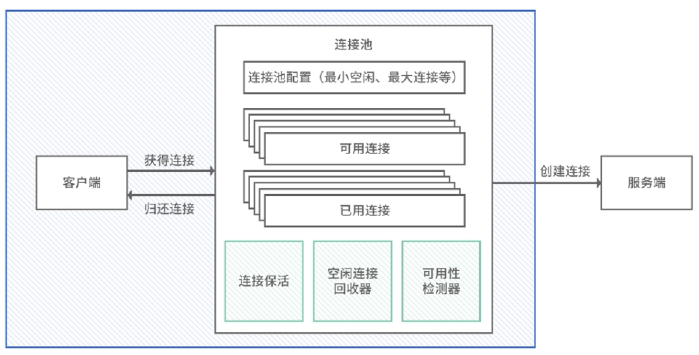
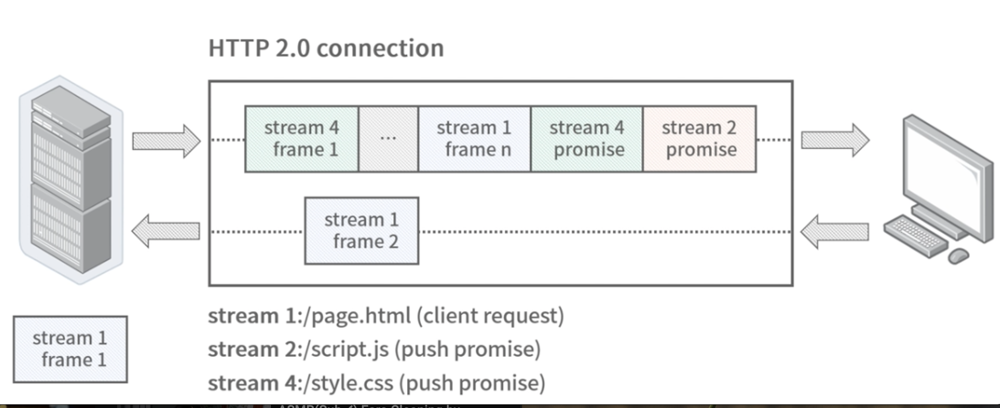

# **第五节 连接池：阻塞式连接池和多路复用连接池的差异**

阻塞式连接池和多路复用连接池的差别，HTTP 连接池和 HTTP/2 连接池的差别。因为这两个协议正好符合这里的两个特性：**HTTP 连接是阻塞的、无法复用的，HTTP/2 的连接是非阻塞的、多路复用的。**

## **1、连接 Connection**

TCP 连接的英语是 Transmission Control Protocol Connection。

在计算机中，经常会提到有状态和无状态；

**在微服务中，我们也经常会提到有状态服务和无状态服务。**

### **1-1 无状态服务**

<Mark>**其实是指服务内存或者本地不保存任何节点相关的信息，这样就可以做到服务扩缩容、迁移的机器无关性**</Mark>

### **1-2 有状态服务**

<Mark>**服务所在的机器上存有节点相关的信息，比如和某个客户端建立了 session 连接**</Mark>。在负载均衡模块我们提到了一种会话保持（Sticky Sessions）的技术，这种就属于有状态的服务。

HTTP 服务是无状态的，因为大多数情况 HTTP 是短连接的。相对而言在一些需要长连接的场景，因为连接本身的有状态的特性，**经常会在连接上存储一些连接相关的信息，这样服务也成了有状态服务。**

> TCP 连接定义
> 
> The reliability and flow control mechanisms described above require that TCPs initialize and maintain certain status information for each data stream. The combination of this information, including sockets, sequence numbers, and window sizes, is called a connection.


## **2、HTTP**

### **2-1 短连接和长连接**

实际上连接并没有长短之分，只是取决于传输完数据后是否断开，毕竟 HTTP 协议也是基于 TCP 协议实现的

**那么为什么会有长短连接的叫法呢？**

<Mark>这是因为 HTTP 协议多用于 Web 中，Web 的交互方式多是一来一回的模式，这样的应用场景下，不需要服务端推数据，所以建立连接后立即释放也是完全可以的。</Mark>


实际上随着互联网的发展，请求量越来越大，以往的短连接模式频繁的建立—释放连接，造成服务器资源产生不必要的消耗，

* 但现在 HTTP 协议往往会利用 `Connection: Keep-alive `让客户端和服务器保持长连接，使连接可以重用；
* 当需要主动断开连接的时候，发送 `Connection: close` 就可以了。


## **3、连接池的实现**

连接池就是将应用所需的连接对象放在池中，每次访问时从池中获取，使用完毕再放回池中，以达到连接复用的目的，**<Mark>减少创建、销毁连接过程中不必要消耗的资源</Mark>**。

HTTP 是一种阻塞式协议，简单来说就是 ping-pong 这种一来一回的模式，假设一个 ping 请求从客户端发到服务器端，那么这条连接一定要等到服务端返回了 pong 信息，才能继续发送下一条 ping 信息。

**<Mark>HTTP 无法复用连接，这个时候如果请求比较多，会造成请求的阻塞，所以HTTP 需要连接池这样的数据结构做并行请求</Mark>**。


* 简单来说，我们只要建立多条连接，用一个数组维护多条连接就行了；
* 如果使用一条连接，那么从数组里拿出这条连接，使用完再放入数组即可。
* 当数组为空时，只要建立新的连接就可以了。

 

具体的实现你可以参考 [go-micro 的通用连接池设计](https://github.com/asim/go-micro/blob/94bd1025a64eaaba1d89189891ef49f3ab5eee7f/util/pool/default.go)：

```
package pool
import (
    "sync"
    "time"
    "github.com/google/uuid"
    "github.com/micro/go-micro/v2/transport"
)
type pool struct {
    size int // 连接池大小，很多类库也叫作 maxIdleConns，最大空闲连接数
    // 多久后连接会断开，很多连接池会在一定时间后断开连接，然后将新鲜的连接放入连接池
    // 比如 HTTP 中因为服务器端因为 keepalive 过期，会主动断开连接，这种情况我们设置一个比 keepalive 时间短的 TTL
    // 确保连接先被移出，就不会拿到已断开的连接了
    ttl  time.Duration
    // go-micro 连接层抽象类，当作连接对象类即可
    tr   transport.Transport
    sync.Mutex // 互斥锁
    conns map[string][]*poolConn // 存储连接对象的数组
}
type poolConn struct {
    transport.Client // go-micro 抽象的客户端连接层对象
    id      string // 唯一 ID
    created time.Time // 连接创建时间
}
// 创建连接池对象
func newPool(options Options) *pool {
    return &pool{
        size:  options.Size,
        tr:    options.Transport,
        ttl:   options.TTL,
        conns: make(map[string][]*poolConn),
    }
}
// 关闭连接池，释放所有连接
func (p *pool) Close() error {
    p.Lock()
    for k, c := range p.conns {
        for _, conn := range c {
            conn.Client.Close()
        }
        delete(p.conns, k)
    }
    p.Unlock()
    return nil
}
// 获取一个连接对象
func (p *pool) Get(addr string, opts ...transport.DialOption) (Conn, error) {
    p.Lock()
    conns := p.conns[addr] //根据地址获取连接池数组
    // 循环直到拿到一个可用的连接
    // 否则创建一个新连接返回
    for len(conns) > 0 {
        // 获取一个连接
        conn := conns[len(conns)-1]
        conns = conns[:len(conns)-1]
        p.conns[addr] = conns
        // 如果超时则主动关闭连接
        if d := time.Since(conn.Created()); d > p.ttl {
            conn.Client.Close()
            continue
        }
        // 获得了可用的连接，返回新连接
        p.Unlock()
        return conn, nil
    }
    p.Unlock()
    // 创建新连接
    c, err := p.tr.Dial(addr, opts...)
    if err != nil {
        return nil, err
    }
    return &poolConn{
        Client:  c,
        id:      uuid.New().String(),
        created: time.Now(),
    }, nil
}
// 使用完将连接放回连接池
func (p *pool) Release(conn Conn, err error) error {
    // 如果上层发生错误，则不放回连接池
    if err != nil {
        return conn.(*poolConn).Client.Close()
    }
    // 放入没有错误的连接
    p.Lock()
    conns := p.conns[conn.Remote()]
    if len(conns) >= p.size {
        p.Unlock()
        return conn.(*poolConn).Client.Close()
    }
    p.conns[conn.Remote()] = append(conns, conn.(*poolConn))
    p.Unlock()
    return nil
}
```

实际上像 DB 层的协议，比如 Redis、MySQL 也类似 HTTP 的一来一回的协议，所以这套连接池的设计也可以应用在 Redis 和 MySQL 上面，可以说应用非常广泛。

### **MaxIdleConns 最大空闲连接数**


这个值经常会和 MaxConns 搞混，但你要注意这个值不是最大连接数，而是最大空闲连接数，结合我们上面讲的连接池实现原理，**这个值可以理解为连接池的大小**。

这个值的设置很有讲究，**需要结合后端服务的连接承载能力设置**。如果设置得太大，假如设置 1000，始发集群有 100 台机器，那么就会建立 10w 的持久连接，这对后端服务的压力可想而知。但也不能设置得太小，举个极端的例子，假如设置 1，当并发数量上去时，会出现两种情况：

* 如果连接池满了，就会建立新的连接，不断建立的新连接会耗光后端服务的资源；
* 新建立的连接在用完之后，有两种选择——连接池有余量的情况会放入连接池，反之会直接丢弃，这种情况在瞬间很容易出现，连接池持续瞬间被空闲连接占满（最大空闲连接数的叫法也由此得来），导致新连接无法放回连接池，进而丢弃，这样就会形成建立连接—用完丢弃的恶性循环，连接池的作用也就消失了，退化成了短连接。

**<Mark>经验值，一般情况下连接池容量设置在 10-100 的区间内是比较合理的</Mark>**。

## **4、HTTP/2**

**HTTP/2 设计的最大目的就是解决 HTTP 连接阻塞的问题**。当然也有很多其他内容的优化，比如 header 头部压缩、基于二进制的传输协议等。但我们还是把关注点集中到连接层面。

### **4-1 其他内容的优化**

比如 header 头部压缩、基于二进制的传输协议等。但我们还是把关注点集中到连接层面。

### **4-2 多路复用（Multiplexing）**

HTTP/2 中的多路复用，指的是在**一条连接中可以同时处理多个请求**，这正是解决了 HTTP 中一个连接同时只能处理一个请求的问题。这和 Linux IO 多路复用是不是也有些类似？之所以都叫多路复用，就是因为它们基本上都复用了某个通道，比如**HTTP/2 复用了连接，Linux IO 复用了进程**。

HTTP/2 抽象出了一种流（stream）的概念，**客户端在已经建立的连接上发送流，而不是像 HTTP 1.0 一样直接发送数据包，每个流都有一个唯一的标识号**，这样客户端就可以不管服务端是否已经返回数据而不断往服务端发送新的流。

**因为每个流有独立的 ID，在服务端返回处理流的数据包时，只要根据这个流的 ID 找到发送的信息，就可以一一对应**。

**这个流我们可以理解成一个虚拟连接**

在代码实现时，也可以看到 stream 其实就是用虚拟连接的方式实现的。我们在一条 TCP 连接上，建立了很多虚拟连接，这些虚拟连接（也就是流）的创建几乎没有成本，在每次发送新的请求前，直接 new stream() 返回新的数据流（虚拟连接），然后发送数据即可。

 

### **4-3 HTTP/2 到底需不需要连接池？**

需要，但和传统的阻塞式连接池也就是 HTTP 1.0 的连接池有一些区别。实际上HTTP/2 已经复用了连接，从某种程度上讲实现连接池已经没有太多意义了，多路复用做到一条连接就可以了，但因为 HTTP 2 .0 还是基于 TCP 连接的，而 TCP 存在队头阻塞的问题，**比如某条连接突然遇到了网络重传，此时会阻塞连接**。另外在一些高并发场景，一条连接难以跑满带宽，也需要创建多条连接。

所以 HTTP/2 的连接池实现有所不同，**新连接的创建条件往往是依据 maxConcurrentStreams 的参数，当同时请求中的 stream 的数量超过上限时，才创建新的连接。**


所以在 gRPC 和 HTTP/2 中这个参数的设置非常重要，它的重要性可以等同于上面讲的 MaxIdleConns 参数。这样的设计也很好理解，因为 HTTP/2 已经可以复用同一条连接发送多个请求了，自然没有必要一个请求创建一个连接，只需等这个连接无法满足设置的最大 stream 的条件时才建立新的连接。

