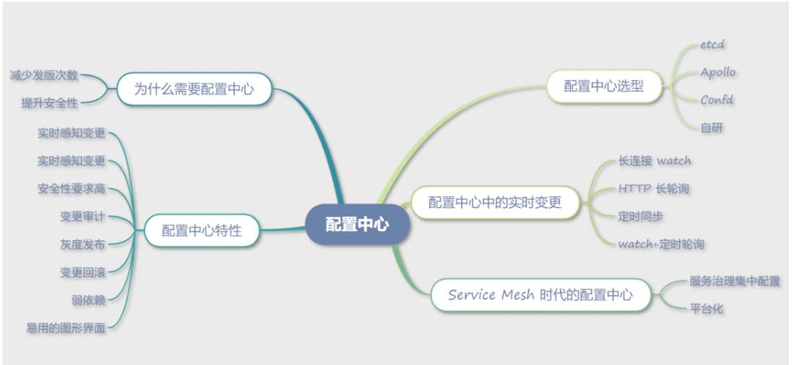

# **第七节 微服务治理的配置中心**

可能会将注册中心和配置中心混为一谈，**特别是很多分布式存储组件也经常被推荐同时用作注册中心和配置中心**。这里面存在一定的误解

## **1、为什么需要配置中心**

配置中心，从名字上看，就是用来统一管理项目中所有配置的系统。**而在微服务架构中，配置中心是用来动态更新服务配置，而不需要进行服务部署的组件。**

### **1-1 减少发版次数**

**减少发版次数是配置中心带来的最大优势**

以往配置文件都是放在代码中，如果想修改配置文件，只能修改代码然后通过发布系统发布新的代码版本。这种方式会造成频繁发版，比如修改日志的等级，就要重新发版。

发版不仅会带来一定的风险，而且发版的时间周期往往比较长，相对来说，**通过配置中心更新配置**，时间会短很多

**传统的发版**

修改代码→提交代码→合并代码→ CI/CD 发布→观察监控

**配置中心**

可以让工程师从烦琐的重复工作中解脱出来，提高开发效率。

### **1-2 提升安全性**

如果通过代码中的配置文件维护配置，那么数据库、Redis 等中间件的认证信息都会明文存储在代码中，这样的安全性就会比较低。

而通过配置中心，可以将敏感信息收敛到配置中心的存储中，并通过一定的加解密算法加密保护。

## **2、配置中心特性**

### **2-1 实时感知变更**

对于配置中心来说，**实时感知配置的变化是最基本的功能，这点和注册中心的需求基本一致，这也是两个组件经常被混用的主要原因**。

* <mark>**注册中心对实时性要求非常高**</mark>，在保证稳定性的前提下尽可能地快速收到节点的变更，以保证负载均衡器数据源的准确性；
* <mark>**但对于配置中心来说，实时性要求并不是那么高，只要保证最终一致就可以了**</mark>，至于时间是 1s 还是 1min，都可以接受。

### **2-2 安全性要求高**

* 对于配置中心，因为经常要存储数据库密码、第三方业务密钥等信息，**所以对安全性要求比较高**，对特殊的字段要加密。
* <mark>**另外配置中心在通信上需要采用双向 TLS 认证，以保证传输的安全性**</mark>。
* **相对而言，注册中心对安全性的要求比较低**

### **2-3 变更审计**

每一项配置的变更都要有可追踪的审计日志，以方便回溯问题发生的原因。一

般注册中心的组件不会提供这样的功能，但是在生产环境中，**如果是主动的发版或者修改权重等信息也需要额外添加可审计的日志**。

### **2-4 灰度发布**

配置中心和 CD 发布系统一样，都需要支持完备的灰度系统。一般在完整的发布配置前，都需要先灰度一台机器，然后查看监控系统是否有问题发生，再进行全量发布。

### **2-5 变更回滚**

这点也和 CD 系统一样，要具备变更回滚能力。如果没有回滚能力，一旦变更出错，又没有手动备份上一份配置，就会引发生产事故。**而具备了一键回滚功能的配置中心，**可以避免这种问题的发生。

### **2-6 弱依赖**

一般而言，通过健壮的 SDK 设计，都可以做到配置中心的弱依赖，比如通过文件缓存配置，即便配置中心出现故障，也不影响程序的正常启动和运行。但是对于注册中心而言就比较困难了，即便防灾难设计得再充分，一旦发生故障，对业务也会有比较大的影响。

### **2-7 易用的图形界面**

因为配置中心提供了灰度发布、变更回滚等多种功能，所以提供一个简单易用的图形界面是必须的；而注册中心对于界面的要求一般没有这么高。

## **3、配置中心选型**

### **3-1 etcd**

etcd 经常被推荐作为配置中心，但实际上它并不适合。

* 首先，etcd 默认有 2G 的存储上限，数据达到上限后会无法写入数据；
* 另外，etcd 记录了每条数据多个版本的信息，也会占用存储空间。

* 实际上随着服务数量的增多，对于配置中心这个场景，存储的配置量是比较大的。
* **etcd 除了能够做到配置实时变更，并没有太大的优势，反而会让维护成本增加。**

### **3-2 Apollo**

Apollo 是携程研发的配置中心，提供了包括 Java、.Net、PHP、Go 等多种语言的 SDK。而且提供了我们前面提到的配置中心所需要的多种功能，比如多环境、灰度发布、实时推送、变更回滚等。

相对于 etcd，Apollo 是更合适的配置中心选型，**Apollo 的后端存储也比较简单，直接用 MySQL 作为后端存储，对于运维来说，也更简单可靠**。

### **3-3 Confd**

Golang 开发的配置中心，**特别以 Agent 的方式部署在机器上，通过服务进程监听文件变化以达到更新配置的目的**。

这种方式易于推广，如果在微服务的初期没有引入配置中心，可以考虑使用此种方式，无须服务更新 SDK，只要在宿主机上部署 Agent 监听文件变化就可以了。另外它也很适合各种开源组件，比如 Nginx 的动态配置更新（Ningx 可以通过 reload 或者 kill -HUP 的方式动态更新配置）。

另外 Confd 提供了多种配置存储方案，也可以根据自己的场景进行选择。但 Confd 并没有提供图形界面，如果要使用，还是需要二次开发的。

### **3-4 自研**

配置中心作为微服务的组件，实际上需求变化并不是特别多，基本上 KV 的简单存储、实时变更就可以满足需求了，所以建议选用开源的配置中心方案，如果有特殊需求进行二次开发即可。

## **4、配置中心中的实时变更**

配置中心中的实时变更是如何实现的。

### **4-1 长连接 watch**

使用原生 TCP 自定义协议，或者直接采用 gRPC 协议，都可以实现 watch 的功能。当配置数据发生变化的时候，主动推送消息到 SDK。比如 etcd 就是采用了 gRPC watch 的方式。

### **4-2 HTTP 长轮询**

因为 HTTP 协议的通用性较好，而且大家对 HTTP 协议也相对熟悉，所以很多开源组件在实现推送功能的时候，**都会选择长轮询，也就是 Long Polling。像 Apollo、Consul 都采用了长轮询的方案来实现推送功能**。

长轮询的实现也比较简单，**客户端通过 KeepAlive 的方式连接服务器端，服务端阻塞连接直到有变化或者超时(默认一般 60s)才返回数据**，通过此种方式实现类似长连接的 watch 方式。

### **4-3 定时同步**

定时同步的方式则更加简单，通过 HTTP 方式定时请求后端接口，对比两次数据是否产生变化，如果产生变化则更新配置。

### **4-4 watch+定时轮询**

为了防止 watch 数据因为异常漏掉了推送的数据变化，通常会采用推拉结合的方式，也是watch+定时轮询的方式。实现方式其实就是上面讲到的长连接 watch 和定时同步相结合。

## **5、Service Mesh 时代的配置中心**

微服务架构的发展，对配置中心提出了更高的要求，除了传统的提供服务配置的修改，也希望配置中心能够提供 Service Mesh 中控制面的数据管理功能

### **5-1 服务治理集中配置**

对于传统的配置中心来说，还是每个服务管控自己的配置，这些配置文件的定义可能千奇百怪，比如 a 服务的限流配置可能叫作 Limit，b 服务叫作 RateLimit，这些配置均由每个服务独自负责，并不关心其他服务。但是对于服务治理来说，很多时候，我们需要集中管控这些数据，所以要把系统层面的配置抽象出来，形成统一的数据结构提供控制面使用。

**配置中心不仅需要感知自身配置的变化，也需要感知被调服务的变化。**

### **5-2 平台化**

随着服务数量越来越多，服务治理功能被抽象出来，因此需要一个微服务治理平台管理所有服务的服务治理配置，而不是像以前一样把配置散落在各个服务中。

有了这样一个平台，我们就可以让 SRE 介入服务的维护中心，在服务出现问题的时候，通过服务治理手段，比如限流、熔断、降级，SRE 可以通过平台直接操作，以降低故障的影响面和事故等级。

 