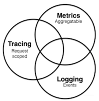
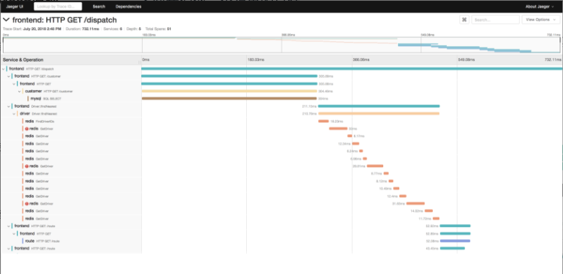
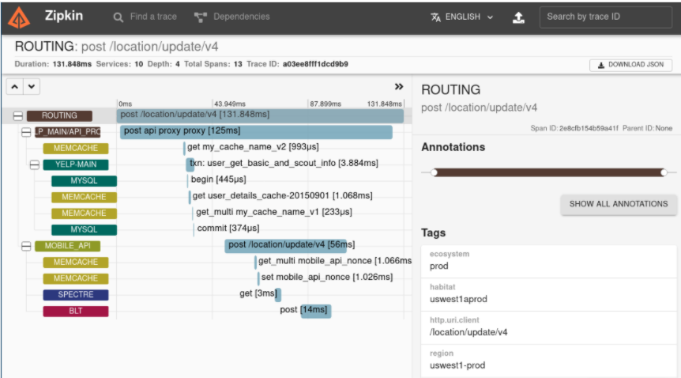
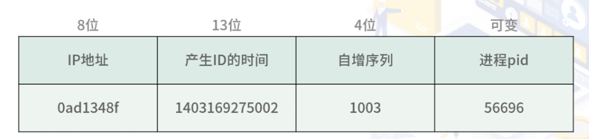

# **第八节 Trace 更快速定位问题**


## **1、可观测性**

提供可观测性功能的组件 Trace。

早期系统架构基本是通过日志组件来观察服务的异常情况，而在云原生模式下，链路追踪、Metrics 和日志三者组成了可观测性组件。

在微服务和 Service Mesh 架构中，可观测性组件的位置变得越来越重要，一般作为默认组件集成在方案中。

**可观测性是通过系统输出信息到外部，以检测系统内部的运行状态。比如我们这一讲中的Trace，通过内部打点的方式串联起微服务的各个组件。Metrics，通过输出服务的 Metrics 信息，达到外部监测的目的。**

可观测性组件主要有如下三种：**链路追踪、监控指标、日志**。


 

* **链路追踪**：通过在程序内打点记录日志的方式，记录每次请求的调用链路信息。特点是**数据精准、细致，适合查看某一次请求的调用链路，一般用于查看某些响应较慢的接口瓶颈**。
* **监控指标**：主要是用时序性数据库记录每个时间点的监控数据，**一般通过主动拉取服务 Metrics 数据的方式记录，然后实时计算一段时间的数据**，并通过图形界面的方式展现出来。它的**特点是实时性强、可观测指标丰富，适合查看一段时间内的指标趋势。**
* **日志**：日志是比较传统的可观测性组件了。 日志的特点是数据比较离散，之间没有关联。当然，我们可以通过在日志中打印 TraceId 和链路追踪关联起来。一般日志要通过日志收集系统使用，比如常见的 ELK 日志系统。


## **2、链路追踪系统的重要性**

* 在微服务架构中，随着服务和中间件数量变多，往往一个接口要请求几十次服务和上百次 DB 才能返回数据，链路过长，很难定位到底是哪个环节出了问题；
* 又或者某个接口延时过高，也很难排查到底是链路中的哪个环节出了问题，这个时候就需要链路追踪系统帮忙了。


## **3、Trace 链路追踪原理**

链路追踪系统基本源于 Google 的一篇 Dapper 论文，这篇论文详细解释了链路追踪的实现原理。

Dapper 通过一个全局唯一的 TraceId 表示请求调用链，并定义了 span，**span 表示一次调用（可以是远程调用，也可以程序内的函数调用）**。

每个 span 包含了两个重要信息，**一个是当前 SpanId，另外一个就是 ParentSpanId**。

 

### **3-1 Trace 所需的信息传递给被调方服务**

通过 HTTP 的 header 头传递下去，当然如果是其他协议，比如 Dubbo，就要想其他办法了。但 gRPC 和 HTTP 相对简单，只要通过 header 传递就可以了。

下面我们看一下这些 header 值的含义。

* `X-Request-ID`：**请求 ID**，一般 Sidecar 会在入口层生成统一的请求 ID，用于一次请求在内部服务之间传递，方便通过请求 ID 查询一次请求的所有日志。
* `X-B3-TraceId`：**链路追踪的唯一标识，长度为  64 位**。由网关层生成，一次外部请求使用唯一的 TraceId 。
* `X-B3-SpanId`：**SpanId 的长度是 64 位，表示当前操作在跟踪树中的位置**。
* `X-B3-ParentSpanId`：**父 SpanId**，如果该值不存在，表示是根节点。
* `X-B3-Sampled`：**采样率，当设置为 1 时，表示采样**。

一个 Trace 的真实数据

```
{"duration":2065,"operationName":"/ping","parentSpanID":"0","process.serviceName":"negri.sidecarserverlistener.myapp","process.tags.hostname":"MacBook-Pro-3.local","process.tags.ip":"192.168.1.88","spanID":"5f1db306ef459b2f","startTime":1609241265147010,"tags.http.method":"GET","tags.http.status_code":"200","tags.http.url":"/ping","tags.peer.address":"http://127.0.0.1:8888","tags.span.kind":"server","traceID":"5f1db306ef459b2f"}
```

接口的运行时间 duration，记录了服务名、TraceId、SpanId、ParentSpanId 等上面我们聊到的常用数据，另外还记录了我们所需要的一些自定义数据，放在了 Tags 字段中。

链路追踪系统，通过收集程序中的打点日志的方式，通常为我们提供了以下功能。

* **排查根因**：分析单次请求的调用链路，排查问题根因。
* **调用关系图**：通过 Trace 中的服务信息，绘制服务调用关系图。
* **日志追踪**：通过关联日志 RequestId，可以链接到日志系统，查看更详细的日志信息。
 
  
 
## **4、常见的链路追踪系统**

### **4-1 Zipkin**

Zipkin是 Twitter 开源的分布式链路追踪系统，属于比较早的 Trace 系统，对 PHP、Golang、Java 都有不错的支持。它提供了一套 Web 图形化界面，供用户查看单条链路信息，也提供了查看调用关系图的功能。

  
 
### **4-2 Jaeger**

Jaeger 是 Uber 公司开源的、采用 Go 语言开发的分布式链路追踪系统，由以下几个模块组成。

* jaeger-client：Jaeger 提供的符合 OpenTracing 标准的各种语言的 SDK，包括 Java、Go、Node.js 等。Client 负责收集 Trace 数据发送到 Agent。
* jaeger-agent：jaeger-client 的代理程序，部署在所有宿主机上，这样的目的和 Sidecar 类似，屏蔽了一些路由和 Collector 节点发现的细节，让 Client 更加轻量化。Client 通过 UDP 协议和 Agent 通信，也避免了日志落盘再采集导致的一些性能问题。
* **jaeger-collector：负责收集 Agent 上报的链路追踪数据，并做一些数据验证工作，以及对数据做一些处理然后上报到存储系统**。
* jaeger-db：后端存储系统，支持 Cassandra 和 ElasticSearch。
* **jaeger-query：专门负责调用链查询的一个服务，提供一套独立的 UI 界面，用于绘制调用关系和展示服务链路**。
* spark-job：基于 Spark 的运算任务，可以计算服务的依赖关系、调用次数等。

  
 
## **5、Trace 系统中的常见问题**

### **5-1 TraceId 如何设计**

TraceId 只要全局唯一就可以了，这里我们可以参考 SOFATrace 中的设计，通过 8 位的 IP 地址和 13 位的时间戳，以及四位的自增序列，加上本身进程的 PID 号，这样组成的字符串就可以保证全局唯一了。

  

### **5-2 Trace 日志落盘**

阿里云提供的 sls 作为链路追踪的存储系统

**用 SDK 将数据直接落盘，以日志的方式存储在磁盘上，然后由 Logtail 将日志收集到 sls，但是这样就产生了日志写盘的性能问题。**

如果每条日志都直接落盘，那么系统的 IO 消耗会非常大，所以实践中我采用了**异步落盘**的机制，减少对业务请求的影响，也同时减少了系统调用和系统 IO 的消耗。


### **5-3 Service Mesh 中可以无感知接入 Trace 吗？**

实际上因为 Service Mesh 经常宣传无侵入的接入方式，这块造成了一定的误解，早期 Istio 文档描述得也不是很清楚，但后面的 Istio 文档做了更正，**在 Service Mesh 中只要少量代码就可以接入 Trace 了**。

Sidecar 依然依赖应用程序传递 Trace 所需要的 header，但通过 Sidecar 可以简化 Trace 的接入，Trace SDK 只要保证能够将应用程序的 Trace header 在每次请求中传递下去就可以了，而不用负责繁重的数据上报工作。但如果除了服务的链路信息，还希望收集一些 DB 中间件的调用信息，数据上报的工作还是无法避免的。

### **5-4 Trace 组件如何在项目中落地？**

对一些语言来说，侵入性比较强是最大的痛点。对于 Java  相对来说比较容易，可以通过 Java Agent 无感知地接入，但对于其他语言就没那么容易了。

比如 PHP、Go、Node.js 等语言，都需要通过 SDK 的方式接入。如果是**在微服务拆分的中后期，想要再增加 Trace 系统就十分困难了，所以这里建议在决定使用微服务架构的初期，在框架内集成 Trace SDK，并默认开启，免去后续的麻烦**。

### **5-5 采样率如何设置？**

**在 Jaeger 中提供了动态采样率的功能**，这样可以保证同一个服务中，低 QPS 的接口可以被有效采集，而高 QPS 的接口有较低的采样率。

### **5-6 Trace 链路的连续性**

网关中生成初始的 TraceId 和最上层的 SpanId，后续的服务只要拿到 downstream 集群，通过 header 传递下来的 Trace 信息，就可以继续生成本服务的 Trace 数据了

像 Jaeger 之类的组件，在没有拿到 Trace 信息的情况下，会默认生成新的 TraceId 。**实际上，我并不建议这样的做法，一是增加了 SDK 的复杂度，造成维护困难；二是链路一旦断掉，对于排查问题的帮助就不是很大了。**

## **6、关于链路追踪的一些思考**

### **6-1 客户端链路追踪**

链路追踪，主要还是用于内部服务，以展示微服务的调用关系和排查微服务导致的链路复杂性问题。**但实际上可以考虑在客户端就生成 client-traceid，然后将 client-traceid 和内部 TraceId 关联起来，这样就能够展示整个链路追踪中客户端耗时占比**。

### **6-2 RPC SDK 的设计**

实际上 Trace 系统需要将 Trace header 的信息一层层传递下去，所以 RPC 的 Client SDK 需要具备“在请求的时候带上 Trace 所需信息”的能力。

其实在微服务中，有很多场景需要我们将最顶层的网关层的数据传递下去，以保证上游（upstream）的微服务能够获取这些信息。比如客户端 IP、灰度流量标签等。所以在微服务 SDK 设计的时候最好定义一组 header，方便我们解析并向上游传递，比如  `X-Mesh-Xxx`。

  