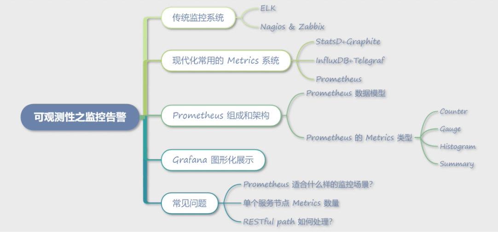

# **第九节 利用 Prometheus 和 Grafana 收集监控数据**

## **1、传统监控系统**

监控系统通常由指标采集子系统和数据处理子系统组成。

指标采集子系统主要负责信息采集、过滤、汇总和存储；

数据处理子系统主要负责数据分析、展现、预警和告警等。传统的监控系统一般有ELK 和 Nagios & Zabbix。

### **1-1 ELK**

ELK 是 Elastic 公司推出的监控系统，包含了 Elasticsearch、Logstash 和 Kibana，分别作为存储引擎、日志收集和前端展示系统。

**其中Elasticsearch 是核心，其他两个都可以替换，较常见的替换方案是 Filebeat 和 Graylog。**

* Filebeat 是由 Go 语言编写的轻量级日志收集工具。日志可以直接传输到 Elasticsearch 中，可以传输到 Logstash 进行一些数据处理。
* 而Graylog 是一套代替 ELK 的日志收集分析系统，其中保留了 Elasticsearch 的存储部分，提供了 collector-sidecar 用于日志收集，并继承了 Web 图形界面，用于搜索和图形化展示。

总体来说，ELK 是一套传统的可观测性系统，主要利用我们之前提到的可观测性组件之一——日志来提供监控功能，优点是数据准确性高，但由于日志需要存储和建立索引，成本会比较高

### **1-2 Nagios & Zabbix**

Nagios 和 Zabbix 都是传统的运维监控工具，主要监控主机、网络，以及业务进程端口的信息和状态。主要以插件的方式进行扩展，通过插件扩展可以检测主机的 CPU、内存、硬盘等信息，也可以检测各种不同的网络协议，**但对于检测微服务应用程序内的信息几乎是无能为力的**。

<mark>**应用自身的黄金指标（延时、通信量、饱和度、错误率）和一些业务级别的指标都需要实时的可观测。**</mark>

## **2、现代化常用的 Metrics 系统**

Metrics 主要是用时序性数据库记录每个时间点的监控数据，通过主动拉取或者程序上报的方式记录，然后实时计算一段时间的数据，并通过图形界面的方式展现出来。它的特点是实时性强、可观测指标丰富，适合查看一段时间内的指标趋势。

### **2-1 StatsD+Graphite**

StatsD 是 Node.js 编写的一个Metrics 指标采集系统，通过 UDP 协议将信息传输到后端程序，聚合后存储到 Graphite。

StatsD 包含三个组成部分，分别是：

* Client，各种语言使用的 SDK，用于将 Metrics 信息通过 UDP 的方式传送到 Server。
* Server，收集客户端传输的 Metrics 信息，聚合后发送到 Backend，也就是 Graphite。
* Backend，也就是上面提到的 Graphite，Graphite 是一个时序数据库，负责存储 Metrics 信息。

### **2-2 InfluxDB+Telegraf**

* **InfluxDB 是一个时序数据库，负责 Metrics 信息的存储**；
* Telegraf 是一套 Metrics 收集系统，默认自带非常丰富的插件，用于采集系统级别的信息，如果要采集应用维度的信息，则需要编写插件。


### **2-3 Prometheus**

Prometheus 是 Cloud Native Computing Foundation（简称：CNCF）生态圈的一员，也是整个 Kubernetes 生态中重要的一环，现已经广泛用于 Kubernetes 集群监控中。

Prometheus 与上面的两个 Metrics 系统最大的不同，是提供了一整套完整的监控告警解决方案，包含了数据采集、数据存储和告警。

另外还有两个非常重要的特性，也是现代化监控系统的必要标志：

* 采用了 pull 拉取的模型采集数据，简化了客户端的代码编写成本，并且 HTTP 协议非常利于调试。
* 支持服务发现，**默认支持了 Consul 和 Kubernetes 原生发现系统，避免了繁杂的机器信息配置**。


## **3、Prometheus 组成和架构**

### **3-1 Prometheus 架构模块构成**

* **Prometheus Server**：用于收集和存储 Metrics 数据。
* **Service Disvovery**：用于服务发现，获取服务对应的 EndPoint 用于数据采集，默认支持 DNS、Consul、Kubernestes 等多种发现方案。
* **PushGateway**：提供推送的方式采集数据，主要用于 Job 类，Job 类程序可能存活时间比较短，不适合采用拉取的方式。另外一些非常驻进程的脚本语言，比如 PHP，也需要使用此种方式。
* **Exporters**：用于一些第三方服务，通过转换提供符合 Prometheus 规范的 Metrics 信息，比如 Node Exporter 提供节点相关的信息。BlackBox 方便用户使用 HTTP、TCP 等方式对应用进程探活，以监控应用状态。
* **Client Library**：为各种语言提供的客户端库，提供 HTTP 服务的 Metrics 接口，当 Prometheus Server 拉取时，提供实时的 Metrics 数据。
* **Alertmanager**：告警管理器，接收 Prometheus Server 发来的告警信息，去除重复信息，分组后发送给相应的人员。通知方式支持 Email 和 WebHook 自定义等，一般会通过 WebHook 接入钉钉或者企业微信以达到实时报警的目的。

 

### **3-2 Prometheus 数据模型**

```
negri_http_request_total{client="serviceA",code="200",exported_service="serviceB",path="/ping"}
```

* Metrics 名字：首先是 Metrics 的名称，Metrics 的名称表明了这条数据的用途，比如上面这个数据是 Negri Sidecar 统计的总的请求数量。
* Label 标签：这条数据中的 client、code、`exported_service` 和 path 都是标签，通过标签可以组成不同的查询语句，从不同维度获取数据。


### **3-3 Prometheus 的 Metrics 类型**

#### **Counter**

**累加值，非常适合统计 QPS。**

这个数据从服务开始就不停地累加，比如上面提到的 `negri_http_request_total` 就是一种 Counter 类型。

**它统计了服务启动至目前所有请求的数据，通过 rate 或者 irate 就可以计算出一段时间内的 QPS。**Counter 类型是 Prometheus Server 端计算的，相对于下面讲到的 Gauge，**占用服务自身更少**，建议高性能的微服务首选此种类型。


#### **Gauge**

**适合记录瞬时值**，<mark>比如统计一些突发事件，例如是否产生了熔断、限流等事件</mark>。

因为是客户端 SDK 计算的，不太适合一些经常变化的数据。**如果数据是一直增加的，建议使用 Counter**；当然如果数据有增有减，也比较适合，因为监控中很少遇到增减比较频繁的数据。

```
degrade_events{event="eventBreakerOpenStatus",service="serviceB"}
```

#### **Histogram**

柱状图，适合统计服务的 99 延时等信息，比如下面的例子就是用于统计服务的延时状况：

```
negri_http_response_time_us_bucket{client="serviceA",exported_service="serviceB",le="0.5",path="/ping"}
```

如上述内容，可以通过查询语句绘制出 90 延时、95 延时、99 延时等指标， Histogram 和 Counter 类型一样，都是 Prometheus Server 端计算的，**所以非常适合高性能的场景使用**，相对于下面讲解的 Summary 有更小的损耗。

#### **Summary**

**类似于 Histogram，适合统计服务的 99 延时信息**。

Summary 和 Gauge 类型一样，都是在程序内计算的，所以并不能像 Histogram 一样，在绘制图形的时候灵活的设置百分位，

**但相对来说，Summary 的数据也更加精准**。


### **2-4 Grafana 图形化展示**

Grafana 是一套可视化监控指标工具，主要用于时序数据的展示，包括 Graphite、Elasticsearch、InfluxDB、Prometheus、CloudWatch、MySQL 和 OpenTSDB。这些数据源大多数我们在前面做过介绍。其中最常见的就是 Prometheus+Grafana 的组合。


 

通过 Grafana 展示服务一段时间内的运行状态，包括常见的 QPS、延时等信息。

 

### **2-5 常见问题**

#### **Prometheus 适合什么样的监控场景？**

Metrics 数据监控，并不适合要求数据 100% 准确的场景，**更多的是反映一段时间内某个数据指标的趋势和大概值**。采集数据是存在间隔的，计算数据也是有时间区间的，所以很难反映某一时刻的准确值，比如 CPU 的峰值，大概率会被平均掉。**如果要查看精准数据，最好通过日志的方式收集后检索查看**。

#### **单个服务节点 Metrics 数量限制**

Prometheus 虽然性能强大，但如果无规范的使用，随着采集数据节点增多，依然难以保证其稳定性。比如一些 RESTful 规范的 path（比如 /test/123，其中 123 为变量），如果不采取一些措施聚合，会造成 Metrics 爆炸。Metrics 的爆炸不仅会导致服务 OOM，也会导致 Prometheus 的内存使用量增大和检索变慢。

另外过多的标签变量、过多的 Histogram bucket，都会导致 Metrics 数量的增加。比如不合理地记录了调用端的来源 IP，同时也记录了服务自身的 IP，两者的 Metrics 数量就会变成乘积关系。这些不合理的指标不光会影响服务自身，也会影响 Prometheus 的稳定性，所以在输出 Metrics 信息的时候一定要注意，应该限制程序 Metrics 数量，加一个默认的上限条件。

#### **RESTful path 如何处理？**

无论是在 Metrics 系统中，还是 Trace 系统中，都会遇到此类问题。RESTful 格式的 path 在某一阶段非常流行，特别是在 PC 互联网时代非常适合搜索引擎的 SEO，而且看起来美观，所以被广泛使用。

如果说在 Web 客户端使用还有因可循，但在微服务架构的内网使用就完全不可理解了，毕竟内网无法被搜索引擎搜索到。

**所以在微服务架构中，如果使用 HTTP 协议作为通信协议，建议抛弃 RESTful 的做法**。

 

