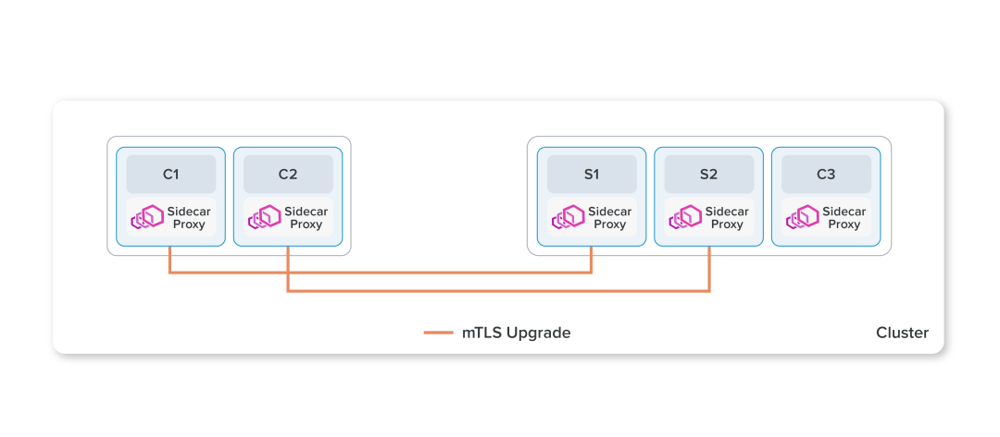
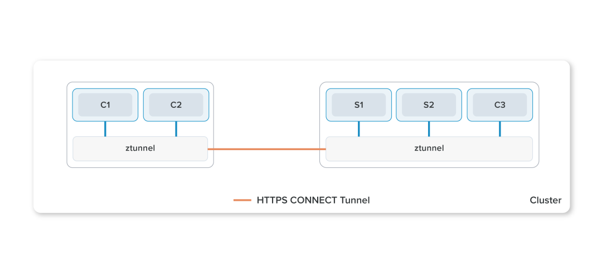
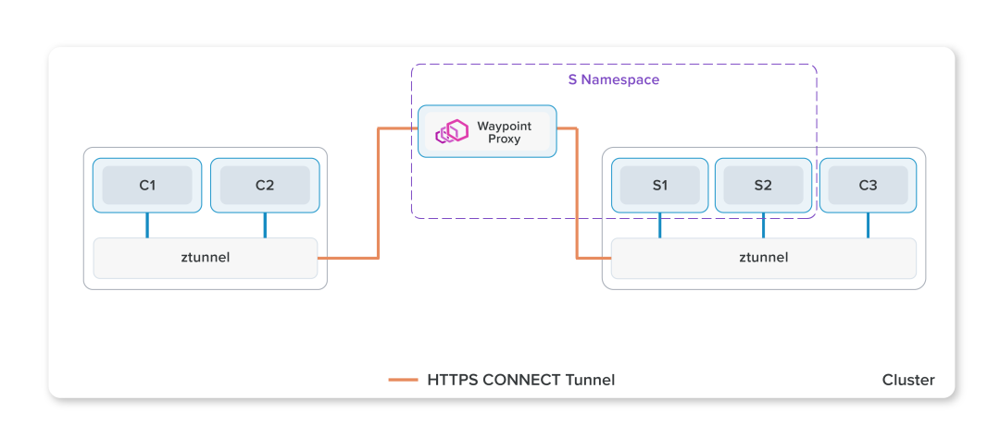
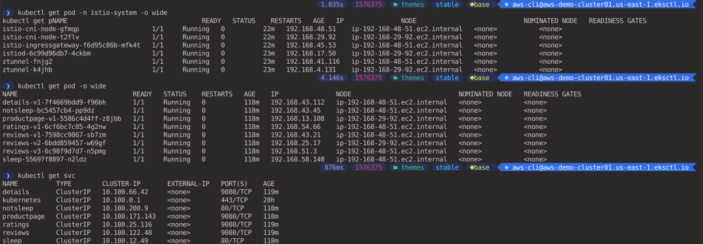
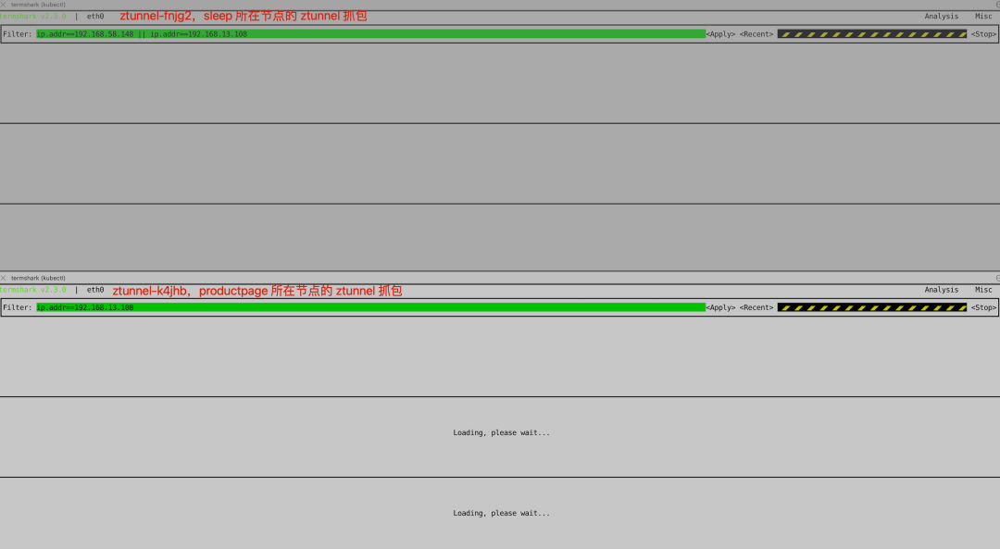
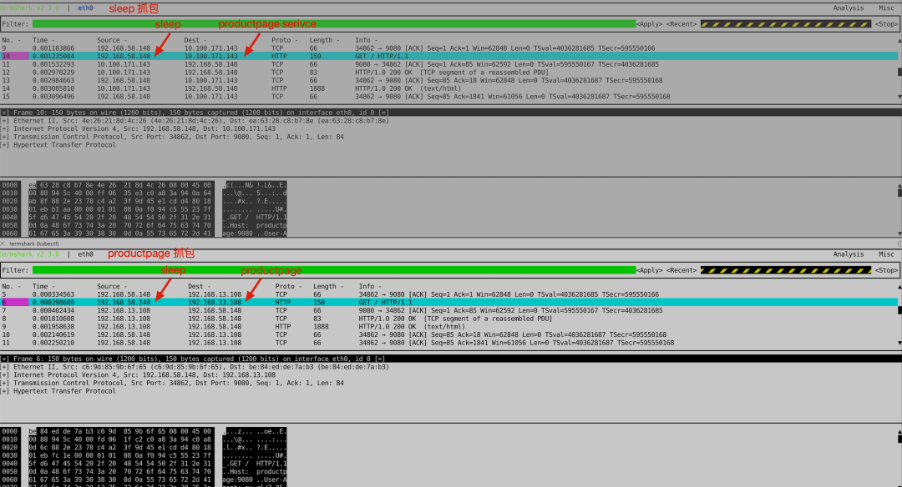
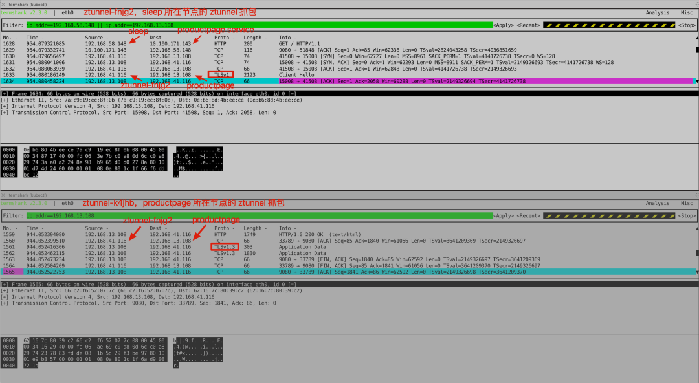

# **2 Istio Ambient Mesh 介绍**

## **1 Ambient Mesh 介绍**

Istio 的传统模式是将 Envoy proxy 作为 sidecar 部署在工作负载的 pod 中，虽然与重构应用程序相比，sidecar 具有显著的优势，但是仍然会产生一些限制：


* **侵入性**：sidecar 必须通过修改 Kubernetes Pod 的配置和重定向流量来“注入”应用程序。因此，安装和升级 sidecar 需要重新启动 Pod，这将会对工作负载产生影响。
* **资源利用率低**：由于在每个工作负载 Pod 都注入了 sidecar 代理 ，因此 Pod 必须为 sidecar 预留足够的 CPU 和内存资源，从而导致整个集群的资源利用率不足。
* **流量中断**：流量捕获和 HTTP 处理通常是由 Istio 的 sidecar 完成的，计算需要消耗大量的资源，并且可能会破坏一些不符合 HTTP 实现的应用程序。



**Istio ambient mesh 是 Istio 的一个无 sidecar 的数据平面**，旨在降低基础设施成本和提高性能。**它的本质是分离 sidecar proxy（Envoy）中的 L4 和 L7 功能，让一部分仅需要安全功能的用户可以最小阻力（低资源消耗、运维成本）地使用 Istio service mesh**。

ambient mesh 将 Istio 的功能拆分为 2 个不同的层次：

* L4 安全覆盖层：用户可以使用 TCP 路由，mTLS 和有限的可观测性等功能。
* L7 处理层：用户可以按需启用 L7 功能，以获得 Istio 的全部功能，例如限速，故障注入，负载均衡，熔断等等。


**ztunnel 是 ambient mesh 在每个节点上运行的共享代理，以 DaemonSet 的方式部署，处于类似于 CNI 的网格底层**。

**ztunnel 在节点间构建零信任的隧道（zero-trust tunnel, ztunnel），负责安全地连接和验证网格内的元素。**

在 ambient mesh 中的工作负载的所有流量会重定向到本地的 ztunnel 进行处理，ztunnel 识别流量的工作负载并为其选择正确的证书以建立 mTLS 连接。

ztunnel 实现了服务网格中的核心功能：**零信任，它会为启用了 ambient mesh 的 Namespace 中的工作负载创建一个安全覆盖层，提供 mTLS，遥测，认证和 L4 授权等功能，而无需终止或解析 HTTP**。



**在启用 ambient mesh 和创建安全覆盖层之后，可以选择性地为 namespace 启用 L7 功能，这允许命名空间实现全套的 Istio 功能，包括 Virtual Service、L7 遥测 和 L7 授权策略**。

waypoint proxy 可以根据所服务的 Namespace 的实时流量自动扩缩容，这将为用户节省大量的资源。



**Istio 会为根据服务的 service account 创建相应的 waypoint proxy**，可以帮助用户在减少资源消耗的情况下同时尽可能地缩小故障域，参见下图 Model III。 


## **2 Ambient Mesh 支持的环境和限制**

目前已知 ambient mesh 仅支持以下环境，其他环境目前尚未经过测试。

* GKE (without Calico or Dataplane V2)
* EKS
* kind

并且 ambient mesh 还有许多限制，例如：

* AuthorizationPolicy 在某些情况下没有预期的那么严格，或者根本无效。
* **在某些情况下直接访问 Pod IP 而不是 Service 的请求将无效**。
* ambient mesh 下的服务无法通过 LoadBalancer 和 NodePort 的方式访问，不过你可以部署一个入口网关（未启用 ambient mesh）以从外部访问服务；
* **STRICT mTLS 不能完全阻止明文流量**。
* **不支持 EnvoyFilter**。

详细说明请参见 [Ambient Mesh](https://github.com/istio/istio/blob/experimental-ambient/README.md)。

## **3 使用 Eksctl 在 AWS 上创建 Kubernetes 集群**

在本示例中，将使用 eksctl 在 AWS 上创建 EKS 集群来测试 Istio ambient mesh。[eksctl](https://eksctl.io/)  是一个用于管理 EKS（Amazon 托管 Kubernetes 服务）的 CLI 工具。有关 eksctl 的安装和使用参见 [eksctl Getting started](https://eksctl.io/introduction/#installation)

创建集群配置文件 cluster.yaml，我们将创建一个 2 个 Worker 节点的 EKS 集群，每个节点资源为 2C8G，集群版本为 1.23。

```
apiVersion: eksctl.io/v1alpha5
kind: ClusterConfig

metadata:
  name: aws-demo-cluster01
  region: us-east-1
  version: '1.23'

nodeGroups:
  - name: ng-1
    instanceType: m5.large
    desiredCapacity: 2
    volumeSize: 100
    ssh:
      allow: true # will use ~/.ssh/id_rsa.pub as the default ssh key
```

执行以下命令，创建 EKS 集群。

```
eksctl create cluster -f cluster.yaml
```
创建完成后，查看 EKS 集群。

```
> eksctl get cluster
NAME   REGION  EKSCTL CREATED
aws-demo-cluster01 us-east-1 True
```

执行以下命令，将 aws-demo-cluster01 集群的 kubeconfig 文件更新到 `~/.kube/config` 文件中，让我们本地的 kubectl 工具可以访问到 `aws-demo-cluster01` 集群。

```
aws eks update-kubeconfig --region us-east-1 --name aws-demo-cluster01
```

有关 aws CLI 工具的安装参见 [Installing or updating the latest version of the AWS CLI](https://docs.aws.amazon.com/cli/latest/userguide/getting-started-install.html) ，aws CLI 的认证参见 [Configuration basics](https://docs.aws.amazon.com/cli/latest/userguide/cli-configure-quickstart.html#cli-configure-quickstart-creds)。

## **4 下载 Istio**

根据对应操作系统下载支持 ambient mesh 的 istioctl 二进制文件和示例资源文件，参见 [Istio 下载](https://gcsweb.istio.io/gcs/istio-build/dev/0.0.0-ambient.191fe680b52c1754ee72a06b3e0d3f9d116f2e82)。其中 istioctl 的二进制文件可以在 bin 目录中找到，示例资源文件可以在 samples 目录中找到。

## **5 部署示例应用**

部署 Istio 示例的 Bookinfo 应用程序，以及 sleep 和 notsleep 两个客户端。sleep 和 notsleep 可以执行 curl 命令来发起 HTTP 请求。

```
kubectl apply -f samples/bookinfo/platform/kube/bookinfo.yaml
kubectl apply -f https://raw.githubusercontent.com/linsun/sample-apps/main/sleep/sleep.yaml
kubectl apply -f https://raw.githubusercontent.com/linsun/sample-apps/main/sleep/notsleep.yaml
```

当前我们部署的 istio 和应用的 Pod 和 Service 如下所示。



## **6 部署 Istio**

执行以下命令，安装 Istio，并指定 `profile=ambient` 参数部署 `ambient mesh` 相关的组件。


```
istioctl install --set profile=ambient
```

如果安装成功将会输出以下结果。

```
✔ Istio core installed
✔ Istiod installed
✔ Ingress gateways installed
✔ CNI installed
✔ Installation complete
```

安装完成以后我们在 istio-system 命名空间内可以看到以下组件：

* istiod：Istio 的核心组件。
* `istio-ingressgateway`：管理进出集群的南北向流量，在本示例中我们不会用到 `istio-ingressgateway`。
* `istio-cni`：为加入 ambient mesh 的 Pod 配置流量重定向，将 Pod 的进出流量重定向到相同节点的 ztunnel 上。
* **`ztunnel`：ztunnel 在节点间构建零信任的隧道，提供 mTLS，遥测，认证和 L4 授权等功能。**

```
> kubectl get pod -n istio-system
NAME                                   READY   STATUS    RESTARTS   AGE
istio-cni-node-gfmqp                   1/1     Running   0          100s
istio-cni-node-t2flv                   1/1     Running   0          100s
istio-ingressgateway-f6d95c86b-mfk4t   1/1     Running   0          101s
istiod-6c99d96db7-4ckbm                1/1     Running   0          2m23s
ztunnel-fnjg2                          1/1     Running   0          2m24s
ztunnel-k4jhb                          1/1     Running   0          2m24s  
```

## **7 抓包设置**

为了更直观地观察流量的访问情况 ，我们可以对 Pod 进行抓包，但是应用 Pod 并没有安装相关的抓包工具，这时候我们可以使用 `kubectl debug` 工具创建一个 `ephemeral` 临时容器共享容器的命名空间来进行调试。有关 kubectl debug 详情请参见调试运行中的 Pod。


在 4 个终端分别执行以下命令，对 sleep 和 productpage 以及两个节点上的 ztunnel Pod 进行抓包。`--image` 参数指定临时容器的镜像，这里使用的 nicolaka/netshoot 镜像中预装了 `tcpdump`, `tshark`, `termshark `等常用的网络抓包工具。

```
kubectl debug -it sleep-55697f8897-n2ldz  --image=nicolaka/netshoot 
kubectl debug -it productpage-v1-5586c4d4ff-z8jbb --image=nicolaka/netshoot
kubectl debug -it -n istio-system ztunnel-fnjg2 --image=nicolaka/netshoot 
kubectl debug -it -n istio-system ztunnel-k4jhb --image=nicolaka/netshoot
```

在 4 个终端分别执行 `termshark -i eth0` 命令，对 Pod 的 eth0 网卡进行抓包。

由于 `istio-cni` 会持续对 `ztunnel` 发起路径为 `/healthz/ready` 的HTTP 健康探测，为了避免该流量影响我们的观察，在 2 个 ztunnel Pod 中的 termshark Filter 框中设置以下过滤条件。

```
# ztunnel-fnjg2，sleep 所在节点的 ztunnel
ip.addr==192.168.58.148 || ip.addr==192.168.13.108

# ztunnel-k4jhb，productpage 所在节点的 ztunnel
ip.addr==192.168.13.108
```



## **8 未使用 Ambient Mesh 管理流量**

**由于当前 default Namespace 还没有加入 ambient mesh，此时应用的流量并不会经过 ztunnel**，Pod 之间通过 kubernetes 的 Service 进制进行通信，Pod 之间的流量也不会进行 mTLS 加密，而是以明文的方式进行传播。


使用 sleep 向 productpage 发起一次请求。

```
kubectl exec deploy/sleep -- curl -s http://productpage:9080/ | head -n1

# 返回结果，响应结果的第一行内容
<!DOCTYPE html>
```

查看 sleep 和 productpage 的抓包结果可以看到，sleep （192.168.58.148） 访问 productpage Service 名称 DNS 解析后的 service IP（10.100.171.143），经过 kubernetes Service 的转发后，最终访问到 productpage 的实际 Pod IP （192.168.13.108）。



此时 ambient mesh 还未接管 default Namespace 的流量，因此在 ztunnel 上不会抓到相关的数据包。


## **9 将 Default Namespace 加入 Ambient Mesh（L4 功能）**

为 default Namespace 添加 `istio.io/dataplane-mode=ambient` 标签，表示将该 Namespace 加入到 ambient mesh 中。

```
kubectl label namespace default istio.io/dataplane-mode=ambient
```

一旦 Namespace 加入 `ambient mesh`，**`istio-cni DaemonSet` 就会为该 Namespace 中的 Pod 设置 iptables 重定向规则，将 Pod 的所有出入流量重定向到运行在相同节点的 `ztunnel` 上**。


### **9.1 MTLS 流量加密**

**ztunnel 会为启用了 ambient mesh 的 Namespace 中的工作负载创建一个安全覆盖层，提供 mTLS，遥测，认证和 L4 授权等功能**。


为了方便查看，可以先清除先前在 sleep 和 productpage 上抓到的报文。


然后使用 sleep 向 productpage 发起一次请求。

```
kubectl exec deploy/sleep -- curl -s http://productpage:9080/ | head -n1
```

在 sleep 和 productpage 上依然可以抓到明文的数据包，只是这回在 productpage 上抓到的数据包的源 IP 变为的 sleep 所在节点的 ztunnel 的 IP 地址。


在 sleep 节点所在的 ztunnel 上我们可以抓到 sleep 发过来的明文的数据包，ztunnel 会对数据包进行加密以后发送给 productpage 节点上的 ztunnel。

productpage 节点上的 ztunnel 收到加密的数据包后，进行解密，然后发送给 productpage。



```
kubectl logs -n istio-system ztunnel-fnjg2 -f
```

我们可以看到 outbound 流量的日志中有（no waypoint proxy）的字样，ambient mesh 默认只进行 L4 处理，不会进行 L7 处理。因此此时流量只会通过 ztunnel ，不会经过 waypoint proxy。


查看 inbound 方向的流量日志（productpage 上的 ztunnel -> productpage）。

```
kubectl logs -n istio-system ztunnel-k4jhb -f
```


### **9.2 L4 授权策略**

安全覆盖层可以实现简单的 L4 授权策略，如下所示创建一个 `AuthorizationPolicy`，只允许 Service Account 是 sleep 的用户访问标签是 `app=productpage` 应用。

```
kubectl apply -f - <<EOF
apiVersion: security.istio.io/v1beta1
kind: AuthorizationPolicy
metadata:
 name: productpage-viewer
 namespace: default
spec:
 selector:
   matchLabels:
     app: productpage
 action: ALLOW
 rules:
 - from:
   - source:
       principals: ["cluster.local/ns/default/sa/sleep"]
EOF
```

分别在 sleep 和 notsleep 上执行以下请求，由于当前还没有启用 L7 处理，因此还无法针对 HTTP 请求方法，路径等条件进行限制。

```
# 成功
kubectl exec deploy/sleep -- curl -s http://productpage:9080/ | head -n1
# 成功
kubectl exec deploy/sleep -- curl -XDELETE -s http://productpage:9080/ | head -n1
# 失败，只允许 sa 是 sleep 的用户
kubectl exec deploy/notsleep -- curl -s http://productpage:9080/ | head -n1
```


## **10 启用 L7 功能**

**要为服务启用 L7 网格能力，需要显式创建一个 Gateway，注意创建的 Gateway 资源中的 gatewayClassName 必须设置为 istio-mesh**，这样 Istio 才会为 productpage 创建对应的 waypoint proxy。

任何发往 productpage 服务的流量都将经过 waypoint proxy 这个 L7 代理进行处理。

```
kubectl apply -f - <<EOF
apiVersion: gateway.networking.k8s.io/v1alpha2
kind: Gateway
metadata:
 name: productpage
 annotations:
   istio.io/service-account: bookinfo-productpage
spec:
 gatewayClassName: istio-mesh
EOF
```

**查看 Istio 为 productpage 创建的 waypoint proxy。**


从 sleep 访问 productpage。

```
kubectl exec deploy/sleep -- curl -s http://productpage:9080/ | head -n1
```

查看 outbound 方向的流量日志（sleep -> sleep node 上的 ztunnel -> waypoint proxy）。


```
kubectl logs -n istio-system ztunnel-fnjg2 -f
```

从下面的日志中可以看到（to server waypoint proxy）的字样，说明请求发往 waypoint proxy 进行处理。


### **10.1 L7 授权策略**

接下来更新 AuthorizationPolicy 只允许 Service Account 是 sleep 的用户通过 GET 的方式访问标签是 `app=productpage` 应用。

```
kubectl apply -f - <<EOF
apiVersion: security.istio.io/v1beta1
kind: AuthorizationPolicy
metadata:
 name: productpage-viewer
 namespace: default
spec:
 selector:
   matchLabels:
     app: productpage
 action: ALLOW
 rules:
 - from:
   - source:
       principals: ["cluster.local/ns/default/sa/sleep"]
   to:
   - operation:
       methods: ["GET"]
EOF
```

分别在 sleep 和 notsleep 上执行以下请求，这次在 sleep 上执行 HTTP DELETE 请求也会被拒绝了。

```
# 成功
kubectl exec deploy/sleep -- curl -s http://productpage:9080/ | head -n1
# 失败，RBAC 错误，因为不是 GET 请求
kubectl exec deploy/sleep -- curl -X DELETE -s http://productpage:9080/ | head -n1
# 失败，RBAC 错误，只允许 sa 是 sleep 的用户
kubectl exec deploy/notsleep -- curl -s http://productpage:9080/  | head -n1
```

### **10.2 可观测性**

在 `productpage waypoint proxy` 上可以查看所有对 productpage 服务请求的 L7 指标。

```
kubectl exec deploy/bookinfo-productpage-waypoint-proxy -- curl -s http://localhost:15020/stats/prometheus | grep istio_requests_total
```


### **10.3 流量控制**

首先为 reviews 服务创建一个 gateway，启用 L7 能力。

```
kubectl apply -f - <<EOF
apiVersion: gateway.networking.k8s.io/v1alpha2
kind: Gateway
metadata:
 name: reviews
 annotations:
   istio.io/service-account: bookinfo-reviews
spec:
 gatewayClassName: istio-mesh
EOF
```

**然后分别创建 VirtualService 和 DestinationRule 来控制流量以 90/10 的比例发往 v1 版本和 v2 版本的 reviews 服务。**

```
kubectl apply -f - <<EOF
apiVersion: networking.istio.io/v1alpha3
kind: VirtualService
metadata:
  name: reviews
spec:
  hosts:
    - reviews
  http:
  - route:
    - destination:
        host: reviews
        subset: v1
      weight: 90
    - destination:
        host: reviews
        subset: v2
      weight: 10
---
apiVersion: networking.istio.io/v1alpha3
kind: DestinationRule
metadata:
  name: reviews
spec:
  host: reviews
  trafficPolicy:
    loadBalancer:
      simple: RANDOM
  subsets:
  - name: v1
    labels:
      version: v1
  - name: v2
    labels:
      version: v2
  - name: v3
    labels:
      version: v3
EOF
```

执行以下命令，从 sleep 往 productpage 发送 10 个请求，可以看到大约有 10% 的流量流向了 `reviews-v2`。

```
# 注意访问路径是 http://productpage:9080/productpage，会调用 reviews 服务
kubectl exec -it deploy/sleep -- sh -c 'for i in $(seq 1 10); do curl -s http://productpage:9080/productpage | grep reviews-v.-; done'

# 返回结果
 <u>reviews-v1-7598cc9867-dh7hp</u>
 <u>reviews-v1-7598cc9867-dh7hp</u>
 <u>reviews-v1-7598cc9867-dh7hp</u>
 <u>reviews-v1-7598cc9867-dh7hp</u>
 <u>reviews-v2-6bdd859457-7lxhc</u>
 <u>reviews-v1-7598cc9867-dh7hp</u>
 <u>reviews-v1-7598cc9867-dh7hp</u>
 <u>reviews-v1-7598cc9867-dh7hp</u>
 <u>reviews-v1-7598cc9867-dh7hp</u>
 <u>reviews-v2-6bdd859457-7lxhc</u>
```

### **10.4 故障注入**

为 productpage 服务创建一个 VirtualService，在请求中注入 5s 的延时。

```
kubectl apply -f - <<EOF
apiVersion: networking.istio.io/v1alpha3
kind: VirtualService
metadata:
  name: productpage
spec:
  hosts:
    - productpage
  http:
  - route:
    - destination:
        host: productpage
    fault:
      delay:
         percentage:
            value: 100.0
         fixedDelay: 5s
EOF
```

从 sleep 访问 productpage，可以看到请求消耗的时间大约在 5s 左右。

```
> kubectl exec deploy/sleep -- time curl -s http://productpage:9080 | head -n 1

# 返回结果
<!DOCTYPE html>
real 0m 5.04s
user 0m 0.00s
sys     0m 0.00s
```

## **11 清理环境**

```
# 卸载 Istio
istioctl uninstall -y --purge && istioctl delete ns istio-system
# 删除示例应用
kubectl delete -f samples/bookinfo/platform/kube/bookinfo.yaml
kubectl delete -f https://raw.githubusercontent.com/linsun/sample-apps/main/sleep/sleep.yaml
kubectl delete -f https://raw.githubusercontent.com/linsun/sample-apps/main/sleep/notsleep.yaml
# 删除集群
eksctl delete cluster aws-demo-cluster01
```


## **12 体验 Demo**

想要快速体验 ambient mesh 的朋友也可以在 [solo.io 官网](https://academy.solo.io/get-started-with-istio-ambient-mesh-with-istio-ambient-mesh-foundation-certification) 上尝试上手教程。


* Istio 无 sidecar 代理数据平面 ambient 模式简介: https://lib.jimmysong.io/blog/introducing-ambient-mesh/
* 译文：Istio Ambient 模式安全架构深度解析: https://www.zhaohuabing.com/post/2022-09-09-ambient-mesh-security-deep-dive/
* 如何评价 Istio 新推出的 Ambient 模式？: https://mp.weixin.qq.com/s/98wXMdeutx0wHqcJUIFl8A
* 初探 Istio Ambient 模式: https://mp.weixin.qq.com/s/YA2My5PSHXIwovWLRKmsgA
* Istio Ambient 模式 HBONE 隧道原理详解 - 上: https://mp.weixin.qq.com/s/ksiYJEJKnit65KfIIGoN8Q
* Create a kubeconfig for Amazon EKS: https://docs.aws.amazon.com/eks/latest/userguide/create-kubeconfig.html
* Beyond Istio OSS —— Istio 服务网格的现状与未来: https://jimmysong.io/blog/beyond-istio-oss/#sidecar-management