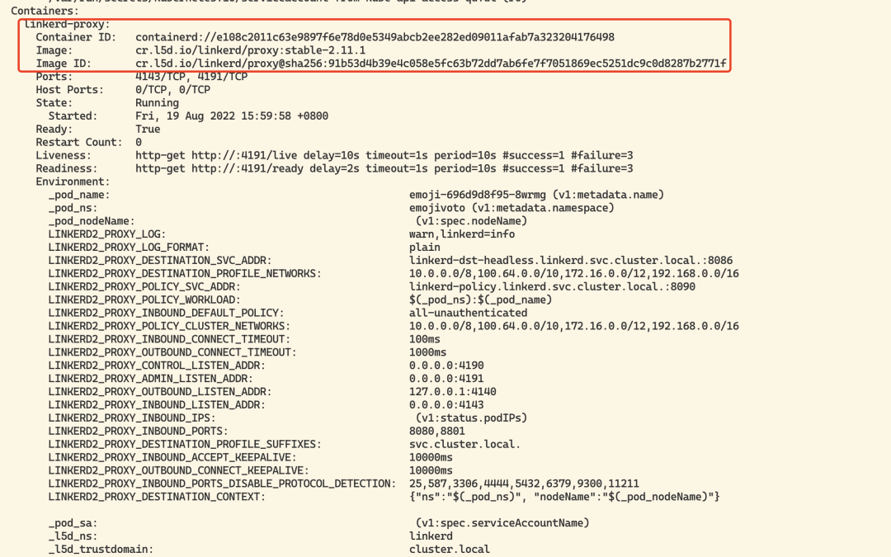
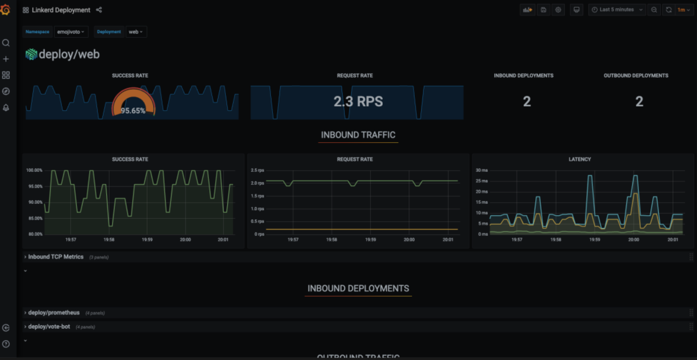

# **1 Linkerd Service Mesh 快速上手**

Linkerd 是 Kubernetes 的一个完全开源的服务网格实现。它通过为你提供运行时调试、可观测性、可靠性和安全性，使运行服务更轻松、更安全，所有这些都不需要对你的代码进行任何更改。

**Linkerd 通过在每个服务实例旁边安装一组超轻、透明的代理来工作**。

这些代理会自动处理进出服务的所有流量。由于它们是透明的，这些代理充当高度仪表化的进程外网络堆栈，向控制平面发送遥测数据并从控制平面接收控制信号。

**这种设计允许 Linkerd 测量和操纵进出你的服务的流量，而不会引入过多的延迟。为了尽可能小、轻和安全，Linkerd 的代理采用 Rust 编写。**

## **功能概述**

* **自动 mTLS**：Linkerd 自动为网格应用程序之间的所有通信启用相互传输层安全性 (TLS)。
* **自动代理注入**：Linkerd 会自动将数据平面代理注入到基于 annotations 的 pod 中。
* **容器网络接口插件**：Linkerd 能被配置去运行一个 CNI 插件，该插件自动重写每个 pod 的 iptables 规则。
* **仪表板和 Grafana**：Linkerd 提供了一个 Web 仪表板，以及预配置的 Grafana 仪表板。
* **分布式追踪**：您可以在 Linkerd 中启用分布式跟踪支持。
* **故障注入**：Linkerd 提供了以编程方式将故障注入服务的机制。
* **高可用性**：Linkerd 控制平面可以在高可用性 (HA) 模式下运行。
* **HTTP、HTTP/2 和 gRPC 代理**：Linkerd 将自动为 HTTP、HTTP/2 和 gRPC 连接启用高级功能（包括指标、负载平衡、重试等）。
* **Ingress**：Linkerd 可以与您选择的 ingress controller 一起工作。
* **负载均衡**：Linkerd 会自动对 HTTP、HTTP/2 和 gRPC 连接上所有目标端点的请求进行负载平衡。
* **多集群通信**：Linkerd 可以透明且安全地连接运行在不同集群中的服务。
* **重试和超时**：Linkerd 可以执行特定于服务的重试和超时。
* **服务配置文件**：Linkerd 的服务配置文件支持每条路由指标以及重试和超时。
* **TCP 代理和协议检测**：Linkerd 能够代理所有 TCP 流量，包括 TLS 连接、WebSockets 和 HTTP 隧道。
* **遥测和监控**：Linkerd 会自动从所有通过它发送流量的服务收集指标。
* **流量拆分(金丝雀、蓝/绿部署)**：Linkerd 可以动态地将一部分流量发送到不同的服务。


## **安装**

我们可以通过在本地安装一个 Linkerd 的 CLI 命令行工具，通过该 CLI 可以将 Linkerd 的控制平面安装到 Kubernetes 集群上。

所以首先需要在本地运行 kubectl 命令，确保可以访问一个可用的 Kubernetes 集群，如果没有集群，可以使用 KinD 在本地快速创建一个。

```
$ kubectl version --short
Client Version: v1.23.5
Server Version: v1.22.8
```

可以使用下面的命令在本地安装 Linkerd 的 CLI 工具：

```
$ curl --proto '=https' --tlsv1.2 -sSfL https://run.linkerd.io/install | sh
```

如果是 Mac 系统，同样还可以使用 Homebrew 工具一键安装：

```
$ brew install linkerd
```

同样直接前往 Linkerd Release 页面 [https://github.com/linkerd/linkerd2/releases/](https://github.com/linkerd/linkerd2/releases/) 下载安装即可。

安装后使用下面的命令可以验证 CLI 工具是否安装成功：

```
$ linkerd  version
Client version: stable-2.11.1
Server version: unavailable
```

正常我们可以看到 CLI 的版本信息，但是会出现 `Server version: unavailable` 信息，这是因为我们还没有在 Kubernetes 集群上安装控制平面造成的，所以接下来我们就来安装 Server 端。

Kubernetes 集群可以通过多种不同的方式进行配置，在安装 Linkerd 控制平面之前，我们需要检查并验证所有配置是否正确，要检查集群是否已准备好安装 Linkerd，可以执行下面的命令：

```
$ linkerd check --pre
Linkerd core checks
===================

kubernetes-api
--------------
√ can initialize the client
√ can query the Kubernetes API

kubernetes-version
------------------
√ is running the minimum Kubernetes API version
√ is running the minimum kubectl version

pre-kubernetes-setup
--------------------
√ control plane namespace does not already exist
√ can create non-namespaced resources
√ can create ServiceAccounts
√ can create Services
√ can create Deployments
√ can create CronJobs
√ can create ConfigMaps
√ can create Secrets
√ can read Secrets
√ can read extension-apiserver-authentication configmap
√ no clock skew detected

linkerd-version
---------------
√ can determine the latest version
√ cli is up-to-date

Status check results are √
```

如果一切检查都 OK 则可以开始安装 Linkerd 的控制平面了，直接执行下面的命令即可一键安装：

* 先按照CRD文件

```
$ linkerd install --crds
```

在此命令中，linkerd install 会生成一个 Kubernetes 资源清单文件，其中包含所有必要的控制平面资源，然后使用 kubectl apply 命令即可将其安装到 Kubernetes 集群中。


```
$ linkerd install --set proxyInit.runAsRoot=true | kubectl apply -f -

namespace/linkerd created
clusterrole.rbac.authorization.k8s.io/linkerd-linkerd-identity created
clusterrolebinding.rbac.authorization.k8s.io/linkerd-linkerd-identity created
serviceaccount/linkerd-identity created
clusterrole.rbac.authorization.k8s.io/linkerd-linkerd-destination created
...
```

可以看到会将 Linkerd 控制面安装到一个名为 linkerd 的命名空间之下，安装完成后会有如下几个 Pod 运行：

```
$ kubectl get pods -n linkerd
NAME                                      READY   STATUS    RESTARTS       AGE
linkerd-destination-5756d47547-hr5jf      4/4     Running   0              14m
linkerd-identity-76b6469bc-qhv6b          2/2     Running   0              31m
linkerd-proxy-injector-6d97596bd5-r6tgw   2/2     Running   8 (8m5s ago)   31m
```

安装完成后通过运行以下命令等待控制平面准备就绪，并可以验证安装结果是否正常：


```
$ linkerd check
Linkerd core checks
===================

kubernetes-api
--------------
√ can initialize the client
√ can query the Kubernetes API

kubernetes-version
------------------
√ is running the minimum Kubernetes API version
√ is running the minimum kubectl version

linkerd-existence
-----------------
√ 'linkerd-config' config map exists
√ heartbeat ServiceAccount exist
√ control plane replica sets are ready
√ no unschedulable pods
√ control plane pods are ready
√ cluster networks contains all pods

linkerd-config
--------------
√ control plane Namespace exists
√ control plane ClusterRoles exist
√ control plane ClusterRoleBindings exist
√ control plane ServiceAccounts exist
√ control plane CustomResourceDefinitions exist
√ control plane MutatingWebhookConfigurations exist
√ control plane ValidatingWebhookConfigurations exist
√ proxy-init container runs as root user if docker container runtime is used

linkerd-identity
----------------
√ certificate config is valid
√ trust anchors are using supported crypto algorithm
√ trust anchors are within their validity period
√ trust anchors are valid for at least 60 days
√ issuer cert is using supported crypto algorithm
√ issuer cert is within its validity period
√ issuer cert is valid for at least 60 days
√ issuer cert is issued by the trust anchor

linkerd-webhooks-and-apisvc-tls
-------------------------------
√ proxy-injector webhook has valid cert
√ proxy-injector cert is valid for at least 60 days
√ sp-validator webhook has valid cert
√ sp-validator cert is valid for at least 60 days
√ policy-validator webhook has valid cert
√ policy-validator cert is valid for at least 60 days

linkerd-version
---------------
√ can determine the latest version
√ cli is up-to-date

control-plane-version
---------------------
√ can retrieve the control plane version
√ control plane is up-to-date
√ control plane and cli versions match

linkerd-control-plane-proxy
---------------------------
√ control plane proxies are healthy
√ control plane proxies are up-to-date
√ control plane proxies and cli versions match

Status check results are √
```

**当出现上面的 `Status check results are √` 信息后表示 Linkerd 的控制平面安装成功了**。

除了使用 CLI 工具的方式安装控制平面之外，我们也可以通过 Helm Chart 的方式来安装，如下所示：

```
$ helm repo add linkerd https://helm.linkerd.io/stable


# set expiry date one year from now, in Mac:
$ exp=$(date -v+8760H +"%Y-%m-%dT%H:%M:%SZ")


# in Linux:
$ exp=$(date -d '+8760 hour' +"%Y-%m-%dT%H:%M:%SZ")

$ helm install linkerd2 \
  --set-file identityTrustAnchorsPEM=ca.crt \
  --set-file identity.issuer.tls.crtPEM=issuer.crt \
  --set-file identity.issuer.tls.keyPEM=issuer.key \
  --set identity.issuer.crtExpiry=$exp \
  linkerd/linkerd2
```

此外该 chart 包含一个 `values-ha.yaml` 文件， 它覆盖了一些默认值，以便在高可用性场景下进行设置， 类似于 `linkerd install` 中的 --ha 选项。我们可以通过获取 chart 文件来获得 `values-ha.yaml`：

```
$ helm fetch --untar linkerd/linkerd2
```

然后使用 `-f flag` 提供覆盖文件，例如：

```
## see above on how to set $exp
helm install linkerd2 \
  --set-file identityTrustAnchorsPEM=ca.crt \
  --set-file identity.issuer.tls.crtPEM=issuer.crt \
  --set-file identity.issuer.tls.keyPEM=issuer.key \
  --set identity.issuer.crtExpiry=$exp \
  -f linkerd2/values-ha.yaml \
  linkerd/linkerd2
```

采用哪种方式进行安装均可，到这里我们现在就完成了 Linkerd 的安装，重新执行 linkerd version 命令就可以看到 Server 端版本信息了：

```
linkerd version
Client version: stable-2.12.0
Server version: stable-2.12.0
```

## **示例**

接下来我们安装一个简单的示例应用 Emojivoto，**该应用是一个简单的独立 Kubernetes 应用程序，它混合使用 gRPC 和 HTTP 调用，允许用户对他们最喜欢的表情符号进行投票**。

通过运行以下命令可以将 Emojivoto 安装到 emojivoto 命名空间中：


```
$ curl -fsL https://run.linkerd.io/emojivoto.yml 
```

**`emojivoto.yml` **

```
apiVersion: v1
kind: Namespace
metadata:
  name: emojivoto
---
apiVersion: v1
kind: ServiceAccount
metadata:
  name: emoji
  namespace: emojivoto
---
apiVersion: v1
kind: ServiceAccount
metadata:
  name: voting
  namespace: emojivoto
---
apiVersion: v1
kind: ServiceAccount
metadata:
  name: web
  namespace: emojivoto
---
apiVersion: v1
kind: Service
metadata:
  name: emoji-svc
  namespace: emojivoto
spec:
  ports:
  - name: grpc
    port: 8080
    targetPort: 8080
  - name: prom
    port: 8801
    targetPort: 8801
  selector:
    app: emoji-svc
---
apiVersion: v1
kind: Service
metadata:
  name: voting-svc
  namespace: emojivoto
spec:
  ports:
  - name: grpc
    port: 8080
    targetPort: 8080
  - name: prom
    port: 8801
    targetPort: 8801
  selector:
    app: voting-svc
---
apiVersion: v1
kind: Service
metadata:
  name: web-svc
  namespace: emojivoto
spec:
  ports:
  - name: http
    port: 80
    targetPort: 8080
  selector:
    app: web-svc
  type: ClusterIP
---
apiVersion: apps/v1
kind: Deployment
metadata:
  labels:
    app.kubernetes.io/name: emoji
    app.kubernetes.io/part-of: emojivoto
    app.kubernetes.io/version: v9
  name: emoji
  namespace: emojivoto
spec:
  replicas: 1
  selector:
    matchLabels:
      app: emoji-svc
      version: v9
  template:
    metadata:
      labels:
        app: emoji-svc
        version: v9
    spec:
      containers:
      - env:
        - name: GRPC_PORT
          value: "8080"
        - name: PROM_PORT
          value: "8801"
        image: buoyantio/emojivoto-emoji-svc:v9
        name: emoji-svc
        ports:
        - containerPort: 8080
          name: grpc
        - containerPort: 8801
          name: prom
        resources:
          requests:
            cpu: 100m
      serviceAccountName: emoji
---
apiVersion: apps/v1
kind: Deployment
metadata:
  labels:
    app.kubernetes.io/name: vote-bot
    app.kubernetes.io/part-of: emojivoto
    app.kubernetes.io/version: v9
  name: vote-bot
  namespace: emojivoto
spec:
  replicas: 1
  selector:
    matchLabels:
      app: vote-bot
      version: v9
  template:
    metadata:
      labels:
        app: vote-bot
        version: v9
    spec:
      containers:
      - command:
        - emojivoto-vote-bot
        env:
        - name: WEB_HOST
          value: web-svc.emojivoto:80
        image: buoyantio/emojivoto-web:v9
        name: vote-bot
        resources:
          requests:
            cpu: 10m
---
apiVersion: apps/v1
kind: Deployment
metadata:
  labels:
    app.kubernetes.io/name: voting
    app.kubernetes.io/part-of: emojivoto
    app.kubernetes.io/version: v9
  name: voting
  namespace: emojivoto
spec:
  replicas: 1
  selector:
    matchLabels:
      app: voting-svc
      version: v9
  template:
    metadata:
      labels:
        app: voting-svc
        version: v9
    spec:
      containers:
      - env:
        - name: GRPC_PORT
          value: "8080"
        - name: PROM_PORT
          value: "8801"
        image: buoyantio/emojivoto-voting-svc:v9
        name: voting-svc
        ports:
        - containerPort: 8080
          name: grpc
        - containerPort: 8801
          name: prom
        resources:
          requests:
            cpu: 100m
      serviceAccountName: voting
---
apiVersion: apps/v1
kind: Deployment
metadata:
  labels:
    app.kubernetes.io/name: web
    app.kubernetes.io/part-of: emojivoto
    app.kubernetes.io/version: v9
  name: web
  namespace: emojivoto
spec:
  replicas: 1
  selector:
    matchLabels:
      app: web-svc
      version: v9
  template:
    metadata:
      labels:
        app: web-svc
        version: v9
    spec:
      containers:
      - env:
        - name: WEB_PORT
          value: "8080"
        - name: EMOJISVC_HOST
          value: emoji-svc.emojivoto:8080
        - name: VOTINGSVC_HOST
          value: voting-svc.emojivoto:8080
        - name: INDEX_BUNDLE
          value: dist/index_bundle.js
        image: buoyantio/emojivoto-web:v9
        name: web-svc
        ports:
        - containerPort: 8080
          name: http
        resources:
          requests:
            cpu: 100m
      serviceAccountName: web
```

该应用下可以看到一共包含 4 个 Pod 服务。


```
$ kubectl get pod -n emojivoto
NAME                        READY   STATUS    RESTARTS   AGE
emoji-79b7665b88-4j96m      1/1     Running   0          8s
vote-bot-86d4645dc7-mm4ct   1/1     Running   0          8s
voting-f86cc8d89-cct2t      1/1     Running   0          8s
web-8578749657-hb57h        1/1     Running   0          8s

$ kubectl get svc -n emojivoto
NAME         TYPE        CLUSTER-IP       EXTERNAL-IP   PORT(S)             AGE
emoji-svc    ClusterIP   10.105.148.26    <none>        8080/TCP,8801/TCP   2m26s
voting-svc   ClusterIP   10.100.203.107   <none>        8080/TCP,8801/TCP   2m26s
web-svc      ClusterIP   10.106.94.83     <none>        80/TCP              2m26s
```

我们可以通过 `port-forward` 来暴露 web-svc 服务，然后便可在浏览器中访问该应用。

```
$ kubectl -n emojivoto port-forward svc/web-svc 8080:80
Forwarding from 127.0.0.1:8080 -> 8080
Forwarding from [::1]:8080 -> 8080
Handling connection for 8080
```

现在我们可以在浏览器通过 http://localhost:8080 访问 Emojivoto 应用了。

 

我们可以选择页面中喜欢的表情进行投票，但是选择某些表情后会出现一些错误，比如当我们点击甜甜圈表情符号的时候会得到一个 404 页面。

 

 

不过不用担心，这是应用中故意留下的错误，为的是后面使用 Linkerd 来识别该问题。

接下来我们可以将上面的示例应用加入到 Service Mesh 中来，向其添加 Linkerd 的数据平面代理，直接运行下面的命令即可将 Emojivoto 应用网格化：

```
$ kubectl get -n emojivoto deploy -o yaml \
>  | linkerd inject - \
>  | kubectl apply -f -

deployment "emoji" injected
deployment "vote-bot" injected
deployment "voting" injected
deployment "web" injected

deployment.apps/emoji configured
deployment.apps/vote-bot configured
deployment.apps/voting configured
deployment.apps/web configured
```

上面的命令首先获取在 emojivoto 命名空间中运行的所有 Deployments，然后通过 linkerd inject 运行它们的清单，然后将其重新应用到集群。

注意 `linkerd inject` 命令只是在 Pod 规范中添加一个 `linkerd.io/inject: enabled` 的注解，并不会直接注入一个 Sidecar 容器，该注解即可指示 Linkerd 在创建 Pod 时将代理注入到其中，所以执行上面的命令后应用 Pod 中会新增一个 sidecar 的代理容器。

```
$ kubectl get pods -n emojivoto
NAME                        READY   STATUS    RESTARTS   AGE
emoji-6fd4b555c7-pbnck      2/2     Running   0          2m51s
vote-bot-7bf6bc7c5b-5j66j   2/2     Running   0          2m51s
voting-5db96b44c4-wk7bb     2/2     Running   0          2m51s
web-5fdb59bc88-76g2t        2/2     Running   0          2m51s
```

可以看到每个 Pod 现在都有 2 个容器，相较于之前多了一个 Linkerd 的 sidecar 代理容器。

 

当应用更新完成后，我们就成功将应用引入到 Linkerd 的网格服务中来了，新增的代理容器组成了数据平面，我们也可以通过下面的命令检查数据平面状态：

```
$  linkerd -n emojivoto check --proxy
Linkerd core checks
===================

kubernetes-api
--------------
√ can initialize the client
√ can query the Kubernetes API

kubernetes-version
------------------
√ is running the minimum Kubernetes API version
√ is running the minimum kubectl version

linkerd-existence
-----------------
√ 'linkerd-config' config map exists
√ heartbeat ServiceAccount exist
√ control plane replica sets are ready
√ no unschedulable pods
√ control plane pods are ready
√ cluster networks contains all pods

linkerd-config
--------------
√ control plane Namespace exists
√ control plane ClusterRoles exist
√ control plane ClusterRoleBindings exist
√ control plane ServiceAccounts exist
√ control plane CustomResourceDefinitions exist
√ control plane MutatingWebhookConfigurations exist
√ control plane ValidatingWebhookConfigurations exist
√ proxy-init container runs as root user if docker container runtime is used

linkerd-identity
----------------
√ certificate config is valid
√ trust anchors are using supported crypto algorithm
√ trust anchors are within their validity period
√ trust anchors are valid for at least 60 days
√ issuer cert is using supported crypto algorithm
√ issuer cert is within its validity period
√ issuer cert is valid for at least 60 days
√ issuer cert is issued by the trust anchor

linkerd-webhooks-and-apisvc-tls
-------------------------------
√ proxy-injector webhook has valid cert
√ proxy-injector cert is valid for at least 60 days
√ sp-validator webhook has valid cert
√ sp-validator cert is valid for at least 60 days
√ policy-validator webhook has valid cert
√ policy-validator cert is valid for at least 60 days

linkerd-identity-data-plane
---------------------------
√ data plane proxies certificate match CA

linkerd-version
---------------
√ can determine the latest version
√ cli is up-to-date

linkerd-control-plane-proxy
---------------------------
√ control plane proxies are healthy
√ control plane proxies are up-to-date
√ control plane proxies and cli versions match

linkerd-data-plane
------------------
√ data plane namespace exists
√ data plane proxies are ready
√ data plane is up-to-date
√ data plane and cli versions match
√ data plane pod labels are configured correctly
√ data plane service labels are configured correctly
√ data plane service annotations are configured correctly
√ opaque ports are properly annotated

Status check results are √
```

当然，我们还是可以通过 `http://localhost:8080` 访问应用，当然在使用上和之前没什么区别，我们可以通过 Linkerd 去查看应用实际上做了哪些事情，但是我们需要去单独安装一个插件，


由于 Linkerd 的核心控制平面非常轻量级， 所以 Linkerd 附带了一些插件，这些插件为 Linkerd 添加了一些非关键但通常有用的功能，包括各种仪表板，比如我们可以安装一个 viz 插件，Linkerd-Viz 插件包含 Linkerd 的可观察性和可视化组件。安装命令如下所示：


```
$  linkerd viz install | kubectl apply -f -

....
namespace/linkerd-viz created
clusterrole.rbac.authorization.k8s.io/linkerd-linkerd-viz-metrics-api created
clusterrolebinding.rbac.authorization.k8s.io/linkerd-
```

上面的命令会创建一个名为 linkerd-viz 的命名空间，会在该命名空间中安装监控相关的应用，比如 Prometheus、Grafana 等。

```
$ kubectl get pods -n linkerd-viz
NAME                            READY   STATUS    RESTARTS   AGE
metrics-api-568596fbbb-dsgb8    2/2     Running   0          34m
prometheus-75c46f88b5-lzhxf     2/2     Running   0          34m
tap-756c88b45f-wtbrf            2/2     Running   0          34m
tap-injector-69c7d96674-h86w5   2/2     Running   0          34m
web-65557589c8-svb9k            2/2     Running   0          34m
```

安装完成后，我们可以使用下面的命令打开一个 dashboard 页面：


```
$ linkerd viz dashboard &
[1] 68487


$ Linkerd dashboard available at:
http://localhost:50750
Grafana dashboard available at:
http://localhost:50750/grafana
Opening Linkerd dashboard in the default browser
```

当 viz 插件部署完成后，执行上面的命令后会自动在浏览器中打开一个 Linkerd 的可观察性的 Dashboard。

此外我们也可以通过 Ingress 来暴露 viz 服务，创建如下所示的资源对象：

```
apiVersion: networking.k8s.io/v1
kind: Ingress
metadata:
  name: web-ingress
  namespace: linkerd-viz
  annotations:
    nginx.ingress.kubernetes.io/upstream-vhost: $service_name.$namespace.svc.cluster.local:8084
    nginx.ingress.kubernetes.io/configuration-snippet: |
      proxy_set_header Origin "";
      proxy_hide_header l5d-remote-ip;
      proxy_hide_header l5d-server-id;
spec:
  ingressClassName: nginx
  rules:
    - host: linkerd.k8s.local
      http:
        paths:
          - path: /
            pathType: Prefix
            backend:
              service:
                name: web
                port:
                  number: 8084
```

应用后就可以通过 linkerd.k8s.local 访问 viz 了。

 


还可以显示自动生成的拓扑图。


在页面上我们可以找到每个 Emojivoto 组件的实时指标，就可以确定哪个组件出现了部分故障了，这样就可以有针对性的去解决问题了。

在对应的资源后面包含一个 Grafana 的图标，点击可以自动跳转到 Grafana 的监控页面。

