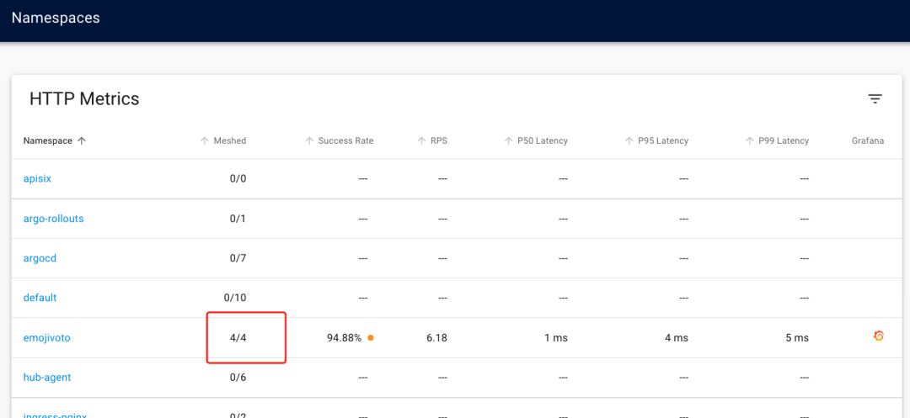
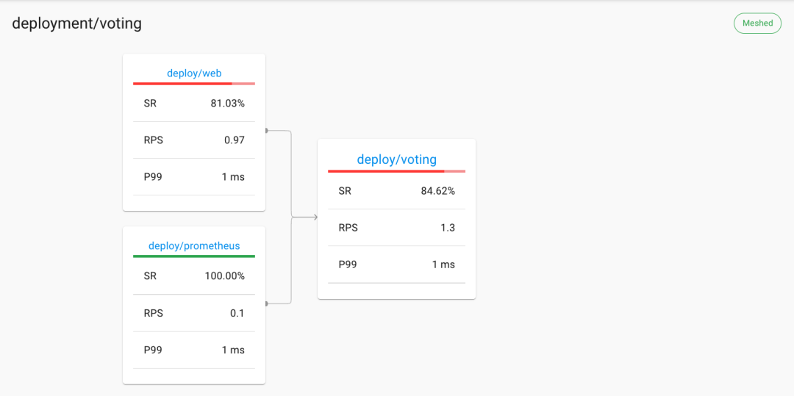
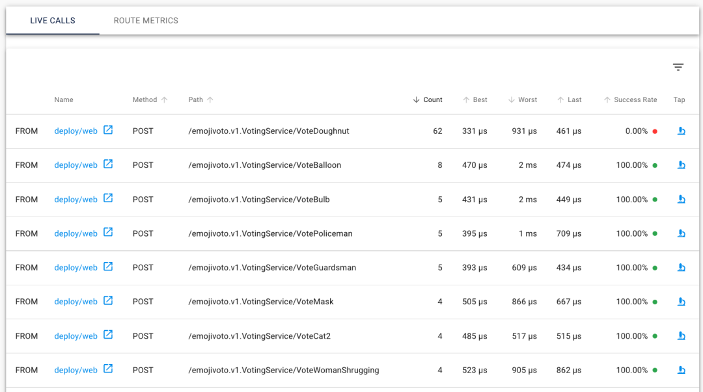
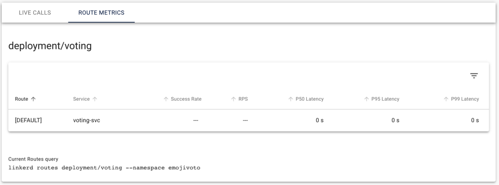
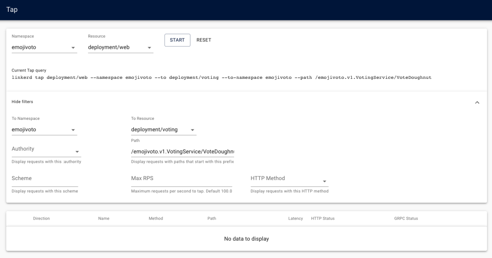
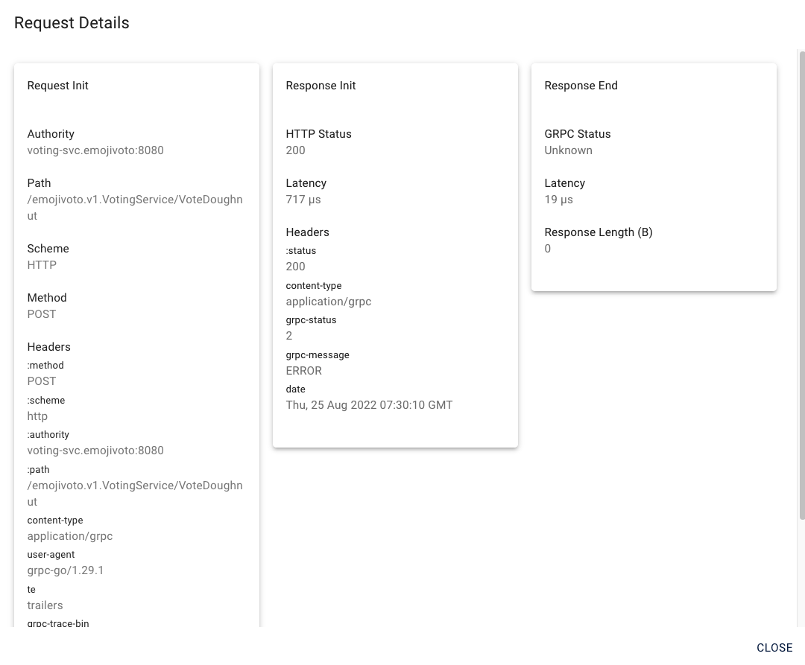
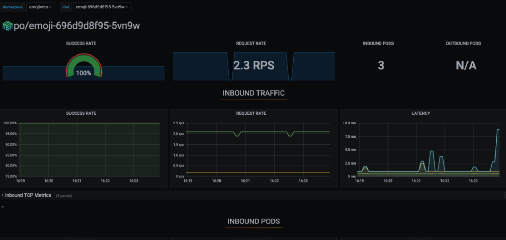

# **2 在 Linkerd 中获取应用的黄金指标**


```
kubectl get ns linkerd-viz -o json > linkerd-viz.json
kubectl proxy


curl -k -H "Content-Type: application/json" -X PUT --data-binary @linkerd-viz.json http://127.0.0.1:8001/api/v1/namespaces/linkerd-viz/finalize
```


我们将详细了解这些指标，并使用 Emojivoto 示例应用程序了解它们的含义。

我们先简单了解下服务健康黄金指标的经典定义：

* **Latency（延迟）**
* **Error rate（错误率）**
* **Traffic volume（流量）**
* **Saturation（饱和度）**

Linkerd 的价值不仅仅在于它可以提供这些指标，毕竟，我们可以非常简单地直接检测应用程序代码。相反，Linkerd 的价值在于它可以在整个应用程序中以统一的方式提供这些指标，并且不需要更改应用程序代码。换句话说，无论是谁编写的，它使用什么框架，它是用什么语言编写的，以及它做什么，Linkerd 都可以为你的服务提供这些指标。

### **Latency**

延迟是响应请求所需的时间，对于 Linkerd，是通过 Linkerd 代理向应用程序发送请求和接收响应之间经过的时间来进行衡量的，因为它在请求之间可能会有很大差异，所以指定时间段的延迟通常作为统计分布来衡量，并报告为此分布的百分位数。

Linkerd 能够报告常用的延迟指标例如 p50、p95、p99 和 p999，对应于 50、95、99 和 99.9 的百分位数。请求的延迟分布，这些被称为“尾部延迟”，通常是报告大规模系统行为的重要指标。


### **Error rate**

错误率是被视为错误响应的百分比，对于 Linkerd，是通过 HTTP 状态码来衡量的：**2xx 和 4xx 响应被认为是成功的，5xx 响应被认为是失败的，当然反过来我们也可以说 Linkerd 报告的是成功率而不是错误率**。

需要注意虽然 4xx HTTP 响应码对应于各种形式的“未找到您请求的资源”，但这些是服务器方面的正确响应，而不是错误响应。**因此，Linkerd 认为这些请求是成功的，因为服务器按照它的要求做了。**


### **Traffic volume**

流量是对系统的需求量度，在 Linkerd 的上下文中，这被测量为请求率，例如每秒请求数 (RPS)。Linkerd 简单地通过计算它代理到应用程序的请求来计算这一点。

另外也需要注意由于 Linkerd 可以自动重试请求，因此它提供了两种流量度量：**实际（对应请求，包括重试）和有效（对应不重试的请求）**。

如果客户端向中间有 Linkerd 的服务器发出请求，则有效计数将是客户端发出的请求数；实际计数将是服务器收到的请求数。

### **Saturation**

饱和度是对服务可用的总资源消耗的度量，例如 CPU、内存。与其他服务网格一样，Linkerd 没有直接的机制来衡量饱和度，但是，延迟通常是一个很好的近似值。

谷歌 SRE 书籍说：

> 延迟增加通常是饱和的主要指标，在某个小窗口（例如一分钟）内测量你的第 99 个百分位响应时间可以给出非常早期的饱和信号。

所以我们这里主要使用另外三个黄金指标：成功率、请求率和延迟。

最后一点是，虽然 Linkerd 可以代理任何 TCP 流量，但这些黄金指标仅适用于使用 HTTP 或 gRPC 的服务。**这是因为这些指标需要第 7 层或协议级别的理解才能计算。一个 HTTP 请求具有成功和不成功请求的概念，任意的 TCP 字节流不会。**

## **Linkerd Dashboard 中查看指标**

上面我们了解了这些指标，接下来我们再来看看前面部署的 Emojivoto 应用。

```
$ kubectl get pods -n emojivoto
NAME                        READY   STATUS    RESTARTS        AGE
emoji-696d9d8f95-5vn9w      2/2     Running   2 (5h11m ago)   41h
vote-bot-6d7677bb68-jvxsg   2/2     Running   2 (5h11m ago)   41h
voting-ff4c54b8d-jjpkm      2/2     Running   2 (5h11m ago)   41h
web-5f86686c4d-58p7k        2/2     Running   2 (5h11m ago)   41h
```
Emojivoto 应用是一个 gRPC 服务，一共包含三个微服务：

* web：用户与之交互的前端服务
* emoji：提供表情列表的 API 服务
* voting：提供为表情投票的 API 服务

我们已经将该应用引入到网格中来了，能够在 Linkerd 仪表板中查看 Emojivoto 应用的指标了，当我们打开 Viz 的仪表板的时候，默认会显示集群的所有命名空间列表，其中有一个非常大的区别是命名空间列表中的 emojivoto 项目现在在 Meshed 列下显示为 4/4。

 

单击 emojivoto 链接可查看命名空间的详细信息，包括“章鱼”图，显示服务如何通过网络连接相互关联的。请记住这张图片，因为我们将使用 CLI 工具查看相同的信息。

 

此外还可以看到我们上面讨论过的黄金指标：p50、p95 和 p99 延迟、服务的成功/错误率以及请求量，**即每秒请求数(RPS)。从成功率一列可以看出其中一项服务有一些错误**。

 

该 Deployment 级别信息是处理应用程序请求的所有 Pod 的指标的聚合，我们向下滚动页面的时候，可以看到每个 Pod 对应的指标。我们可以通过增加 web 服务的副本数来进行验证。

执行下面的命令将 web 服务增加到两个副本：

```
$ kubectl scale deploy/web -n emojivoto --replicas=2
```

执行此命令后，仪表板将自行更新，Web 应用将在 Meshed 列下显示为 2/2，此外，你将在 Pod 部分下看到另一个 Web pod。

 

 

通过观察 Deployments 和 Pods 部分的数据，可以看到 Deployments 中的指标数据的确就是 Pods 的指标聚合数据。最后我们再来看看 Linkerd 提供的 TCP 级别的指标，在 emojivoto 命名空间的页面底部，会显示 TCP 连接数以及每个 Pod 读取和写入的字节数

 

TCP 的指标比 7 层的指标会更少，例如在任意 TCP 字节流中没有请求的概念。尽管如此，这些指标在调试应用程序的连接级别问题时仍然很有用。

接下来我们将继续探索仪表板并查看让我们实时查看流量的 Tap 功能。

到目前为止，我们已经可以使用仪表板来获取 Emojivoto 应用程序中服务的聚合性能指标了。现在让我们使用仪表板通过 Linkerd 提供的 tap 功能实时查看流量。

在仪表板中，我们可以看到 voting 服务的成功率低于 100%，让我们使用 tap 功能来查看对服务的请求，来尝试弄清楚发生了什么。

 

单击 emojivoto 应用的 voting 链接可以深入了解详细信息，我们将看到的第一件事是显示 voting 微服务与应用程序中其他微服务之间关系的图表。

 

在图表下方，我们可以看到一个 LIVE CALLS 的选项卡，**其中显示了对 voting 服务的实时调用！每次调用时，表中的行都会更新有关请求的相关信息，包括响应的 HTTP 状态**。


 

在我们详细了解这些实时调用之前，**我们可以点击 Route Metrics 选项卡来查看 voting 服务的路由表以及每个路由的指标，在我们这里只有一个名为 Default 的路由，它是为每个服务创建的**。

 

现在我们知道了如何在仪表板中查找实时调用，现在我们来尝试下看看是否可以找到其中一个失败的调用并使用仪表板中的 tap 功能。当我们看到对路径 `/emojivoto/v1.VotingService/VoteDoughnut` 的请求，请单击其右侧的显微镜图标跳转到 Tap 页面。

 


其实通过查看成功率这一列的数据很容易发现该路径请求有错误。

Tap 页面包含一个多个字段的表单，这些字段已根据我们点击的特定请求的链接预先填充了，比如我们这里 Path、Namespace、Resource 等字段都已经被自动填充上了，下面还有一个输出显示正在运行的当前 Tap 查询。

 

现在我们点击 Tap 页面顶部的 START 按钮，开始对投票服务的 /`emojivoto.v1.VotingService/VoteDougNut` 路径的请求，几秒钟后，下方的列表将开始填充 VoteDougNut 路径的传入请求。

 

我们可以单击左侧的箭头来查看包含请求信息的对话框。

 

这就是通过 Linkerd 仪表板中使用 Tap 的方式，我们还可以继续更改表单字段中的值并使用不同的查询来查看不同的请求，例如我们可以将 `Path` 字段中的 `/emojivoto.v1.VotingService/VoteDoughnut` 值删掉，并将 `To Resource` 设置为 `Deployment`，当我们点击开始按钮后，我们将可以看到从 Web 服务发送的所有流量。

现在我们已经知道如何使用 Tap 查看服务的流量指标，接下来让我们通过查看 Linkerd 的 Grafana 仪表板来了解这些指标是如何使用的。

## **Grafana 中展示指标**

Linkerd 的 Viz 插件内置了 Grafana，Linkerd 使用 Grafana 为部署到 Kubernetes 的应用程序添加了额外的可观察性数据。

在浏览仪表板时，你可能已经注意到了 Grafana 图标，这里我们以 emoji 微服务为例对 Grafana 图表进行说明

在 Linkerd 仪表板的 emojivoto 命名空间中，单击 emoji 行最右侧列中的 Grafana 图标，会打开 Grafana 仪表板以显示 emoji 微服务的相关图表，这些页面上的图表显示了 Linkerd 仪表板中显示的指标的时间序列数据，这里我们看到的就是 emoji 服务随着时间推移的服务性能变化。

 

Grafana 仪表板上的图表包括我们的标准黄金指标集：

* Success rate
* Request rate
* Latencies

随时间查看黄金指标图表的能力是了解应用程序性能的非常强大的工具。以时间序列的形式查看这些指标可以让你了解，例如，当流量负载增加时服务的执行情况，或者在进行更新以添加功能或修复错误时，服务的一个版本与另一个版本的比较情况。

Grafana 仪表板的优点在于你无需执行任何操作即可创建它们，Linkerd 使用动态模板为每个注入 Linkerd 代理和部分服务网格的 Kubernetes 资源生成仪表板和图表。我们可以在 Grafana 仪表板的左上角，单击 Linkerd Deployment 链接以打开可用仪表板列表。

比如我们可以点击 Linkerd Pod 仪表盘，查看与 emoji 服务相关的一个 Pod 的图表，仪表板中显示了单个 Pod 的相同的黄金指标，这与 Deployment 仪表板不同，因为 Deployment 仪表板显示了与 Deployment 相关的所有 Pod 的汇总指标。

 

## **Linkerd CLI 命令查看指标**


Linkerd 仪表板功能很强大，因为它在基于浏览器的界面中显示了大量指标，如果你不想使用浏览器的话，那么我们可以使用 Linkerd CLI 命令行工具，CLI 在终端中提供了仪表板相同的功能。

**我们可以使用如下所示的命令来显示 `emojivoto` 命名空间中从` Web` 服务通过 `/emojivoto.v1.VotingService/VoteDoughnut` 路径到投票服务的所有流量**：

```
$ linkerd viz tap deployment/web --namespace emojivoto --to deployment/voting --path /emojivoto.v1.VotingService/VoteDoughnut

req id=3:0 proxy=out src=10.244.2.71:41226 dst=10.244.1.95:8080 tls=true :method=POST :authority=voting-svc.emojivoto:8080 :path=/emojivoto.v1.VotingService/VoteDoughnut
rsp id=3:0 proxy=out src=10.244.2.71:41226 dst=10.244.1.95:8080 tls=true :status=200 latency=1128µs
end id=3:0 proxy=out src=10.244.2.71:41226 dst=10.244.1.95:8080 tls=true grpc-status=Unknown duration=183µs response-length=0B
```

此外我们还通过使用 -o json 标志指定输出数据为 JSON 格式，以获取更多详细信息，如下所示：

```
$ linkerd viz tap deployment/web --namespace emojivoto --to deployment/voting --path /emojivoto.v1.VotingService/VoteDoughnut -o json

{
  "source": {
    "ip": "10.244.1.108",
    "port": 59370,
    "metadata": {
      "control_plane_ns": "linkerd",
      "deployment": "web",
      "namespace": "emojivoto",
      "pod": "web-5f86686c4d-58p7k",
      "pod_template_hash": "5f86686c4d",
      "serviceaccount": "web",
      "tls": "loopback"
    }
  },
  "destination": {
    "ip": "10.244.1.95",
    "port": 8080,
    "metadata": {
      "control_plane_ns": "linkerd",
      "deployment": "voting",
      "namespace": "emojivoto",
      "pod": "voting-ff4c54b8d-jjpkm",
      "pod_template_hash": "ff4c54b8d",
      "server_id": "voting.emojivoto.serviceaccount.identity.linkerd.cluster.local",
      "service": "voting-svc",
      "serviceaccount": "voting",
      "tls": "true"
    }
  },
  "routeMeta": null,
  "proxyDirection": "OUTBOUND",
  "responseInitEvent": {
    "id": {
      "base": 6,
      "stream": 6
    },
    "sinceRequestInit": {
      "nanos": 686968
    },
    "httpStatus": 200,
    "headers": [
      {
        "name": ":status",
        "valueStr": "200"
      },
      {
        "name": "content-type",
        "valueStr": "application/grpc"
      },
      {
        "name": "grpc-status",
        "valueStr": "2"
      },
      {
        "name": "grpc-message",
        "valueStr": "ERROR"
      },
      {
        "name": "date",
        "valueStr": "Thu, 25 Aug 2022 08:52:05 GMT"
      }
    ]
  }
}
```

可以看到 JSON 输出的信息要详细得多，因为每个请求都会打印有关的多行信息，包括：

* HTTP 方法
* 流量的方向
* HTTP Header

让我们再运行一个**更粗粒度的 Tap 查询**，就像我们在仪表板中运行的查询一样。比如获取 Web 服务的所有流量：

```
$ linkerd viz tap deploy/web -n emojivoto

req id=7:13 proxy=out src=10.244.1.108:33416 dst=10.244.1.88:8080 tls=true :method=POST :authority=emoji-svc.emojivoto:8080 :path=/emojivoto.v1.EmojiService/FindByShortcode
rsp id=7:13 proxy=out src=10.244.1.108:33416 dst=10.244.1.88:8080 tls=true :status=200 latency=708µs
end id=7:13 proxy=out src=10.244.1.108:33416 dst=10.244.1.88:8080 tls=true grpc-status=OK duration=35µs response-length=20B
req id=7:14 proxy=out src=10.244.1.108:59370 dst=10.244.1.95:8080 tls=true :method=POST :authority=voting-svc.emojivoto:8080 :path=/emojivoto.v1.VotingService/VoteMan
rsp id=7:14 proxy=out src=10.244.1.108:59370 dst=10.244.1.95:8080 tls=true :status=200 latency=809µs
end id=7:14 proxy=out src=10.244.1.108:59370 dst=10.244.1.95:8080 tls=true grpc-status=OK duration=65µs response-length=5B
# ......
```

**上面的命令我们删除了 `--to` 和 `--path` 这些参数，粒度更粗了，整个输出将显示所有进出 Web 服务的流量，包括 web 和 emoji 服务以及 web 和 voting 服务之间的流量**。

我们可以根据每行输出中的 src 和 dst 字段查看流量的方向，我们也可以尝试使用 `-o json` 标志再次运行查询以查看 JSON 格式的输出，并查看是否可以发现给定请求的流量方向。

上面我们了解了如何在终端中**使用 tap 命令实时显示流量**，

**我们还可以使用另外一个 `linkerd viz top` 命令，该命令和 tap 命令提供相同的信息，但格式与基于 Unix 的 top 命令相同**。

换句话说，**`linkerd viz top` 显示了按最受欢迎的路径排序的流量路线**，我们来执行如下所示的命令进行查看：

 

同样现在我们想在终端中查看仪表板中**看到的延迟、成功/错误率和每秒请求数指标**，又应该怎么操作呢？

同样 Linkerd CLI 提供了一个 stat 命令可以帮助我们来执行该操作。让我们通过获取 emojivoto 命名空间中所有服务的指标来尝试一下，如下所示：

```
$ linkerd viz stat deploy -n emojivoto
NAME       MESHED   SUCCESS      RPS   LATENCY_P50   LATENCY_P95   LATENCY_P99   TCP_CONN
emoji         1/1   100.00%   2.3rps           1ms           1ms           1ms          4
vote-bot      1/1   100.00%   0.3rps           1ms           1ms           1ms          1
voting        1/1    89.74%   1.3rps           1ms           1ms           1ms          4
web           2/2    93.51%   2.6rps           1ms           7ms           9ms          6
```

**`linkerd viz stat` 命令可以获取到应用服务性能的最新指标数据，如果你想要获取更多数据，可以添加 `-o wide` 标志来获取这些 TCP 级别的详细信息**。

任何时候您想要获得应用程序中服务性能的最新快照，**您都可以使用 linkerd viz stat 来获取这些指标。如果您想更深入地获取写入和读取的字节数，可以添加 `-o Wide` 标志来获取这些 TCP 级别的详细信息**。无论是否使用 -o wide 标志，都将始终显示 TCP 连接。

```
$ linkerd viz stat deploy -n emojivoto -o wide
NAME       MESHED   SUCCESS      RPS   LATENCY_P50   LATENCY_P95   LATENCY_P99   TCP_CONN   READ_BYTES/SEC   WRITE_BYTES/SEC
emoji         1/1   100.00%   2.3rps           1ms           1ms           1ms          4         229.0B/s         2680.8B/s
vote-bot      1/1   100.00%   0.3rps           1ms           3ms           3ms          1          24.3B/s          585.0B/s
voting        1/1    89.74%   1.3rps           1ms           1ms           1ms          4         121.4B/s          481.0B/s
web           2/2    92.95%   2.6rps           1ms           4ms           4ms          6         205.0B/s         5949.4B/s
```

同样 stat 命令也可以通过 `--to` 参数来缩小查询范围，比如我们想要查询从 web 服务到 voting 服务的流量，可以使用如下所示的命令：

```
$ linkerd viz stat -n emojivoto deploy/web --to deploy/voting
NAME   MESHED   SUCCESS      RPS   LATENCY_P50   LATENCY_P95   LATENCY_P99   TCP_CONN
web       2/2    86.67%   1.0rps           1ms           4ms           4ms          2
```

可以看到输出的数据和前面一样，只是只有一行数据输出，其中最值得注意的是，成功率这一列低于 100% 了。从这个输出中，我们可以推断出，当我们查看 emojivoto 命名空间中的所有服务时，web 服务的成功率是来自 voting 和 emoji 服务响应的总和。

为了验证这个假设，让我们再运行一  个查询，以仅查看从 web 服务到命名空间中所有其他服务的流量。

```
$ linkerd viz stat -n emojivoto deploy --from deploy/web
NAME     MESHED   SUCCESS      RPS   LATENCY_P50   LATENCY_P95   LATENCY_P99   TCP_CONN
emoji       1/1   100.00%   1.9rps           1ms           1ms           2ms          2
voting      1/1    83.05%   1.0rps           1ms           1ms           2ms          2
```

在这里我们可以看到，实际上，voting 服务存在错误，而 emoji 服务则没有。

stat 命令是一个功能强大的工具，具有许多配置选项。我们可以运行 `linkerd viz stat -h` 以查看可以运行 stat 的所有可用方式。

上面我们介绍了几种不同的方式来查看被 Linkerd 网格化的应用的黄金指标数据。

接下来我们将学习如何使用服务配置文件获取每个路由的指标，通过为 Kubernetes 服务创建 ServiceProfile 对象，我们可以指定服务可用的路由并为每个路由收集单独的指标。

到目前为止，我们只能看到 default 路由上对服务的所有请求的指标。为 emojivoto 服务配置 ServiceProfiles 后，我们将能够看到每条路由的指标！