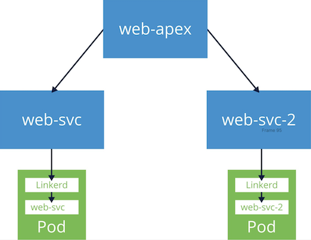

# **5 在 Linkerd 中实现流量拆分功能**

在 Linkerd 中，金丝雀发布是通过流量拆分来管理的，这项功能允许你根据可动态配置的权重，将请求分配给不同的 Kubernetes 服务对象。

**虽然流量分割可以适用于任意的 Service 对象，但一般情况下是将一个 Service 的传入流量分给不同版本的 Service。**

流量分割功能是通过 Linkerd 的 `TrafficSplit CRD` 来控制的（**TrafficSplit CRD 遵循服务网接口（SMI）中定义的规范，这是 Linkerd 实现的几个 SMI API 中的一个**）。


**创建 TrafficSplit CRD 允许我们控制 Linkerd 如何将流量代理给 TrafficSplit 引用的服务**。

TrafficSplit CRD 是根据 Kubernetes Service 对象编写的，TrafficSplit 描述了一个中心根或 apex 服务，流量被发送到该服务，以及一个或多个实际接收它的后端服务，与 TrafficSplit 中还指定的权重成比例。


另外需要注意，Kubernetes 的 Service 对象不一定有后台工作负载。虽然这对于普通服务来说很少见，但是我们会在 TrafficSplits 的 apex 服务中大量使用该功能，因为 TrafficSplit 会导致发往 apex 的流量实际发送到后端服务，所以 apex 实际上不需要拥有自己的 Deployment。


## **更新服务**

接下来我们还是以 Emojivoto 应用为例来创建两个新的 Service 对象，apex 服务将没有关联的 Deployment 资源，第二项服务将是 Emojivoto 的 web 服务的一个更新版本，会在页面顶部添加一些文本信息。

**创建这两个服务后，我们将创建一个 TrafficSplit 资源，该资源会将发送到 apex 服务的流量在 web 服务的原始版本和更新版本之间进行拆分。**



更新版本的 web 服务资源对象如下所示：

```
# web-svc-2.yaml
apiVersion: v1
kind: ServiceAccount
metadata:
  name: web-2
  namespace: emojivoto
---
apiVersion: v1
kind: Service
metadata:
  name: web-svc-2
  namespace: emojivoto
spec:
  ports:
    - name: http
      port: 80
      targetPort: 8080
  selector:
    app: web-svc-2
  type: ClusterIP
---
apiVersion: apps/v1
kind: Deployment
metadata:
  labels:
    app.kubernetes.io/name: web-svc-2
    app.kubernetes.io/part-of: emojivoto
    app.kubernetes.io/version: linux-training-v2
  name: web-svc-2
  namespace: emojivoto
spec:
  selector:
    matchLabels:
      app: web-svc-2
      version: linux-training-v2
  template:
    metadata:
      annotations:
        linkerd.io/inject: enabled # 设置自动注入的注解
      labels:
        app: web-svc-2
        version: linux-training-v2
    spec:
      containers:
        - env:
            - name: WEB_PORT
              value: "8080"
            - name: EMOJISVC_HOST
              value: emoji-svc.emojivoto:8080
            - name: VOTINGSVC_HOST
              value: voting-svc.emojivoto:8080
            - name: INDEX_BUNDLE
              value: dist/index_bundle.js
            - name: MESSAGE_OF_THE_DAY
              value: "Welcome to version 2! Now with more words!"
          image: buoyantio/emojivoto-web:lf-training
          name: web-svc-2
          ports:
            - containerPort: 8080
              name: http
          resources:
            requests:
              cpu: 100m
      serviceAccountName: web-2
```

直接应用上面的资源对象：

```
$ kubectl apply -f web-svc-2.yaml
serviceaccount/web-2 created
service/web-svc-2 created
deployment.apps/web-svc-2 created
```

部署后先验证更新版本的服务是否已经正确部署了。

```
$ kubectl get po --selector app=web-svc-2 -n emojivoto
NAME                         READY   STATUS    RESTARTS   AGE
web-svc-2-f9d77474f-hgsg4    2/2     Running       0      10s

$ kubectl get svc web-svc-2 -n emojivoto
NAME        TYPE        CLUSTER-IP      EXTERNAL-IP   PORT(S)   AGE
web-svc-2   ClusterIP   10.102.99.153   <none>        80/TCP    3m45s
```

部署成功后同样可以使用 kubectl port-forward 命令来暴露服务：

```
$ kubectl port-forward svc/web-svc-2 8080:80 -n emojivoto
```

同样我们还是可以在浏览器中通过 `localhost:8080` 访问新版本的应用。


在页面顶部可以看到新版本的应用多了一行字符信息。

## **创建 TrafficSplit**

接下来我们需要创建一个 apex 服务，我们这里将其称为 web-apex，不过这次没有 Pod 运行，所以无法向服务发送任何请求，因为没有端点。

```
# web-apex.yaml
apiVersion: v1
kind: ServiceAccount
metadata:
  name: web-apex
  namespace: emojivoto
---
apiVersion: v1
kind: Service
metadata:
  name: web-apex
  namespace: emojivoto
spec:
  ports:
    - name: http
      port: 80
  selector:
    app: web-apex
  type: ClusterIP
```

同样直接应用上面的资源对象：

```
$ kubectl apply -f web-apex.yaml
serviceaccount/web-apex created
service/web-apex created

$ kubectl get svc -n emojivoto -o wide
NAME         TYPE        CLUSTER-IP       EXTERNAL-IP   PORT(S)             AGE   SELECTOR
emoji-svc    ClusterIP   10.103.235.14    <none>        8080/TCP,8801/TCP   8d    app=emoji-svc
voting-svc   ClusterIP   10.102.32.81     <none>        8080/TCP,8801/TCP   8d    app=voting-svc
web-apex     ClusterIP   10.104.12.249    <none>        80/TCP              84s   app=web-apex
web-svc      ClusterIP   10.106.220.250   <none>        80/TCP              8d    app=web-svc
web-svc-2    ClusterIP   10.102.99.153    <none>        80/TCP              27m   app=web-svc-2
```

**从上面的输出可以看到 web-apex 服务和其他普通服务一样**，但是他并没有端点。

```
$ kubectl get ep -n emojivoto
NAME         ENDPOINTS                             AGE
emoji-svc    10.244.1.228:8801,10.244.1.228:8080   8d
voting-svc   10.244.1.202:8801,10.244.1.202:8080   8d
web-apex     <none>                                2m55s
web-svc      10.244.1.227:8080                     8d
web-svc-2    10.244.1.233:8080                     28m
```

在继续之前我们可以先看看当前应用的流量状态：

```
$ linkerd viz stat po -n emojivoto
NAME                         STATUS   MESHED   SUCCESS      RPS   LATENCY_P50   LATENCY_P95   LATENCY_P99   TCP_CONN
emoji-696d9d8f95-5vn9w      Running      1/1   100.00%   2.3rps           1ms           1ms           1ms          4
vote-bot-6d7677bb68-jvxsg   Running      1/1   100.00%   0.3rps           1ms           1ms           1ms          1
voting-ff4c54b8d-xhjv7      Running      1/1    98.04%   0.8rps           1ms           8ms          10ms          4
web-5f86686c4d-58p7k        Running      1/1   100.00%   1.4rps           1ms           6ms           9ms          2
```

可以清楚看到虽然我们将 web 服务的更新版本已经部署了，**但是现在没有产生任何的流量。接下来我们需要去创建一个 TrafficSplit 对象，然后去拆分一部分流量到我们的新服务中去**。

创建一个如下所示的 TrafficSplit 资源对象：

```
# web-svc-ts.yml
apiVersion: split.smi-spec.io/v1alpha2
kind: TrafficSplit
metadata:
  name: web-svc-ts
  namespace: emojivoto
spec:
  # 客户端用于连接到目标应用程序的 root 服务
  service: web-apex
  # 命名空间中的 Service 以及它们自己的 selectors、端点和配置。
  backends: # 拆分的后端服务
    - service: web-svc
      weight: 500 # 权重
    - service: web-svc-2
      weight: 500
```

上面的资源对象中主要包括两个属性：


* service：客户端用于连接到目标应用程序的 root 服务
* backends：命名空间内的服务，具有自己的选择器、端点和配置（我们可以将这些服务看成叶服务）。
	* service：与可以处理请求的 Pod 关联地具体服务的名称。
	* weight：它与分配给服务的总流量的百分比相关。

现在我们来应用上面的资源对象：

```
$ kubectl apply -f web-svc-ts.yaml
trafficsplit.split.smi-spec.io/web-svc-ts created


$ kubectl get trafficsplit -n emojivoto
NAME         SERVICE
web-svc-ts   web-apex
```


创建完成后我们可以通过 linkerd viz stat 命令的一个 trafficsplit 子命令（可以缩写为 ts），来显示所有的流量拆分统计信息。

```
$ linkerd viz stat ts -n emojivoto
Starting in 2.12, the SMI extension will be required for traffic splitting. Please follow the SMI extension getting started guide from https://linkerd.io/2.10/tasks/linkerd-smi

NAME         APEX       LEAF        WEIGHT   SUCCESS   RPS   LATENCY_P50   LATENCY_P95   LATENCY_P99
web-svc-ts   web-apex   web-svc        500         -     -             -             -             -
web-svc-ts   web-apex   web-svc-2      500         -     -             -             -             -
```

由于投票机器人配置为将流量发送到 `web-svc.emojivoto:80`，所以现在我们看不到任何流量拆分的指标。

所以我们先更新下 `vote-bot` 服务将流量发送到 `web-apex 服务，而不是 `web-svc`。

**以下 kubectl 命令中使用的文件更改了` vote-bot` 部署中的 `WEB_HOST` 环境变量，以将流量发送到 `web-apex` 服务，从而使 TrafficSplit 配置生效。**

```
$ kubectl edit deploy vote-bot -n emojivoto
# ......
    spec:
      containers:
      - command:
        - emojivoto-vote-bot
        env:
        - name: WEB_HOST
          value: web-apex.emojivoto:80
        image: docker.l5d.io/buoyantio/emojivoto-web:v11
        imagePullPolicy: IfNotPresent
        name: vote-bot
# ......
```

更新后新的 vote-bot 服务将向 web-apex 服务发出请求，我们可以使用上面的 trafficsplit 子命令再次来验证：

```
$ linkerd viz stat ts -n emojivoto
Starting in 2.12, the SMI extension will be required for traffic splitting. Please follow the SMI extension getting started guide from https://linkerd.io/2.10/tasks/linkerd-smi

NAME         APEX       LEAF        WEIGHT   SUCCESS      RPS   LATENCY_P50   LATENCY_P95   LATENCY_P99
web-svc-ts   web-apex   web-svc        500    90.32%   1.0rps           3ms           9ms          10ms
web-svc-ts   web-apex   web-svc-2      500    96.49%   0.9rps           1ms           5ms           5ms
```


从上面的输出可以看到 web-apex 服务是 web-svc 和 web-svc-2 服务的 APEX 服务，它们自己则是 LEAF 服务，输出结果还显示了每个服务的权重分布。

## **调整权重**

接着我们再用 linkerd viz stat 命令来查看下应用的流量情况，上一次我们查看的时候 web-svc-2 服务关联的 Pod 没有收到任何流量。

```
$ linkerd viz stat pod -n emojivoto
NAME                         STATUS   MESHED   SUCCESS      RPS   LATENCY_P50   LATENCY_P95   LATENCY_P99   TCP_CONN
emoji-696d9d8f95-5vn9w      Running      1/1   100.00%   2.3rps           1ms           2ms           3ms          5
vote-bot-646b9fd6fd-js526   Running      1/1   100.00%   0.3rps           1ms           1ms           1ms          1
voting-ff4c54b8d-xhjv7      Running      1/1    89.74%   1.3rps           1ms           7ms           9ms          5
web-5f86686c4d-58p7k        Running      1/1    97.33%   1.2rps           2ms           9ms          10ms          3
web-svc-2-f9d77474f-hgsg4   Running      1/1    92.31%   1.3rps           1ms           6ms           9ms          3
```

这次我们可以看到与 web-svc 和 web-svc-2 相关的两个 Pod 都在处理请求了。证明我们的流量拆分配置是正确的。

TrafficSplit 定义中将每个服务的权重设置为 500，以平均分配流量。在实际工作中，我们可以先将 web-svc-2 的权重设置为 1%的或者很低的权重开始，以确保没有错误，然后当我们确定新版本没有问题后，可以调整慢慢调整每个服务的权重，到最终所有流量都切换到新版本上面去。

我们可以通过手动编辑 TrafficSplit 对象来手动调整这两个服务的权重。将 75% 的流量发送到 web-svc-2，将 25% 的流量发送到 web-svc。

```
# web-svc-ts-2.yml
apiVersion: split.smi-spec.io/v1alpha2
kind: TrafficSplit
metadata:
  name: web-svc-ts
  namespace: emojivoto
spec:
  # 客户端用于连接到目标应用程序的 root 服务
  service: web-apex
  # 命名空间中的 Service 以及它们自己的 selectors、端点和配置。
  backends: # 拆分的后端服务
    - service: web-svc
      weight: 250 # 权重
    - service: web-svc-2
      weight: 750
```

更新上面的资源对象后，再次查看流量拆分的情况。

```
$ linkerd viz stat ts -n emojivoto
Starting in 2.12, the SMI extension will be required for traffic splitting. Please follow the SMI extension getting started guide from https://linkerd.io/2.10/tasks/linkerd-smi

NAME         APEX       LEAF        WEIGHT   SUCCESS      RPS   LATENCY_P50   LATENCY_P95   LATENCY_P99
web-svc-ts   web-apex   web-svc        250    87.88%   0.6rps           6ms          17ms          20ms
web-svc-ts   web-apex   web-svc-2      750    94.12%   1.4rps           2ms           8ms          10ms
```

在输出中，你将看到 WEIGHT 列与上面的变更相匹配，web-svc-2 为 750、web-svc 为 250。接着我们再更改 TrafficSplit 对象，将所有流量发送到 web-svc-2 服务去。

```
# web-svc-ts-3.yml
apiVersion: split.smi-spec.io/v1alpha2
kind: TrafficSplit
metadata:
  name: web-svc-ts
  namespace: emojivoto
spec:
  # 客户端用于连接到目标应用程序的 root 服务
  service: web-apex
  # 命名空间中的 Service 以及它们自己的 selectors、端点和配置。
  backends: # 拆分的后端服务
    - service: web-svc
      weight: 0 # 权重
    - service: web-svc-2
      weight: 1
```
更新后我们再次查看流量拆分情况：

```
$ linkerd viz stat ts -n emojivoto
Starting in 2.12, the SMI extension will be required for traffic splitting. Please follow the SMI extension getting started guide from https://linkerd.io/2.10/tasks/linkerd-smi

NAME         APEX       LEAF        WEIGHT   SUCCESS      RPS   LATENCY_P50   LATENCY_P95   LATENCY_P99
web-svc-ts   web-apex   web-svc          0         -        -             -             -             -
web-svc-ts   web-apex   web-svc-2        1    99.15%   1.9rps           2ms           3ms           3ms
```

正常我们可以看到 web-svc-2 服务对应的 WEIGHT 为 1，而 web-svc 为 0。

到这里我们就了解了 Linkerd 中的流量拆分的使用，为了简单起见，我们这里使用的是一个单独的 web-apex 服务，当然 apex 服务也可以是后端之一的服务，apex 和后端之一具有相同服务的 TrafficSplit 会将发往该服务的流量发送到该服务，但会与其余后端服务成比例，这是可以动态完成的，允许你在现有服务之上插入一个 TrafficSplit。

例如，我们可以简单地使用 web-svc 作为 apex（并继续使用它以及 web-svc-2 作为后端），而不是使用 web-apex。在创建 TrafficSplit 的那一刻，到 web-svc 的现有流量将遵循 TrafficSplit 的规则；并且在它被删除的那一刻，到 web-svc 的流量将恢复正常。

在实践中我们往往还会将 Linkerd 的流量拆分功能与 CI/CD 系统进行集成，以自动化发布过程，Linkerd 本身就提供了相关指标，这结合起来是不是就可以实现渐进式交付了：**通过将指标和流量拆分捆绑在一起，可以以增量、安全和完全自动化的方式发布新代码，前面我们介绍过 Argo Rollouts，我们也可以使用像 https://flagger.app/ 这样的项目，因为它是建立在 Linkerd 的指标和流量拆分功能之上来执行渐进式交付的**。