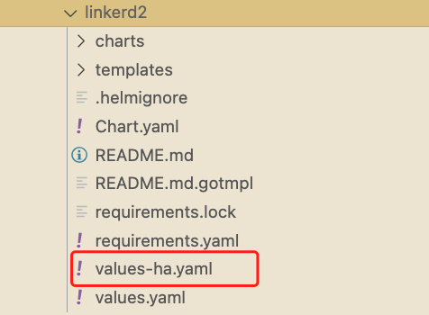
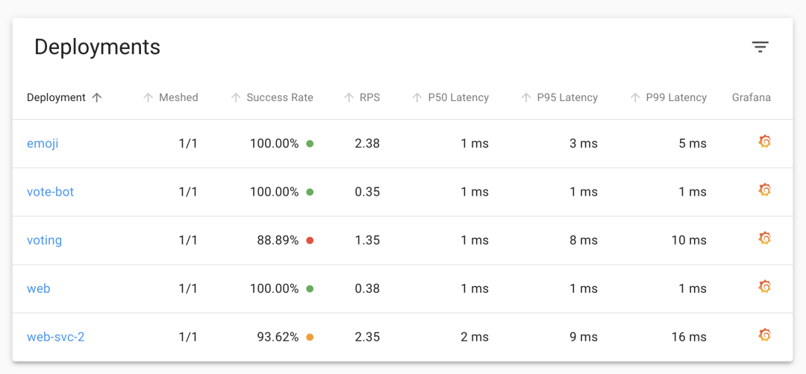
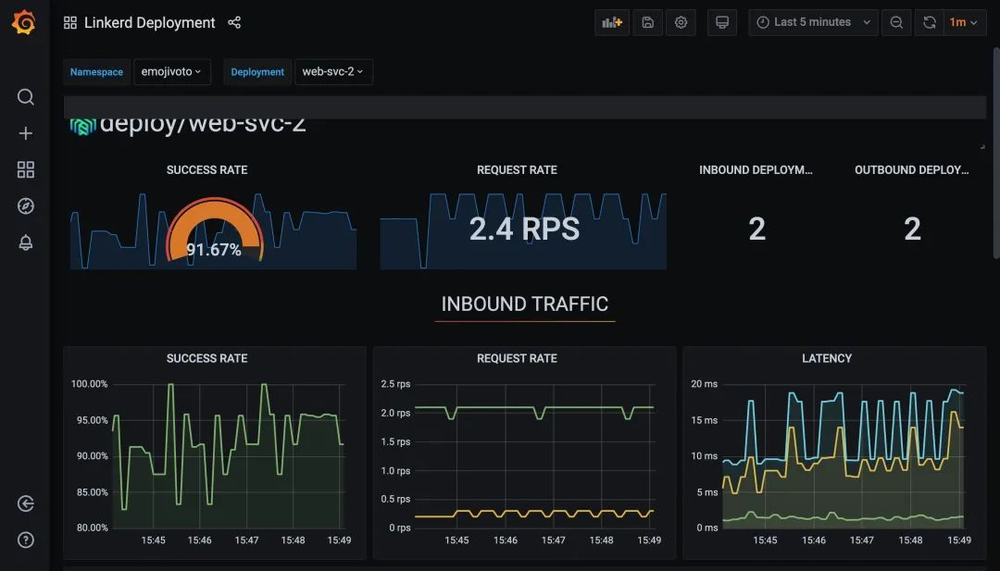

# **6 在生产环境中使用 Linkerd**

到目前为止，我们一直在以最基本的形式使用 Linkerd，而没有关注生产级别的相关问题。本节我们将了解生产环境中使用的一些主要注意事项，包括高可用 (HA) 模式、Helm Chart、跨集群通信和外部 Prometheus。

## **高可用**

**高可用**描述了具有冗余架构的系统，如果系统的某些部分出现故障，该系统将继续运行。Linkerd 的高可用模式旨在消除控制平面的单点故障。

**启用 HA 模式的一种方法是为 `linkerd install` 指定 `--ha` 标志**，此标志启用几种不同的行为。它可以部署某些 Linkerd 控制平面组件的多个副本：


* Controller
* Destination
* Identity
* Proxy Injector
* Service Profile Validator

请注意，其他组件，例如 Grafana、Prometheus，不被看成核心的关键组件，因此不会配置多副本（如果没有这些组件，数据平面仍然可以继续正常运行）。


不过需要注意的是 HA 模式有一些细微的区别，**首先 HA 模式改变了 proxy injector 的方式，强制要求在有适当注解的情况下注入代理**。


这是为了确保在生产环境中，**使用 Linkerd 进行 mTLS 的应用程序可以依赖该代理，当然如果 Linkerd 的 proxy injector 在某种程度上不可用了，则就无法创建 Pod 了**。

比如 kube-system 命名空间就会出现问题，**因此使用 HA 模式需要将标签 `config.linkerd.io/admission-webhooks: disabled `添加到 `kube-system` 命名空间中**，以允许创建 Kubernetes 组件，即使 Linkerd 出现某种问题，但也不用太担心，当在 HA 模式下运行时，当标签不在 `kube-system` 命名空间上时，`linkerd check `命令也会打印出一条告警信息。


## **Helm Chart**

一般来说在生产环境中不推荐使用 Linkerd CLI 工具来进行安装，而更推荐使用 Helm 之类的工具进行安装。**Linkerd 为普通模式和 HA 模式提供了 Helm Chart，其中包含一个名为 values-ha.yaml 的模板，可以将其用作向集群部署高可用性的基础，Helm 对于在新创建的集群上自动配置 Linkerd 特别有用**。



**需要注意的一点是，Helm 的安装过程不会像 linkerd install 命令那样为你生成证书，所以需要在安装过程中使用自己的证书，前面 mTLS 章节已经介绍过**。

**无论你是否使用 Helm 安装，是否在 HA 模式下安装，对于生产系统来说，你都应该自己生成根证书和签发者证书。创建你自己的信任锚，可以让你避免手动轮转的麻烦**（我们建议将过期时间设置为 10 年，而不是默认的 1 年），也可以为未来的集群生成签发者证书，请确保将私钥存放在一个安全的地方!

## **Prometheus 指标**

Linkerd 控制平面包含一个 Prometheus 的实例，该实例中的数据被用来为 Linkerd 仪表板以及 linkerd viz stat 等命令的输出提供支持。

**Linkerd 控制平面包含一个 Prometheus 的实例，该实例中的数据被用来为 Linkerd 仪表板以及 linkerd viz stat 等命令的输出提供支持**。

该实例默认只保留最近 6 小时的指标数据，生产环境往往需要在更长的时间内访问指标，比如 1 周、1 个月甚至 1 年。当然我们可以重新配置下该 Prometheus 实例，提高下数据保留时长，但是显然这是不被推荐的一种方法，最佳的做法是将指标从 Linkerd 的控制平面提供的 Prometheus 输出到一个专门的远程存储中去，比如 Cortex、Thanos 或者 Victoriametrics，根据前面我们的对 Prometheus 的学习更加推荐使用 Victoriametrics。

**如果你现在已经有一个可用的 Prometheus 集群了，那么同样我们可以配置让 Linkerd 来使用外部的 Prometheus 实例，同样可以获取 Linkerd 控制平面组件和代理的相关指标**。

### **配置外部 Prometheus**

如果要使用外部的 Prometheus 则需要在外部 Prometheus 中添加如下抓取配置：

```
- job_name: "grafana"
  kubernetes_sd_configs:
    - role: pod
      namespaces:
        names: ["linkerd-viz"]
  relabel_configs:
    - source_labels:
        - __meta_kubernetes_pod_container_name
      action: keep
      regex: ^grafana$
- job_name: "linkerd-controller"
  relabel_configs:
    - source_labels:
        - __meta_kubernetes_pod_container_port_name
      action: keep
      regex: admin-http
    - source_labels: [__meta_kubernetes_pod_container_name]
      action: replace
      target_label: component
  kubernetes_sd_configs:
    - role: pod
      namespaces:
        names:
          - "linkerd"
          - "linkerd-viz"
- job_name: "linkerd-service-mirror"
  kubernetes_sd_configs:
    - role: pod
  relabel_configs:
    - source_labels:
        - __meta_kubernetes_pod_label_linkerd_io_control_plane_component
        - __meta_kubernetes_pod_container_port_name
      action: keep
      regex: linkerd-service-mirror;admin-http$
    - source_labels: [__meta_kubernetes_pod_container_name]
      action: replace
      target_label: component
- job_name: "linkerd-proxy"
  kubernetes_sd_configs:
    - role: pod
  relabel_configs:
    - source_labels:
        - __meta_kubernetes_pod_container_name
        - __meta_kubernetes_pod_container_port_name
        - __meta_kubernetes_pod_label_linkerd_io_control_plane_ns
      action: keep
      regex: ^linkerd-proxy;linkerd-admin;linkerd$
    - source_labels: [__meta_kubernetes_namespace]
      action: replace
      target_label: namespace
    - source_labels: [__meta_kubernetes_pod_name]
      action: replace
      target_label:
        pod
        # special case k8s' "job" label, to not interfere with prometheus' "job"
        # label
        # __meta_kubernetes_pod_label_linkerd_io_proxy_job=foo =>
        # k8s_job=foo
    - source_labels: [__meta_kubernetes_pod_label_linkerd_io_proxy_job]
      action: replace
      target_label:
        k8s_job
        # drop __meta_kubernetes_pod_label_linkerd_io_proxy_job
    - action: labeldrop
      regex:
        __meta_kubernetes_pod_label_linkerd_io_proxy_job
        # __meta_kubernetes_pod_label_linkerd_io_proxy_deployment=foo =>
        # deployment=foo
    - action: labelmap
      regex:
        __meta_kubernetes_pod_label_linkerd_io_proxy_(.+)
        # drop all labels that we just made copies of in the previous labelmap
    - action: labeldrop
      regex:
        __meta_kubernetes_pod_label_linkerd_io_proxy_(.+)
        # __meta_kubernetes_pod_label_linkerd_io_foo=bar =>
        # foo=bar
    - action: labelmap
      regex:
        __meta_kubernetes_pod_label_linkerd_io_(.+)
        # Copy all pod labels to tmp labels
    - action: labelmap
      regex: __meta_kubernetes_pod_label_(.+)
      replacement:
        __tmp_pod_label_$1
        # Take `linkerd_io_` prefixed labels and copy them without the prefix
    - action: labelmap
      regex: __tmp_pod_label_linkerd_io_(.+)
      replacement:
        __tmp_pod_label_$1
        # Drop the `linkerd_io_` originals
    - action: labeldrop
      regex:
        __tmp_pod_label_linkerd_io_(.+)
        # Copy tmp labels into real labels
    - action: labelmap
      regex: __tmp_pod_label_(.+)
```

上面的抓取配置我们可以通过命令 `kubectl get cm -n linkerd-viz prometheus-config -o yaml` 获取完整的配置，抓取配置更新完成后确保 Prometheus 可以抓取到相关指标数据。


Linkerd 的 viz 扩展组件依赖于 Prometheus 实例来为仪表板和 CLI 提供数据。

安装的时候有一个 prometheusUrl 字段可以用来配置外部 Prometheus 的地址，所有这些组件都可以通过该参数配置到外部 Prometheus URL。

不过需要注意的是在使用外部 Prometheus 并配置 prometheusUrl 字段时，Linkerd 的 Prometheus 仍然会包含在安装中。如果您想禁用它，请务必同时包含以下配置：

```
prometheus:
  enabled: false
```


比如我们这里在 kube-mon 命名空间中有一个可用的 Prometheus 实例，则可用如下所示的命令来进行替换：

```
$ kubectl get svc prometheus -n kube-mon
NAME         TYPE       CLUSTER-IP       EXTERNAL-IP   PORT(S)          AGE
prometheus   NodePort   10.100.236.253   <none>        9090:31561/TCP   60d
$ linkerd viz install --set prometheusUrl=http://prometheus.kube-mon.svc.cluster.local:9090,prometheus.enabled=false | kubectl apply -f -
```

如果使用的是 Helm 进行安装的则可以直接通过 values 文件来进行配置。更新后重新查看 Linkerd 的 Dashboard 依旧可以看到应用的相关指标数据。




包括 Grafana 的图表也是正常显示的。



这样对于 Prometheus 指标数据保存多长时间或者如何保存就是依靠我们的外部 Prometheus 自身去实现了，这当然降低了 Linkerd 自身的复杂性。

## **多集群通信**

inkerd 支持多集群通信，这一功能允许服务在 Kubernetes 集群间透明地进行通信。启用该功能后，如果服务 A 与服务 B 通信，它不需要知道 B 是在同一个集群还是不同的集群上运行，是在同一个数据中心还是在互联网上。同样的 mTLS、指标和可靠性功能在集群内和跨集群的通信中都是统一应用的。事实上，当与流量分割相结合时，服务 B 可以从本地集群迁移或故障转移到远程集群，或跨越独立的远程集群。


**Linkerd 多集群组件使用 `linkerd multi-cluster install` 命令与控制平面组件分开安装**，

**此命令会创建一个名为 `linkerd-multi-cluster `的命名空间，其中包含两个组件：`service-mirror `和 `linkerd-gateway`，这些组件用于确保两个集群之间连接的健康，并为远程或目标集群上存在的服务路由流量**。

每个参与的集群都必须在安装了这些组件的情况下运行 Linkerd 控制平面。这就消除了任何一个集群的单点故障：**如果一个集群被移除、崩溃或变得不可用，其余的集群和控制平面将继续运作**。

多集群设置中最困难的部分是 mTLS 基础设施：每个集群上的颁发者证书必须由同一个信任根签署。这意味着简单地运行 linkerd install 进行安装会有问题，需要指定同一个根证书。


## **其他**

上面是将 Linkerd 部署到生产环境之前需要考虑的一些重要事项，除此之外，还有一些事项也是值得我们关注的：

* **配置资源**：当你在 HA 模式下部署 Linkerd 时，Linkerd 为控制平面组件设置 CPU 和内存资源请求和限制。这些限制是一个相对合理的值，但并不是所有的应用都是一样的，你可能需要调整这些资源配置以适应你的需求。对于高流量的服务（每个实例每秒>1000个请求），我们可能还需要调整代理资源，也可以在部署应用的时候指定 `config.linkerd.io/proxy-cpu-limit`注解来配置代理的并发。
* **检查时钟偏差**：确保集群中的节点保持同步很重要，例如通过使用 NTP，节点之间的大时钟偏差可能会破坏 Linkerd 代理验证它们用于 mTLS 的证书的能力（在解决集群中的问题时，大的时钟偏差可能会使跨节点读取日志文件变得困难！）。
* **处理 `NET_ADMIN`**：Linkerd 的 proxy-init 容器在注入 Pod 时运行，并负责配置 iptables 规则，以便所有进出应用程序容器的 TCP 流量都自动通过代理容器路由。这需要 Kubernetes 的 `NET_ADMIN` 这个 Linux Capability，这意味着任何向集群添加支持 Linkerd 的工作负载的系统都必须被授予该能力。如果出于安全原因不希望这样做，另一种方法是使用 `Linkerd CNI` 插件在工作负载创建者权限范围之外执行此操作。
* **linkerd viz tap 权限**：前面我们已经学习过 tap 这个强大的命令，但是这个功能也会附带很多风险，因为这个命令可能会将潜在的敏感信息暴露给用户，不过 Linkerd 允许我们使用 Kubernetes RBAC 限制来控制谁可以访问该输出。
* **使用 Ingress**：与其他一些服务网格不同，Linkerd 不提供自己的 Ingress 控制器。相反，你可以将 Linkerd 与其他可用的 Kubernetes Ingress 控制器配合使用，当这样做的时候，我们建议将 Ingress 控制器与 Linkerd 代理注入，这将允许 Linkerd 的 mTLS 和可观察性从请求进入集群的那一刻起就已经可用了。

到这里我们就基本上了解了如何在生产环境中使用 Linkerd 了。但也要注意上面我们介绍的这些事项并不是所有的，强烈建议在将 Linkerd 部署到生产环境之前完全理解这些概念并通读 Linkerd 文档。


