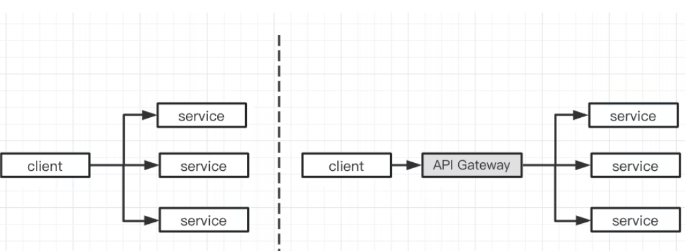
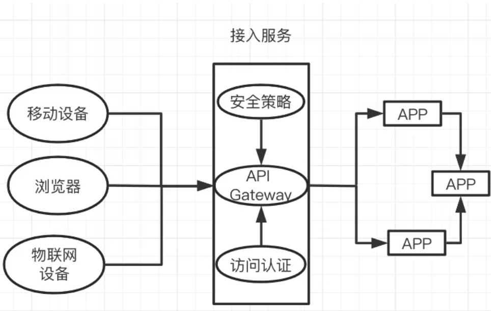
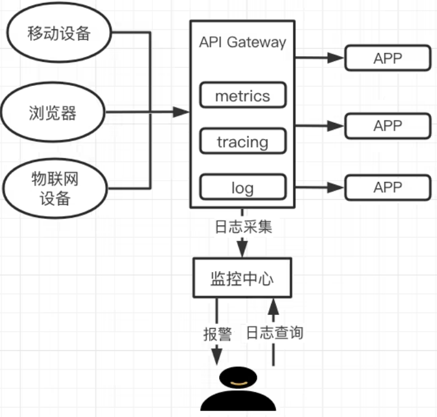

# **0 微服务为什么要用到 API 网关？**

## 什么是微服务

微服务架构（通常简称为微服务）是指开发应用所用的一种架构形式。

通过微服务，可将大型应用分解成多个独立的组件，其中每个组件都有各自的责任领域。在处理一个用户请求时，基于微服务的应用可能会调用许多内部微服务来共同生成其响应。

微服务是互联网业务发展的结果，互联网业务的飞速发展导致系统的架构也在不断地发生变化，总体来说，系统的架构大致经历了：<mark>单体应用架构—> SOA 架构—>微服务架构的演变</mark>，具体发展历程和各自的优缺点如下表所示。

### 单体应用架构	

所有模块耦合在一起，比较有利于小型项目的开发和维护；但是，对于大型项目来说却存在问题，比如：

1. 项目各模块之间过于耦合，一个模块的性能问题可能导致整个项目的不可用；
2. 项目的扩展性差。

### SOA 架构	

一个服务通常以独立的形式存在于操作系统进程中，服务之间通过相互依赖或者通过通信机制来完成通信的，

**优点**

1. 系统集成：站在系统的角度，解决企业系统间的通信问题，把原先散乱、无规划的系统间的网状结构，梳理成规整、可治理的系统间星形结构；
2. 系统的服务化：站在功能的角度，把业务逻辑抽象成可复用、可组装的服务，通过服务的编排实现业务的快速再 
3. 业务的服务化：站在企业的角度，把企业职能抽象成可复用、可组装的服务。

**缺点**

1. 服务的中心化，各服务之间存在依赖关系，如果某个服务出现故障可能会造成服务的雪崩；
2. 服务之间的依赖与调用关系复杂，测试部署的困难比较大。

### 微服务架构	

微服务是在 SOA 上做的升华。微服务架构重点强调的一个是"业务需要彻底的组件化和服务化"， 原有的单个业务系统会拆分为多个可以独立开发、设计、
运行的小应用。

各个小应用之间，相互去协作通信，来完成一个交互和集成，这就是微服务架构。

**优点**

1. 去中心化；
2. 通过服务实现组件化；
3. 按业务能力来划分服务和开发团队；
4. 基础设施自动化（ Devops、自动化部署）。

**缺点**

1. 开发的成本比较高；
2. 会引发服务的容错性问题；
3. 会引发数据的一致性问题；
4. 会涉及分布式事务。

因此，微服务是互联网发展的必然结果，很多传统公司的系统架构也在逐步微服务化。但是，随着互联网业务的发展，API 的数量也在剧增，使用网关对API统一管理也将面临挑战，选择一个更强大的 API 网关，可以有效地增强系统的监控、容灾、鉴权和限流等能力。

## 什么是 API 网关

API 网关为客户与服务系统之间的交互提供了统一的接口，也是管理请求和响应的中心点，选择一个适合的 API 网关，可以有效地简化开发并提高系统的运维与管理效率。

API 网关在微服务架构中是系统设计的一个解决方案，用来整合各个不同模块的微服务，统一协调服务。API 网关作为一个系统访问的切面，对外提供统一的入口供客户端访问，隐藏系统架构实现的细节，让微服务使用更为友好；

并集成了一些通用特性（如鉴权、限流、熔断），避免每个微服务单独开发，提升效率，使系统更加标准化，比如身份验证、监控、负载均衡、限流、降级与应用检测等功能。

### 为什么微服务需要 API 网关

如上图所示，API 网关作为客户端和微服务的中间层，它可以将微服务以统一的地址对外提供服务，将外部访问这个地址的流量，根据适当的规则路由到内部集群中正确的服务节点之上，<mark>如果没有 API 网关，流量的出入口则不统一，客户端就需要知道所有服务的访问信息，微服务的意义将不复存在</mark>，所以，微服务网关在微服务系统架构中的存在是必要的。

此外，API 网关在系统的可观测性、身份鉴权认证、稳定性和服务发现等方面也会发挥重要作用。

### 微服务遇到的挑战

微服务网关应该首先要具备 **API 路由能力，微服务数量变多，API 数量急剧增加，网关还可以根据具体的场景作为流量过滤器来使用，以提供某些额外可选功能**，因此对微服务 API Gateway 提出了更高要求，比如：

* 可观测性：在以往的单体应用中，排查问题往往通过查看日志定位错误信息和异常堆栈；但是在微服务架构中服务繁多，出现问题时的问题定位变得非常困难；因此，如何监控微服务的运行状况、当出现异常时能快速给出报警，这给开发人员带来很大挑战。
* 鉴权认证：而微服务架构下，一个应用会被拆分成若干个微应用，每个微应用都需要对访问进行鉴权，每个微应用都需要明确当前访问用户以及其权限。尤其当访问来源不只是浏览器，还包括其它服务的调用时，单体应用架构下的鉴权方式就不是特别合适了。在微服务架构下，要考虑外部应用接入的场景、用户 - 服务的鉴权、服务 - 服务的鉴权等多种鉴权场景。
* 系统稳定性：若大量请求超过微服务的处理能力时，可能会将服务打垮，甚至产生雪崩效应、影响系统的整体稳定性。
* 服务发现：微服务的分散管理，让微服务的负载均衡的实现也更具有挑战性。

### 解决方案

API 网关作为客户端和服务端的中间桥梁，为微服务系统提供统一的管理机制：除了基础的请求分发、API 管理和条件路由等功能，还包括身份验证、监控报警、调用链追踪、负载均衡、限流隔离和熔断降级。

身份认证：下图表示的是微服务联合 API 网关如何进行身份认证的，由图可见所有请求都通过网关，从而有效地隐藏了微服务。

监控报警/调用链追踪：API 作为客户端和服务端的中间桥梁，是微服务监控的最好载体，API 网关监控功能的主要职责是及时发现网关以及后端服务器的连接异常，在 API 的监控平台上面用户可以随时查看日志信息，监控信息，调用链等等，并且主机发生的任何异常都会自动报警到控制台。

有些网关甚至可以做到给客户端和服务端双向报警。

**限流隔离/熔断降级：随着互联网业务规模的增加，系统的并发度增高，多个服务之间相互调用链路，一条核心链路往往可能调用十个服务**。

如果在链路中，某个服务的 rt（响应时间）急剧上升，上游服务不断请求，造成恶性循环，上游等待结果线程数越多，使得更上游服务阻塞最终整条链路无法使用，从而导致服务雪崩，所以对入口流量进行整治管理是很有必要的，

下图表示微服务系统是如何结合 API 网关进行限流隔离和熔断降级的。

### 主流网关选择

在微服务领域，有许多开源网关实现，有 NGINX、Kong、Apache APISIX 和 Envoy 等，Java 技术栈的有 Netfilx Zuul、Spring Cloud Gateway、Soul 等。或许你会问“有了 NGINX 和 Kong，为什么还需要 Apache APISIX ？” ，下面做个简单对比。

* NGINX
    * 痛点:  修改配置需要 Reload 才能生效，跟不上云原生的发展。
* Apache APISIX	
    * 优势
        * Apache 基金会顶级项目；
        * 技术架构更贴合云原生； 
        * 性能表现优秀；
* Kong	
  * 痛点:
    * 默认使用 PostgreSQL 或 Cassandra 数据库，使得整个架构非常臃肿，并且会带来高可用的问题；
    * 路由使用的是遍历查找，当网关内有超过上千个路由时，它的性能就会出现比较急剧的下降；
    * 一些重要功能是需要付费的。  
  * 优势
    1. 开源 API 网关的鼻祖，用户数众多；
    2. 性能满足大部分用户的需求；
    3. 生态丰富；
    4. 支持 Lua 和 Go 开发插件。

* Envoy	
    * 痛点
        * 用 C++，二次开发难度大；
        * 除了 C++ 开发 filter 外，还支持 WASM 和 Lua。
    * 优势
        * CNCF 毕业项目 更适合服务网格场景多语言架构部署。

* Spring Cloud Gateway
    * 痛点： 虽然 Spring 社区成熟，但是 Gateway 资源缺乏。
    * 优势
        1. 内置了非常多的开箱即用功能，并且都可以通过 SpringBoot 配置或者手工编码链式调用来使用；  
        2. Spring 系列可扩展性强，易配置，可维护性好；     
        3. Spring 社区成熟；  
        4. 简单易用； 
        5. 对于 Java 技术栈来说方便

**总结**

随着互联网的发展，互联网企业的业务也在不断的飞速发展，进而导致系统的架构也在不断的发生着变化，微服务架构已经在众多公司得到广泛应用。随着微服务的数据越来越多，API 的数量也越来越多，对于大流量的治理，选择一个优秀的 API 网关是至关重要的。
