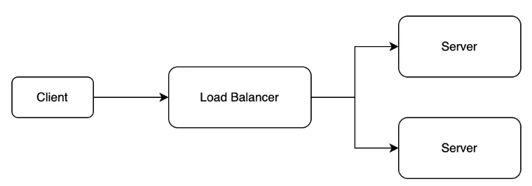
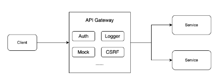
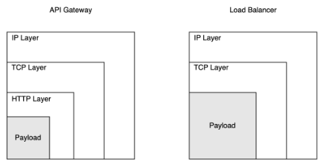
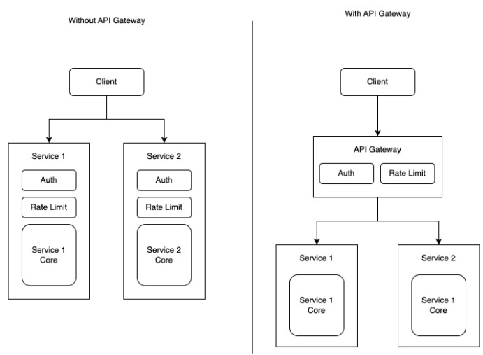
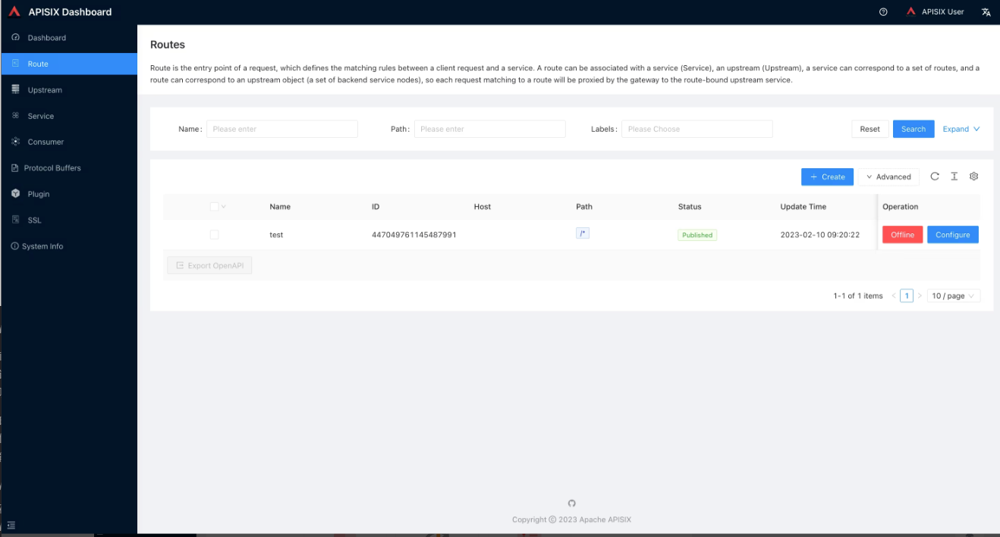

# **API Gateway vs Load Balancer：选择适合你的网络流量管理组件**

由于互联网技术的发展，网络数据的请求数节节攀升，这使得服务器承受的压力越来越大。在早期的系统架构中，通常使用 Load Balancer 来将网络流量平摊到多个服务器中，以此减轻单台服务器的压力。

但是现如今，后端服务的种类在不断地变多，每个种类的后端都以 API 的形式对外暴露，这使得 API 的数量也在不断变多。

**以传统的 Load Balancer 为主的系统架构的局限性就变得明显起来，因为它主要工作在四层，在七层上功能较弱，于是一款主要工作在七层且具有丰富扩展能力的基础设施便应运而生，它就是 API Gateway**。

在本文中，我们将介绍 Load Balancer 和 API Gateway 的功能特点，并探讨它们之间的区别，帮助读者更好地了解这两者之间的关系。

## 1、什么是 Load Balancer

Load Balancer 的主要作用是为多个后端服务提供负载均衡功能，依据不同的负载均衡算法让这些服务可以分摊流量。Load Balancer 的历史非常悠久，从演进路径上看大致可以分为以下这几个阶段：

* 第一阶段：这一阶段的 Load Balancer 通常由硬件设备组成，具有高性能、高可靠性的特点，但灵活性较差，价格昂贵。**比较典型的是 F5 这种基于硬件的 Load Balancer** 。
* 第二阶段：Load Balancer 开始以软件形式实现，使其更加灵活和可扩展，通常以软件分发的形式出现，因此价格也比较低廉，比如 LVS, Haproxy 就属于这一类。
* 第三阶段：随着云计算技术的兴起，Load Balancer 也开始有了云版本，这个版本的 Load Balancer 其中一个好处是可以帮助企业以更低的成本获得高性能的负载均衡服务，另一个好处是它能够利用云计算的可扩展性和弹性的特点来提高整体可用性。例如 AWS 的 Classic Load Balancer、Application Load Balancer、Network Load Balancer 等。

Load Balancer 除了用于分摊流量、提高网络的伸缩性外，还可以用于提升网络安全。<mark>比如可以将内网服务器与外网进行隔离，防止互联网的恶意攻击和访问</mark>。一个简单的使用场景就是，一个包含敏感信息的内部服务器，Load Balancer 可以把内部服务器隔离在内网中，这样就能有效保护内部服务器的安全。

## 2、什么是 API Gateway

**API Gateway 简单来说是一种主要工作在七层，专门用于 API 的管理和流量转发的基础设施**，并在此基础上拥有 Load Balancer 所不具备的强大的扩展性，比如：**认证、可观测性、自定义插件等等**。

简单来说，包括但不限于以下这些特点：

* 丰富的路由策略：<mark>API Gateway 工作在七层，所以它可以解析到 HTTP/HTTPS 层的数据</mark>。因此它可以根据请求的 Path 或 Domain 甚至是 Header 作为条件，将请求转发到不同的上游服务器。
* 认证：**可以在API层面支持多种多样的认证方式来避免非法请求，比如 OAuth2、JWT 等等**，直接将认证这部分服务独立出来，不侵入或者少侵入业务代码。
* 限流：支持对不同程度的路由进行细粒度的限流，防止恶意攻击，防止后端服务雪崩。
* 可观测性：**可观察性是指从系统外部观察系统内部程序的运行状态和资源使用情况的能力**。 
    * API Gateway 支持将日志对接到 Kafka、 Google Cloud Logging Service、Elasticsearch 等，支持将相关 metrics 接入到 prometheus、datadog 等
* 扩展：因为 API Gateway 自身是网关身份，这就注定对它要求是能适配各家公司不同应用场景，**比如不同的鉴权、灰度、安全策略、日志收集等，必须允许用户自由选择所需扩展或者自定义开发，因此扩展性很强，允许选择的扩展种类也十分丰富**
    * 以 Apache APISIX 举例，光是认证的扩展就有 13 款，几乎涵盖了市面上常见的认证需求

目前市面上有许多 API Gateway，比如 Apache APISIX、Kong、Tyk、Zuul 等，开发者可以根据自己的需求选择合适的 API Gateway。

## 3、API Gateway 与 Load Balancer 主要区别

首先，他们主要工作的侧重点不同。虽然说 API Gateway 和 Load Balancer 都支持四层和七层的代理。但是，<mark>API Gateway 主要侧重于七层，而 Load Balancer 主要侧重于四层</mark>。

工作在四层的 Load Balancer 拥有许多有利的特点，**首先是它相比于 API Gateway 减少了协议解析的损耗，具有更强的吞吐能力**。**其次就是它支持透传客户端 IP 地址，而 API Gateway，一般是通过 HTTP 头方式传递客户端 IP 地址**。

其次就是功能的丰富程度不同。Load Balancer 的 HTTP 七层处理能力比较弱，往往不包含认证、授权、鉴权、复杂路由逻辑、日志收集等功能。

API Gateway 则具有相当强大的七层协议处理能力，可以在此基础上，附加各种各样的功能扩展，比如权限控制、日志、API 管理、Serverless 等等。

现如今，科技公司的产品需求变幻莫测，对于很多公司来说支持自定义开发是刚需。API Gateway 支持各式的自定义开发，比如支持丰富的编程语言，支持在流量转发的不同阶段注入自定义的处理逻辑，而 Load Balancer 基本不支持任何自定义功能开发。

还有一点就是 Load Balancer 通常采用流量直接分发的形式做负载均衡，它通过算法将流量数据直接发向某个后端服务器节点。**这意味着后端等待接收流量的每一个服务实例行为都必须是一致的，这减少了一定的灵活性**。

**<mark>而 API Gateway 则是以 URL Path 、Domain、Header 等维度进行流量分发，后端等待接收流量的服务实例可以多种多样，可以是某个 Private API，也可以是某个 gRPC 的 API</mark>**。这就使流量分发变得十分地灵活。

## 4、使用场景

### 微服务场景

**API Gateway 对于微服务架构的系统是刚需。**

首先它可以方便地管理和路由多种不同的后端服务，其次可以提供许多高级功能，比如身份验证、授权、限流、转发、日志记录等功能。这样不同的微服务之间无需重复实现限流、认证等功能，让微服务的每个服务的功能实现更加纯粹，减少研发成本。

由于微服务的特点是服务种类多，工作在四层的 Load Balancer 不太适合对种类繁多后端服务做负载均衡，它更适合用于单体后端服务。即使是工作在七层的 Load Balancer，因为一般不能提供较为丰富的高级功能，相比于 API Gateway 在微服务上优势也不明显。

### API 管理与发布

在需要对大量的 API 进行管理和发布的场景，API Gateway 也非常适用，**因为它具有强大的 API 管理功能，可以让你随时随地让某个 API 上线或者下线，快速地修改 API 转发的配置，快速地为某个 API 添加限流、认证、日志等等功能而无需重新启动 API Gateway**。

以 Apache APISIX 为例，Apache APISIX 是 Apache 基金会旗下的顶级开源项目，也是当前最活跃的开源网关项目。**作为一个动态、实时、高性能的开源 API 网关，Apache APISIX 提供了负载均衡、动态上游、灰度发布、服务熔断、身份认证、可观测性等丰富的流量管理功能**。

而传统的 Load Balancer 则在 API 管理上较为弱势，不具备如此丰富的高级功能。

### 高性能的网络出入口

对于需要大流量、极高稳定性的网络出入口的场景，工作在四层的 Load Balancer 显然更为适用。它可以把网络原始四层流量直接分发到各个后端服务中，不存在中间层多次解析应用层协议的影响，具有更强的吞吐能力。

而工作在七层的 API Gateway 作为统一的入口，会由于需要解析协议，存在一定的吞吐量限制。

即使是使用四层的 API Gateway 来做网络出入口也不太有优势，因为这一层不是 API Gateway 的侧重点，相比于 Load Balancer 多年在这一层的技术累计，API Gateway 优势也不明显。

## 四、总结

总的来说，API Gateway 和 Load Balancer 是分别用于解决不同层面问题的基础设施。

**API Gateway 主要用于作为后端的 API 接口代理，提供对外访问不同种类 API 的一个单独入口，并且可以提供独立于后端服务的限流、认证、监控等功能**；

而 Load Balancer 则主要用于四层流量分发，它可以将请求分摊到多台后端服务器上，平衡后端的请求负载，以提高系统的整体可用性和容错性。

在合理的架构设计下，一般都将 API Gateway 和 Load Balancer 配合使用，使用 Load Balancer 作为整个系统的网络出入口，将流量分发到多个 API Gateway 实例，然后每个 API Gateway 实例分别对请求进行路由、认证、鉴权等操作，这样可以使得整个网络更加稳健、可靠、可扩展。

