# 3 Apache APISIX 在金融云原生的生产实践

## 业务背景

众多业务都需要流量网关作为重要支撑，然而在采用 APISIX 之前，遇到了不少问题：

### 问题 1：网关不统一，维护成本高

系统在架构上的演进，分为 3 大阶段
1. 单体服务方式。服务应用部署在物理机上，但是随着服务应用和业务的不断增长，运维和开发成本开始激增；
2. 虚拟机方式。在虚拟机阶段，各业务系统使用的网关不统一，业务各自为政，网关相关的机器服务也很多，维护成本一直很高。
    * 在基金证券行业，网络分区方面存在一定的监管要求，每个网络分区都需要按照信息安全级别划分为不同的逻辑安全区域，或者是物理隔离安全的区域，各个区域使用防火墙达到网络隔离的目的。
3. 结合在金融科技云战略以及数字化转型的需求，启动了上云工程

当前业务系统大致分为了三个分区：交易区、生产区、管理区，每个分区部署的网关都不一样。

原本使用 NGINX 作为 Web 服务器和反向代理，在同网络分区中的业务，都是使用了同一个 NGINX，导致了每次服务变更或路由更新，都需要在这个 NGINX 上面手动更新和重载。

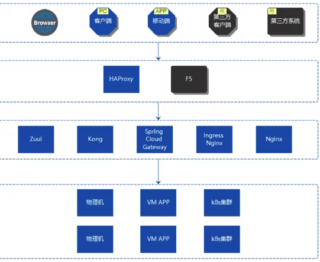

上图就是当前的系统架构，从上往下分别是用户接入层、负载均衡层、网关集群层以及业务系统层，其中网关安全集群层使用了 Zuul、Spring Cloud Gateway、Kong 还有 NGINX 等多个框架，架构管理不统一，管理起来比较繁琐。

### 问题 2：网关承载能力弱

现存的网关只使用了很基本的能力，比如负载均衡、路由转发，鉴权、灰度发布、熔断能力都没有。

前面提到的单一的 NGINX 服务，每次服务变更和路由更新都需要在 NGINX 上面进行配置。由于业务前端的服务都集成在 NGINX 上面，没有对接 DevOps 平台生产环境，NGINX 的配置项数量如今已经相当庞大了，单个 Server 模块超过 700 行，维护成本相当高。

### 问题 3：限流熔断、灰度发布配置繁琐

* 限流熔断能力缺失
* 灰度能力配置繁琐：需同步改动多个应用代码和数据库变更。现在使用的网关需要单独做对应的开发，并且业务侧也要做对应的代码修改，才能实现不同服务的灰度能力（全链路灰度）。

### 问题 4：新增服务涉及步骤繁多

### 问题 5：接口调用存在安全隐患

此外，当前使用的网关未涉及鉴权能力，各接口可直接调用，业务系统存在很高的安全风险。

## 发现并选择 APISIX

由于金融领域对服务的稳定性相较其他行业更加重视，因此**稳定性**放在第一位，另外也看重网关的扩展性，对于在虚拟机时期野蛮生长的网关服务，都需要一一满足其中的业务需求，这里就是比较考验所选网关的**扩展性**；再有就是**可观测性**，对业务系统的日志、链路追踪、监控都有很强烈要求；最后就是**热更新**的能力。

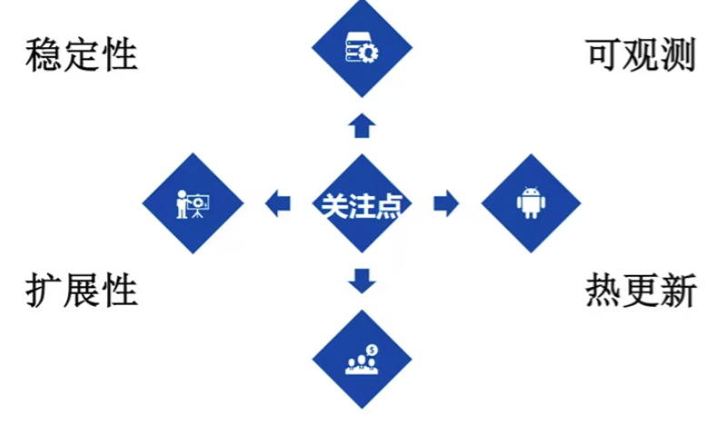

由于 NGINX 无法动态变更配置，因此当面临配置变更场景时需要重载 NGINX 以载入新的配置，由于 NGINX 实现特性的原因，该过程将导致业务系统出现流量波动，进而影响用户体验。

所以基于这 4 个关注点，对 APISIX 和 Kong 进行了横向对比：

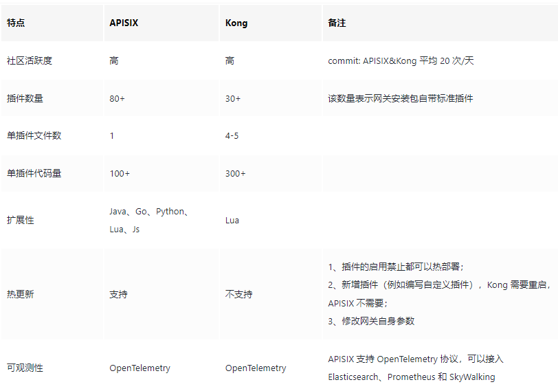

* **技术框架方面**，APISIX 和 Kong 都是基于 OpenResty 的基础之上进行二次开发，**配置中心方面 APISIX 选型了 etcd，Kong 选型了 PostgreSQL**，
    * 由于 etcd 的云原生特性与 APISIX 的状态特性使得 APISIX 是云原生分布式网关；
    * 而 Kong 的配置中心选型会有可能出现单点故障的问题，需要额外的基础设施保障做高可用。
* **社区活跃度方面**， APISIX 和 Kong 都是属于比较高热度的，每天的平均 commit 量是在 20 次左右。
* **扩展性方面**， APISIX 支持的语言非常多，并且还支持 WebAssembly，Kong 只支持使用 Lua 语言进行插件的编写。
热更新方面，这是团队重点关注的：APISIX 支持热更新，并且实现了毫秒级别的热更新响应；而 Kong 不支持热更新。
* **可观测性方面**，选型的时候 Kong 还未能提供 SkyWalking 的支持。

## 基于 APISIX 的解决方案

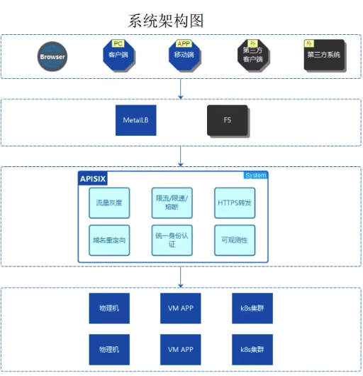

如图所示，景顺长城的系统架构改革重点是将网关集群都转换为 APISIX。

由于 APISIX 部署在 Kubernetes 集群上，因此可以通过 YAML 以声明式配置的方式统一管理 API，并通过 APISIX Ingress Controller 自动监听 Kubernetes 资源变更事件，实现 APISIX 配置的实时同步，包括 AR（ApisixRoute）、SSL等。

路由同步时序图：

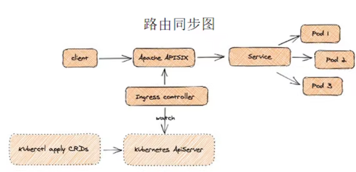

下面详细介绍比较关心的 4 个场景，包括智能路由、安全认证、可观测性和流量控制。

### 场景一：智能路由

主要体现在 APISIX 支持的 7 层和 4 层负载均衡。7 层负载均衡上的方案如下：

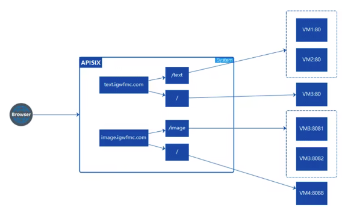

然后是生产环境上的路由配置情况：

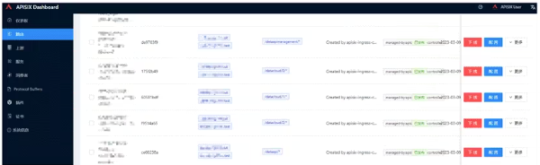

此外，路由更新在 APISIX 上面也达到毫秒级别响应，配置同步延迟几乎无感，体验非常好。

使用 Consul 作为服务发现的中间件，在调研过程中发现 APISIX 2.15 版本虽然支持了 Consul 的服务发现插件，但仅作为配置中心的方式支持，而在服务发现部分的正常模式上尚未支持。随后，基于该场景开发了支持 Consul 的服务发现插件，并已将其贡献给社区。

这里补充介绍一下 Consul 插件的内部细节，先看下图：

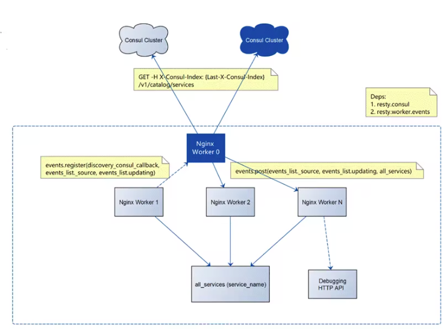

从上往下看，Consul 插件是通过 HTTP 方式去获取不同 Consul 集群的 Service 信息的，这里会获取服务信息会做校验，就是 `last consul index(X-Consul-Index)`，这个 index 字段是在 header 里面的，只有在服务信息变化的时候才会返回结果，所以这也很好地保证了 APISIX 和 Consul 之间的请求数量。

接下来，在 APISIX 中会有多个 worker 同步更新 `all_services` 表中的信息，该表包含了各个服务名称对应的 IP 和端口号。

这些 worker 通过事件机制进行通信，并提供了 debugging API 以方便用户获取当前的服务信息。下面是流程的详细介绍：

Consul 提供了 Catalog 的 [API](https://developer.hashicorp.com/consul/api-docs/catalog) 方式获取 services 信息，其中这里可以分成两步：

**获取所有服务名称**

获取所有服务信息中的 API：[`List Services`](https://developer.hashicorp.com/consul/api-docs/catalog#list-services)，该 API 是支持 [`Blocking Queries`]https://developer.hashicorp.com/consul/api-docs/features/blocking)，就是根据请求头的 `X-Consul-Index` 字段值不同去拉取服务列表，只有服务列表出现变化的时候才会改变 `X-Consul-Index` 字段的值；

**获取每个服务节点信息**

根据第一步获取的服务列表进行遍历，把每个服务的 node 信息获取并记录到 table 中，对应 Consul API：List Nodes for Service，同时通过事件的方式实时更新，下面是简单的流程图：

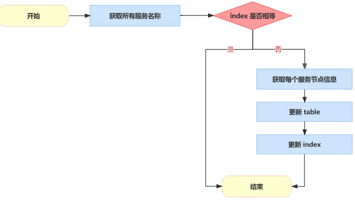

这就是整个 Consul 服务发现插件的内部实践细节。

### 场景二：安全认证

在安全验证方面，我们使用了统一认证和 HTTPS 重定向插件。在引入统一网关之前，每个业务都需要单独开发 Auth 相关内容，以保护其数据接口的安全性

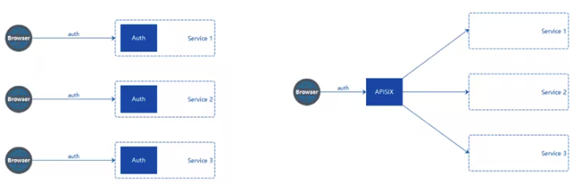

在业务侧，每个业务系统开发相同的鉴权功能，**一方面是开发成本相对比较高，另一方面各自业务系统开发出来的功能质量不一，重复造轮子**。

所以计划把统一认证功能放在网关上，同时解决前面提到的问题，极大提高了业务系统的研发效率，让开发者更专注业务开发

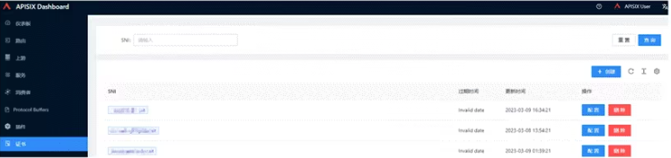

上图是 APISIX 动态管理 SSL 证书详情，通过 Kubernetes 的 cert-manager 统一进行证书的颁发和管理。

在统一网关之前，服务的 HTTPS 证书都是在 HA 端进行解析，现在统一放在 APISIX 中，并且 APISIX 支持动态加载 SSL 证书。

### 场景三：可观测性

原业务系统在可观测性方面支持相对较弱，因此团队希望能够快速接入 APISIX 提供的日志监控、Tracing 等多个插件。

此外，团队还在调研并使用 Apache SkyWalking 进行链路追踪、Prometheus 进行监控、ELK 进行日志收集。对于网关层，只需进行简单的配置即可直接使用这些工具。

生产上接入 SkyWalking 后的服务拓扑图，该图清晰地展示了服务之间的调用关系，包括经过网关的流量方向和成功率等关键信息。通过该拓扑图，团队可以快速定位链路错误点的位置

### 场景四：流量控制

在流量控制的场景下，有基于灰度和基于权重这两种策略。

* 基于灰度策略的场景中，网关需要通过 HTTP 请求调用下游某个接口以获取特定的数据，并根据返回结果进行判断，以确定是否需要将请求发送到灰度环境。
* 基于权重策略的场景，虚拟机和容器的服务并行对外提供服务，例如将 90% 的流量命中虚拟机服务，10% 的流量命中云服务，以验证云服务的稳定性。目前，景顺长城的生产环境已经配置了基于权重的灰度发布。

## 收益与展望

1. 统一了 API 网关框架，降低了业务系统开发的运维成本，目前生产环境已经接入了大约 10% 的业务；
2. 在 DevOps 和流水线的结合方面，极大地提高了路由发布和服务发布的稳定性；
3. APISIX 的热更新能力大大降低了服务重启的压力。

最后，对于 APISIX 的未来高效稳定运行，提出了以下三点期望：

1. 监控告警方面，希望 APISIX 能够不断完善路由可用性的高级配置，例如邮件告警、微信指标告警等。
2. APISIX 和 etcd 的稳定连接方面，目前 APISIX 和 etcd 通过 HTTP 进行通信，但在 etcd v3 版本之后，API 协议已经切换到了 gRPC 协议，因此希望 APISIX 和 etcd 通过 gRPC 进行通信，以提高效率和稳定性，并避免通过 gRPC Gateway 进行转换。
3. 链路追踪方面，希望通过 APISIX 网关接入实现服务的全链路追踪。
