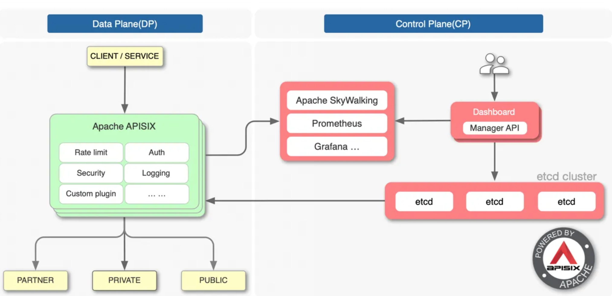
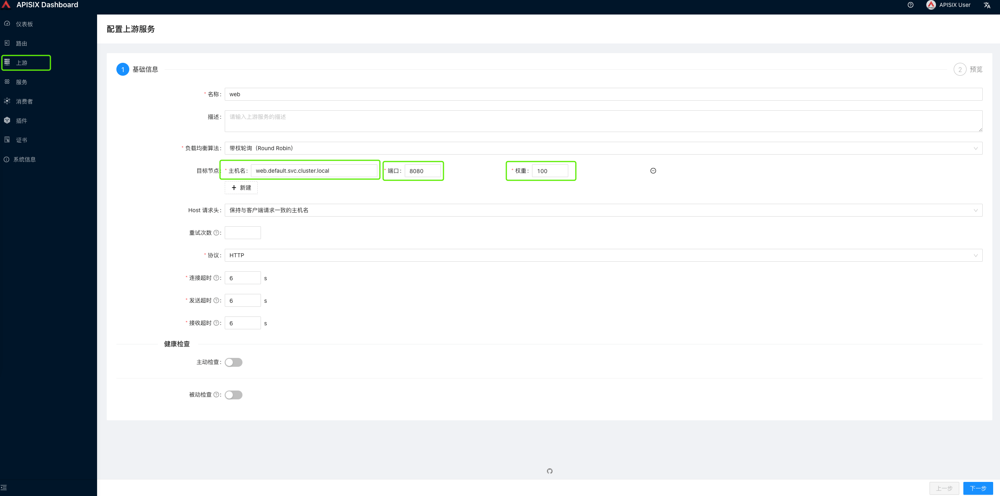
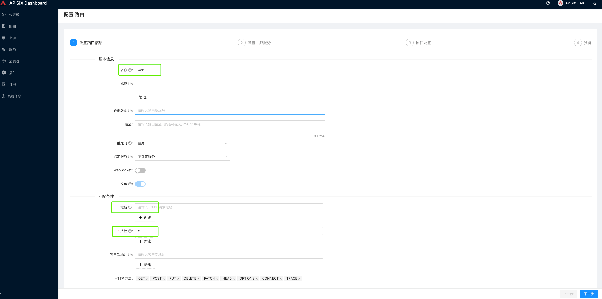
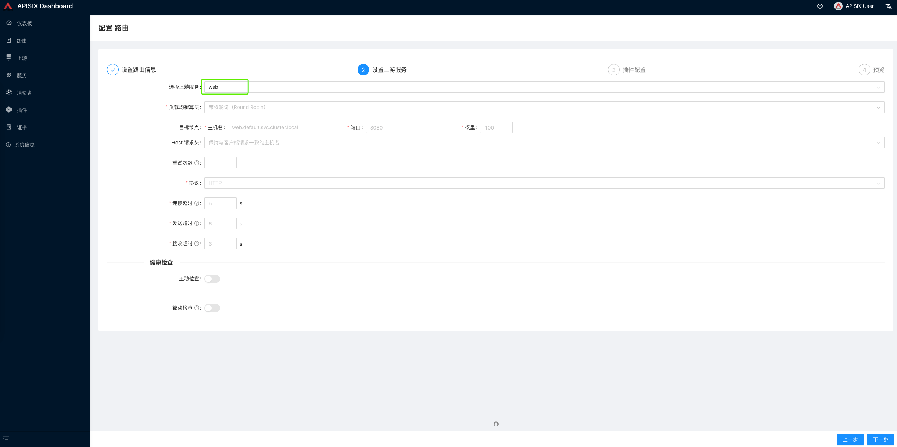
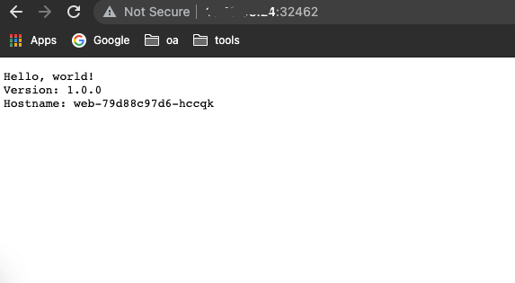
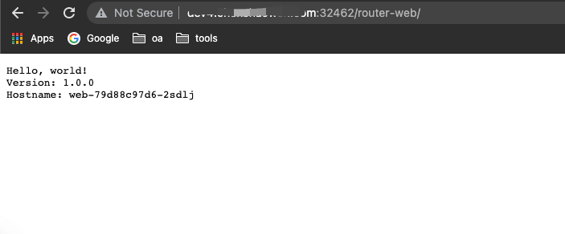
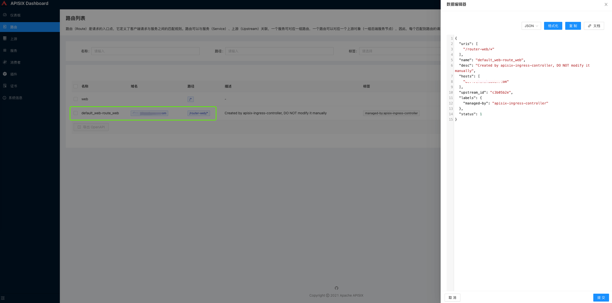
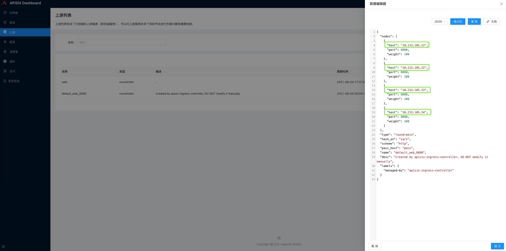

# **6 Gateway Services under Kubernetes - APISIX**

## 1. A comparison of several common gateways

* Nginx，模块化反向代理软件，C语言开发
* **OpenResty，一个基于 Nginx 的 web 开发平台，解析和执行 Lua 脚本**
* Kong，OpenResty的一个应用，是一个具有API管理和请求代理功能的API网关，使用PostgreSQL存储
* APISIX，替代Kong的PostgreSQL for Etcd，基于Nginx的核心库实现


APISIX的优势在于提供了API管理和扩展能力，允许对网关进行配置和定制，而不仅仅是转发服务。

相比Nginx，APISIX使用动态路由，避免了配置后重新加载的风险。

同时，APISIX支持HTTP(S)、HTTP2、Dubbo、QUIC、MQTT、TCP/UDP等更多协议，提供更好的使用生态



Above is the architecture of APISIX, where the data plane handles the client requests and the control plane manages the routes.

## 2. What problems APISIX can solve

**Edge routing**

机房对​​外暴露的访问入口IP数量通常很少，但支持的服务很多。例如访问IP为1.2.3.4，但同时提供a.domain.com、b.domain.com的访问。这需要使用边缘路由，它将访问不同的域并将它们转发到不同的 Intranet 地址。

APISIX中注册边缘路由的方式有3种，dashboard、ingress-controller、admin api。

* Basic gateway capability

网关的作用不仅限于转发流量，更重要的是限制流量、熔断等。

APISIX内置了很多插件，提供APM、日志、融合、认证、证书管理、故障注入等功能。还支持新插件的拖拽组合，支持新插件的开发，满足业务需求。

* Serverless

APISIX通过插件的方式提供Serverless，目前只支持Lua，但是APIGateway + Serverless的组合非常有想象力。

通过Serverless，可以快速对外提供免服务的API，绑定各种服务，也可以直接对外提供功能服务。

* Grayscale release

得益于网关层的控制，APISIX允许用户通过配置权重来控制流量的转发行为，可用于灰度分布。

## 3. Installing APISIX on Kubernetes

### 3.1 Adding the Helm source

* Add the Helm source

```
helm repo add apisix https://charts.apiseven.com
helm repo update
```

* Find a Chart package

```
helm search repo apisix

NAME                            	CHART VERSION	APP VERSION	DESCRIPTION
apisix/apisix                   	0.3.5        	2.7.0      	A Helm chart for Apache APISIX
apisix/apisix-dashboard         	0.1.5        	2.7.0      	A Helm chart for Apache APISIX Dashboard
apisix/apisix-ingress-controller	0.5.0        	1.0.0      	Apache APISIX Ingress Controller for Kubernetes
```


### 3.2 Installing APISIX

* Installing APISIX

```
helm install apisix apisix/apisix  --set gateway.type=NodePort --set admin.allow.ipList="{0.0.0.0/0}"  -n apisix --create-namespace
```

* View the entrance address

```
export NODE_PORT=$(kubectl get --namespace apisix -o jsonpath="{.spec.ports[0].nodePort}" services apisix-gateway)
export NODE_IP=$(kubectl get nodes --namespace apisix -o jsonpath="{.items[0].status.addresses[0].address}")
echo http://$NODE_IP:$NODE_PORT

http://1.1.1.1:32462
```

这里的入口地址是后端服务的入口地址。如果要生成环境，则应使用 LoadBalancer 提供的地址。

* View apisix-admin interface key

```
export POD_NAME=$(kubectl get pods --namespace apisix -l "app.kubernetes.io/instance=apisix,app.kubernetes.io/name=apisix" -o jsonpath="{.items[0].metadata.name}")

kubectl -n apisix exec -it $POD_NAME cat conf/config.yaml |grep key 

  admin_key:
      key: edd1c9f034335f136f87ad84b625c8f1
      key: 4054f7cf07e344346cd3f287985e76a2
```

第一个键是 admin，第二个键是 viewer。该密钥可用于通过管理 api 配置 APISIX，为其他系统与 APISIX 集成提供入口点。

### 3.3 Installing Dashboard

* Installing Dashboard

```
helm install apisix-dashboard apisix/apisix-dashboard -n apisix --create-namespace
```

The default account is: admin The default password is: admin

* View Dashboard Access Portal

```
export NODE_PORT=$(kubectl get --namespace apisix -o jsonpath="{.spec.ports[0].nodePort}" services apisix-gateway)
export NODE_IP=$(kubectl get nodes --namespace apisix -o jsonpath="{.items[0].status.addresses[0].address}")
echo http://$NODE_IP:$NODE_PORT

http://1.1.1.1:31501
```

### 3.4 Installing ingress-controller

* Installing ingress-controller

```
helm install apisix-ingress-controller apisix/apisix-ingress-controller   --set config.apisix.baseURL=http://apisix-admin:9180/apisix/admin  --set config.apisix.adminKey=edd1c9f034335f136f87ad84b625c8f1  -n apisix
```

这里需要设置上面获取到的admin key，其实ingress-controller也是通过调用admin api来配置路由的。

## 4. Create service tests


如前所述，APISIX 有三种方法可以通过管理 api 配置路由。这里我们将验证Dashboard和Ingress的使用。

* Create a service

```
kubectl create deployment web --image=gcr.io/google-samples/hello-app:1.0
```

* Exposure Services

```
kubectl expose deployment web --type=NodePort --port=8080
```

* View Services

```
kubectl get service web

NAME   TYPE       CLUSTER-IP      EXTERNAL-IP   PORT(S)          AGE
web    NodePort   10.233.58.113   <none>        8080:30572/TCP   28d
```

### 4.1 Dashboard Configuration Routing

* Create a new upstream service

这里需要填写上面创建的集群访问地址： web.default.svc.cluster.local



* Create a new route




点击Next后，选择上面创建的service web，相关参数会自动填充。



Access test



### 4.2 Ingress Configuration Routing

* Create an ApisixRoute route


这里虽然部署了ingress-controller组件，但是使用的时候创建的是ApisixRoute对象。

```
apiVersion: apisix.apache.org/v1 
kind: ApisixRoute 
metadata: 
  name: web-route 
spec:
  http:
  - name: web
    match:
      hosts:
      - dev4.fooboo.com
      paths:
      - "/router-web/*"
    backend:
     serviceName: web
     servicePort: 8080
```

* Access test



* View the created routes




可以发现路由是由ingress-controller管理的，不应该手动编辑。

* View Services




可以看到服务主要由四个后端提供。

* View the IP of the Service Pod

```
kubectl get pod  -o wide

NAME                   READY   STATUS    RESTARTS   AGE   IP              NODE    NOMINATED NODE   READINESS GATES
web-79d88c97d6-2sdlj   1/1     Running   0          27d   10.233.105.34   node4   <none>           <none>
web-79d88c97d6-7bfbb   1/1     Running   0          27d   10.233.105.32   node4   <none>           <none>
web-79d88c97d6-hccqk   1/1     Running   0          27d   10.233.105.33   node4   <none>           <none>
web-79d88c97d6-mh9gz   1/1     Running   0          28d   10.233.105.22   node4   <none>           <none>
```


**APISIX 会直接使用 Pod 的 IP 地址作为流量后端，不经过 Service 转发，这与 Kubernetes 的服务转发和负载均衡机制不同**。

## 5. Summary

在这篇文章中，我们简单描述了几种网关的区别，思考了APISIX能做什么来帮助我们解决问题，并最终在Kubernetes上进行了实践。内容如下。

* <mark>APISIX是基于Nginx网络库实现的API网关应用，使用Etcd作为存储后端</mark>
* <mark>APISIX 可以作为边缘路由，其动态特性避免了 Nginx 重载导致的抖动</mark>。
* <mark>APISIX 提供了管理路由的admin api，可以通过三种方式配置</mark>
* <mark>Kubernetes 下的 APISIX 跳过 Kubernetes Service，直接将流量转发到 Pod IP</mark>

