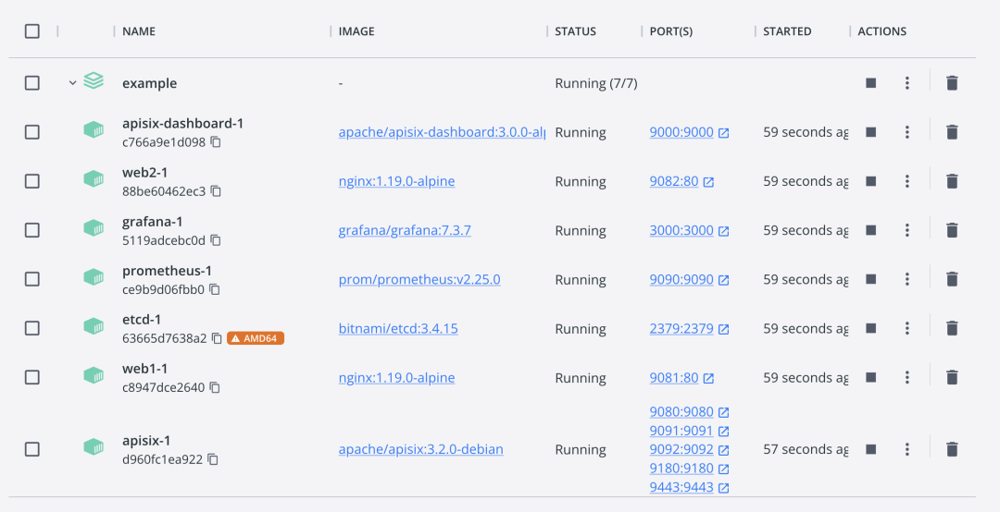
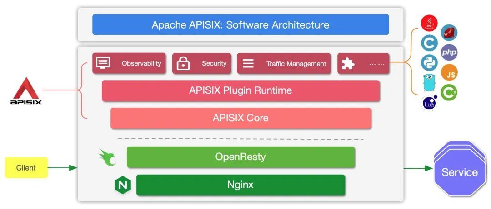
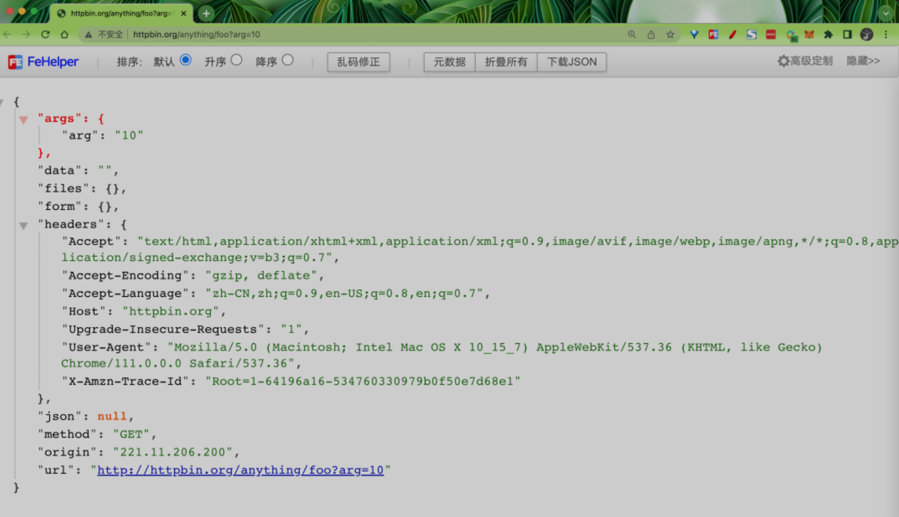
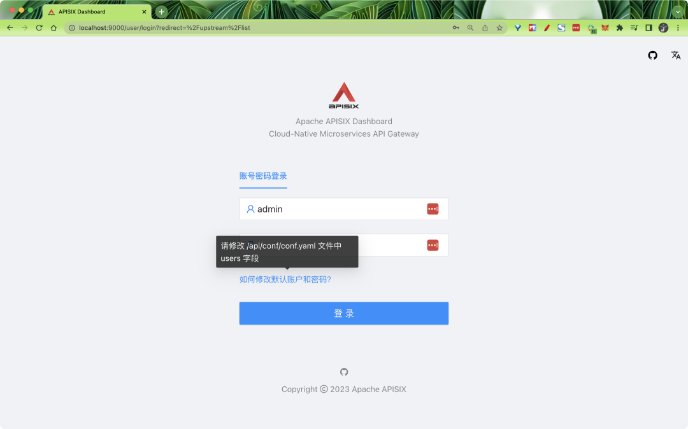
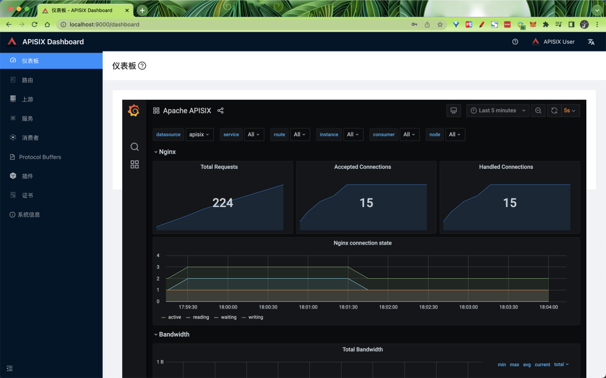
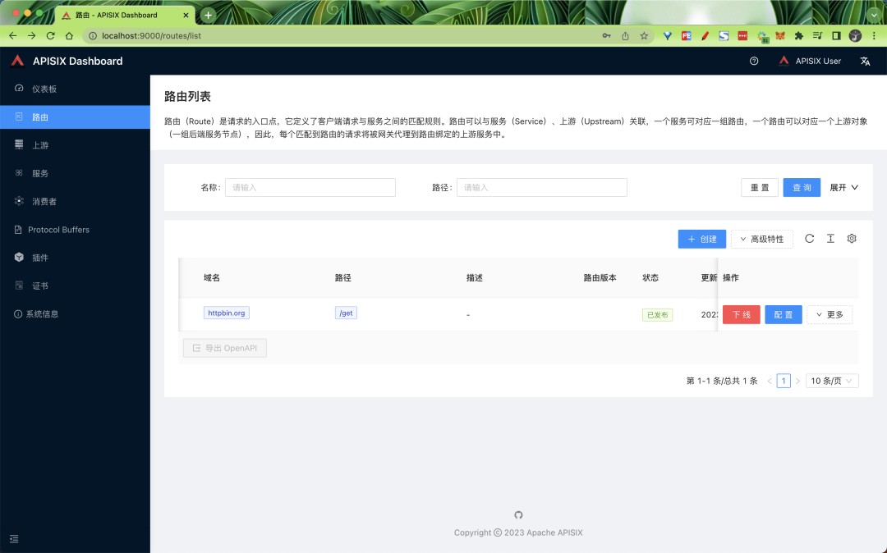
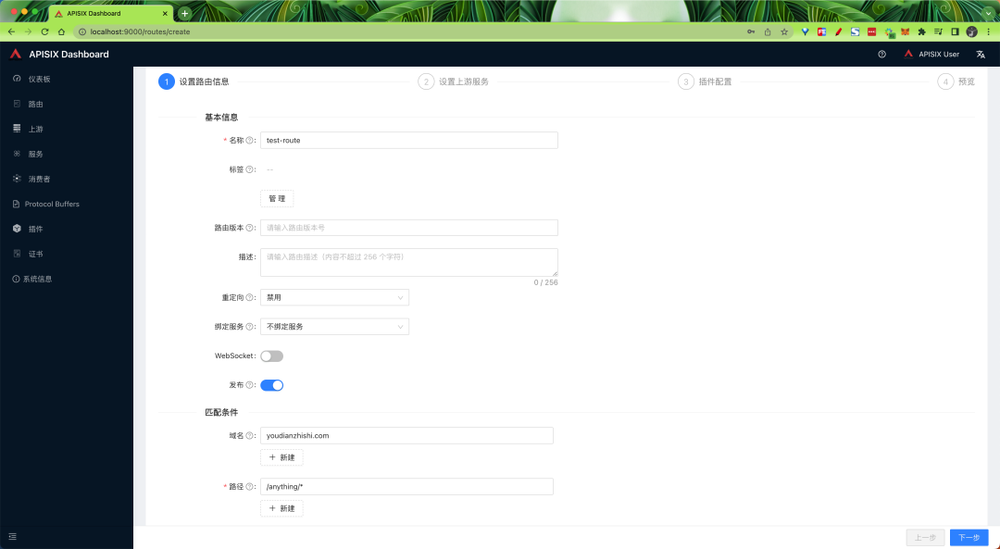
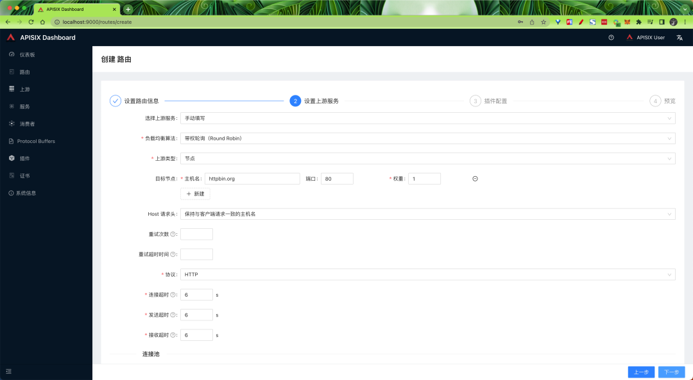

# 7 云原生 API 网关 APISIX 入门教程

Apache APISIX 是 Apache 软件基金会下的云原生 API 网关，它具有动态、实时、高性能等特点，提供了负载均衡、动态上游、灰度发布（金丝雀发布）、服务熔断、限速、防御恶意攻击、身份认证、可观测性等丰富的流量管理功能。

我们可以使用 Apache APISIX 来处理传统的南北向流量，也可以处理服务间的东西向流量。同时，它也支持作为 Kubernetes Ingress Controller 来使用。

APISIX 基于 Nginx 和 etcd，与传统 API 网关相比，APISIX 具有动态路由和热加载插件功能，避免了配置之后的 reload 操作，同时 APISIX 支持 HTTP(S)、HTTP2、Dubbo、QUIC、MQTT、TCP/UDP 等更多的协议。

而且还内置了 Dashboard，提供强大而灵活的界面。同样也提供了丰富的插件支持功能，而且还可以让用户自定义插件。

主要具有以下几个特点：

* **多平台支持**：APISIX 提供了多平台解决方案，它不但支持裸机运行，也支持在 Kubernetes 中使用，还支持与 AWS Lambda、Azure Function、Lua 函数和 Apache OpenWhisk 等云服务集成。
* **全动态能力**：APISIX 支持热加载，这意味着你不需要重启服务就可以更新 APISIX 的配置。请访问为什么 Apache APISIX 选择 Nginx + Lua 这个技术栈？以了解实现原理。
* **精细化路由**：APISIX 支持使用 NGINX 内置变量做为路由的匹配条件，你可以自定义匹配函数来过滤请求，匹配路由。
* **运维友好**：APISIX 支持与以下工具和平台集成：HashiCorp Vault、Zipkin、Apache SkyWalking、Consul、Nacos、Eureka。通过 APISIX Dashboard，运维人员可以通过友好且直观的 UI 配置 APISIX。
* **多语言插件支持**：APISIX 支持多种开发语言进行插件开发，开发人员可以选择擅长语言的 SDK 开发自定义插件。

## 安装 APISIX

为了简单，我们这里可以直接在本地使用 docker 方式来启动 APISIX，首先 Clone 官方提供的 apisix-docker 仓库：

```
➜ git clone https://github.com/apache/apisix-docker.git
➜ cd apisix-docker
```

在项目根目录下面的 example 目录中有启动 APISIX 的 `docker-compose` 配置文件，如下所示：

```
version: "3"

services:
  apisix-dashboard:
    image: apache/apisix-dashboard:3.0.0-alpine
    restart: always
    volumes:
      - ./dashboard_conf/conf.yaml:/usr/local/apisix-dashboard/conf/conf.yaml
    ports:
      - "9000:9000"
    networks:
      apisix:

  apisix:
    image: apache/apisix:3.2.0-debian
    restart: always
    volumes:
      - ./apisix_conf/config.yaml:/usr/local/apisix/conf/config.yaml:ro
    depends_on:
      - etcd
    ports:
      - "9180:9180/tcp"
      - "9080:9080/tcp"
      - "9091:9091/tcp"
      - "9443:9443/tcp"
      - "9092:9092/tcp"
    networks:
      apisix:

  etcd:
    image: rancher/coreos-etcd:v3.4.15-arm64
    user: root
    restart: always
    volumes:
      - ./etcd_data:/etcd-data
    environment:
      ETCD_UNSUPPORTED_ARCH: "arm64"
      ETCD_ENABLE_V2: "true"
      ALLOW_NONE_AUTHENTICATION: "yes"
      ETCD_ADVERTISE_CLIENT_URLS: "http://0.0.0.0:2379"
      ETCD_LISTEN_CLIENT_URLS: "http://0.0.0.0:2379"
      ETCD_DATA_DIR: "/etcd-data"
    ports:
      - "2379:2379/tcp"
    networks:
      apisix:

  web1:
    image: nginx:1.19.10-alpine
    restart: always
    volumes:
      - ./upstream/web1.conf:/etc/nginx/nginx.conf
    ports:
      - "9081:80/tcp"
    environment:
      - NGINX_PORT=80
    networks:
      apisix:

  web2:
    image: nginx:1.19.10-alpine
    restart: always
    volumes:
      - ./upstream/web2.conf:/etc/nginx/nginx.conf
    ports:
      - "9082:80/tcp"
    environment:
      - NGINX_PORT=80
    networks:
      apisix:

networks:
  apisix:
    driver: bridge
```

该 compose 里面主要包含了 APISIX 的三个容器：apisix、etcd 以及 apisix-dashboard。现在我们就可以使用 docker-compose 来进行一键启动：

```
➜ docker-compose -f docker-compose.yml up -d
```

另外两个 nginx 容器是用于测试的：



> docker-compose

请确保其他系统进程没有占用 9000、9080、9091、9092、9180、9443 和 2379 端口。如果启动有错误，可以尝试为 examples 目录设置成 777 权限，保证 etcd 数据有权限写入。

当 APISIX 启动完成后我们就可以通过 curl 来访问正在运行的 APISIX 实例。比如，可以发送一个简单的 HTTP 请求来验证 APISIX 运行状态是否正常。

```
➜ curl "http://127.0.0.1:9080" --head
HTTP/1.1 404 Not Found
Date: Tue, 21 Mar 2023 07:38:45 GMT
Content-Type: text/plain; charset=utf-8
Connection: keep-alive
Server: APISIX/3.2.0
```

现在，你已经成功安装并运行了 APISIX ！

## 功能测试

接下来我们来了解下 APISIX 的一些功能。在了解之前我们需要对 APISIX 的几个主要概念和组件简单了解下：

### 上游

Upstream 也称为上游，上游是对虚拟主机的抽象，即应用层服务或节点的抽象。

上游的作用是按照配置规则对服务节点进行负载均衡，它的地址信息可以直接配置到路由或服务上。当多个路由或服务引用同一个上游时，可以通过创建上游对象，在路由或服务中使用上游的 ID 方式引用上游，减轻维护压力。

### 路由

Route 也称为路由，是 APISIX 中最基础和最核心的资源对象。

APISIX 可以通过路由定义规则来匹配客户端请求，根据匹配结果加载并执行相应的插件，最后把请求转发给到指定的上游服务。路由中主要包含三部分内容：**匹配规则、插件配置和上游信息**。

### 服务

**Service 也称为服务，是某类 API 的抽象（也可以理解为一组 Route 的抽象）。**

它通常与上游服务抽象是一一对应的，Route 与 Service 之间，通常是 N:1 的关系。

### 消费者

Consumer 是某类服务的消费者，需要与用户认证配合才可以使用。

当不同的消费者请求同一个 API 时，APISIX 会根据当前请求的用户信息，对应不同的 Plugin 或 Upstream 配置。

如果 Route、Service、Consumer 和 Plugin Config 都绑定了相同的插件，只有消费者的插件配置会生效。

插件配置的优先级由高到低的顺序是：

`Consumer > Route > Plugin Config > Service`

对于 API 网关而言，一般情况可以通过请求域名、客户端 IP 地址等字段识别到某类请求方，然后进行插件过滤并转发请求到指定上游。但有时候该方式达不到用户需求，因此 APISIX 支持了 Consumer 对象。

### 插件

Plugin 也称之为插件，它是扩展 APISIX 应用层能力的关键机制，也是在使用 APISIX 时最常用的资源对象。

插件主要是在 HTTP 请求或响应生命周期期间执行的、针对请求的个性化策略。插件可以与路由、服务或消费者绑定。

> 如果路由、服务、插件配置或消费者都绑定了相同的插件，则只有一份插件配置会生效，插件配置的优先级由高到低顺序是：
> 
> 消费者 > 路由 > 插件配置 > 服务。
> 
> 同时在插件执行过程中也会涉及 6 个阶段，分别是 rewrite、access、`before_proxy`、`header_filter`、`body_filter` 和 log。

### Admin API

APISIX 提供了强大的 Admin API 和 Dashboard 供用户使用，Admin API 是一组用于配置 Apache APISIX 路由、上游、服务、SSL 证书等功能的 RESTful API。

我们可以通过 Admin API 来获取、创建、更新以及删除资源。同时得益于 APISIX 的热加载能力，资源配置完成后 APISIX 将会自动更新配置，无需重启服务，具体的架构原理可以查看下面的架构图：



主要分为两个部分：

* **APISIX 核心**：包括 Lua 插件、多语言插件运行时（Plugin Runner）、Wasm 插件运行时等；
* **功能丰富的各种内置插件**：包括可观测性、安全、流量控制等。

APISIX 在其核心中，提供了路由匹配、负载均衡、服务发现、API 管理等重要功能，以及配置管理等基础性模块。

除此之外，APISIX 插件运行时也包含其中，提供原生 Lua 插件的运行框架和多语言插件的运行框架，以及实验性的 Wasm 插件运行时等。APISIX 多语言插件运行时提供多种开发语言的支持，比如 Golang、Java、Python、JS 等。

APISIX 目前也内置了各类插件，覆盖了 API 网关的各种领域，如认证鉴权、安全、可观测性、流量管理、多协议接入等。当前 APISIX 内置的插件使用原生 Lua 实现，关于各个插件的介绍与使用方式，后续我们再介绍。

### 创建路由

下面的示例中我们先使用 Admin API 来创建一个 Route 并与 Upstream 绑定，当一个请求到达 APISIX 时，APISIX 会将请求转发到指定的上游服务中。

以下示例代码中，我们将为路由配置匹配规则，以便 APISIX 可以将请求转发到对应的上游服务：

```
➜ curl "http://127.0.0.1:9180/apisix/admin/routes/1" -X PUT -d '
{
  "methods": ["GET"],
  "host": "foobar.com",
  "uri": "/anything/*",
  "upstream": {
    "type": "roundrobin",
    "nodes": {
      "httpbin.org:80": 1
    }
  }
}' -H 'X-API-KEY: edd1c9f034335f136f87ad84b625c8f1'
# 正常会得到如下所示的结果
{"value":{"create_time":1679392758,"methods":["GET"],"host":"foobar.com","status":1,"priority":0,"update_time":1679392758,"upstream":{"pass_host":"pass","hash_on":"vars","type":"roundrobin","nodes":{"httpbin.org:80":1},"scheme":"http"},"id":"1","uri":"/anything/*"},"key":"/apisix/routes/1"}
```

> 其中的 X-API-KEY 的值在 APISIX 的配置文件中 `apisix_config.yaml` 中有配置，位于 `deployment.admin.admin_key` 下面。

该配置意味着，当请求满足下述的所有规则时，请求将被转发到上游服务（httpbin.org:80）：

* 请求的 HTTP 方法为 GET。
* 请求头包含 host 字段，且它的值为 `foobar.com`。
* 请求路径匹配 `/anything/*`，`*` 意味着任意的子路径，例如 `/anything/foo?arg=10`。

当路由创建完成后，现在我们就可以通过以下命令访问上游服务了：

```
➜ curl -i -X GET "http://127.0.0.1:9080/anything/foo?arg=10" -H "Host: foobar.com"
HTTP/1.1 200 OK
Content-Type: application/json
Content-Length: 443
Connection: keep-alive
Date: Tue, 21 Mar 2023 08:25:49 GMT
Access-Control-Allow-Origin: *
Access-Control-Allow-Credentials: true
Server: APISIX/3.2.0

{
  "args": {
    "arg": "10"
  },
  "data": "",
  "files": {},
  "form": {},
  "headers": {
    "Accept": "*/*",
    "Host": "foobar.com",
    "User-Agent": "curl/7.85.0",
    "X-Amzn-Trace-Id": "Root=1-64196a0d-1d2b654b29cbed3f7a9302c7",
    "X-Forwarded-Host": "foobar.com"
  },
  "json": null,
  "method": "GET",
  "origin": "172.22.0.1, 221.11.206.200",
  "url": "http://foobar.com/anything/foo?arg=10"
}
```

该请求将被 APISIX 转发到 `http://httpbin.org:80/anything/foo?arg=10`，我们可以和直接访问上游数据进行对比。



> httpbin数据

### 使用上游服务创建路由

我们还可以通过以下命令创建一个上游，并在路由中使用它，而不是直接将其配置在路由中：

```
➜ curl "http://127.0.0.1:9180/apisix/admin/upstreams/1" -X PUT -d '
{
  "type": "roundrobin",
  "nodes": {
    "httpbin.org:80": 1
  }
}' -H 'X-API-KEY: edd1c9f034335f136f87ad84b625c8f1'
# 正常会得到如下所示的输出
{"value":{"type":"roundrobin","create_time":1679392818,"pass_host":"pass","hash_on":"vars","update_time":1679392818,"nodes":{"httpbin.org:80":1},"id":"1","scheme":"http"},"key":"/apisix/upstreams/1"}
```

该上游配置与上一节配置在路由中的上游相同。同样使用了 `roundrobin` 作为负载均衡机制，并设置了 `httpbin.org:80` 为上游服务。为了将该上游绑定到路由，此处需要把 `upstream_id` 设置为 "1"。

上游服务创建完成后，现在我们可以通过以下命令将其绑定到指定的 `/get` 路由：

```
➜ curl "http://127.0.0.1:9180/apisix/admin/routes/1" -X PUT -d '
{
  "uri": "/get",
  "host": "httpbin.org",
  "upstream_id": "1"
}' -H 'X-API-KEY: edd1c9f034335f136f87ad84b625c8f1'
# 正常会得到如下所示的输出
{"value":{"upstream_id":"1","status":1,"create_time":1679392758,"host":"httpbin.org","update_time":1679392834,"priority":0,"id":"1","uri":"/get"},"key":"/apisix/routes/1"}
```

我们已经创建了路由与上游服务，现在可以通过以下命令访问上游服务：

```
➜ curl -i -X GET "http://127.0.0.1:9080/get?foo1=bar1&foo2=bar2" -H "Host: httpbin.org"
HTTP/1.1 200 OK
Content-Type: application/json
Content-Length: 370
Connection: keep-alive
Date: Tue, 21 Mar 2023 08:40:19 GMT
Access-Control-Allow-Origin: *
Access-Control-Allow-Credentials: true
Server: APISIX/3.2.0

{
  "args": {
    "foo1": "bar1",
    "foo2": "bar2"
  },
  "headers": {
    "Accept": "*/*",
    "Host": "httpbin.org",
    "User-Agent": "curl/7.85.0",
    "X-Amzn-Trace-Id": "Root=1-64196d73-165daa124c362e5d4c6bb79d",
    "X-Forwarded-Host": "httpbin.org"
  },
  "origin": "172.22.0.1, 221.11.206.200",
  "url": "http://httpbin.org/get?foo1=bar1&foo2=bar2"
}
```

同样该请求也会被 APISIX 转发到 `http://httpbin.org:80/anything/foo?arg=10`。

### 使用 Dashboard

同样我们还可以使用 APISIX Dashboard 创建和配置类似于上述步骤中所创建的路由。

如果你已经完成上述操作步骤，正常现在我们已经可以通过 `localhost:9000 ` 来访问 APISIX Dashboard 了。



默认的用户名和密码均为 admin，在 examples 目录中 `dashboard_conf `下面的 `conf.yaml `进行配置：

```
authentication:
  secret: secret
  expire_time: 3600
  users:
    - username: admin
      password: admin
    - username: user
      password: user
```

上面我们的 docker-compose 中也已经启动了 Grafana，所以登录后我们也可以在首页仪表盘上配置 Grafana，地址为 `http://localhost:3000`。



登录后单击侧边栏中的路由，可以查看已经配置的路由列表，可以看到在上述步骤中使用 Admin API 创建的路由。



你也可以通过单击创建按钮并按照提示创建新路由：





如果想利用 APISIX 实现身份验证、安全性、限流限速和可观测性等功能，可通过添加插件实现。

### 限流限速和安全插件

在很多时候，我们的 API 并不是处于一个非常安全的状态，它随时会收到不正常的访问，一旦访问流量突增，可能就会导致你的 API 发生故障，这个时候我们就可以通过速率限制来保护 API 服务，限制非正常的访问请求。

对此，我们可以使用如下方式进行：

* 限制请求速率；
* 限制单位时间内的请求数；
* 延迟请求；
* 拒绝客户端请求；
* 限制响应数据的速率。

APISIX 提供了多个内置的限流限速的插件，包括 `limit-conn`、`limit-count` 和 `limit-req`。


* limit-conn 插件主要用于限制客户端对服务的并发请求数。
* limit-req 插件使用漏桶算法限制对用户服务的请求速率。
* limit-count 插件主要用于在指定的时间范围内，限制每个客户端总请求个数。

这里我们就以 `limit-count` 插件为例，来说明如何通过限流限速插件保护我们的 API 服务。如下所示。

使用下面的命令首先创建一条路由：

```
➜ curl -i http://127.0.0.1:9180/apisix/admin/routes/1 -X PUT -d '
{
    "uri": "/index.html",
    "plugins": {
        "limit-count": {
            "count": 2,
            "time_window": 60,
            "rejected_code": 503,
            "key_type": "var",
            "key": "remote_addr"
        }
    },
  "upstream_id": "1"
}' -H 'X-API-KEY: edd1c9f034335f136f87ad84b625c8f1'
```

这里我们直接使用前面已经创建的上游（ID 为 1）来创建/更新一条路由，并且在 plugins 中启用了 `limit-count` 插件，该插件仅允许客户端在 60 秒内，访问上游服务 2 次，超过两次，就会返回 503 错误码。

上面的指令执行成功后，接下来我们连续使用下面的命令访问三次后，则会出现如下错误。

```
➜ curl http://127.0.0.1:9080/index.html
➜ curl http://127.0.0.1:9080/index.html
➜ curl http://127.0.0.1:9080/index.html
```

正常情况下就会出现如下所示的 503 错误，则表示 limit-count 插件已经配置成功。

```
<html>
  <head>
    <title>503 Service Temporarily Unavailable</title>
  </head>
  <body>
    <center><h1>503 Service Temporarily Unavailable</h1></center>
    <hr />
    <center>openresty</center>
    <p>
      <em>Powered by <a href="https://apisix.apache.org/">APISIX</a>.</em>
    </p>
  </body>
</html>
```

### 缓存响应

当我们在构建一个 API 时，肯定希望他能够尽量保持简单和快速，一旦读取相同数据的并发需求增加，可能会面临一些问题，一般我们直接的办法就是引入缓存，当然我们可以在不同层面去进行缓存的。

* 边缘缓存或 CDN
* 数据库缓存
* 服务器缓存（API 缓存）
* 浏览器缓存

反向代理缓存是另一种缓存机制，通常在 API 网关内实现。它可以减少对你的端点的调用次数，也可以通过缓存上游的响应来改善对你的 API 请求的延迟。

如果 API Gateway 的缓存中有所请求资源的新鲜副本，它就会使用该副本直接满足请求，而不是向端点发出请求。如果没有找到缓存的数据，请求就会转到预定的上游服务（后端服务）。

我们这里主要了解的是 API 网关层的缓存，也就是 APISIX 提供的 API 缓存，它也可以和其他插件一起使用，目前支持基于磁盘的缓存，也可以在插件配置中指定缓存过期时间或内存容量等。

比如我们现在有一个 `/products` 的 API 接口，通常每天只更新一次，而该端点每天都会收到重复的数十亿次请求，以获取产品列表数据，现在我们就可以使用 APISIX 提供的一个名为 `proxy-cache` 的插件来缓存该接口的响应。

这里我们还是使用前面 ID 为 1 的上游对象，使用 `/anything/products` 来模拟产品接口，直接执行下面的命令来更新路由的插件：

```
➜ curl "http://127.0.0.1:9180/apisix/admin/routes/1" -H "X-API-KEY: edd1c9f034335f136f87ad84b625c8f1" -X PUT -d '{
  "name": "Route for API Caching",
  "methods": [
    "GET"
  ],
  "uri": "/anything/*",
  "plugins": {
    "proxy-cache": {
      "cache_key": [
        "$uri",
        "-cache-id"
      ],
      "cache_bypass": [
        "$arg_bypass"
      ],
      "cache_method": [
        "GET"
      ],
      "cache_http_status": [
        200
      ],
      "hide_cache_headers": true,
      "no_cache": [
        "$arg_test"
      ]
    }
  },
  "upstream_id": "1"
}'
```

更新完成后现在我们来对该接口发起几次请求：

```
➜ curl http://localhost:9080/anything/products -i

HTTP/1.1 200 OK
Content-Type: application/json
Content-Length: 398
Connection: keep-alive
Date: Tue, 21 Mar 2023 10:48:42 GMT
Access-Control-Allow-Origin: *
Access-Control-Allow-Credentials: true
Server: APISIX/3.2.0
Apisix-Cache-Status: MISS

➜ curl http://localhost:9080/anything/products -i

HTTP/1.1 200 OK
Content-Type: application/json
Content-Length: 398
Connection: keep-alive
Date: Tue, 21 Mar 2023 10:48:42 GMT
Access-Control-Allow-Origin: *
Access-Control-Allow-Credentials: true
Server: APISIX/3.2.0
Apisix-Cache-Status: HIT
```

正常每次都应该收到 HTTP 200 OK 响应，但是第一次响应中的 `Apisix-Cache-Status` 显示为 MISS，这意味着当请求第一次进入路由时，响应还没有被缓存。而

后面的几次请求会得到一个缓存的响应，缓存指标变为了 HIT，表示我们的响应缓存成功了。