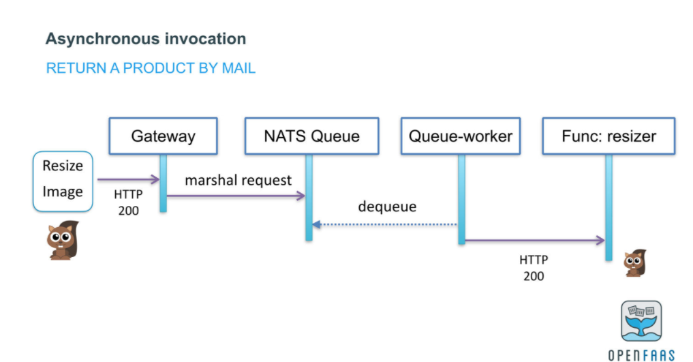

# **第十节 Mesh的未来发展与可行性方向**

## **1、中间件 Mesh 化的可行性**

Service Mesh 主要接管服务间的流量，包括边缘网关的南北向流量和内部通信的东西向流量。

* Service Mesh 主要接管服务间的流量
* 服务和中间件通信的流量也非常重要，是未来整个微服务 Mesh 化中重要的一环。

**<mark>FaaS（Function as a Service）也是未来微服务架构重要的演进方向之一，在 FaaS 架构中，Service Mesh 同样可以作为底层基础设施接管服务间的流量。</mark>**

### **1-1 中间件 Mesh 化**

著名的数据面已经支持了诸多数据库和队列中间件

 

### **1-2 Redis 代理**

Envoy 可以作为 Redis 的代理，部署在每个服务的节点上，这样就无须传统的 Redis 中间件负责 Redis 集群的代理工作，也不需要传统 Redis 官方提供的 Smart Client。

**Envoy 可以替代这部分功能，控制 Redis 集群，路由到正确的 hash 分片节点上。**

**使用 Envoy 做 Redis 代理，既避免了传统的 Smart Client 的升级维护问题，也避免了传统的 Redis 中间件中心化的问题。**

通过 Mesh 的架构、Metrics 注入等方式，可以看到到底是哪个服务调用的 Redis，再配合服务间的链路调用图，这样整个内网间所有流量的链路调用图就可以绘制出来了。

目前 Envoy 的 Redis 代理支持以下功能：

* Redis 协议的编解码；
* 基于哈希的分片；
* Ketama 一致性哈希算法；
* 详细的数据统计信息；
* 对于 Redis 节点的主动和被动健康检查；
* 上游代理和下游代理分别进行身份认证。

 

Envoy 对于 Redis 的支持相对比较简单，当然未来社区也在规划支持更多的功能，包括熔断、链路追踪、重试等
 
 
数据库中间件产品（比如 Redis 集群中间件、MySQL 集群中间件）的功能主要是对数据做分片处理，以解决单个 Redis 或者 MySQL 节点无法处理的负载。

**这些功能最早也在 SDK 中，因为维护升级不方便，所以演进成了数据库中间件。**随着 Mesh 化架构的流行，在服务本地部署一个 Sidecar，就可以解决数据库中间件产品中心化的问题。

**数据库中间件的 Mesh 化和传统的服务 Mesh 化**，关注的点略有不同：

**数据库的中间件产品更关注的是对于数据的分片处理**，比如 MySQL 的分库分表等算法、Redis 集群的分片算法等。但也有很多功能是通用的，**比如限流熔断等治理功能、链路追踪、Metrics 监控，甚至服务发现等功能**。

### **1-3 FaaS**

**<mark>FaaS（Function as a Service）是一种在无状态容器中运行的事件驱动模型</mark>**。

简单来说，Function 是比 Service 更小的程序单元，**如果要进行标准化的 FaaS 化改造，就需要进一步拆分，将微服务中的每个方法都拆成一个单独的服务**。

FaaS 依然是一种非常理想化的架构，比如在服务 0 节点的情况下要消耗大量的时间等待服务启动，但 FaaS 中的一些核心思想，依然是微服务架构的发展趋势，或者说它们可以直接落地，比如强大的自动扩缩容能力、基于异步的事件驱动模型等

FaaS 的开源方案有 Knative、OpenFaaS、Fission、Kubeless 等，下面我们简单介绍一下这几种常见的开源方案。

 

* Knative

Knative 是谷歌牵头发起的 Serverless 项目，是基于 Kubernetes 和 Istio 的 Serverless 解决方案。

* OpenFaaS

OpenFaaS 是一个使用 Docker 构建无服务器（Serverless）功能的框架，可以部署在 Kubernetes 或者 Swarm 平台。通过 Watchdog 启动进程的方式进行函数式调用。

* Fission

Fission 是一款基于 Kubernetes 的 FaaS 框架，通过 Fission 可以轻而易举地将函数发布成 HTTP 服务。它的主要特点是 Fission 维护一个容器池，可以做到函数 100ms 冷启动。

* Kubeless

Kubeless 是基于 Kubernetes 的 Serverless 框架，借助 Kubernetes 提供自动扩缩容、API 路由、监控的功能。

### **1-4 Knative**

Knative 包含三个核心组件，**分别是负责服务处理的 Serving、事件处理的 Eventing，以及负责云原生 CI/CD 构建的 Tekton**。

* Serving

Knative Serving 组件依托于 Kubernetes 平台和 Istio，提供服务自动扩缩容、服务路由、流量代理、容器部署等功能。

* Eventing

Eventing 主要由事件源（EventSource）、事件处理（Flow）以及事件消费者（EventConsumer）三部分构成，定义了 CloudEvent 的通用事件标准。

* Tekton

Tekton 是一个功能强大且灵活的 Kubernetes 云原生 CI/CD 开源框架。

 

下图中的 Route 可以理解为 Istio Gateway 的角色。实际上，大多数 FaaS 架构，都有一个类似 API Gateway 的角色，主要用来处理流量的转发，在 Pod 数量为 0 时，也会做一些特殊处理，比如此时要 hold 住流量，等待 Pod 启动。

 

流量经过 Gateway（Route）后，会有两个分支，

* 一个是服务的 Pod 存在的时候，流量会直接路由到 Pod 上面；
* 另外一个在 Pod 缩容到 0 的情况下，会转发到一个 Activator 的组件中，**这个组件的主要功能是对容器资源的调度**。

**当有流量被转发到 Activator 组件时，它会主动通知 Autoscaler 组件进行扩容操作，这时 Autoscaler 会创建新的 Pod，提供服务。**

此时 Activator 对启动的 Pod 进行健康检查，检查通过后，将流量转发到相应的 Pod 上面。

 Activator 组件处理完流量后，会将结果返回给 Gateway
 
 
**在流量被转发到 Activator 组件这个分支的过程中，如果 Pod 数量为 0，本次流量处理的时间在很大程度上就取决于 Pod 启动的时间，而这个时间大概率是秒级别的**。
 
**但在实际生产中，一般的请求需要毫秒级别返回结果，秒级别的响应速度很难接受，这也是 FaaS 架构目前在落地中面临的最大问题，大部分对响应速度要求比较高的场景，Pod 缩容为 0 都是难以接受的。**

所以 Knative 也提供了 Pod 是否缩容到 0 的选项，这样更有利于 FaaS 架构的落地。尽管没有做到完全的 Serverless，但能够拥有强大的扩缩容能力已经非常有诱惑力了。

### **1-5 OpenFaaS**

统的微服务调用。在这张图片中，我们的需求是从数据库中读取数据，并根据获取的数据生成一个 PDF 文件上传到 S3 服务器中。但是这个场景消耗的时间会比较长，大概是 2 分钟左右，而且下图的同步架构，会阻塞程序进程，前端的响应也会等待很长时间。

在传统的微服务架构中，一般我们也不会采用下图的同步系统，而是采用异步队列系统解决：将生成 PDF 作为事件存入队列中，通过队列消费生成 PDF 并上传到 S3 服务器，这样就可以大大提高微服务的同步响应速度了。

 

在 FaaS 中有没有更好的解决方案呢？我们来看 OpenFaaS 中的异步方案。

### **1-6 异步**

在 OpenFaaS 中， OpenFaaS 将请求作为事件直接放入 NATS 这个队列系统中，对于使用者来说，他并不需要关心这是否是一个异步调用。

这个调用的编程方式，依然是 HTTP 的方式，只是 OpenFaaS Gateway 自动将此次 HTTP 调用放入了 NATS 队列中，通过 queue-worker这个进程进行队列消费，再通过 HTTP 请求 Generate Statement 服务的方式触发此次服务调用，**用看起来同步的方式完成了整个异步调用**。

 

整个运行过程

 

* 在这个架构中，使用者无须关心甚至无须感知 NATS 队列系统，对于使用者来说，这看起来就是一次普通的 HTTP 服务调用。
* 而 PDF 生成服务的编写者，也不需要处理复杂的队列消费，对于他来说，也和其他同步服务一样，提供一个简单的 HTTP 服务接口就可以了。
* FaaS 架构让队列系统和业务解耦，

 

