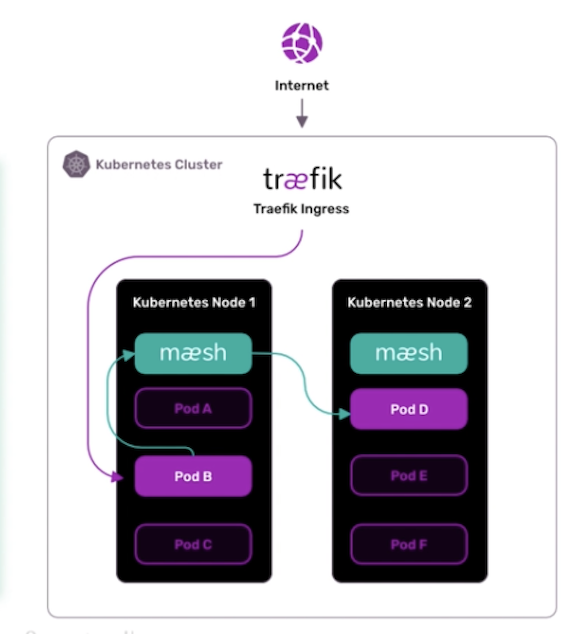

# **第一节 Service Mesh 开源产品中的技术选型**

Service Mesh，译为服务网格，简单来说就是将可以配置的代理层和服务部署在一起，作为微服务基础设施层接管服务间的流量，并提供通用的服务注册发现、负载均衡、身份验证、精准路由、服务鉴权等基础功能。

## **1、为什么要引入 Service Mesh**

### **1-1 框架/SDK 升级维护困难**

### **1-2 无法维护多语言 SDK**

### **1-3 老项目迁移困难**

### **1-4 缺乏统一控制面**

早期的框架基本上都是 Web 框架，没有考虑远程下发配置的问题，对微服务的一些配置并不能动态的更新，也没有想 Service Mesh 这样的统一控制面，可以通过下发配置修改服务间的调用行为，比如路由配置等。

## **2、常见的 Service Mesh 解决方案**

### **2-1 Istio + Envoy**

现如今，Istio 几乎是 Service Mesh 的代名词了，**Istio 包含控制面 Istiod 和数据面 Envoy 两个组件**。

* 其中 Istiod 是 Istio 的控制面，负责配置校验和下发、证书轮转等工作；
* Envoy 则负责数据代理和流量路由等工作。

准确来说 Istio 实际上只是 Service Mesh 的控制面，而 Istio + Envoy 才组成整个 Service Mesh 体系，这有点像 GNU/Linux，通常被简单地称为 Linux。

* Istio 包含负责配置下发的 Pilot、
* 负责证书轮转的 Citadel 
* 负责配置校验的 Galley。

在 1.5 版本去除 mixer 后， Istio 已经变得相对简单了，它的主要工作就是配置下发。

Envoy 是 C++ 编写的高性能边缘网关和代理程序，支持 HTTP、gRPC、Thrift、Redis、MongoDB 等多种协议代理。当然这里面支持最好的还是 HTTP，它几乎具备了 Service Mesh 数据面需要的所有功能，比如服务发现、限流熔断、多种负载均衡策略、精准流量路由等。

### **2-2 Linkerd**

Linkerd 是云原生软件公司 Buoyant 开源的 Service Mesh 方案，而 Service Mesh 的概念也是 Linkerd 首先提出的

Linkerd 开发了 2.0 版本，**数据面使用 Rust 编写，控制面基于 Go 语言实现**。

* **mTLS**：Linkerd 为所有网格内的服务提供双向 TLS 加密认证的功能，保证流量传输安全。
* **可观测性**：提供了 Grafana 的图形界面以及链路追踪功能。
* **协议支持**：提供了 gRPC、HTTP、HTTP/2 等多种协议支持。
* **负载均衡**：提供了多种负载均衡功能，包括基于当前请求数的 P2C 算法、基于 EWMA 的多种策略的 P2C 算法，以及常规的 WRR 和 RR 算法。
* **动态路由功能**：支持根据 header 设置不同的路由规则，支持流量转移功能，可以在不同服务之间、相同服务不同版本之间做流量转移。

### **2-3 SOFAMesh**

* **SOFAMesh 是蚂蚁金服开源的 Service Mesh 解决方案，包含数据面 MOSN 和修改后的 Istio Pilot 控制面**。不过在最新版本，控制面已经停止维护，转而和社区合作，使用 Istio 作为控制面。
* **多协议转发**：MOSN 支持最好的是蚂蚁的 SOFARPC，最近也增强了对 Dubbo 的支持，对于 HTTP 和 HTTP/2 的支持较弱。如果你的公司多是基于 HTTP 和 gRPC 协议构建的微服务，不太适合使用。
* **路由**：支持 VirtualHost 和基于 header、URL、Prefix 等多种路由方式。
* **负载均衡**：支持基本的 RoundRobin 和 Random 算法、基于当前请求数的 P2C 算法，也支持基于 host subset 分组路由算法，以实现金丝雀发布和染色等功能。
* **TLS**：对于 HTTP、HTTP/2、SOFARPC 都支持 TLS 双向加密。
* **平滑重启**：针对 Dubbo、SOFARPC 等私有 RPC 协议，支持在不断开连接的情况下平滑重启，以保证 Sidecar 在升级过程中不影响业务。

### **2-4 Kong Mesh-Kuma**

**现在 Kong 推出了基于 Envoy 的 Service Mesh 解决方案——Kuma**

**Kuma 最大的特点是同时支持 Kubernetes 和 VM 虚拟机**，这样即便公司存在多种运行环境，也可以支持。

另外它也支持单一控制面同时控制多套集群，由于使用 Envoy 作为数据面，所以在核心功能支持上和 Istio 相差不大，比较特别的是支持 Kong 作为入口网关层。此外**，Kuma 采用 Go 语言编写，方便二次开发扩展**

### **2-5 NGINX Service Mesh**

Nginx 包含一个**处理东西流量的 NGINX Plus 数据面和一个用作入口网关（南北向流量）的NGINX Plus**，都可以通过控制面进行控制。

控制面专门为 NGINX Plus 开发，下发配置用于控制 NGINX Plus 的数据面，主要包含以下部分。

* Grafana：用于收集 Metrics 指标的可视化展示。
* Kubernetes Ingress Controllers：管理入口和出口流量。
* SPIRE：复杂证书轮转。
* NATS：负责下发配置，比如路由信息更新等。
* Open Tracing：分布式链路追踪，同时支持 Zipkin 和 Jaeger。
* Prometheus：收集 Metrics 信息，包括请求数，连接数，SSL 握手次数等。

需要注意的是，NGINX Plus 是 Nginx 收费版本，并不是开源软件，无法进行二次开发。

 

### **2-6 Traefik Mesh**

Traefik Mesh 由 Go 语言编写的开源网关系统 Traefik 演进而来，**<mash>与其他提到的 Mesh 解决方案不同，Taeafik Mesh 将 Sidecar 部署在了 Kubernetes Node 节点上</mash>**。

这样的好处是在同一个 Node 节点上的 Pod，可以共享一个 Sidecar，不用为每个 Pod 单独分配 Sidecar 资源，**从而达到节省资源的目的，同时相对于在 Pod 的 Container 里部署 Sidecar，这样也方便升级维护**。

但这种做法也有缺点，资源隔离性不好，容易相互影响，比如同一个 Node 节点上某个服务出现了问题，从而占用了更多的资源，其他的 Pod 可能就没有资源可用了。

 

### **2-7 Consul Connect**

Consul Connect 是 HashiCorp 公司开源的 Service Mesh 解决方案，**需要和 Consul 绑定使用，同样采用 Envoy 作为数据面，Consul Connect 充当控制面的角色**。

 

Traffic Director 是Google Cloud Platform（谷歌云平台）提供的 Service Mesh 解决方案，**同时支持虚拟机和容器环境**。它使用 Envoy 作为数据面，通过 xDS API 与数据面进行通信。

**Traffic Director 通过集中化的健康检查**代替了 Envoy 内置网格的健康检查方式，这样做的好处是减少了网格健康检查带来的服务压力，但需要注意的是集中式的健康检查无法处理网络分区故障的问题。

 

在诸多开源解决方案中，都使用了 Envoy 作为数据面，比如 Consul、Connnet、Kuma 等。

 