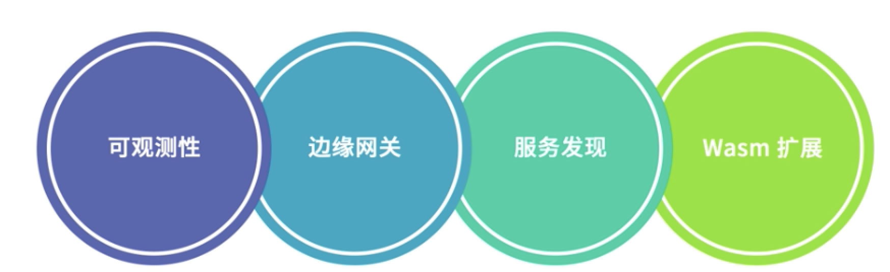
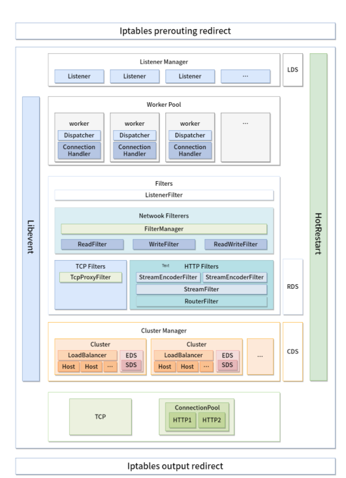
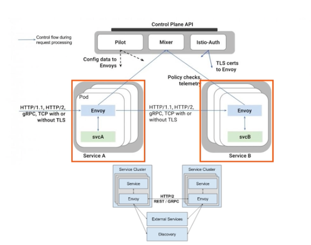
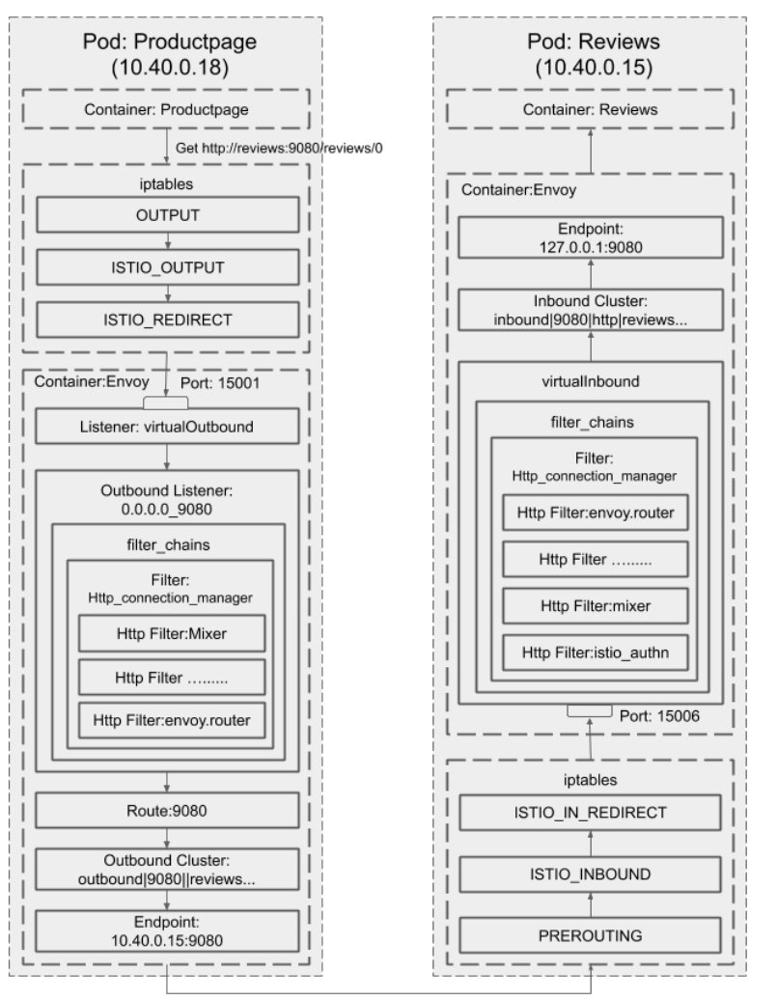

# **第二节 最常用的数据面 Envoy介绍**


Envoy 是专为大型现代 SOA（面向服务架构）架构设计的 L7 代理和通信总线，它既可以作为 **Service Mesh 中的数据面使用，也可以作为入口网关层使用**，可以通过 `xDS API` 控制 Envoy 的监听、路由、负载均衡等行为。

## **1、核心功能**


 

 


* **高性能设计**：采用 C++ 编写，拥有良好的四层、七层代理性能，在 8 核的机器上，HTTP 代理可以达到 10w 的 QPS，gRPC 可以达到 15w QPS，完全满足了 Service Mesh 中 Sidecar 的应用场景。
* **Filter 架构**：可以在四、七层编写 Filter 以扩展 Envoy 的功能，比如监听过滤器、四层网络过滤器，以及七层过滤器。**不过 Envoy 支持最完善的还是HTTP 过滤器**，支持了限流、路由转发、故障注入等多种服务治理功能，
* **良好的 HTTP/2 支持**：随着 gRPC 框架的流行以及边缘层网络性能的要求提升，HTTP/2 越来越被重视。Envoy 原生支持 HTTP/2，可以在 HTTP 和 HTTP/2 之间做转换。比如在 Sidecar 模式中，**无论应用协议是 HTTP 还是 HTTP/2，Envoy 之间默认使用 HTTP/2 通信**，这样极大提升了服务性能和稳定性，避免了 HTTP 频繁建立连接带来的消耗和不稳定性。
* **多种协议支持**：不仅支持 HTTP 和 HTTP/2，随着社区的发展，Thrift、gRPC、MongoDB、Redis、MySQL 等多种网络协议都被支持，甚至可以使用 Envoy 做 Redis 的 Mesh 方案，用来代替流行的 Redis 中间件。
* **可观测性**：支持强大的统计系统。日志、Metrics、链路追踪都有良好的支持。
* **边缘网关**：Envoy 本身就是一个高性能的网络代理组件，**完全可以作为入口网关层使用，在 Kubernetes 中，也可以作为 Egress 和 Ingress 使用**。
* **服务发现**：和其他常见的网络代理软件不同，Envoy 默认支持服务发现组件。**Envoy 使用了一套xDS 的动态 API**，获取服务的后端节点并实时更新，结合 Envoy 强大的负载均衡器，可以做到最终一致性。
* **Wasm 扩展**：Envoy 在最近的 1.17 版本增加了对 Wasm 的支持。Wasm 全称为 WebAssembly，最早用在浏览器端用来解决 JavaScript 性能问题和大型项目团队协作问题。近些年，它开始在一些后端技术上使用，用来代替 Lua，作为核心系统的扩展方式。因为 Wasm 可以使用多种语言进行开发，所以方便对核心系统进行扩展，不用担心语言问题。当然相对于原生的 C++ 扩展方式，它大概有 3 成的性能损耗。


## **2、架构设计**

下图是 Envoy 架构的设计图，从图中我们可以看到入流量经过 Iptables 劫持被转发到了 Envoy 的端口，Envoy 通过监听端口创建连接，提供七层代理服务

 

* **Iptable**：通过 Iptable 劫持，将入口和出口流量都转发到 Envoy 上，达到劫持流量的目的。
* **Listener：Envoy 通过建立多个监听器提供不同的服务**。
	* 比如通过监听的两个端口分别负责 Sidecar 模式的出流量和入流量，Sidecar 多使用这种设计，这样可以简化编程逻辑，也可以增强 Filter 的通用性。如果提供不同协议，Envoy 也会建立不同的端口来提供服务。
* **Worker**：每个 Listener 维护一个对应的 Worker Pool，Envoy 为每个逻辑处理器创建一个 Worker 线程，当我们在一个新的端口启动一个新的 server 时，Envoy 也会根据 `-concurrency` 创建对应的 Worker 线程，**要注意启动太多的 worker 线程并不一定是好事**，特别是在 Sidecar 模式，我们并不会分配过多的逻辑核心给到 Sidecar，创建过多的 Worker 线程可能导致每个 Worker 线程维护的连接变多，Upstream 压力过大。
* **Filters：可以理解为中间件，通过 Filter，可以做到四层和七层的流量过滤，支持服务治理需要的限流、熔断等功能**。
* **Cluster Manager**：流量经过 Router，识别出需要转发的 Cluster，通过 Cluster Manager 进行服务发现和负载均衡等功能。
* **Upstream**：Upstream 维护了 EndPoint 的连接池，通过负载具衡器，将流量转发到合适的 EndPoint 上面。

 

**Envoy 作为 Sidecar 使用时，需要和服务部署在同一台机器或者 Pod 中，用户访问其他服务时，流量会被自动劫持到 Envoy 中。**


下图是 Productpage 服务通过 HTTP 协议，调用 review 服务的过程。

 

* 通过 Iptables 对流量进行劫持，将 Productpage 访问 Reviews 的流量转发到 Envoy 的出流量 15001 端口上。
* Envoy **先根据 `virtual_hosts` 进行匹配，再通过路由匹配，发现路由对应的 Cluster，通过服务发现找到 Cluster 对应的 EndPoint**，将流量转发到 `10.40.0.15:9080` 的 Pod 上。
* Reviews 的 Pod 通过 Iptables 对流量进行劫持，将流量劫持到 Envoy 的入流量端口 15006 上。
* Envoy 将本地流量转发到对应的本地地址` 127.0.0.1:9080`，这里不需要对流量进行识别，因为流量被转发到入流量端口 15006 上，这个端口的配置用于本地流量的转发。
* 到这里整个 Sidecar 的流量出入过程就结束了。出入流量都经由 Envoy，最终被正确的转发到了 Reviews 的 Pod 上面。


## **2、静态配置**

Envoy 的配置分为**静态配置和动态配置**，静态配置就是手动填写的配置，动态配置是指由 xDS API 获取的配置

如下代码，这里定义了 Listener 监听器，监听端口为 10000。

`virtual_hosts` 匹配所有域名，Routes 的匹配规则为所有 Path，也就是所有访问 10000 端口的请求都会被转发到 `service_google` 服务。

```
listeners:
- name: listener_0
  address:
    socket_address: { address: 0.0.0.0, port_value: 10000 }
  filter_chains:
  - filters:
    - name: envoy.http_connection_manager
      config:
        stat_prefix: ingress_http
        codec_type: AUTO
        route_config:
          name: local_route
          virtual_hosts:
          - name: local_service
            domains: ["*"] // 匹配所有域名
            routes:
            - match: { prefix: "/" }// 匹配所有 path
              route: { host_rewrite: www.google.com, cluster: service_google } // 将流量转发到 service_google 服务
        http_filters:
        - name: envoy.router
```
 
下面的配置是 `service_google` 服务的负载均衡器，连接超时时间，以及要转发的地址。


```
clusters:
- name: service_google
  connect_timeout: 0.25s
  type: LOGICAL_DNS
  # Comment out the following line to test on v6 networks
  dns_lookup_family: V4_ONLY
  lb_policy: ROUND_ROBIN
  hosts: [{ socket_address: { address: google.com, port_value: 443 }}]
  tls_context: { sni: www.google.com }
```

## **3、边缘代理模式**

Envoy 不仅可以用于 Sidecar 模式，也可以用作边缘网关，但是用作边缘网关层我们有一些注意事项，

### **3-1 HTTP 标头清理**

一些外部传入的 header 可能会影响内部行为，应该统一做出清理操作，比如我们经常会用到的 `x-forward-for`，在反向代理中，未经过一层代理，都应该将代理的 IP 追加在 `x-forward-for `中，以保证通过 `x-forward-for` 可以获取最原始的 IP，**如果有客户端恶意传输 `x-forward-for`，不做清除操作可能会导致拿到错误的客户端 IP**。

**在 Envoy 中可以通过 `use_remote_address` 设置为 true 来清理 HTTP 标头**。


### **3-2 超时控制**

**超时控制分为连接超时、流超时和路由超时**。

这些超时控制不仅在边缘网关模式中需要注意，在 Sidecar 模式也需要注意，一些不合理的超时可能会引起服务的雪崩。虽然在内网服务调用时一般都会设置默认超时，但 Sidecar 应该设置一个默认的超时时间，避免服务没有设置有效超时的情况引起的问题。

### **3-4 连接超时**

**Envoy 为 HTTP 服务提供了空闲连接超时时间的设置**，空闲超时是指一个连接在接收到请求后，会设置 TCP 的 idle Timeout 的参数，一段时间内没有收到代理服务的响应请求，则会断开连接。Envoy 默认的空闲超时是 1 小时。连接超时对所有流生效，连接一旦断开，所有流处理也会中断。

### **3-5 流超时**

流是 HTTP/2 中的概念，在 HTTP/1 中没有流的概念，Envoy 通过将 HTTP 连接对应到流模式，统一进行处理。

HTTP 连接管理器 `stream_idle_timeout` 默认超时时间为 5 分钟，推荐对所有流设置合理的超时时间，**这个时间就是接收请求到返回数据的处理时间，如果没有特殊需求，建议设置为 10s，默认超时时间偏长**。如果触发此超时时间，则会出发 504 Gateway Timeout 的错误码。


### **3-6 路由超时**


除了设置全局的流超时外，还可以设置路由层面的超时，为某些请求设置特殊的配置，一些请求可能需要更快的响应速度，所以要设置较短的超时时间，这个时候只要在路由层面设置即可，比如针对某些 Path 设置更短的超时时间。

### **3-7 连接限制**

Envoy 可以针对全局或者监听器设置连接限制。一般单一服务器可承载的并发连接数有限，根据线上的峰值连接运行情况，设置合理的连接设置，**可以避免因服务出问题时响应过慢，大量新建 HTTP 连接击垮 Envoy 的情况。**

Envoy 不仅可以作为 Service Mesh 中的 Sidecar 使用，也可以作为边缘网关使用，它的本质就是一个反向代理服务器，Nginx、HAProxy 能做的事情 Envoy 也可以做得很好。

