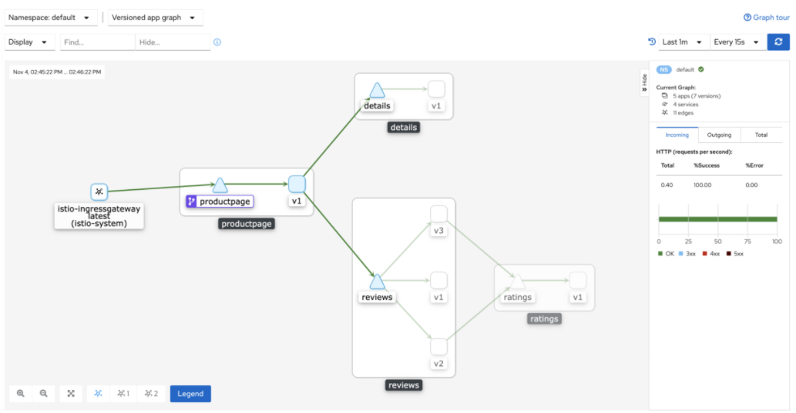
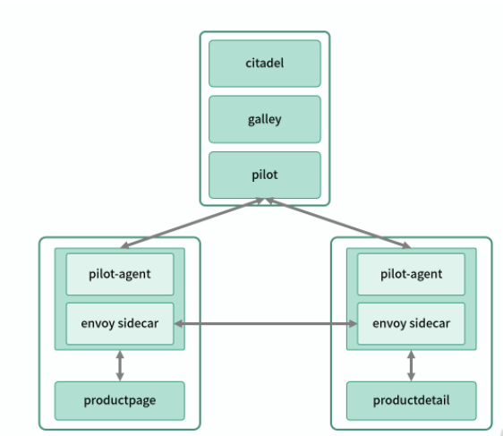

# **第三节 Istio 入门：基于最新 1.7 版本的环境搭建和介绍**

谈到 Service Mesh，不得不提及 Istio，作为 Google、IBM、lynx 联合推出的 Service Mesh 解决方案，Istio 几乎成了 Service Mesh 的代名词，但实际上 Istio 仅仅是 Service Mesh 中的控制面，它的主要功能是为数据面下发服务治理策略。

Istio 最近在 1.5 版本进行了一次大的变更，由早期的微服务架构变成了单体架构。**之前版本的Istio 由 Pilot、Citadel、Galley、Sidecar 注入器等多个微服务组成，但现在只需要一个 Istiod 的单体服务。**

最新版本的 Istio 控制面由以下几个组件组成。

* **Pilot：Istio 控制面中最核心的模块，负责运行时配置下发**，具体来说，就是和 **Envoy 之间基于 xDS 协议进行的各种 Envoy 配置信息的推送**，包括服务发现、路由发现、集群发现、监听器发现等。
* **Citadel**：负责证书的分发和轮换，使 Sidecar 代理两端实现双向 TLS 认证、访问授权等。
* **Galley**：**配置信息的格式和正确性校验，将配置信息提供给 Pilot 使用**。


## **1、Istio 环境搭建**

因为 Istio 强依赖于 Kubernetes 环境，所以我们需要先进行 Kubernetes 环境的搭建，为了更加方便，我们使用 Minikube 在本地搭建。

在 macOS 环境下，只要简单运行如下命令即可：

```
$ brew install minikube
$ minikube start --kubernetes-version=v1.19.2 --driver=docker
```


另外启动过程中，如果遇到问题，可以加上 `--alsologtostderr` 输出详细的错误信息，建议将 Docker 版本也升级至最新。

下载最新版本的 Istio：

```
$ curl -L https://istio.io/downloadIstio | ISTIO_VERSION=1.7.3 sh -
```

**为了保证后续命令的准确性，这里指定了版本号**。

进入下载目录：

```
$ cd istio-1.7.3
```

将 Istioctl 客户端添加到可执行路径：

```
$ export PATH=$PWD/bin:$PATH
```

使用 Istioctl 客户端安装 Istio：

```
$ istioctl install --set profile=demo
```

在默认命名空间开启自动注入 Envoy Sidecar：

```
$ kubectl label namespace default istio-injection=enabled

```

通过上述操作，Istio 的环境就安装好了，你可以通过下面的命令查看 Istio 组件：

```
$ kubectl get svc -n istio-system

NAME                   TYPE           CLUSTER-IP       EXTERNAL-IP   PORT(S)                                                                      AGE

istio-egressgateway    ClusterIP      10.104.140.107   <none>        80/TCP,443/TCP,15443/TCP                                                     2d5h
istio-ingressgateway   LoadBalancer   10.103.123.96    <pending>     15021:32148/TCP,80:32124/TCP,443:31370/TCP,31400:31690/TCP,15443:32721/TCP   2d5h
istiod                 ClusterIP      10.106.54.115    <none>        15010/TCP,15012/TCP,443/TCP,15014/TCP,853/TCP                                2d5h
```

Istio 以一个服务的形式部署在 Kubernetes 集群中。我们可以看到，部署好的 Pods 中，除了有 Istiod 这个核心组件外，**还有 Istio Egressgate Way 和 Istio Ingressgate Way 两个组件，分别是出口网关和入口网关**。

## **2、部署 Bookinfo 示例程序**

部署示例程序：

```
$ kubectl apply -f samples/bookinfo/platform/kube/bookinfo.yaml
```
通过下面的命令可以查看 Pod 的运行状态：

```
$ kubectl get pods
```

当 Pod ready 后，我们可以通过内部服务访问的方式，查看服务的运行情况：

```
$ kubectl exec "$(kubectl get pod -l app=ratings -o jsonpath='{.items[0].metadata.name}')" -c ratings -- curl -s productpage:9080/productpage | grep -o "<title>.*</title>"
<title>Simple Bookstore App</title>
```

现在，服务已经正常启动了。接下来，我们通过 Ingress 的方式，让浏览器可以打开这个页面。

通过 Ingress 打通内外网服务：


```
$ kubectl apply -f samples/bookinfo/networking/bookinfo-gateway.yaml
gateway.networking.istio.io/bookinfo-gateway created
virtualservice.networking.istio.io/bookinfo created
```

查看 Minikube 的 IP：

```
$ minikube ip
127.0.0.1
```

然后，打开新的终端窗口，为 LoadBalancer 类型的服务打通外网：

```
$ minikube tunnel
The service Istio -ingressgateway requires privileged ports to be exposed: [80 443]
sudo permission will be asked for it.
Starting tunnel for service Istio -ingressgateway.
Password:
```

打开浏览器访问`http://127.0.0.1/productpage`（IP 替换为上面运行的 Minikube IP）， 就可以看到如下页面了。

 

## **3、可观测性部署**

Kiali 是一个基于服务网格的 Istio 管理控制台，它提供了一些数据的仪表盘和可观测能力，同时可以让你去操作网格的配置。

使用如下方式快速部署一个用于演示的 Kiali：

```
$ kubectl apply -f samples/addons
```

```
$ kubectl get pod -n istio-system -o wide
NAME                                    READY   STATUS    RESTARTS   AGE   IP            NODE       NOMINATED NODE   READINESS GATES
grafana-57bb676c4c-4nfcd                1/1     Running   3          13d   172.18.0.11   minikube   <none>           <none>
istio-egressgateway-8556f8c8dc-pnlbl    1/1     Running   4          16d   172.18.0.4    minikube   <none>           <none>
istio-ingressgateway-589d868684-xcx42   1/1     Running   4          16d   172.18.0.6    minikube   <none>           <none>
istiod-86d65b6959-jl8fs                 1/1     Running   4          16d   172.18.0.3    minikube   <none>           <none>
jaeger-75948789b4-9bc4f                 1/1     Running   15         13d   172.18.0.13   minikube   <none>           <none>
kiali-7d5cb68b45-cz75l                  1/1     Running   13         13d   172.18.0.5    minikube   <none>           <none>
prometheus-7c8bf6df84-8jp99             2/2     Running   12         13d   172.18.0.9    minikube   <none>           <none>
```

如果有启动比较慢的 Pod，我们也可以通过下面的命令查看一下 Pod 的事件，了解一下具体原因。

```
$ kubectl describe pod kiali-7d5cb68b45-cz75l -n istio-system
```
Pod 全部启动成功后，通过下面的命令查看整个调用关系情况：

```
$ istioctl dashboard kiali
```


 


## **4、实例服务原理解析**


```
apiVersion: v1
kind: Service
metadata:
  name: productpage
  labels:
    app: productpage
    service: productpage
spec:
  ports:
  - port: 9080
    name: http
  selector:
    app: productpage
```

接下来，我们通过 Deployment 控制 Pod 的生命周期，定义了 Pod 的副本数量。下面的示例中，定义一个 replicas 为 1，也就是 Pod 的副本数量为 1，因为是测试环境，所以没有设置更多的副本数量保障服务的 SLA 。

```
apiVersion: apps/v1
kind: Deployment
metadata:
  name: productpage-v1
  labels:
    app: productpage
    version: v1
spec:
  replicas: 1
  selector:
    matchLabels:
      app: productpage
      version: v1
  template:
    metadata:
      labels:
        app: productpage
        version: v1
    spec:
      serviceAccountName: bookinfo-productpage
      containers:
      - name: productpage
        image: docker.io/istio/examples-bookinfo-productpage-v1:1.16.2
        imagePullPolicy: IfNotPresent
        ports:
        - containerPort: 9080
        volumeMounts:
        - name: tmp
          mountPath: /tmp
      volumes:
      - name: tmp
        emptyDir: {}
```

另外在 Kubernetes 的 Service 里面并没有版本的概念，如果我们想进行染色或者金丝雀发布，就需要借助 Istio 的能力。

**通过上述命令可以看到，在 Deployment 类型中定义了 Version V1 的 lable，这个 lable 最终会转化成不同的服务名，比如 productpage-v1 的方式，下发到 Sidecar 中， Sidecar 根据这个服务名称进行服务发现，以实现不同版本号访问的方法。**

下一步，我们用到了 Ingress 模式。我们定义一组网关类型的资源， **Istio 通过 Gateway 将服务发布成外部可访问的服务**，通过 80 端口将服务通过 Ingress 网关转发到特定的服务上。

```
apiVersion: networking.istio.io/v1alpha3
kind: Gateway
metadata:
  name: bookinfo-gateway
spec:
  selector:
    istio: ingressgateway # use istio default controller
  servers:
  - port:
      number: 80
      name: http
      protocol: HTTP
    hosts:
    - "*"
```

在这里，Gateway 资源类型，需要配合 VirtualService 类型的资源一起使用。

在这个程序中你可以看到匹配到 `/productpage` 路径的服务，而在 route 中定义了 destination 的 host 将会是路由的服务名。

```
apiVersion: networking.istio.io/v1alpha3
kind: VirtualService
metadata:
  name: bookinfo
spec:
  hosts:
  - "*"
  gateways:
  - bookinfo-gateway
  http:
  - match:
    - uri:
        exact: /productpage
    - uri:
        prefix: /static
    - uri:
        exact: /login
    - uri:
        exact: /logout
    - uri:
        prefix: /api/v1/products
    route:
    - destination:
        host: productpage
        port:
          number: 9080
```
 
 
 

* Istio 通过 Galley 模块管理配置，
* **Pilot 模块解析配置为 xDS 协议格式**，通过 gRPC 和 Envoy 进行通信，以便完成配置和节点信息更新， 
* pilot-agent 作为 Envoy 守护模块，保证 Envoy 的正常运行和平滑重启。

 

本地业务服务 productpage 通过 iptables 劫持的方式和本地 Envoy 进行通信，Envoy 完成服务发现后将请求转发到 ProductDetail 服务的所在 Pod，同样通过 iptables 劫持的方式将请求转发到本地的业务服务 ProductDetail。


 