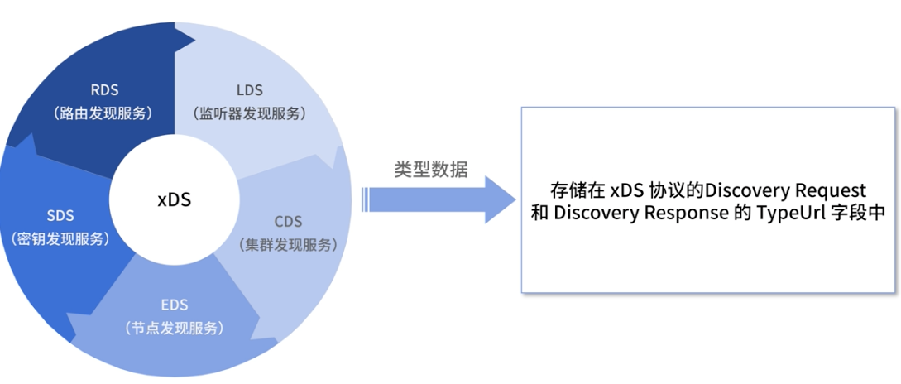
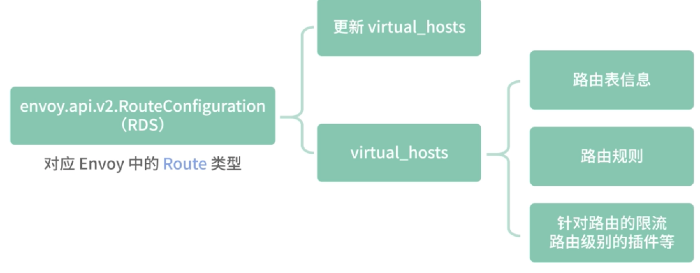
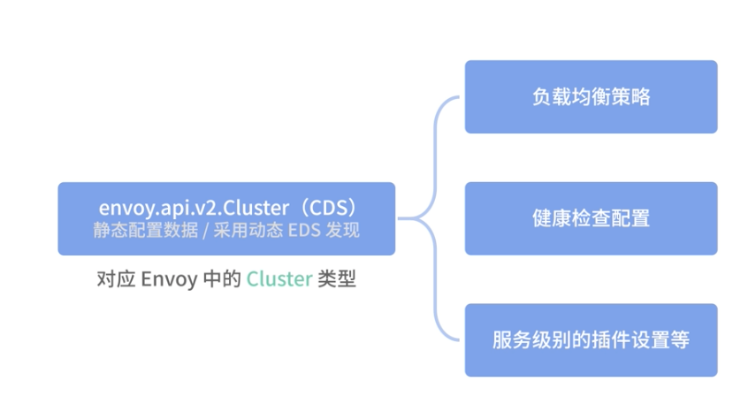
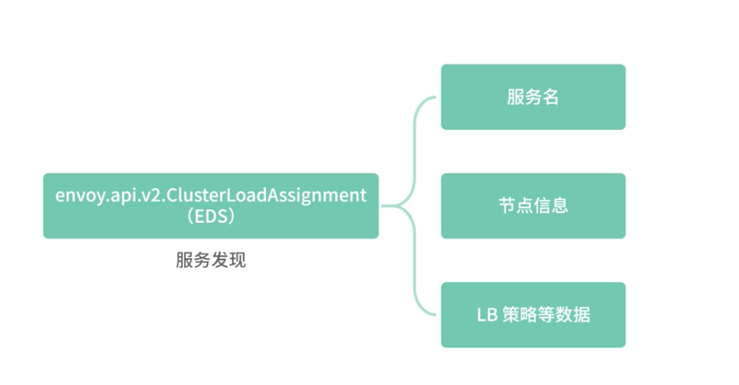
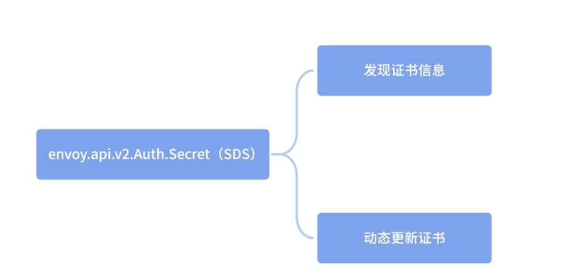
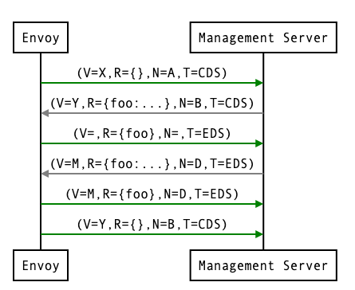
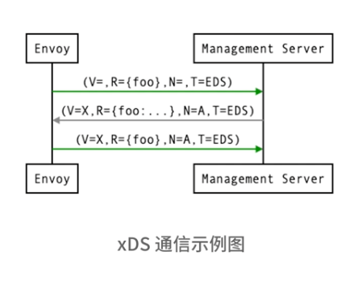
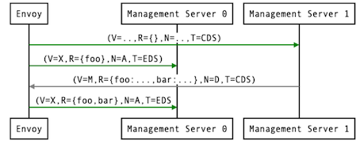
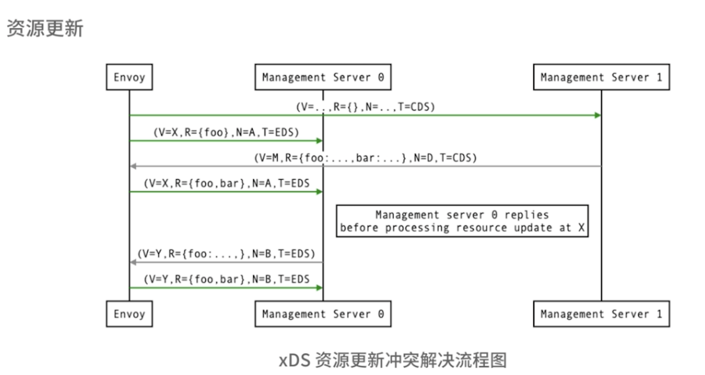
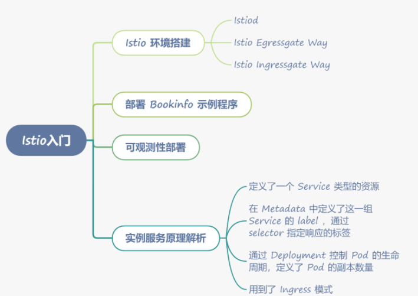

# **第四节 xDS：控制面和数据面的通信桥梁**

通过查询一个或多个管理服务器获取数据以发现动态资源变更，比如 Router、Cluster、EndPoint 等，**我们把这些发现服务及其对应的 API 称为 xDS** 。


xDS 最大的价值就是定义了一套可扩展的通用微服务控制 API，**<mark>这些API不仅可以做到服务发现，也可以做到路由发现、集群发现，可以说所有配置都能通过发现的方式解决，这是一种全新的解决方案</mark>**，所以 xDS API 不仅被用在了 Service Mesh 中，也用在了一些 RPC 框架中，比如 gRPC 就是用 xDS 协议做服务发现的。

## **1、xDS 概念介绍**

xDS 包含 

* LDS（监听器发现服务）、
* CDS（集群发现服务）、
* EDS（节点发现服务）、
* SDS（密钥发现服务）
* RDS（路由发现服务）。

**xDS 中每种类型对应一个发现的资源，这些类型数据存储在 xDS 协议的 Discovery Request 和 Discovery Response 的 TypeUrl 字段中, 这个字段按照以下格式存储：**


 

```
type.googleapis.com/<resource type>
```

比如 `type.googleapis.com/envoy.api.v2.Cluster` 就表**明是 `Cluster` 类型的资源，需要按照 `Cluster` 类型处理数据**。

**`envoy.api.v2.Listener（LDS）`：对应 Listener 数据类型，包含了监听器的名称、监听端口、监听地址等信息，通过动态更新此类**型，可以动态新增监听器或者更新监听器的地址端口等信息。

 

LDS 的数据结构如下：

```
{
  "name": "...",
  "address": "{...}",
  "filter_chains": [],
  "use_original_dst": "{...}",
  "per_connection_buffer_limit_bytes": "{...}",
  "metadata": "{...}",
  "drain_type": "...",
  "listener_filters": [],
  "listener_filters_timeout": "{...}",
  "continue_on_listener_filters_timeout": "...",
  "transparent": "{...}",
  "freebind": "{...}",
  "socket_options": [],
  "tcp_fast_open_queue_length": "{...}",
  "traffic_direction": "...",
  "udp_listener_config": "{...}",
  "api_listener": "{...}",
  "connection_balance_config": "{...}",
  "reuse_port": "...",
  "access_log": []
}
```

**`envoy.api.v2.RouteConfiguration（RDS）`：对应 Envoy 中的 Route 类型，用于更新 `virtual_hosts`，以及 `virtual_hosts` 包含的路由表信息、路由规则、针对路由的限流、路由级别的插件等，包括路由匹配到的 Cluster**。

 

RDS 的数据结构如下：

```
{
  "name": "...",
  "virtual_hosts": [],
  "vhds": "{...}",
  "internal_only_headers": [],
  "response_headers_to_add": [],
  "response_headers_to_remove": [],
  "request_headers_to_add": [],
  "request_headers_to_remove": [],
  "most_specific_header_mutations_wins": "...",
  "validate_clusters": "{...}"
}
```

**`envoy.api.v2.Cluster（CDS）`：对应 Envoy 中的 Cluster 类型，包含了 Cluster 是采用静态配置数据，还是采用动态 EDS 发现的方式，包括 Cluster 的负载均衡策略、健康检查配置等，以及服务级别的插件设置。**

 

CDS 的数据结构如下：

```
{
  "transport_socket_matches": [],
  "name": "...",
  "alt_stat_name": "...",
  "type": "...",
  "cluster_type": "{...}",
  "eds_cluster_config": "{...}",
  "connect_timeout": "{...}",
  "per_connection_buffer_limit_bytes": "{...}",
  "lb_policy": "...",
  "hosts": [],
  "load_assignment": "{...}",
  "health_checks": [],
  "max_requests_per_connection": "{...}",
  "circuit_breakers": "{...}",
  "tls_context": "{...}",
  "upstream_http_protocol_options": "{...}",
  "common_http_protocol_options": "{...}",
  "http_protocol_options": "{...}",
  "http2_protocol_options": "{...}",
  "extension_protocol_options": "{...}",
  "typed_extension_protocol_options": "{...}",
  "dns_refresh_rate": "{...}",
  "dns_failure_refresh_rate": "{...}",
  "respect_dns_ttl": "...",
  "dns_lookup_family": "...",
  "dns_resolvers": [],
  "use_tcp_for_dns_lookups": "...",
  "outlier_detection": "{...}",
  "cleanup_interval": "{...}",
  "upstream_bind_config": "{...}",
  "lb_subset_config": "{...}",
  "ring_hash_lb_config": "{...}",
  "original_dst_lb_config": "{...}",
  "least_request_lb_config": "{...}",
  "common_lb_config": "{...}",
  "transport_socket": "{...}",
  "metadata": "{...}",
  "protocol_selection": "...",
  "upstream_connection_options": "{...}",
  "close_connections_on_host_health_failure": "...",
  "drain_connections_on_host_removal": "...",
  "filters": [],
  "track_timeout_budgets": "..."
}
```

**`envoy.api.v2.ClusterLoadAssignment（EDS）`：EDS，也就是我们常说的服务发现。包含服务名、节点信息和 LB 策略等数据。**

 

EDS 的数据结构如下：

```
{
  "cluster_name": "...",
  "endpoints": [],
  "policy": "{...}"
}
```

**`envoy.api.v2.Auth.Secret（SDS）`：用于发现证书信息，以动态更新证书。**

早期 Istio 使用变更 TLS 证书文件，然后热重启 Envoy 的方式更新证书，**现在通过 SDS 即可动态更新证书**。

 

SDS 的数据结构如下：

```
{
  "name": "...",
  "tls_certificate": "{...}",
  "session_ticket_keys": "{...}",
  "validation_context": "{...}",
  "generic_secret": "{...}"
}
```

`Envoy xDS` 协议最早并没有采用 gRPC 流式订阅，而是采用 `rest-json` 轮询的模式实现，**后来因为 `gRPC` 流式订阅数据更新更加及时，性能也相对高效，所以在 `v2` 版本转向了 gRPC 的方式更新数据**。

接下来我们主要看一下 gRPC 流式订阅模式。

## **3、gRPC 流式订阅**

### **3-1 API 请求顺序**

典型的 HTTP 路由场景，客户端需要先获取 Listener 资源，通过 Listener 资源拿到 Route 的配置。

**Route 中包含一个或者多个 Cluster 集群资源，通过 Cluster 集群的信息再获取集群节点的信息，这样整个请求链路就完成了。**

### **3-2 全量请求和增量请求**

传统的 xDS 协议会全量响应订阅数据，对于中途新增的资源订阅来说，这无疑是资源浪费，所以 xDS 新增了增量订阅。

**也就是说，当出现新的资源时，只需向 Management Server 发送新增的资源，Management Server 也只会返回新增资源的数据。**

### **3-3 多条请求流和单条请求流**

xDS 协议并不约束在请求多个资源时，多个资源使用同一个请求流，还是每个资源各使用一个请求流，Management Server 应该同时支持这两种模式。

### **3-4 在一个连接请求多个资源**

在早期的设计中，xDS 被设计为多个连接，比如 CDS、EDS 分别和 Management Server 建立连接。在后续的改进中，支持在一条连接中按照顺序获取 xDS 中的各种 API，比如先请求 CDS，然后请求 EDS。

 

## **4、xDS 协议详解**

### **4-1 xDS 协议详解**

 xDS API 的基础知识
 
 一个请求信息示例：
 
```
version_info:
node: { id: envoy }
resource_names:
- foo
- bar
type_url: type.googleapis.com/envoy.api.v2.ClusterLoadAssignment
response_nonce:
```
如上述内容，每个请求流都带有一个 `version_info` 表明版本信息。这个例子中的 `version_info` 为空，表示这是连接中的第一个请求流，后续会根据 `Management Server` 推送的 `version_info `传递。


**Node 中的 ID 则表明机器信息，需要传递机器的唯一标识，可以用机器的 hostname。**

只有流上的第一个请求需要携带这个字段，后续如果推送发生了变化，也以第一个为准，因为这个值在 Management Server 会被绑定在连接对应的 stream 上。

`resource_names` 是一个多态信息，在不同的 xDS 类型中表示不同的意思，这里是 Cluster 集群的名称。

`type_url` 表示 xDS 的类型，这里是 CDS，即集群发现服务。


**`response_nonce` 是 Management Server 推送的响应唯一标识，响应信息中的 `Nonce` 会作为请求信息中的 `response_nonce` 发送，就像一会我们将在资源更新部分讲解的一样，`Nonce` 主要是用来消除 ACK 和 NACK 之间的歧义。**

在这个例子中，因为是首次请求，`response_nonce` 为空。

```
version_info: X
resources:
- foo ClusterLoadAssignment proto encoding
- bar ClusterLoadAssignment proto encoding
type_url: type.googleapis.com/envoy.api.v2.ClusterLoadAssignment
nonce: A
```

* `version_info`：Management Server 响应或者推送给客户端 Envoy 的消息中，都会携带一个最新的版本号。
* resources：这个是返回请求信息中 `resource_names` 对应的 Protobuf 协议的结构体。
* `type_url`：和请求信息中的意思相同。
* Nonce：每次响应会携带一个 Nonce 作为唯一标识，用于客户端的 ACK/NACK 或者区分资源更新到底是响应哪个推送数据。

 

### **4-2 ACK 和 NACK&**

* 在收到 Management Server 推送的新版本数据后，Envoy 会响应 ACK 或者 NACK 告知 Management Server 是否更新版本成功。
* ACK 代表更新版本成功，这时会携带 Management Server 推送的最新版本号发送 ACK 信息；
* NACK 代表更新版本失败，这时会携带旧的版本号发送 NACK 信息。

 

### **4-3 资源更新**

如果发现的数据出现变化，依赖发现数据的其他配置就要及时更新。

举个简单的例子，比如 CDS 的 Cluster 集群信息发生了变化，那就意味着用户要订阅的服务列表发生了变化，因此需要通过 EDS 的服务发现信息，传递新订阅的集群信息到 EDS。

如下图所示 ，比如最早用户只订阅了 foo 这个服务，但是这时 CDS 传递了新的 bar 服务给到了 Envoy，这时就需要往 EDS 发送 foo 和 bar 两个服务的订阅信息。

 

* 服务 A 原本依赖服务 foo，但经过了一次版本更新，服务 A 同时依赖服务 foo 和服务 bar，这个时候 CDS 就会推送 foo 和 bar 的信息给到 Envoy，Envoy 就会让 EDS 进行资源更新。

需要注意的是，Discovery Request 除了首次用来进行资源订阅，后面基本上都是用来做 ACK 或者 NACK 确认的

* Discovery Request 会在 ACK 之后用相同的 version_info 发送额外的 Discovery Request 信息，让 Management Server 更新资源信息。在上面的例子中，它会为版本 X 额外发送一个 `resource_names`，作为` {foo, bar}` 数据的 Discovery Request 。


但是，你需要注意的是，这里可能会发生冲突。比如 `Management Server `在收到 `V=X `的确认消息后，foo 服务的 EndPoints 信息发生了变化，这时 `Management Server `会推送一个新版本 V=Y 的消息给 Envoy，如果 Envoy 发送 `V=X` 的新资源订阅消息给 `Management Server`，Management Server 可能会误认为 Envoy 拒绝了 `V=Y` 的新版本推送。

那么如何解决这个问题呢？ Envoy 引入了 Nonce，每个请求和响应都对应唯一的 Nonce，因为 Envoy 的新订阅消息携带的 Nonce 是 A，而 Management Server 返回的 `V=Y `的 `Nonce` 是 B，所以并不会误认为是 Envoy 拒绝了新数据的更新。

Envoy 的这个设计我觉得有点绕，实际上在 Istio 的控制面中，也就是这里的 Management Server，并没有完全遵守上面提到的 `Nonce `和 `version_info` 的约定，而是采用了一种更简单、直白的方式解决上面提到的冲突问题。

**<mark>Istio 判断了传递的 `resource_names` 的 Clusters 信息是否发生变化，如果发生变化，则不认为是 ACK 或者 NACK，直接当作资源更新处理。显然这样的逻辑更易于理解。</mark>**


 

## **5、总结**

 Service Mesh 中数据面和控制面的通信桥梁——xDS 协议，通过 xDS 协议我们可以做到 discovery everything，所有配置都可以通过发现的方式解决，这是 Envoy xDS 架构为微服务世界带来的重大变革。
 
  