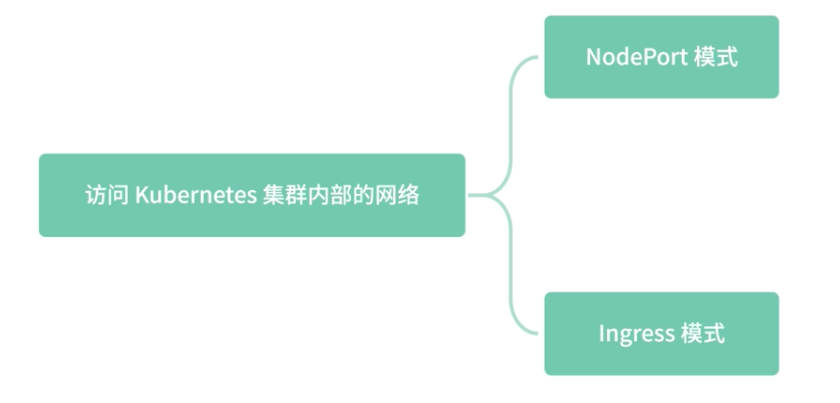
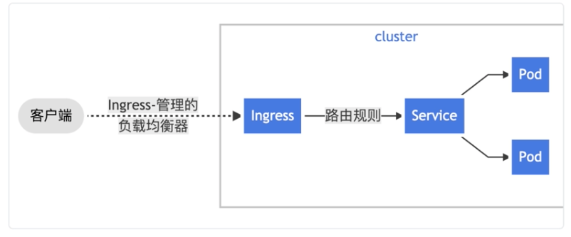
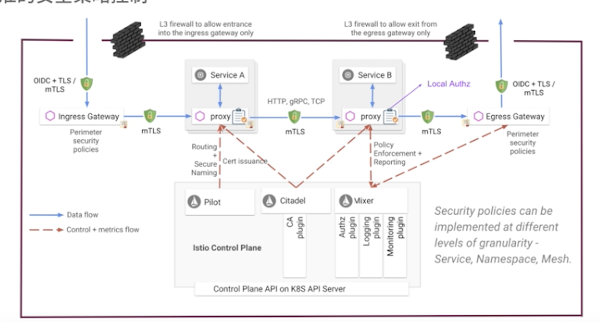

# **第五节 Ingress 和 Egress：入口流量和出口流量控制**


Ingress 是 Kubernetes 集群为了让外部可以访问，引入的一种资源类型。

**<mark>一般 Ingress 为常见的 Nginx 这样的反向代理服务器提供具体功能，诸如负载均衡、SSL 证书卸载，以及基于名称的虚拟主机功能。这些功能是反向代理服务器的基本功能，</mark>**

**Ingress 可以理解为入口网关**，而 Egress 和 Ingress 的功能相仿，只是流量的代理流向不同，**Egress 负责出口流量的代理**。

## **1、为什么需要 Ingress**

**一般来说有两种常用的方式访问 Kubernetes 集群内部的网络，分别是NodePort 模式和 Ingress 模式。**

 

### **1-1 NodePort 模式**

在 Kubernetes 集群内部，我们可以通过 Service 的域名访问服务的 Pod。下面是一个简单的 YAML 配置，这个配置可以让集群外部通过 NodePort 的方式访问集群内部的资源：

```
apiVersion: v1
kind: Service
metadata:
  name: my-service
spec:
  type: NodePort
  selector:
    app: MyApp
  ports:
      # 默认情况下，为了方便起见，`targetPort` 被设置为与 `port` 字段相同的值
    - port: 80
      targetPort: 80
      # 可选字段
      # 默认情况下，为了方便起见，Kubernetes 控制平面会从某个范围内分配一个端口号（默认：30000-32767）
      nodePort: 30007
```
 

NodePort 的默认端口范围是 30000-32767，但是一般不建议应用程序使用这个端口范围，以免引发冲突。

如上示例，集群外部首先访问 NodePort 的端口，示例中端口为 30007，通过 IPVS 一系列的劫持路由操作，将流量路由到集群内部的 my-service 服务的端口 80，这个端口是 ClusterIP 暴露出来的端口，在 Kubernetes 集群内部可以通过 `ClusterIP:Port `的方式访问 `my-service` 服务。

 Kubernetes 集群内部会通过服务发现的方式，将流量转发到服务对应的 Pod IP 的 TargetPort 上面。

**通过几台特定的 Node 机器做数据转发，一旦流量增加，可能会影响该机器宿主机的稳定性。如果集群对外暴露多个服务，维护的难度也随之增加，上面提到的扩缩容问题，会被数倍放大：**

一台 Node 机器的变动，需要修改大量的入口服务配置。

### **1-2 Ingress 模式**

客户端通过 Ingress 上定义的路由规则，转发到特定的 Service 上面，比如通过设置 path、header、host 等路由规则来决定具体转发到哪个 Service。

 

通过下面的配置你可以看到，Ingress 是一种全新的资源类型，与所有其他 Kubernetes 资源一样，Ingress 需要使用 apiVersion、kind 和 metadata 字段。

```
apiVersion: networking.Kubernetes.io/v1
kind: Ingress
metadata:
  name: minimal-ingress
  annotations:
    nginx.ingress.kubernetes.io/rewrite-target: /
spec:
  rules:
  - http:
      paths:
      - path: /testpath
        pathType: Prefix
        backend:
          service:
            name: test
            port:
              number: 80
```

我们来看一下， Ingress 资源类型特有的几个字段的含义。

* `host`：可选择和域名匹配的 host，比如如果设置 host 字段 `foo.bar.com`，则需要通过 foo.bar.com 的域名访问。如果这个例子中没有设置 host 字段，则表明任何域名过来的请求都可以匹配。
* `http.paths.path`：用于请求 path 的匹配，比如这个例子通过 pathType:Prefix 前缀匹配的方式，所有 path 中前缀为 `/testpath` 的路径，都会被匹配到；而其他没有匹配到的 path 就会返回 404。
* `http.paths.backend`：其中 name 字段表示服务名，这个服务名和 Kubernetes 中的Service 名称相匹配；port 则是 Service 的端口号，流量会通过 clusterIP:port 的方式被转发到特定服务。


## **2、IngressClass 资源类型**

在 Kubernetes1.18 版本之前，IngressClass 是通过 Ingress 中的一个 `kubernetes.io/ingress.class `注解来指定的，下面我们来看一下从 1.18 开始如何配置 Ingress Class。

<mark>**通过在 Ingress 资源类型中设置 `IngressClassName` 来指定特定的 `IngressClass` 配置，`IngressClass` 的配置如下，其中包含了 `ingress-controller` 的名称**</mark>，

在这里 `ingress-controller` 名称为` example.com/ingress-controller`：

```
apiVersion: networking.k8s.io/v1
kind: IngressClass
metadata:
  name: external-lb
spec:
  controller: example.com/ingress-controller
  parameters:
    apiGroup: k8s.example.com
    kind: IngressParameters
    name: external-lb
```

### **2-1 ingress-controller**

ingress-controller 并不是随着 Kubernetes 集群一起启动的，下面我们先来看一下如何在 Minukube 环境中使用 Nginx ingress-controller。

启动 Minukube 集群，需要先删除已有的 Minukube 集群：

```
minikube delete
```

然后通过虚拟机方式启动，因为 Ingress 的 Addon 无法在 Docker 模式使用：

```
minikube start --kubernetes-version=v1.19.2 --vm=true
```

启动 ingress-controller ：

```
minikube addons enable ingress
```
部署 helloapp：

```
kubectl create deployment web --image=gcr.io/google-samples/hello-app:1.0
```

创建 Ingress 资源：

```
kubectl apply -f https://k8s.io/examples/service/networking/example-ingress.yaml
```

通过 minikube iP 命令获取 Ip 地址，并修改 `/etc/hosts`，将其添加在文件结尾，代码中 `127.0.0.1 ` 就是 minikube ip 获取的 IP：

```
127.0.0.1 hello-world.info
```

通过 cURL 或者浏览器访问 hello-world.info：

```
curl hello-world.info
```

至此，Kubernetes 原生的 Ingress 就讲完了。

Ingress 解决了 NodePod 配置不方便的问题，但通过 YAML 的方式控制 Ingress 依然是一件麻烦事，另外 Ingress 内部依然是使用 ClusterIP 的方式来访问 Service，而这样的方式是通过 IPVS 四层转发做到的。

## **3、Istio Gateway**

Istio 采用了一种新的模型——Istio Gateway 来代替 Kubernetes 中的 Ingress 资源类型。

**Gateway 允许外部流量访问内部服务**，得益于 Istio 强大的控制面配置，Gateway 资源类型的配置非常简单，只需要配置流量转发即可。

```
minikube delete

minikube start --kubernetes-version=v1.19.2 --driver=docker
minikube tunnel
```

这样外部就可以通过 Minikube IP 访问集群内部的资源了。

下面进入 Istio 目录，部署一个测试服务：

```
kubectl apply -f samples/httpbin/httpbin.yaml
```
通过命令查看 Pod 是否成功启动，根据机器配置不同，这里的 Pod 启动可能需要一定的时间，请耐心等待 pod 启动成功：

```
$ kubectl get pods
NAME                              READY   STATUS     RESTARTS   AGE
details-v1-79c697d759-gt9th       2/2     Running    7          95d
httpbin-74fb669cc6-jzs87          0/2     Init:0/1   0          7s
productpage-v1-65576bb7bf-wjkjm   2/2     Running    7          95d
ratings-v1-7d99676f7f-h9blt       2/2     Running    6          95d
reviews-v1-987d495c-pmnb9         2/2     Running    7          95d
reviews-v2-6c5bf657cf-qd2kr       2/2     Running    7          95d
reviews-v3-5f7b9f4f77-gnv4c       2/2     Running    7          95d
```

创建 Istio Gateway，注意：**这里设置了 hosts 为 `httpbin.example.com`，也就是只有 host 为`httpbin.example.com` 才能正确访问 httpbin 的服务**：

```
kubectl apply -f - <<EOF
apiVersion: networking.istio.io/v1alpha3
kind: Gateway
metadata:
  name: httpbin-gateway
spec:
  selector:
    istio: ingressgateway # use Istio default gateway implementation
  servers:
  - port:
      number: 80
      name: http
      protocol: HTTP
    hosts:
    - "httpbin.example.com"
EOF
```

将 httpbin 服务暴露给 `Istio Gateway`，其中 `destination` 中的 host 字段为 `Istio Service` 配置中的服务名，Envoy 会通过服务发现的方式将流量路由到 `httpbin` 对应的 Pod IP：

```
kubectl apply -f - <<EOF
apiVersion: networking.istio.io/v1alpha3
kind: VirtualService
metadata:
  name: httpbin
spec:
  hosts:
  - "httpbin.example.com"
  gateways:
  - httpbin-gateway
  http:
  - match:
    - uri:
        prefix: /status
    - uri:
        prefix: /delay
    route:
    - destination:
        port:
          number: 8000
        host: httpbin
EOF
```

接下来，我们通过 cURL 访问特定的 URL Path 就可以访问该服务了，这里需要注意的是：

**需要设置 host 为` httpbin.example.com`。因为在前面的 Gateway 配置中，我们绑定了 host，当然你也可以通过修改 `/etc/hosts` 来绑定域名为本地地址：**

```
curl -I -HHost:httpbin.example.com http://127.0.0.1/status/200
HTTP/1.1 200 OK
server: istio-envoy
date: Mon, 08 Feb 2021 04:42:54 GMT
content-type: text/html; charset=utf-8
access-control-allow-origin: *
access-control-allow-credentials: true
content-length: 0
x-envoy-upstream-service-time: 327
```

如果没有匹配到路由规则，则会返回404：

```
$ curl -I -HHost:httpbin.example.com http://127.0.0.1/1status/200
HTTP/1.1 404 Not Found
date: Mon, 08 Feb 2021 04:45:50 GMT
server: istio-envoy
transfer-encoding: chunked
```

通过命令查看 Envoy 日志，这里的 `httpbin-74fb669cc6-jzs87` 是通过上面 kubectl get pods 命令获取到的 Pod 名称，需要加上 -c container 的名称来查看 Envoy 的日志：

```
 kubectl logs  httpbin-74fb669cc6-jzs87 -c istio-proxy
```

这里我列了几条刚才访问产生的 Envoy 日志，你可以看到有正确的 200 日志和错误的 404 日志：

```
2021-02-08T04:29:17.701261Z	info	Envoy proxy is ready
[2021-02-08T04:42:54.644Z] "HEAD /status/200 HTTP/1.1" 200 - "-" "-" 0 0 225 199 "172.17.0.2" "curl/7.54.0" "be1d93ab-32b3-9882-8c34-87dd39ddf6ab" "httpbin.example.com" "127.0.0.1:80" inbound|8000|http|httpbin.default.svc.cluster.local 127.0.0.1:34580 172.18.0.16:80 172.17.0.2:0 outbound_.8000_._.httpbin.default.svc.cluster.local default
[2021-02-08T04:45:14.862Z] "HEAD /status2/200 HTTP/1.1" 404 - "-" "-" 0 0 351 337 "172.17.0.2" "curl/7.54.0" "b433ee7d-6f89-9854-bee7-eeed33884003" "httpbin.example.com" "127.0.0.1:80" inbound|8000|http|httpbin.default.svc.cluster.local 127.0.0.1:36896 172.18.0.16:80 172.17.0.2:0 outbound_.8000_._.httpbin.default.svc.cluster.local default
[2021-02-08T04:45:57.688Z] "HEAD /status/500 HTTP/1.1" 500 - "-" "-" 0 0 14 11 "172.17.0.2" "curl/7.54.0" "5ca2dbf4-473f-9dd0-97a0-397a98f2805c" "httpbin.example.com" "127.0.0.1:80" inbound|8000|http|httpbin.default.svc.cluster.local 127.0.0.1:37604 172.18.0.16:80 172.17.0.2:0 outbound_.8000_._.httpbin.default.svc.cluster.local default
[2021-02-08T04:46:04.233Z] "HEAD /status/400 HTTP/1.1" 400 - "-" "-" 0 0 3 2 "172.17.0.2" "curl/7.54.0" "4c6e9a80-74f4-98bb-ba3e-8140a4a16099" "httpbin.example.com" "127.0.0.1:80" inbound|8000|http|httpbin.default.svc.cluster.local 127.0.0.1:37722 172.18.0.16:80 172.17.0.2:0 outbound_.8000_._.httpbin.default.svc.cluster.local default
[2021-02-08T04:53:33.695Z] "HEAD /status/500 HTTP/1.1" 500 - "-" "-" 0 0 4 2 "172.17.0.2" "curl/7.54.0" "6865f4bf-c407-9fa2-a6e2-f14668a9ba63" "httpbin.example.com" "127.0.0.1:80" inbound|8000|http|httpbin.default.svc.cluster.local 127.0.0.1:45104 172.18.0.16:80 172.17.0.2:0 outbound_.8000_._.httpbin.default.svc.cluster.local default
```

最后，可以通过命令，清除 httpbin 服务和相关的 Istio Gateway 配置：

```
$ kubectl delete gateway httpbin-gateway
$ kubectl delete virtualservice httpbin
$ kubectl delete --ignore-not-found=true -f samples/httpbin/httpbin.yaml
```

Gateway 类型利用 Envoy 的强大功能，可以实现路由层丰富的配置。**这些功能和网格内部提供的功能、配置方式一样，包括熔断、丰富的负载均衡策略、服务发现、金丝雀发布等，通过服务发现的方式你也可以解决 Kubernetes Ingress 四层路由的缺陷。**

## **4、Egress 出口流量**

Egress 出口流量是云原生引入的新的设计模式和架构，在传统的 Web 架构中，很少有出口网关的概念。

### **4-1 Kubernetes 中的 Egress**

相较于 Kubernetes 中 Ingress 的强大功能，Kubernetes 中的 Egress 就显得比较弱了，Kubernetes 的 Egress 并没有引入像 Nginx 这样的七层负载均衡器，**<mark>只是在 IP 地址或端口层面（OSI 第 3 层或第 4 层）控制网络流量</mark>**。

通过 Network Policy 的资源，**可以配置在三层或者四层网络的 Ingress 或者 Egress 策略**。这里的配置设置了一些 IP 和端口的黑白名单：

```
apiVersion: networking.k8s.io/v1
kind: NetworkPolicy
metadata:
  name: test-network-policy
  namespace: default
spec:
  podSelector:
    matchLabels:
      role: db
  policyTypes:
  - Ingress
  - Egress
  ingress:
  - from:
    - ipBlock:
        cidr: 172.17.0.0/16
        except:
        - 172.17.1.0/24
    - namespaceSelector:
        matchLabels:
          project: myproject
    - podSelector:
        matchLabels:
          role: frontend
    ports:
    - protocol: TCP
      port: 6379
  egress:
  - to:
    - ipBlock:
        cidr: 10.0.0.0/24
    ports:
    - protocol: TCP
      port: 5978
```

### **4-2 Istio Egress**

Istio Egress 和 Kubernetes 中的 Egress 不同，**Istio的 Egress 本质上是一个 Envoy Proxy，通过 Envoy 强大的七层代理功能，提供丰富的路由策略**，

而不局限于简单的四层网络 IP 端口黑白名单的配置。

通过下面的架构图，你可以看到每个服务的本地 Proxy 可以通过连接到 Egress Gateway 访问外部服务，达到精准的安全策略控制。

 

首先创建一个新的服务 Sleep：

```
$ kubectl apply -f samples/sleep/sleep.yaml
```

```
$ kubectl get all | grep sleep
pod/sleep-557747455f-w95vv            2/2     Running   0          58s
service/sleep         ClusterIP   10.100.21.83     <none>        80/TCP     58s
deployment.apps/sleep            1/1     1            1           58s
replicaset.apps/sleep-557747455f            1         1         1       58s
```

设置 Pod 的环境变量：

```
export SOURCE_POD=$(kubectl get pod -l app=sleep -o jsonpath={.items..metadata.name})
```
```
$ kubectl get pod -l app=sleep -o jsonpath={.items..metadata.name}
sleep-557747455f-w95vv

export SOURCE_POD=sleep-557747455f-w95vv
```


在设置策略之前，我们先尝试从 Pod 内部访问外部服务：

```
kubectl exec -it $SOURCE_POD -c sleep -- curl -I https://www.douban.com | grep  "HTTP/"; 
kubectl exec -it $SOURCE_POD -c sleep -- curl -I https://edition.cnn.com | grep "HTTP/"
```

可以得到以下结果，表明访问外部正常：

```
HTTP/1.1 200 OK
HTTP/2 200
```

```
$ kubectl exec -it $SOURCE_POD -c sleep -- curl -I https://www.douban.com | grep  "HTTP/"; 
HTTP/1.1 200 OK
```

通过下述命令，查看 Istio Egress Gateway 是否部署：

```
$  kubectl get pod -l istio=egressgateway -n istio-system
NAME                                   READY   STATUS    RESTARTS   AGE
istio-egressgateway-5547fcc8fc-flqkt   1/1     Running   2          13d
```

**<mark>创建一个 ServiceEntry，允许流量直接访问一个外部服务</mark>**

```
kubectl apply -f - <<EOF
apiVersion: networking.istio.io/v1alpha3
kind: ServiceEntry
metadata:
  name: cnn
spec:
  hosts:
  - edition.cnn.com
  ports:
  - number: 80
    name: http-port
    protocol: HTTP
  - number: 443
    name: https
    protocol: HTTPS
  resolution: DNS
EOF
```

**<mark>为 `edition.cnn.com` 端口` 80` 创建 `Egress Gateway`，并为指向 `Egress Gateway` 的流量创建一个 `Destination Rule`：</mark>**

```
$ kubectl apply -f - <<EOF
apiVersion: networking.istio.io/v1alpha3
kind: Gateway
metadata:
  name: istio-egressgateway
spec:
  selector:
    istio: egressgateway
  servers:
  - port:
      number: 80
      name: http
      protocol: HTTP
    hosts:
    - edition.cnn.com
---
apiVersion: networking.istio.io/v1alpha3
kind: DestinationRule
metadata:
  name: egressgateway-for-cnn
spec:
  host: istio-egressgateway.istio-system.svc.cluster.local
  subsets:
  - name: cnn
EOF
```

**<mark>定义一个 VirtualService，将流量从 Sidecar 引导至 Egress Gateway，再从 Egress Gateway 引导至外部服务</mark>**：

```
$ kubectl apply -f - <<EOF
apiVersion: networking.istio.io/v1alpha3
kind: VirtualService
metadata:
  name: direct-cnn-through-egress-gateway
spec:
  hosts:
  - edition.cnn.com
  gateways:
  - istio-egressgateway
  - mesh
  http:
  - match:
    - gateways:
      - mesh
      port: 80
    route:
    - destination:
        host: istio-egressgateway.istio-system.svc.cluster.local
        subset: cnn
        port:
          number: 80
      weight: 100
  - match:
    - gateways:
      - istio-egressgateway
      port: 80
    route:
    - destination:
        host: edition.cnn.com
        port:
          number: 80
      weight: 100
EOF
```

查看 istio-egressgateway 日志：

```
kubectl logs -l istio=egressgateway -c istio-proxy -n istio-system | tail
```

可以看到如下日志，表明流量经过了 Egress Gateway：

```
[2021-02-08T06:02:46.098Z] "GET /politics HTTP/2" 301 - "-" "-" 0 0 162 147 "172.18.0.17" "curl/7.69.1" "57d13492-b521-961b-bd93-90ab3f0e295e" "edition.cnn.com" "151.101.129.67:80" outbound|80||edition.cnn.com 172.18.0.4:41758 172.18.0.4:8080 172.18.0.17:32816 - -
```

清除服务相关配置：

```
$ kubectl delete gateway istio-egressgateway
$ kubectl delete serviceentry cnn
$ kubectl delete virtualservice direct-cnn-through-egress-gateway
$ kubectl delete destinationrule egressgateway-for-cnn
```

至此，Istio Egress Gateway 就配置完成了，通过这部分的学习，我们可以看到 Istio Egress Gateway 的强大配置，**通过 Egress Gateway 我们可以对外部流量进行权限控制和精准的路由匹配访问**。

在实际工作的项目中，我借鉴了 Istio Egress Gateway 的思想，将所有外部第三方服务的访问流量都转发到 Egress Gateway，经由 Egress Gateway 访问出去，通过这样的方式可以大大降低外部服务访问的延时，维持 HTTP 的 KeepAlive 长连接。

因为如果服务的机器数量过多，访问外部频率又不是很高，与外部服务的连接就很容易断掉，不得不重新建连，而现在大多数外部服务都是 HTTPS 的，需要消耗过多的 SSL 握手时间。

 