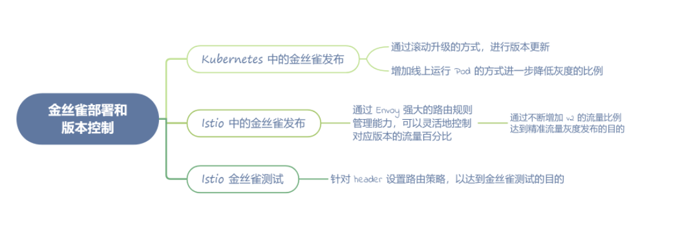

# **第六节 金丝雀发布：金丝雀部署和版本控制**


## **1、Kubernetes 中的金丝雀发布**

如何在 Kubernetes 中进行版本更新

首先启动 Minikube 环境：

```
minikube start --kubernetes-version=v1.19.2 --driver=docker
```

创建 `controllers/nginx-deployment.yaml` 的配置文件：

```
apiVersion: apps/v1
kind: Deployment
metadata:
  name: nginx-deployment
  labels:
    app: nginx
spec:
  replicas: 3
  selector:
    matchLabels:
      app: nginx
  template:
    metadata:
      labels:
        app: nginx
    spec:
      containers:
      - name: nginx
        image: nginx:1.14.2
        ports:
        - containerPort: 80
```


可以看到：**我们创建了 3 个副本数量的 Nginx，版本号为 1.14.2**。

通过下面的命令创建 Deployment：

```
kubectl apply -f https://k8s.io/examples/controllers/nginx-deployment.yaml
```

通过命令查看 Pod 的运行状态：

```
kubectl get pods --show-labels  -o wide
```

可以得到如下结果：

```
NAME                                READY   STATUS    RESTARTS   AGE    IP           NODE       NOMINATED NODE   READINESS GATES   LABELS
nginx-deployment-66b6c48dd5-b92bv   1/1     Running   0          2m5s   172.18.0.3   minikube   <none>           <none>            app=nginx,pod-template-hash=66b6c48dd5
nginx-deployment-66b6c48dd5-hshnm   1/1     Running   0          2m5s   172.18.0.4   minikube   <none>           <none>            app=nginx,pod-template-hash=66b6c48dd5
nginx-deployment-66b6c48dd5-tfwfc   1/1     Running   0          2m5s   172.18.0.5   minikube   <none>           <none>            app=nginx,pod-template-hash=66b6c48dd5
```

下一步，我们使用命令查看 Deployment详细信息：

```
kubectl describe deployments
```

可以看到 Nginx 的版本为 1.14.2：

```
Pod Template:
  Labels:  app=nginx
  Containers:
   nginx:
    Image:        nginx:1.14.2
    Port:         80/TCP
    Host Port:    0/TCP
    Environment:  <none>
    Mounts:       <none>
  Volumes:        <none>
```

下面我们尝试修改 Deployment，来更新 Nginx 的版本：

```
kubectl edit deployment.v1.apps/nginx-deployment
```

修改` .spec.template.spec.containers[0].image `字段，从 `nginx:1.14.2` 改成 `nginx:1.16.1`，输出如下：

```
deployment.apps/nginx-deployment edited
```

查看滚动升级状态：

```
kubectl rollout status deployment/nginx-deployment
Waiting for deployment "nginx-deployment" rollout to finish: 1 out of 3 new replicas have been updated..
```

查看 Pod 的状态，你可以看到新的副本已经启动成功，旧版本的副本已经停止：

```
 kubectl get pods --show-labels -o wide
NAME                                READY   STATUS        RESTARTS   AGE   IP           NODE       NOMINATED NODE   READINESS GATES   LABELS
nginx-deployment-559d658b74-8w29d   1/1     Running       0          2s    172.18.0.3   minikube   <none>           <none>            app=nginx,pod-template-hash=559d658b74
nginx-deployment-559d658b74-df9rv   1/1     Running       0          77s   172.18.0.6   minikube   <none>           <none>            app=nginx,pod-template-hash=559d658b74
nginx-deployment-559d658b74-ktzsh   1/1     Running       0          4s    172.18.0.5   minikube   <none>           <none>            app=nginx,pod-template-hash=559d658b74
nginx-deployment-66b6c48dd5-b92bv   0/1     Terminating   0          27m   172.18.0.3   minikube   <none>           <none>            app=nginx,pod-template-hash=66b6c48dd5
nginx-deployment-66b6c48dd5-hshnm   1/1     Terminating   0          27m   172.18.0.4   minikube   <none>           <none>            app=nginx,pod-template-hash=66b6c48dd5
nginx-deployment-66b6c48dd5-tfwfc   0/1     Terminating   0          27m   172.18.0.5   minikube   <none>           <none>            app=nginx,pod-template-hash=66b6c48dd5
```

我们再来看一下 Nginx 的版本信息，查看是否更新成功：

```
Pod Template:
  Labels:  app=nginx
  Containers:
   nginx:
    Image:        nginx:1.16.1
    Port:         80/TCP
    Host Port:    0/TCP
    Environment:  <none>
    Mounts:       <none>
  Volumes:        <none>
```

最后删除 Deployment 资源，确保下面的示例可以正常运行：

```
kubectl delete deployment.v1.apps/nginx-deployment
```

Kubernetes 中的版本更新已经完成了，通过滚动升级的方式，可以非常方便地进行版本更新。

但是这个过程中，**并没有灰度功能，这就相当于直接进行新版本全量发布了，很显然不符合生产环境的要求，下面我们就来学习如何在 Kubernetes 中结合版本更新做到金丝雀发布**

首先创建 Nginx 的应用，并部署：

```
apiVersion: v1
kind: Service
metadata:
  name: my-nginx-svc
  labels:
    app: nginx
spec:
  type: LoadBalancer
  ports:
  - port: 80
  selector:
    app: nginx
---
apiVersion: apps/v1
kind: Deployment
metadata:
  name: my-nginx
  labels:
    app: nginx
spec:
  replicas: 3
  selector:
    matchLabels:
      app: nginx
  template:
    metadata:
      labels:
        app: nginx
    spec:
      containers:
      - name: nginx
        image: nginx:1.14.2
        ports:
        - containerPort: 80
```

```
kubectl apply -f https://k8s.io/examples/application/nginx-app.yaml
```

启动 Minikube 隧道，打通网络：

```
minikube tunnel
```

通过浏览器或者 curl 命令访问 minikube ip 获取 IP，可以得到如下结果：

```
curl -i http://127.0.0.1
HTTP/1.1 200 OK
Server: nginx/1.14.2
Date: Fri, 12 Feb 2021 07:28:56 GMT
Content-Type: text/html
Content-Length: 612
Last-Modified: Tue, 04 Dec 2018 14:44:49 GMT
Connection: keep-alive
ETag: "5c0692e1-264"
Accept-Ranges: bytes
```

可以看到，Nginx是可以正常访问的，从返回的 header 中，你可以看到 Nginx 版本号。

重复上面的 Kubernetes 版本更新时的步骤，部署一个新的版本：

```
kubectl apply -f https://k8s.io/examples/controllers/nginx-deployment.yaml
```

**修改 `nginx-deployment` 中 Nginx 的版本号，并为其增加新的标签 `track:canary`，具体路径为 `.spec.template.metadata.lables.track:canary`**：

```
kubectl edit deployment.v1.apps/nginx-deployment
```

继续查看 Pod，**可以发现此时同时启动了两个版本**，新启动的版本带有 track=canary 的标签：

```
kubectl get pods --show-labels -o wide
NAME                               READY   STATUS    RESTARTS   AGE    IP           NODE       NOMINATED NODE   READINESS GATES   LABELS
my-nginx-66b6c48dd5-82v69          1/1     Running   0          38m    172.18.0.8   minikube   <none>           <none>            app=nginx,pod-template-hash=66b6c48dd5
my-nginx-66b6c48dd5-clzgn          1/1     Running   0          38m    172.18.0.7   minikube   <none>           <none>            app=nginx,pod-template-hash=66b6c48dd5
my-nginx-66b6c48dd5-ngbql          1/1     Running   0          38m    172.18.0.4   minikube   <none>           <none>            app=nginx,pod-template-hash=66b6c48dd5
nginx-deployment-975fd467c-7ghzx   1/1     Running   0          100s   172.18.0.6   minikube   <none>           <none>            app=nginx,pod-template-hash=975fd467c,track=canary
nginx-deployment-975fd467c-lx5sz   1/1     Running   0          104s   172.18.0.5   minikube   <none>           <none>            app=nginx,pod-template-hash=975fd467c,track=canary
nginx-deployment-975fd467c-vqm4m   1/1     Running   0          102s   172.18.0.3   minikube   <none>           <none>            app=nginx,pod-template-hash=975fd467c,track=canary
```

```
 app=nginx,pod-template-hash=975fd467c,track=canary
```

实际上，此时 Nginx 同时运行了两个版本，**我们新发布的版本是 Nginx1.16.1，可以通过 `curl -i `的命令查看**：

```
curl -i http://127.0.0.1
HTTP/1.1 200 OK
Server: nginx/1.16.1
Date: Fri, 12 Feb 2021 07:57:30 GMT
Content-Type: text/html
Content-Length: 612
Last-Modified: Tue, 13 Aug 2019 10:05:00 GMT
Connection: keep-alive
ETag: "5d528b4c-264"
Accept-Ranges: bytes
```

**<mark>多次运行 curl -i 命令查看结果，你可以发现，返回的 header 中同时存在 1.16.1 和 1.14.2 两个 Nginx 版本</mark>**。

通过这样滚动升级的方式，Kubernetes 可以做到简单的金丝雀发布，这样的方式已经可以满足一些简单的场景，但是流量比例只能通过灰度单个 Pod 的方式控制。

## **2、Istio 中的金丝雀发布**

Istio和 Kubernetes 实现金丝雀发布的方式不太一样，**Istio 通过 Envoy 强大的路由规则管理能力，可以灵活地控制对应版本的流量百分比**

示意图如下，用户访问 productpage 的请求，**内部流量会分别路由到 `reviews-v1 `和` v2` 两个版本**。

 

```
kubectl get pods
NAME                               READY   STATUS            RESTARTS   AGE
details-v1-b87bfc85d-nd8v7         2/2     Running           0          2m12s
productpage-v1-65576bb7bf-hj6mw    1/2     Running           0          2m11s
ratings-v1-645b477958-gtrqd        0/2     PodInitializing   0          2m12s
reviews-v1-987d495c-2x5rh          2/2     Running           0          2m12s
reviews-v2-6c5bf657cf-t66hz        2/2     Running           0          2m12s
reviews-v3-5f7b9f4f77-gcrsj        2/2     Running           0          2m12s
```

通过查看 `samples/bookinfo/platform/kube/bookinfo.yaml` 的部署配置文件，可以看到：有三个 reviews 服务的部署类型资源。通过前面 Kubernetes 灰度发布的内容我们可以知道，通过配置不同的 labels，可以让同一个服务的三个部署资源同时存在。


这三个部署资源的服务镜像指向了三个不同的地址，分别是 `examples-bookinfo-reviews-v1:1.16.2`、`examples-bookinfo-reviews-v2:1.16.2` 和 `examples-bookinfo-reviews-v3:1.16.2`：


```
---
apiVersion: apps/v1
kind: Deployment
metadata:
  name: reviews-v1
  labels:
    app: reviews
    version: v1
spec:
  replicas: 1
  selector:
    matchLabels:
      app: reviews
      version: v1
  template:
    metadata:
      labels:
        app: reviews
        version: v1
    spec:
      serviceAccountName: bookinfo-reviews
      containers:
      - name: reviews
        image: docker.io/istio/examples-bookinfo-reviews-v1:1.16.2
        imagePullPolicy: IfNotPresent
        env:
        - name: LOG_DIR
          value: "/tmp/logs"
        ports:
        - containerPort: 9080
        volumeMounts:
        - name: tmp
          mountPath: /tmp
        - name: wlp-output
          mountPath: /opt/ibm/wlp/output
      volumes:
      - name: wlp-output
        emptyDir: {}
      - name: tmp
        emptyDir: {}
---
apiVersion: apps/v1
kind: Deployment
metadata:
  name: reviews-v2
  labels:
    app: reviews
    version: v2
spec:
  replicas: 1
  selector:
    matchLabels:
      app: reviews
      version: v2
  template:
    metadata:
      labels:
        app: reviews
        version: v2
    spec:
      serviceAccountName: bookinfo-reviews
      containers:
      - name: reviews
        image: docker.io/istio/examples-bookinfo-reviews-v2:1.16.2
        imagePullPolicy: IfNotPresent
        env:
        - name: LOG_DIR
          value: "/tmp/logs"
        ports:
        - containerPort: 9080
        volumeMounts:
        - name: tmp
          mountPath: /tmp
        - name: wlp-output
          mountPath: /opt/ibm/wlp/output
      volumes:
      - name: wlp-output
        emptyDir: {}
      - name: tmp
        emptyDir: {}
---
apiVersion: apps/v1
kind: Deployment
metadata:
  name: reviews-v3
  labels:
    app: reviews
    version: v3
spec:
  replicas: 1
  selector:
    matchLabels:
      app: reviews
      version: v3
  template:
    metadata:
      labels:
        app: reviews
        version: v3
    spec:
      serviceAccountName: bookinfo-reviews
      containers:
      - name: reviews
        image: docker.io/istio/examples-bookinfo-reviews-v3:1.16.2
        imagePullPolicy: IfNotPresent
        env:
        - name: LOG_DIR
          value: "/tmp/logs"
        ports:
        - containerPort: 9080
        volumeMounts:
        - name: tmp
          mountPath: /tmp
        - name: wlp-output
          mountPath: /opt/ibm/wlp/output
      volumes:
      - name: wlp-output
        emptyDir: {}
      - name: tmp
        emptyDir: {}
```

我们在页面中，反复刷新`http://127.0.0.1/productpage`页面，可以看到不同的三种 reviews 的显示。

 


通过上面的请求结果，我们可以看到，Istio 确实将流量路由到了不同的 reviews 版本上，但是这里我们还没有对 Istio 的路由规则做特殊配置**，所以这里的流量是均分的，你也可以理解为和 Kubernetes 的版本灰度策略是一致的**。

下面我们创建一个 reviews 的路由规则，为了方便验证，这个配置将所有流量指向 reviews 的 v1 版本：

```
kubectl apply -f - <<EOF
apiVersion: networking.istio.io/v1alpha3
kind: VirtualService
metadata:
  name: reivews
spec:
  hosts:
    - reviews
  http:
  - route:
    - destination:
        host: reviews
        subset: v1
---
apiVersion: networking.istio.io/v1alpha3
kind: DestinationRule
metadata:
  name: reviews
spec:
  host: reviews
  subsets:
  - name: v1
    labels:
      version: v1
  - name: v2
    labels:
      version: v2
  - name: v3
    labels:
      version: v3
EOF
```

此时，我们无论如何刷新页面，都会发现页面的显示内容，总是停留在 reviews 的 v1 版本。

下面我们再做出一些改动，修改 Istio 路由配置，**将 90% 的流量指向 v1 版本，10% 的流量指向 v2 版本**，以达到我们最开始的需求——精准流量的金丝雀发布：

 

```
$ kubectl apply -f - <<EOF
apiVersion: networking.istio.io/v1alpha3
kind: VirtualService
metadata:
  name: reivews
spec:
  hosts:
    - reviews
  http:
  - route:
    - destination:
        host: reviews
        subset: v1
      weight: 90
    - destination:
        host: reviews
        subset: v2
      weight: 10
EOF
```

成功执行上述命令，**我们反复刷新 productpage 页面，可以发现大概有 10% 的流量被路由到了新的 reviews v2 版本**。

 

现实场景中，我们可以根据需求灵活地设置 reviews v1 版本和 v2 版本的流量比例，比如设置 v2 版本流量比例为 1%，用于金丝雀发布，这样的方式相较于 Kubernetes 启动 100 个 pod 进行金丝雀发布，要灵活得多。

在金丝雀发布的过程中，**通过不断增加 v2 的流量比例达到精准流量灰度发布的目的**，配合 Metrics 监控指标，可以随时自动调整 v2 的比例，以减少新版本出问题时对生产环境的影响。随着 v2 版本的流量不断增大，最终彻底替代 v1 版本成为线上正式版本，整个金丝雀发布也就结束了。

当然需要注意的是，在整个过程中你应该灵活调整 v1 和 v2 版本的 Kubernetes 副本数量，或者配合 Kubernetes 的 HPA，以达到自动扩缩容的目的：

```
$ kubectl autoscale deployment reviews-v1 --cpu-percent=50 --min=1 --max=10
$ kubectl autoscale deployment reviews-v2 --cpu-percent=50 --min=1 --max=10
```

 Istio 中另一个强大的功能：**针对 header 设置路由策略，以达到金丝雀测试的目的**。简单来说，就是针对不同用户或不同的客户端版本（针对测试人员单独发布的测试版本），进行精准的流量路由。

## **3、Istio 金丝雀测试**

首先我们创建一个 VirtualService 配置，将登录用户名为 testuser 的用户指向测试版本 v2 和 v3，**其中 v3 流量占比 90%，v2 流量占比 10%。**

这个版本专门用于 testuser 的测试人员进行新版本的测试，其他登录用户全部路由到 v1 版本：

```
kubectl apply -f - <<EOF
apiVersion: networking.istio.io/v1alpha3
kind: VirtualService
metadata:
  name: reviews
spec:
  hosts:
    - reviews
  http:
  - match:
    - headers:
        end-user:
          exact: testuser
    route:
    - destination:
        host: reviews
        subset: v2
      weight: 10
    - destination:
        host: reviews
        subset: v3
      weight: 90
  - route:
    - destination:
        host: reviews
        subset: v1
EOF
```

执行成功后，我们反复访问 productpage 页面，发现流量大部分都路由到了 v3 版本，少量流量路由到了 v2 版本。

 

至此，我们就完成了 Istio 的金丝雀测试。

 