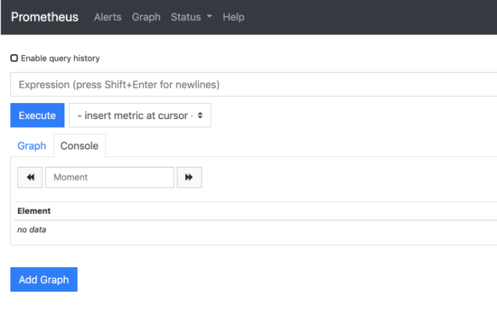
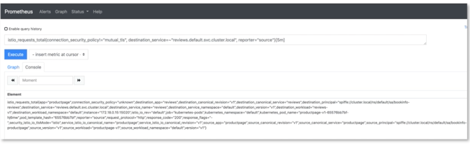
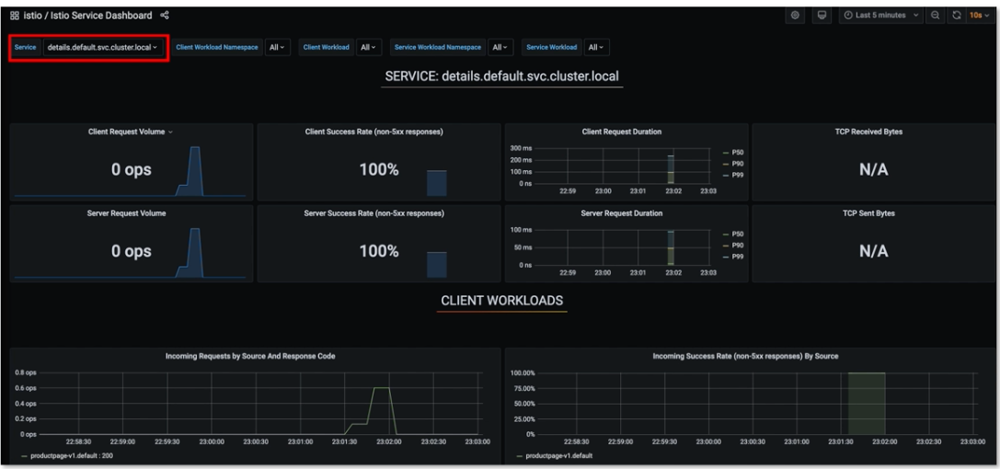
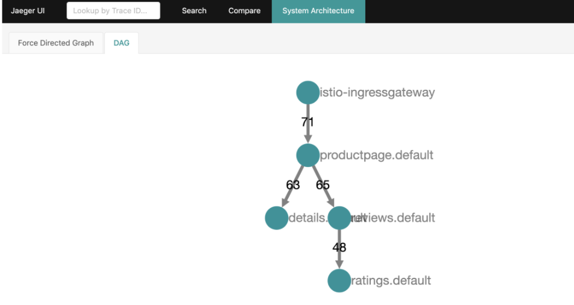
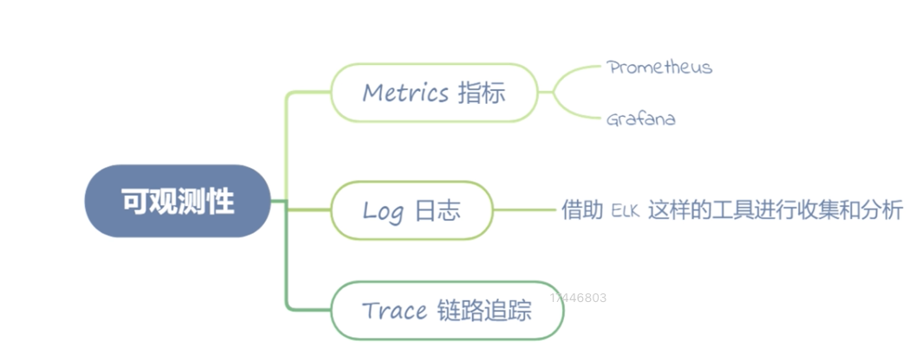

# **第七节 如何利用组件做到服务的可观测性**

## **1、Metrics 指标**


在开始这部分内容之前，先通过命令确认你是否安装了 Prometheus 和 Grafana：

```
$ kubectl -n istio-system get svc
NAME                   TYPE           CLUSTER-IP       EXTERNAL-IP   PORT(S)                                                                      AGE
grafana                ClusterIP      10.108.76.68     <none>        3000/TCP                                                                     92m
istio-egressgateway    ClusterIP      10.103.64.246    <none>        80/TCP,443/TCP,15443/TCP                                                     26h
istio-ingressgateway   LoadBalancer   10.108.98.172    127.0.0.1     15021:31530/TCP,80:31636/TCP,443:31905/TCP,31400:31942/TCP,15443:32337/TCP   26h
istiod                 ClusterIP      10.109.14.171    <none>        15010/TCP,15012/TCP,443/TCP,15014/TCP,853/TCP                                26h
kiali                  ClusterIP      10.110.51.251    <none>        20001/TCP,9090/TCP                                                           92m
prometheus             ClusterIP      10.106.46.62     <none>        9090/TCP                                                                     92m
tracing                ClusterIP      10.100.200.122   <none>        80/TCP                                                                       92m
zipkin                 ClusterIP      10.100.85.63     <none>        9411/TCP
```

### **1-1 Prometheus**

我们先来启动 Prometheus 的图形界面：

```
istioctl dashboard prometheus
```

这个命令会帮我们打开 Prometheus 的 Web 界面，如下图：

 

Envoy 突出的 Metrics，在 Prometheus 中查询

```
istio_requests_total{connection_security_policy!="mutual_tls", destination_service=~"reviews.default.svc.cluster.local", reporter="source"}[5m]
```

切换到 Console 界面，可以查看一些输出信息，说明信息被正确采集：

 

### **1-2 Grafana**

Grafna 的启动方式也很简单，和 Prometheus 类似：

```
$ istioctl dashboard grafana
```

Istio 也为我们自动地在本地打开了 Grafana 的界面

这里我们需要手动在浏览器输入[http://localhost:3000/dashboard/db/Istio-mesh-dashboard](http://localhost:3000/dashboard/db/Istio-mesh-dashboard) 并访问，可以直接看到 Istio 管理的服务列表信息。


可以点击到任意链接进入子页面，下面我们进入 Service 页面，查看某个 Service 的具体信息（

[http://localhost:3000/d/LJ_uJAvmk/istio-service-dashboard?orgId=1&refresh=10s](http://localhost:3000/d/LJ_uJAvmk/istio-service-dashboard?orgId=1&refresh=10s)），可以看到如下界面：

 

在页面的最上方，有几个选项，可以选择我们需要的参数。


* **Service**：服务名，这里的服务名就是我们在 Kubernetes 中要访问的服务名，比如 `details.default.svc.cluster.local`。Bookinfo 这个项目所包含的几个微服务，都可以在这里选择。
* **Client Workload Namespace（Or Service Workload Namespace）**：这里指的是 Kubernetes 的 namespace 命名空间，也就是服务创建在了哪个命名空间。这里应用类型的服务都创建在了 default 的命名空间，只有 `istio-ingressgateway` 创建了 `istio-system` 的命名空间。
* **Client Workload**：可以理解为当前 Service 的 upstream，也就是 Client 调用端。
	* 我们默认选中了 `details.default.svc.cluster.local `这个服务，查看 Client Workload 的下拉框可以看到 `productpage-v1 `的选项，这说明 `details.default.svc.cluster.local `这个服务的流量来源是 `productpage` 的 v1 版本。如果这里有多个选项，我们也可以选中其中一个进行查看，通过观察不同的流量来源，在出现问题的时候可以很好地区分到底是哪个流量来源的问题，便于排查问题的根因。

 	

Istio 这样的 Service Mesh 解决方案则没有这样的困扰，**可以直接通过控制面下发当前服务的服务名，让 Sidecar 在 Metrics 中自动注入**，不允许业务代码编写人员修改这个服务名，从而在根本上杜绝了调用方服务名出错的问题。

* **Service Workload：这里我们选中 `reviews.default.svc.cluster.local`**，然后查看 Service Workload 的下拉框，可以看到三个选项 review-v1、reviews-v2、reviews-v3。这里其实就是 reviews 这个服务的三个不同版本，可以分别选择这三个版本中的任意一个或者多个查看相应的监控信息。

接下来展示了 `SERVICE: reviews.default.svc.cluster.local` 的一些常见信息，比如客户端/服务端请求的 QPS、成功率、延时等。

这里所有的指标都有两个维度，**一个是服务端自身的，一个是Client 端的**，相对来说 Client 端的统计更接近服务本身的耗时，因为服务自身的统计无法把网络消耗统计在内。很多时候我们经常过度关注服务自身的各种指标，反而忽略了网络层面的一些消耗。

**再下面的面板是 Client Workloads，可以看到不同版本的调用端服务、请求的黄金指标，包括 QPS、延时、响应大小等**。


**最后的面板是 Service Workloads，也就是当前服务的不同版本的统计信息，同样包含了 QPS、延时、响应大小，以及 TCP 连接等信息。**

直接访问 [http://localhost:3000/dashboard/db/istio-workload-dashboard](http://localhost:3000/dashboard/db/istio-workload-dashboard)，也可以点击 `istio-mesh-dashboard `上的链接访问。

 

相对于 istio-services-dashboard，这个页面最大的优势，**是可以看到 inbound（入流量）和 outbound（出流量）两个流量方向的监控信息**，比如我们这里选中 reviews-v3 这个 Workload，可以看到它的 inbound 的信息，也就是 productpage-v1 这个调用端访问过来的流量；

也可以看到 review-v3 访问出去的流量，流量路由到的服务是 `ratings.default.svc.cluster.local`。

以客户端的视角，查看服务的出流量在很多场景下也是非常重要的，很多时候我们不仅要关注其他服务调用我们服务的健康情况，也要关注我们访问其他服务的健康状况，在一些情况下二者是息息相关的。

* **Namespace**：这里和上面 Services dashboard 提到的 namespace 是同一个概念。
* **Workload**：指的是服务的不同版本。比如 reviews 这个服务就可以选择 v1、v2、v3 三个版本。
* **Inbound Workload**：指的是不同版本的调用方服务，比如 review-v3 这个服务，就可以看到 productpage-v1 这个调用方。
* **Destination Service**：指的是当前版本的服务调用了哪些服务，比如 review-v3 这个服务，就可以看到 `ratings.default.svc.cluster.local` 这个被调方服务。
* 接下来我们来看几个面板展示的信息。
* **WORKLOAD**: reviews-v3.default：这里包含了 review-v3 这个 workload 的一些基础信息，包含QPS、错误统计、延时等信息。
* **INBOUND WORKLOAD**：展示了不同的调用方的 workload 维度的基础信息。
* **OUTBOUND SERVICES**：展示了当前服务访问其他服务的监控信息。


## **2、Log 日志**

日志的观测相对简单，我们还是访问几次 productpage 页面，通过命令查看：

···
$ kubectl logs productpage-v1-65576bb7bf-hj6mw -c Istio-proxy
···

在终端会看到如下输出：

```
[2021-02-14T02:36:34.480Z] "GET /details/0 HTTP/1.1" 200 - "-" "-" 0 178 7 7 "-" "Mozilla/5.0 (Macintosh; Intel Mac OS X 10_14_6) AppleWebKit/537.36 (KHTML, like Gecko) Chrome/87.0.4280.141 Safari/537.36" "8b9abfac-215b-93d6-98b6-6c56b8eb14da" "details:9080" "172.18.0.15:9080" outbound|9080||details.default.svc.cluster.local 172.18.0.20:45544 10.110.238.95:9080 172.18.0.20:48928 - default

[2021-02-14T02:36:34.493Z] "GET /reviews/0 HTTP/1.1" 200 - "-" "-" 0 379 318 316 "-" "Mozilla/5.0 (Macintosh; Intel Mac OS X 10_14_6) AppleWebKit/537.36 (KHTML, like Gecko) Chrome/87.0.4280.141 Safari/537.36" "8b9abfac-215b-93d6-98b6-6c56b8eb14da" "reviews:9080" "172.18.0.14:9080" outbound|9080|v2|reviews.default.svc.cluster.local 172.18.0.20:57886 10.107.87.91:9080 172.18.0.20:43118 - -

[2021-02-14T02:36:34.473Z] "GET /productpage HTTP/1.1" 200 - "-" "-" 0 5292 344 343 "172.17.0.2" "Mozilla/5.0 (Macintosh; Intel Mac OS X 10_14_6) AppleWebKit/537.36 (KHTML, like Gecko) Chrome/87.0.4280.141 Safari/537.36" "8b9abfac-215b-93d6-98b6-6c56b8eb14da" "127.0.0.1" "127.0.0.1:9080" inbound|9080|http|productpage.default.svc.cluster.local 127.0.0.1:52130 172.18.0.20:9080 172.17.0.2:0 outbound_.9080_._.productpage.default.svc.cluster.local default
```

你可以看到这里面包含了 Envoy 收集的访问日志，包括访问 IP、服务名、user-agent 等基本信息。当然如果要分析这些日志，仅仅通过命令查看是远远不够的，**此时我们需要借助 ELK 这样的工具进行收集和分析**。

## **3、Trace 链路追踪**

从代码层面看看 Istio 是如何接入 Trace 系统的。

虽然网格代理 Envoy 能够自动识别 Trace 中的 header，在请求 upstream 的时候自动生成 span 并携带发送，但是如果要将整个链路追踪信息串在一起，还需要代码中额外携带一些链路追踪信息才能完成。

```
x-request-id
x-b3-traceid
x-b3-spanid
x-b3-parentspanid
x-b3-sampled
x-b3-flags
x-ot-span-context
```

下面我们看一下 Bookinfo 中的 productpage 这个项目代码，是如何实现的。源码的地址为[https://github.com/istio/istio/blob/master/samples/bookinfo/src/productpage/productpage.py](https://github.com/istio/istio/blob/master/samples/bookinfo/src/productpage/productpage.py)。

首先我们看一下入口方法：

```
@app.route('/productpage')
	@trace()
	def front():
	    product_id = 0  # TODO: replace default value
	    headers = getForwardHeaders(request)
	    user = session.get('user', '')
	    product = getProduct(product_id)
	    detailsStatus, details = getProductDetails(product_id, headers)
```

可以看到，**通过 `getForwardHeaders `方法，我们获取了在请求其他服务时需要传递的 header 参数，在 `getProductDetails` 调用的时候，传递了我们通过 `getForwardHeaders `方法获得的 header 参数**。

下面我们看一下上述内容如何在代码中得以体现：

```
def getForwardHeaders(request):
	    headers = {}
	
	    # x-b3-*** 通过 opentracing 的库直接获取
	    span = get_current_span() # 获取 downstream header 中传递的 span
	    carrier = {}
	    tracer.inject(
	        span_context=span.context,
	        format=Format.HTTP_HEADERS,
	        carrier=carrier) # 将 trace header 注入 carrier
	
	    headers.update(carrier) # 更新 headers
	
	    # 手动获取其他非 x-b3-*** 的 header
	    if 'user' in session:
	        headers['end-user'] = session['user']
	
	    # Keep this in sync with the headers in details and reviews.
	    incoming_headers = [
	        # All applications should propagate x-request-id. This header is
	        # included in access log statements and is used for consistent trace
	        # sampling and log sampling decisions in Istio.
	        'x-request-id',
	
	        # Lightstep tracing header. Propagate this if you use lightstep tracing
	        # in Istio (see
	        # https://istio.io/latest/docs/tasks/observability/distributed-tracing/lightstep/)
	        # Note: this should probably be changed to use B3 or W3C TRACE_CONTEXT.
	        # Lightstep recommends using B3 or TRACE_CONTEXT and most application
	        # libraries from lightstep do not support x-ot-span-context.
	        'x-ot-span-context',
	
	        # Datadog tracing header. Propagate these headers if you use Datadog
	        # tracing.
	        'x-datadog-trace-id',
	        'x-datadog-parent-id',
	        'x-datadog-sampling-priority',
	
	        # W3C Trace Context. Compatible with OpenCensusAgent and Stackdriver Istio
	        # configurations.
	        'traceparent',
	        'tracestate',
	
	        # Cloud trace context. Compatible with OpenCensusAgent and Stackdriver Istio
	        # configurations.
	        'x-cloud-trace-context',
	
	        # Grpc binary trace context. Compatible with OpenCensusAgent nad
	        # Stackdriver Istio configurations.
	        'grpc-trace-bin',
	
	        # b3 trace headers. Compatible with Zipkin, OpenCensusAgent, and
	        # Stackdriver Istio configurations. Commented out since they are
	        # propagated by the OpenTracing tracer above.
	        # 'x-b3-traceid',
	        # 'x-b3-spanid',
	        # 'x-b3-parentspanid',
	        # 'x-b3-sampled',
	        # 'x-b3-flags',
	
	        # Application-specific headers to forward.
	        'user-agent',
	    ]
	    # For Zipkin, always propagate b3 headers.
	    # For Lightstep, always propagate the x-ot-span-context header.
	    # For Datadog, propagate the corresponding datadog headers.
	    # For OpenCensusAgent and Stackdriver configurations, you can choose any
	    # set of compatible headers to propagate within your application. For
	    # example, you can propagate b3 headers or W3C trace context headers with
	    # the same result. This can also allow you to translate between context
	    # propagation mechanisms between different applications.
        # 传递其他非 b3 header 的头信息
	    for ihdr in incoming_headers:
	        val = request.headers.get(ihdr)
	        if val is not None:
	            headers[ihdr] = val
	
	    return headers
```

可以看到，通过 Jaeger 的类库，**自动将带有 b3 header 的数据存储到了 headers 中，其他的一些 Trace 规范，则需要通过` incoming_headers` 自定义的方式自动传递**。

至此，代码方面的原理告一段落，下面我们来启动 Jaeger 看看具体的效果。

启动 Jaeger，通过 URL 或者 cURL 的方式多次访问 productpage：

```
istioctl dashboard jaeger
```


点击一条具体的链路，进入详情页面，可以详细展示整个微服务调用的链路，包含每个阶段耗时的详细信息，方便我们排查具体哪个环节出现了问题：


 

点击一条具体的链路，进入详情页面，可以详细展示整个微服务调用的链路，包含每个阶段耗时的详细信息，方便我们排查具体哪个环节出现了问题：


 

点击 System Architecture 页面，可以看到整个微服务的调用关系展示：

 

 