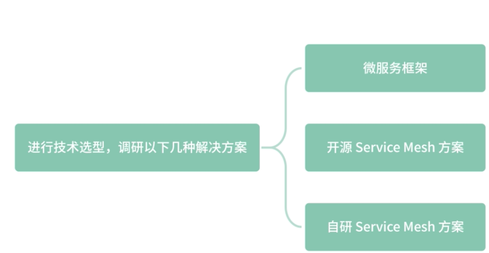
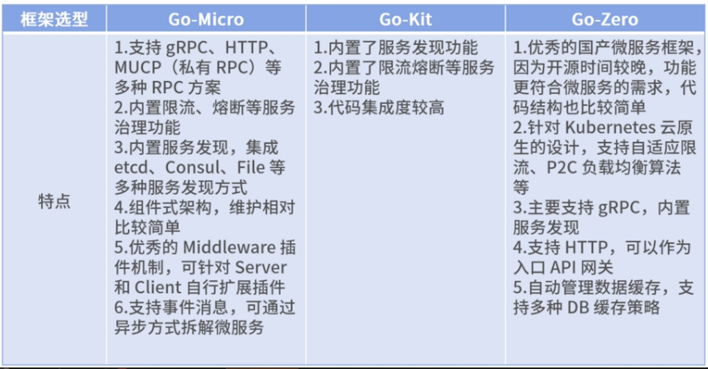
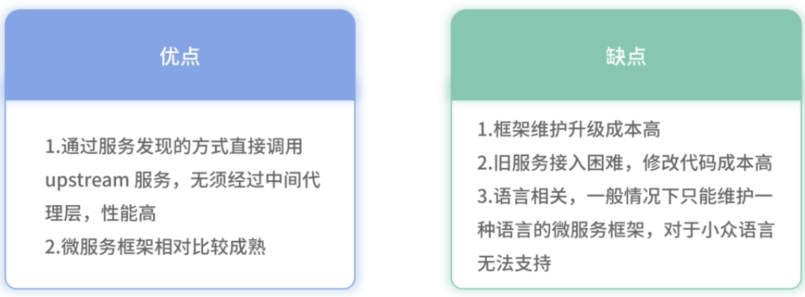
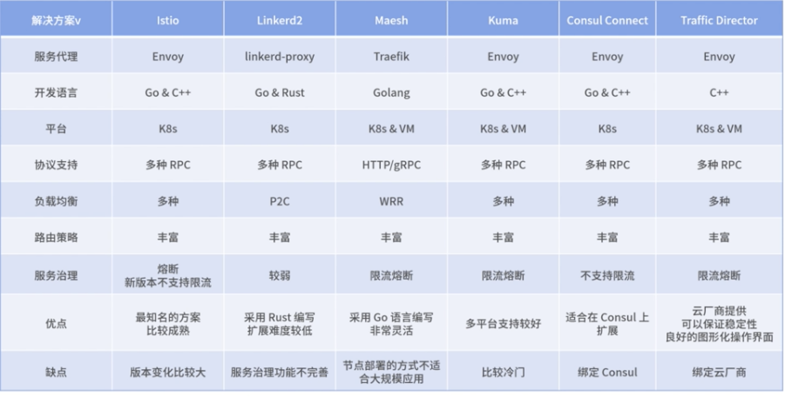
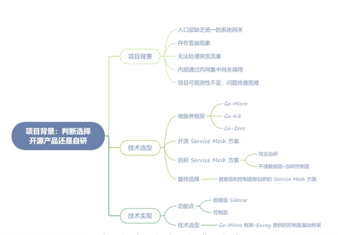
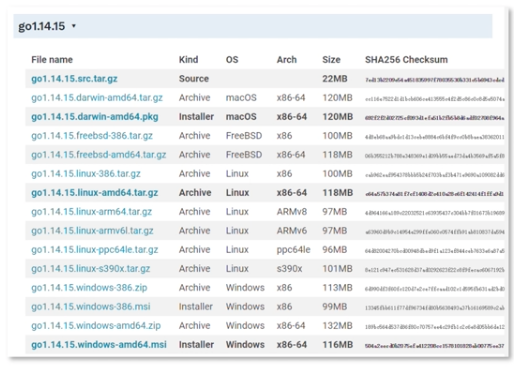

# **第八节 Proj项目落地: Go 实现 Service Mesh**

## **1、项目背景：判断选择开源产品还是自研**

### **1-1 项目背景**


* **入口层缺乏统一的系统网关**：多个服务同时对外暴露，无法进行统一的登录验证、加/解密等功能，只能在各个对外暴露的服务中单独实现，无法进行统一的维护。
* **存在雪崩现象**：某一个核心微服务出现故障后，导致级联故障，依赖的服务因为响应延时变高，都将出现故障，最终导致整站故障。
* **无法处理突发流量**：很多时候因为运营活动，前期没有配合提前扩容资源, 导致服务被突发流量打挂。
* **内部通过内网集中网关调用**：内部通过统一的网关调用，一旦内部集中网关出现问题，导致所有服务出现故障，继而引起整站故障。
* **项目可观测性不足，问题排查困难**：各个服务自己实现监控指标，没有统一的监控，随着服务数量增多，问题越来越难以排查。

 

调研以下几种解决方案，包括微服务框架、开源 Service Mesh 方案、自研 Service Mesh 方案

<mark>**其中微服务框架需要再引入一个开源系统网关或者用框架实现聚合层**</mark>。

 

### **1-2 技术选型**

**微服务框架**

微服务框架在 Web 框架的基础上，增加了服务治理、注册发现、可观测性、负载均衡、RPC 等多种功能，目的是提高微服务架构的稳定性

 

**优点**

* 通过服务发现的方式直接调用 upstream 服务，无须经过中间代理层，性能高；
* 微服务框架相对比较成熟。

**缺点：**


* 框架维护升级成本高，微服务的拆分会导致服务数量非常多，一旦框架发布，后续升级几乎不可能完成；
* 旧服务接入困难，修改代码成本高；
* 语言相关，一般情况下只能维护一种语言的微服务框架，对于小众语言无法支持。


总结：相对来说 Go 语言的微服务框架并不算丰富，更多框架还停留在 Web 方面，比如 Gin、Echo 都是出色的 Web 框架。如果是新项目，微服务框架 go-zero 是相对不错的选择。

 


### **1-2 开源 Service Mesh 方案**

 

**优点：**

* 相对于微服务框架，通过和业务架构解耦的方式，降低了升级维护的成本；
* 新旧服务接入同样简单，可以通过 iptables 网络劫持无感知方式接入，也可以通过修改少量代码支持；
* 语言无关性，公司的小众语言也可以很好地支持；
* 可以持续跟进社区方案，获得社区的最新成果；
* 项目启动快，不需要研发，只需要做好测试。


**缺点：**

* 代码二次扩展难度比较大，需要特定的语言开发经验，公司个性化的需求无法满足；
* 开源软件往往版本变化比较大，向前兼容性比较差，如果想要维护升级，也需要对源码有一定的掌握，否则升级风险比较大。

### **1-3 自研 Service Mesh 方案**

自研 Service Mesh 方案分为两种，**一种是数据面 Sidecar 和控制面全部自研，另外一种是使用开源数据面，但是自研或者二次开发控制面**。


### **1-4 完全自研**

数据面和控制面完全自研的方案。

**优点：**

* 具备开源 Service Mesh 方案相对于微服务框架的优势；
* 可扩展性强，可以兼容公司运维环境，对于一些定制型需求，比如新的 RPC 协议支持、多协议服务治理、新的负载均衡支持等；
* 项目把控力强，出现问题可以快速解决

**缺点：**

* 研发成本高，需要一定的研发时间，上线灰度到稳定版本也需要时间，在灰度过程中可能会有 Bug 出现；
* 和社区有一定的割裂。

### **1-5 开源数据面+自研控制面**

直接使用**开源控制面方案基本上无法满足控制面个性的需求**，比如第三方注册中心的支持、虚拟机环境的支持等

**优点：**

* 可以满足公司多样的运维环境；
* 控制面自研或者二次开发，有一定的定制性。

**缺点：**

* 数据面 Sidecar 依然有开源方案的弊端。
* 首先于数据面无法定制，其次对于控制面能做的联动有一定的局限性。


### **1-6 技术实现**

功能点

**数据面 Sidecar：**


* 实现基础框架，能够代理 HTTP 协议，并具备扩展性；
* 支持限流、熔断等服务治理中间件；
* 支持可观测性组件，包括 Log、Trace 和 Metrics；
* 支持服务注册和发现，能够代理业务服务进行注册；
* 通过 xDS 和控制面通信。

**控制面：**

同时兼容虚拟机和 Kubernetes，和公司现有的 CMDB 系统打通，同步机器元数据。
支持 xDS 协议，兼容现有的、采用 xDS 协议的数据面。


**技术选型**

* Go-Micro 框架完全可以满足我们数据面 Sidecar 的需求，其本身也支持了多种协议。（Go-Micro 项目地址https://github.com/asim/go-micro）

* 控制面 Envoy 也提供了基础框架，为了降低复杂度，我们不使用 Istio 二次开发，直接用 Envoy 提供的控制面基础框架来开发。（地址为https://github.com/envoyproxy/go-control-plane）


 

## **2、数据面：基于 Go-Micro 快速实现代理模块**

在常见的开源数据面中，Envoy 使用 C++ 实现，Linkerd 早期版本使用 Java，新版本使用 Rust 实现，而 MOSN 和 Maesh 都使用 Go 语言实现。从这些技术选型可以看出，**Go 语言在数据面的实现中占有一席之地，主要是较高的性能和较少的内存占用，比较适合 Sidecar 的应用场景。**

为了快速实现，我们使用了 Go-micro 框架，这个框架有非常好的抽象层，支持 MUCP、gRPC、HTTP 等协议的原生代理，后期也可以根据需求扩展协议层。

[https://github.com/beck917/easymesh](https://github.com/beck917/easymesh)

### **2-1 环境安装&框架搭建**

首先进入 Go 语言官网，根据环境下载合适的版本[https://golang.google.cn/dl/](https://golang.google.cn/dl/)，因为 Go-Micro 的旧版本依赖问题，这里我们选择 Go 1.14 版本。

 

### **2-2 代码解析**

首先我们看一下 main 方法，这里创建了两个代理服务器，**分别是监听 8082 端口的出流量代理和监听 8083 端口的 8083 服务**：

```
func main() {
    http.HandleFunc("/", indexHandler)
    go http.ListenAndServe(":6060", nil)
    // start the client proxy
    go proxy.Run(&proxy.ServerOptions{
        Name:     "Client Listener Proxy",
        Address:  ":8082",
        Endpoint: "http://127.0.0.1:8083",
        Protocol: "http",
    })
    time.Sleep(1 * time.Second)
    // start the server proxy
    proxy.Run(&proxy.ServerOptions{
        Name:     "Server Listener Proxy",
        Address:  ":8083",
        Endpoint: "http://127.0.0.1:6060",
        Protocol: "http",
    })
}
```

下面解释下 `proxy.Run` 方法的几个参数。

* Name：代理服务器唯一标识。
* Address：代理服务器监听地址。
* Endpoint：代理服务器流量转发的地址，可以看到这里 Client Proxy 将 Endpoint 设置为 `http://127.0.0.1:8083`，意思是将流量转发到 `Server Proxy`，而 `Server Proxy `将流量转向了本地的 `6060` 端口，也就是服务端口，这样就形成了一个完成的 Mesh 链路。
* Protocol：代理的协议，这里是 HTTP。


下面我们进入 Run 方法看一下核心代码：

```
    // new proxy
    var p proxy.Proxy
    var s server.Server
    // set endpoint
    if len(Endpoint) > 0 {
        switch {
        case strings.HasPrefix(Endpoint, "grpc://"):
            ep := strings.TrimPrefix(Endpoint, "grpc://")
            popts = append(popts, proxy.WithEndpoint(ep))
            p = grpc.NewProxy(popts...)
        case strings.HasPrefix(Endpoint, "http://"):
            // TODO: strip prefix?
            popts = append(popts, proxy.WithEndpoint(Endpoint))
            p = http.NewProxy(popts...)
            s = smucp.NewServer(
                server.WrapHandler(ratelimiter.NewHandlerWrapper(10)),
            )
        default:
            // TODO: strip prefix?
            popts = append(popts, proxy.WithEndpoint(Endpoint))
            p = mucp.NewProxy(popts...)
        }
    }
```

`Run()` 方法根据传入的参数 `Endpoint` 会选择对应的协议，这里我传入的是 `HTTP `协议的Endpoint，会创建一个 HTTP 的 Proxy。

这个 HTTP 的 Proxy 跟踪你可以参照 [Go-Micro 的代码](https://github.com/asim/go-micro)，也很简单，其实所有的 Proxy 都会通过 `ServeRequest(ctx context.Context, req server.Request, rsp server.Response) `这个方法，这个方法对 Server 处理过后的 HTTP 进行转发操作。

```
// get data
        body, err := req.Read()
        if err == io.EOF {
            return nil
        }
        if err != nil {
            return err
        }
        // get the header
        hdr := req.Header()
        // get method
        method := getMethod(hdr)
        // get endpoint
        endpoint := getEndpoint(hdr)
        // send to backend
        hreq, err := http.NewRequest(method, endpoint, bytes.NewReader(body))
        if err != nil {
            return errors.InternalServerError(req.Service(), err.Error())
        }
        // set the headers
        for k, v := range hdr {
            hreq.Header.Set(k, v)
        }
        // make the call
        hrsp, err := http.DefaultClient.Do(hreq)
        if err != nil {
            return errors.InternalServerError(req.Service(), err.Error())
        }
```

这里先读取了 Server 获取到的请求 header 和 body，然后建立了 HTTP 客户端进行流量转发。

你可以看到，这里的转发相对简单，因为相对于自定义协议，**HTTP Golang 提供了现成的客户端，这里直接使用即可**。

Go-Micro 的 HTTP 的代理实现相对简单，但是你要注意：这里的代码并没有进行优化和客户端的超时处理，无法直接用于生产环境。如果想用于生产环境，还需要一些改造，比**如自己建立 HTTP Client，而不是直接用 http.DefaultClient**。

另外，hreq 对象也要携带 context，以确保可以控制超时，返回 504 Gateway Timetout 的错误。

创建完 Proxy 后，下面的代码基本上和 Go-Micro 创建一个新的 Server 没有什么区别了。

**只是这里的 Muxer 这个 router 将会直接绕过 Server 的 router 层，直接将流量转向 Proxy 层，因为 Server 的 router 其实已经没有用了，相当于被 Proxy 劫持了，毕竟这里我们不需要路由到 Server 的具体方法。**

```
    // new service
    service := micro.NewService(srvOpts...)
    // create a new proxy muxer which includes the debug handler
    muxer := mux.New(Name, p)
    // set the router
    service.Server().Init(
        server.WithRouter(muxer),
    )
    // Run internal service
    if err := service.Run(); err != nil {
        log.Fatal(err)
    }
```

进入 mux 的代码也可以了解到，这里直接调用了`proxy.ServeRequest()`：

```
func (s *Server) ServeRequest(ctx context.Context, req server.Request, rsp server.Response) error {
    if req.Service() == s.Name {
        return server.DefaultRouter.ServeRequest(ctx, req, rsp)
    }
    return s.Proxy.ServeRequest(ctx, req, rsp)
}
```

控制面：实现 xDS 配置管理


我们先通过一个简单的限流中间件学习一下这部分内容：

```
s = smucp.NewServer(
                server.WrapHandler(ratelimiter.NewHandlerWrapper(10)),
            )
```


RateLimit 中间件使用了 Uber 的库实现，达到限流值会产生阻塞，而不是返回错误。**在生产中，还是建议使用返回错误的方式实现限流器**，因为产生阻塞可能会进一步恶化并发情况。具体代码如下：

```
// NewHandlerWrapper creates a blocking server side rate limiter
func NewHandlerWrapper(rate int) server.HandlerWrapper {
    r := ratelimit.New(rate)
    return func(h server.HandlerFunc) server.HandlerFunc {
        return func(ctx context.Context, req server.Request, rsp interface{}) error {
            r.Take()
            return h(ctx, req, rsp)
        }
    }
}
```

至此，一个简单的 Sidecar Proxy 的代码实现部分就讲解完了。下面我们编译并启动这个简单的 Sidecar ，来看一下实际的运行效果。

对代码进行编译并启动：

```
go run -mod=vendor .\main.go
```

可以看到下面的启动信息：

```
2021-02-20 23:49:44.486504 I | [proxy] Proxy [http] serving endpoint: http://127.0.0.1:8083
2021-02-20 23:49:44.490502 I | [proxy] Transport [http] Listening on [::]:8082
2021-02-20 23:49:44.502494 I | [proxy] Broker [http] Connected to [::]:14393
2021-02-20 23:49:44.695376 I | [proxy] Registry [mdns] Registering node: Client Listener Proxy-5512f579-7eed-4ef6-8c80-4342650afc2d
2021-02-20 23:49:45.497904 I | [proxy] Proxy [http] serving endpoint: http://127.0.0.1:6060
2021-02-20 23:49:45.498903 I | [proxy] Transport [http] Listening on [::]:8083
2021-02-20 23:49:45.585850 I | [proxy] Broker [http] Connected to [::]:14393
2021-02-20 23:49:45.758753 I | [proxy] Registry [mdns] Registering node: Server Listener Proxy-5512f579-7eed-4ef6-8c80-4342650afc2d
2021-02-20 23:49:46.606504 I | [proxy] Registry [mdns] Deregistering node: Client Listener Proxy-5512f579-7eed-4ef6-8c80-4342650afc2d
2021-02-20 23:49:46.609502 I | [proxy] Registry [mdns] Deregistering node: Server Listener Proxy-5512f579-7eed-4ef6-8c80-4342650afc2d
```

这里可以看到同时启动了两个端口 8082 和 8083，分别是 Sidecar 处理出流量和入流量的端口，同时有输出了两个 Server 代理的目的地。

**我们先来请求 8083 端口，这个端口会将流量路由到本地的 6060 端口**。为了调试，我们的 Sidecar 代码在 6060 端口启动了一个 HTTP 服务器，请求这个 Server 会返回 Hello World 的输出：

```
curl 127.0.0.1:6060/ -i

StatusCode        : 200
StatusDescription : OK
Content           : hello world
RawContent        : HTTP/1.1 200 OK
                    Content-Length: 11
                    Content-Type: text/plain; charset=utf-8
                    Date: Sun, 21 Feb 2021 18:27:35 GMT
                    hello world
```

可以看到输出了相同的信息，表示 Sidecar 确实进行了正确的转发。

下面我们再请求 8082 端口，模拟一下完整的 Mesh 过程。整个过程如下图所示：


请求8082端口：

```
curl 127.0.0.1:8082/

StatusCode        : 200
StatusDescription : OK
Content           : hello world
RawContent        : HTTP/1.1 200 OK
                    Accept-Encoding: gzip
                    Connection: Keep-Alive
                    User-Agent: Mozilla/5.0 (Windows NT; Windows NT 10.0; zh-CN) WindowsPowerShell/5.1.18362.1171
                    Content-Length: 11
                    Content-Type: text/pl...
```

解析可以发现，这里的流量经由 8082，被转发到了 8083 端口，经历了一个完整的 Mesh 代理过程。


从客户端的正向代理，到服务端的反向代理，通过对出流量和入流量进行代理，完整掌控了整个微服务链路的流量。最后将流量转发到了真实的 Service，也就是 6060 端口启动的服务。


到这里，利用 Go-Micro 实现一个简单的 Sidecar 就完成了。你可以看到，Sidecar 本身就是一个代理程序，而利用 Go-Micro 实现一个 Sidecar 原型也并不复杂，但要做一个生产环境可用的 Sidecar 还有很多工作要完善，**比如一些错误的处理、多种协议的支持、支持复杂的路由和负载均衡策略，以及限流熔断等基本的服务治理功能**。

实际上，在 Go 语言中还有另外一种实现 HTTP 代理更简单、更稳定的方法，这里我们也简单做一下介绍。至于为什么没有着重介绍这种方法，而选择采用 Go-Micro 来实现，是因为 Go-Micro 方便扩展多种协议，以及统一的中间件层。

```
package main
import (
        "log"
        "math/rand"
        "net/http"
        "net/http/httputil"
        "net/url"
)
func NewMultipleHostsReverseProxy(targets []*url.URL) *httputil.ReverseProxy {
        director := func(req *http.Request) {
                target := targets[rand.Int()%len(targets)]
                req.URL.Scheme = target.Scheme
                req.URL.Host = target.Host
                req.URL.Path = target.Path
        }
        return &httputil.ReverseProxy{Director: director}
}
func main() {
        proxy := NewMultipleHostsReverseProxy([]*url.URL{
                {
                        Scheme: "http",
                        Host:   "localhost:6060",
                },
        })
        log.Fatal(http.ListenAndServe(":9090", proxy))
}
```

可以看到，**Golang 本身提供了 ReverseProxy 的对象**。

直接创建这个对象，并传入 HTTP Server，就可以实现一个简单的 HTTP Proxy 功能。对于 HTTP 服务来说，这个 Proxy 实现比 Go-Micro 的实现相对高效，它并没有创建 HTTP Client，而是直接利用了更底层的 HTTP Transport 进行流量的转发，

Golang 的源码: [https://github.com/golang/go/blob/master/src/net/http/httputil/reverseproxy.go](https://github.com/golang/go/blob/master/src/net/http/httputil/reverseproxy.go)

 


## **3、 控制面：实现 xDS 配置管理**

代码实现 Service Mesh 控制面，实现 xDS 配置管理，以及数据面 Sidecar 如何与控制面进行通信。

代码实现在https://github.com/beck917/easypilot和https://github.com/beck917/easymesh中

Envoy 官方的实例和著名的控制面 Istio，都选择使用 Go 语言来实现，所以这里我们也采用 Go 语言实现控制面代码

### **3-1 代码解析**

首先看一下 main.go 的入口代码，这部分代码创建了一个 gRPC Server，来提供 xDS 服务。

**`go-control-plane` 类库使用 Snapshot 的方式存储数据，比如 EDS 中的 Endpoint 数据，如果进行数据更新，只需刷新 Snapshot 数据就可以了**。

这里首先创建了 SnapshotCache，然后用 Mock 的数据生成了一份 Snapshot，最后将 Snapshop 存储到 Cache 中，为对应的 NodeID 生成一份 Cache 数据，这样 xDS Server 在提供服务的时候，就可以将对应的数据发送到客户端了：

```
    // 创建缓存
    cache := cachev3.NewSnapshotCache(false, cachev3.IDHash{}, l)
    // 创建 snapshot 数据，用于给数据面提供 xds 数据
    snapshot := example.GenerateSnapshot()
    if err := snapshot.Consistent(); err != nil {
        l.Errorf("snapshot inconsistency: %+v\n%+v", snapshot, err)
        os.Exit(1)
    }
    l.Debugf("will serve snapshot %+v", snapshot)
    // 将 snapshot 写入缓存
    if err := cache.SetSnapshot(nodeID, snapshot); err != nil {
        l.Errorf("snapshot error %q for %+v", err, snapshot)
        os.Exit(1)
    }
    // 运行 xds 服务器
    ctx := context.Background()
    cb := &testv3.Callbacks{Debug: l.Debug}
    srv := serverv3.NewServer(ctx, cache, cb)
    example.RunServer(ctx, srv, port)
```

先来看 `example.GenerateSnapshot() `这个方法，这个方法模拟了一些测试数据。

下面这段代码创建了 CDS、EDS、RDS、LDS 对应的数据，其中包括集群、节点、路由、监听器等数据：

```
func GenerateSnapshot() cache.Snapshot {
		return cache.NewSnapshot(
			"1",
			[]types.Resource{}, // endpoints
			[]types.Resource{makeCluster(ClusterName)},
			[]types.Resource{makeRoute(RouteName, ClusterName)},
			[]types.Resource{makeHTTPListener(ListenerName, RouteName)},
			[]types.Resource{}, // runtimes
			[]types.Resource{}, // secrets
		)
	}
```

我们再来看 CDS 和 EDS 的数据创建。

我们先来看 Cluster 的数据类型的参数：

```
func makeCluster(clusterName string) *cluster.Cluster {
		return &cluster.Cluster{
			Name:                 clusterName,
			ConnectTimeout:       ptypes.DurationProto(5 * time.Second),
			ClusterDiscoveryType: &cluster.Cluster_Type{Type: cluster.Cluster_LOGICAL_DNS},
			LbPolicy:             cluster.Cluster_ROUND_ROBIN,
			LoadAssignment:       makeEndpoint(clusterName),
			DnsLookupFamily:      cluster.Cluster_V4_ONLY,
		}
	}
	
	func makeEndpoint(clusterName string) *endpoint.ClusterLoadAssignment {
		return &endpoint.ClusterLoadAssignment{
			ClusterName: clusterName,
			Endpoints: []*endpoint.LocalityLbEndpoints{{
				LbEndpoints: []*endpoint.LbEndpoint{{
					HostIdentifier: &endpoint.LbEndpoint_Endpoint{
						Endpoint: &endpoint.Endpoint{
							Address: &core.Address{
								Address: &core.Address_SocketAddress{
									SocketAddress: &core.SocketAddress{
										Protocol: core.SocketAddress_TCP,
										Address:  UpstreamHost,
										PortSpecifier: &core.SocketAddress_PortValue{
											PortValue: UpstreamPort,
										},
									},
								},
							},
						},
					},
				}},
			}},
		}
	}
```

接下来看一下 `example.RunServer(ctx, srv, port) `这个方法。该方法首先创建了一个 gRPC Server，并设置了` grpcMaxConcurrentStreams`：

```
// 启动 xds server
	func RunServer(ctx context.Context, srv3 serverv3.Server, port uint) {
		// 设置 grpcMaxConcurrentStreams 参数，用于增加默认的单连接并发数量
		var grpcOptions []grpc.ServerOption
		grpcOptions = append(grpcOptions, grpc.MaxConcurrentStreams(grpcMaxConcurrentStreams))
		grpcServer := grpc.NewServer(grpcOptions...)
	
		lis, err := net.Listen("tcp", fmt.Sprintf(":%d", port))
		if err != nil {
			log.Fatal(err)
		}
	
		registerServer(grpcServer, srv3)
	
		log.Printf("management server listening on %d\n", port)
		if err = grpcServer.Serve(lis); err != nil {
			log.Println(err)
		}
	}
```

接来下通过 registerServer 方法，将提供 xDS 服务的 Service 注册到已经创建好的 `gRPC Server `上面，用于提供对应的 xDS Server服务。你要注意，这里有一个 `RegisterAggregatedDiscoveryServiceServer` 的 Server 提供聚合查询服务，通过这个 Server 可以为所有的 xDS 协议提供服务：

```
func registerServer(grpcServer *grpc.Server, server serverv3.Server) {
		// 注册服务
		discoverygrpc.RegisterAggregatedDiscoveryServiceServer(grpcServer, server)
		endpointservice.RegisterEndpointDiscoveryServiceServer(grpcServer, server)
		clusterservice.RegisterClusterDiscoveryServiceServer(grpcServer, server)
		routeservice.RegisterRouteDiscoveryServiceServer(grpcServer, server)
		listenerservice.RegisterListenerDiscoveryServiceServer(grpcServer, server)
		secretservice.RegisterSecretDiscoveryServiceServer(grpcServer, server)
		runtimeservice.RegisterRuntimeDiscoveryServiceServer(grpcServer, server)
	}
```

一个简单的 xDS Server 就讲完了。这里的 xDS Server 填充了一些测试数据来模拟结果，如果在生产环境使用，需要接入相应的平台才能提供数据。

**比如在 Istio 中通过 Kubernetes 的 API 为 xDS Server 提供数据；通过在 YAML 中声明 VirtualService 类型来为 RDS 服务提供数据。又或者使用了第三方的注册中心，比如 Consul，则需要通过 Consul API 为 EDS 服务提供数据**。

我们通过一个 EDS Client，来看一下如何在数据面 Sidecar 中通过 xDS 和控制面协议通信。这部分代码还是在[https://github.com/beck917/easymesh](https://github.com/beck917/easymesh)代码仓库中。

先来看 utils/eds 文件夹下的代码。

**首先通过 NewWithInterval 创建一个 EDS 对象，然后连接 EDS 服务器，并且创建一个 Goroutine，通过 Loop 的方法定时发送请求数据到 EDS 服务器。这里我们采用了推拉结合的方式来获取 EDS 数据：**

```
func NewWithInterval(addr string, interval time.Duration) (*adapter, error) {
    if interval <= 0 {
        interval = time.Minute
    }
    urlobj, err := url.Parse(addr)
    if err == nil && len(urlobj.Host) > 0 {
        addr = urlobj.Host
    }
    eds := &adapter{
        addr: addr,
        node: &core.Node{
            Id: generateNodeID(),
        },
        single:        new(singleflight.Group),
        cache:         registry.NewServiceCache(nil, 0),
        streams:       sync.Map{},
        fetchInterval: interval,
    }
    err = eds.connect()
    if err != nil {
        return nil, errors.Wrap(err)
    }
    // 定时拉取数据
    go eds.loop()
    return eds, nil
}
```

同时在负载均衡器中，我们采用 getService 来获取服务节点数据。

**这个方法首先会读取缓存中的数据，如果缓存中没有数据则会通过创建和 EDS 服务器建立 Watch 机制，动态更新 Cache 中的数据：**

```
func (eds *adapter) GetServices(name string, opts ...registry.DiscoveryOption) (services []*registry.Service, err error) {
    if eds.ccErr != nil {
        err = errors.Wrap(eds.ccErr)
        return
    }
    options := registry.NewCommonDiscoveryOption(opts...)
    key := registry.NewServiceKey(name, options.Tags, options.DC)
    // 第一步，从缓存读取
    services, err = eds.cache.GetServices(key)
    if err == nil && len(services) > 0 {
        return
    }
    // 从 eds 服务获取
    return eds.fetchServices(key, options.Tags)
}
```

**startWatch 方法创建了一个新的 Goroutine 用于监听 EDS 数据的变化，通过 parseStream 阻塞获取 EDS Server 的推送获取数据，获取数据后，将数据存入 Cache 中**：

```
func (eds *adapter) startWatch(client discovery.AggregatedDiscoveryService_StreamAggregatedResourcesClient, key registry.ServiceKey, tags []string) {
    logger.Infof("eds.Watch(%+v) ...", key)
    go func(streamClient discovery.AggregatedDiscoveryService_StreamAggregatedResourcesClient, serviceKey registry.ServiceKey) {
        defer func() {
            if panicErr := recover(); panicErr != nil {
                logger.Errorf("eds.startWatch() panic: %+v", panicErr)
            } else {
                //eds.streams.Delete(key)
            }
        }()
        for {
            services, err := eds.parseStream(eds.getStreamClient(key), tags)
            if err != nil {
                logger.Errorf("eds.Watch(%+v): %+v", key, err)
                time.Sleep(1 * time.Second)
                continue
            }
            if len(services) <= 0 {
                logger.Warnf("eds.Watch(%+v): empty services, ignored!", key)
                continue
            }
            ipv4s := make([]string, len(services))
            for i, svc := range services {
                ipv4s[i] = svc.ServiceIP()
            }
            logger.Infof("eds.Watch(%+v): total=%d, services=%+v", key, len(services), ipv4s)
            eds.cache.Set(key, services)
            if eds.watcher != nil {
                eds.watcher.Handle(key, services)
            }
        }
    }(client, key)
}
```

<mark>**当发送数据，或者获取数据错误的时候，需要重新连接 EDS 服务器，否则一旦网络异常或者 EDS 服务器重启，导致 EDS 连接断开，就无法正确地更新数据了**</mark>。

和传统的在 Client SDK 中实现负载均衡器有所不同，SDK 中的负载均衡器一般是创建好后传入 Client 对象。

Client 对象在发出请求前，先调用负载均衡器的 Next 方法，获取到被调服务的 IP，然后进行服务请求。比如下面的代码：

```
var srv *registry.Service
srv, err = tp.rr.Next(ireq.Context(), host)
if err != nil {
	logger.Errorf("get host:%v err:%v", host, err)
	continue
}
ireq.URL.Host = srv.Addr()
resp, err = tp.rt.RoundTrip(ireq)、
```

但在 Sidecar 中，负载均衡器组件也被抽象成了中间件的方式，**具体在 Go-Micro 中，就是创建一个新的 Wrapper。而且这些中间件都被统一写在了 Server 的中间件中**，并不需要写在 Client 的中间件中，因为这种做法的抽象程度更好，模型也更加统一，对于理解和编写、维护代码都有帮助。


路由器中间件的作用是根据我们的请求参数，比如 header、path 等，找到对应的服务。只有通过路由器中间件找到了对应的服务名，我们才能让负载均衡器中间件通过服务名找到对应的 Endpoint。

这个中间件通过 match 方法获取到了对应的 router 对象和 router 对象内包含的 handlers，**这个 handler 实际上是绑定在 router 上的另外一套中间件体系，这样做的目的是让中间件更容易获取 router 的一些信息，否则还需要通过 routername 查询才能获取到相关信息**。

```
// HandlerWrapper 服务端中间件
func (wrap *Wrappers) HandlerWrapper() server.HandlerWrapper {
	return func(next server.HandlerFunc) server.HandlerFunc {
		return func(ctx context.Context, req server.Request, rsp interface{}) error {
			route, handlers := wrap.match(req.Service(), req.Method())
			if route == nil {
				return errors.NotFound("mesh.wrap.router", "route mismatch")
			}
			ctx = context.WithValue(ctx, defs.CtxRouter{}, route)
			handler := func(ctx context.Context, req server.Request, rsp interface{}) error {
				return next(ctx, req, rsp)
			}
			// 嵌套自定义 wraps
			for i := len(handlers); i > 0; i-- {
				handler = handlers[i-1](handler)
			}
			return handler(ctx, req, rsp)
		}
	}
}
```

每个中间件，都有一个 Reload 的方法，这个 Reload 方法用来更新 xDS 获取的配置到具体的中间件对象中。

**比如 router 中间件的 Reload 方法，就将所有的路由信息解析出来，存储在 ServiceRoutes 对象中，用于 match 方法的匹配，这样才能找到请求具体对应的服务名。**

负载均衡器的中间件，这个中间件也绑定在路由对象中，当匹配到对应的路由后，会自动通过 Next 方法调用这个中间件。

```
// 注入中间件
routeHandlers := handlers
lbWrap, err := loadbalance.HandlerWrapper(srv, config, dis)
if err != nil {
    return fmt.Errorf("service key:%s empty route:%+v build lb wrap err:%v", srvKey, route, err)
}
```

负载均衡器会通过 nextNode 的方法获取请求的节点，nextNode 方法直接从 LB 对象中获取相应的 Endpoint 数据。

**这里和 EDS 的类库有一个交互，EDS 类库在获取到新的数据时会主动更新 LB 对象中的数据，以确保 LB 中的 Next 方法可以一直获取到最新的节点数据**。

```
// HandlerWrapper 负载均衡和服务发现
func HandlerWrapper(cluster *qdx.Cluster, config *types.Config, dis qudiscovery.Discovery) (server.HandlerWrapper, error) {
	nextNode, err := newNext(cluster, config.Upstreams, dis)
	if err != nil {
		return nil, err
	}
	return func(next server.HandlerFunc) server.HandlerFunc {
		return func(ctx context.Context, req server.Request, rsp interface{}) error {
			node, err := nextNode()
			if err != nil {
				return errors.BadRequest("mesh.wrap.lb", "lb.next err:%v", err)
			}
			ctx = context.WithValue(ctx, defs.CtxAddress{}, node.Address)
			return next(ctx, req, rsp)
		}
	}, nil
}
```


