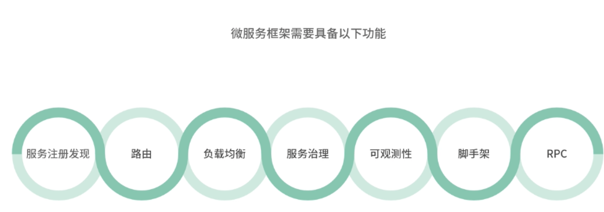
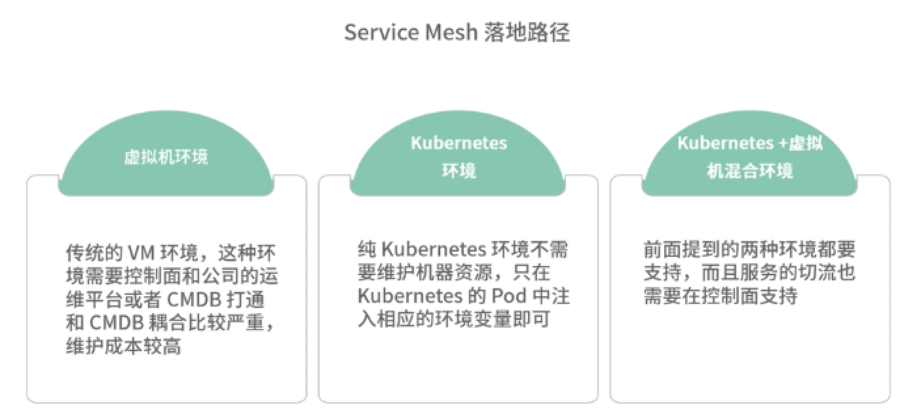
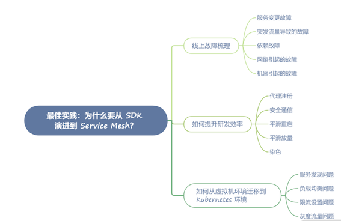

# **第九节 Service Mesh 落地和展望**

## **1、在实践落地中可能遇到的问题和困难**

### **1-1 微服务框架功能及依赖的外部基础设施**

微服务框架功能及依赖的外部基础设施

* **服务注册发现**：微服务的核心组件，负责服务的注册，以及 upstream 服务的 Endpoint 的发现。
* **路由**：负责流量转发的配置。
* **负载均衡**：具备多种负载均衡策略，针对 upstream Endpoint 进行流量分发。
* **服务治理**：通常指的是限流、熔断、降级等可以提高微服务架构稳定性的措施。
* **可观测性**：Metrics、日志、链路追踪等组件。
* **脚手架**：微服务框架为了让业务快速上手，通常需要一个脚手架，让业务方快速生成项目代码。
* **RPC**：这里指的是广义的 RPC，可以是 gRPC 或者 Dubbo 等 RPC 协议，也可以是 HTTP 协议。

 

当然，整个微服务的生态在不断演进，结合公司的需求，适当增加一些新的功能也是有必要的，比如染色、通用 header 传递、金丝雀发布等。

微服务框架落地依赖于外部哪些基础设施。

* **边缘网关层**：统一的入口网关层，作为微服务的入口层，负责南北流量的治理。
* **监控告警**：收集业务的 Metrics、Trace、Log 等信息，并配置监控告警。
* **配置中心**：负责微服务的系统配置的管理，比如 MySQL、Redis，以及上下游服务的调用配置等。
* **CI/CD：包含 CI 持续集成（Continuous Integration）和 CD 持续部署（Continuous Deployment）**。持续集成主要是指代码部署前的自动化测试和自动化编译打包的过程，持续部署是指编译打包后的代码部署发布的过程。代码发布和部署分开，**有利于版本控制和回滚**，方便线上随时恢复到任意版本。开源方案主要有 GitLab 和 Jenkins。
* **PAAS 平台：这里主要是指运维管理平台，主要包含机器的资源管理的 CMDB、微服务流程管理、服务治理平台等**。具体来说，在这个平台中，我们申请机器资源、各类中间件资源、数据库资源、缓存层资源，以及各种机器的权限等；另外包括整个微服务的生命周期管理、服务治理的限流熔断等配置，都可以在这个一站式的服务平台解决。PAAS 平台在微服务架构的落地中至关重要，对于提高产研效率起着关键作用。

### **1-3  微服务框架落地中的问题**

* **推广困难**： 在框架的落地中，亟须解决的是框架覆盖度的问题，但各个业务方往往都有自己的框架选型
* **迭代升级困难**
* **排查问题**： 框架代码和业务代码混淆在一起，日志监控等排查信息也混合在业务代码中，发生问题时就需要框架方和业务方联合排查，而框架提供方需要在日志中找出和框架有关信息，无疑增大了排查问题的难度。
* **多语言**

### **1-4 Service Mesh 架构如何落地**

根据公司的运维环境不同，Service Mesh 落地路径，大致分为以下几种。

**虚拟机环境**：也就是传统的 VM 环境，这种环境需要控制面和公司的运维平台或者 CMDB 打通，需要做的事情较多，因为和 CMDB 耦合比较严重，所以维护成本较高。

**Kubernetes 环境**：纯 Kubernetes 环境相对比较容易，因为不再需要维护机器资源，只在 Kubernetes 的 Pod 中注入相应的环境变量，比如服务名、节点名称、环境等信息即可。

**Kubernetes +虚拟机混合环境**：如果公司面临虚拟机环境向 Kubernetes 环境的迁移，这种混合环境是不可避免的，但是此时涉及的问题就比较多，上面提到的两种环境都要支持，而且服务的切流（指的是流量从虚拟机切换到 Kubernetes 上）也需要在控制面支持。

 

### **1-5 Service Mesh 架构落地中的优势**

* 迭代升级：相对于传统的微服务框架，迭代升级无须业务方感知，可以独立演进。
* 多语言：无须关注公司主力语言，对于非主力语言，也作为“一等公民”同等对待。
* 灵活部署：为了快速落地，Service Mesh 架构并不一定非得全部接管入流量和出流量。在早期，只接管入流量（也就是服务端流量），会更容易一些，因为接管出流量往往需要改动客户端代码，而接管入流量只需修改 LB 代理的端口，或者由 Sidecar 代理注册即可。

### **1-6 Service Mesh 架构落地中的困难**

**排查问题**

一次服务调用，在链路上会增加两次调用，这确实给排查问题带来了不便。本来只需排查服务自身的问题，现在却要经常考虑是不是 Sidecar 出现了问题。解决排查困难的问题，只能从可观测性入手，比如增加丰富的 Metrics 指标、打印关键日志、记录 Trace 链路。

**性能**

上面也提到了，每次调用会多出两次请求，这就导致增加延时和服务器资源消耗的问题无法避免。在落地过程中，性能这个点是被业务方挑战最多的，毕竟这是实打实可以看到的损耗。**这就需要我们尽可能提升 Sidecar 的代理性能、延时和 CPU 消耗。**

比如延时，HTTP 的单次代理延时消耗大概增加 0.3ms，而私有的 RPC 协议可以做到小于 0.1ms。这样的延时，大部分的业务场景都可以接受。

**信任问题**

**Sidecar 导致了服务不稳定**

服务使用 Sidecar 可能会有一些异常的抖动。

**这些问题可能是上 Sidecar 导致的，也可能是因为服务本身的功能迭代，但是这种不稳定需要根据具体问题排查。**

比如在落地中，我就遇到过因为 Http Client 参数配置不合理导致上 Sidecar 之后出现服务抖动；

也遇到过服务自身的业务迭代或者机器资源不足导致的问题，这种情况我们一定要连同业务方一起排查问题，找出根因。

**服务调试不方便**

**Sidecar 增加了延时**

* 他们通过 Trace 日志中的表象，和我们反映 Sidecar 大大增加了延时。
* 这种情况往往出现在服务异常的时候，从 Trace 链路看，Sidecar 的环节确实相对服务延时较高。
* 但大多数情况下，都是机器资源问题导致，因为服务的 Trace 链路实际上是无法跟踪网络和系统层面的消耗的，此时这部分消耗会被记录在 Sidecar 的 Trace 链路中。

## **2、为什么要从 SDK 演进到 Service Mesh？**

### **2-1 线上故障梳理**

**2-1-1 服务变更故障**

线上故障中，出现概率最大的就是服务变更故障，一般指的是业务迭代进行版本更新，在更新过程中遇到的故障，也包括项目配置变更，数据变更等。

一般来说，这种问题只要及时回滚就可以解决，**所以最大的难点在于如何用最快的速度发现故障**。

这个时候就需要通过 Metrics 进行故障报警，在 Service Mesh 架构中，可以不依赖于框架或者业务注入 Metrics，通过收集 Sidecar 中的 Metrics ，达到监控报警的目的。

**2-1-2 突发流量导致的故障**

除去服务变更故障，突发流量是另外一个高频发生的故障类型。比如突发热点，或者运营活动，都可能导致这种故障。

**2-1-3 依赖故障**

依赖故障，主要指的是 upstream 上游服务出现故障时，导致的级联故障，如果没有相应的服务治理手段，将会导致整条微服务链路被拖慢，最终导致集群雪崩。

应对这种问题的办法，就是通过 Service Mesh 服务治理的手段之一——熔断，**在上游服务出现故障的时候，直接熔断，对上游服务的请求直接返回错误**，这样就减少了服务链路的耗时，从而避免微服务集群雪崩。

另外熔断也可以配合降级使用，在一些场景下，比如 Feed 流，如果上游服务故障触发熔断时

**2-1-4 网络引起的故障**

**这种故障往往发生在服务新加节点的情况**，因为网络配置问题，这些节点可能在某些网段不通，但是和注册中心是相通的，这就导致注册中心的健康检查可以通过，但是服务调用的时候却无法联通。

此时就需要 Service Mesh 中的负载均衡器有节点摘除的功能，**在发生网络故障的时候将失败的节点摘除掉**。当然，我们平时也需要做好网络分区的规划，确保服务部署在多个分区，以避免某个网络分区故障引起整个网络瘫痪。

**2-1-5 机器引起的故障**

机器引起的故障主要是指机器 hang 住，或者机器 down 机重启的情况。机器故障问题可以通过注册中心的健康检查解决。如果是在 Kubernetes 环境中，则需要注意，**不要将一个服务的 Pod 都调度在同一台机器上，否则机器故障会导致整个服务不可用**。

### **2-2 如何提升研发效率**

通过控制面下发注册信息，避免了业务方手动设置注册参数的过程，减少故障发生的概率。

**2-2-1 代理注册**

* 如果没有使用 Kubernetes 内置的注册发现体系，就需要通过框架来注册。但是框架注册免不了业务配置一些参数，比如服务名、运行环境等。
* 一旦这些参数配置错误会引发线上故障，所以通过 Sidecar 代理注册是最好的解决方案。
* 通过控制面下发注册信息，避免了业务方手动设置注册参数的过程，减少故障发生的概率。

**2-2-2 安全通信**

* 在内网环境中，内网安全往往没有外网安全那么受重视。
* **云原生的环境，提出了零信任的概念，这个时候在业务代码中加入 TLS 认证或者 Token 认证，都存在不好控制和维护的问题。**
* 直接在 Service Mesh 中，集成安全相关的功能，将是最合适的选择，**服务间通过双向 TLS 认证的方式进行安全通信**。

**2-2-3 平滑重启**

在传统的虚拟机环境下，服务想要做到平滑重启，除了自身用代码实现相对复杂的平滑重启外，还有一种方式就是通过关闭前反注册摘除流量，启动后再注册的方式实现平滑重启。

借助 Sidecar 的能力，通过和 Sidecar 的控制接口通信，调用接口控制注册/反注册的方式，实现平滑重启。这个功能可以集成在 CD 平台中，从而实现和业务代码的解耦，业务无须关心注册/反注册的过程。

**2-2-4 平滑放量**

在一些场景中，比如 Java 语言，启动相对比较慢。如果节点刚启动就放大量流量进入，一些线程池还没来得及预热，就接管流量，会导致大量的错误。

**此时我们可以利用 Sidecar 实现平滑放量的功能，新加入的节点先将权重设置为 1，然后缓慢增加到 100，可以预热 Java 的线程池，达到平滑放量的目的。**

**2-2-5 染色**

通过染色的功能，可以很好地进行流量区分，达到线上真实流量测试的目的，甚至可以配合故障演练使用。将某些符合条件的流量打上特定的标记，通过 header 在微服务之间传递，进而达到流量染色的目的。

### **2-3 如何从虚拟机环境迁移到 Kubernetes 环境**

**2-3-1 服务发现问题**

建议沿用独立注册中心的方案。

通过控制面聚合多个注册中心数据的方式解决，发现方式则统一到 Envoy EDS 协议（节点发现服务）。

**2-3-2 负载均衡问题**

虚拟机迁移到容器环境后，传统的负载均衡算法会因为 Pod 宿主机机器配置的问题，导致流量均衡，而 CPU 负载不均衡的问题。这个时候我们可以通过 P2C（Pick of 2 choices）的算法解决。

**2-3-3 限流设置问题**

虚拟机迁移容器环境后，因为容器环境常常会配置 HPA（自动扩缩容），HPA 会根据 CPU 的水位对 Pod 的数量进行调整，在流量上涨的情况，会进行扩容操作。此时如果限流值配置不合理，会影响扩容操作，导致不必要的流量损失。这个时候需要引入自适应限流的算法，根据延时、CPU 水位等信息，自动调整限流值，避免手动配置引起的故障。

**2-3-4 灰度流量问题**

在虚拟机向容器迁移的过程中，不可避免会涉及如何灰度流量的问题。在传统的 SDK 模式中，需要业务反复发版或者配置中心修改才能调整服务节点的权重。但是在两种环境下，配置中心针对两种环境设置不同的配置才可以做到，服务代码发版也需要在两个环境发版，因为同一个服务代码配置不同，很容易在生产环境产生人为故障。

上述问题都可以通过 Service Mesh 控制面解决，**控制面支持两种环境不同的权重配置**，结合服务治理平台提供的 Web UI，可以让运维非常方便地操作，而不需要业务方修改代码或者配置中心。

 

