# **第三节 Istio 服务发现和 Pilot的架构机制**

* Istio架构回顾&Pilot介绍
* Istio服务发现
* Istio服务配置
* Istio服务发现&规则管理与Kubernetes结合 
* ShowCase

## **1、Istio架构回顾&Pilot介绍**

### **1-1 上期回顾:Istio架构**


### **1-2 Pilot功能**

* **服务发现**
* **服务配置**


## **2、Istio服务发现**

### **2-1 服务发现基本原理**

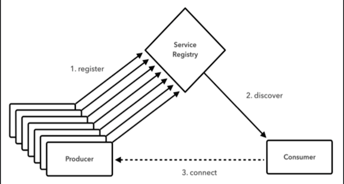

1. **Service register**
2. **Service discover**
3. **Service provide**


### **2-2 SpringCloud的服务(外部）注册与发现流程**

* **服务注册表**: 如`Springcloud`中一般`Eureka`服务;
* **服务注册**: **服务配置文件中配置服务名和本实例地址**，实例启动时自动注册到服务注册表;
* **服务发现**: **访问目标服务时连服务注册表**，获取服务实例列表。根据`LB`根据策略选择一个服务实例，建立连接去访问。

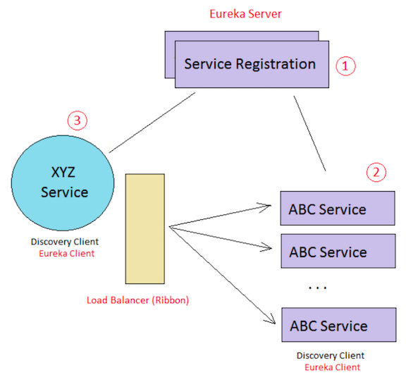

1. **Eureka Server** -  Register Service list
2. **Load Balancer** - Find Service
3. **Eureka Client** - Service return


### **2-3 Istio服务发现流程（内部）**

* 服务注册表:**`Pilot` 从平台获取服务发现数据，并提供统一的服务发现接口。**
* 服务注册: **无**
* 服务发现:**`Envoy 实现服务发现`，动态更新负载均衡池。** 在服务请求时使用对应的负载均衡策略将请求路由到对应的后端。

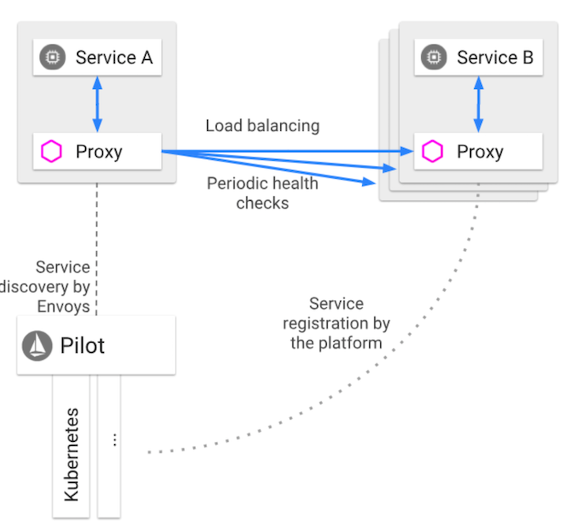

* **Pilot -> Service registration by the platform**
* **Enovy -> Service discovery by Envoys**


### **2-4 Pilot服务发现机制的Adapter机制**


#### **Abstract Model**

* **Services**
* **Services Instances**
* **Services Versions**


### **2-5 Istio服务发现实现: 基于 Eureka**

1. `Pilot` 实现**若干服务发现的接口定义**
2. `Controller`使用`EurekaClient`来获取服务列表，提供转换后的标准的服务发现接口和数据结构;
3. `Discoveryserver` 基于 `Controller` 上维护的服务发现数据，发布成`gRPC`协议的服务供`Envoy`使用。
4. **当有服务访问时，`Envoy`在处理`Outbound`请求时，根据配置的`LB`策略，选择一个服务实例发起访问**

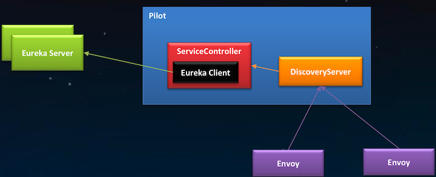

```
public interface ServiceInstance { 
	String getServiceId();
	String getHost();
	int getPort();
	boolean isSecure();
	URI getUri();
	Map<String, String> getMetadata();
}
```

### **2-6 Istio 服务发现实现:基于Kubernetes**

1. **Pilot 实现若干服务发现的接口定义**
2. **Pilot 的`Controller List/Watch KubeAPIserver`上`service`、 `endpoint`等资源对象并转换成标准格式**。
3. **`Envoy`从`Pilot`获取`xDS`，动态更新**
4. **当有服务访问时，`Envoy`在处理 `Outbound`请求时，根据配置的`LB` 策略，选择一个服务实例发起访问。**

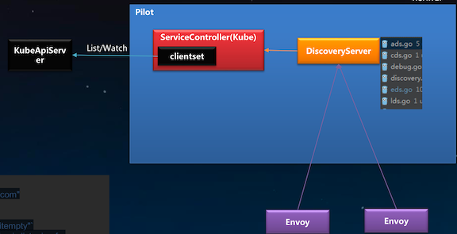

```
type Service struct {
	// Hostname of the service, e.g. "catalog.mystore.com"
	Hostname Hostname `json:"hostname"`
	Address string `json:"address,omitempty"`
	Addresses map[string]string `json:"addresses,omitempty"`
	// Ports is the set of network ports where the service is listening for
	connections
	Ports PortList `json:"ports,omitempty"` ExternalName Hostname `json:"external"` 
    ...
}
```

### **2-7 Kubernetes & Istio 服务模型**

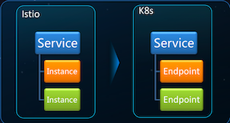   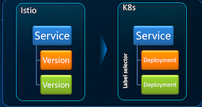

### **2-8 Kuberntes的服务发现**

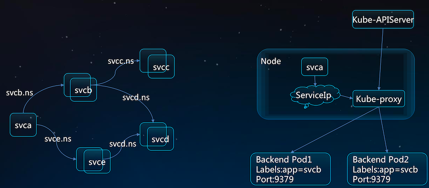 


### **2-9 Istio Upon Kubernetes场景**

**Istiio  => 服务治理**

• 调用链追踪 • 动态路由 • 熔断限流   

**kubernetes  => 服务的部署运维**

• 负载均衡 • 服务发现 • 扩缩容 • 运维 • 部署

### **2-10 Istio (upon Kubernetes)服务发现和配置**

 

* POD to POD => Enovy to Enovy
* **`Envoy`从`Pilot`获取`xDS`，动态更新**
* Pilot 的`Controller List/Watch KubeAPIserver`上`service`、 `endpoint`等资源对象并转换成标准格式

## **3、Istio服务配置管理**

### **3-1 Istio 服务访问规则维护和工作机制**

1. 配置: **管理员通过Pilot配置治疗规则**
2. 下发: **Envoy从Pilot获取治理规则**
3. 执行: **在流量访问的时候执行治理规则**

 

### **3-2 Istio治理规则**

* **VirtualService**: Configuration affecting label/content routing, sni routing, etc.
* **DestinationRule**: Configuration affecting load balancing, outlier detection, etc.
* **Gateway**: Configuration affecting edge load balancer.
* **ServiceEntry**: Configuration affecting service registry. 
* **Sidecar**: Configuration affecting network reachability of a sidecar.
* **Envoy Filter**: Configuration affecting insertion of custom Envoy filters.

[https://istio.io/docs/reference/config/istio.networking.v1alpha3/](https://istio.io/docs/reference/config/istio.networking.v1alpha3/)

### **3-3 Istio流量规则: VirtualService**

**服务访问路由控制**。


**满足特定条件的请求流到哪里，过程中治理。包括请求重写、重试、故障注入等。**

```
kind: VirtualService 
metadata:
  name: reviews 
spec:
  hosts:
  - reviews 
  http:
  - match:
   - headers: 
      Foo:
       exact: bar 
  fault:
   delay: 
    fixedDelay: 5s
   abort:
    percent: 10 
    httpStatus: 400
  route:
  - destination:
     host: reviews
     subset: v2 
  - route:
    - destination: 
        host: reviews 
        subset: v1
```

**协议支持:**

```
http      HTTPRoute[] 
tls       TLSRoute[] 
tcp       TCPRoute[]
```

**HTTP协议流量规则:**

```
Field            Type 
match            HTTPMatchRequest[]
route            HTTPRouteDestination[]
redirect         HTTPRedirect
rewrite          HTTPRewrite
timeout          google.protobuf.Duration 
retries          HTTPRetry
fault            HTTPFaultInjection
mirror           Destination
```

### **3-4 Istio流量规则: DestinationRule**

**目标服务的策略，包括目标服务的负载均衡，连接池管理等**

```
apiVersion: networking.istio.io/v1alpha3 
kind: DestinationRule
metadata:
  name: reviews 
spec:
 host: reviews 
 trafficPolicy:
  loadBalancer:
    simple: RANDOM
 subsets:
 - name: v1
   labels: 
    version: v1
 - name: v2
   labels: 
    version: v2
   trafficPolicy: 
    loadBalancer:
     simple: ROUND_ROBIN
 - name: v3
   labels: 
     version: v3
```

```
host            string
trafficPolicy   TrafficPolicy
subsets         Subset[]
```

```
loadBalancer           LoadBalancerSettings
connectionPool         ConnectionPoolSettings
outlierDetection       OutlierDetection 
tls                    TLSSettings
portLevelSettings      TrafficPolicy.PortTrafficPolicy[]
```

```
name             string
labels           map<string, string>
trafficPolicy    TrafficPolicy
```

### **3-5 Istio流量规则: ServiceEntry & Gateway**

#### **ServiceEntry:**

* **功能**: `Mesh`外的服务加入到服务发现中，向`Mesh`里面的服务一样的被治理
* **机制**: 将`ServiceEntry`描述的服务加入到服务发现中;对这些服务的`outbound`流量进行拦截，进而进行治理

#### **Gateway:**

* **功能**: 将`mesh`内的一个服务发布成可供外部访问。
* **机制**: 在入口处部署一个`ingress`的`Envoy`，在其上执行服务治理。

### **3-6 Istio配置规则维护和下发流程**

 

### **3-7 治理规则定义 Istio VS Envoy**

#### **Istio 规则**

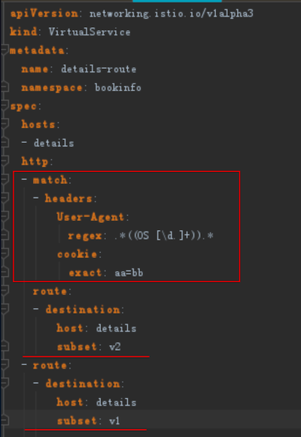 

### **3-8 Envoy规则**

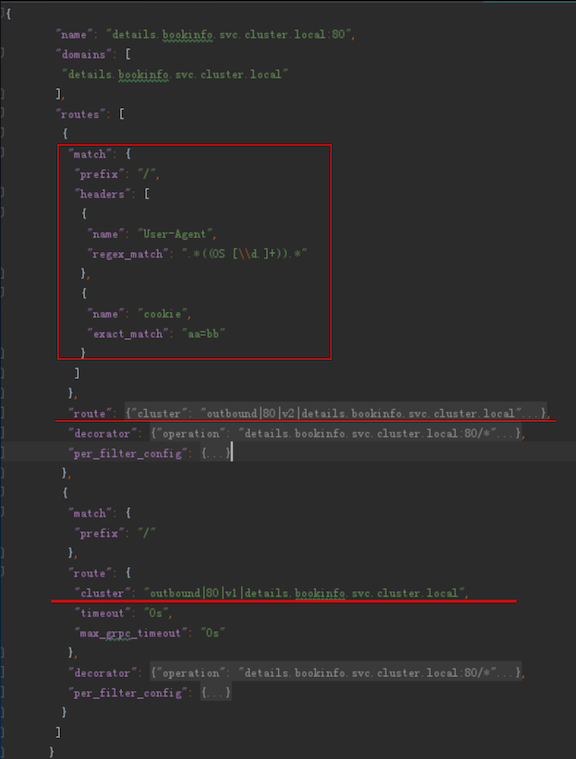 

### **3-9 Istio治理能力执行位置**

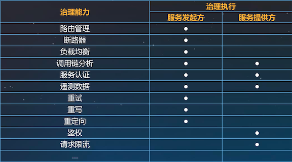 

## **4、Istio服务发现&规则管理与Kubernetes结合**

### **4-1 Kubernetes & Istio 结合**

对于云原生应用，采用kubernetes构建微服务部署和集群管理能力，采用Istio构建服务治理能力，将逐渐成为应用微服务转型的标准配置。

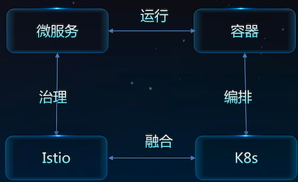

### **4-2 服务发现和配置管理: Istio+K8S (Internal)**

**Envoy**

* 1.**治理和业务**: Sidecar 自动注入，自动接管流量 ，实现治理逻辑，且与业务进程分离。
* 2.**治理升级**: 治理能力升级不影响业务。只需升级`Istio`管理面和`Envoy`。 业务代码无感知

**Istio**

* 1. **一致服务发现**: 统 一服务发现 基于K8S 数据做服务发现

**Kube-APIServer**

* 1. **治理规则**: 治理规则基于`K8S CRD`定义， 无需专门配置管理服务
* 2. **服务发现方式**:无需专门服务注册 部署成 `K8S Service`即可


### **4-3 服务发现和配置管理: Spring Cloud+K8S**

**Pod+Java+SDK**

1. 治理和业务:治理逻辑和业务代码共存
2. 治理升级:治理逻 辑升级用户业务也需随之升级

**Service Registry (Eureka)**

1. 服务注册:业务代码中需要配置注册中心地址，本服务的描述，启动时候注册
2. 治理规则:治理规则和服务注册一起，获取单独的配置服务
3. 服务发现方式:业务代码中需要配置注 册中心地址，获取目标服务实例信息

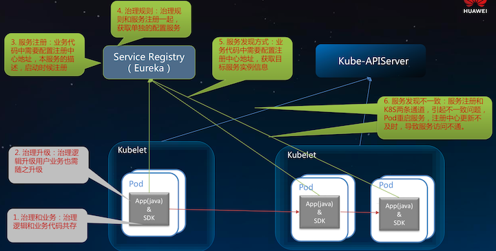

 