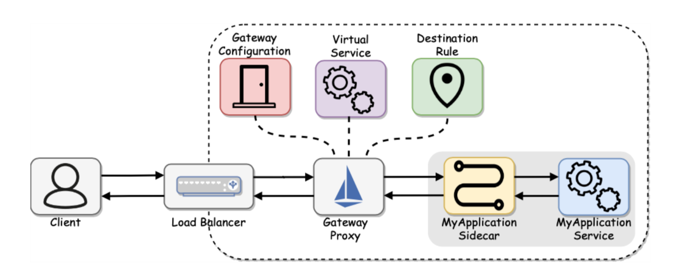
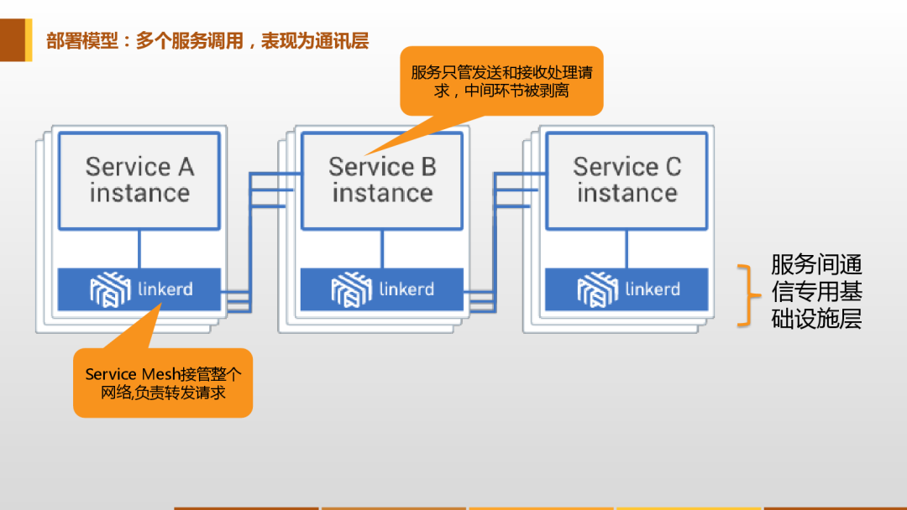
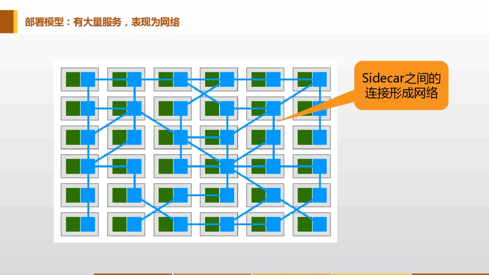
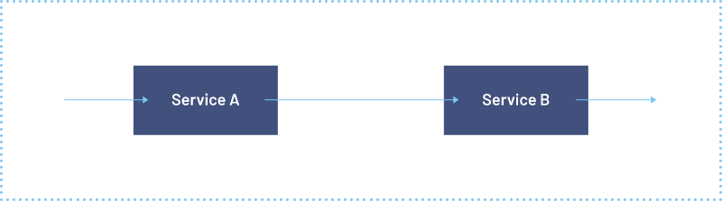
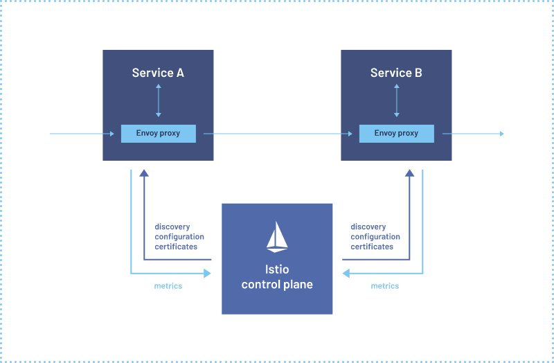
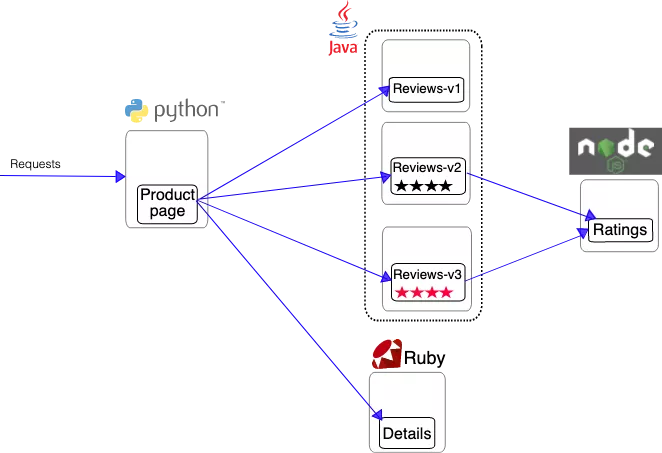
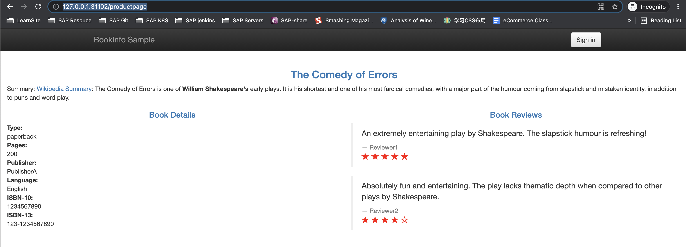
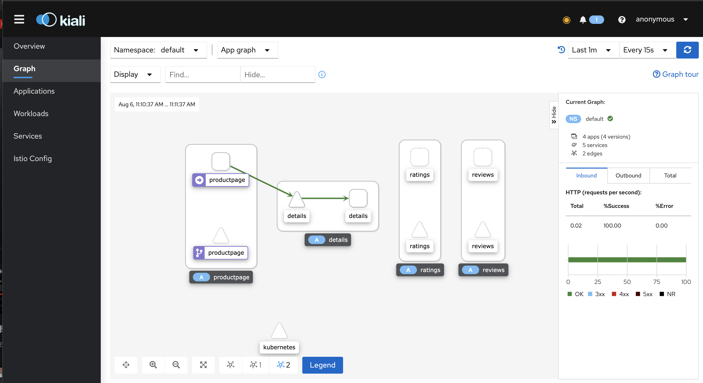

# **第一节 2021 Service Mesh & Istio 介绍/安装(1.10.3)**

 


现在最火的后端架构无疑是微服务了，微服务将之前的单体应用拆分成了许多独立的服务应用，每个微服务都是独立的，好处自然很多，但是随着应用的越来越大，微服务暴露出来的问题也就随之而来了，微服务越来越多，管理越来越麻烦，特别是要你部署一套新环境的时候，你就能体会到这种痛苦了，随之而来的**服务发现、负载均衡、Trace跟踪、流量管理、安全认证等等问题**。


如果从头到尾完成过一套微服务框架的话，你就会知道这里面涉及到的东西真的非常多。当然随着微服务的不断发展，微服务的生态也不断完善，最近新一代的微服务开发就悄然兴起了，那就是服务网格/Service Mesh。


## **1、什么是Service Mesh？**

Service Mesh 是一个非常新的名词，最早是2016年由开发 Linkerd 的 Buoyant 公司提出的，伴随着 Linkerd 的传入， Service Mesh 的概念也慢慢进入国内技术社区，**现在主流的叫法都叫：服务网格。**

> 服务网格是一个用于处理服务间通信的基础设施层，它负责为构建复杂的云原生应用传递可靠的网络请求。在实践中，服务网格通常实现为一组和应用程序部署在一起的轻量级的网络代理，但对应用程序来说是透明的。

要理解网格的概念，就得从服务的部署模型说起：


### **1-1 单个服务调用，表现为sidecar**

 

> 单个服务调用

Service Mesh 的部署模型，先看单个的，对于一个简单请求，作为请求发起者的客户端应用实例，会首先用简单方式将请求发送到本地的 Service Mesh 实例。**这是两个独立进程，他们之间是远程调用。**

Service Mesh 会完成完整的服务间调用流程，如服务发现负载均衡，最后将请求发送给目标服务，这表现为 Sidecar 方式。

### **1-2 部署多个服务，表现为通讯层**

 


多个服务调用的情况，在这个图上我们可以看到 Service Mesh 在所有的服务的下面，这一层被称之为服务间通讯专用基础设施层。

Service Mesh 会接管整个网络，把所有的请求在服务之间做转发。在这种情况下，我们会看到上面的服务不再负责传递请求的具体逻辑，只负责完成业务处理。服务间通讯的环节就从应用里面剥离出来，呈现出一个抽象层。

### **1-3 有大量服务，表现为网络**

 

如果有大量的服务，就会表现出来网格，图中左边绿色方格是应用，右边蓝色的方框是 Service Mesh，蓝色之间的线条是表示服务之间的调用关系。Sidecar 之间的连接就会形成一个网络，这个就是服务网格名字的由来，这个时候代理体现出来的就和前面的 Sidecar 不一样了，形成网状。


首先第一个，服务网格是抽象的，实际上是抽象出了一个基础设施层，在应用之外。其次，功能是实现请求的可靠传递。部署上体现为轻量级的网络代理。最后一个关键词是，对应用程序透明。

 


大家注意看，上面的图中，网络在这种情况下，可能不是特别明显。但是如果把左边的应用程序去掉，现在只呈现出来 Service Mesh 和他们之间的调用，这个时候关系就会特别清晰，就是一个完整的网络。

这是 Service Mesh 定义当中一个非常重要的关键点，和 Sidecar 不相同的地方：**不再将代理视为单独的组件，而是强调由这些代理连接而形成的网络。在 Service Mesh 里面非常强调代理连接组成的网络，而不像 Sidecar 那样看待个体。**


现在我们基本上把 Service Mesh 的定义介绍清楚了，大家应该可以大概了解什么是 Service Mesh 了。现在实现 Service Mesh 的开源方案有很多，比如 Linkerd、Istio 等，当然目前最流行最火热的还是要数 Istio 了，记下来我们就来开始讲解 Istio 的使用。

## **2、什么是Istio？**

Istio 解决了开发人员和运维在分布式或微服务架构方面面临的挑战，无论是从头开始构建还是将现有应用程序迁移到云原生环境下，Istio 都可以提供帮助。

通过在部署的每个应用程序中添加代理 sidecar，Istio 允许您将应用程序感知流量管理、令人难以置信的可观察性和强大的安全功能编程到您的网络中。

 

Istio 是一个开源服务网格，它透明地分层到现有的分布式应用程序上。Istio 强大的特性提供了一种统一和更有效的方式来保护、连接和监视服务。

Istio 是实现负载平衡、服务到服务身份验证和监视的路径——只需要很少或不需要更改服务代码。它强大的控制平面带来了重要的特点，包括：

* 使用 TLS 加密、强身份认证和授权的集群内服务到服务的安全通信
* 自动负载均衡的 HTTP, gRPC, WebSocket，和 TCP 流量
* 通过丰富的路由规则、重试、故障转移和故障注入对流量行为进行细粒度控制
* 一个可插入的策略层和配置 API，支持访问控制、速率限制和配额
* 对集群内的所有流量(包括集群入口和出口)进行自动度量、日志和跟踪

Istio 是为可扩展性而设计的，可以处理不同范围的部署需求。

Istio 的控制平面运行在 Kubernetes 上，您可以将部署在该集群中的应用程序添加到您的网格中，将网格扩展到其他集群，甚至连接 VM 或运行在 Kubernetes 之外的其他端点。


## **3、架构**

Istio 有两个组成部分：**数据平面和控制平面**。

**数据平面由一组智能代理（Envoy）组成，被部署为 Sidecar。这些代理负责协调和控制微服务之间的所有网络通信。它们还收集和报告所有网格流量的遥测数据**。

服务网格使用代理拦截所有的网络流量，允许根据您设置的配置提供广泛的应用程序感知功能。

代理与您在集群中启动的每个服务一起部署，或者与运行在虚拟机上的服务一起运行。

控制平面管理并配置代理来进行流量路由。

在使用 Istio 之前服务与服务之间通信如下图所示：

 

使用 Istio 之后服务与服务之间通信则通过 Envoy 代理进行：

 

下图则是 Istio 每个平面的不同组件的架构：

 

### **3-1 Envoy**

Istio 默认使用 Envoy 代理的扩展版本，Envoy 是用 C++ 开发的高性能代理，用于协调服务网格中所有服务的入站和出站流量。Envoy 代理是唯一与数据平面流量交互的 Istio 组件。


Envoy 代理被部署为服务的 Sidecar，在逻辑上为服务增加了 Envoy 的许多内置特性，例如：

* 动态服务发现
* 负载均衡
* TLS 校验
* HTTP/2 与 gRPC 代理
* 熔断器
* 健康检查
* 基于百分比流量分割的分阶段发布
* 故障注入
* 丰富的指标

这种 Sidecar 部署允许 Istio 可以执行策略决策，并提取丰富的遥测数据，接着将这些数据发送到监视系统以提供有关整个网格行为的信息。

Sidecar 代理模型还允许你向现有的应用添加 Istio 功能，而不需要重新设计架构或重写代码。

由 Envoy 代理启用的一些 Istio 的功能和任务包括：

* **流量控制功能**：通过丰富的 HTTP、gRPC、WebSocket 和 TCP 流量路由规则来执行细粒度的流量控制。
* **网络弹性特性：重试设置、故障转移、熔断器和故障注入**。
* **安全性和身份认证特性**：执行安全性策略，并强制实行通过配置 API 定义的访问控制和速率限制。
* **基于 WebAssembly 的可插拔扩展模型，允许通过自定义策略执行和生成网格流量的遥测**。

### **3-2 Istiod**

组件 Istiod 提供**服务发现、配置和证书管理**。

Istiod 将控制流量行为的高级路由规则转换为 Envoy 特定的配置，并在运行时将其传播给 Sidecar。

**Pilot 提取了特定平台的服务发现机制，并将其配置为一种标准格式，任何符合 Envoy API 的 Sidecar 都可以使用。**

**Istio 可以支持发现多种环境，如 Kubernetes 或 VM。**

你可以使用 Istio 流量管理 API 让 Istiod 重新构造 Envoy 的配置，以便对服务网格中的流量进行更精细的控制。


Istiod 通过内置的身份和凭证管理进行安全管理，你可以使用 Istio 来升级服务网格中未加密的流量，可以使用 Istio 的授权功能控制谁可以访问你的服务。

**Istiod 充当证书授权（CA），并生成证书以允许在数据平面中进行安全的 mTLS 通信**。

## **4、安装**

接下来我们将介绍如何在 Kubernetes 集群中安装 Istio，这里我们使用的是最新的 1.10.3 版本。

下面的命令可以下载指定的 1.10.3 版本的 Istio：

```
 ~ curl -L https://istio.io/downloadIstio | ISTIO_VERSION=1.10.3 sh -
```
```
$ curl -L https://istio.io/downloadIstio | ISTIO_VERSION=1.10.3 sh -
  % Total    % Received % Xferd  Average Speed   Time    Time     Time  Current
                                 Dload  Upload   Total   Spent    Left  Speed
100   102  100   102    0     0     41      0  0:00:02  0:00:02 --:--:--    41
100  4573  100  4573    0     0    994      0  0:00:04  0:00:04 --:--:--  4191

Downloading istio-1.10.3 from https://github.com/istio/istio/releases/download/1.10.3/istio-1.10.3-osx.tar.gz ...
Istio 1.10.3 Download Complete!

Istio has been successfully downloaded into the istio-1.10.3 folder on your system.

Next Steps:
See https://istio.io/latest/docs/setup/install/ to add Istio to your Kubernetes cluster.

To configure the istioctl client tool for your workstation,
add the /Users/i515190/k8s_test/istio/istio-1.10.3/bin directory to your environment path variable with:
         export PATH="$PATH:/Users/i515190/k8s_test/istio/istio-1.10.3/bin"

Begin the Istio pre-installation check by running:
         istioctl x precheck 

Need more information? Visit https://istio.io/latest/docs/setup/install/
```


如果安装失败，可以用手动方式进行安装，在 GitHub Release 页面获取对应系统的下载地址：

```
# 注意选择和自己操作系统匹配的文件
➜  ~ wget https://github.com/istio/istio/releases/download/1.10.3/istio-1.10.3-linux-amd64.tar.gz
➜  ~ tar -xzf istioctl-1.10.3-linux-amd64.tar.gz
# 进入到 istio 解压的目录
➜  ~ cd istio-1.10.3 && ls -la
total 48
drwxr-x---@   9 ych  staff    288 Jul 15 13:32 .
drwx---r-x@ 482 ych  staff  15424 Jul 20 14:17 ..
-rw-r--r--@   1 ych  staff  11348 Jul 15 13:32 LICENSE
-rw-r--r--@   1 ych  staff   5866 Jul 15 13:32 README.md
drwxr-x---@   3 ych  staff     96 Jul 15 13:32 bin
-rw-r-----@   1 ych  staff    854 Jul 15 13:32 manifest.yaml
drwxr-xr-x@   5 ych  staff    160 Jul 15 13:32 manifests
drwxr-xr-x@  21 ych  staff    672 Jul 15 13:32 samples
drwxr-xr-x@   5 ych  staff    160 Jul 15 13:32 tools
```

其中 `samples/` 目录下面是一些示例应用程序，`bin/` 目录下面的 `istioctl `是 Istio 的 CLI 工具，可以将该 `bin/` 目录加入到 `PATH` 路径之下，也可以直接拷贝到某个 `PATH` 目录下去：


```
$ cd istio-1.10.3
$ sudo cp bin/istioctl /usr/local/bin/istioctl


$ istioctl version
no running Istio pods in "istio-system"
1.10.3
```

安装 istio 的工具和文件准备好过后，直接执行如下所示的安装命令即可，这里我们采用的是 `demo `配置组合的形式，这是因为它包含了一组专为测试准备的功能集合，另外还有用于生产或性能测试的配置组合。

```
$  istioctl install --set profile=demo -y
✔ Istio core installed                                                                                                              
✔ Istiod installed                                                                                                                  
✔ Ingress gateways installed                                                                                                        
✔ Egress gateways installed                                                                                                         
✔ Installation complete                                                                                                             
Thank you for installing Istio 1.10.  Please take a few minutes to tell us about your install/upgrade experience!  https://forms.gle
/KjkrDnMPByq7akrYA
```

安装完成后我们可以查看 istio-system 命名空间下面的 Pod 运行状态：

```
$ kubectl get pods -n istio-system
NAME                                   READY   STATUS    RESTARTS   AGE
istio-egressgateway-5547fcc8fc-flqkt   1/1     Running   0          3m6s
istio-ingressgateway-8f568d595-hsm6l   1/1     Running   0          3m6s
istiod-568d797f55-56vg9                1/1     Running   0          4m48s
```

如果都是 Running 状态证明 istio 就已经安装成功了。然后我们还可以给 namespace 添加一个 `isito-injection=enabled` 的 label 标签，指示 Istio 在部署应用的时候，可以自动注入 `Envoy Sidecar` 代理，比如这里我们给 default 命名空间注入自动标签：

```
$ kubectl label namespace default istio-injection=enabled
namespace/default labeled
```

## **4、部署示例应用**

然后我们可以来安装官方提供的一个非常经典的 Bookinfo 应用示例，这个示例部署了一个用于演示多种 Istio 特性的应用，该应用由四个单独的微服务构成，这个应用模仿在线书店的一个分类，显示一本书的信息。页面上会显示一本书的描述、书籍的 ISBN、页数等信息，以及关于这本书的一些评论。

Bookinfo 应用分为四个单独的微服务：

* productpage：这个微服务会调用 `details` 和 `reviews` 两个微服务，用来生成页面。
* details：这个微服务中包含了书籍的信息。
* reviews：这个微服务中包含了书籍相关的评论，它还会调用 ratings 微服务。
* ratings：这个微服务中包含了由书籍评价组成的评级信息。

reviews 微服务有 3 个版本：

* v1 版本不会调用 ratings 服务。
* **v2 版本会调用 ratings 服务，并使用 1 到 5 个黑色星形图标来显示评分信息**。
* **v3 版本会调用 ratings 服务，并使用 1 到 5 个红色星形图标来显示评分信息**。

下图可以用来说明我们这个示例应用的整体架构：

 

Bookinfo 应用中的几个微服务是由不同的语言编写而成的，这些服务对 Istio 并无依赖，但是构成了一个有代表性的服务网格的例子：它由多个服务、多个语言构成，并且 reviews 服务具有多个版本。

我们要在 Istio 中运行这个应用，不需要对应用本身做任何改变，只要简单的在 Istio 环境中对服务进行配置和运行，也就是把 Envoy sidecar 注入到每个服务之中。最终的部署结果将如下图所示：

 

所有的微服务都和 Envoy sidecar 集成在一起，被集成服务所有的出入流量都被 sidecar 所劫持，这样就为外部控制准备了所需的 Hook，然后就可以利用 Istio 控制平面为应用提供服务路由、遥测数据收集以及策略实施等功能。

进入上面的 Istio 安装目录，执行如下命令：

```
$  kubectl apply -f samples/bookinfo/platform/kube/bookinfo.yaml
service/details created
serviceaccount/bookinfo-details created
deployment.apps/details-v1 created
service/ratings created
serviceaccount/bookinfo-ratings created
deployment.apps/ratings-v1 created
service/reviews created
serviceaccount/bookinfo-reviews created
deployment.apps/reviews-v1 created
deployment.apps/reviews-v2 created
deployment.apps/reviews-v3 created
service/productpage created
serviceaccount/bookinfo-productpage created
deployment.apps/productpage-v1 created
```

> 如果在安装过程中禁用了 Sidecar 自动注入功能而选择手动注入 Sidecar，请在部署应用之前可以使用 `istioctl kube-inject` 命令来注入 sidecar 容器。

```
$ kubectl apply -f <(istioctl kube-inject -f samples/bookinfo/platform/kube/bookinfo.yaml)
```

这里我们部署的 bookinfo.yaml 资源清单文件就是普通的 Kubernetes 的 Deployment 和 Service 的 yaml 文件，使用 `istioctl kube-inject` 或者配置自动注入后会在这个文件的基础上向其中的 Deployment 追加一个镜像为 `docker.io/istio/proxyv2:1.10.3` 的 sidecar 容器，上面的命令会启动全部的四个服务，其中也包括了 `reviews` 服务的三个版本（v1、v2 以及 v3）。

```
$ kubectl get pods
NAME                              READY   STATUS    RESTARTS   AGE
details-v1-79f774bdb9-bxgnv       2/2     Running   0          7m3s
productpage-v1-6b746f74dc-drxqj   2/2     Running   0          7m3s
ratings-v1-b6994bb9-62nrz         2/2     Running   0          7m3s
reviews-v1-545db77b95-lgcjt       2/2     Running   0          7m3s
reviews-v2-7bf8c9648f-mlfb7       2/2     Running   0          7m3s
reviews-v3-84779c7bbc-fnqbg       2/2     Running   0          7m3s

$ kubectl get svc
NAME          TYPE        CLUSTER-IP       EXTERNAL-IP   PORT(S)    AGE
details       ClusterIP   10.110.179.156   <none>        9080/TCP   7m7s
kubernetes    ClusterIP   10.96.0.1        <none>        443/TCP    20h
productpage   ClusterIP   10.96.138.142    <none>        9080/TCP   7m7s
ratings       ClusterIP   10.102.119.192   <none>        9080/TCP   7m7s
reviews       ClusterIP   10.102.66.198    <none>        9080/TCP   7m7s
```

现在应用的服务都部署成功并启动了，如果我们需要在集群外部访问，就需要添加一个 istio gateway，gateway 相当于 k8s 的 ingress controller 和 ingress，它为 HTTP/TCP 流量配置负载均衡，通常在服务网格边缘作为应用的 ingress 流量管理。

创建一个 Ingress gateway:

```
$ kubectl apply -f samples/bookinfo/networking/bookinfo-gateway.yaml
gateway.networking.istio.io/bookinfo-gateway created
virtualservice.networking.istio.io/bookinfo created
```

验证 gateway 是否创建成功:

```
$  kubectl get gateway
NAME               AGE
bookinfo-gateway   72s
```

要想访问这个应用，这里我们需要更改下 istio 提供的 istio-ingressgateway 这个 Service 对象，默认是 LoadBalancer 类型的服务：

```
$  kubectl get svc -n istio-system
NAME                   TYPE           CLUSTER-IP      EXTERNAL-IP   PORT(S)                                                         
             AGE
istio-egressgateway    ClusterIP      10.101.179.89   <none>        80/TCP,443/TCP                                                  
             3h16m
istio-ingressgateway   LoadBalancer   10.99.72.32     localhost     15021:32556/TCP,80:31102/TCP,443:30657/TCP,31400:32719/TCP,15443
:31978/TCP   3h16m
istiod                 ClusterIP      10.107.4.189    <none>        15010/TCP,15012/TCP,443/TCP,15014/TCP  3h18m
```

LoadBalancer 类型的服务，实际上是用来对接云服务厂商的，如果我们没有对接云服务厂商的话，**可以将这里类型改成 NodePort，但是这样当访问我们的服务的时候就需要加上 nodePort 端口了**：

```
$ kubectl edit svc istio-ingressgateway -n istio-system
service/istio-ingressgateway edited
```

```
......
type: NodePort  # 修改成 NodePort 类型
status:
  loadBalancer: {}
```

```
$  kubectl get svc -n istio-system
NAME                   TYPE        CLUSTER-IP      EXTERNAL-IP   PORT(S)                                                            
          AGE
istio-egressgateway    ClusterIP   10.101.179.89   <none>        80/TCP,443/TCP                                                     
          3h20m
istio-ingressgateway   NodePort    10.99.72.32     <none>        15021:32556/TCP,80:31102/TCP,443:30657/TCP,31400:32719/TCP,15443:31
978/TCP   3h20m
istiod                 ClusterIP   10.107.4.189    <none>        15010/TCP,15012/TCP,443/TCP,15014/TCP                              
          3h22m
```

这样我们就可以通过 `http://<NodeIP>:<nodePort>/productpage` 从集群外部访问 Bookinfo 应用了：

```
http://127.0.0.1:31102/productpage
```

 

刷新页面可以看到 Book Reviews 发生了改变（红色、黑色的星形或者没有显示），因为每次请求会被路由到到了不同的 Reviews 服务版本去。


## **5、仪表盘**

上面我们是安装的 Istio 的核心组件，此外 Istio 还和一些遥测应用做了集成，遥测能帮助我们了解服务网格的结构、展示网络的拓扑结构、分析网格的健康状态等，对于分布式微服务应用也是非常重要的。

我们可以使用下面的命令来部署 Kiali、Prometheus、Grafana 以及 Jaeger：

```
kubectl apply -f samples/addons
# 如果出现了错误，则可以重新执行上面的命令


$ kubectl get pods -n istio-system
NAME                                    READY   STATUS    RESTARTS   AGE
grafana-f766d6c97-4888w                 1/1     Running   0          3m57s
istio-egressgateway-5c8d96c9b5-6d5g9    1/1     Running   0          60m
istio-ingressgateway-6bcfd457f9-wpj7w   1/1     Running   0          60m
istiod-775bcf58f7-v6jl2                 1/1     Running   0          61m
jaeger-7f78b6fb65-bj8pm                 1/1     Running   0          3m56s
kiali-85c8cdd5b5-b5zv4                  1/1     Running   0          3m55s
prometheus-54b5dcf6bf-wjkpl             3/3     Running   0          3m48s
```


上面几个组件部署完成后我们就可以查看前面 Bookinfo 示例应用的遥测信息了，比如可以使用下面的命令访问 Kiali：

```
istioctl dashboard kiali
```

在左侧的导航菜单，选择 Graph ，然后在 Namespace 下拉列表中，选择 default 。Kiali 仪表板展示了网格的概览、以及 Bookinfo 示例应用的各个服务之间的关系。它还提供过滤器来可视化流量的流动。

 

至此，整个 Istio 和 Bookinfo 示例应用就安装并验证成功了，现在就可以使用这一应用来体验 Istio 的特性了，其中包括了流量的路由、错误注入、速率限制等特性。

目前搭建 Bookinfo 应用我们只用到了下面两个资源文件：

```
samples/bookinfo/platform/kube/bookinfo.yaml
samples/bookinfo/networking/bookinfo-gateway.yaml
```

前者就是通常的 Kubernetes 定义的 Deployment 和 Service 的资源清单文件，只是在部署时使用 `istioctl kube-inject`（或者通过对命名空间打上自动注入的标签）对这个文件定义的 Pod 注入了 `sidecar` 代理，后者定义了这个应用的外部访问入口 gateway，以及应用内部 productpage 服务的 VirtualService 规则，而其他内部服务的访问规则还没有被定义。

现在访问应用界面并刷新，会看到 Reviews 有时不会显示评分，有时候会显示不同样式的评分，这是因为后面有3个不同的 Reviews 服务版本，而没有配置该服务的路由规则的情况下，该服务的几个实例会被随机访问到，有的版本服务会进一步调用 Ratings 服务，有的不会。


