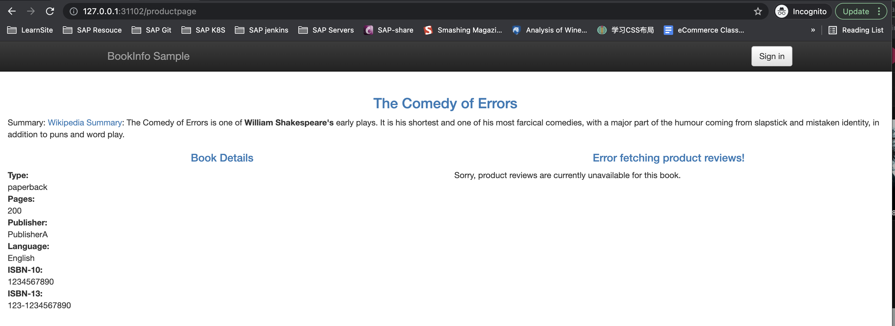
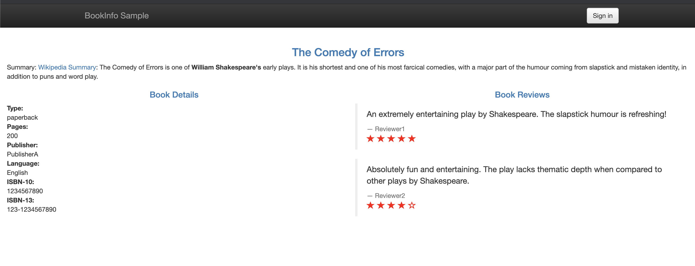
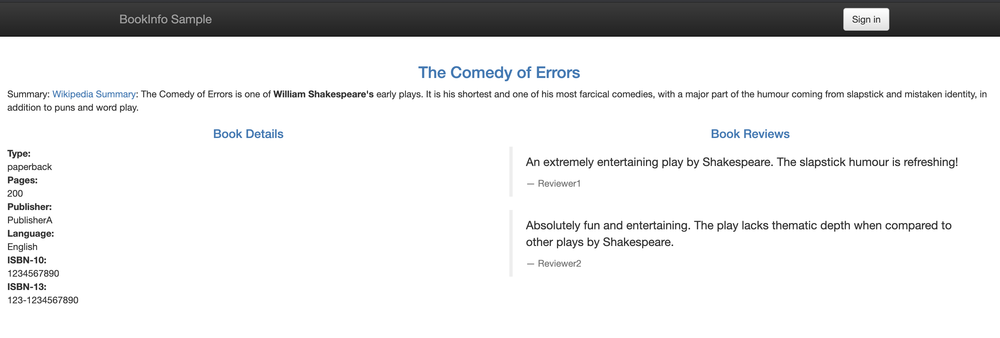
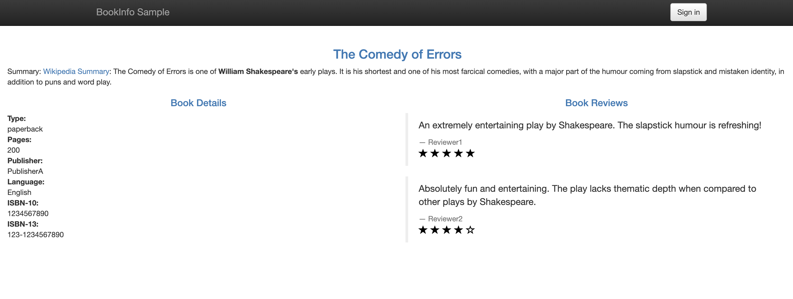
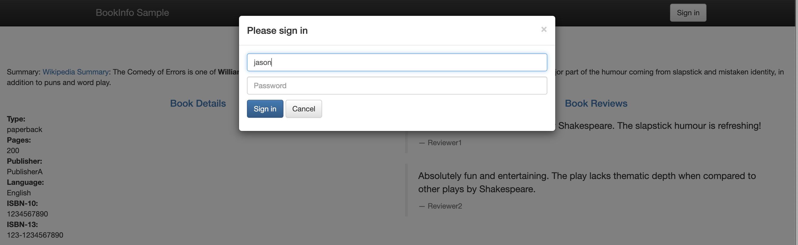
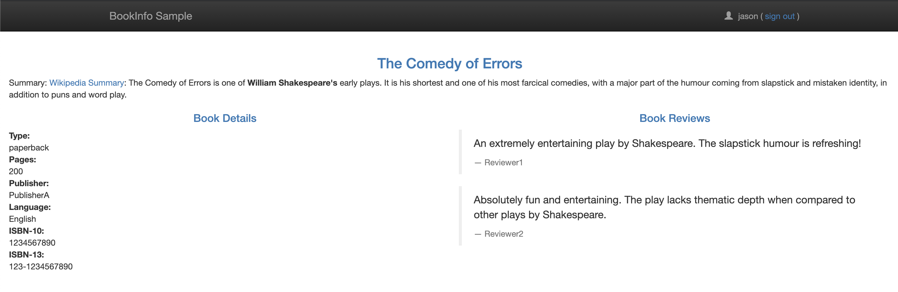

# **第二节 使用 Istio 实现非侵入流量治理**

 Istio 中两个非常重要的流量管理的资源对象：

* `VirtualService`（虚拟服务）：用来在 Istio 中定义路由规则，**控制流量路由到服务上的各种行为**。
* `DestinationRule`（目标规则）：**虚拟服务视定义将流量如何路由到指定目标地址，然后使用目标规则来配置该目标的流量，在评估虚拟服务路由规则之后，目标规则将应用于流量的真实目标地址。**

## **1、VirtualService**

虚拟服务（VirtualService）和目标规则（Destination Rule）是 Istio 流量路由功能的关键对象，**虚拟服务配置如何在 Istio 内将请求路由到服务**，每个虚拟服务包含一组**路由规则**，Istio 会按定义的顺序来评估它们，Istio 将每个指定的请求匹配到虚拟服务指定的实际目标地址。在网格中可以有多个虚拟服务，也可以没有。

使用虚拟服务，你可以为一个或多个主机名指定流量行为，在虚拟服务中使用路由规则，告诉 Envoy 如何发送虚拟服务的流量到合适的目标，路由目标地址可以是同一服务的不同版本，也可以是完全不同的服务。

一个典型的使用场景是将流量发送到指定服务的不同版本。

**客户端会将虚拟服务视为一个单一实体，将请求发送至虚拟服务主机，然后 Envoy 根据虚拟服务规则把流量路由到不同的版本。**

比如把 20% 的流量路由到新版本 或 将这些用户的请求路由到版本 2，可以创建一个金丝雀发布，然后逐步增加发送到新版本服务的流量百分比。

**流量路由完全独立于实例部署，所以实现新版本服务的实例可以根据流量的负载来伸缩，完全不影响流量路由。相比之下，Kubernetes 则只支持基于实例缩放的流量分发，这会更复杂。**

如下所示我们定义一个虚拟服务，根据请求是否来自某个特定用户，把它们路由到服务的不同版本去。

```
apiVersion: networking.istio.io/v1alpha3
kind: VirtualService
metadata:
  name: reviews
spec:
  hosts: # 列出VirtualService的hosts，可以是IP、DNS名称、FQDN或*
  - reviews
  http: # 在下面配置VirtualService的路由规则，指定符合哪些规则的流量打到哪些Destination，支持HTTP/1.1，HTTP2，及gRPC等协议
  - match: # 指定具体的匹配规则
    - headers:
        end-user:
          exact: jason
    route:
    - destination: # 指定满足规则后将流量打到哪个具体的Destination
        host: reviews
        subset: v2
  - route:  # 流量规则按从上到下的优先级去匹配，若不满足上述规则时，进入该默认规则
    - destination:
        host: reviews
        subset: v3
```

我们使用 hosts 字段列举虚拟服务的主机——即用户指定的目标或是路由规则设定的目标，这是客户端向服务发送请求时使用的一个或多个地址。

```
hosts:
- reviews
```

**虚拟服务主机名可以是 IP 地址、DNS 名称，比如 Kubernetes Service 的短名称，隐式或显式地指向一个完全限定域名（FQDN）。**

也可以使用通配符（“*”）前缀，创建一组匹配所有服务的路由规则。虚拟服务的 hosts 字段实际上不必是 Istio 服务注册的一部分，它只是虚拟的目标地址，这样可以为没有路由到网格内部的虚拟主机建模。

然后接着就是路由规则的定义，这里通过 http 字段来定义虚拟服务的路由规则，用来描述匹配条件和路由行为，它们把 HTTP/1.1、HTTP2 和 gRPC 等流量发送到 hosts 字段指定的目标，一条路由规则包含了指定的请求要流向哪个目标地址，可以有0个或多个匹配条件。

**比如上面示例中的第一个路由规则有一个条件，所以使用 match 字段开始定义，我们希望该路由应用于来自 jason 用户的所有请求，所以使用 headers、end-user 和 exact 字段来匹配合适的请求**。

```
- match:
  - headers:
    end-user:
      exact: jason
```

然后后面的 route 部分的 destination 字段指定了符合该条件的流量的实际目标地址，与虚拟服务的 hosts 不同，**destination 的 host 必须是存在于 Istio 服务注册中心的实际目标地址，否则 Envoy 不知道该将请求发送到哪里。**

可以是一个有代理的服务网格，或者是一个通过服务入口被添加进来的非网格服务。本示例运行在 Kubernetes 环境中，host 名为一个 Kubernetes 服务名：

```
route:
- destination:
    host: reviews  # Kubernetes Service 短名称
    subset: v2
```

此外 destination 下面还指定了 Kubernetes 服务的子集，将符合此规则条件的请求转入其中，比如这里我们使用的子集名称是 v2，我们会在目标规则中看到如何定义服务子集。

路由规则是按从上到下的顺序选择的，**虚拟服务中定义的第一条规则有最高优先级**。比如上面我们定义的虚拟服务中，不满足第一个路由规则的流量均会流向一个默认的目标，第二条规则没有配置 match 条件，直接将流量导向 v3 子集。

```
- route:
  - destination:
      host: reviews
      subset: v3
```

一般建议提供一个默认的**无条件或基于权重的规则**作为每一个虚拟服务的最后一条规则，从而确保流经虚拟服务的流量至少能够匹配到一条路由规则。


## **2、DestinationRule**

与虚拟服务一样，DestinationRule（目标规则）也是 Istio 流量路由功能的关键部分，**我们可以将虚拟服务看成将流量如何路由到指定目标地址，然后使用目标规则来配置该目标的流量**。

在评估虚拟服务路由规则之后，目标规则将应用于流量的“真实”目标地址。

可以使用目标规则来指定命名的服务子集，例如按版本为所有指定服务的实例分组，然后可以在虚拟服务的路由规则中使用这些服务子集来控制到服务不同实例的流量。


目标规则还允许你在调用整个目的服务或特定服务子集时定制 Envoy 的流量策略，比如负载均衡模型、TLS 安全模式或熔断器设置

**默认情况下，Istio 使用轮询的负载均衡策略，实例池中的每个实例依次获取请求。**

Istio 同时支持如下的负载均衡模型，可以在 `DestinationRule` 中为流向某个特定服务或服务子集的流量指定这些模型。

* **随机**：请求以随机的方式转到池中的实例。
* **权重**：请求根据指定的百分比转到实例。
* **最少请求**：请求被转到最少被访问的实例。

比如在下面的示例中，目标规则为 my-svc 目标服务配置了 3 个具有不同负载均衡策略的子集：

```
apiVersion: networking.istio.io/v1alpha3
kind: DestinationRule
metadata:
  name: my-destination-rule
spec:
  host: my-svc
  trafficPolicy:
    loadBalancer:
      simple: RANDOM  # 随机的策略
  subsets:
  - name: v1
    labels:
      version: v1
  - name: v2
    labels:
      version: v2
    trafficPolicy:
      loadBalancer:
        simple: ROUND_ROBIN  # 轮询
  - name: v3
    labels:
      version: v3
```

每个子集都是基于一个或多个 labels 定义的，在 Kubernetes 中它是附加到 Pod 这种对象上的键/值对。

除了定义子集之外，目标规则对于所有子集都有默认的流量策略，而对于具体的子集，则可以使用特定于子集的策略来覆盖它。

**上面的示例定义在 subsets 上的默认策略，为 v1 和 v3 子集设置了一个简单的随机负载均衡器，在 v2 策略中，指定了一个轮询负载均衡器。**
 
在对虚拟服务和目标规则有了初步了解后，接下来我们就来对 Bookinfo 服务的访问规则进行修改。

## **3、不同服务版本访问规则**

对 Reviews 服务添加一条路由规则，启用 `samples/bookinfo/networking/virtual-service-reviews-v3.yaml` 定义的 VirtualService 规则，内容如下：

```
apiVersion: networking.istio.io/v1alpha3
kind: VirtualService
metadata:
  name: reviews
spec:
  hosts:
  - reviews
  http:
  - route:
    - destination:
        host: reviews
        subset: v3
```

这样，所有访问 reviews 服务的流量就会被引导到 reviews 服务对应的 subset 为 v3 的 Pod 中。启用这条规则：

```
$ kubectl apply -f  samples/bookinfo/networking/virtual-service-reviews-v3.yaml
virtualservice.networking.istio.io/reviews created
```
然后查看所有的路由规则：


```
$  kubectl get virtualservices
NAME       GATEWAYS               HOSTS         AGE
bookinfo   ["bookinfo-gateway"]   ["*"]         17h
reviews                           ["reviews"]   35s
```

我们可以看到 reviews 的 VirtualService 已经创建成功了，此时我们去刷新应用的页面，发现访问 Reviews 失败了：

 

**这是因为我们还没有创建 `DestinationRule` 对象，`DestinationRule` 对象是 `VirtualService` 路由生效后，配置应用与请求的策略集，用来将 `VirtualService` 中指定的 `subset` 与对应的 `Pod` 关联起来。**

在 `samples/bookinfo/networking/destination-rule-all.yaml `文件中有定义所有该应用中要用到的所有 `DestinationRule` 资源对象，其中有一段就是对 `Reviews` 相关的 `DestinationRule` 的定义:

```
---
apiVersion: networking.istio.io/v1alpha3
kind: DestinationRule
metadata:
  name: reviews
spec:
  host: reviews
  subsets:
  - name: v1
    labels:
      version: v1
  - name: v2
    labels:
      version: v2
  - name: v3
    labels:
      version: v3  # 匹配version=v3标签的Pod
```

**我们可以看到 `DestinationRule`中定义了 `subsets `集合，其中 `labels` 就和我们之前 `Service` 的 `labelselector` 一样是去匹配 Pod 的 labels 标签的，**

比如我们这里 `subsets` 中就包含一个名为 `v3` 的 `subset`，而这个 `subset` 匹配的就是具有 `version=v3` 这个 `label` 标签的` Pod `集合，前面我们创建的 Bookinfo 中也有这个标签的 Pod:

```
$  kubectl get pods -l version=v3
NAME                          READY   STATUS    RESTARTS   AGE
reviews-v3-84779c7bbc-fnqbg   2/2     Running   2          20h
```

这样我们就通过 DestinationRule 将 VirtualService 与 Service 不同的版本关联起来了。现在我们直接创建 DestinationRule 资源：


```
$  kubectl apply -f samples/bookinfo/networking/destination-rule-all.yaml
destinationrule.networking.istio.io/productpage created
destinationrule.networking.istio.io/reviews created
destinationrule.networking.istio.io/ratings created
destinationrule.networking.istio.io/details created
```

创建完成后，我们就可以查看目前我们网格中的 DestinationRules:

```
 $ kubectl get destinationrule
NAME          HOST          AGE
details       details       30s
productpage   productpage   30s
ratings       ratings       30s
reviews       reviews       30s
```

此时再访问应用就成功了，**多次刷新页面发现 Reviews 始终都展示的是 v3 版本（带红色星的）的 Ratings 了，说明我们`VirtualService` 的配置成功了**。

 


## **4、基于权重的服务访问规则**

刚刚我们演示的基于不同服务版本的服务网格的控制，接下来我们来演示下基于权重的服务访问规则的使用。

首先移除刚刚创建的 VirtualService 对象，排除对环境的影响：

```
$  kubectl delete virtualservice reviews
virtualservice.networking.istio.io "reviews" deleted

$ kubectl get virtualservice
NAME       GATEWAYS               HOSTS   AGE
bookinfo   ["bookinfo-gateway"]   ["*"]   18h
```

现在我们再去访问 Bookinfo 应用又回到最初随机访问 Reviews 的情况了。现在我们查看文件 `samples/bookinfo/networking/virtual-service-reviews-80-20.yaml `的定义：

```
apiVersion: networking.istio.io/v1alpha3
kind: VirtualService
metadata:
  name: reviews
spec:
  hosts:
    - reviews
  http:
  - route:
    - destination:
        host: reviews
        subset: v1
      weight: 80
    - destination:
        host: reviews
        subset: v2
      weight: 20
```


这个规则定义了 80% 的对 Reviews 的流量会落入到 v1（没有 Ratings）这个 subset，20% 会落入 v2（带黑色 Ratings）子集，然后我们创建这个资源对象：

```
$  kubectl apply -f samples/bookinfo/networking/virtual-service-reviews-80-20.yaml
virtualservice.networking.istio.io/reviews created

$ kubectl get virtualservice
NAME       GATEWAYS               HOSTS         AGE
bookinfo   ["bookinfo-gateway"]   ["*"]         18h
reviews                           ["reviews"]   6s
```

我们查看当前网格中的 VirtualService 对象，可以看到已经有 reviews 了，证明已经创建成功了，由于上面我们已经将应用中所有的 DestinationRules 都已经创建过了，所以现在我们直接访问应用就可以了，我们多次刷新，可以发现没有出现 Ratings 的次数与出现黑色星 Ratings 的比例大概在4:1左右，并且没有红色星的 Ratings 的情况出现，说明我们配置的基于权重的 VirtualService 访问规则配置生效了。

 

> 80%

 


> 20%


## **5、基于请求内容的服务访问规则**

除了上面基于服务版本和服务权重的方式控制服务访问之外，我们还可以基于请求内容来进行访问控制。

同样，将上面创建的 VirtualService 对象删除：

```
$  kubectl delete virtualservice reviews
virtualservice.networking.istio.io "reviews" deleted

$ kubectl get virtualservice
NAME       GATEWAYS               HOSTS   AGE
bookinfo   ["bookinfo-gateway"]   ["*"]   18h
```

查看文件 `samples/bookinfo/networking/virtual-service-reviews-jason-v2-v3.yaml` 的定义：

```
apiVersion: networking.istio.io/v1alpha3
kind: VirtualService
metadata:
  name: reviews
spec:
  hosts:
  - reviews
  http:
  - match:
    - headers:
        end-user:
          exact: jason
    route:
    - destination:
        host: reviews
        subset: v2
  - route:
    - destination:
        host: reviews
        subset: v3
```

这个 VirtualService 对象定义了对 reviews 服务访问的 match 规则，意思是如果当前请求的 header 中包含 jason 这个用户信息，则只会访问到 v2 的 reviews 这个服务版本，即都带黑星的样式，如果不包含该用户信息，则都直接将流量转发给 v3 这个 reviews 的服务。

我们先不启用这个 VirtualService，先去访问下 Bookinfo 这个应用。

右上角有登录按钮，在没有登录的情况下刷新页面，reviews 服务是被随机访问的，可以看到有带星不带星的样式，点击登录，**在弹窗中 User Name 输入 jason，Password 为空**，登录：

 

 

**再刷新页面，可以看到跟未登录前的访问规则一样，也是随机的**。

现在我们来创建上面的 VirtualService 这个对象:

```
$  kubectl apply -f samples/bookinfo/networking/virtual-service-reviews-80-20.yaml
virtualservice.networking.istio.io/reviews created

$ kubectl get virtualservice
NAME       GATEWAYS               HOSTS         AGE
bookinfo   ["bookinfo-gateway"]   ["*"]         18h
reviews                           ["reviews"]   3s
```

此时再回去刷新页面，发现一直都是黑星的 Reviews 版本(v2)被访问到了，注销退出后再访问，此时又一直是红星的版本(v3)被访问了。


**说明我们基于 `headers->end-user->exact:jason` 的控制规则生效了**。

在 productpage 服务调用 reviews 服务时，登录的情况下会在 header 中带上用户信息，通过 exact 规则匹配到相关信息后，流量被引向了上面配置的 v2 版本中。

这里要说明一下 match 的匹配规则：

```
All conditions inside a single match block have AND semantics, while the list of match blocks have OR semantics. The rule is matched if any one of the match blocks succeed.
```

意思是一个 `match` 块里的条件是需要同时满足才算匹配成功的，如下面是 url 前缀和端口都必须都满足才算成功：

```
- match:
    - uri:
        prefix: "/wpcatalog"
      port: 443
```

多个 match 块之间是只要有一个 match 匹配成功了，就会被路由到它指定的服务版本去，而忽略其他的。我们的示例中在登录的条件下，满足第一个 match，所以服务一直会访问到 v2 版本。退出登录后，没有 match 规则满足匹配，所以就走最后一个 route 规则，即 v3 版本。


