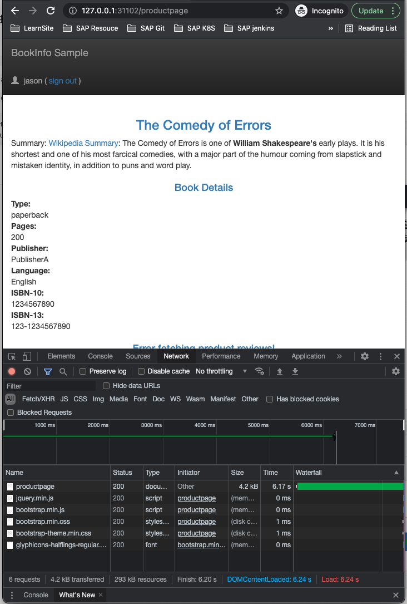
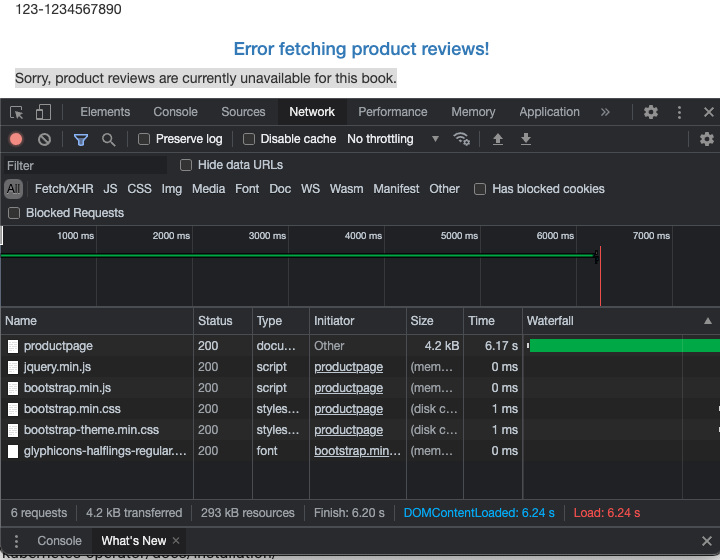
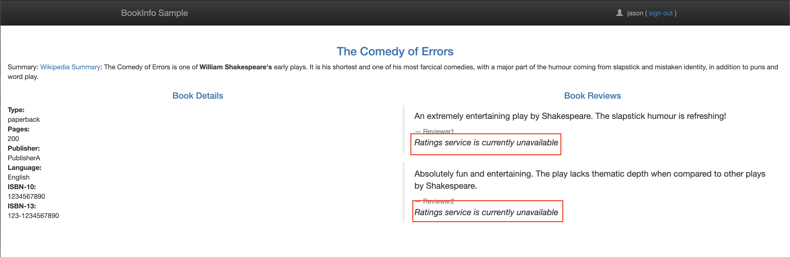
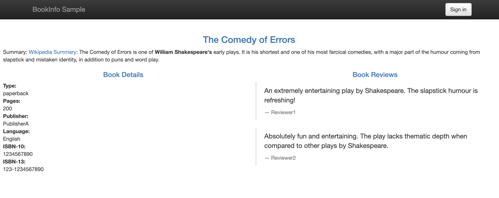

# **第三节 Istio 流量管理之故障注入**

对于一个系统，尤其是一个复杂的系统，重要的不是故障会不会发生，而是什么时候发生。

故障处理对于开发人员和测试人员来说都特别耗费时间和精力：对于开发人员来说，他们在开发代码时需要用20%的时间写80%的主要逻辑，然后留出80%的时间处理各种非正常场景；对于测试人员来说，除了需要用80%的时间写20%的异常测试项，更要用超过80%的时间执行这些异常测试项，并构造各种故障场景，尤其是那种理论上才出现的故障，让人苦不堪言。


**故障注入**是一种评估系统可靠性的有效方法，例如异常处理、故障恢复等。

只有当系统的所有服务都经过故障测试且具备容错能力时，整个应用才健壮可靠。

**故障注入从方法上来说有编译期故障注入和运行期故障注入，前者要通过修改代码来模拟故障，后者在运行阶段触发故障。**

Istio 的故障注入就是在网格中对特定的应用层协议进行故障注入，这样，基于 Istio 的故障注入就可以模拟出应用的故障场景了。

接下来我们就来说明如何注入故障并测试应用程序的弹性。

## **1、延迟故障注入**

为了测试微服务应用程序 Bookinfo 的弹性，我们将为用户 jason 在 `reviews:v2` 和 `ratings` 服务之间注入一个 7 秒的延迟，这个测试将会发现一个故意引入 Bookinfo 应用程序中的 bug。

首先移除之前创建的 VirtualService:

```
$  kubectl delete virtualservice reviews
virtualservice.networking.istio.io "reviews" deleted

$ kubectl get virtualservice
NAME       GATEWAYS               HOSTS   AGE
bookinfo   ["bookinfo-gateway"]   ["*"]   19h
```

为了能够让请求稳定，这里我们对 Reviews 服务配置请求路由，对应的资源清单文件 `samples/bookinfo/networking/virtual-service-reviews-test-v2.yaml`：

```
apiVersion: networking.istio.io/v1alpha3
kind: VirtualService
metadata:
  name: reviews
spec:
  hosts:
    - reviews
  http:
  - match:
    - headers:
        end-user:
          exact: jason
    route:
    - destination:
        host: reviews
        subset: v2
  - route:
    - destination:
        host: reviews
        subset: v1
```

上面的配置应用过后 jason 用户会被路由到 `reviews:v2` 版本服务，其他用户路由到 reviews:v1 版本服务。创建故障注入规则以延迟来自测试用户 jason 的流量，对应的资源清单为 `samples/bookinfo/networking/virtual-service-ratings-test-delay.yaml`：

```
apiVersion: networking.istio.io/v1alpha3
kind: VirtualService
metadata:
  name: ratings
spec:
  hosts:
  - ratings
  http:
  - match:
    - headers:
        end-user:
          exact: jason
    fault:
      delay:
        percentage:
          value: 100.0
        fixedDelay: 7s
    route:
    - destination:
        host: ratings
        subset: v1
  - route:
    - destination:
        host: ratings
        subset: v1
```

这个 VirtualService 定义了一个在 jason 登录的情况下，访问 `ratings` 服务的 `100% ` 的 `7s` 访问延迟。


前面我们知道，Bookinfo 这个示例 productpage 服务调用 reviews，reviews 的不同版本会对 ratings 进行不同的调用，其中 reviews-v1 不调用 ratings，reviews-v2 和 reviews-v3 会调用 ratings，并做不同样式的渲染。

**注意 reviews:v2 服务对 ratings 服务的调用具有 10 秒的硬编码连接超时。因此，尽管引入了 7 秒的延迟，我们仍然期望端到端的流程是没有任何错误的**。

了解这一点后，我们现在来创建上面的 VirtualService 资源对象：

```
$ kubectl apply -f samples/bookinfo/networking/virtual-service-reviews-test-v2.yaml
virtualservice.networking.istio.io/reviews created

$ kubectl apply -f samples/bookinfo/networking/virtual-service-ratings-test-delay.yaml
virtualservice.networking.istio.io/ratings created

$  kubectl get virtualservice
NAME       GATEWAYS               HOSTS         AGE
bookinfo   ["bookinfo-gateway"]   ["*"]         19h
ratings                           ["ratings"]   21s
reviews                           ["reviews"]   66s
```


通过浏览器打开 Bookinfo 应用，使用用户 jason 登录到 `/productpage` 页面。

我们期望的是 Bookinfo 主页在大约 7 秒钟加载完成并且没有错误，但是 Reviews 部分显示了一个错误消息：Sorry, product reviews are currently unavailable for this book.


 

 


而且我们可以看到页面加载实际上用了大约6s，按照预期，我们引入的 7s 延迟不会影响到 reviews 服务，因为 reviews 和 ratings 服务间的超时被硬编码为 10 秒，但实际上在 productpage 和 reviews 服务之间也有一个 3s 的硬编码的超时，再加 1 次重试，一共 6s，所以 productpage 对 reviews 的调用在 6s 后提前超时并抛出错误了。


这种类型的错误在不同的团队独立开发不同的微服务的企业应用程序中是可能会出现的，Istio 的故障注入规则可以帮助我们识别此类异常，而不会影响最终用户。

> 请注意，此次故障注入限制为仅影响用户 jason，如果你以任何其他用户身份登录，则不会遇到任何延迟。

我们可以增加 productpage 与 reviews 服务之间的超时或降低 reviews 与 ratings 的超时来解决这个问题，在 reviews 服务的 v3 版本中已经修复了这个问题，`reviews:v3` 服务已将 `reviews` 与 `ratings` 的超时时间从 10s 降低为 2.5s，因此它可以兼容（小于）下游的 productpage 的请求。

如果我们将上面 Reviews 的流量转移到 `reviews:v3` 服务，然后可以尝试修改延迟规则为任何低于 2.5s 的数值，例如 2s，然后可以确认端到端的流程没有任何错误。

通过这种超时故障注入，可以帮助我们方便地发现服务间相互访问中存在的潜在问题。


## **2、中断访问故障注入**

测试微服务弹性的另一种方法是引入 HTTP abort 故障，接下来我们将给 ratings 微服务为测试用户 jason 引入一个 HTTP abort。在这种情况下，我们希望页面能够立即加载，同时显示 `Ratings service is currently unavailable `这样的消息。

这里我们需要使用到的资源清单文件为 `samples/bookinfo/networking/virtual-service-ratings-test-abort.yaml`：

```
apiVersion: networking.istio.io/v1alpha3
kind: VirtualService
metadata:
  name: ratings
spec:
  hosts:
  - ratings
  http:
  - match:
    - headers:
        end-user:
          exact: jason
    fault:
      abort:
        percentage:
          value: 100.0
        httpStatus: 500
    route:
    - destination:
        host: ratings
        subset: v1
  - route:
    - destination:
        host: ratings
        subset: v1
```

上面这个 VirtualService 资源对象配置了在 jason 登录时，reviews 对 ratings 访问时 100% 的返回一个500错误响应。然后创建这个资源对象：

```
$ kubectl apply -f samples/bookinfo/networking/virtual-service-ratings-test-abort.yaml
virtualservice.networking.istio.io/ratings configured

$ kubectl get virtualservice
NAME       GATEWAYS               HOSTS         AGE
bookinfo   ["bookinfo-gateway"]   ["*"]         19h
ratings                           ["ratings"]   10m
reviews                           ["reviews"]   11m
```

现在我们回到 BookInfo 应用，登录 jason，刷新页面，有时候可以很快就看到 Rating 服务不可用的提示信息：


 

如果注销用户 jason，我们将看到 `/productpage` 为除 `jason` 以外的其他用户调用了 `reviews:v1`（完全不调用 ratings），因此，不会看到任何错误消息，不会显示星标的图形。

 