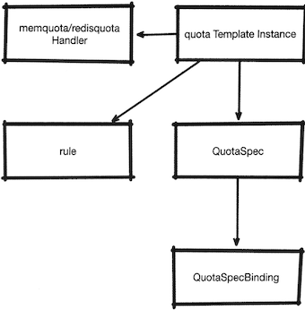

# **第十四节 Mixer 适配器的应用**

## **1、 使用`MemQuota`适配器进行服务限流** 

<mark>网格内部的服务间调用，**因为存在业务优先级、资源分配及服务负载能力等要求**，所以常常需要对特定的服务调用进行限制，防止服务过载。</mark>

 
在`Istio`中，我们可以利用`Mixer`的`MemQuota`或`RedisQuota`适配器，在预检段对流量进行配额判断，**根据为特定流量设定的额度规则来判断流量请求是否已经超过指定的额度（简称超额），如果发生超额，就进行限流处理**。
 
在`Istio`的限流功能实现中，配置工作分为`客户端`和`Mixer`端两部分：

* 客户端使用`QuotaSpec`定义一个限额，用`QuotaSpecBinding`对象将`QuotaSpec`绑定到特定的服务上；
* `Mixer`：端需要处理限额的实现逻辑，用一个`quota`实例定义流量处理规则,用`MemQuota/RedisQuota`的`Handler`来实际处理流量，最后使用`Rule`对象将二者进行绑定： 

本节依然会使用`sleep`服务作为客户端，并使用`httpbin`作为服务端。 


### **1-1 `Mixer`对象的定义** 

**在限流过程中用到的服务端对象并无特别，和所有的`Mixer`适配器应用一样， <mark>由`Handler`, `Instance`结合`Rule`，这二种对象一起定义这一行为。</mark> **

* **首先定义一个`MemQuota`类型的`Handler`，通过它来定义`MemQuota`适配器的行为**

这里首先定义了默认的限流规定，每秒最多调用`20`次，然后通过`overrides`的方式为`httpbin`服务定义一个限流，每`5`秒只能调用一次： 

**`memquota-handler.yaml`**

```
apiVersion: "config.istio.io/v1alpha2" 
kind: memquota 
metadata: 
  name: handler 
spec: 
  quotas: 
  - name: dent-quota.quota.default 
    maxAmount: 20 
    validDuration: 10s 
    overrides: 
    - dimensions: 
        destination: httpbin 
      maxAmount: 1 
      validDuration : 5s 
```
```
$ kubectl apply -f memquota-handler.yaml 
memquota.config.istio.io/handler created
```

把上述文件命名为`memquota-handler.yaml`，并提交到`Kubernetes`集群。 这里定义了一个每`10`秒调用`20`次的默认调用配额，又为`httpbin`服务定义了一个特例: 每`5`秒只允许调用一次。 

* **接下来需要定义的是基于`Quota`模板的`Instance`对象：** 

**`quota-instance.yaml`**

```
apiVersion: "config.istio.io/v1alpha2" 
kind: quota 
metadata: 
  name: dest-quota 
spec: 
  dimensions: 
    destination: destination.labels["app"] | destination.service | "unknown" 
```
```
$ kubectl apply -f quota-instance.yaml 
quota.config.istio.io/dest-quota created
```

把代码保存为`quota-instance.yaml`，并提交到`Kubernetes`集群。

这里为`quota`模板定义了一个输入项`demensions`，其中包含对服务目标的定义。

对`destination`字段的定义是一个属性表达式，其取值逻辑是：

* 首先判断流量目标是否具有`app`标签，
* 如果没有，则获取目标服务的名称，否则取值为`“unknown"`。 

* **接下来使用一个`Rule`对象将两者关联起来**： 

`quota-rule.yaml`

```
apiVersion: config.istio.io/v1alpha2 
kind: rule 
metadata: 
  name: quota 
spec: 
  actions: 
  - handler: handler.memquota 
    instances: 
    - dest-quota.quota 
```

```
$ kubectl apply -f quota-rule.yaml 
rule.config.istio.io/quota created
```

同样，将代码保存为：`quota-rule.yaml`，并使用`kubectl apply`命令提交到`Kubernetes`集群。 

**这样就完成了对`Mixer`端三个对象的定义，三个对象联合起来完成任务：**

* **`Rule` 对象负责识别流量，对符合条件并进入该`Rule`对象处理流程的流量**，
* **使用`dest-quota`进行处理，将处理结果输出给`MemQuota`适配器的`Handler`对象进行判断**

### **1-2 客户端对象定义** 

`Mixer`端已经定义了**配额方式**和**处理方式**，而客户端的配置需要定义两个内容： 

**受限的应用和配额的扣减方式，需要用`QuotaSpec`和`QuotaSpecBinding`对象来完成**： 

创建一个`QuotaSpec`对象： 

**`quotaspec.yaml`**

```
apiVersion: config.istio.io/v1alpha2 
kind: QuotaSpec 
metadata: 
  name: request-count 
spec: 
  rules: 
  - quotas: 
    - charge: 5 
      quota: dest-quota 
```
```
$ kubectl apply -f quotaspec.yaml 
quotaspec.config.istio.io/request-count created
```

把上述代码保存为`quotaspec.yaml`，使用`kubectl apply`提交到`Kubernetes`集群。 

这里定义了一个`quota`扣减方式，其中的`quota`对应的是创建的`dest-quota` 

然后定义`QuotaSpecBindng`对象，把`QuotaSpec`绑定到服务上： 

**`quotaspec-binding.yaml`**

```
apiVersion: config.istio.io/v1alpha2 
kind: QuotaSpecBinding 
metadata: 
  name: spec-sleep 
spec: 
  quotaSpecs: 
  - name: request-count 
    namespace: default 
  services: 
  - name: httpbin 
    namespace: default 
```
```
$ kubectl apply -f quotaspec-binding.yaml
quotaspecbinding.config.istio.io/spec-sleep created
```


### **1-3 测试限流功能**

在相关的`5`个对象都创建成功后，就可以进行测试了： 

```
$ kubectl exec sleep-v1-548d87cc5c-92lqk -it bash -c sleep

bash-4.4# for i in 'seq 10';do http --body http://httpbin:8000/ip; done
{
    "origin": "127.0.0.1"
}

RESOURCE EXHAUSTED:Quota is exhausted for: dest-quota 
```

可以看到，这里连续调用了`httpbin`服务，并返回了超额错误。 


下面尝试调用`flaskapp`服务： 

```
bash-4.4# for i in 'seq 10'; do  http --body http://flaskapp/env/version; done
v2
```
发现`flaskapp`并未受到影响


### **1-4 注意事项**

通过上面的尝试肯定有不少读者会想：这太复杂了而且对象之间的引用太混乱



同时、对服务身份的绑定关系也散乱在三个不同的对象中。

甚至到目前为止`QuotaSpec`和`QcotaSpecBinding`还没有提供`Reference`笔者推测这部分发生变化的 可能性非常大, **强烈建议不要采用**


## **2、 使用`RedisQuota`适配器进行服务限流** 

`MemQuota`适配器限流，是一种实验性质的做法，它仅支持固定窗口的限流算法， 并且在`Mixer`是多副本的运行状态下内存计数会完全失效, 必须提供一个独立于`Mixer`进程之外的后端服务来提供数据支持, 目前官方建议在生产环境中使用`RedisQuota`对象进行限流.

其整体环节和`MemQuota`流的流程是一致, 的只不过其中的`MemQuota Handler`要更换为`Redis`版本还需要一个用于提供数据后端的`Redis`应用。 


### **2-1 启动`Redis`服务**

首先我们做一下准备工作启用一个`Redis`服务器来支持限流操作，这里为了方便起见，先在`Kubernetes`集群中启动一个单实例服务来完成功能展示。 


这里选择使用`Redis`的官方镜像, 创建一个单实例的`Deployment`和对应的`Service`: 


```
apiVersion: v1
kind: ReplicationController
metadata:
  name: redis
  labels:
    name: redis
spec:
  replicas: 1
  selector:
    name: redis
  template:
    metadata:
      labels:
        name: redis
    spec:
      containers:
      - name: redis
        image: k8s.gcr.io/redis:v1
        ports:
        - containerPort: 6379
---
apiVersion: v1
kind: Service
metadata:
    name: redis
    labels:
      name: redis
spec:
  ports:
    - port: 6379
      targetPort: 6379
  selector:
    name: redis
```

将上述文件保存为`redis.yaml`，并使用`kubectl apply`命令提交到`Kubernetes`集群`RC`在启动之后，会在`6379`端口开放一个`Redis`服务。 

### **2-2 定义限流相关对象** 

两种限流方式的对象定义格式基本是一致的，区别仅在于`RedisQuota`的定义要比`MemQuota`的定义细致一些。 

这里首先定义`RedisQuota`: 

**`redisquota.yaml`**

```
apiVersion: "config.istio.io/v1alpha2" 
kind: redisquota 
metadata: 
  name: handler 
spec: 
  redisServerUrl: "10.245.90.154:6379" 
  quotas:
  - name: dest-quota.quota.default 
  maxAmount: 20 
  bucketDuration: 1s 
  validDuration: 10s 
  rateLimitAlgorithm: ROLLING_WINDOW 
  overrides: 
  - dimensions: 
      destination: httpbin 
    maxAmount: 1 
```

```
$ kubectl apply -f redisquota.yaml 
redisquota.config.istio.io/handler created
```

将上述代码保存为`redisquota.yaml`，并使用`kubectl apply`命令提交到集群。 

* `redisServerUrl`：用于指定`Redis`服务的地址。
* `quota.bucketDuratio`n：必须设置为一个大于零的秒数。 
* `quota.rateLimitAlgorithm`：可以为每个`Quota`指定各自的限流算法，在`MemQuota`中采用的是`FIXED_ WINDOW算`法，且不可更改。 
* `overrides.validDuration`：该字段无法继续使用。 

**`redis-rule.yaml`**

```
apiVersion: "config.istio.io/v1alpha2" 
kind: rule
metadata: 
  name: quota
spec: 
  actions:
  - handler: handler.redisquota
    instances:
      - dest-quota.quota
```

```
$ kubectl apply -f redis-rule.yaml 
rule.config.istio.io/quota unchanged
```

```
$ kubectl apply -f quotaspec.yaml 
quotaspec.config.istio.io/request-count created

$ kubectl apply -f quotaspec-binding.yaml 
quotaspecbinding.config.istio.io/spec-sleep created
```

### **2-3 测试限流功能**

```
$ kubectl exec sleep-v1-548d87cc5c-92lqk -it bash -c sleep
bash-4.4# for i in 'seq 10'; do  http --body http://httpbin:8000/ip; done
 
RESOURCE_EXHAUSTED:Quota is exhausted for. dest-quota 

{
    "origin": "127.0.0.1"
}
RESOURCE_EXHAUSTED:Quota is exhausted for. dest-quota 
```

可以看到，和`MemQuota`一样，限流已经生效，调用失败。 

