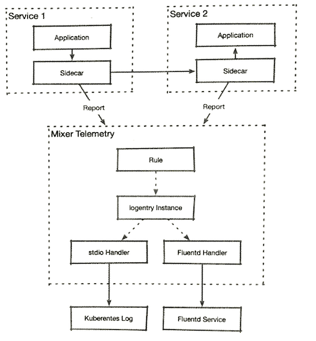

# **第十六节 使用`stdio`输出自定义日志**

**平台及运行在平台之上的应用都会有各自的日志输出**, 例如，`Kubernetes`中常见的一种方案如图所示。 


其中

* 业务应用将日志输出到容器自身的`stdio`设备上； 
* 容器引擎将`Pod`的`stdio`映射到所在节点的文件系统中； 
* `Fluentd`等日志抓取工具`mount`的方式加载节点文件系统； 
* 日志抓取工具在处理原始日志之后将其发送给`Elasticsearch`

那么，为什么`Mixer`：还要提供额外的日志能力？
 
有时我们可能需要根据通信内容做一些跨服务的日志记录，这种需求可能是临提出的，也可能是调试需要的，过去往往需要通过对应用的代码进行修改或者重新配置来完成；

而`Istio`可以在不影响应用运行的情况下，通过`Mixer`组件．使用`logentry`模板结合`std io`或者`Fluentd`适配器来完成这一任务




1. **网格内部的应用在通过`Sidecar`进行互访的时候, `Sidecar`会发出报告给`Mixer Telemetry`,其中包含大量的与本次通信相关的信息**。
2. **`Mixer Telemetry Pod`在接收到这些信息之后，会查询已注册的`Rule`对象，如果有符合`match`要求的流量．则会将流量信息转发给`Rule`对象的`logentry Instance`进行处理**
3. 处理后产生的标准数据会 交由`stdio`适配器直接显示在`Mixer Telemetry`的`stdio`设备上，可以被`Kebernetes`的标准日志采集方式所获取，
4. 或者由`Fluentd`适配器提交给`Flutend`进程进行后续的采集过程 


## **1、默认的访问日志** 

**`istio`默认在安装时提供`accesslog`和`tcpaccesslog`两个`logentry`实例**，我们可以观察`accesslog`的配置方法： 

```
$ kubectl get logentry -n istio-system
NAME           SEVERITY   TIMESTAMP                                         RES TYPE   AGE
accesslog      "Info"     request.time                                      "global"   16d
tcpaccesslog   "Info"     context.time |timestamp("2017-01-01T00:00:00Z")   "global"   16d
```

```
$ kubectl get logentry -n istio-system accesslog -oyaml

apiVersion: config.istio.io/v1alpha2
kind: logentry
metadata:
  annotations:
  ...
  name: accesslog
  namespace: istio-system
  ...
spec:
  monitored_resource_type: '"global"'
  severity: '"Info"'
  timestamp: request.time
  variables:
  	  apiClaims: request.auth.raw_claims | ""
    apiKey: request.api_key | request.headers["x-api-key"] | ""
    clientTraceId: request.headers["x-client-trace-id"] | "
    ...
```

可以看出，这里定义了一个访问日志的结构，其中除了常见的日志级别、时间戳，还用`variables`字段定义了一组复杂的数据结构。 

再来看看`stdio`的适配器配置： 
 
```
$ kubectl get handler stdio  -n istio-system -oyaml
apiVersion: config.istio.io/v1alpha2
kind: handler
metadata:
  annotations:
  ...
  creationTimestamp: "2019-10-18T09:23:04Z"
  generation: 1
  labels:
    app: mixer
    chart: mixer
    heritage: Tiller
    release: istio
  name: stdio
  namespace: istio-system
  resourceVersion: "39273"
  selfLink: /apis/config.istio.io/v1alpha2/namespaces/istio-system/handlers/stdio
  uid: 2a398bff-838d-44c1-9bfa-248b68a46033
spec:
  compiledAdapter: stdio
  params:
    outputAsJson: true
```
 
```
$ kubectl get rule  stdio  -n istio-system -oyaml
apiVersion: config.istio.io/v1alpha2
kind: rule
metadata:
  annotations:
  ...
  creationTimestamp: "2019-10-18T09:23:04Z"
  generation: 1
  labels:
    app: mixer
    chart: mixer
    heritage: Tiller
    release: istio
  name: stdio
  namespace: istio-system
  resourceVersion: "39277"
  selfLink: /apis/config.istio.io/v1alpha2/namespaces/istio-system/rules/stdio
  uid: c3236133-8dfa-46c8-a9d4-e5d1b060ed52
spec:
  actions:
  - handler: stdio
    instances:
    - accesslog.logentry
  match: context.protocol == "http" || context.protocol == "grpc"
```

**这个对象使用通信协议作为过滤标准，如果通信协议是`HTTP`或者`GRPC`，则使用`accesslog`进行处理，最后传递给`stdio`适配器，并输出到`Mixer`的`stdio`设备中**。 

## **2、 定义日志对象**
 
有了自定义日志条目的能力我们就可以专门为`sleep`服务对其他服务的访问设置一条日志, 记录其所有外发请求

首先定义一个`logentry`模板的实例 

```
apiVersion: config.istio.io/v1alpha2 
kind: logentry
metadata: 
  name: sleep-log 
spec:
  monitored_resource_type: '"global"' 
  severity: '"Info"'
  timestamp: "request.time" 
  variables: 
    destinationApp: destination.labels["app"] | "" 
    dentinationIp: destination.ip | ip("0.0.0.0") 
    destinationName: destination.name | "" 
    destinationNamespace: destination.namespace | ""
    destinationWorkload: destination.workload.name | "" 
    message: "Extra log" 
```

```
$ kubectl apply -f logentry.yaml 
logentry.config.istio.io/sleep-log created


$ kubectl get logentry
NAME        SEVERITY   TIMESTAMP      RES TYPE   AGE
sleep-log   "Info"     request.time   "global"   10s
```

**这里定义了一个`longentry`对象其中描述的是一个日志条目，包含了调用时间，日志级别及一系**列目标信息的相关变量将其保存为`logentry.yaml`井提交到 `Kubernetes`集群

然后定义一个`stdio`适配器的`Handler`指定`JSON`格式输出 

```
apiVersion: config.istio.io/v1alpha2
kind: stdio
metadata:
  name: handler
spec:
  outputAsJson: true
```

**`handler.yaml`**

```
kubectl apply -f handler.yaml 
handler.config.istio.io/handler created

$ kubectl get handler
NAME      AGE
handler   11s
```

最后定义一个`Rule`对象，加入对`sleep`应用的条件限制，并把新建立的`Handler` 和`Instance`进行绑定： 

```
apiVersion: config.istio.io/v1alpha2 
kind: rule 
metadata: 
  name: stdio 
spec: 
  actions:
  - handler: handler.stdio 
    instances: 
    - sleep-log.logentry
  match: context.protocol == "http" && sourceLabel["app"] == "sleep" 
```

```
$ kubectl apply -f rule.yaml 
rule.config.istio.io/stdio created

$ kubectl get rule 
NAME    AGE
quota   21h
stdio   18s
```

## **3、 测试输出** 

接下来验证日志是否能够成功输出： 

### **3-1 Source `sleep-v1`:**

```
kubectl exec sleep-v1-548d87cc5c-92lqk -it bash -c sleep
bash-4.4#  wrk http://httpbin:8000/ip
Running 10s test @ http://httpbin:8000/ip
  2 threads and 10 connections
  Thread Stats   Avg      Stdev     Max   +/- Stdev
    Latency    12.66ms    8.37ms  63.15ms   80.17%
    Req/Sec   416.32     96.02   653.00     71.72%
  8324 requests in 10.06s, 2.04MB read
Requests/sec:    827.12
Transfer/sec:    207.86KB
```

使用`grep`过滤，查看 `itsio-telemetry`中的日志： 

### **3-2 Destination `itsio-telemetry`:**

```
$ kubectl get pod -n istio-system | grep istio-telemetry
istio-telemetry-7d7845478d-d2h5f           2/2     Running     1          5d1h

$ kubectl logs -n  istio-system istio-telemetry-7d7845478d-d2h5f -c mixer | grep sleep-log
...... 
{"level" : "info", "time" : "2018-12-23T19:05: 06.897249Z", "instance":"sleep -log.logentry.default", "destinationApp":"httpbin", "destinationIp" : "10.244.4 7,9", "destinationName" :"httpbin-f455f64c4-k4c6x", "destinationNamespace" : "default", "destinationWorkload" : "httpbin" 
} 
{"level" : "info", "time" : "2018-12-23T19:05:06.898289Z", "instance" : "sleep 
-log. logentry . default" "destinationApp" : "httpbin", "destinationIp" : "10.244.4 7.9", "destinationName" ."httpbin-f455f64c4-k4c6x", "destinationNamespace" : "de fault", "destinationWorkload" : "httpbin"} 
...
```

可以看到，日志在`Mixer telemetry Po`d中按照我们定义的模板完成了输出。如果在集群中配置了容器日志采集，则这部分日志也会被识别和采集。 

