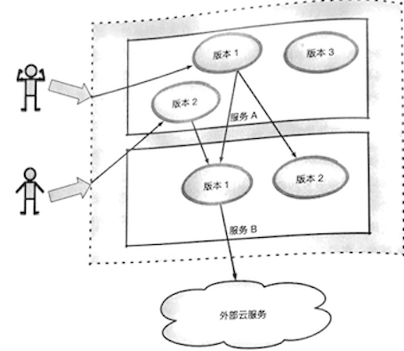

# **第一节 服务网格的基本特征**

Buoyant公司的CEO William,曾经给出对服务网格的定义：

服务网格是一个独立的基础设施层，用来处理服务之间的通信。

现代的云原生应用是由各种复杂技术构建的服务组成的，服务网格负责在这些组成部分之间进行可靠的请求传递。目前 典型的服务网格通常提供了一组轻量级的网络代理，这些代理会在应用无感知的情况下，同应用并行部署、运行。 

这里将Istio的特性总结如下。

* **连接**：对网格内部的服务之间的调用所产生的流量进行智能管理，并以此为基础，为微服务的部署、测试和升级等操作提供有力保障
* **安全**：为网格内部的服务之间的调用提供认证、加密和鉴权支持，在不侵人 代码的情况下，加固现有服务，提高其安全性。 
* **策略**：在控制面定制策略，并在服务中实施。
* **观察**：对服务之间的调用进行跟踪和测量，获取服务的状态信息。 

下面对这些特性展开详细描述。 

## **1.连接** 

微服务错综复杂，要完成其业务目标，连接问题是首要问题。连接存在于所有 服务的整个生命周期中，用于维持服务的运行，算得上重中之重。 

相对于传统的单体应用，**微服务的端点数量会急剧增加**，现代的应用系统在部分或者全部生命周期中，都存在同一服务的不同版本，为不同的客户、场景或者业务提供不同的服务。

同时，同一服务的不同版本也可能有不同的访问要求，甚至产 生了在生产环境中进行测试的新方法论。错综复杂的服务关系对所有相关分工来说 都是很严峻的考验。针对目前的常见业务形态，这里画一个简单的示意图来描述`Service Mesh`的连接功能

如图所示，**从不同的外部用户的角度来看，他们访问的都是同一服务端口， 但实际上会因为不同的用户识别，分别访问服务A的不同版本**；在网格内部，服务A的版本1可能会访问服务B的两个版本，服务A的版本2则只会访问服务B的版本1；服务B的版本1需要访问外部的云服务，版本2则无此需求。 

在这个简化的模型中，包含了以下诉求： 

* 网格内部的调用（服务A	`->` 服务B)
* 出站连接（服务B`一>`外部云服务）
* **入站连接（用户`->`服务A);**
* **流量分割（服务A的版本1分别调用了服务B的版本1和版本2);**
* 按调用方的服务版本进行路由； 
* 按用户身份进行路由。 

这里除了这些问题，还存在一些潜在需求．如下所述。 

* (1) 在网格内的服务之间如何根据实际需要对服务间的调用进行路由、条件可能包括：
   * 调用源和目的的服务
   * 调用内容； 
   * 认证身份

* (2) 如何应对网络故障或者服务故降。 
* (3）如何处理不同服务不同版本之问的关系。 
* (4）怎样对出站连接进行控制。 
* (5）怎样接收入站连接来启动后续的整个服务链条

这些当然不是问题的全部，其中，与流量相关的问题还引发了几个关键的功能需求，如下所述。

* (1)**服务注册和发现**：要求能够对网格中不同的服务和不同版进行准确标识，不同的服务可以经由同一注册机构使用公认的方式互相查找。 
* (2)**负载均衡策**：不同类型的服务应该由不同的策略来满足不同的需求
* (3)**服务流量特征**： 在服务注册发现的基础上，根据双方的服务身份，以及服务流量特征来调用过程惊醒甄别
* (4)**动态流量分配**： 根据对流量特征的识别，在不同的服务和版本之间对流量进行引导

连接是服务网格应用过程中从无到有的最重要的一个环节

## **2.安全**

安全也是一个常谈常新的话题在过去私有基础设施结合单应用的环境下，这一问题并不突出，然而进人容器云时代之后，以下问题出现 

* 有大量容器漂浮在容器云中 ，采用传统的网络策略应对这种浮动的应用比较吃力的。 
* 在由不同的语言、平台所实现的微服务之间，实施一致的访问控制也经常会因为实现的不一致而困难重重。 
* 如果是共享集群，则服务的认证和加密变得尤为重要，例如： 
  * 服务之间的通信要防止被其他服务监听
  * 只有提供有效身份的客户端才可以访问指定的服务
  * 服务之间的互访应该提供更细粒度的控制功能

总之，要提供网格内部的安全保障，就应具备服务通信加密、服务身份询， 服务访问控制（授权和鉴权）功能。 

上述功能通常需要数字证书的支持，这就隐藏了对`CA`的需求，即需要完成证书的签发、传播和更新业务。 

除了上述核心要求，还存在对认证失败的处理、外部证书（统一CA）的接口等相关支撑内容。 

## **3.策略**

除了前面提到的安全问题，在由微服务构成的网格中，我们常常还需要进行一些控制，例如对调用频率的限制、对服务互访的控制，以及针对流量的一些限制和变更能力等。 **在`Istio`中使用`Mixer`作为策略的执行者，`Envoy的`每次调用，在逻辑上都会通过`Mixer`进行事先预检和事后报告，这样`Mixer`就拥有了对流量的部分控制能力**； 在Istio。中还有为数众多的内部适配器及进程外适配器，可以和外部软件设施一同完 成策略的制定和执行。 

## **4.观察** 

随着服务数量的增加，监控和跟踪需求自然水涨船高。在很多情况下，可观察 的保障都是系统功能的重要组成部分，是系统运维功能的重要保障。 

随着廉价服务器（相对于传统小型机）的数量越来越多，服务器发生故障的频率也越来越高，人们开始对`Cattle vs. Cat`产生争论：我们应该将服务器视为家畜还是宠物？家畜的特点是有功能、无个性、可替换；而宠物的特点是有功能、有个性、难替换。 

**我们越来越倾向于将服务器视为无个性、可替换的基础设施，如果主机发生故障，那么直接将其替换即可**；并且，我们更加关注的是服务的总体质量。因此，微服务系统监控，除了有传统的主机监控，还更加重视高层次的服务健康监控。
 
服务的健康情况往往不是非黑即白的离散值，而是一系列连续状态，例如我们经常需要关注服务的调用**成功率、响应时间、调用量、传输量等表现**：

而且，面对数量众多的服务，我们应该能对各种级别和层次的指标进行采样、采集及汇总，获取较为精密、翔实的运行数据，最终通过一定的方法进行归纳总结和展示。 
 
与此同时，服务网格还应提供分布式跟踪(	`Distributed Tracing`）功能对服务的调用链路进行跟踪。 

