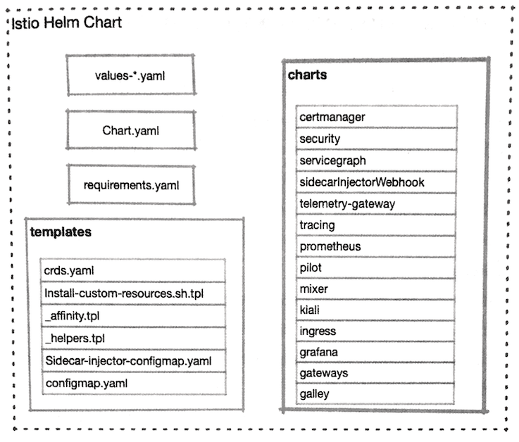

# **第四节 用`Helm`部署`Istio`** 

`Istio` 是由多个组件构成的，井且可以通过 `kubectl` 命令在`Kubernetes`集群上进行部署，部署时会在`Kubernetes`集群上创建大量的对象。`Istio`与`Kubernetes`进行了深度集成，构成`Istio`的各个组件都以`Deployment` 的形式在`Kubernetes`集群中运行，并且其在运行过程中所需的配置数据也需要依赖各种`CRD`及`ConfigMap`、 `Secret`等来进行存储。这种包含复杂依赖关系的应用部署 过程，需要由功能足够强大的模板系统提供支持，因此`Istio`官方推荐使用`Helm`对`Istio`进行部署。
 
本章将会较为详细地对一`Istio`的`Helm Chart`部署方式进行讲解。

## **1、Istio Chart概述**

`Helm`是目前`Istio`官方推荐的安装方式。除去安装后，我们还可以对输人值进行一些调整，完成对`Istio`的部分配置T作。`Istio Chart`是一个总分结构，其分级结构和设计结构是一致的.

`Istio`中`Chart`的分级结构和目录结构是对等的，下面进行简要说明。 

### **1-1 Chart.yaml** 

该文件是`Chart`的基础信息文件，其中包含版本号、名称、关键字等元数据信息。 



### **1-2 `values一*.yaml`**

在`Istio`的发行包中包含一组`values`文件，提供`Istio`在各种场景下的关键配置范本，这些范本文件可以作为`Helm`的输入文件，来对`Istio`进行典型定制。对`Istio`的定制可以从对这些输人文件的改写开始，在改写完成后使用`helm template`命令生成最终的部署文件，这样就能用`kubectl`完成部署了。

* 下面列举这些典型输人文件的作用。`values_istio_auth-galley.yaml`：启用控制面`mTLS`,默认打开网格内部的`mTLS`, 启用`Galley` 
* `values-istio-multicluster.yaml`：多集群配置。 
* `values-istio-auth-multicluster.yaml`：多集群配置，启用控制面`mTLS`，默认打开网格内部的`mTLS`禁用自签署证书 。
* `values-isito-demo-auth.yml`: 启用控制面`mTLS`默认打开网格内部的`mTLs`
* `values-istio-auth.yaml`: 启用控制面`mTLS`默认打开网格内部的`Grafana`, `Jaeger` `ServiceGraph` 及`Galley`,允许自动注入
* `values-istio-galley.yaml`: 启用`Galley`和`Prometheus`
* `values-istio-gateways.yaml`: 这是一个样例可以用这种形式定义新的`Gateway`。
* `values-istio-one-namespace.yaml`: 单命名空间部署, 默认打开网格内部的`mTLS`
* `values-istio-one-namespace-auth.yaml`: 单命名空间部署， 启用控制面`mTLS` 
* `values.yaml`: 罗列了绝大多数常用变量，也是我们做定制的基础 


### **1-3 `requirements.yaml`** 

该文件用于管理对子`Chart`的依赖关系，其中定义了一系列开关变量。 

在`Helm`的输人内容中对相关变量进行定义，就可以对`Istio`的部署文件进行修改，来控制对应组件的启用状态。例如，其中有一段对`Grafana`的控制代码： 


```
- name: grafana 
  version: 1.0.3 
  condition:grafana.enabled
```
 
这段控制代码代表：如果修改全局变量`grafana.enabled`为`False`,就不会安装`Grafana`了。 

### **1-4 `template/_affinity.tpl`** 

**该文件会生成一组节点亲和或互斥元素，供各个组件在渲染YAML时使用该文件里使用了一系列变量，用于控制`Istio`组件的节点亲和性**（也就是限制在部署时对节点的选择。

在模板中引用了全局变量`arch`，默认内容是： 

```
arch: 
 amd64:2 
 s390x:2 
 ppc64le:2 
```

这里定义如下两个局部模板： 

* `nodeAffinityRequiredDuringScheduling`：会根据全局变量中的`arch`参数对部署节点进行限制。`Istio`组件的`Pod`会根据`arch`参数中的服务器类型列表来决定是否部署到某一台服务器上，并根据各种服务器类型的不同权重来决定优先级。 
* `nodeAffinityPreferredDuringScheduling`：跟上一个变量的作用类似，不同的是，这一个软限制。 


接下来会使用在上面定义的两个模板生成新模板，将其命名为`nodeaffinity`，并提供给其他组件引用，用于生成各个组件`Deployment`对象的节点亲和性限制。 

### **1-5 `templates/sidecar-injector-configmap.yaml`**
 
**根据文件名就可以判断出来，该文件最终会用于生成一个`ConfigMap`对象，在该对象中保存的配置数据被用于进行`Sidecar`注入。**

`istioctl`完成的手工注人，或者 `Istioctl` 的自动注人，都会引用这个`ConfigMap`，换句话说，如果希望修改`Istio`的`Sidecar`的注人过程及具体行为，就可以从该文件或者对应的`ConfigMap`人手了。 

### **1-6 `templates/configmap.yaml`**
 
该文件也会生成一个`ConfigMap`，名称为`istio`，这个对象用于为`Pilot`提供启动配置数据。 

### **1-7 `templates/crds.yaml`**
 
该文件包含了`Istio`所需的`CRD`定义，它的部署方式较为特殊： 

* 如果使用`Helm 2.10`之前的版本进行安装，则需要先使用`kubectl`提交该文件到`Kubernetes`集群中； 
* 如果使用`Helm 2.10`之后的版本，则其中的`Helm hook`会自动提前安装，无须特别注意。 

### **1-8 `charts`**
 
这个目录中的子目录就是`Istio`的组件，如下所述。 

* `certrnanager`：一个基于`Jetstack Cert-Manager`项目的`ACME`证书客户端，用于自动进行证书的申请、获取及分发。 
* `galley`: **`Istio`利用`Galley`进行配置管理工作**。
* `gateways`：**对`Gateways Chart`进行配置，可以安装多个`Gateway Controller`,**
* `grafana`：图形化的`Istio Dashboard` 
* `ingress`：一个遗留设计，默认关闭，在流量控制协议升级到`network.istio.io/vlalpha3`之后，已经建议弃用。 
* `kiali`：**带有分布式跟踪、配置校验等多项功能的`Dashboard`**。
* `mixer`: `Istio`的策略实施组件。
* `pilot`: `Istio`的流量管理组件。 
* `prometheus`： 监控软件`Prometheus`,其中包含`Istio`特定的指标抓取设置。 
* `security`: `Citadel`组件，用于证书的自动管理 
* `servicegraph`：分布式跟踪组件，用于获取和展示服务调用关系图，即将废除
* `sidecarInjectorWebhook`: 自动注人`Webhook`的相关配置； 
* `tracing`：分布式跟踪组件，使用`Jaeger`实现，替代原有的`Service Graph`组件。 

## 2、 `charts`全局变量介绍 

我们在使用现有`Chart`的时候，通常都不会修改`Chart`的本体，仅通过对变量的控制来实现对部署过程的定制。`Istio Helm Chart`提供了大量的变量来帮助用户对 `Istio`的安装进行定制。 

`Istio Chart`分为父子两层，因此变量也具有全局和本地两级。 全局变量使用保留字`global` 进行定义，子`Chart`可以通过`Values.global`的方式引用全局变量，而在主`Chart`中也可以用`chart.var`的方式为子`Chart`指定变量值。 
 
### **2-1 `hub`和`tag`** 

在多数情况下，这两个变量代表所有镜像的地址，具体名称一般以 `｛{ .Values. global.hub}}/[component]/:{{ .Values.global.tag }｝` 的形式拼接而成。


在 `proxy_init`、`Mixer`、 `Grafana` 和 `Pilot`的`Deployment`模板中, 

**一旦在其`image`变量中 包含路径符`“/"`,则会弃用`global.hub`，直接采用`image`的定义，**

代码如下： 

```
{{- if contains "/" .Values.image }}
        image: "{{ .Values.image }}"
{{- else }}
        image: "{{ $.Values.global.hub }}/{{ $.Values.image }}:{{ $.Values.global.tag }}"
{{- end }}
```

这两个变量对于内网部署是非常有必要的，将`istio`的镜像拉取回来，井推送至私库之后．只要在`Values.yaml` 中进行修改、就可以将`Istio`所需镜像的引用指向内网私库．省去了逐个修改`Deployment`文档的麻烦 


### **2-2 `ingress.enabled`**

**这个开关用来控制是否启用`Istio` 的`Ingress Controller`.**

**如果这个值被设置为`True` 就会启用时`Kubernetes Ingress`资源的支持，这是一个兼容的功能**

### **2-3 `Istio`并不推荐 `ingress`的使用方式，建议使用`Ingress Gateway`, 取而代之** 

**有两个变量会受到这个开关的影啊，这两个变量分别是`k8sIngressSelector`和 `k8sIngressHttps` 只有在`ingress.enabled`被设置为`True`的情况下，这两个变量的相关内容才会生效**。 

* `k8sIngresSelector`会利用`Pod`标签选择一个`Gateway`，作为`Ingress Controller` 
* 如果将`k8sIngressHttps`变量赋值为`True`，就会在`istio-autogenerated-k8s-in gress` 这个`Gateway`定义中加入`443`端口及其`TLS`配置.


`k8sIngressHttps`的相关引用对`Ingress Gateway Pod`的`/etc/istio/ingress/certs／`下的证书文件有依赖．

因此需要启用这一选项：需要把`ingress.enabled`设置为`true`。

* 从而成功创建`ingress Chart`的`Deployment`；
* 还需要创建一个被命名为`Ingress-certs`的`tls secret`给`istio-ingress Deployment` 进行加载。如果没有满足这些条件，`LDS`就会拒绝服务，从而无法提供`Ingress`功能.

### **2-4 Proxy相关参数**

在`values.yaml`中定义一组`Proxy`变量, 用于对`Sidecar`进行控制。  

#### **1.`proxy.resources`** 

用于为`Sidecar`分配资源。用户可以根据业务Pod的负载情况, 为`Sidecar`指定`CPU`和内存资源。 

#### **2.`proxy.concurrency` **

`Proxy worker` 数量进行分配。如果被设置为0（默认值），则根据`CPU`线程或核的数量进行分配。

#### **3.`Proxy.accessLogFi1e`** 

`Sidecar`的访问日志位置。 如果被设置为空字符串，则关闭访问日志功能。默认值为`/dev/stdout`。 

#### **4. `proxy.privileged`** 

`istio-init`、`istio-proxy`的特权模式开关。默认值为`false`。 

#### **5.`Proxy.enableCoreDump`** 

如果打开, 则新注人的`Sidecar`会启动`CoreDump`功能， 在`Pod`中加人初始化容器 
`enable-core-dump`默认值为`false` 

#### **6.`proxy.includeIPRanges`** 

劫持`IP`范围的白名单。默认值为`“*"`，也就是劫持所有地址的流量。

在`sidecar-injector-configmap.yaml`中应用了这一变量，用于生成`istio-sidecar-injector`这个`ConfigMap`，这个`ConfigMap`设置了`istio-init`的运行参数，通过对`istio-init`的`"-i”`参数进行修改来完成这一任务。 

#### **7. `Proxy.excludeIPRanges`**

劫持`IP`范围的黑名单。默认值为空字符串, 也就劫持范围以外的IP。同`proxy.includeIPRanges` 的情况类似。它影响的是`istio-init`的`-x`参数

#### **8.`Proxy.includeInboundPorts`**
 
入站流量的端口劫持白名单。所有从范围内的端口进入Pod的流量都会被劫持。它影响的是`istio-init`的`"-b"`参数

#### **9.`proxy.excludeInboundports`**
 
入站流量的端口劫持黑名单。这一端口范围之外的入站流量才会被劫持。 它影响的是`Istio-init`的`“-d”`参数。 

#### **10.`proxy.autoInject`** 

**用于控制是否自动完成`Sidecar`的注入工作。** 

#### **11. `proxy.envoyStatsd`** 

该变量的默认值如下。 

* `enabled:true` 
* `host:istio-statsd-prom-bridge` 
* `port:9125` 

它会设置`Envoy`的`“--statsdUdpAddress”`参数，在某些参数下（例如没有安装 `Mixer`）可以关闭。 

### **2-4 `proxy_init.image`**
 
网格中的服务`Pod`在启动之前，首先会运行一个初始化镜像来完成流量劫持工作，这个变量可以用于指定初始化容器镜像。 

### **2-5 `imagePullPolicy`**

镜像的拉取策略。默认值为`“IfNotPresent"`.

### **2-6 `controlPlaneSecurityEnabled`**
 
**指定是否在`Istio`控制面组件上启用`mTLS`通信。**

在启用之后，`Sidecar`和控制平面组件之间，以及控制平面组件之间的通信，都会被改为`mTLS`方式。受影响的组件包括`Ingress`. `Mixer`, `Pilot`及`Sidecar`.


### **2-7 `disablePolicyChecks`**
 
如果把这个开关变量设置为`true`，则会禁用`Mixer`的预检功能。预检功能是一个同步过程，有可能因为预检缓慢造成业务应用的阻塞。 

### **2-8 `enableTracing`** 

是否启用分布式跟踪功能，默认值为`true` 

### **2-9 `mtls.enabled`** 

所有服务之问的通信都会使用`mTLS`进行安全加固。需要注意的是，这一变量的设置是全局的，对于每个服务还以单独使用目标规则或者服务注解的方式，自行诀定是否采用`mTLS`加固

### **2-10 `imagePullSecrets`** 

用于为`ServiceAccount`分配在镜像拉取过程中所需的认证凭据。默认值为空值 

### **2-11 `arch`**

在设置`Istio`组件的节点亲和性过程中，会使用这一变量的列表内容来确定可以用于部署的节点范围，并按照不同的服务器架构设置了优先顺序。它的默认列表内容如下： 

* `amd64:2` 
* `s390x:2`
* `ppc64le:2`


### **2-12 `oneNamespace`**

默认值为`false`, `Pilot`会监控所有命名空间内的服务变化如果这个变量被设置为`true`，则会在`Pilot`的服务发现参数中加入`"-a"`, 在这种情况下，`Pilot`只会对`Istio`组件所在的命名空间进行监控。 

### **2-13 `configValidation`** 

用于配置是否开启服务端的配置验证。默认值为`true`. 该选项在开启之后， 会生成一个`ValidatingWebhook Configuration` 对象，并被包含到`Galley`的配置中，从而启用校验功能。

### **2-14 `meshExpansion`**

要将服务网格扩展到物理机或者虚拟机上，就会使用到这一变量。默认值为`false` 如果被设置为`true`，则会在`Ingress Gateway`上公开`Pilot`和`Citadel`的服务。 

### **2-15 `meshExpansionILB`** 

**是否在内部网关中公开`Pilot`和`Citadel`的端口。**

默认值为`false`，仅在服务网格扩展时会使用到这一变量。
 
### **2-16 `defaultResources`**

为所有`Istio`组件都提供一个最小资源限制。在默认情况下，只设置一个请求`10m Cpu`资源的值。可以在各个`Chart`的局部变量中分别设置资源需求。 

### **2-17 `hyperkube`**

在`Istio`的设置过程会使用一个镜像执行一些`Job`，例如在早期版本安装过程中的`CRD`初始化，或者现在的清理过期证书等任务。这个镜像默认使用的是 `quay.io/coreos:v1.7.6_coreos.0`，在内网中同样可以对其进行覆盖。 

### **2-18 `priorityClassName`** 

`Kubernetes`在`1.11.0`以上版本中提出了`PriorityClass`的概念，**具有优先级的`Pod` 
不会被驱逐或抢占资源。该变量的默认值为空，可选值包括`“system-cluster-critical"` 和`"system-node-critical"`**。 

### **2-19 `crds`** 

该变量用于决定是否包含`CRD`定义。如果使用`helm templat`e命令，或者是`2.10`以土版本的`helm install`命令，则应该将其设置为`true`;

否则在安装之前首先要执行 `kubectl apply -f install/kubernetes/helm/istio/templates/crds.yaml`，并将该变量设置为 `false`。 
 
## **3、Istio 安装清单的生成和部署** 

### **3-1 编辑`values.yaml`**

我们需要先根据实际需求对`Istio`进行定制，`values.yaml`。最常见的修改包含以下内容。 

* 镜像地址 

如果是内网部署，那么需要先解决镜像地址问题。我们通常会在具备外网连接条件的服务器上拉取所需镜像，然后导出镜像，将其推送到本地私有镜像库。那么， 如何知道我们需要哪些镜像？ 

我们可以`grep istio-demo.yaml`

```
$ cd Istio/istio-1.1.16/install/kubernetes

$ grep -r image: istio-demo.yaml | egrep -o -e "image:.*" | sort | uniq
image: "docker.io/istio/citadel:1.1.16"
image: "docker.io/istio/galley:1.1.16"
image: "docker.io/istio/kubectl:1.1.16"
image: "docker.io/istio/kubectl:1.1.16"
image: "docker.io/istio/mixer:1.1.16"
image: "docker.io/istio/pilot:1.1.16"
image: "docker.io/istio/proxy_init:1.1.16"
image: "docker.io/istio/proxyv2:1.1.16"
image: "docker.io/istio/sidecar_injector:1.1.16"
image: "docker.io/jaegertracing/all-in-one:1.9"
image: "docker.io/kiali/kiali:v0.16"
image: "docker.io/prom/prometheus:v2.3.1"
image: "grafana/grafana:6.0.2"
image: [[ annotation .ObjectMeta `sidecar.istio.io/proxyImage`  "docker.io/istio/proxyv2:1.1.16"  ]]
```
在得到这些镜像名称之后，就可以逐个进行镜像的拉取和推送操作了。 

接下来根据私库地址，修改`values.yaml`中各个镜像的地址，生成新的安装清单文件，然后重新用上述命令进行检查即可。 

### **3-2 系统资源** 

`Values.yaml`中的系统资源设置是非常保守的，并且不够完整，因此这里建议根据实际隋况调整各个组件的资源分配。

 
### **3-3 服务类型** 

`Istio`的`Istio-ingressgateWay`服务的默认类型是`Loadbalancer`，如果在要部署的
目标`Kubernetes`集群中没有负载均衡支持，就需要对服务类型进行修改了


### **3-4 可视化组件的服务开放**

在`Istio`中包含了`Prometheus`, `Grafana`及`Kiali`等可视化组件，在默认状态下都是`ClusterIP`类型的，要顺利使用，则可能需要为其分配`Ingress`或者修改服务类型。 

## **4、生成部署清单** 

在完成对`values.yaml` 的编辑之后，就可以使用`helm template`命令来生成最终的 \部署清单文件了，例如我们生成的输人文件为`my-values.yaml`，那么可以用如下命令生成我们需要的YAML文件： 

```
$ helm template install/kubernetes/helm/istio  \
--namespace istio一system \ 
-f my-values.yaml>my-istio.yaml
```

这个命令假设我们的当前目录是`Istio`发行包的根目录，其中： 

* `"--name istio”` 代表生成的部署内容的基础名称为“istio"; 
* `"--namespace istio-system”`代表将`Istlo`部署到命名空间 "istio-system”中；
* `"-f my-values.yaml”`代表从`my-values.yaml`文件中获取输人的内容。 

该命令在执行完毕之后，会生成部署清单文件`my-istio.yaml`，可以打开该文件，检查其中的内容是否符合预期。 

## **5、部署Istio**

在部署清单生成并检查完毕之后，就可以开始部署了。 

我们生成的`my-istio.yaml`是要求部署到`istio-system`命名空间的，所以这里使用`kubectl`命令来创建它： 

```
$ kubectl create ns istio-system 
namespace/istio-system created 
```

```
kubectl apply -f my-istio.yaml 
configmap/istio-galley-configuration created 
configmap/istio-statsd-prom-bridge created 
configmap/prometheus created 
configmap/istio-security-custom-resources created 
```

等运行结束之后，同样可以使用`“kubecti get po -n istio-system -w”`命令来查看 `Pod`的运行情况，直到全部`Pod`成功进人`Running`或者`Completed`状态，`Istio`的安装部署工作就完成了。 


## **6、小结**

Helm还有一种常见的部署方式，就是通过`helm install`命令进行部署。但是，采用这种部署方式时，需要在`Kubernetes`中部署`Tiller`：服务端，而且不会生成部署清单文件，**这对于配置管理来说是很不方便的，因此这里不做推荐。**
 
另外，在`Helm`的`template`或者`install`命令中，可以通过`“--set”`的方式来设置 
变量值。这里没有提及这种方式，原因很简单：`Istio`部署过程中涉及的变量太多，命令行方式更显笨重。 


 