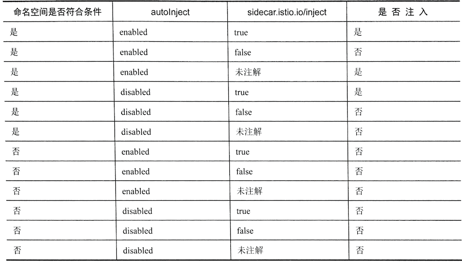

# **第五节 Istio 常用功能 （自动/手动部署`Istio`应用）**

`Istio`在微服务体系中提供了为数众多的各种功能，这么多功能难免让人眼花缭乱，本章将会从在网格中部署应用开始，展示`Istio`的常用功能，包括基本的流量控制、开箱即用的可视化功能等。 

本章内容涉及`Grafana`, `Prometheus`, `Jaeger`及`Kiali`，都是独立的开源项目，各 项目所涉及的内容都非常丰富和深入。

## **1、在网格中部署应用** 

我们在第3章中已经使用过`istioctl kube-inject`命令来为工作负载注人`Istio Sidecar`，本节会稍微深人地探讨这个功能。

添加一个`"-o"`参数，将注人结果输出为文件，以便观察：

```
istioctl kube-inject -f flask.istio.yaml -o flask.istio.injected.yaml
```

在执行完毕之后，可以看到，这里多出了一个 `flask.istio.injected.yaml`文件。

打开该文件，将其和源文件`flask.istio.yaml`进行对比，不难发现其中的`Service`对象没 有发生任何变化，两个`Deployment`对象则有很大的改变：

```
apiVersion: v1
kind: Service
metadata:
  name: flaskapp
  labels:
    app: flaskapp
spec:
  selector:
    app: flaskapp
  ports:
    - name: http
      port: 80
---
apiVersion: extensions/v1beta1
kind: Deployment
metadata:
  creationTimestamp: null
  name: flaskapp-v1
spec:
  ...
        sidecar.istio.io/status: '{"version":"4457e141f44dbeb1708490f938c6723acfa1090eef4a5becb97e6329952a2d8d","initContainers":["istio-init"],"containers":["istio-proxy"],"volumes":["istio-envoy","istio-certs"],"imagePullSecrets":null}'
     ...
    spec:
      containers:
      ...
      - args:
        - proxy
        - sidecar
        ...
        env:
        ...
        image: docker.io/istio/proxyv2:1.1.16
        imagePullPolicy: IfNotPresent
        name: istio-proxy
        ...
        image: docker.io/istio/proxy_init:1.1.16
        imagePullPolicy: IfNotPresent
        name: istio-init
        resources:
          limits:
            cpu: 100m
            memory: 50Mi
          requests:
            cpu: 10m
            memory: 10Mi
        securityContext:
          capabilities:
            add:
            - NET_ADMIN
          runAsNonRoot: false
          runAsUser: 0
      volumes:
      - emptyDir:
          medium: Memory
        name: istio-envoy
      - name: istio-certs
        secret:
          optional: true
          secretName: istio.default
status: {}
...
```

我们会发现多,一个被屡次提到的`sidecar`容器井且出现了一个初始化容器`(init-containers)`这个初始化容器就是用来劫持应用到`Sidecar`

接下来就可以使用`kubectl` 将注人后的YAML清单文件提交到集群里上运行了

```
$ kubectl apply -f flask.istio.injected.yaml 
service/flaskapp unchanged
deployment.extensions/flaskapp-v1 configured
deployment.extensions/flaskapp-v2 configured
``` 

除了支持手工注人,`Istio`还支持对工作负载进行自动注人,并对待注人的工作负载有一定的要求

因为`istioctl`要根据`configmap`来获取注入的内容，也就是说执行`Istioctl`的用户必须能够访问安装了Istio的`Kubernetes`集群中的这个`ConfigMap`。

如果因为某些原因无法访问，则还可以在`istioctl`中使用一个本地的配置文件。 


**首先用有`ConfigMap`获取权限的用户身份运行如下命令**： 

```
$ kubectl -n istio-system get configmap istio-sidecar-injector -o=jsonpath='{.data.config}' > inject-config.yaml
```

然后可以对该文件进行任意修改，就可以在`istioctl`中使用了：

``` 
$ istioctl kube-inject --injectConfigFile inject-config.yaml
```


### **1-1 对工作负载的要求** 

目前支持的工作负载类型包括：`Job`、 `DaemonSet`、 `ReplicaSet`、 `Pod`及`Deployment`. 对这些工作负载的要求如下。 

**1.要正确命名服务端口**

`Service`对象中的`Port`部分必须以“协议名”为前缀，目前支持的协议名包括 `http`、 `http2` 、`mongo`、 `redis`和`grpc`，例如，我们的`flaskapp`中的服务端口就被命名 
为`“http"`。

`Istio`会根据这些命名来确定为这些端口提供什么样的服务，不符合命名规范的端口会被当作`TCP`服务，其功能支持范围会大幅缩小。
 
目前的`Istio`版本对`HTTP`, `HTTP2`及`gRPC`协议都提供了最大范围的支持。 

**2.工作负载的Pod必须有关联的`Service`**

 
为了满足服务发现的需要，所有`Pod`都必须有关联的服务，因此我们的客户端应用`sleep`虽然没有开放任何端口，但还是要注册一个`Service`对象。 

另外，官方建议为`Pod`模板加入两个标签：**`app`和`version`**，分别标注应用名称和版本。这仅仅是个建议，但是`Istio`的很多默认策略都会引用这两个标签；如果没有这两个标签，就会引发很多不必要的麻烦。 

### **1-2 对工作负载的要求使用自动注入** 

除了使用`istioctl`进行手工注入，`Istio` 还提供了自动注人功能，该功能提供了较为丰富的微调选项，可以帮助用户更灵活地选择注人目标。
 
在`values.yaml`中默认包含如下所示的类似代码，可以用于调整自动注人的属性： 

```
autoInject: enabled 
sidecarInjectorWebhook: 
	enabled: true 
	replicaCount: 1 
	image: sidecar_injector 
	enableNamespacesByDefault: false 
```


下面对以上这段代码进行讲解，如下所述。 

* 如果将`sidecarInjectorWebhook.enabled`设置为`true`，就会开启`Sidecar`的自动注入特性。 
* 如果将`enableNamespacesByDefault`变量赋值为`true`，就会为所有命名空间开启自动注人功能；如果赋值为`false`，则只有标签为`istio-injection: enabled` 的命名空间才会开启自动注入功能。 
* `autoInject`这个变量命名有歧义，它的`enabled/disabled`赋值，设置的并不是是否开启自动注人功能，而是在启用自动注人功能之后，对于指定的命名空间内新建的`Pod`是否进行自动注入。
  * 如果取值为`enabled`，则该命名空间内的`Pod`只要没有被注解为`sidecar.istio.io/inject: "false"`，就会自动完成注人； 
  * 如果取值为`disabled`，则需要为`Pod`设置注解`sidecar.istio.io/inject: "true"`, 才会进行注入。 

`autoInject`、命名空间标签及`Pod`注解相互关联，形成了非常灵活的注入规则。如图所示为各种组合产生的效果列表（命名空间符合条件指的是命名空间被设置了注入标签，或者`enableNamespacesByDefault: true`)




接下来测试这个功能。默认安装的`Istio`(也就是使用`"-f istio/valus.yaml`选项生成的安装清单）启用了自动注人功能, 只要为命名空间设置注人标签, 并且将`autoInject`设置为`enabled`。根据在该命名空寂中创建的工作负载就会被自动注人`Sidecar`了 

```
$ kubectl create ns auto
namespace/auto created

$ kubectl label namespaces auto istio-injection=enabled ❤️❤️❤️
namespace/auto labeled

$ kubectl create ns manually
namespace/manually created
```

这样就创建两个命名空间其中的`auto`命名空间被设置了`istio-injction=enabled`标签

接下来分别在两个命名空间中使用`sleep.yaml`创建工作负载看看产生的`Pod`

```
apiVersion: v1
kind: Service
metadata:
  name: sleep
  labels:
    app: sleep
    version: v1
spec:
  selector:
    app: sleep
    version: v1
  ports:
    - name: ssh
      port: 80
---
apiVersion: extensions/v1beta1
kind: Deployment
metadata:
  name: sleep
spec:
  replicas: 1
  template:
    metadata:
      labels:
        app: sleep
        version: v1
    spec:
      containers:
      - name: sleep
        image: dustise/sleep
        imagePullPolicy: Always
---
```
```
$ kubectl create -f sleep.yaml -n auto
service/sleep created
deployment.extensions/sleep created
```

```
$ kubectl get pod -n auto
NAME                     READY   STATUS    RESTARTS   AGE
sleep-6c9c898f6c-b7scw   2/2     Running   0          28s
```

```
$ kubectl create -f sleep.yaml -n manually
service/sleep created
deployment.extensions/sleep created
```

* 通过对比可以看出, `auto`命名空间中的过程；`Pod`被注人了`Sidecar`并开始了初始过程;
* 而`manually`命名空间的`Pod`保持原样 ，没有进行注入


不管是手工注人还是自动注人，都可以通过编辑`Istio system`命名空间中 `ConfigMap istio-sidecar-injector`，来影响注人的效果

例如在`1.1.0`版本中`Istio` 自动注人可以报据标签例外设置.

不管命名空间标签及策略如何, 对符合标签选择器要求的`Pod`都不进行注入
 
**可以在`istio-sidecar-injector Configmap`中加入这一例外设署**

`istio/templates/sidecar-injector-configmap.yaml`

```
$ kubectl -n istio-system describe configmap istio-sidecar-injector

apiVersion: v1
kind: ConfigMap
metadata:
  name: istio-sidecar-injector
data:
  config: |-
    policy: enabled
    neverInjectSelector:
      - matchExpressions:
        - {key: openshift.io/build.name, operator: Exists}
      - matchExpressions:
        - {key: openshift.io/deployer-pod-for.name, operator: Exists}
    template: |-
      initContainers:
...
```

如上所示的`neverInjectSelector`字段是一个`Kubernetes`标签选择器的数组。

不同元素之间是`“或”`的关系，在第一次发现有符合条件的标签之后会跳过其他判断。 

上面的语句意味着：对于包含`openshift.io/build.name`或者`openshift.io/deployer-pod-for.name`标签的`Pod`，不管标签取值是什么，都不会进行注入。 

与之相对的还有一个`alwaysInjectSelector`标签，符合这一选择器的`Pod`，不管全局策略如何，都会被注人`Sidecar`. 

值得注意的是，`Pod`注解还有更高的优先级，一如果`Pod`注解包含 `sidecar.istio.io/inject: "true/false"`，则会被优先处理。 

所以，自动注人的评估顺序是：

`Pod注解 -> NeverInjectSelector 一> Always InjsectSelector 一> 命名空间策略`

如果按照前面的介绍进行操作，例如给命名空间打标签，则结果是Pod没有被注人。或者刚好相反，`Pod`明明被注解为`sidecar.istio.io/inject: "false"`，还是被注人了。这是为什么？ 

可以看看`sidecar-injector Pod`的日志： 

```
$ pod=$(kubectl -n istio-system get pods -l istio=sidecar-injector -o jsonpath='{.items[0].metadata.name}')

$ echo $pod
istio-sidecar-injector-6b57b9cbd-dd4qt

$ kubectl logs $pod -n istio-system

```

**然后可以创建业务Pod看看日志输出的其体内容, 要看到更详细的日志（经常会很有用）则可以编辑`sidecar-iniector Deployment` 对象, 给它加上参数 `"--log_output_level=default:debug"`;**

```
$ kubectl -n  istio-system edit deployment istio-sidecar-injector
...
containers:
      - args:
        - --caCertFile=/etc/istio/certs/root-cert.pem
        - --tlsCertFile=/etc/istio/certs/cert-chain.pem
        - --tlsKeyFile=/etc/istio/certs/key.pem
        - --injectConfig=/etc/istio/inject/config
        - --meshConfig=/etc/istio/config/mesh
        - --healthCheckInterval=2s
        - --healthCheckFile=/health
        - --log_output_level=default:debug
...
```

编辑成功后`pod`会重启

```
$  pod=$(kubectl -n istio-system get pods -l istio=sidec
ar-injector -o jsonpath='{.items[0].metadata.name}')

$ echo $pod
istio-sidecar-injector-77dfb5c66b-lzb8p

$ kubectl logs $pod -n istio-system

...
:{\"matchLabels\":{\"istio-injection\":\"enabled\"}},\
...
```

如果在日志中还是找不到发生问题的原因，就代表`side-injector`没有收到Pod创建的通知，也就不会触发自动注入的操作了

这可能是因为命名空间没有正确设置标签导致的，因此需要检查命名空间的标签及`MutatingWebhookConfiguration`的配置

在默认情况下，命名空间应该设置`istio-injection=enabled`，可以使用

```
$ kubectl -n istio-system edit MutatinWebhookConfiguration isitio-sidecar-injector
```

命令检查`namespaceSelecor`字段的内容

在完成排查之后， 可以再次编辑`Sidecar-injector Deployment`对象，清除新加人的参数.


### **1-3 准备测试应用**

**把 `default namespace` 设置为自动注入**, 并在其中运行`flaskapp`以及`sleep`两个版本

```
$ kubectl label namespace default istio-injection=enabled
namespace/default labeled
```

**`sleep.istio.yaml`**

```
apiVersion: v1
kind: Service
metadata:
  name: sleep
  labels:
    app: sleep
spec:
  selector:
    app: sleep
  ports:
    - name: ssh
      port: 80
---
apiVersion: extensions/v1beta1
kind: Deployment
metadata:
  name: sleep-v1
spec:
  replicas: 1
  template:
    metadata:
      labels:
        app: sleep
        version: v1
    spec:
      containers:
      - name: sleep
        image: dustise/sleep
        imagePullPolicy: Always
---
apiVersion: extensions/v1beta1
kind: Deployment
metadata:
  name: sleep-v2
spec:
  replicas: 1
  template:
    metadata:
      labels:
        app: sleep
        version: v2
    spec:
      containers:
      - name: sleep
        image: dustise/sleep
        imagePullPolicy: Always
```

```
$ kubectl apply -f sleep.istio.yaml 
service/sleep created
deployment.extensions/sleep-v1 created
deployment.extensions/sleep-v2 created

$ kubectl get pods | grep sleep
sleep-v1-548d87cc5c-fg9ng      2/2     Running   0          21s
sleep-v2-7c6b874968-qfkvt      2/2     Running   0          21s
```

## **2、修改`Istio`配置**

Istio经常有变更配置的需求， 这时可以用”Helm“ 的 `--set`的参数来完成这一任务

在默认情况下，Istio会将变量 `sidecarInjectorWebhook.enabled`赋值为`true`也就是启用自动注入功能


如果想关闭，则在之前使用`Helm`安装`Istio`的命令中加入`sidecarInjectorWebhook.enabled=false`的参数即可。例如

```
$ helm template istio \ 
--name istio --namespace istio-system \ 
--set sidecarInjectorWebhook.enabled=false 
```

以上是对官方说法的一个急结但是事实上并没有这么简单,

`Istio`的`Sidecar`自动注人功能是通过`Kubernetes`的`mutating`控制器来完成的, 如果启用了自动生效的`Istio` 安装清单就会生成一个名称为`Istio-sidecar-injector`的 `mutatingwebhookconfigurations`的对象， 在这个对象中保存的就是自动注人的配置 

报据`Helm`和`Kubernetes`的下作原理重复执行`kubecet apply`命令是不会进行删除操作的, 因此通过上面的操作生成的清单一旦被提交， 后果就是`mutating`控制器继续使用`istio-sidecar-injector`的配置进行下作 


**因此这种方式只针对新增或修改操作生效,对于删除操作是无效的**


