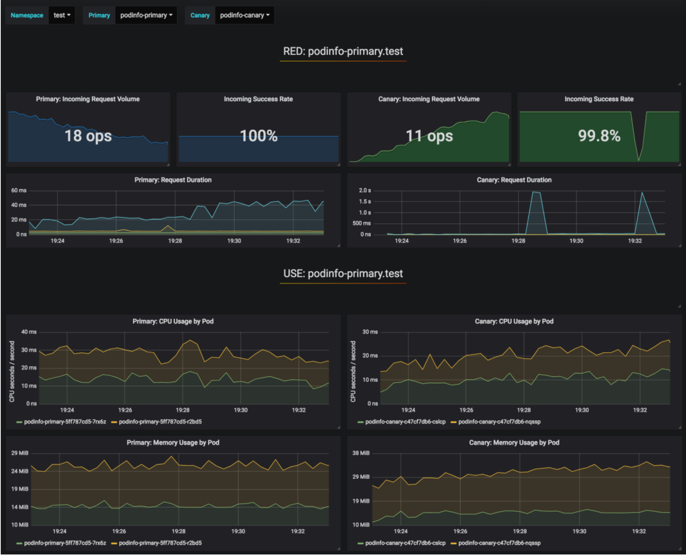
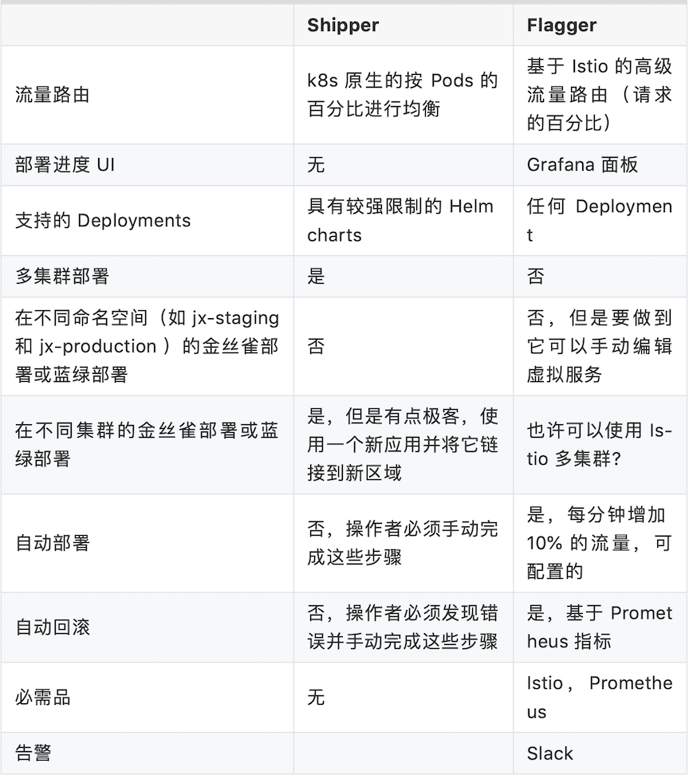

# **L1 Kubernetes 中的渐进式交付：蓝绿部署和金丝雀部署, shipper, Istio, Flagger**

**渐进式交付是持续交付的下一步**， 它将新版本部署到用户的一个子集，并在将其滚动到全部用户之前对其正确性和性能进行评估， 如果不匹配某些关键指标，则进行回滚。

这里有一些有趣的项目，使得渐进式交付在 Kubernetes 中变得更简单。我将使用一个 `Jenkins X` 示例项目 对它们之中的三个进行讨论：`Shipper`、`Istio` 以及 `Flagger`。

## **1、Shipper**

`shipper` 是来自 `booking.com` 的一个项目， 它对 Kubernetes 进行了扩展，添加了复杂的部署策略和多集群编排（文档）。它支持从一个集群到多个集群的部署，允许多区域部署。

**`Shipper` 通过一个 `shipperctl` 命令行进行安装。它增加不同集群的配置文件来进行管理。请注意这个与 GKE 上下文相关的问题。**

`Shipper` 使用 `Helm` 包来部署，但是它们没有随着 `Helm `一起安装，它们不会在 `helm list` 的输出显示。

同样地，`deployments` 的版本必须是 `apps/v1` ， 否则 `shipper` 将不能编辑 `deployment` 来添加正确的标签和副本数量。

使用 `shipper` 部署都是与从**旧版本(现有版本)**过渡到**新版本(竞争版本)**相关。这是通过创建一个新的应用对象实现的， 它定义了部署需要通过的多个阶段。例如下面 3 个步骤过程：

* **Staging**：部署新版本到一个 `pod `，没有流量
* **50 / 50**：部署新版本到 `50%` 的 `pods`，`50%` 的流量
* **Full on**：部署新版本到全部的 `pods`，全部的流量

```
strategy:
  steps:
  - name: staging
    capacity:
      contender: 1
      incumbent: 100
    traffic:
      contender: 0
      incumbent: 100
  - name: 50/50
    capacity:
      contender: 50
      incumbent: 50
    traffic:
      contender: 50
      incumbent: 50
  - name: full on
    capacity:
      contender: 100
      incumbent: 0
    traffic:
      contender: 100
      incumbent: 0
```

如果发布的某个步骤没有将流量发送到 pods ， 则可以使用 `kubectl port-forward` 访问它们，如：`kubectl port-forward mypod 8080:8080`， 这对于在用户看到新版本之前进行测试非常有用。

`Shipper` 支持多集群的概念，但是以相同的方式对待所有集群，仅使用区域并通过 `capabilities `（配置在集群对象中）进行筛选， 所有对一个应用对象来说，这里没有一个 `dev`, `staging`, `prod` 集群的选项。但是我们可以有两个应用对象：

* myapp-staging 部署到 "staging" 区域
* myapp 部署到其它区域

在 GKE 中，你可以轻松地配置[多集群 `ingress`](https://cloud.google.com/kubernetes-engine/docs/how-to/multi-cluster-ingress) ， 该入口将公开在多个集群中运行的服务，并从离你所在位置最近的集群提供服务。


### **1-1 局限性**

Shipper 中的主要的局限性有：

* `Chart` 限制：Chart 必须有一个部署对象。`Deployment` 的名称必须使用 `{{.Release.Name}}` 模板化。`Deployment` 对象应该有 `apiVersion：apps/v1` 。
* 基于 `Pod` 的流量切换：这里没有细粒度的流量路由，例如：发送 `1%` 的流量到新版本，它基于正在运行的 Pod 数量。
* 如果 `Shipper` 不工作了，新的 Pod 将获取不到流量。

## **2、Istio**

`Istio` 不是一个部署工具，而是一个**服务网格**。然而，它很令人感兴趣，因为它已经变得非常流行，并且允许流量管理，例如，将一定比例的流量发送到不同的服务和其他高级网络。

**在 `GKE` 中，只需在集群配置中选中复选框即可启用 `Istio` 。在其它集群中，可以通过 `Helm` 手动安装。**

**有了 `Istio` ，我们可以创建一个网关，通过 `Ingress` 网关处理所有外部流量，并创建虚拟服务来管理到我们服务的路由。**

**为此，[只需找到 `ingress` 网关的 `ip` 地址](https://istio.io/docs/tasks/traffic-management/ingress/#determining-the-ingress-ip-and-ports)并为其配置通配符 `DNS` 。然后创建一个网关，通过 `Ingress` 网关路由所有外部流量。**


```
apiVersion: networking.istio.io/v1alpha3
kind: Gateway
metadata:
 name: public-gateway
 namespace: istio-system
spec:
 selector:
   istio: ingressgateway
 servers:
 - port:
     number: 80
     name: http
     protocol: HTTP
   hosts:
   - "*"
```

`Isito` 不管理应用的生命周期，只管理网络。

我们可以创建一个虚拟服务，为所有进入 `ingress` 网关的请求 向 `pull request` 或 `master` 分支中部署的服务发送 1% 的流量。

```
apiVersion: networking.istio.io/v1alpha3
kind: VirtualService
metadata:
 name: croc-hunter-jenkinsx
 namespace: jx-production
spec:
 gateways:
 - public-gateway.istio-system.svc.cluster.local
 - mesh
 hosts:
 - croc-hunter.istio.example.org
 http:
 - route:
   - destination:
       host: croc-hunter-jenkinsx.jx-production.svc.cluster.local
       port:
         number: 80
     weight: 99
   - destination:
       host: croc-hunter-jenkinsx.jx-staging.svc.cluster.local
       port:
         number: 80
     weight: 1
```

## **3、Flagger**


[Flagger](https://github.com/weaveworks/flagger) 是一个由 Weaveworks 赞助的使用了 `Istio` 的项目， 该项目使用 `Prometheus` 的指标进行自动化金丝雀发布和回滚。它超越了 `Isito` 提供了基于指标的自动化渐进式发布和回滚。

`Flager` 需要将 [`Istio`与 `Prometheus`、`Servicegraph`](https://docs.flagger.app/install/install-istio) 和某些系统的配置一起安装， 另外还要安装 `Flager` 控制器本身。它也提供了一个 `Grfana` 面板来监控部署进度。




**[部署 `rollout`](https://docs.flagger.app/usage/progressive-delivery)通过 `Canary` 对象定义， 它会生成主要的和金丝雀 `Deployment` 对象。编辑 `Deployment` 时，例如要使用新的镜像版本， `Flagger` 控制器将负载从 `0% `切换到 `50%` ，每分钟增加 `10% `，然后它将切换到新的 `deployment` 或者如果响应错误和请求持续时间等指标失败则进行回滚。**


## **4、比较**

此表总结了 `Shipper` 和 `Flagger` 在几个渐进式交付特性方面的优势和劣势。




综上所述，我看到了 `Shipper` 在多集群管理和简单性方面的价值，它不需要 Kubernetes 以外的任何东西，但是它有一些严重的局限性。


