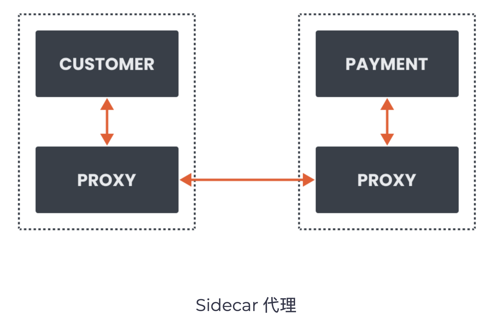
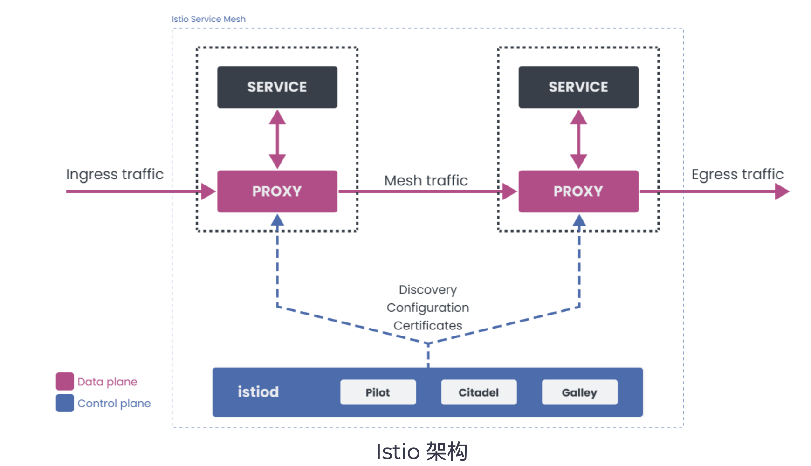

# **第一节 服务网格和 Istio 概览**

## **1、服务网格概述**

**Service Mesh**

Dedicated infrastructure layer for managing service-to-service communication to make it manageable, visible, and controlled. 

* Communication logic move out of the service 
* Infrastructure layer = array of network proxies 
* Network proxies deal with all communication between srvices 

**Why Do I need Service Mesh**

* Mutual TLS and automatic certificate rotation 
* Identify performance and reliability issues using metrics 
* Visualize metrics
* Debug services and tracing 
* Traffic routing and mirroring 
* Chaos testing 
* Circuit breakers 

 

服务网格所做的是，它将这种通信逻辑、重试、超时等从单个服务中分离出来，并将其移到一个单独的基础设施层。

在服务网格的情况下，基础设施层是一个网络代理的阵列。这些网络代理的集合（每个服务实例旁边都有一个）处理你的服务之间的所有通信逻辑。我们称这些代理 为sidecar，因为它们与每个服务并存。 

### **为什么需要服务网格**

服务网格为我们提供了一种一致的方式来连接、保护和观察微服务。网格内的代理捕获了网格 内所有通信的请求和指标。每一次失败、每一次成功的调用、重试或超时都可以被捕获、可视化，并发出警报。此外，可以根据请求属性做出决定。例如，我们可以检查入站（或出站）请求并编写规则，将所有具有特定头值的请求路由到不同的服务版本。
 
所有这些信息和收集到的指标使得一些场景可以合理地直接实现。开发人员和运营商可以配置和执行以下方案，而不需要对服务进行任何代码修改。 

* **mTLS和自动证书轮换** 
* 使用指标识别，性能和可靠性问题 
* 在Grafana等工具中实现指标的可视化；这进一步允许改变并与PagerDuty整合
* 使用Jaeger或Zipkin对服务进行调试和追踪 
* 基于权重和请求的流量路由，金丝雀部署，A/B测试 
* 流量镜像 
* 通过超时和重试提高服务的弹性 
* 通过在服务之间注入故障和延迟来进行混沌测试 
* 检测和弹出不健康的服务实例的断路器。 

## **2、Istio 简介**

### **Istio Features** 

* Traffic management 
	* Control flow of traffic between service 
	* Circuit breakers, timeouts, and retries 

	
* Observability 
	* Tracing, monitoring, and logging 

* Security 
	* Authentication, authorization, and encryption 
	* Enforce policies 

 

### **Envoy (data plane)** 

* High-performance proxy (C++) 
* **Injected next to application containers** 
* **Intercepts all traffic for the service** 
* Pluggable extension model based on WebAssembly 

### **Istiod (control plane)** 

* **Service discovery** 
* Configuration 
* **Certificate management** 
* Converts YAML to Envoy-readable configuration 
	* propagates it to all sidecars in the mesh 

### **Istlo简介**

Istio是一个服务网格的开源实现。从宏观上来看Istio支持以下功能。 

**1．流量管理** 

利用配置，我们可以控制服务间的流量。设置断路器、超时或重试都可以通过简单的配置改变 来完成。 

**2．可观察性** 

Istio通过跟踪、监控和记录让我们更好地了解服务，让我们能够快速发现和修复问题。 

**3．安全性** 

Istio可以在代理层面上管理认证、授权和通信的加密。我们可以通过快速的配置变更在各个服 务中执行策略。 

### **Istio组件**

Istio服务网格有两个部分：**数据平面和控制平面**。 

在构建分布式系统时，将组件分离成控制平面和数据平面是一种常见的模式。

**数据平面的组件在请求路径上，而控制平面的组件则帮助数据平面完成其工作。** 

**Istio中的数据平面由Envoy代理组成，控制服务之间的通信。网格的控制平面部分负责管理不口配置代理。** 

### **Envoy（数据平面）** 

Envoy是一个用C+＋开发的高性能代理。Istio服务网格将Envoy代理作为一个 sidecar容器注入到你的应用容器旁边。然后该代理拦截该服务的所有入站和出站 流量。注入的代理一起构成了服务网格的数据平面。 

Envoy代理也是唯一与流量进行交互的组件。除了前面提到的功能―负载均衡、断路器、故障注入等。Envoy还支持基于WebAssembly (WASM）的可插拔扩展模型。这种可扩展性使我们能够执行自定义策略，并为网格中的流量生成遥测数据。 

### **Istiod（控制平面)** 

Istiod是控制平面组件，提供服务发现、配置和证书管理功能。**Istiod采用YAML编写的高级规则，并将其转换为Envoy的可操作配置。然后，它把这个配置传播给 网格中的所有sidecar**

**Istiod内部的Pilot组件抽象出特定平台的服务发现机制**（Kubernetes、 Consul 或VM)，并将其转换为sidecar可以使用的标准格式。

使用内置的身份和凭证管理，我们可以实现强大的服务间和终端用户认证。通过授 权功能，我们可以控制谁可以访问服务。 

**控制平面的部分以前被称为Citadel，作为一个证书授权机构，生成证书，允许数据平面中的代理之间进行安全的mTLS通信**。 

## **3、测验：服务网格和 Istio 概览**

1.服务网格如何帮助服务之间的通信逻辑？ 

* A 降低延迟 
* B 可以让你更快的伸缩服务 
* **C 将逻辑分离到基础实施层** 
* D 让部署更加迅速 

2.从宏观上看，Istio服务网格由哪两部分组成？ 

* **数据平面和控制平面** 
* Istio Pilot和Envoy 
* 数据平面和Envoy代理 
* Envoy代理和配置 

3.服务网格的代理也叫做什么？ 

* A Ambassador 
* B Adapter 
* C Interface 
* **D Sidecar** 

4.Istio中的数据平面由用户的服务组成。对还是错？ 

* 对
* **错**

6.Istio中的哪个组件可以将YAML规则转换为Envoy配置？ 

* A Envoy 
* **B Istiod** 
* C Sidecar 
* D Citadel 

7.从下面的列表中选出微服务架构的两个好处？ 

* **A 可伸缩性**
* **B 更小的团队** 
* C 简化服务之间的沟通 
* D 便于调试 
* E 便于测试 
