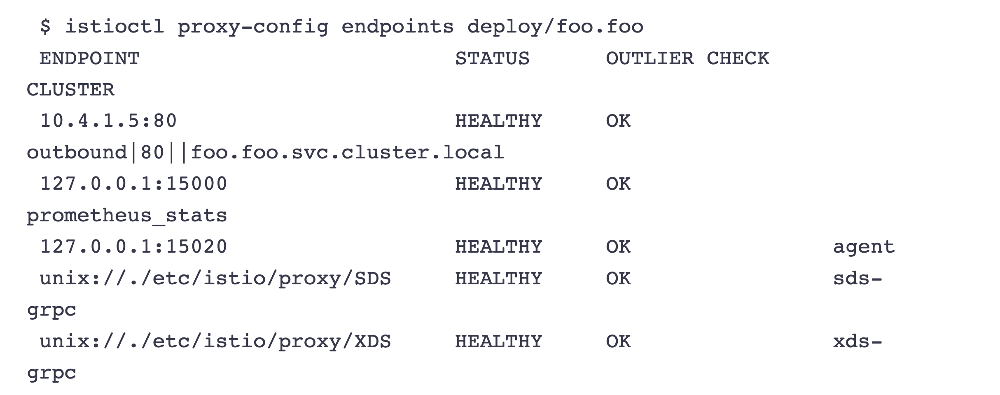

# **第二节 安装 Istio**

## **1、安装 Istio**


* istioctl 
	* Command-line utilitiy 

Istio Operator 

* Uses a custom resource
* Deals with Istio upgrades 


**Configuration profiles**

* Istio configuration profiles: 
	* default 
	* demo 
	* empty 
	* minimal 
	* preview 
	* remote 


我们有两种方法可以在单个Kubernetes集群上安装Istio：使用Istiocti (istiocti)或使用 Istio Operator。在本模块中，我们将使用Istio Operator在一个Kubernetes集群上安装 Istio。 

### **使用Istioctl安装** 

Istioctl 是一个命令行工具，我们可以用它来安装和定制Istio的安装。使用该命令行工具，我们生成一个包含所有Istio资源的YAML文件，然后将其部署到Kubernetes集群上。 

### **使用Istio Operator安装** 

与istioctl相比，Istio Operator安装的优势在于，我们不需要手动升级Istio。相反，我们可 以部署Istio Operator，为你管理安装。我们通过更新一个自定义资源来控制Operator，而 Operator则为你应用配置变化。 

### **生产部署情况如何？** 

在决定Istio的生产部署模式时，还有一些额外的考虑因素需要牢记。我们可以配置Istio在不同的部署模型中运行―可能跨越多个集群和网络，并使用多个控制平面。我们将在高级功能 模块中了解其他部署模式、多集群安装以及在虚拟机上运行工作负载。


## **2、GetMesh**


Istio是最受欢迎和发展最快的开源项目之一。它的发布时间表对企业的生命周期和变更管理实 践来说可能非常激进。GetMesh通过针对不同的Ku bernetes分发版测试所有Istio版本以确保功能的完整性来解决这一问题。

GetMesh的Istio版本在安全补丁和其他错误更新方面得到 积极的支持，并拥有比上游Istio提供的更长的支持期。 一些服务网格客户需要支持更高的安全要求。


### **如何开始？** 


第一步是下载GetMesh CLI。你可以在macOS和Linux平台上安装GetMesh。我们可以使用以下命令下载最新版本的GetMesh并认证Istio0 


```
curl -sL https://istio.tetratelabs.io/getmesh/install.sh | bash
``` 


```
$ getmesh version
getmesh version: 1.1.3
active istioctl: 1.10.3-tetrate-v0
no running Istio pods in "istio-system"
1.10.3-tetrate-v0
```


版本命令输出`GetMesh`的版本、活跃的Istio CLI的版本以及Kubernetes集群上安装的 Istio的版本。 


### **使用GetMesh安装Istio** 

GetMesh通过Kubernetes配置文件与活跃的Kubernetes集群进行通信。 

要在当前活跃的Kubernetes集群上安装Istio的演示配置文件，我们可以像这样使用`getmesh istioctl`命令： 

```
getmesh istioctl install --set profile=demo
```

该命令将检查集群，以确保它准备好安装Istio，一旦你确认，安装程序将继续使用选定的配置文件安装Istio
 
如果我们现在检查版本，你会注意到输出显示控制平面和数据平面的版本。 

### **验证配置** 

`config-validate`命令允许你对当前配置和任何尚未应用的YAML清单进行验证。 

该命令使用外部资源调用一系列验证，如上游Istio验证、Kiali库和GetMesh自定义配置检查。 

下面是一个命令输出的例子，如果没有标记为Istio注入的命名空间。 

```
$ getmesh config-validate
Running the config validator. This may take some time...

Resource PeerAuthentication not found in the cluster. Maybe Istio has not been installed in your cluster. Please make sure Istio is installed before execute "getmesh config-validate"
```

 

```
getmesh config-validate my-resource.yaml
```

### **管理多个 Istio CLI**

我们可以使用 show 命令来列出当前下载的 Istio 版本

```
$ getmesh show
1.10.3-tetrate-v0 (Active)
```

如果电脑上没有我们想使用的版本，可以使用 `getmesh list` 命令来列出所有可信的 Istio 版本：

```
$ getmesh list
ISTIO VERSION	  FLAVOR   	FLAVOR VERSION	   K8S VERSIONS
   *1.10.3   	  tetrate  	      0       	1.17,1.18,1.19,1.20
   1.10.3    	tetratefips	      0       	1.17,1.18,1.19,1.20
   1.10.3    	   istio   	      0       	1.17,1.18,1.19,1.20
    1.9.7    	  tetrate  	      0       	1.17,1.18,1.19,1.20
    1.9.7    	tetratefips	      0       	1.17,1.18,1.19,1.20
    1.9.7    	   istio   	      0       	1.17,1.18,1.19,1.20
    1.9.5    	  tetrate  	      0       	1.17,1.18,1.19,1.20
    1.9.5    	   istio   	      0       	1.17,1.18,1.19,1.20
    1.9.4    	  tetrate  	      0       	1.17,1.18,1.19,1.20
    1.9.4    	   istio   	      0       	1.17,1.18,1.19,1.20
    1.9.0    	  tetrate  	      0       	1.17,1.18,1.19,1.20
    1.9.0    	tetratefips	      1       	1.17,1.18,1.19,1.20
    1.9.0    	   istio   	      0       	1.17,1.18,1.19,1.20
    1.8.6    	  tetrate  	      0       	1.16,1.17,1.18,1.19
    1.8.6    	   istio   	      0       	1.16,1.17,1.18,1.19
    1.8.5    	  tetrate  	      0       	1.16,1.17,1.18,1.19
    1.8.5    	   istio   	      0       	1.16,1.17,1.18,1.19
    1.8.3    	  tetrate  	      0       	1.16,1.17,1.18,1.19
    1.8.3    	tetratefips	      1       	1.16,1.17,1.18,1.19
    1.8.3    	   istio   	      0       	1.16,1.17,1.18,1.19
    1.7.8    	  tetrate  	      0       	  1.16,1.17,1.18
    1.7.8    	   istio   	      0       	  1.16,1.17,1.18
```

要获取一个特定的版本

```
getmesh fetch --version 1.9.0 --flavor tetratefips --flavor-version 1
```

```
$ getmesh show 
1.9.0-tetratefips-v1 (Active) 
1.9.5-tetrate-v0 
```

同样，如果我们运行 `getmesh istioctl version` ，我们会发现正在使用的 Istio CLI 的版本：

```
$ getmesh istioctl version
client version: 1.9.0-tetratefips-v1
control plane version: 1.9.5-tetrate-v0
data plane version: 1.9.5-tetrate-v0 (2 proxies)
```


要切换到不同版本的 Istio CLI，我们可以运行 `getmesh switch`命令

```
getmesh  switch --version 1.9.5 --flavor tetrate --flavor-version 0
```

### **CA 集成**

我们没有使用自签的根证书，而是从 GCP CAS（证书授权服务）获得一个中间的 Istio 证书授权（CA）来签署工作负载证书

假设你已经配置了自己的 CAS 实例， 可以用 CA 的参数创建一个 YAML 配置。下面是 YAML 配置的一个例子：

```
providerName: "gcp"
providerConfig:
  gcp:
  # 你在 GCP 上创建的证书授权的完整 CA 名称
   casCAName: "projects/tetrate-io-istio/locations/us-west1/certificateAuthorities/tetrate-example-io"

certificateParameters:
  secretOptions:
   istioCANamespace: "istio-system" # cacerts secret 所在的命名空间
   overrideExistingCACertsSecret: true # 重写已存在的 cacerts secret，使用新的替换
  caOptions:
   validityDays: 365 # CA 到期前的有效天数
   keyLength: 2048 # 创建的 key 的比特数
   certSigningRequestParams: # x509.CertificateRequest；大部分字段省略
    subject:
     commonname: "tetrate.example.io"
     country: 
      - "US"
     locality:
      - "Sunnyvale"
     organization:
      - "Istio"
     organizationunit:
      - "engineering"
    emailaddresses:
     - "youremail@example.io"
```

配置完成后，你可以使用 `gen-ca` 命令来创建 `cacert`

```
getmesh gen-ca --config-file gcp-cas-config.yaml
```

该命令在 `istio-system` 中创建 `cacert  Kubernetes Secret` 为了让 istiod 接受新的 cert，你必须重新启动 istiod。

如果你创建一个 sample 工作负载，并检查所使用的证书，你会发现是 CA 为工作负载发布的证书。


## **3、发现选择器**

**Discovery selectors** 

* Introduced in Istio 1.10 
* Which namespaces to watch&send configuration updates for 
* All proxies configured with information about all other services 

**Configuring discovery selectors**

* At the mesh level 
* List of Kubernetes selectors(e.g.hello=world,version=v1 ...) 
* Use **discoverySelectors** to limit the watched & processed items 

发现选择器是Istio 1.10中引入的新功能之一。**发现选择器允许我们控制Istio控制平面观察和发送配置更新的命名空间。**
 
默认情况下，Istlo控制平面会观察和处理集群中所有Ku bernetes资源的更新。服务网格中旷 所有Envoy代理的配置方式是，它们可以到达服务网格中的每个工作负载，并接受与工作负载相关的所有端口的流量。 

**例如，我们在不同的命名空间部署了两个工作负载―foo和bar**。

尽管我们知道foo永远不会与bar通信，反之亦然，但一个服务的端点将被包含在另一个服务的已发现端点列表中。 

 


**如果我们运行`istioctl proxy-config`命令**，列出foo命名空间的foo工作负载可以看到的所有端点，你会注意到一个名为bar的服务条目：
 
 
```
$ istioctl proxy-config endpoints deploy/foo.foo
```

 


如果Istio不断用集群中每个服务的信息来更新代理，即使这些服务是不相关的，我们可以想象这将如何拖累事情。 

**如果这听起来很熟悉，你可能知道已经有一个解决方案了 - Sidecar资源。** 

### **配置发现选择器** 

发现选择器可以在`MeshConfig`中的Mesh层面上进行配置。它们是一个Kubernetes选择器的列表，指定了Istio在向sidecar推送配置时观察和更新的命名空间的集合。 

就像Sidecar资源一样, discoverySelectors可以用来限制被`Istio`观察和处理的项目数量
 
我们可以更新`IstioOperator`以包括`discoverySelectors`字段，如下所示： 

```
apiVersion: install.istio.io/v1alpha1
kind: IstioOperator
metadata:
  namespace: istio-system
  name: istio-demo
spec:
  meshConfig:
   discoverySelectors:
   - matchLabels:
       env: test
```

上面的例子将`env=test`设置为一个匹配标签。这意昧着标有`env=test`标签的命名空间中的工作负载将被包含在Istio监控和更新的命名空间列表中。 

如果我们给foo命名空间贴上`env=test`标签，然后列出端点，我们会发现现在配置中列出的端点没有那么多。

这是因为我们标注的唯一命名空间是foo命名空间，这也是Istlo控制平面观察和发送更新的唯一命名空间。 

```
$ istioctl proxy-config endpoints deploy/foo.foo
```

 

**如果我们把命名空间bar也贴上标签**，然后重新运行`istiocti proxy-config`命令，我们会发现bar端点显示为foo服务配置的一部分。 

```
$ istioctl proxy-config endpoints deploy/foo.foo
```

 


## **4、实验Istio安装**

```
$ curl -L https://istio.io/downloadIstio | ISTIO_VERSION=1.10.3 sh -
$ cd istio-1.10.3
$ sudo cp bin/istioctl /usr/local/bin/istioctl
$ istioctl version
no running Istio pods in "istio-system"
1.10.3
```
 
Istlo支持多个配置文件（`profile`)。配置文件之间的区别在于所安装的组件。 

```
$ istioctl profile list
Istio configuration profiles:
    default
    demo
    empty
    external
    minimal
    openshift
    preview
    remote    
```

推荐用于生产部署的配置文件是default配置文件。


我们将安装demo配置文件，因为它包含所有的核心组件，启用了跟踪和日志记录，便于学习不同的Istio功能。 

我们也可以从minimal的组件开始，以后单独安装其他功能，如ingress和egress网关。 

因为我们将使用Istio Operator进行安装，所以我们必须先部署Operator0

要部署`Istio Operator`，请运行 

```
$ istioctl operator init
Installing operator controller in namespace: istio-operator using image: docker.io/istio/operator:1.10.3
Operator controller will watch namespaces: istio-system
✔ Istio operator installed                                                                                                                            
✔ Installation complete
```

init命令创建了	`istio-operator` 命名空间，并部署了CRD、Operator Deployment以及operator工作所需的其他资源。安装完成后，Operator就可以使用了。 

要安装Istio，我们必须创建`IstioOperator`资源，并指定我们要使用的配置配置文件。 
创建一个名为`demo-profile.yaml`的文件，内容如下： 

```
apiVersion: v1
kind: Namespace
metadata:
  name: istio-system
---
apiVersion: install.istio.io/v1alpha1
kind: IstioOperator
metadata:
  namespace: istio-system
  name: demo-istio-install
spec:
  profile: demo
```

安装 istio 的工具和文件准备好过后，直接执行如下所示的安装命令即可，这里我们采用的是 `demo`配置组合的形式，这是因为它包含了一组专为测试准备的功能集合，另外还有用于生产或性能测试的配置组合。

```
$  istioctl install --set profile=demo -y
✔ Istio core installed                                                                                                              
✔ Istiod installed                                                                                                                  
✔ Ingress gateways installed                                                                                                        
✔ Egress gateways installed                                                                                                         
✔ Installation complete                                                                                                             
Thank you for installing Istio 1.10.  Please take a few minutes to tell us about your install/upgrade experience!  https://forms.gle
/KjkrDnMPByq7akrYA
```


```
$ kubectl apply -f demo-profile.yaml 
namespace/istio-system unchanged
istiooperator.install.istio.io/demo-istio-install created
```


一旦Operator检测到`IstioOperator`资源，它将开始安装Istio。整个过程可能需要5分钟左右。 


为了检查安装的状态，我们可以看看`istio-system`命名空间中的Pod的状态。 

```
$ kubectl get pod -n istio-operator
NAME                            READY   STATUS    RESTARTS   AGE
istio-operator-dbc5db55-wjngn   1/1     Running   0          8m16s

$ kubectl get pod -n istio-system 
NAME                                   READY   STATUS    RESTARTS   AGE
istio-egressgateway-5547fcc8fc-7kj9c   1/1     Running   0          7m17s
istio-ingressgateway-8f568d595-zj9bs   1/1     Running   0          7m17s
istiod-6659979bdf-l7kgk                1/1     Running   0          7m23s
```


当所有的Pod都在运行时，Operator已经完成了Istio的安装。 

### **启用sidecar注入**
 
服务网格需要让每个应用程序同时运行sidecar代理。 

要将sidecar代理注入到现有的Kubernetes部署中，我们可以使用`istioctl`命令中的 `kube-inject`动作。
 
然而，我们也可以在任意Kubernetes命名空间上启用sidecar自动注入。如果我们用 `istio-injection=enabled`标记命名空间，Istio会自动为我们在该命名空间中创建的所有 `Kubernetes Pod`注入`sidecar`

让我们通过添加标签来启用default命名空间的sidecar自动注入。 

```
$ kubectl label namespace default istio-injection=enabled
namespace/default labeled
```

要检查命名空间是否被标记，请运行下面的命令。defaul七命名空间应该是唯一一个启用了该值的命名空间。 

```
$ kubectl get namespace -L istio-injection
NAME              STATUS   AGE   ISTIO-INJECTION
default           Active   12d   enabled
istio-operator    Active   22m   disabled
istio-system      Active   30m   
kube-demo         Active   12d   
kube-node-lease   Active   12d   
kube-public       Active   12d   
kube-system       Active   12d   
velero            Active   12d
```

现在我们可以尝试在defaul七命名空间创建一个Deployment，并观察注入的代理。我们将 创建一个名为`my-nginx`的`Deployment`，使用nginx镜像的单一容器。 

```
kubectl create deploy my-nginx --image=nginx
```

```
kubectl get pod 
NAME                        READY   STATUS    RESTARTS   AGE
my-nginx-6b74b79f57-ps779   2/2     Running   0          111s
```

```
$ kubectl describe pod my-nginx-6b74b79f57-ps779
Events:
  Type    Reason     Age    From                     Message
  ----    ------     ----   ----                     -------
  Normal  Scheduled  2m27s  default-scheduler        Successfully assigned default/my-nginx-6b74b79f57-ps779 to docker-desktop
  Normal  Pulled     2m24s  kubelet, docker-desktop  Container image "docker.io/istio/proxyv2:1.10.3" already present on machine
  Normal  Created    2m23s  kubelet, docker-desktop  Created container istio-init
  Normal  Started    2m23s  kubelet, docker-desktop  Started container istio-init
  Normal  Pulling    2m22s  kubelet, docker-desktop  Pulling image "nginx"
  Normal  Pulled     98s    kubelet, docker-desktop  Successfully pulled image "nginx" in 44.2681088s
  Normal  Created    98s    kubelet, docker-desktop  Created container nginx
  Normal  Started    98s    kubelet, docker-desktop  Started container nginx
  Normal  Pulled     98s    kubelet, docker-desktop  Container image "docker.io/istio/proxyv2:1.10.3" already present on machine
  Normal  Created    98s    kubelet, docker-desktop  Created container istio-proxy
  Normal  Started    98s    kubelet, docker-desktop  Started container istio-proxy
```

## **4、测验：安装 Istio**


1.安装后，Istio会自动将Envoy代理注入所有在default命名空间创建的Kubernetes部署中。对还是错？ 

* A 对
* **<mark>B 错</mark>**    


2.Istio有多个配置文件。哪种配置文件最适合生产部署？ 

> Choose only ONE best answer. 

* **<mark>Default profile</mark>**  
* Production profile  
* Minimal 
* Demo 


3.你可以用哪个标签来启用自动sidecar注入？ 

> Choose only ONE best answer. 

* A injection=enabled 
* B sidecar-injection=1 
* **<mark>C istio-injection=enabled</mark>** 
* D inject＝true 


4.运行Envoy代理sidecar的容器的名称是什么？ 

> Choose only ONE best answer. 

* **<mark>A istio-proxy</mark>**
* B sidecar 
* C envoy-proxy 
* D proxy 


5。只可以使用Istio CLI (istiocti）来安装Istio，对还是错？ 

> Choose only ONE best answer. 
 
* A 对
* **<mark>B 错</mark>** 

