# **第三节 可观察性：遥测和日志**

## **1、模块概念**

在这个模块中，学习一些监控（Prometheus)、追踪（Zipkin)和数据可视化工具 (Grafana)。 

为了让`Grafana`和`Kiali`工作，我们首先要安装Prometheus插件。 

### **1-1 可观察性** 

由于采用了sidecar部署模式，**即Envoy代理运行在应用实例旁边并拦截流量，这些代理也收集指标**。 

Envoy代理收集的指标可以帮助我们获得系统状态的可见性。


获得系统的这种可见性是至关重要的，因为我们需要了解正在发生的事情，并授权运维人员对应用程序进行故障排除、维护和优化。 

**Istio生成三种类型的遥测数据，为网格中的服务提供可观察性**：

* 指标度量（Metric)
* 分布式追踪
* 访问日志 


### **1-2 指标**

Istlo基于四个黄金信号生成指标：**延迟、流量、错误和饱和度**。 


1. **Latency**: the time it takes to service a request 
2. **Traffic**: how much demand is placed on the system 
3. **Errors**: rate of failed requests 
4. **Saturation**: how full the most constrained resources of service are 

**Collected at Envoy proxy, service, and control plane**

* 延迟表示服务一个请求所需的时间。这个指标应该分成成功请求（如日I 1P200)和失败请求 （如HTTP 500）的延迟。 
* **流量是衡量对系统的需求有多大，它是以系统的具体指标来衡量的。例如，每秒的HTTP请求，或并发会话，每秒的检索量，等等**。 
* **错误用来衡量请求失败的比率**（例如HTTP 500)。 
* **饱和度衡量一个服务中最紧张的资源有多满。例如，线程池的利用率**。 
* 这些指标是在不同的层面上收集的，**首先是最细的，即Envoy代理层面，然后是服务层面和控制平面的指标**。 

### **1-3 代理级指标**

生成指标的关键角色是Envoy，它生成了一套关于所有通过代理的流量的丰富指标。使用 Envoy生成的指标，我们可以以最低的粒度来监控服务网格，例如Envoy代理中的每个监听 器和集群的指标。 

作为网格运维人员，我们有能力控制生成和收集工作负载实例中的哪些Envoy指标。 

下面是几个代理级指标的例子。 

```
envoy_cluster_internal_upstream_rq{response_code_class="2xx",cluster_name="xds-grpc"} 7163
envoy_cluster_upstream_rq_completed{cluster_name="xds-grpc"} 7164
envoy_cluster_ssl_connection_error{cluster_name="xds-grpc"} 0
envoy_cluster_lb_subsets_removed{cluster_name="xds-grpc"} 0
envoy_cluster_internal_upstream_rq{response_code="503",cluster_name="xds-grpc"} 1
```

> 注意你可以从每个压Envoy代理实例的／Stats 端点查看代理级指标。 

### **1-4 服务级指标**

 
服务级别的指标涵盖了我们前面提到的四个黄金信号。**这些指标使我们能够监控服务与服务之间的通信。此外，Istlo还提供了一组仪表盘，我们可以根据这些指标来监控服务行为**。
 
就像代理级别的指标一样，运维人员可以自定义收集哪些服务级别的指标。
 
默认情况下，Istio的标准指标集会被导出到Prometheus

下面是几个服务级指标的例子： 

```
istio_requests_total{
  connection_security_policy="mutual_tls",
  destination_app="hello-world",
  destination_canonical_service="hello-world",
  destination_canonical_revision="v1",
  destination_principal="cluster.local/ns/default/sa/default",
  destination_service="hello-world.default.svc.cluster.local",
  destination_service_name="hello-world",
  destination_service_namespace="default",
  destination_version="v1",
  destination_workload="hello-world-v1",
  destination_workload_namespace="default",
  reporter="destination",
  request_protocol="http",
  response_code="200",
  response_flags="-",
  source_app="hello-web",
  source_canonical_service="hello-web",
  source_canonical_revision="v1",
  source_principal="cluster.local/ns/default/sa/default",
  source_version="v1",
  source_workload="hello-web-v1",
  source_workload_namespace="default"
} 981
```

### **1-5 控制平面度量**

 
Istio也会生成控制平面指标，用于监控Istio的控制平面，而不是用户服务。
 
输出的控制平面指标的完整列表可以在[这里](https://istio.io/latest/docs/reference/commands/pilot-discovery/#metrics)找到。 

控制平面指标包括冲突的入站／出站监听器的数量、没有实例的集群数量、被拒绝或被忽略的配置等指标。 

## **2、Prometheus**

### **Prometheus** 

* Open-source monitoring system and time series DB 
* Records metrics: 
* Track mesh health 
* Track application health 
* Install from /samples/addons folder 
* istioctl dashboard prometheus 

 
Prometheus是一个开源的监控系统和时间序列数据库。Istlo使用Prometheus来记录指标，跟踪Istio和网格中的应用程序的健康状况。 


要安装Prometheus，我们可以使用 Istio安装包中／samples/addons 文件夹中的示例安装。

```
$ kubectl apply -f istio-1.10.3/samples/addons/prometheus.yaml 
serviceaccount/prometheus created
configmap/prometheus created
clusterrole.rbac.authorization.k8s.io/prometheus created
clusterrolebinding.rbac.authorization.k8s.io/prometheus created
service/prometheus created
deployment.apps/prometheus created
```

```
$ kubectl get pod -n istio-system 
NAME                                   READY   STATUS    RESTARTS   AGE
istio-egressgateway-5547fcc8fc-7kj9c   1/1     Running   0          4h31m
istio-ingressgateway-8f568d595-zj9bs   1/1     Running   0          4h31m
istiod-6659979bdf-l7kgk                1/1     Running   0          4h31m
prometheus-8958b965-hpp2v              2/2     Running   0          2m11s
```

要打开 Prometheus 仪表板，我们可以使用 Istio CLI 中的 

```
$ Istioctl dashboard prometheus
http://localhost:9090
```

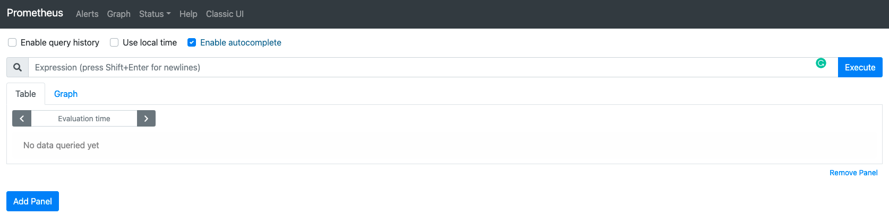 

### **部署实例应用**

为了能够产生一些流量并访问Nginx Pod，我们需要以某种方式让它可以被访问。 

最简单的方法是将Nginx部署作为服务公开： 

```
kubectl create deploy my-nginx --image=ngix
```

```
kubectl expose deployment my-nginx --type=NodePort --name=my-nginx --port 80
service/my-nginx exposed
```

> 注意： 我们将学习如何使用Istio资源并通过Istio的入口网关暴露服 

现在我们可以运行`kubectl get services`，获得`my-nginx`服务的外部IP地址： 

```
$ kubectl get svc
NAME         TYPE        CLUSTER-IP       EXTERNAL-IP   PORT(S)        AGE
kubernetes   ClusterIP   10.96.0.1        <none>        443/TCP        13d
my-nginx     NodePort    10.109.102.197   <none>        80:31837/TCP   2s
```


```
$ curl 127.0.0.1:$(kubectl get service my-nginx -o jsonpath='{.spec.ports[0].nodePort}')


<!DOCTYPE html>
<html>
<head>
<title>Welcome to nginx!</title>
<style>
html { color-scheme: light dark; }
body { width: 35em; margin: 0 auto;
font-family: Tahoma, Verdana, Arial, sans-serif; }
</style>
</head>
<body>
<h1>Welcome to nginx!</h1>
<p>If you see this page, the nginx web server is successfully installed and
working. Further configuration is required.</p>

<p>For online documentation and support please refer to
<a href="http://nginx.org/">nginx.org</a>.<br/>
Commercial support is available at
<a href="http://nginx.com/">nginx.com</a>.</p>

<p><em>Thank you for using nginx.</em></p>
</body>
</html>
```

然后，从`Prometheus UI`中，你可以搜索Istio的一个指标（例如 `istio_requests_total{app="my-nginx"}`)，以了解哪些数据点正在被收集。 


下面是一个来自Prometheus用户界面的示例元素： 


```
$  istio_requests_total{app="my-nginx"}


istio_requests_total{app="my-nginx", connection_security_policy="none", destination_app="my-nginx", destination_canonical_revision="latest", destination_canonical_service="my-nginx", destination_cluster="Kubernetes", destination_principal="unknown", destination_service="my-nginx.default.svc.cluster.local", destination_service_name="my-nginx", destination_service_namespace="default", destination_version="unknown", destination_workload="my-nginx", destination_workload_namespace="default", instance="10.1.0.221:15020", istio_io_rev="default", job="kubernetes-pods", kubernetes_namespace="default", kubernetes_pod_name="my-nginx-6b74b79f57-6spkz", pod_template_hash="6b74b79f57", reporter="destination", request_protocol="http", response_code="200", response_flags="-", security_istio_io_tlsMode="istio", service_istio_io_canonical_name="my-nginx", service_istio_io_canonical_revision="latest", source_app="unknown", source_canonical_revision="latest", source_canonical_service="unknown", source_cluster="unknown", source_principal="unknown", source_version="unknown", source_workload="unknown", source_workload_namespace="unknown"}     2
```

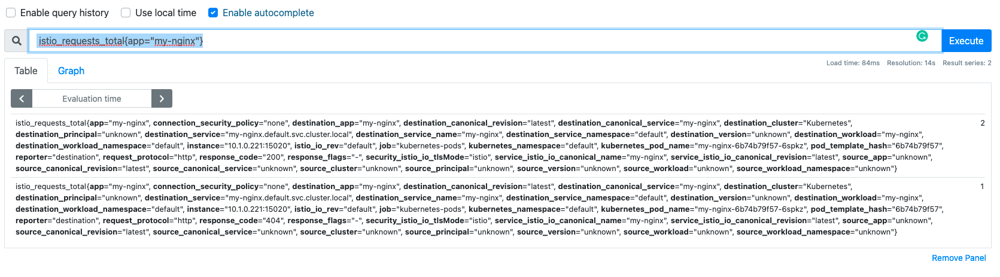 

## **3、Grafana**

### **3-1 Grafana**

* Open platform for analytics and monitoring 
* Connects to Prometheus (and other sources) 
* Monitor health of lstio and apps in the mesh 
* Install from `/samples/addons` folder 
	* `istioctl dashboard grafana `


Grafana是一个用于分析和监控的开放平台。Grafana可以连接到各种数据源，并使用图形、 表格、热图等将数据可视化。通过强大的查询语言，你可以定制现有的仪表盘并创建更高级的可视化。 

通过Grafana，我们可以监控Istio安装和服务网格中运行的应用程序的健康状况。 

我们可以使用grafana . yami来部署带有预配置仪表盘的Grafana示例安装。该YAML文件在Istio安装包的`/samples /addons`下。 

确保在部署Grafana之前部署`Promeheus`插件，因为`Grafana`使用`Prometheus`作为其数据源。 
运行下面的命令来部署`Grafana`和预配置的仪表盘： 

```
$ kubectl apply -f istio-1.10.3/samples/addons/grafana.yaml 

serviceaccount/grafana created
configmap/grafana created
service/grafana created
deployment.apps/grafana created
configmap/istio-grafana-dashboards created
configmap/istio-services-grafana-dashboards created
```

```
$ kubectl get pod -n istio-system
NAME                                   READY   STATUS    RESTARTS   AGE
grafana-56d978ff77-d6m4w               1/1     Running   0          64s
istio-egressgateway-5547fcc8fc-7kj9c   1/1     Running   0          2d4h
istio-ingressgateway-8f568d595-zj9bs   1/1     Running   0          2d4h
istiod-6659979bdf-l7kgk                1/1     Running   0          2d4h
prometheus-8958b965-hpp2v              2/2     Running   0          47h
```

> 这个Grafana。安装不打算在生产中运行，因为它没有经过性能或安全方面的调整。 

Kubernetes将Grafana部署在 `istio-System`命名空间。要访问Grafana，我们可以使用 
`istioctl dashboard`

```
$ istioctl dashboard grafana 
http://localhost:3000 
```

我们可以在浏览器中打开`http://localhost:3000`，进入Grafana。然后，点击首页和istlo文件夹，查看已安装的仪表盘，如下图所示。 

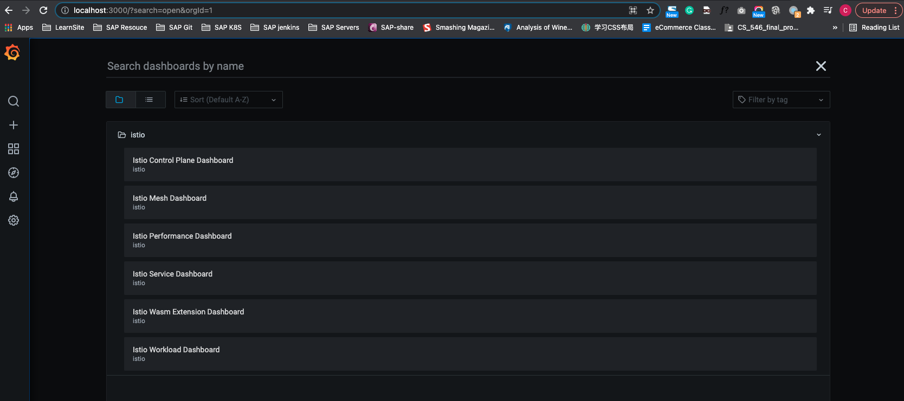 

Istio Grafana安装时预配置了以下仪表盘： 

**1.Istlo控制平面仪表盘** 

从Istio控制平面仪表盘，我们可以监控Istio控制平面的健康和性能。 

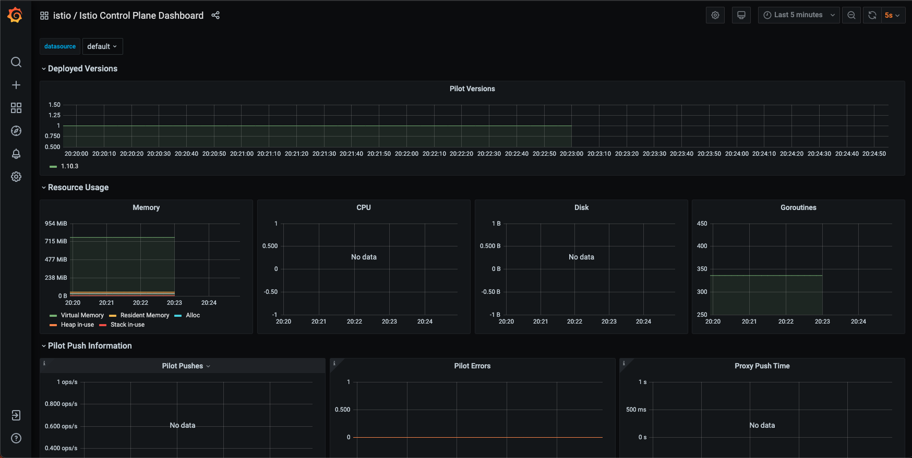 

这个仪表盘将向我们展示控制平面的资源使用情况（内存、CPU'磁盘、Go routines)，以及关于PiIot、 Envoy和Webhook的信息。 

**2.Istio网格仪表盘**

网格仪表盘为我们提供了在网格中运行的所有服务的概览。仪表盘包括全局请求量、成功率以及 4xx和 5xx 响应的数量。 

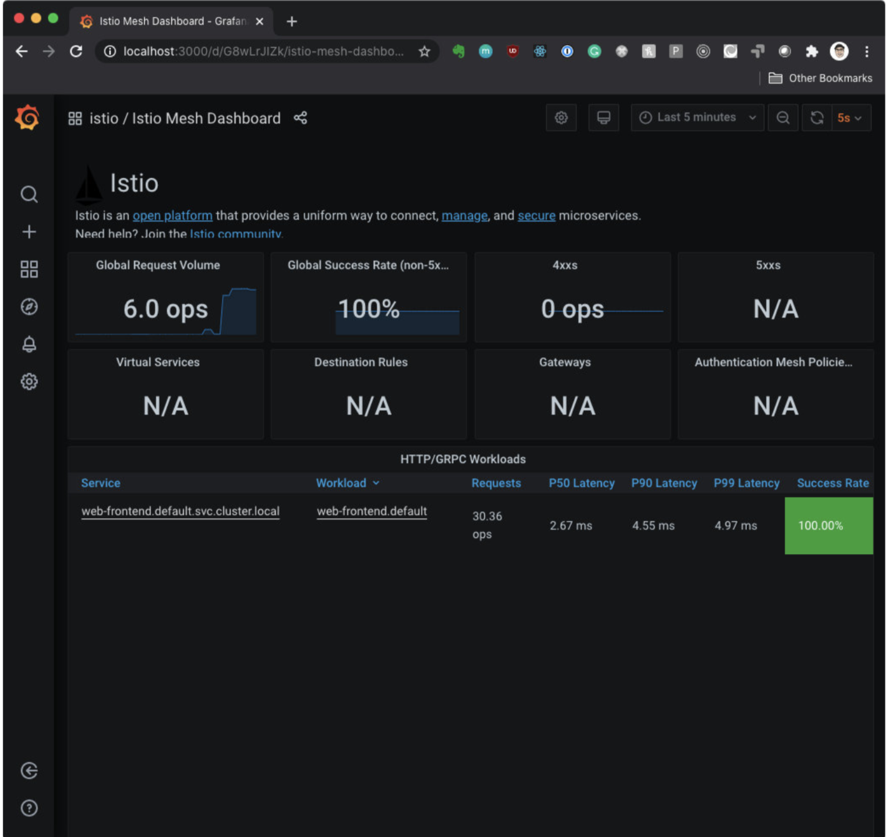 

**3. Istlo性能仪表盘**

性能仪表盘向我们展示了Istio主要组件在稳定负载下的资源利用率。 

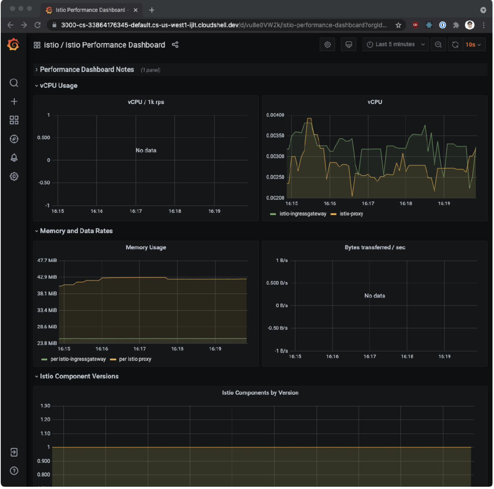 

**4.Istlo服务仪表盘** 

服务仪表盘允许我们在网格中查看服务的细节。 

我们可以获得关于请求量、成功率、持续时间的信息，以及显示按来源和响应代码、持续时间和大小的传入请求的详细图表。 

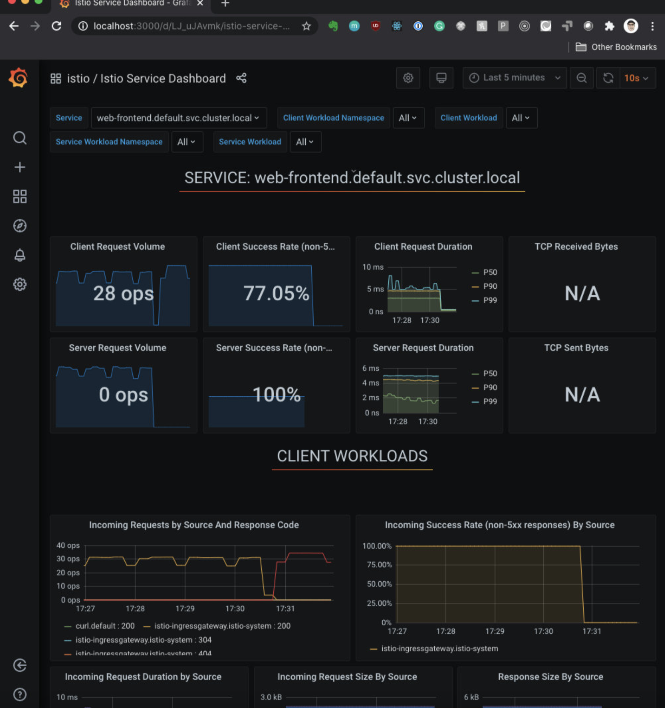 

**5. Istlo Wasm扩展仪表盘**

Istlo Wasm扩展仪表盘显示与WebAssembly模块有关的指标。从这个仪表盘，我们可以监控活动的和创建的Wasm虚拟机，关于获取删除Wasm模块和代理资源使用的数据。 

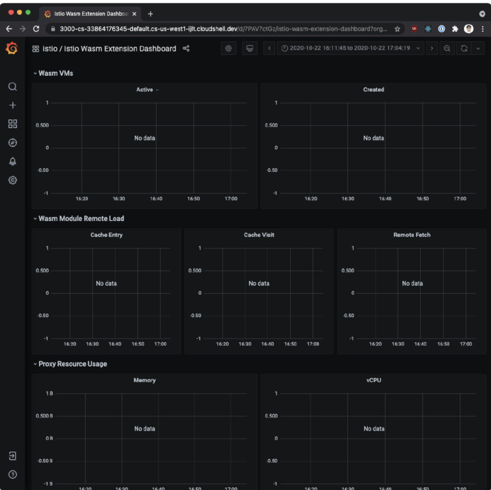 

**6. Istlo工作负载仪表盘**

这个仪表盘为我们提供了一个工作负载的详细指标分类。 

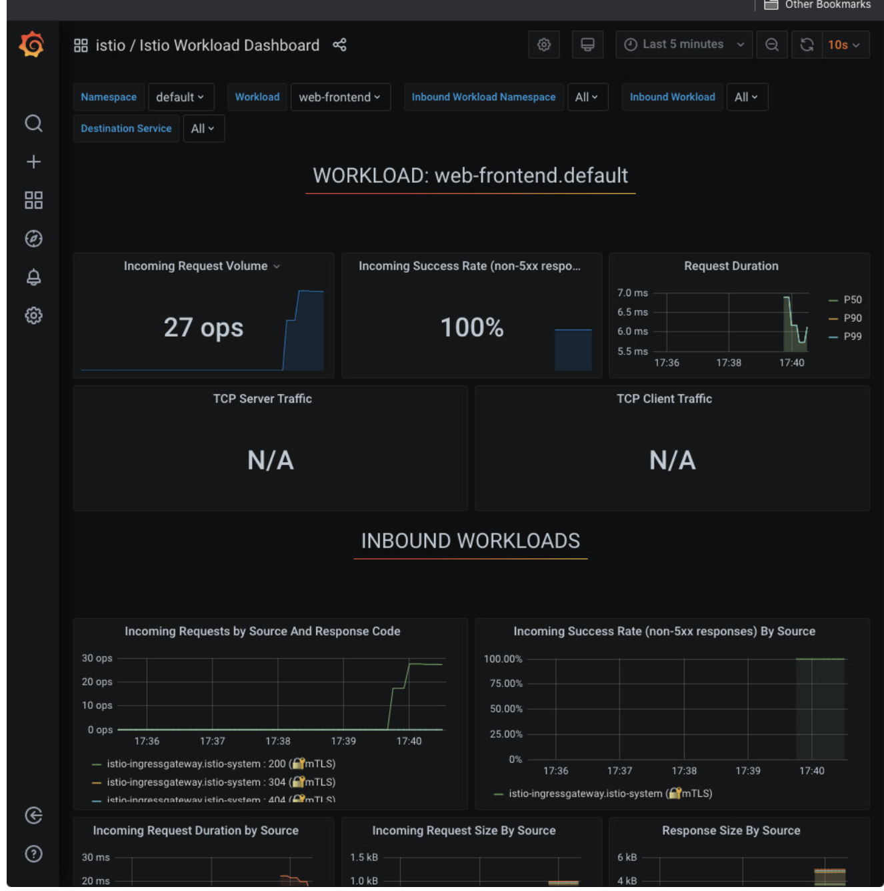 

## **4、Zipkin**

### **4-1 Trace and spans** 

* **Trace**: collection of spans 
* **Span**: name, start/finish timestamp, tags, context 
* **Tags**: applied to all spans, used for querying/filtering 
* Spans are sent to the collector to validate, index & store the data 


分布式追踪是一种监测微服务应用程序的方法。**使用分布式追踪，我们可以在请求通过被监控系统的不同部分时追踪它们**。 

**<mark>每当一个请求进入服务网格时，Envoy都会生成一个唯一的请求ID和追踪信息，并将其作为HTTP头的一部分来存储</mark>**。任何应用程序都可以将这些头信息转发给它所调用的其他服务，以便在系统中创建一个完整的追踪。 

### **分布式追踪是一个跨度（span)的集合。**

当请求流经不同的系统组件时，每个组件都会产生一个跨度。每个跨度都有一个名称，开始和结束的时间戳，一组称为标签（tag）和日志（log) 的键值对，以及一个跨度上下文。 

标签被应用于整个跨度，并用于查询和过滤。下面是我们在使用Zipkin时将看到的几个标签的例子。注意，其中有些是通用的，有些是lstio特有的： 


**Examples:** 

* `istio.mesh_id` 
* `istio.canonical_service` 
* `upstream_cluster` 
* `http.url` 
* `http.status_code`
* `zone`


**单个跨度与识别跨度、父跨度、追踪ID的上下文头一起被发送到一个叫做采集器的组件。采集器对数据进行验证、索引和存储。**

**当请求流经Envoy代理时，Envoy代理会自动发送各个跨度。**

请注意，Envoy只能在边缘收集跨度。我们要负责在每个应用程序中生成任何额外的跨度，并确保我们在调用其他服务时转发追踪头信息。这样一来，各个跨度就可以正确地关联到一个单一的追踪中。 

 

### **4-2 Distributed Tracing with Zipkin**

* Zipkin = distributed tracing system 
* Discover latency and performance issues 
* Requirements: propagate HTTP headers (B3 and Envoy request ID) 
	* Traces captured at service boundaries 
* Instrument your applications 
* Install from `/samples/addons/extras` folder 
	* `istioctl dashboard zipkin`


## **5、使用Zipkin进行分布式追踪**


Zipkin是一个分布式追踪系统。我们可以轻松地监控服务网格中发生的分布式事务，发现任何性能或延迟问题。 

为了让我们的服务参与分布式追踪，我们需要在进行任何下游服务调用时传播服务的HTTP头信息。尽管所有的请求都要经过`Istio sidecar`，

但`Istio`没有办法将出站请求与产生这些请求的入站请求联系起来。通过在应用程序中传播相关的头信息可以帮助Zipkin将这些跟踪信息拼接起来。

 
**Istio依赖于B3跟踪头（以`x-b3`开头的header) 和Envoy生成的请求ID (`x-request-Id`)。B3头信息用于跨服务边界的跟踪上下文传播。**

**以下是我们需要在我们的应用程序中对每个发出的请求进行传播的特定头文件名称**： 

* `x-request-id` 
* `x-b3-traceid` 
* `x-b3-spanid` 
* `x-b3-parentspanid` `
* `x-b3-sampled` 
* `x-b3-flags`
*  `b3` 

> 如果你使用Lightstep，你还需要转发名为`x-ot-span-context`的头。 

**传播头信息最常见的方法是从传入的请求中复制它们，并将它们包含在所有从你的应用程序发出的请求中**

你用Istio服务网格得到的跟踪只在服务边界捕获。为了了解应用程序的行为并排除故障，你需要通过创建额外的跨度（span)来正确检测你的应用程序。 

要安装Zipkin，我们可以使用addons文件夹中的：`zipkin.yaml`文件。 

```
$ kubectl apply -f istio-1.10.3/samples/addons/extras/zipkin.yaml 
deployment.apps/zipkin created
service/tracing created
service/zipkin created
```

我们可以通过运行`getmesh istioctl dashboard zipkin`来打开Zipkin仪表板。在用户界面上，我们可以选择跟踪查询的标准。点击按钮，从下拉菜单中选择`serviceName`，然后选择`customers. default` service，点击搜索按钮（或按回车键），就可以搜索到`trace`信息。 

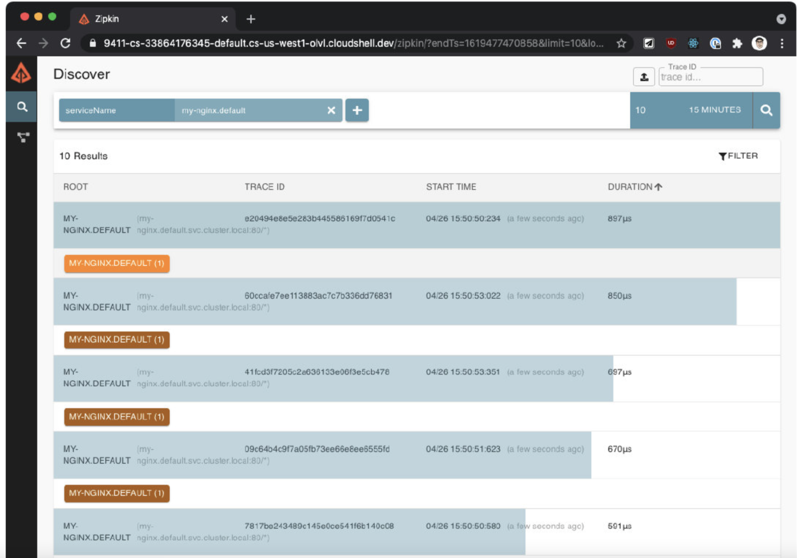 

我们可以点击个别trace来深入挖掘不同的跨度。详细的视图将显示服务之间的调用时间，以及请求的细节，如方法、协议、状态码等。

由于我们只有一个服务在运行（Nginx)，所以你不会看到很多细节。稍后，我们将回到Zipkin，更详细地探索这些trace


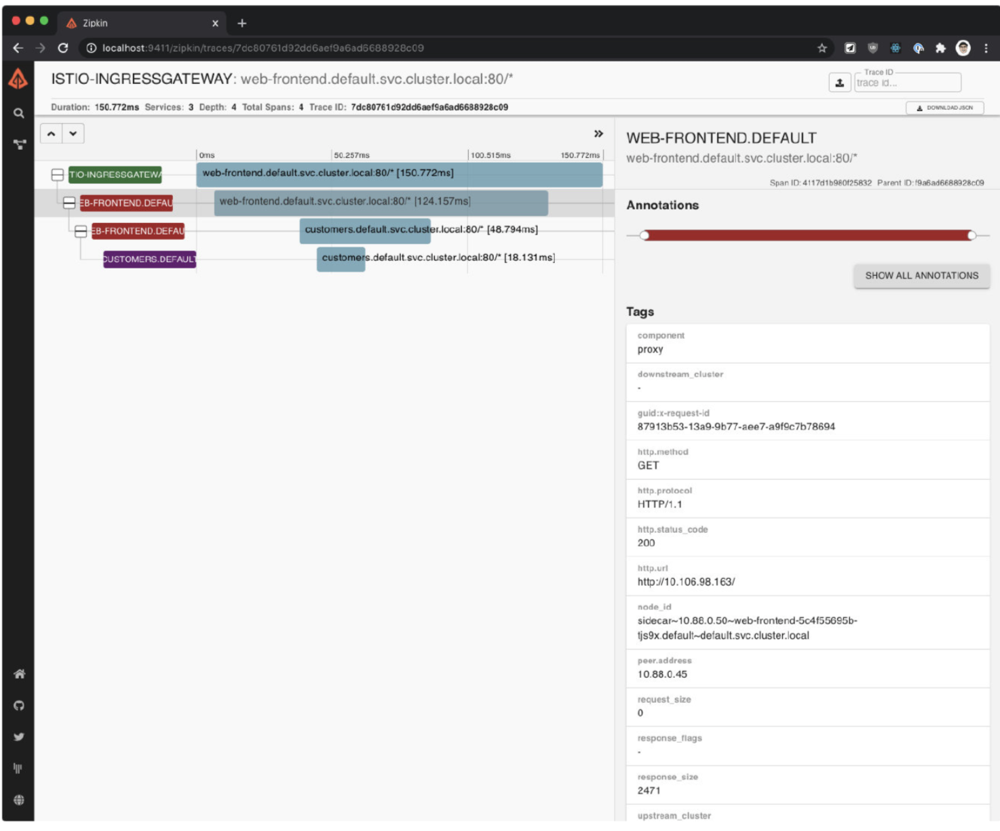 

## **6、Kiali**

**Kiali是一个基于Istio的服务网格的管理控制台**。它提供了仪表盘、可观察性，并让我们通过强大的配置和验证能力来操作网格。它通过推断流量拓扑来显示服务网格，并显示网格的健康状况。

Kiali提供了详细的指标，强大的验证，Grafana访问，以及与`Jaeger`的分布式追踪的强大集成。 

要安装Kiali，请使用`addons`文件夹中的`kiali.yaml`文件：

```
 kubectl apply -f istio-1.10.3/samples/addons/kiali.yaml
```

注意，如果你看到任何错误，例如在版本`monitoringkiali/vlalpha`中没有匹配的`MonitoringDashboard`, 请重新运行`kubectl apply`命令。问题是，在安装CRD（自定 
定义的资源时，可能存在一个匹配条件)。
 
我们可以用`getmesh istioctl dashboard kiali`打开`Kiali`

Kiali可以生成一个像下图这样的服务图。 
 
 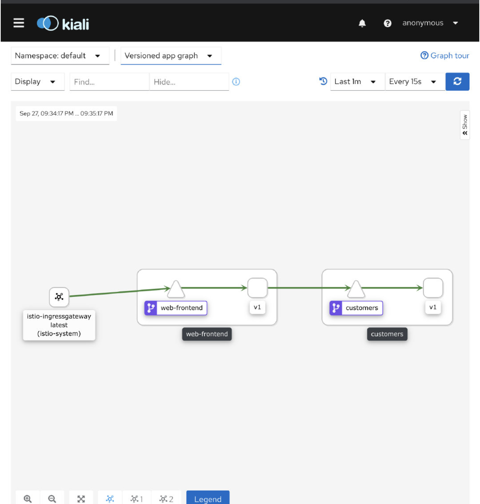 
 
该图向我们展示了服务的拓扑结构，并将服务的通信方式可视化。它还显示了入站和出站的指 标，以及通过连接Jaeger和Grafana（如果安装了）的追踪。图中的颜色代表服务网格的健康状况。红色或橙色的节点可能需要注意。组件之间的边的颜色代表这些组件之间的请求的健康状况。节点形状表示组件的类型，如服务、工作负载或应用程序。 
 
**节点和边的健康状况会根据用户的偏好自动刷新。该图也可以暂停以检查一个特定的状态，或回放以重新检查一个特定的时期。** 

Kiali提供创建、更新和删除Istio配置的操作，由向导驱动。我们可以配置请求路由、故障注入、流量转移和请求超时，所有这些都来自用户界面。如果我们有任何现有的Istio配置已经部署, Kiali可以验证它并报告任何警告或错误。 


## **7、可观测性测试**

**1、Prometheus是用来做什么的？** 

* **A 记录指标，跟踪Istio和网格中的应用程序的健康状况**
* B 可视化服务之间的流量 
* C 采集分布式跟踪 
* D 部署分布式应用 


**2、什么是Zipkin?** 

* **A 分布式追踪系统**
* B 可视化流量的平台 
* C 收集服务日志的框架 
* D 记录Istio服务健康的凭条 

**3、什么是Kiali?**

* A 分布式追踪系统 
* B Grafana插件 
* **C Istio可观测性面板** 
* D 日志收集工具 


**4、你可以使用Istio CLI中的哪个辅助命令来打开 Prometheus/Grafana/Jaeger/Zipkin?** 

* A  `istioctl open dash`
* B `istiocti dashboard open` 
* C `istioctl --dashboard` 
* **D `istioctl dashboard`** 


**5、Istio依靠哪些头信息来进行分布式追踪？**

* A X-headers 
* **B B3 header和Envoy requestID** 
* C Host和User header 
* D Request ID header 

**6、什么是Grafana?**

* A 储存多个来源的日志的解决方案 
* **B Prometheus和其他来源的数据的可视化平台** 
* C 收集分布式追踪的框架 
* D 用于可视化数据的Prometheus插件 

