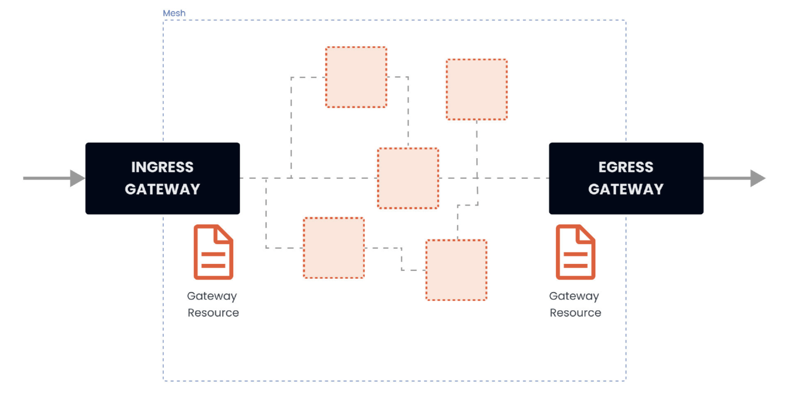
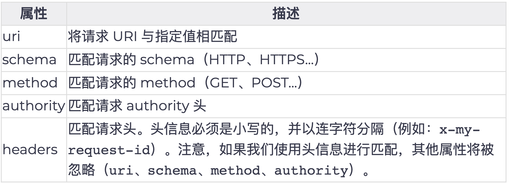

# **第四节 流量管理**

## **0、Traffic Management** 

* Traffic routing 
* Service resiliency and failure injection 
* Envoy filters 
* Labs: 
	* **Exposing services using Gateway resource** 
	* **Observing failure injection and delays** 
	* Simple traffic routing 
	* Advanced traffic routing 
	* Quiz 

## **1、使用Gateway** 

作为 Istio 安装的一部分，我们安装了Istio的入口和出口网关。

这两个网关都运行一个Envoy代理实例，它们在网格的边缘作为负载均衡器运行。入口网关接收入站连接，而出口网关接收 从集群出去的连接。 

**使用入口网关，我们可以对进入集群的流量应用路由规则。我们可以有一个指向入口网关的单一外部IP地址，并根据主机头将流量路由到集群内的不同服务**。 

 

**我们可以使用Gateway资源来配置网关。网关资源描述了负载均衡器的暴露端口、协议、SNI （服务器名称指示）配置等。**

网关资源在背后控制着Envoy代理在网络接口上的监听方式以及它出示的证书。 

下面是一个网关资源的例子： 

```
apiVersion: networking.istio.io/v1alpha3
kind: Gateway
metadata:
  name: my-gateway
  namespace: default
spec:
  selector:
   istio: ingressgateway
  servers:
  - port:
    number: 80
    name: http
    protocol: HTTP
   hosts:
   - dev.example.com
   - test.example.com
```

上述网关资源设置了一个代理，**作为一个负载均衡器**，为入口暴露80端口。

网关配置被应用于`Istio`入口网关代理，我们将其部署到`istio-system`命名空间，并设置了标签`istio:ingressgateway`。

**<mark>通过网关资源，我们只能配置负载均衡器。`hosts`字段作为一个过滤器，只有以`dev.example.com`和`test.example.com`为目的地的流量会被允许通过。</mark>** 

为了控制和转发流量到集群内运行的实际`Kubernetes`服务，我们必须用特定的主机名（例如 `dev.example.com`和`test.example.com`）配置一个`VirtualService`，然后将网关连接到 它。 


 


例如，我们作为Istio安装demo的一部分而部署的Ingress网关创建了一个具有 Load Balancer类型的Kubernetes服务，并为其分配了一个外部IP: 

```
$ kubectl get svc -n istio-system 
NAME                   TYPE           CLUSTER-IP       EXTERNAL-IP   PORT(S)                                                                      AGE
grafana                ClusterIP      10.106.113.25    <none>        3000/TCP                                                                     23h
istio-egressgateway    ClusterIP      10.104.176.79    <none>        80/TCP,443/TCP                                                               3d3h
istio-ingressgateway   LoadBalancer   10.105.159.70    localhost     15021:31875/TCP,80:32344/TCP,443:31252/TCP,31400:31315/TCP,15443:31199/TCP   3d3h
istiod                 ClusterIP      10.96.216.110    <none>        15010/TCP,15012/TCP,443/TCP,15014/TCP                                        3d3h
```


LoadBalancer Kubernetes服务类型的工作方式取决于我们运行Kubernetes集群的方式和地点。对于云托管的集群（GCPS. AWS、 Azure等），在你的云账户中配置了一个负载均衡器资源，Kubernetes LoadBalancer服务将获得一个分配给它的外部IP地址。假设我们正在使用Minikube或DockerDesktop。在这种情况下，外部IP地址将被设置为localhost (Docker Desktop)，或者，如果我们使用Minikube，它将保持待定，我们将不得不使用minikube tunnel命令来获得一个IP地址。 


除了入口网关，我们还可以部署一个出口网关来控制和过滤离开网格的流量。
 
就像我们配置入口网关一样，我们可以使用相同的网关资源来配置出口网关。这使我们能够集中管理所有流出的流量、日志和授权。


## **2、简单路由** 

我们可以使用`VirtualService`资源在Istio服务网格中进行流量路由。

通过`VirtualService`, 我们可以定义流量路由规则，并在客户端试图连接到服务时应用这些规则。例如向`dev.example.com`发送一个请求，最终到达目标服务。 


让我们看一下在集群中运行`customers`应用程序的两个版本（v1和v2）的例子。我们有两个 `Kubernetes` 部署，`customers-v1`和`customers-v2`。

**属于这些部署的Pod有一个标签 `version: v1`或一个标签`version: v2`的设置。**

 


**我们想把VirtualService配置为将流量路由到应用程序的V1版本。70％的传入流量应该被路由到V1版本。30％的请求应该被发送到应用程序的V2版本。**

下面是上述情况下`VirtualService`资源的样子： 

```
apiVersion: networking.istio.io/v1alpha3
kind: VirtualService
metadata:
  name: customers-route
spec:
  hosts:
  - customers.default.svc.cluster.local
  http:
  - name: customers-v1-routes
   route:
   - destination:
     host: customers.default.svc.cluster.local
     subset: v1
    weight: 70
  - name: customers-v2-routes
   route:
   - destination:
     host: customers.default.svc.cluster.local
     subset: v2
    weight: 30
```

在`hosts`字段下，我们要定义流量被发送到的目标主机。在我们的例子中，这就是 `customers.default.svc.cluster.local` Kubernetes服务。 

* **下一个字段是http，这个字段包含一个HTTP流量的路由规则的有序列表。**
* **`destination`是指服务注册表中的一个服务，也是路由规则处理后请求将被发送到的目的地**
* **`Istio`的服务注册表包含所有的Kubernetes服务，以及任何用`ServiceEntry`资源声明的服务。**

 
我们也在设置每个目的地的权重（weight)。权重等于发送到每个子集的流量的比例。所有权重的总和应该是100。如果我们有一个单一的目的地，权重被假定为100。

 
**通过`gateways`字段，我们还可以指定我们想要绑定这个`VirtualService`的网关名称**。比如 说： 


```
apiVersion: networking.istio.io/v1alpha3
kind: VirtualService
metadata:
  name: customers-route
spec:
  hosts:
  	- customers.default.svc.cluster.local
  gateways:
     - my-gateway
  http:
     ...
```

上面的YAML将`customers-route` VirtualService绑定到名为`my-gateway`的网关上。这 有效地暴露了通过网关的目标路由。 

**<mark>当一个`VirtualService`被附加到一个网关上时, 只允许在网关资源中定义的主机。</mark>**

**下表解释了网关资源中的`hosts`字段如何作为过滤器，`VirtualService`中的hosts字段如何作为匹配**

 


## **3、Subset和Destination Rule**

**目的地指的是不同的子集（subset）或服务版本。通过子集，我们可以识别应用程序的不同变体。**

在我们的例子中，我们有两个子集，v1和v2，它们对应于我们customer服务的两个不同版本。每个子集都使用键／值对（标签）的组合来确定哪些Pod要包含在子集中。

**我们可以在一个名为`DestinationRule`的资源类型中声明子集。** 


下面是定义了两个子集的DestinationRule资源的样子。 

```
apiVersion: networking.istio.io/v1alpha3
kind: DestinationRule
metadata:
  name: customers-destination
spec:
  host: customers.default.svc.cluster.local
  subsets:
  - name: v1
   labels:
    version: v1
  - name: v2
   labels:
    version: v2
```


**让我们看看我们可以在DestinationRule中设置的流量策略。** 

### **3-1 Destination Rule中的流量策略** 


通过`DestinationRule`，我们可以定义设置，如负载均衡配置、连接池大小、局部异常检测等，在路由发生后应用于流量。我们可以在trafficPolicy字段下设置流量策略设置。

以下是这些设置：

* 负载均衡器设置 
* 连接池设置 
* 局部异常点检测 
* 客户端TLS设置
* 端口流量策略 

**Traffic Policies**

* Load balancer settings 
* Connection pool settings 
* Outlier detection 
* Client TLS settings 
* Port traffic policy 


**负载均衡器设置** 

通过负载均衡器设置，我们可以控制目的地使用哪种负载均衡算法。下面是一个带有流量策略的DestinationRule的例子，它把目的地的负载均衡算法设置为`round-robin`


```
apiVersion: networking.istio.io/v1alpha3
kind: DestinationRule
metadata:
  name: customers-destination
spec:
  host: customers.default.svc.cluster.local
  trafficPolicy:
   loadBalancer:
    simple: ROUND_ROBIN
  subsets:
  - name: v1
   labels:
    version: v1
  - name: v2
   labels:
    version: v2
```

**我们还可以设置基于哈希的负载均衡，并根据HTTP头、cookies或其他请求属性提供会话亲和性。下面是一个流量策略的片段，它设置了基于哈希的负载均衡**，并使用一个叫做 `location`的`cookie`来实现亲和力。 


```
trafficPolicy:
  loadBalancer:
   consistentHash:
    httpCookie:
     name: location
     ttl: 4s
```

### **3-2 连接池配置** 

这些设置可以在TCP和HTTP层面应用于上游服务的每个主机, **我们可以用它们来控制链接量** 

下面是一个片段，显示了我们如何设置对服务的并发请求的限制。 

```
spec:
  host: myredissrv.prod.svc.cluster.local
  trafficPolicy:
   connectionPool:
    http:
     http2MaxRequests: 50
```

### **3-3 异常点检测** 

异常点检测是一个断路器的实现，它跟踪上游服务中每个主机（Pod)的状态。**<mark>如果一个主机开始返回5xx HTTP错误，它就会在预定的时间内被从负载均衡池中弹出。对于TCP服务，Envoy将连接超时或失败计算为错误</mark>**。 

**下面是一个例子，它设置了500个并发的HTTP2请求（`http2MaxRequests`）的限制，每个连接不超过10个请求（`maxRequestsPerConnection`)到该服务。**

**每5分钟扫描一次上游主机（Pod) (interval)，如果其中任何一个主机连续失败10次 (contracticalErrors),Envoy会将其弹出10分钟（baseEjectionTime)。** 


### **3-4 客户端TLS设置** 

包含任何与上游服务连接的丁LS相关设置。下面是一个使用提供的证书配置mTLS的例子。

```
trafficPolicy:
  tls:
   mode: MUTUAL
   clientCertificate: /etc/certs/cert.pem
   privateKey: /etc/certs/key.pem
   caCertificates: /etc/certs/ca.pem
```

* 其他支持的TLS模式有`DISABLE`（没有TLS连接）, 
* SIMPLE（在上游端点发起TLS连接,） 
* `ISTIO_MUTUAL`（与MUTUAL类似，使用Istio的mTLS证书）

### **3-5 端口流量策略** 

使用`portLevelSettings`字段，我**们可以将流量策略应用于单个端口**。比如说： 

```
trafficPolicy:
  portLevelSettings:
  - port:
    number: 80
   loadBalancer:
    simple: LEAST_CONN
  - port:
    number: 8000
   loadBalancer:
    simple: ROUND_ROBIN
```


## **4、弹性**

弹性（Resiliency）是指在面对故障和对正常运行的挑战时，提供和保持可接受的服务水平的能力。**这不是为了避免故障，而是以一种没有停机或数据丢失的方式来应对故障。弹性的目标 是在故障发生后将服务恢复到一个完全正常的状态**。 


**Provide and maintain an acceptable level of service in the face of faults and challenges to regular operation**. 


* Timeouts 
* Retry policies 
* Configurable on VirtualService 
* Retries 
	* Number of retries 
	* Timeout per try 
	* Conditions to retry on 

Note: endpoint that caused the retry is not included in the LB pool on the next try. 


**使服务可用的一个关键因素是在提出服务请求时使用超时（timeout）和重试（retry）策略。 我们可以在`Istio`的`VirtualService`上配置这两者。** 


**使用超时字段的值，我们可以为HTTP请求定义一个超时。如果请求的时间超过了超时字段中指定的值，Envoy代理将放弃请求，并将其标记为超时（向应用程序返回一个HTTP 408)**。

连接保持开放，除非触发了异常点检测。下面是一个为路由设置超时的例子： 

```
...
- route:
  - destination:
    host: customers.default.svc.cluster.local
    subset: v1
  timeout: 10s
...
```

除了超时之外，我们还可以配置更细化的重试策略。我们可以控制一个给定请求的重试次数每次尝试的超时时间，以及我们想要重试的具体条件。

 
**例如，我们可以只在上游服务器返回5xx响应代码时重试请求，或者只在网关错误（HTTP 5O2、 503或504）时重试，或者甚至在请求头中指定可重试的状态代码。**

重试和超时都发生在客户端。当Envoy重试一个失败的请求时，**最初失败并导致重试的端点就不再包含在负载均衡池中了**。假设Kubernetes服务有3个端点（Pod)，其中一个失败了， 并出现了可重试的错误代码。


当Envoy重试请求时，它不会再向原来的端点重新发送请求。相反，它将把请求发 送到两个没有失败的端点中的一个。 

下面是一个例子，说明如何为一个特定的目的地设置重试策略。 


```
...
- route:
  - destination:
    host: customers.default.svc.cluster.local
    subset: v1
  retries:
   attempts: 10
   perTryTimeout: 2s
   retryOn: connect-failure,reset
...
```


上述重试策略将尝试重试任何连接超时（connect-failure)或服务器完全不响应 (reset)的失败请求。我们将每次尝试的超时时间设置为2秒，尝试的次数设置为10次。

**注意，如果同时设置重试和超时，超时值将是请求等待的最长时间。如果我们在上面的例子中指定了10秒的超时，那么即使重试策略中还剩下一些尝试，我们也只能最多等待10秒**。 


参阅  [x-envoy-retry](https://www.envoyproxy.io/docs/envoy/latest/configuration/http/http_filters/router_filter#x-envoy-retry-on) 


## **5、故障注入** 

为了帮助我们提高服务的弹性，我们可以使用故障注入功能。我们可以在HTTP流量上应用故障注入策略，在转发目的地的请求时指定一个或多个故障注入。
 
有两种类型的故障注入。**我们可以在转发前延迟（delay）请求，模拟缓慢的网络或过载的服务，我们可以中止（abort) HTTP请求**，并返回一个特定的HTTP错误代码给调用者。


通过中止，**我们可以模拟一个有故障的上游服务**。 

**下面是一个中止HTTP请求并返回`HTTP 404`的例子，针对30％的传入请求。**


```
- route:
  - destination:
    host: customers.default.svc.cluster.local
    subset: v1
  fault:
   abort:
    percentage:
     value: 30
    httpStatus: 404
```

**<mark>如果我们不指定百分比，所有的请求将被中止</mark>。请注意，故障注入会影响使用该 VirtualService的服务。它并不影响该服务的所有消费者。** 

同样地，我们可以使用`fixedDelay`字段对请求应用一个可选的延迟。 

```
- route:
  - destination:
    host: customers.default.svc.cluster.local
    subset: v1
  fault:
   delay:
    percentage:
     value: 5
    fixedDelay: 3s
```

**上述设置将对`5％`的传入请求应用3秒的延迟。** 

**<mark>注意，故障注入将不会触发我们在路由上设置的任何重试策略。例如，如果我们注入了一个HTTP 500的错误，配置为HTTP 500上的重试策略将不会被触发。</mark>** 


## **6、高级路由** 

在前面，我们了解了如何利用流量的比例（weight字段）在多个子集之间进行流量路由。在某些情况下，纯粹的基于权重的流量路由或分割已经足够了。然而，在有些场景和情况下，我 们可能需要对流量如何被分割和转发到目标服务进行更细化的控制。 

Istio允许我们使用传入请求的一部分，并将其与定义的值相匹配。例如，**我们可以匹配传入请求的URI前缀，并基于此路由流量**。 

 

 


上述每个属性都可以用这些方法中的一种进行匹配 

* 精确匹配：例如，`exact: "value"`匹配精确的字符串 
* 前缀匹配：例如，`prefix: "value"`只匹配前缀 
* 正则匹配: 例如，`regex: "value"`根据`ECMAscript`风格的正则进行匹配  

例如，假设请求的URI看起来像这样 `https://dev.example.com/v1/api`为了匹配该请求的URI，我们会这样写：  


```
http:
- match:
  - uri:
    prefix: /v1
```


上述片段将匹配传入的请求，并且请求将被路由到该路由中定义的目的地。 

**另一个例子是使用正则并在头上进行匹配**。

```
 http:
 - match:
   - headers:
       user-agent:
         regex: '.*Firefox.*'
```

上述匹配将匹配任何用户代理头与Regex匹配的请求。 

### **6-1 重定向和重写请求** 

在头信息和其他请求属性上进行匹配是有用的，但有时我们可能需要通过请求URI中的值来匹配请求。

* 例如，让我们考虑这样一种情况：传入的请求使用`/v1/api`路径，而我们想把请求路由到 `/v2/api`立湍点。 
* 这样做的方法是重写所有传入的请求和与`/v1/api`匹配的`authority/host headers`到 `/v2/api`。 

例如： 

```
...
http:
  - match:
   - headers:
     my-header:
      exact: hello
   redirect:
    uri: /hello
    authority: my-service.default.svc.cluster.local:8000
...
```


`redirect`和`destination`字段是相互排斥的。如果我们使用redirect，就不需要设置`destination`。 

### **6-2 AND 和 OR语义**

 
在进行匹配时，我们可以使用AND和OR两种语义。让我们看一下下面的片段： 

**AND**

```
...
http:
  - match:
   - uri:
     prefix: /v1
    headers:
     my-header:
      exact: hello
...
```

上面的片段使用的是AND语义。这意昧着URI前缀需要与`/v1`相匹配，并且头信息`my-header`有一个确切的值hello

**OR**


**要使用OR语义，我们可以添加另一个`match`项，像这样：**

```
...
http:
  - match:
   - uri:
     prefix: /v1
   ...
  - match:
   - headers:
     my-header:
      exact: hello
...
```


在上面的例子中，将首先对URI前缀进行匹配，如果匹配，请求将被路由到目的地。 如果第一
个不匹配，算法会转移到第二个，并尝试匹配头。 

**如果我们省略路由上的匹配字段, 它将总是评估为true**


## **7、ServiceEntry**


**通过ServiceEntry资源，我们可以向Istio的内部服务注册表添加额外的条目，使不属于我们网格的外部服务或内部服务看起来像是我们服务网格的一部分**。 

**当一个服务在服务注册表中时，我们就可以使用流量路由、故障注入和其他网格功能，就像我们对其他服务一样。**

### **7-1 ServiceEntry Resource**

* Add entries to Istio's service registry 
* Use traffic routing, failure injection, and other features against external services 


下面是一个`ServiceEntry`资源的例子，它声明了一个可以通过HTTPS访问的外部API 
(`api.external-svc.com`)。 


```
apiVersion: networking.istio.io/v1alpha3
kind: ServiceEntry
metadata:
  name: external-svc
spec:
  hosts:
   - api.external-svc.com
  ports:
   - number: 443
    name: https
    protocol: TLS
  resolution: DNS
  location: MESH_EXTERNAL
```

**`hosts`字段可以包含多个外部API，在这种情况下，Envoy sidecar会根据下面的层次结构来进行检查。如果任何一项不能被检查，Envoy就会转到层次结构中的下一项。**

* HTTP Authority头（在HTTP/2中）和Host头（HTTP/1.1中） 
* SNI
* IP地址和端口 

如果上述数值都无法检查，Envoy会根据Istio的安装配置，盲目地转发请求或放弃该请求。 

### **7-2 WorkloadEntry**

* **Handle migration of VM workloads to Kubernetes** 
* **Specify VM workloads and make them part of Istio's service registry** 

与WorkloadEntry资源一起，**我们可以处理虚拟机工作负载向Kubernetes迁移的问题**。

在Workload Entry中，我们可以指定在虚拟机上运行的工作负载的细节（名称、地址、标签），然后使用ServiceEntry中的`workloadSelector`字段，使虚拟机成为`Istio`内部服务注册表的一部分。 

例如，假设customers的工作负载正在两个虚拟机上运行。此外，我们已经有在Kuternetes中运行的Pod，其标签为`app: customers`

**让我们这样来定义WorkloadEntry资源： **

```
apiVersion: networking.istio.io/v1alpha3
kind: WorkloadEntry
metadata:
  name: customers-vm-1
spec:
  serviceAccount: customers
  address: 1.0.0.0
  labels:
   app: customers
   instance-id: vm1
---
apiVersion: networking.istio.io/v1alpha3
kind: WorkloadEntry
metadata:
  name: customers-vm-2
spec:
  serviceAccount: customers
  address: 2.0.0.0
  labels:
   app: customers
   instance-id: vm2
```

**现在我们可以创建一个`ServiceEntry`资源，该资源同时跨越Kubernetes中运行的工作负载和虚拟机：**

```
apiVersion: networking.istio.io/v1alpha3
kind: ServiceEntry
metadata:
  name: customers-svc
spec:
  hosts:
  - customers.com
  location: MESH_INTERNAL
  ports:
  - number: 80
   name: http
   protocol: HTTP
  resolution: STATIC
  workloadSelector:
   labels:
    app: customers
```

**在location字段中设置`MESH_INTERNAL`，这是说这个服务是网格的一部分。这个值通常用于包括未管理的基础设施（VM）上的工作负载的情况。**

* 这个字段的另一个值， `MESH_EXTERNAL`，用于通过API消费的外部服务。
* `MESH_EXTERNAL`和`MESH_EXTERNAL` 设置控制了网格中的sidecar如何尝试与工作负载进行通信，包括它们是否会默认使用Istio双向TLS。 


## **8、Sidecar** 

默认情况下，**注入的sidecar代理接收所有端口的流量，并且在转发流量时可以到达网格中的任何服务**。 

<mark>在某些情况下，你可能想改变这种配置，配置代理，所以它只能使用特定的端口和访问某些服资源。 要做到这一点，你可以在Istio中使用Sidecar资源</mark> 

Sidecar资源可以被部署到Kubernetes集群内的一个或多个命名空间，但如果没有定义工作负载选择器，每个命名空间只能有一个sidecar资源。 


**Sidecar资源由三部分组成，一个工作负载选择器、一个入口（ingress)监听器和一个出口 
(egress)监听器。**

**Sidecar Resource** 

* Proxies accept traffic on all ports 
* Configure Sidecar to specific ports/services 
* Three parts: 
	* Workload selector 
	* Ingress listener 
	* Egress listener 


### **8-1 工作负载选择器**

**工作负载选择器决定了哪些工作负载会受到sidecar配置的影响**。

你可以决定控制一个命名空间中的所有sidecar，而不考虑工作负载，或者提供一个工作负载选择器，将配置只应用于特定的工作负载。 

例如，这个YAML适用于默认命名空间内的所有代理，因为没有定义选择器。 

```
apiVersion: networking.istio.io/v1alpha3
kind: Sidecar
metadata:
  name: default-sidecar
  namespace: default
spec:
  egress:
  - hosts:
   - "default/*"
   - "istio-system/*"
   - "staging/*"
```

**在egress部分，我们指定代理可以访问运行在`default`、`istio-system`和`Staging`命名空间的服务。**

要将资源仅应用于特定的工作负载，我们可以使用`workloadSelector`字段。 例如，将选择器设置为`version:v1`将只适用于有该标签设置的工作负载。 

```
apiVersion: networking.istio.io/v1alpha3
kind: Sidecar
metadata:
  name: default-sidecar
  namespace: default
spec:
  workloadSelector:
   labels:
    version: v1
  egress:
  - hosts:
   - "default/*"
   - "istio-system/*"
   - "staging/*"
```

### **8-2 入口和出口监听器** 

**资源的入口（ingress)监听器部分定义了哪些入站流量被接受。同样地，通过出口 
(egress)监听器，你可以定义出站流量的属性**。

 
**每个入口监听器都需要一个端口设置，以便接收流量（例如，下面的例子中的3000)和一个默认的端点**。默认端点可以是一个回环IP端点或Unix域套接字。端点配置了流量将被转发到哪里。 

```
...
  ingress:
  - port:
    number: 3000
    protocol: HTTP
    name: somename
   defaultEndpoint: 127.0.0.1:8080
...
```

**上面的片段将入口监听器配置为在端口3000上监听，并将流量转发到服务监听的端口8080上的回环IP。**

**此外，我们可以设置bind字段，以指定一个IP地址或域套接字，我们希望代理监听传入的流量。最后，字段`captureMode`可以用来配置如何以及是否捕获流量。**
 
出口监听器有类似的字段，但增加了`hosts`字段。通过`hosts`字段,  你可以用`default`或 
`namespace/dnsName` 的格式指定服务主机。例如 `myservice.default`或`default/*`。


**在`hosts`字段中指定的服务可以是来自网格注册表的实际服务、外部服务（用`ServiceEntry`定义）,  或虚拟服务。**

```
  egress:
  - port:
    	number: 8080
    	protocol: HTTP
    hosts:
   - "staging/*"
```


通过上面的 YAML，**sidecar 代理了运行在命名空间的服务的 8080 端口的流量**。


## **9、Envoy Filter**

EnvoyFilter资源允许你定制由`Istio Pilot`生成的Envoy配置。**使用该资源，你可以更新数值，添加特定的过滤器，甚至添加新的监听器、集群等等。小心使用这个功能，因为不正确的 定制可能会破坏整个网格的稳定性。** 


过滤器是叠加应用的，这意昧着对于特定命名空间中的特定工作负载，可以有任何数量的过滤器。

**根命名空间（例如`istio-system`)中的过滤器首先被应用，然后是工作负载命名空间中的所有匹配过滤器。**

**下面是一个`EnvoyFilter`的例子，它在请求中添加了一个名为`api-version`的头。** 


```
apiVersion: networking.istio.io/v1alpha3
kind: EnvoyFilter
metadata:
  name: api-header-filter
  namespace: default
spec:
  workloadSelector:
   labels:
    app: web-frontend
  configPatches:
  - applyTo: HTTP_FILTER
   match:
    context: SIDECAR_INBOUND
    listener:
     portNumber: 8080
     filterChain:
      filter:
       name: "envoy.http_connection_manager"
       subFilter:
        name: "envoy.router"
   patch:
    operation: INSERT_BEFORE
    value:
     name: envoy.lua
     typed_config:
      "@type": "type.googleapis.com/envoy.extensions.filters.http.lua.v3.Lua"
      inlineCode: |
       function envoy_on_response(response_handle)
        response_handle:headers():add("api-version", "v1")
       end
```


如果你向`＄GATEWAY_URL`发送一个请求，你可以注意到`api-version`头被添加了，如下所 

```
$ curl -s -I -X HEAD  http://$GATEWAY_URL
HTTP/1.1 200 OK
x-powered-by: Express
content-type: text/html; charset=utf-8
content-length: 2471
etag: W/"9a7-hEXE7lJW5CDgD+e2FypGgChcgho"
date: Tue, 17 Nov 2020 00:40:16 GMT
x-envoy-upstream-service-time: 32
api-version: v1
server: istio-envoy
```
