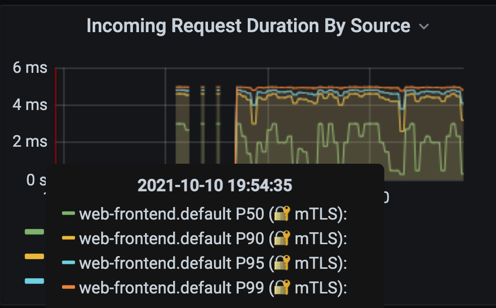
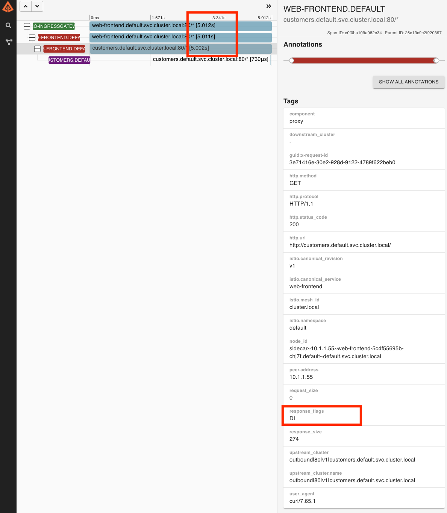
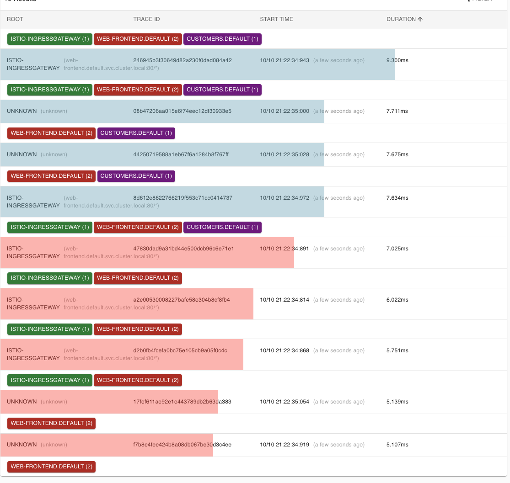
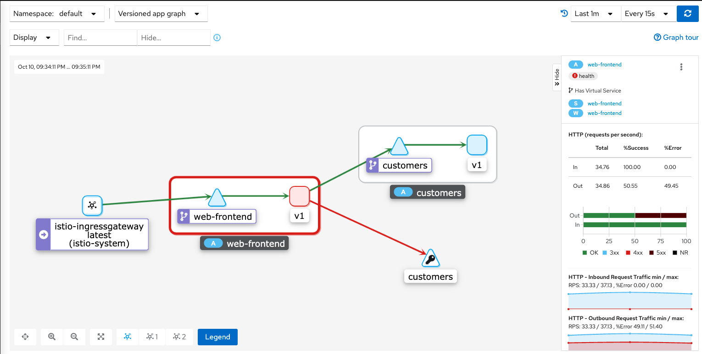
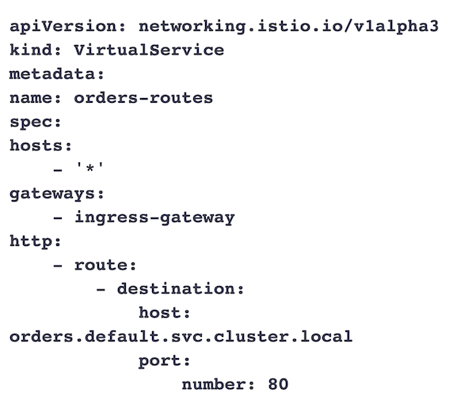

# **第五节 流量管理实验与测试**

## **1、创建部署并使用网关暴露**

在这个实验中，我们将在集群中部署一个Hello World应用程序。

**然后我们将部署一个 Gateway资源和一个与Gateway绑定的VirtualService，以便在外部IP地址上公开该应用程序。** 

让我们先从部署Gateway资源开始。我们将把`hosts`字段设置为`＊`，所以我们可以直接从外部IP地址访问入口网关。如果我们想通过域名访问入口网关，我们可以将`hosts`的值设置为域名（例如`example.com`)，然后将外部IP地址添加到该域名的A记录中。 


**`gateway.yaml`**

```
apiVersion: networking.istio.io/v1alpha3
kind: Gateway
metadata:
  name: gateway
spec:
  selector:
    istio: ingressgateway
  servers:
    - port:
        number: 80
        name: http
        protocol: HTTP
      hosts:
        - '*'
```

```
$ kubectl apply -f gateway-210119-085144.yaml 
gateway.networking.istio.io/gateway created
```

将上述YAML保存为`gateway.yaml`，并使用`kubectl apply -f gateway.yaml` 部署该网关。
 
如果我们试图访问入口网关的外部IP地址，我们将得到一个`HTTP 404`，因为没有任何绑定到网关的`VirtualService`。因为我们还没有定义任何路由，所以入口代理不知道要把流量路由到哪里。 

要获得入口网关的外部iP地址，请运行下面的命令并查看`EXTERNAL-IP`列的值： 

```
$ kubectl get svc -l=istio=ingressgateway -n istio-system
NAME                   TYPE           CLUSTER-IP      EXTERNAL-IP   PORT(S)                                                                      AGE
istio-ingressgateway   LoadBalancer   10.105.159.70   localhost     15021:31875/TCP,80:32344/TCP,443:31252/TCP,31400:31315/TCP,15443:31199/TCP   7d5h
```

在整个课程的其余部分，当我们谈到入口网关的外部IP时，我们将在例子和文本中使用 `GATEWAY URL`。 


下一步是创建`Hello World`部署和服务。 `Hello world`应用程序是一个简单的网站，只是渲染 
"Hello world"

`hello-world.yaml`

```
apiVersion: apps/v1
kind: Deployment
metadata:
  name: hello-world
  labels:
    app: hello-world
spec:
  replicas: 1
  selector:
    matchLabels:
      app: hello-world
  template:
    metadata:
      labels:
        app: hello-world
    spec:
      containers:
        - image: gcr.io/tetratelabs/hello-world:1.0.0
          imagePullPolicy: Always
          name: svc
          ports:
            - containerPort: 3000
---
kind: Service
apiVersion: v1
metadata:
  name: hello-world
  labels:
    app: hello-world
spec:
  selector:
    app: hello-world
  ports:
    - port: 80
      name: http
      targetPort: 3000
```

```
$ kubectl get pod,svc -l=app=hello-world
NAME                              READY   STATUS    RESTARTS   AGE
pod/hello-world-85c8685dd-gf9xf   2/2     Running   0          5m4s

NAME                  TYPE        CLUSTER-IP       EXTERNAL-IP   PORT(S)   AGE
service/hello-world   ClusterIP   10.102.151.188   <none>        80/TCP    5m4s
```

下一步是为`hello-world`服务创建一个`VirtualService`，并将其绑定到`Gateway`资源上： 

```
apiVersion: networking.istio.io/v1alpha3
kind: VirtualService
metadata:
  name: hello-world
spec:
  hosts:
    - "*"
  gateways:
    - gateway
  http:
    - route:
        - destination:
            host: hello-world.default.svc.cluster.local
            port:
              number: 80
```

我们在`hosts`字段中使用`*`，就像我们在Gateway中做的那样。我们还将之前创建的`Gateway`资源（gateway）添加到`gateways`数组中。


**最后，我们指定了一个目的地为 `Kubernetes`服务`hello-world.default.svc.cluster.local`的单一路由。** 


将上述`YAML`保存为`vs-hello-world.yaml`，并使用`kubectl apply -f vs-hello-world.yaml`创建VirtualService。

如果你看一下部署的`VirtualService`, 你应该看到类似的输出： 

```
$ kubectl get vs
NAME          GATEWAYS      HOSTS   AGE
hello-world   ["gateway"]   ["*"]   25s
```

如果我们对`GATEWAY URL`运行`cURL`或在浏览器中打开它，我们将得到`Hello World`的响应： 


```
 curl -v http://localhost
*   Trying 127.0.0.1:80...
* TCP_NODELAY set
* Connected to localhost (127.0.0.1) port 80 (#0)
> GET / HTTP/1.1
> Host: localhost
> User-Agent: curl/7.65.1
> Accept: */*
> 
* Mark bundle as not supporting multiuse
< HTTP/1.1 200 OK
< date: Sat, 09 Oct 2021 14:17:41 GMT
< content-length: 11
< content-type: text/plain; charset=utf-8
< x-envoy-upstream-service-time: 25
< server: istio-envoy
< 
* Connection #0 to host localhost left intact
Hello World
```

另外，注意到server头设置为istio-envoy，告诉我们该请求通过了Envoy代理。 

**清理** 

删除Deployment、 Services VirtualService和Gateway 

```
$ kubectl delete deploy hello-world
deployment.apps "hello-world" deleted

$ kubectl delete service hello-world
service "hello-world" deleted

$ kubectl delete vs hello-world
virtualservice.networking.istio.io "hello-world" deleted

$ kubectl delete gateway gateway
gateway.networking.istio.io "gateway" deleted
```


## **2、在Grafana、 Zipkin和Kiali中观察故障注入和延迟情况**


在这个实验中， 我们将部署Web前端和`Customer V1`服务。然后，我们将在Zipkin、 Kiali 
和Grafana中注入故障和延迟，并观察它们。 

 


**`gateway.yaml`**

```
apiVersion: networking.istio.io/v1alpha3
kind: Gateway
metadata:
  name: gateway
spec:
  selector:
    istio: ingressgateway
  servers:
    - port:
        number: 80
        name: http
        protocol: HTTP
      hosts:
        - '*'
```

```
$ kubectl get svc -l=istio=ingressgateway -n istio-system
NAME                   TYPE           CLUSTER-IP      EXTERNAL-IP   PORT(S)                                                                      AGE
istio-ingressgateway   LoadBalancer   10.105.159.70   localhost     15021:31875/TCP,80:32344/TCP,443:31252/TCP,31400:31315/TCP,15443:31199/TCP   8d
```


将上述YAML保存为`gateway.yaml`并使用`kubectl apply -f gateway.yaml`创建网关。 

接下来，我们将部署`Web Frontend`、`Service`和`VirtualService`


**`web-frontend.yaml`**

```
apiVersion: apps/v1
kind: Deployment
metadata:
  name: web-frontend
  labels:
    app: web-frontend
spec:
  replicas: 1
  selector:
    matchLabels:
      app: web-frontend
  template:
    metadata:
      labels:
        app: web-frontend
        version: v1
    spec:
      containers:
        - image: pj3677/web-frontend:1.0.0
          imagePullPolicy: Always
          name: web
          ports:
            - containerPort: 8080
          env:
            - name: CUSTOMER_SERVICE_URL
              value: 'http://customers.default.svc.cluster.local'

---
kind: Service
apiVersion: v1
metadata:
  name: web-frontend
  labels:
    app: web-frontend
spec:
  selector:
    app: web-frontend
  ports:
    - port: 80
      name: http
      targetPort: 8080

---
apiVersion: networking.istio.io/v1alpha3
kind: VirtualService
metadata:
  name: web-frontend
spec:
  hosts:
    - '*'
  gateways:
    - gateway
  http:
    - route:
        - destination:
            host: web-frontend.default.svc.cluster.local
            port:
              number: 80
```

```
$ kubectl get vs
NAME           GATEWAYS      HOSTS   AGE
web-frontend   ["gateway"]   ["*"]   83s
```

将上述`YAML`保存为`web-frontend.yaml`，并使用`kubect1 apply -f web-frontend.yaml`创建资源。 

最后，我们将部署`Customers v1`和相应的资源。


**`customers-default.yaml`**

```
apiVersion: apps/v1
kind: Deployment
metadata:
  name: customers-v1
  labels:
    app: customers
    version: v1
spec:
  replicas: 1
  selector:
    matchLabels:
      app: customers
      version: v1
  template:
    metadata:
      labels:
        app: customers
        version: v1
    spec:
      containers:
        - image: gcr.io/tetratelabs/customers:1.0.0
          imagePullPolicy: Always
          name: svc
          ports:
            - containerPort: 3000

---
kind: Service
apiVersion: v1
metadata:
  name: customers
  labels:
    app: customers
spec:
  selector:
    app: customers
  ports:
    - port: 80
      name: http
      targetPort: 3000

---
apiVersion: networking.istio.io/v1alpha3
kind: DestinationRule
metadata:
  name: customers
spec:
  host: customers.default.svc.cluster.local
  subsets:
    - name: v1
      labels:
        version: v1

---
apiVersion: networking.istio.io/v1alpha3
kind: VirtualService
metadata:
  name: customers
spec:
  hosts:
    - 'customers.default.svc.cluster.local'
  http:
    - route:
        - destination:
            host: customers.default.svc.cluster.local
            port:
              number: 80
            subset: v1
``` 

```
$ kubectl apply -f customers-210121-151301.yaml 
deployment.apps/customers-v1 created
service/customers created
destinationrule.networking.istio.io/customers created
virtualservice.networking.istio.io/customers created
```


 

### **Delay inject（延迟注入）**


**`customers-delay.yaml`**


```
apiVersion: networking.istio.io/v1alpha3
kind: VirtualService
metadata:
  name: customers
spec:
  hosts:
    - 'customers.default.svc.cluster.local'
  http:
    - route:
        - destination:
            host: customers.default.svc.cluster.local
            port:
              number: 80
            subset: v1
      fault:
        delay:
          percent: 50
          fixedDelay: 5s
```

```
$ kubectl apply -f customersdelay-210121-151301.yaml 
virtualservice.networking.istio.io/customers configured
```

将上述`YAML`保存为`customers-delay.yaml`，并使用`kubectl apply -f customers-delay.yaml`更新`VirtualService`。
 
为了产生一些流量，让我们打开一个单独的终端窗口，开始向`GATEWAY URL`发出无穷的循环请求。

```
while true; do curl http://$GATEWAY_URL/; done


while true; do curl http://127.0.0.1/; done
``` 

我们应该开始注意到一些请求的时间比平时长。让我们打开Grafana并观察这些延迟。 


```
$ istioctl dash grafana
http://localhost:3000
```


当Grafana打开时，点击主页和`Istio Service Dashboard`。在仪表板上，确保在服务下拉菜单中选择`customers.default.svc.cluster.local`

 
如果你展开`Client Workload`面板，你会发现客户端请求持续时间图上的持续时间增加了，如下图所示。 

 


你可以注意到`web-frontend.default.svc.cluster.local`服务方面也有同样的延迟。 

让我们看看这个延迟在`Zipkin`中是如何显示的。 用`istioctl dash zipkin`打开Zipkin。


在主屏幕上，选择`serviceName`和 `web-frontend.default`，然后添加` minDuration`条件， 输入`5S`，点击搜索按钮，找到`trace`

点击其中一个trace，打开详细信息页面。在详情页上，我们会发现持续时间是5秒。 

**单个trace有4个span——点击3个跨度，代表从`web-frontend`到客户服务的请求。** 

你会注意到在细节中，`response_flags`标签设置为`DI`。**"DI”代表”延迟注入”，表示该请求被延迟了**。 

 


### **Fault inject（故障注入）**

让我们再次更新`VirtualService`，这一次，我们将注入一个故障，对50％的请求返回`HTTP 500`。 

```
apiVersion: networking.istio.io/v1alpha3
kind: VirtualService
metadata:
  name: customers
spec:
  hosts:
    - 'customers.default.svc.cluster.local'
  http:
    - route:
        - destination:
            host: customers.default.svc.cluster.local
            port:
              number: 80
            subset: v1
      fault:
        abort:
          httpStatus: 500
          percentage: 
            value: 50
```


将上述YAML保存为`customers一fault.yaml`，然后用

`kubectl apply -f customers-fault.yaml` 更新`VirtualService`。 


就像前面一样，我们将开始注意到来自请求循环的失败。如果我们回到Grafana并打开`Istio Service Dashboard`，

**我们会注意到客户端的成功率在下降，并且在按来源和响应代码划分的传入请求图上`500`响应在增加，如图所示。**

```
$ kubectl apply -f customersfault-210121-151301.yaml 
virtualservice.networking.istio.io/customers configured
```

 

在Zipkin中也有类似的情况。如果我们再次搜索`trace`（我们可以删除最小持续时间），我们会发现有错误的trace会以红色显示，如下图所示。 

 

让我们也打开Kiali (`istioctl dash kiali`)，通过点击Graph项查看服务图。你会注意到web- frontend服务有一个红色的边框，如下图所示。

 

如果我们点击`web-frontend`服务，看看右边的侧边栏，你会发现HTTP请求的细节。图中显示了成功和失败的百分比，这两个数字都在50％左右，这与我们在VirtualService中设置 的百分比值相一致。 

### **清理**

删除DepIoyment、 Services VirtuaIService、 DestinationRule和Gateway

```
$ kubectl delete deploy web-frontend
deployment.apps "web-frontend" deleted


$ kubectl delete svc customers web-frontend
service "customers" deleted
service "web-frontend" deleted
 
$ kubectl delete vs customers web-frontend
virtualservice.networking.istio.io "customers" deleted
virtualservice.networking.istio.io "web-frontend" deleted

$ kubectl delete gateway gateway
gateway.networking.istio.io "gateway" deleted
```


## **3、简单流量路由**

在这个实验中，我们将学习如何使用权重在不同的服务版本之间路由流量。然后，我们将部署 `Customers`服务版本`v2`，并使用子集在这两个版本之间分配流量。 

让我们从部署Gateway开始 

**`gateway.yaml`**

```
apiVersion: networking.istio.io/v1alpha3
kind: Gateway
metadata:
  name: gateway
spec:
  selector:
    istio: ingressgateway
  servers:
    - port:
        number: 80
        name: http
        protocol: HTTP
      hosts:
        - '*'
```

接下来，我们将创建`Web Frontend`和`Customers`服务的部署以及相应的`Kubernetes`服务。让我们首先从`web-frontend`开始： 

**`web-frontend.yaml`**

```
apiVersion: apps/v1
kind: Deployment
metadata:
  name: web-frontend
  labels:
    app: web-frontend
spec:
  replicas: 1
  selector:
    matchLabels:
      app: web-frontend
  template:
    metadata:
      labels:
        app: web-frontend
        version: v1
    spec:
      containers:
        - image: gcr.io/tetratelabs/web-frontend:1.0.0
          imagePullPolicy: Always
          name: web
          ports:
            - containerPort: 8080
          env:
            - name: CUSTOMER_SERVICE_URL
              value: 'http://customers.default.svc.cluster.local'
---
kind: Service
apiVersion: v1
metadata:
  name: web-frontend
  labels:
    app: web-frontend
spec:
  selector:
    app: web-frontend
  ports:
    - port: 80
      name: http
      targetPort: 8080
```

注意，我们正在设置一个名为`CUSTOMER_SERVICE_URL`的环境变量，它指向我们接下来要部署的`customer`服务。We匕Frontend使用这个URL来调用`Customers`服务。 


将上述YAML保存为`web-frontend.yaml`，并使用`kubectl apply -f web-frontend.yaml`创建部署和服务。 

```
$ kubectl apply -f webfrontend-210121-151152.yaml 
deployment.apps/web-frontend created
service/web-frontend created
```

现在我们可以部署`Customers`服务的`v1`版本了。注意我们是如何在Pod模板中设置 `version: v1`标签的。

然而，该服务在其选择器中只使用`app: customers`。

这是因为我们将在`Destination Rule`中创建子集，这些子集将在选择器中应用额外的版本标签，使我们能够到达运行特定版本的`Pod`


**`customers-v1.yaml`**


```
apiVersion: apps/v1
kind: Deployment
metadata:
  name: customers-v1
  labels:
    app: customers
    version: v1
spec:
  replicas: 1
  selector:
    matchLabels:
      app: customers
      version: v1
  template:
    metadata:
      labels:
        app: customers
        version: v1
    spec:
      containers:
        - image: gcr.io/tetratelabs/customers:1.0.0
          imagePullPolicy: Always
          name: svc
          ports:
            - containerPort: 3000
---
kind: Service
apiVersion: v1
metadata:
  name: customers
  labels:
    app: customers
spec:
  selector:
    app: customers
  ports:
    - port: 80
      name: http
      targetPort: 3000
```

```
$ kubectl apply -f customersvs-210121-151152.yaml 
virtualservice.networking.istio.io/customers created
```


将上述内容保存为`custmers-v1.yaml`，并使用`kubectl apply -f customers-v1.yaml`创建部署和服务。 

我们应该有两个应用程序的部署和运行： 

```
$ kubectl get pod
NAME                            READY   STATUS    RESTARTS   AGE
customers-v1-7b5b4b76fc-t8sgx   2/2     Running   0          23h
web-frontend-69b64f974c-lplmx   2/2     Running   0          9m25s
```

现在我们可以为`web-frontend`创建一个`VirtualService`，并将其绑定到Gateway资源上： 

**`web-frontend-vs.yaml`**

```
apiVersion: networking.istio.io/v1alpha3
kind: VirtualService
metadata:
  name: web-frontend
spec:
  hosts:
    - '*'
  gateways:
    - gateway
  http:
    - route:
        - destination:
            host: web-frontend.default.svc.cluster.local
            port:
              number: 80
```

```
$ kubectl apply -f webfrontendvs-210121-151152.yaml 
virtualservice.networking.istio.io/web-frontend created
```

```
$ kubectl get vs
NAME           GATEWAYS      HOSTS   AGE
web-frontend   ["gateway"]   ["*"]   12s
```

 

### **创建V1 and V2两个子集**

如果我们部署了Customers服务`v2`版本，我们在调用 `http://customers.default.svc.cluster.local`，得到的回应将是随机的。它们要么来自`Customers`服务的`v2`版本，要么来自`v1`版本。 

**我们需要为`Customers`服务创建`Destination Rule`，并定义两个子集，代表`v1`和`v2`版本。**

然后，我们可以创建一个`VirtualService`，并将所有流量路由到v1版本的子集。

**之后，我们可以在不影响现有服务的情况下部署v2版本的Customers服务。**

让我们从`Destination Rule`和两个子集开始： 

**`customers-dr.yaml`**

```
apiVersion: networking.istio.io/v1alpha3
kind: DestinationRule
metadata:
  name: customers
spec:
  host: customers.default.svc.cluster.local
  subsets:
    - name: v1
      labels:
        version: v1
    - name: v2
      labels:
        version: v2
```


```
$ kubectl apply -f customersdr-210121-151152.yaml 
destinationrule.networking.istio.io/customers created
```

我们可以创建`VirtualService`并在目标中指定`v1`子集： 

**`customers-vs.yaml`**

```
apiVersion: networking.istio.io/v1alpha3
kind: VirtualService
metadata:
  name: customers
spec:
  hosts:
    - customers.default.svc.cluster.local
  http:
    - route:
        - destination:
            host: customers.default.svc.cluster.local
            port:
              number: 80
            subset: v1
```

```
$ kubectl get vs
NAME           GATEWAYS      HOSTS                                     AGE
customers                    ["customers.default.svc.cluster.local"]   3s
web-frontend   ["gateway"]   ["*"]                                     33m
```


每当有请求被发送到`Kubernetes Customers`服务时，它将被路由到同一服务的v1子集。 

将上述YAML保存为`customers-vs.yaml`，并使用`kubectl apply -f customers-vs.yaml`创建`VirtualService`

### **创建 `V2` 的 Customers Deployment**

现在我们已经准备好部署`v2`版的`Customers`服务了。`v2`版本返回与前一版本相同的客户列表，但它也包括城市名称。 

让我们创建`Customers v2`部署。我们不需要部署`Kubernetes`服务，因为我们已经部署了一个v1版本的服务。 

`customers-v2.yaml`

```
apiVersion: apps/v1
kind: Deployment
metadata:
  name: customers-v2
  labels:
    app: customers
    version: v2
spec:
  replicas: 1
  selector:
    matchLabels:
      app: customers
      version: v2
  template:
    metadata:
      labels:
        app: customers
        version: v2
    spec:
      containers:
        - image: gcr.io/tetratelabs/customers:2.0.0
          imagePullPolicy: Always
          name: svc
          ports:
            - containerPort: 3000
```

```
$ kubectl apply -f customersv2-210121-151152.yaml 
deployment.apps/customers-v2 created
```

该部署与`v1`部署几乎相同。唯一的区别是所使用的`Docker`镜像版本和设置在版本标签上的`v2`值。 
将上述YAML保存为`customers-v2.yaml`创建部署。


并使用`kubectl apply -f customers-v2.yaml` 

让我们使用`weight`字段并修改`virtualService`，使`50％`的流量被发送到`v1子`集，另`50%`发送到`v2`子集。

**<mark>要做到这一点，我们将创建第二个`destination`，有相同的主机名，但有不同的子集。我们还将为`destination`添加`weight:50`，以便在两个版本之间平均分配流量</mark>**

**`customers-50-50.yaml`**

```
apiVersion: networking.istio.io/v1alpha3
kind: VirtualService
metadata:
  name: customers
spec:
  hosts:
    - 'customers.default.svc.cluster.local'
  http:
    - route:
        - destination:
            host: customers.default.svc.cluster.local
            port:
              number: 80
            subset: v1
          weight: 50
        - destination:
            host: customers.default.svc.cluster.local
            port:
              number: 80
            subset: v2
          weight: 50
```


将上述YAML保存为`customers-50-50.yaml`并使用`kubectl apply -f customers-50-50.yaml`更新`VirtualService`。 


**在浏览器中打开`GATEWAY_URL`, 刷新几次页面，看看不同的响应。来自`Customers v2`的响应显示在下图中** 


```
$ kubectl get vs
NAME           GATEWAYS      HOSTS                                     AGE
customers                    ["customers.default.svc.cluster.local"]   16m
web-frontend   ["gateway"]   ["*"]                                     50m
```

 

```
$ istioctl dashboard kiali
http://localhost:20001/kiali
```

 


为了改变发送到一个或另一个版本的流量比例，我们可以更新VirtualService。同样，我们也可以添加`v3`或`v4`版本，并在这些版本之间分割流量。 

### **清理** 

**删除Deployments、 Services、 VirtualServices、 DestinationRule和Gateway**: 

```
kubectl delete -f .
```


## **4、高级流量路由** 

在这个实验中，我们将学习如何使用请求属性多个服务版本之间路由流量。 

我们将从部署Gateway开始： 

**`gateway.yaml`**

```
apiVersion: networking.istio.io/v1alpha3
kind: Gateway
metadata:
  name: gateway
spec:
  selector:
    istio: ingressgateway
  servers:
    - port:
        number: 80
        name: http
        protocol: HTTP
      hosts:
        - '*'
```

```
kubectl apply -f 1gateway.yaml 
gateway.networking.istio.io/gateway created
```

接下来，我们将部署Web前端、`Customersv1`、 `Customersv2`，以及相应的 `Vi rtualServices`和`Destination Rule`。一旦一切部署完毕，所有流量将被路由到`Customers v1`。 

`webfrontend.yaml`

```
apiVersion: apps/v1
kind: Deployment
metadata:
  name: web-frontend
  labels:
    app: web-frontend
spec:
  replicas: 1
  selector:
    matchLabels:
      app: web-frontend
  template:
    metadata:
      labels:
        app: web-frontend
        version: v1
    spec:
      containers:
        - image: gcr.io/tetratelabs/web-frontend:1.0.0
          imagePullPolicy: Always
          name: web
          ports:
            - containerPort: 8080
          env:
            - name: CUSTOMER_SERVICE_URL
              value: 'http://customers.default.svc.cluster.local'
---
kind: Service
apiVersion: v1
metadata:
  name: web-frontend
  labels:
    app: web-frontend
spec:
  selector:
    app: web-frontend
  ports:
    - port: 80
      name: http
      targetPort: 8080
---
apiVersion: networking.istio.io/v1alpha3
kind: VirtualService
metadata:
  name: web-frontend
spec:
  hosts:
    - '*'
  gateways:
    - gateway
  http:
    - route:
        - destination:
            host: web-frontend.default.svc.cluster.local
            port:
              number: 80
```

```
$ kubectl apply -f 2webfrontend.yaml 
deployment.apps/web-frontend created
service/web-frontend created
virtualservice.networking.istio.io/web-frontend created
```

```
apiVersion: apps/v1
kind: Deployment
metadata:
  name: customers-v1
  labels:
    app: customers
    version: v1
spec:
  replicas: 1
  selector:
    matchLabels:
      app: customers
      version: v1
  template:
    metadata:
      labels:
        app: customers
        version: v1
    spec:
      containers:
        - image: gcr.io/tetratelabs/customers:1.0.0
          imagePullPolicy: Always
          name: svc
          ports:
            - containerPort: 3000
---
apiVersion: apps/v1
kind: Deployment
metadata:
  name: customers-v2
  labels:
    app: customers
    version: v2
spec:
  replicas: 1
  selector:
    matchLabels:
      app: customers
      version: v2
  template:
    metadata:
      labels:
        app: customers
        version: v2
    spec:
      containers:
        - image: gcr.io/tetratelabs/customers:2.0.0
          imagePullPolicy: Always
          name: svc
          ports:
            - containerPort: 3000
---
kind: Service
apiVersion: v1
metadata:
  name: customers
  labels:
    app: customers
spec:
  selector:
    app: customers
  ports:
    - port: 80
      name: http
      targetPort: 3000
---
apiVersion: networking.istio.io/v1alpha3
kind: VirtualService
metadata:
  name: customers
spec:
  hosts:
    - 'customers.default.svc.cluster.local'
  http:
    - route:
        - destination:
            host: customers.default.svc.cluster.local
            port:
              number: 80
            subset: v1
---
apiVersion: networking.istio.io/v1alpha3
kind: DestinationRule
metadata:
  name: customers
spec:
  host: customers.default.svc.cluster.local
  subsets:
    - name: v1
      labels:
        version: v1
    - name: v2
      labels:
        version: v2
```

```
$ kubectl apply -f 3customers.yaml 
deployment.apps/customers-v1 created
deployment.apps/customers-v2 created
service/customers created
virtualservice.networking.istio.io/customers created
destinationrule.networking.istio.io/customers created
```

为了确保一切部署和工作正常，打开`GATEWAY_URL`应并确保我们从`Customersv1`获得响应

我们将更新Customers的VirtualService，并更新流量在两个版本的Customers服务之间的路由 
让我们看一下`YAML`，**如果请求中包含一个`header user debug`，就把流量路由到`Customersv2`。如果没有设置这个header，我们就被路由到`Customersv1`**

**`customersvs.yaml`**

```
apiVersion: networking.istio.io/v1alpha3
kind: VirtualService
metadata:
  name: customers
spec:
  hosts:
    - 'customers.default.svc.cluster.local'
  http:
  - match:
    - headers:
        user:
          exact: debug
    route:
    - destination:
        host: customers.default.svc.cluster.local
        port:
          number: 80
        subset: v2
  - route:
      - destination:
          host: customers.default.svc.cluster.local
          port:
            number: 80
          subset: v1
``` 


```
http:
  - match:
    - headers:
        user:
          exact: debug
```


```
$ kubectl get vs
NAME           GATEWAYS      HOSTS                                     AGE
customers                    ["customers.default.svc.cluster.local"]   9m2s
web-frontend   ["gateway"]   ["*"]                                     11m
```
`http://127.0.0.1/`

 


### **header 匹配**


```
apiVersion: networking.istio.io/v1alpha3
kind: VirtualService
metadata:
  name: customers
spec:
  hosts:
    - 'customers.default.svc.cluster.local'
  http:
  - match:
    - headers:
        user:
          exact: debug
    route:
    - destination:
        host: customers.default.svc.cluster.local
        port:
          number: 80
        subset: v2
  - route:
      - destination:
          host: customers.default.svc.cluster.local
          port:
            number: 80
          subset: v1
```

```
$kubectl apply -f 4customersvs.yaml 
virtualservice.networking.istio.io/customers configured
```


如果我们不提供端口号，`VirtualService`中的目的地也会工作。这是因为该服务只定义了一个端口。 

如果我们打开`GATEWAY_URL`，我们仍然应该得到来自`Customers v1`的响应。

如果我们在请求中添加`header user: debug`，我们会注意到`customers`的响应是来自`Customers v2` 

我们可以使用[ModHeader](https://chrome.google.com/webstore/detail/modheader/idgpnmonknjnojddfkpgkljpfnnfcklj?hl=en)扩展来修改浏览器中的头信息。另外，我们也可以使用`cURL`，像这样把头信息添加到请求中。 

 

 


```
$ curl -H "user: debug" http://127.0.0.1/
...
&lt;th class="px-4 py-2"&gt;CITY&lt;/th&gt;
&lt;th class="px-4 py-2"&gt;NAME&lt;/th&gt;
...
```

 

如果我们看一下回复，你会注意到有两栏 
CITY和NAME。 

**清理** 

删除DepIoyment、 Services、 VirtualService、 DestinationRule和Gateway: 

```
$ kubectl delete -f .
```

## **5、流量管理：测试**

**1、我们可以用什么资源配置Istlo ingress gateway?**

* **A Gateway** 
* B VirtualService 
* C Deployment 
* D Service 

`Gateway` :  `istio: ingressgateway`


**2、使用Gateway资源，你可以将流量路由到Kubernetes内部 的一个特定服务。对还是错？** 

* A 对
* **B 错**

`VirtualService`


**3、Istio ingress 网关是作为哪种服务类型部署的？** 

* A ClusterIP 
* B NodePort 
* **C Loadbalancer** 
* D 不是以Service形式部署的

**4、下面的`VirtualService`是做什么的？** 

 

部署在上述VirtualService旁边的Gateway资源： 

 


* **A 将所有进入的流量通过ingress路由到Orders服务** 
* B 什么也不做。它是无效的，因为hosts字段被设置为`＊`。 
* C Routes all traffic from the ingress gateway to the orders service 将所有流量从入口网关路由到Orders服务 
* D 虚拟服务是无效的，因为它只有一个目的地。 


**5、你可以在哪个资源中为HTTP流量指定路由规则？** 

* A DestinationRule 
* **B VirtuaLService** 
* C Gateway 
* D Deployment 


**6、如何定义多个服务版本，以便能够在它们之间进行流量路由？** 

* **A 使用Destination Rule和subset** 
* B 使用VirtualService destinations 
* C 在Gateway定义多个host 
* D 在Pod模板中使用标签 


**7、当使用离群检测时，主机何时会被从负载均衡池中弹出？** 

* A 当不响应时 
* B 当返回HTTP 4xx错误时 
* **C 当返回HTTP 5xx错误时** 
* D 不会被弹出 

**8、在离群检测配置中，间隔设置指的是什么？**

* A. 离群检测开始所需的时间 
* **B. 扫描上游主机时间的间隔**
* C. 异常值被弹出的时间间隔 
* D. 刷新配置的时间间隔 


**9、能将流量策略应用于特定的端口吗？（是/否）** 

* **A 能** 
* B 不能 


**`trafficPolicy: portLevelSettings: port`**


**10、 `ISTIO_MUTUAL`和`MUTUAL TLS`模式之间有什么区别？** 

* A 没有区别 
* B `ISTIO_MUTUAL`需要生产istio配置文件，而MUTUAL不需要。 
* C MUTUAL可以与虚拟机工作负载一起使用，而`ISTIO_MUTUAL`不能 
* **D `ISTIO_MUTUAL`在mTLS中使用Istio的证书，而在`MUTUAL TLS`中你可以用你自己的证书** 

> `ISTIO_MUTUAL`（与MUTUAL类似，使用Istio的mTLS证书）


**11. (Resiliency）就是要避免和防止故障。对还是错？** 

* A 对
* **B 错** 

>  这不是为了避免故障，而是以一种没有停机或数据丢失的方式来应对故障。弹性的目标 是在故障发生后将服务恢复到一个完全正常的状态


**12. Istio的哪两个功能可以帮助我们解决弹性问题？**

* **A 重试策略** 
* B 流量路由 
* C mTLS 
* **D 超时** 
* E 授权策略 


**13 我们是否可以使用标头来指定可收回的状态代码？（是／否）** 


* **A  是**
* B 否

> **例如，我们可以只在上游服务器返回5xx响应代码时重试请求，或者只在网关错误（HTTP 5O2、 503或504）时重试，或者甚至在请求头中指定可重试的状态代码。**


**13 如果一个端点失败并触发重试，会发生什么？** 

* A 什么也不会发生，端点保持在负载均衡池中 
* B Pod重启 
* C 你可以配置重试是否排除端点  
* **D 当Envoy重试请求时，端点被从负载均衡池中排除** 

> 重试和超时都发生在客户端。当Envoy重试一个失败的请求时，**最初失败并导致重试的端点就不再包含在负载均衡池中了**。假设Kubernetes服务有3个端点（Pod)，其中一个失败了， 并出现了可重试的错误代码

**14 你能为同一个请求同时注入延迟和中止吗？（是/否）**

* **A 是**
* B 否


**15 考虑到下面的片段，有多少百分比的请求会被中止？**

```
… 
fault: 
  abort: 
    httpStatus:404 
```
* A 0% 
* **B 100%** 
* C 该片段是无效的 
* D 不清楚，因为百分比未指定 

> <mark>如果我们不指定百分比，所有的请求将被中止</mark>


**16 故障注入是否触发重试策略？（是／否）** 

* A 是
* **B 否**

> **<mark>注意，故障注入将不会触发我们在路由上设置的任何重试策略。例如，如果我们注入了一个HTTP 500的错误，配置为HTTP 500上的重试策略将不会被触发。</mark>**


**17 你可以使用`VirtualService`中的哪个字段将请求重定向到Kubernetes中一个完全不同的服务？** 

* A destination 
* B authority 
* **C redirect**
* D host-redirect 

```
...
http:
  - match:
   - headers:
     my-header:
      exact: hello
   redirect:
    uri: /hello
    authority: my-service.default.svc.cluster.local:8000
...
```


**18  在编写匹配规则时，如何表达AND和OR的语义**？ 

* **A 对于OR，你可以添加一个单独的匹配条目，而对于AND，你在一个单一的匹配条目中包括所有的条件** 
* B 你不能这样做。只允许使用OR语义 
* C 你不能这样做。只允许使用AND语义 
* D 对于OR，在一个单一的匹配条目中包括所有条件，对于AND，添加一个单独的匹配条目 

**19 你可以使用哪种资源来使外部服务成为你的服务网格的一部分？** 

* A Service 
* **B ServiceEntry** 
* C VirtualService 
* D Gateway 

> 通过ServiceEntry资源，我们可以向Istio的内部服务注册表添加额外的条目，使不属于我们网格的外部服务或内部服务看起来像是我们服务网格的一部分


**20 Envoy sidecar检查ServiceEntry资源中的hosts字段的顺序是什么？** 

* A IP地址、端口、SNI、HTTP
* B SNI、 IP地址、端口、HTTP 
* **C HTTP、 SNI、 IP地址、端口** 
* D HTTP、 IP地址、端口、SNI 

```
* HTTP Authority头（在HTTP/2中）和Host头（HTTP/1.1中） 
* SNI
* IP地址和端口 
```

**21 ServiceEntry资源中的workloadSelector字段的目的是什么？** 

* A 从外部集群中选择pod并使其成为Istio内部服务注册表的一部分 
* B 选择Kubernetes服务，使其成为Istio内部服务注册表的一部分 
* **C 要选择WorkloadEntry资源，使虚拟机成为Istio内部服务注册表的一部分** 
* D ServiceEntry没有workloadSelector字段 

> 在Workload Entry中，我们可以指定在虚拟机上运行的工作负载的细节（名称、地址、标签），然后使用ServiceEntry中的`workloadSelector`字段，使虚拟机成为`Istio`内部服务注册表的一部分。

**22 如何配置sidecar代理，使其只对某些服务使用特定的端口？** 

* A 使用Proxy资源 
* B 使用Filter资源 
* C 使用VirtualService资源 
* **D 使用Sidecar资源** 


**23 Sidecar资源中的Ingress和egress监听器字段的目的是什么？** 

* A 要配置哪些流量是sidecar阻断的 
* B 要将ingress和egress网关连接到Sidecar上
* **C 定义哪些入站／出站流量被sidecar接受** 
* D Ingress字段用于配置进入sidecar的流量，而egress字段是不可配置的。 .

```
* Workload selector 
* Ingress listener 
* Egress listener 
```


**24 EnvoyFilters是否用于定制由Pilot生成的Envoy配置？ （是／否）**

* **A 是**
* B 否

> EnvoyFilter资源允许你定制由`Istio Pilot`生成的Envoy配置


**25 当有多个EnvoyFilter部署时，哪些过滤器会先被应用？** 

* A default命名空间中的过滤器 
* **B 根（如istio-system)命名空间的过滤器**
* C 它们是按字母顺序应用的 
* D 它们是根据priority字段来应用的 

> **根命名空间（例如`istio-system`)中的过滤器首先被应用，然后是工作负载命名空间中的所有匹配过滤器。**


**26 如何将VirtualService与Gateway绑定？** 

* A VirtualService中的hosts字段 
* B 将VirtualService和Gateway在同一文件中部署 
* C 无法做到 
* **D 使用gateways字段** 

```
apiVersion: networking.istio.io/v1alpha3
kind: VirtualService
metadata:
  name: hello-world
spec:
  hosts:
    - "*"
  gateways:
    - gateway
  http:
...
```
  
  
**27 可以在VirtualService中配置流量策略。对还是错？** 

* A 对
* **B 错**
  

**28 如果一个端点失败并触发重试，会发生什么**？

* A 什么也不会发生，端点保持在负载均衡池中 
* B Pod重启 
* C 你可以配置是否排除端点
* **D 当Envoy重试请求时，端点被从负载均衡池中排除** 


**29 你可以用Workload Entry资源做什么？**

* A 向Pod中注入故障 
* B 配置外部API 
* **C 处理虚拟机工作负载向Kubernetes的迁移** 
* D 处理虚拟机工作负载的流量路由 
