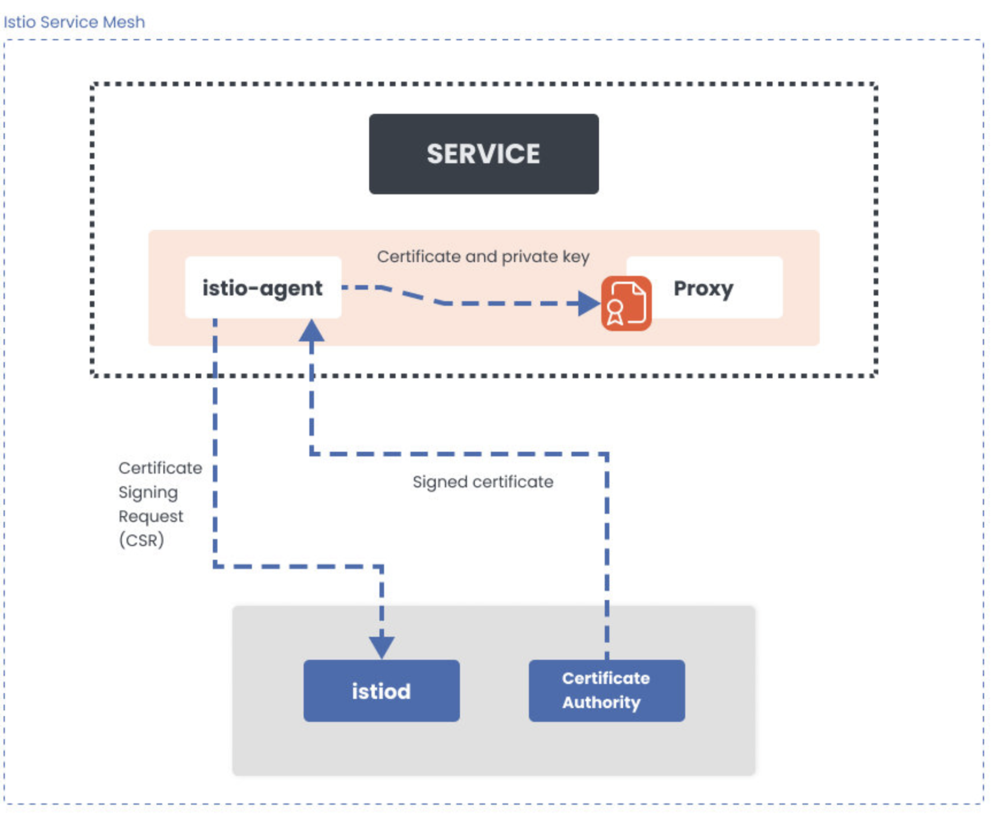
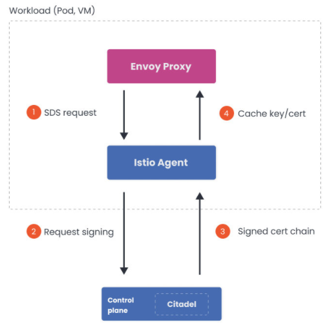
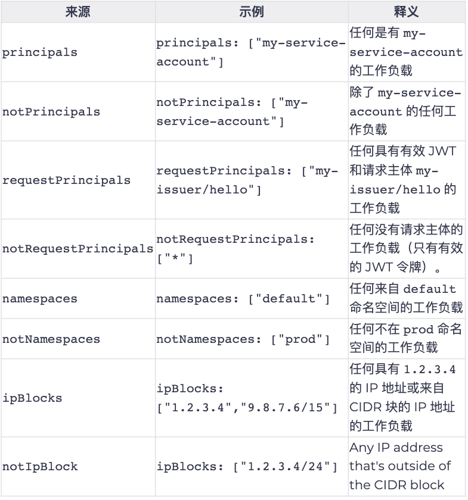
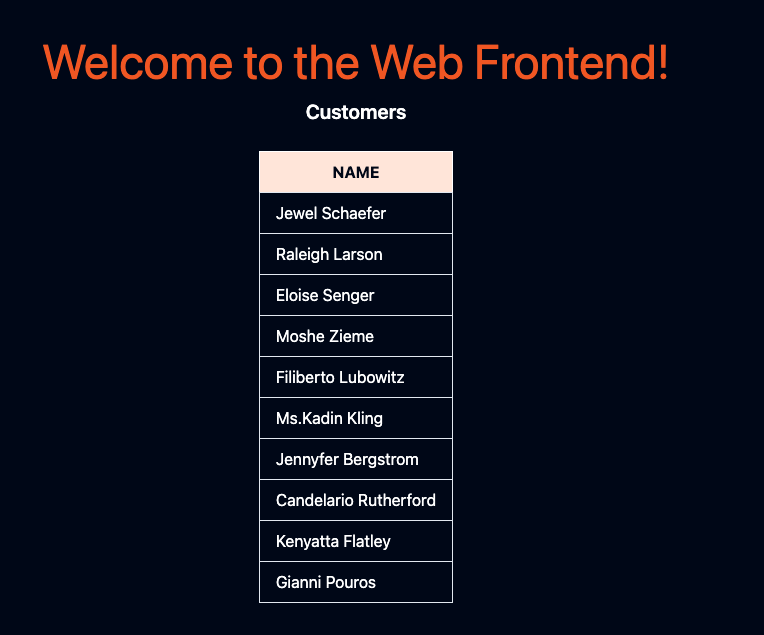
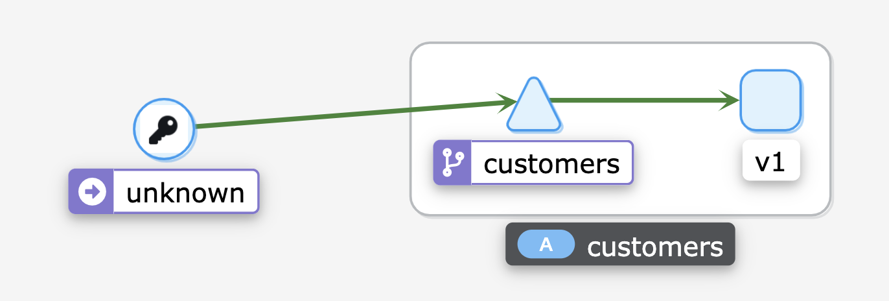
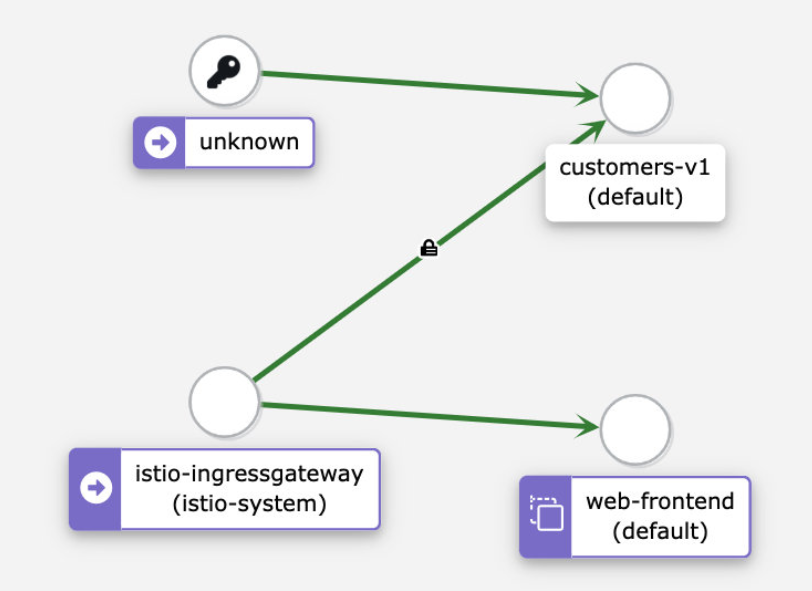

# **第六节 Istio Secuirty**


* Authentication 
* Authorization 
* Mutual TLS, secure naming and identity 
* Labs: 
	* Enabling mutual TLS 
	* Using authorization policies to control access between workloads 
* Quiz 


## **1、认证(Authentication)**

**Authentication** 

* Principal = Kubernetes service 
* Action = HTTP request methods (e.g. GET, POST, DELETE, ...) 
* Object = Kubernetes service 


* All about the principal (service identity) 
* "Validating a credential and ensuring it's both valid and trusted" 


**Identity** 

* Unique identity in Kubernetes = Kubernetes service account 
* X.509 certificate (from SA) + SPIFFE spec = Identity 
	* Naming scheme (spiffe://cluster.localinsidefault/sa/my-sa) 
	* **Encoding names into X.509** 
	* Validating the X.509 to authenticate the SPIFFE identity 


为了解释什么是认证或auth，我们将从访问控制试图回答的问题开始：一个主体能否操作另一个对象？ 


如果我们把上述问题换到Istio和Kubernetes语境，那将是”服务x能否操作服务Y?" 


这个问题的三个关键部分是：**委托人、动作和对象**。 

主体和对象都是Kubernetes中的服务。动作，假设我们谈论的是HTTP，可以是GET、POST或者PUT下请求等等。
 
认证是关于委托人（或者在我们的例子中是服务的身份）的。认证是验证某种凭证的行为，并确保该凭证是有效和可信的。一旦进行了认证，我们就有了一个经过认证的委托人。下次你旅行时，你向海关官员出示你的护照或身份证，他们会对其进行认证，确保你的凭证（护照或身份证）是有效和可信的。 

在Kubernetes中，每个工作负载都被分配了一个独特的身份来与其他每个工作负载进行通信 ―该身份以服务账户的形式提供给工作负载。服务账户是运行时中存在的身份Pod

Istio使用来自服务账户的`X.509`证书，**它根据名为SPIFFE（每个人的安全生产身份框架）**的规范创建一个新的身份。 

**证书中的身份被编码在证书的`Subject alternate name`字段中，它看起来像这样。**

```
spiffe://cluster.local/ns/<pod namespace>/sa/<pod service account>
```

**当两个服务开始通信时，它们需要交换带有身份信息的凭证，以相互验证自己。客户端根据安全命名信息检查服务器的身份，看它是否是服务的授权运行者。**
 
服务器根据授权策略确定客户可以访问哪些信息。此外，服务器可以审计谁在什么时间访问了什么，并决定是否批准或拒绝客户对服务器的调用。 

**安全命名信息包含从服务身份到服务名称的映射。**

服务器身份是在证书中编码的，而服务名称是由发现服务或DNS使用的名称。从一个身份A到一个服务名称B的单一映射意昧着”A被允许和授权运行服务B"。

**<mark>安全命名信息由Pilot生成，然后分发给所有sidecar代理。</mark>** 

## **2、证书创建和轮换**

对于网格中的每个工作负载，Istio提供一个`X.509`证书。


<mark>**一个名为`pilot-agent`的代理在每个Envoy代理旁边运行，并与控制平面（`istiod`）一起工作，自动进行密钥和证书的轮转**</mark>。 

 


**Certificate creation** 

* Istio Agent 
* **Envoy's Secret Discovery Service(SDS)** 
* **Citadel(part of the control plane)** 


**`Istio Agent`与`Envoy sidecar`一起工作通过安全地传递配置和秘密帮助它们连接到服务网格**。即便`Istio`代理在每个pod中运行我们也认为它是控制平面的一部分。

秘钥发现服务(SDS)简化了证书管理。如果没有SDS证书必须作为秘密(Secret) 创建，然后装入代理容器的文件系统中。

当证书过朋时，需要更新秘密，并重新部署代理因为Envoy不会从盘动态重新加载证书。

**当用SDS时SDS服务器将证书推送给Envoy实例。**

**每当证书过期时SDS会推送更新的证书Envoy可以立即便用它们。不需要重新部署代理服务器也不需要中断流量**。

**<mark>在Istio中Istio Agent作为SDS服务器实现了秘密发现服务接口</mark>**

每次我们创建一个新的服务账户时,  Citadel都会为它创建一个SPIFFE身份。

**每当我们安排一个工作负载时， Pilot会用包括工作负载的服务账户在内的初怡化信息来配置其sidecar** 


**当工作负载旁边的Envoy代理启动时， 它会联系Istio代理并告诉它工作负载的服务账户。代理验证该实例生成CSR（证书签名请求Certicate Secret Reuqest）将CSR以及工作负载的服务账户证明（在Kubernetes中是pod的服务账户JWT）发送给Citadel。** 

**Citadel将执行认证和授权并以签名的`X.509`证书作为回应。Istio代理从Citadel获取响应将密钥和证书缓存在内存中并通过`SDS`和`Unix`域套接宇将其提供给`Envoy`。**

<mark>将密钥存储在内存中比存储在磁盘上更安全</mark>；

在使用SDS时，绝不会将任何密钥写入磁盘。Istio代理还定期刷新凭证， 在当前凭证过朋前从Citadel检索任何新的SVID(SPIFFE可验证身份文件） 

 


> SVID是一个工作负效可以用采向资源或调用者证明其身份的文件它必须由一个权威机构签发并包含一个`SPIEFE ID`, 它代表了提出该文件的服务的身份


**解决方案是可扩展的因为流程中的每个组件只负从一部分工作。例如， Envoy负责过期证书，
istio代理负贵生成私钥和CSR. CitadeL负赞授权和签署证书**


## **3、Peer and Request Authentication(对等认证和请求认证)** 

**Peer authentication**

* Peer authentication 
* service-to-service 

**All mTLS about the communication between services**

**Request authentication** 

* end user authentication 
* uses JWTs 


### **3-1 Istio提供两种类型的认证：对等认证和请求认证** 


### **3-2 对等认证**

对等认证用于服务间的认证，以验证建立连接的客户端。 

当两个服务试图进行通信时，双向TLS要求它们都向对方提供证书，因此双方都知道它们在与谁交谈。

**如果我们想在服务之间启用严格的双向TLS，我们可以使用`PeerAuthentication`资源，将`mTLS`模式设置为`STRICT`。** 


**使用PeerAuthentication资源，我们可以打开整个服务网格的双向TLS(mTLS)，而不需要做任何代码修改**。 


然而，Istio也支持一种优雅的模式，我们可以选择在一个工作负载或命名空间内进入双向TLS。**这种模式被称为许可模式**。 


* 当你安装Istio时，**许可模式是默认启用的**。
* 启用许可模式后，如果客户端试图通过双向TLS连接到我，**Istio将提供双向TLS**。
* **如果客户端不使用双向TLS, Istio也可以用纯文本响应**。 
* **你可以允许客户端做或不做mTLS。使用这种模式，你可以在你的服务网格中逐渐推出双向TLS**。 

简而言之，`PeerAuthentication`谈论的是工作负载或服务的通信方式，它并没有说到最终用户。那么，我们怎样才能认证用户呢？ 


### **3-3 请求认证**

 
<mark>请求认证（`RequestAuthentication`资源）验证了附加在请求上的凭证，它被用于终端用户认证。</mark> 

**请求级认证是通过[`JSON Web Tokens (JWT)`](https://jwt.io/)验证完成的**。


Istio支持任何`OpenID Connect`提供商，如AuthO、 Firebase或Google Auth、Keycloak、ORY Hydra。因此，就像我们使用SPIFFE身份来验证服务一样，我们可以使用JWT令牌来验证用户。 


## **4、双向TLS**

**Mutual TLS(mTLS)** 

* **Traffic is re-routed through proxies** 
* Envoy starts an mTLS handshake 
	* Secure naming check is done 

* Once mTLS connection is established: 
	* Request is forwarded to server-side proxy 
	* Server-side forwards traffic to the workload 

**mTLS Behavior** 

* **DISABLE**: no TLS connection 
* **SIMPLE**: originate to the upstream 
* **MUTUAL**: uses mTLS and certs for auth 
* **`ISTIO_MUTUAL`**: like MUTUAL; but uses Istlo's certs for mTLS 


**Permissive mode**

* **Allows services to accpet both plaintext and mTLS** 
* Improves mTLS onboarding experience 
* **Gradually Install/configure sidecars for mTLS** 


### **4-1 双向TLS**

服务中的工作负载之间的通信是通过Envoy代理进行的。当一个工作负载使用mTLS向另一个工作负载发送请求时，Istio会将流量重新路由到sidecar代理（Envoy)。 


然后，`sidecar Envoy`开始与服务器端的`Envoy`进行`mTLS`握手。 

**在握手过程中，调用者会进行安全命名检查，以验证服务器证书中的服务账户是否被授权运行目标服务。一旦`mTLS`连接建立，`Istio`就会将请求从客户端的`Envoy`代理转发到服务器端的`Envoy`代理。**


在服务器端的授权后，sidecar将流量转发到工作负载。 我们可以在服务的目标规则中改变mTLS行为。

* 支持的TLS模式有：`DISABLE（无TLS连接）`
* `SIMPLE`（向上游端点发起TLS连接)
* `MUTUAL`（通过出示客户端证书进行认证来使用 mTLS)
* `ISTIO MUTUAL`（与MUTUAL类似，但使用Istio自动生成的证书进行mTLS)


### **4-2 允许模式** 

**允许模式（Permissive Mode)是一个特殊的选项，它允许一个服务同时接受纯文本流量和 `mTLS`流量。这个功能的目的是为了改善`mTLS`的用户体验。**

默认情况下，Istio使用允许模式配置目标工作负载。Istio跟踪使用Istio代理的工作负载，并自动向其发送mTLS流量。如果工作负载没有代理，Istio将发送纯文本流量。 

**当使用允许模式时，服务器接受纯文本流量和mTLS流量，不会破坏任何东西。允许模式给了我们时间来安装和配置`sidecar`，以逐步发送`mTLS`流量。**

一旦所有的工作负载都安装了`sidecar`，我们就可以切换到严格的`mTLS`模式。要做到这一点，我们可以创建一个`PeerAuthentication`资源。我们可以防止非双向`TLS`流量，并要求所有通信都使用mTLS

我们可以创建`PeerAuthentication`资源，首先在每个命名空间中分别执行严格模式。**<mark>然后，我们可以在根命名空间（在我们的例子中是`istio-system`)创建一个策略，在整个服务网格中执行该策略</mark>**： 

```
apiVersion: security.istio.io/v1beta1
kind: PeerAuthentication
metadata:
  name: default
  namespace: istio-system
spec:
  mtls:
   mode: STRICT
```

**此外，我们还可以指定`selector`字段，将策略仅应用于网格中的特定工作负载。下面的例子 对具有指定标签的工作负载启用`STRICT`模式**： 

```
apiVersion: security.istio.io/v1beta1
kind: PeerAuthentication
metadata:
  name: default
  namespace: my-namespace
spec:
  selector:
   matchLabels:
    app: customers
  mtls:
   mode: STRICT
```


## **5、 授权**

### **Authorization** 

* Can user A send a GET request to `/hello` on service B? 
* **Authn without authz (and vice-versa) is useless** 
* Control authenticated principals with AuthorizationPolicy 


### **Authorization policy** 

* Make use of identities extracted from **PeerAuthentication** and **RequestAuthentication**: 
	* ***requestPrincipals* (users)** 
	* ***principals* (service/peer)** 

* Defined at mesh, namespace, and workload level 


### **Authorization policy**

* Workloads policy applies to 
* Action to take (deny, allow, or audit) 
* Rules when to take action 


### **5-1 授权** 


授权是对访问控制问题中访问控制部分的响应。某个（经过认证的）主体是否被允许操作某个对象？用户A能否向服务B的路径`/hello`发送一个GET请求？ 


请注意，尽管主体可以被认证，但它可能不被允许执行某个动作。你的公司旧卡可能是有效的、真实的，但我不能用它来进入另一家公司的办公室。如果我们继续之前的海关官员的比喻，我们可以说授权类似于你护照上的签证章。
 
这就引出了下一个问题——有认证而无授权（反之亦然）对我们没有什么好处。对于适当的访问控制，我们需要两者。

让我给你举个例子：如果我们只认证主体而不授权他们，他们就可以做任何他们想做的事，对任何对象执行任何操作。相反，如果我们授权了一个请求，但我们没 有认证它，我们就可以假装成其他人，再次对任何对象执行任何操作。 

**<mark>Istio允许我们使用`AuthorizationPolicy`资源在网格、命名空间和工作负载层面定义访问控制。`AuthorizationPolicy` 支持`DENY`、` ALLOW `、 `AUDIT`和`CUSTOM`操作。</mark>**


**每个`Envoy`代理实例都运行一个授权引擎**，在运行时对请求进行授权。当请求到达代理时，引擎会根据授权策略评估请求的上下文，并返回`ALLOW`或`DENY`。

**`AUDIT`动作决定是否记录符合规则的请求。注意`AUDIT`策略并不影响请求被允许或拒绝。**


**没有必要明确地启用授权功能。** 为了执行访问控制，**<mark>我们可以创建一个授权策略来应用于我们的工作负载 `AuthorizationPolicy`资源是我们可以利用`PeerAuthentication`策略和`RequestAuthentication`策略中的主体的地方</mark>**。 


在定义`Authorizationpolicy`的时候，我们需要考虑三个部分． 

* **选择要应用该策略的工作负载** 
* **要采取的行动（拒绝、允许或审计）** 
* **采取该行动的规则** 

我们看看下面这个例子如何与`Authonizationpolicy`资源中的字段相对应．

```
apiVersion: security.istio.io/v1beta1
kind: AuthorizationPolicy
metadata:
 name: customers-deny
 namespace: default
spec:
 selector:
  matchLabels:
   app: customers
   version: v2
 action: DENY
 rules:
 - from:
  - source:
    notNamespaces: ["default"]
```

**<mark>使用`selector`和`matchLabels`，我们可以选择策略所适用的工作负载。</mark>**

在我们的案例中，我们选择的是所有设置了`app: customers`和`version: v2`标签的工作负载。`action`字段被设置为`DENY`
 
**最后，我们在`rules`字段中定义所有规则。我们例子中的规则是说，当请求来自`default`命名空间之外时拒绝`customers v2`工作负载的请求(action)。**

除了规则中的from字段外，**我们还可以使用`to`和`when`字段进一步定制规则。让我们看一个使用这些字段的例子** 

```
apiVersion: security.istio.io/v1beta1
kind: AuthorizationPolicy
metadata:
 name: customers-deny
 namespace: default
spec:
 selector:
  matchLabels:
   app: customers
   version: v2
 action: DENY
 rules:
 - from:
  - source:
    notNamespaces: ["default"]
 - to:
   - operation:
     methods: ["GET"]
 - when:
   - key: request.headers [User-Agent]
    values: ["Mozilla/*"]
```

**我们在规则部分添加了`to`和`when`字段。如果我们翻译一下上面的规则，我们可以说，当客户的GET请求来自`default`命名空间之外，并且`User Agent`头的值与正则表达式`Mozilla/*`相匹配时，我们会拒绝`customers v2`的工作负载**。 

总的来说，`to`定义了策略所允许的行动，`from`定义了谁可以采取这些行动，`when`定义了每个请求必须具备的属性，以便被策略所允许，`selector`定义了哪些工作负载将执行该策略。 

如果一个工作负载有多个策略，**则首先评估拒绝的策略**。评估遵循这些规则： 

1. 如果有与请求相匹配的`DENY`策略，则拒绝该请求 
2. 如果没有适合该工作负载的`ALLOW`策略，则允许该请求 
3. 如果有任何`ALLOW`策略与该请求相匹配，则允许该请求． 
4. 拒绝该请求 

### **5-2 来源**

我们在上述例子中使用的源是`notNameepaces`．我们还可以使用以下任何一个字段来指定请求的来源如表中所示．


 


### **5-4 操作** 

操作被定义在`to`字段下，如果多于一个，则使用AND语义。就像来源一样，操作是成对的，有正反两面的匹配。设置在操作字段的值是字符串

* `hosts`和`notHosts` 
* `ports`和`notPorts` 
* `methods`和`notMethods` 
* `paths`和`notPath` 

所有这些操作都适用于请求属陛。例如，要在一个特定的请求路径上进行匹配，我们可以使用路径。`［"/api/*","/admin"］`或特定的端口`ports: ["8080"]`，以此类推。 

### **5-5 条件** 

**为了指定条件，我们必须提供一个`key`字段。`key`字段是一个`Istio`属性的名称。例如，`requsst.headers`、 `source.ip`、 `destinatisn.port`等等。**

条件的第二部分是`values`或`notValues`的字符串列表。下面是一个`when`条件的片段： 

```
...
 - when:
   - key: source.ip
    notValues: ["10.0.1.1"]
```


## **6、实验1 启用mTLS** 


在这个实验中，我们将部署示例应用程序（WebFrontend和Customers服务）。**Web前端的部署将不包含Envoy代理sidecar，而Customers服务将被注入sidecar**。通过这个设置，我们将看到Istio如何同时发送mTLS和纯文本流量，以及如何将TLS模式改为STRICT。 

让我们从部署一个Gateway资源开始： 

**`1gateway.yaml`**


```
apiVersion: networking.istio.io/v1alpha3
kind: Gateway
metadata:
  name: gateway
spec:
  selector:
    istio: ingressgateway
  servers:
    - port:
        number: 80
        name: http
        protocol: HTTP
      hosts:
        - '*'
```

```
$ kubectl apply -f 1gateway.yaml 
gateway.networking.istio.io/gateway created


$ kubectl get gateway
NAME      AGE
gateway   2m41s
```

接下来，我们将创建`WebFrontend`和`Customers`服务的部署以及相关的`Kubernetes`在服务。开始部署之前，**我们将禁用`default`命名空间中的自动`sidecar`注入， 这样代理就不被注入到`Web`前端部署中。在我们部署`Customers`服务之前，我们将再次启用注入**。 

```
$ kubectl label namespace default istio-injection-
namespace/default labeled
```

**禁用注入后，部署`web-frontend`**


**`2webfrontend.yaml`**

```
apiVersion: apps/v1
kind: Deployment
metadata:
  name: web-frontend
  labels:
    app: web-frontend
spec:
  replicas: 1
  selector:
    matchLabels:
      app: web-frontend
  template:
    metadata:
      labels:
        app: web-frontend
        version: v1
    spec:
      containers:
        - image: gcr.io/tetratelabs/web-frontend:1.0.0
          imagePullPolicy: Always
          name: web
          ports:
            - containerPort: 8080
          env:
            - name: CUSTOMER_SERVICE_URL
              value: 'http://customers.default.svc.cluster.local'
---
kind: Service
apiVersion: v1
metadata:
  name: web-frontend
  labels:
    app: web-frontend
spec:
  selector:
    app: web-frontend
  ports:
    - port: 80
      name: http
      targetPort: 8080
---
apiVersion: networking.istio.io/v1alpha3
kind: VirtualService
metadata:
  name: web-frontend
spec:
  hosts:
    - '*'
  gateways:
    - gateway
  http:
    - route:
        - destination:
            host: web-frontend.default.svc.cluster.local
            port:
              number: 80
``` 

**`3customersv1.yaml`**

```
apiVersion: apps/v1
kind: Deployment
metadata:
  name: customers-v1
  labels:
    app: customers
    version: v1
spec:
  replicas: 1
  selector:
    matchLabels:
      app: customers
      version: v1
  template:
    metadata:
      labels:
        app: customers
        version: v1
    spec:
      containers:
        - image: gcr.io/tetratelabs/customers:1.0.0
          imagePullPolicy: Always
          name: svc
          ports:
            - containerPort: 3000
---
kind: Service
apiVersion: v1
metadata:
  name: customers
  labels:
    app: customers
spec:
  selector:
    app: customers
  ports:
    - port: 80
      name: http
      targetPort: 3000
---
apiVersion: networking.istio.io/v1alpha3
kind: VirtualService
metadata:
  name: customers
spec:
  hosts:
    - 'customers.default.svc.cluster.local'
  http:
    - route:
        - destination:
            host: customers.default.svc.cluster.local
            port:
              number: 80

```

```
$ kubectl apply -f 2webfrontend.yaml 
deployment.apps/web-frontend created
service/web-frontend created
virtualservice.networking.istio.io/web-frontend created
```

如果我们看一下正在运行的Pod，我们应该看到有一个Pod正在运行一个容器，由READY栏中的1/1表示： 

```
$ kubectl get pod
NAME                            READY   STATUS    RESTARTS   AGE
web-frontend-69b64f974c-cr79v   1/1     Running   0          29s
```
启用自动注入： 

```
$ kubectl label namespace default istio-injection=enabled
namespace/default labeled
```


部署Customers服务的`v1`版本 


**`3customersv1.yaml`**

```
apiVersion: apps/v1
kind: Deployment
metadata:
  name: customers-v1
  labels:
    app: customers
    version: v1
spec:
  replicas: 1
  selector:
    matchLabels:
      app: customers
      version: v1
  template:
    metadata:
      labels:
        app: customers
        version: v1
    spec:
      containers:
        - image: gcr.io/tetratelabs/customers:1.0.0
          imagePullPolicy: Always
          name: svc
          ports:
            - containerPort: 3000
---
kind: Service
apiVersion: v1
metadata:
  name: customers
  labels:
    app: customers
spec:
  selector:
    app: customers
  ports:
    - port: 80
      name: http
      targetPort: 3000
---
apiVersion: networking.istio.io/v1alpha3
kind: VirtualService
metadata:
  name: customers
spec:
  hosts:
    - 'customers.default.svc.cluster.local'
  http:
    - route:
        - destination:
            host: customers.default.svc.cluster.local
            port:
              number: 80
```

```
$ kubectl apply -f 3customersv1.yaml 
deployment.apps/customers-v1 created
service/customers created
virtualservice.networking.istio.io/customers created
```

```
$ kubectl get pod
NAME                            READY   STATUS    RESTARTS   AGE
customers-v1-7b5b4b76fc-zttpn   2/2     Running   0          21s
web-frontend-69b64f974c-cr79v   1/1     Running   0          21m
```

如果我们尝试从`GATEWAY_URL`访问网页，我们会得到带有客服人员回应的网页。 

 


访问`GATEWAY_URL`之所以有效，是因为采用了许可模式，纯文本流量被发送到没有代理的服务。在这种清况下，入口网关将纯文本流量发送到Web前端，因为没有代理 


如果我们用`istioctl dashboard kiali`打开Kiali，看一下Graph，你会发现Kiali检测到从入口网关到Web前端的调用。然而，对Customers服务的调用是来自未知的服务。这是因为Web前端旁边没有代理，Istio不知道这个服务是谁、在哪里、是什么。 

 

让我们更新`Customers`的`Virtualservice`并将网关附加到它上面。这将使我们能够直接调用`Customers`的服务 

**`4vscustomersgateway.yaml`**

```
apiVersion: networking.istio.io/v1alpha3
kind: VirtualService
metadata:
  name: customers
spec:
  hosts:
    - 'customers.default.svc.cluster.local'
  gateways:
    - gateway
  http:
    - route:
        - destination:
            host: customers.default.svc.cluster.local
            port:
              number: 80
```

```
$ kubectl apply -f 4vscustomersgateway.yaml 
virtualservice.networking.istio.io/customers configured
```

现在我们可以指定`Host`头了，我们就可以通过入口网关(`GATEWAY_URL`)将请求发送到`Customers`服务：  

```
$ curl -H "Host: customers.default.svc.cluster.local" http://127.0.0.1

[{"name":"Jewel Schaefer"},{"name":"Raleigh Larson"},{"name":"Eloise Senger"},{"name":"Moshe Zieme"},{"name":"Filiberto Lubowitz"},{"name":"Ms.Kadin Kling"},{"name":"Jennyfer Bergstrom"},{"name":"Candelario Rutherford"},{"name":"Kenyatta Flatley"},{"name":"Gianni Pouros"}]
```

 

为了通过Ingress给Web前端和Customers服务产生一些流量，打开两个终端窗口，分别运行一条命令： 

```
// Terminal1
while true; do curl -H "Host: customers.default.svc.cluster.local" http://127.0.0.1; done

// Terminal2
while true; do curl http://127.0.0.1/; done
```

打开Kiali，看一下图表。在Display下拉菜单中，确保我们选中Security选项。你应该看到一个类似于下图的图表 

 


**注意在入口网关和`Customers`服务之间有一个挂锁图标，这意昧着流量是使用mTLS发送的。**

> 如果你没有看到挂锁图, 标请点击`Display`二下拉菜单，确保`Security`选项被选中。 


**然而，在未知的（web前端）和Customers服务之间，以及`istio-ingress-gateway`和`web`前端之间，都没有挂锁。`Istio`在没有注入`sidecar`的清况下向服务发送纯文本流量。**

**让我们看看如果我们在`STRICT`模式下启用`mTLS`会发生什么。**

我们预计从前端到`Customers`服务的调用会开始失败，因为没有注入代理来进行`mTLS`通信。另一方面，从入口网关到`Customers`服务的调用将继续工作 

**`5strictmtls.yaml`**

```
apiVersion: security.istio.io/v1beta1
kind: PeerAuthentication
metadata:
  name: default
  namespace: default
spec:
  mtls:
    mode: STRICT
```

```
$ kubectl apply -f 5strictmtls.yaml 
peerauthentication.security.istio.io/default created
```

如果我们仍然在运行请求循环，我们将开始看到来自`web`前端的`ECONNRESET`错误信息。

**这个错误表明，Customers端关闭了连接。在我们的例子中，这是因为它期待着一个`mTLS`连接**


```
CONNRESET""read ECONNRESET""read ECONNRESET"^C
```

**<mark>另一方面，我们直接向`Customers`服务发出的请求继续工作，因为`Customers`服务旁边有一个`Envoy`代理在运行，它可以进行`mTLS`</mark>**
 
**如果我们删除之前部署的`PeerAuthentication`资源(`kubectl delete peerauthentication default`),Istio就会队复到默认状态（`PERMISSIVE`模式），错误也会消失**


## **7、实验2 访问控制** 

在这个实验中，我们将学习如何使用授权策略来控制工作负载之间的访问。 

首先部署`Gateway`

**`1gateway.yaml`**

```
apiVersion: networking.istio.io/v1alpha3
kind: Gateway
metadata:
  name: gateway
spec:
  selector:
    istio: ingressgateway
  servers:
    - port:
        number: 80
        name: http
        protocol: HTTP
      hosts:
        - '*'
```

```
$ kubectl apply -f 1gateway.yaml 
gateway.networking.istio.io/gateway created
```


接下来我们将创建Web前端部署、服务账户、服务和`VirtualService`. 

**`2webfrontend.yaml`**

```
apiVersion: v1
kind: ServiceAccount
metadata:
  name: web-frontend
---
apiVersion: apps/v1
kind: Deployment
metadata:
  name: web-frontend
  labels:
    app: web-frontend
spec:
  replicas: 1
  selector:
    matchLabels:
      app: web-frontend
  template:
    metadata:
      labels:
        app: web-frontend
        version: v1
    spec:
      serviceAccountName: web-frontend
      containers:
        - image: gcr.io/tetratelabs/web-frontend:1.0.0
          imagePullPolicy: Always
          name: web
          ports:
            - containerPort: 8080
          env:
            - name: CUSTOMER_SERVICE_URL
              value: 'http://customers.default.svc.cluster.local'
---
kind: Service
apiVersion: v1
metadata:
  name: web-frontend
  labels:
    app: web-frontend
spec:
  selector:
    app: web-frontend
  ports:
    - port: 80
      name: http
      targetPort: 8080
---
apiVersion: networking.istio.io/v1alpha3
kind: VirtualService
metadata:
  name: web-frontend
spec:
  hosts:
    - '*'
  gateways:
    - gateway
  http:
    - route:
        - destination:
            host: web-frontend.default.svc.cluster.local
            port:
              number: 80
```

```
$ kubectl apply -f 2webfrontend.yaml 
serviceaccount/web-frontend created
deployment.apps/web-frontend created
service/web-frontend created
virtualservice.networking.istio.io/web-frontend created
```

**`3customersv1.yaml`**

```
apiVersion: apps/v1
kind: Deployment
metadata:
  name: customers-v1
  labels:
    app: customers
    version: v1
spec:
  replicas: 1
  selector:
    matchLabels:
      app: customers
      version: v1
  template:
    metadata:
      labels:
        app: customers
        version: v1
    spec:
      containers:
        - image: gcr.io/tetratelabs/customers:1.0.0
          imagePullPolicy: Always
          name: svc
          ports:
            - containerPort: 3000
---
kind: Service
apiVersion: v1
metadata:
  name: customers
  labels:
    app: customers
spec:
  selector:
    app: customers
  ports:
    - port: 80
      name: http
      targetPort: 3000
---
apiVersion: networking.istio.io/v1alpha3
kind: VirtualService
metadata:
  name: customers
spec:
  hosts:
    - 'customers.default.svc.cluster.local'
  http:
    - route:
        - destination:
            host: customers.default.svc.cluster.local
            port:
              number: 80
```

```
$ kubectl apply -f 3customersv1.yaml 
deployment.apps/customers-v1 created
service/customers created
virtualservice.networking.istio.io/customers created
```

```
$ kubectl get vs
NAME           GATEWAYS      HOSTS                                     AGE
customers                    ["customers.default.svc.cluster.local"]   6s
web-frontend   ["gateway"]   ["*"]                                     19s
```

如果我们尝试从`GATEWAY_URL`访问网页，我们会得到带有客服人员回应的网页。 

 

### **7-1 授权策略拒绝**

让我们先创建一个授权策略拒绝`default`命名空间的所有请求 

**`4denyall.yaml`**

```
apiVersion: security.istio.io/v1beta1
kind: AuthorizationPolicy
metadata:
 name: deny-all
 namespace: default
spec:
  {}
```

```
$ kubectl apply -f 4denyall.yaml 
authorizationpolicy.security.istio.io/deny-all created
```
如果我们尝试从`GATEWAY_URL`访问网页。

```
RBAC: access denied
```

同样如果我们试图在集群内运行一个Pod并从`default`命名空间内向`Web`前端或`customers`服务提出请求我们会得到同样的错误 

```
$ kubectl run curl --image=radial/busyboxplus:cur
l -i --ttykubectl run --generator=deployment/apps.v1 is DEPRECATED and will be removed in a futu
re version. Use kubectl run --generator=run-pod/v1 or kubectl create instead.
If you don't see a command prompt, try pressing enter.

[ root@curl-6cd5b579fb-2xcx9:/ ]$ curl customers
RBAC: access denied
[ root@curl-6cd5b579fb-2xcx9:/ ]$ curl web-frontend
RBAC: access denied
```

在这两种情况下我们都得到了拒绝访问的错误 

### **7-2 ALLOW 动作允许从入口网关向web-frontend**

**我们要做的第一件事是使用`ALLOW`动作允许从入口网关向`web-frontend`应用程序发送请求**。在规则中我们指定了入口网关运行的源命名空间（`istio-system`）和入口网关的服务账户名称 


`5allow-webfrontend-customers.yaml`

```
apiVersion: security.istio.io/v1beta1
kind: AuthorizationPolicy
metadata:
  name: allow-ingress-frontend
  namespace: default
spec:
  selector:
    matchLabels:
      app: web-frontend
  action: ALLOW
  rules:
    - from:
        - source:
            namespaces: ["istio-system"]
        - source:
            principals: ["istio-ingressgateway-service-account"]
```

```
- source:
    principals: ["cluster.local/ns/istio-system/sa/istio-ingressgateway-service-account"]
```


```
$ kubectl apply -f 5allowingressfrontend.yaml 
authorizationpolicy.security.istio.io/allow-ingress-frontend created
```

```
$ curl http://127.0.0.1
"Request failed with status code 403"
```

> 请注意策峪需要几秒钟才能分发到所有代理所以你可能仍然会看到`node: access denied`的消息时间为几秒钟 

这个错误来自`customers`服务——记得我们允许调用Web前端。

**然而`web-fronted`仍然不能调用`customers`服务 
如果我们回到我们在集群内运行的`curl Pod`尝试请求`http://web-fronted`我们会得到一个RBAC错误。DENY策略是有效的我们只允许从入口网关进行调用**


当我们部署Web前端时我们也为Pod创建了一个服务账户（否则命名空间中的所有Pod都被分配了默认的服务账户）。现在我们可以使用该服务账户来指定customers服务调用的来源． 

**`6allowwebfrontendcustomers.yaml`**

```
apiVersion: security.istio.io/v1beta1
kind: AuthorizationPolicy
metadata:
  name: allow-web-frontend-customers
  namespace: default
spec:
  selector:
    matchLabels:
        app: customers
        version: v1
  action: ALLOW
  rules:
  - from:
    - source:
        namespaces: ["default"]
    - source:
        principals: ["web-frontend"]
```

```
principals: ["cluster.local/ns/default/sa/web-frontend"]
```

```
$ kubectl apply -f 6allowwebfrontendcustomers.yaml 
authorizationpolicy.security.istio.io/allow-web-frontend-customers created
```

一旦策略被创建我们将看到Web前端再次工作―它将获得customers服务的回应 

```
$ curl http://127.0.0.1
<!DOCTYPE html>
...
```

我们使用了多个授权策略明确地允许队入口到前端以及队前端到`customers`服务的调用。 使用`deny-all`策略是一个很好的开始因为我们可以控制、管理然后明确地允许我们希望在服务之间发生的通信 

## **8、安全测试**

**1、在通信时，Envoy代理使用什么作为凭证？** 

* A 用户和密码
* B API秘钥
* C Token
* **D X509证书** 

> Validating the X.509 to authenticate the SPIFFE identity


**2、哪个组件为一个服务账户创建SPIFFE身份？** 

* A Pilot
* **B Citadel**
* C Mixer
* D Envoy SDS

> 每次我们创建一个新的服务账户时,  Citadel都会为它创建一个SPIFFE身份。


**3、你会使用哪种资源来启用命名空间中的严格mTLS模式？**

* A IstioAuth
* B ClusterRole
* **C PeerAuthentication**
* D Auth

```
apiVersion: security.istio.io/v1beta1
kind: PeerAuthentication
metadata:
  name: default
  namespace: default
spec:
  mtls:
    mode: STRICT
```

**4、AuthorizationPolicy资源中使用哪两个动作？** 

* ACCPET和RJECT
* VALIDATE和CANCEL
* DENY和ACCEPT 
* **DENY和ALLOW**

> **每个`Envoy`代理实例都运行一个授权引擎**，在运行时对请求进行授权。当请求到达代理时，引擎会根据授权策略评估请求的上下文，并返回`ALLOW`或`DENY`

**5、当秘密发现服务（SDS)更新证书时，是否需要重新部署代理以使用新证书。** 

* A 是 
* **B 否** 

**6、AUDIT动作的目的是什么？** 

* A 记录和拒绝请求．
* **B 记录请求**
* C 发送谓求通知
* D 记录和允许请求

> **`AUDIT`动作决定是否记录符合规则的请求。注意`AUDIT`策略并不影响请求被允许或拒绝。**

**7、什么是允许模式（permissive mode)?**

* **A 一个允许服务同时接受纯文本流最和mTLS流量的选项**
* B 一个允许服务只接受明文流量的选项 
* C一个允许用户直接向服务提出请求的选项 
* D 一个允许你便用基于令牌的认证的选项 

> **Allows services to accpet both plaintext and mTLS**

8、是否可以在Istio中使用JSON Web Tokens (JWTs)? 

* **A 是**
* B 否

9、选择三个负贵在运行时创建身份的组件

* **A Citedel** 
* **B lstio Agent**
* **C Envoys Secret Discovery Service**
* D Pilot 
* E citadel-agent
* E Envoy proxy

10、使用许可模式可以改善mTLS的上机体验。

* **是**
* 否

**11、 Istlo Agent的工作是什么？** 

* **A 与Envoy sidecar合作，通过专递配置和秘密，帮助他们链接到Service mesh** 
* B 与Istio PIot合作，配置Citadel
* C 与Citadel合作，在Ku bernetes的秘密中对证书进行编码 
* D 验证`ISTIO_MUTUAL`配置 

> **`Istio Agent`与`Envoy sidecar`一起工作通过安全地传递配置和秘密帮助它们连接到服务网格**


**12、Istlo提供哪两种类型的认证？** 

* **A 对等和请求认证**
* B JWT令牌和密码认证 
* C Istio只提供对等认证 
* D 多因素认证和寡于证书的认证 

**13 Istlo代理将密钥和证书存储在哪里？**

* 磁盘 
* Secret中 
* **内存** 
* 钥匙和证书不存储在任何地方 


> Istio代理从Citadel获取响应将密钥和证书缓存在内存中并通过`SDS`和`Unix`域套接宇将其提供给`Envoy`。
> 
> <mark>将密钥存储在内存中比存储在磁盘上更安全</mark>；
> 
> 在使用SDS时，绝不会将任何密钥写入磁盘。Istio代理还定期刷新凭证， 在当前凭证过朋前从Citadel检索任何新的SVID(SPIFFE可验证身份文件） 

**15 哪种代理与istiod一起工作，以实现钥匙和证书轮换的自动化**

* A envoy-agent 
* **B pilot-agent** 
* C citadel-agent 
* D sds-agent 

> <mark>**一个名为`pilot-agent`的代理在每个Envoy代理旁边运行，并与控制平面（`istiod`）一起工作，自动进行密钥和证书的轮转**</mark>。 


**16、安全命名信息包含哪些内容？**

* **A 从服务身份到服务名称的映射** 
* B 加密的Kubernetes secret 
* C Base64编码的服务名称 
* D 密码和证书 

 **安全命名信息包含从服务身份到服务名称的映射。**

**17、如果一个工作负载有多个策略，哪些策略会先被评估？**

* **Deny 策略**
* ALLOW策略 
* AUDIT策略 
* 策略是随机评估的

> 如果一个工作负载有多个策略，**则首先评估拒绝的策略**。


**18、你如何在Istio中启用授权功能？**

* A 创建PeerAuthentication 资源
* B 配置RBAC
* C 部署AuthPolicv资源 
* **D 不需要明确地启用该功能**

> **没有必要明确地启用授权功能。** 为了执行访问控制，**<mark>我们可以创建一个授权策略来应用于我们的工作负载 `AuthorizationPolicy`资源是我们可以利用`PeerAuthentication`策略和`RequestAuthentication`策略中的主体的地方</mark>**。

**19、Istio如何验证用户／进程的身份？** 

* A 通过提示密码（用户）和API秘钥（过程）
* B 通过使用PeerAuthentication资源 
* **C 通过从请求中提取凭证** 
* D 通过第三方服务


**20、在Kubernetes中，哪个资源代表工作负载身份？**

* A 用户对象
* **B Service Account**
* C Context
* D 证书

**21 你如何在整个网格中强制执行严格的mTLS模式？** 

* A 通过部署一个ClusterRoIe并将mode字段设置为MUTUAL 
* B 通过部署一个DestinationRule并将policy设置为`ISTIO_ MUTUAL`
* C 你不能在全局范围内执行严格的mTLS（只在每个命名空间） 
* **D 通过将`PeerAuthentication`资源部署到根命名空间(Istlo system）中**

> 我们可以创建`PeerAuthentication`资源，首先在每个命名空间中分别执行严格模式。**<mark>然后，我们可以在根命名空间（在我们的例子中是`istio-system`)创建一个策略，在整个服务网格中执行该策略</mark>**： 

**22 对等认证是用来做什么的？** 

* A 用户认证
* B 数据平面和控制平面之间的认证 
* C 对虚拟机工作负载的Envoy代理进行认证 
* **D 服务间认证**

**23 如果Kubernetes工作负载没有Envoy代理，Istio是否会发送mTLS流量？** 

* A 是
* **B 否**


**24 Authorization Policy资源中的selector和matchLabel字 段有什么用途？**

* A 要把工作负载从策略中排除出去 
* **B 要选择策略适用的工作负载** 
* C 要拒绝选定的工作负载 
* D 允许选定的工作负载 


