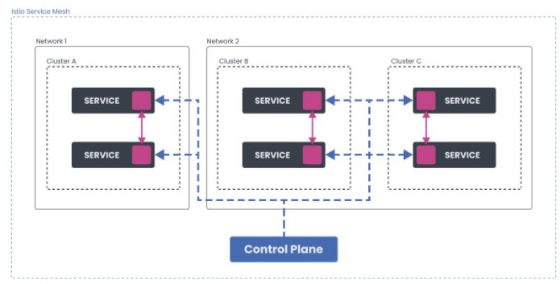
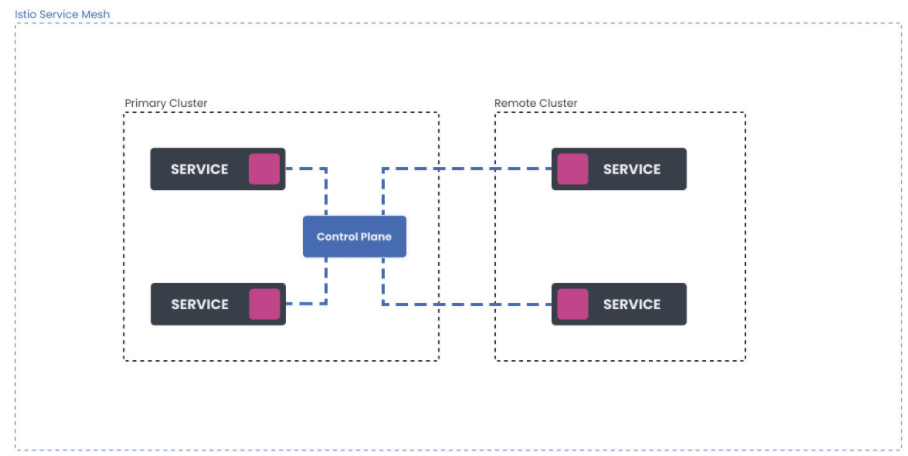
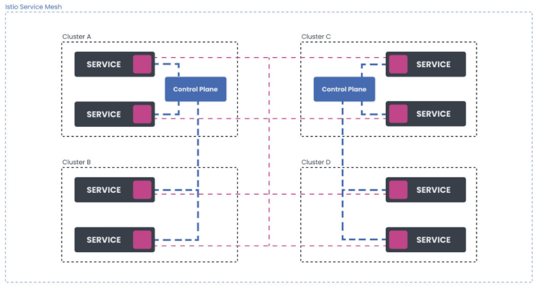
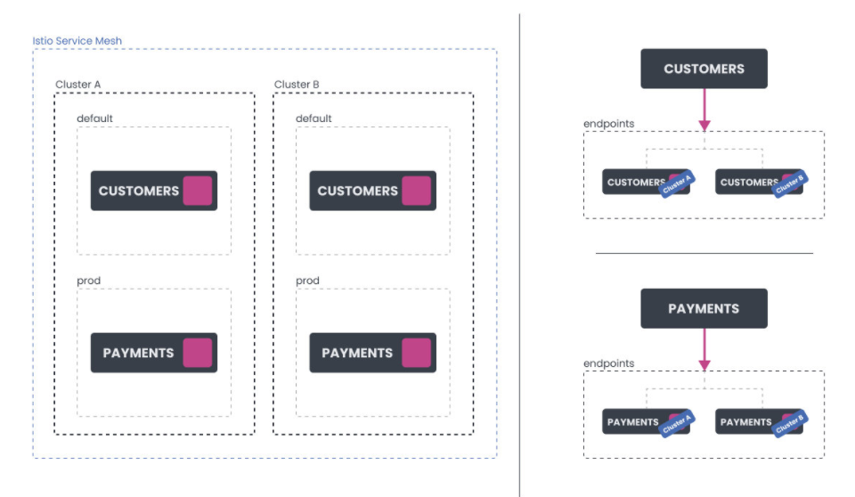
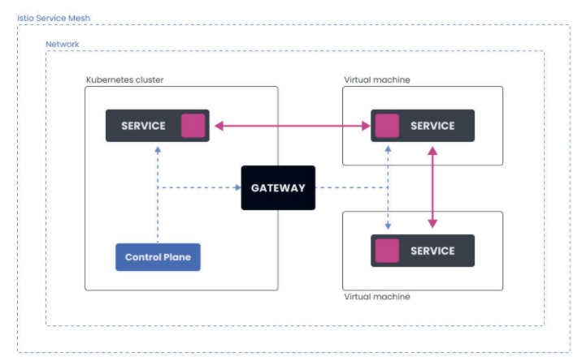
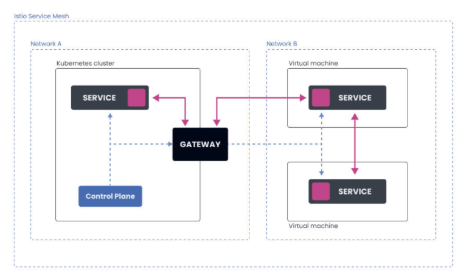

# **第七节 Istio高级功能**


### **Advanced Features** 

* Installing Isho on multiple clusters 
	* Network deployment models 
	* Control plane deployment models 
	* Mesh deployment models 
	* Tenancy models 

* Working with VM workloads 
* Lab: Connecting a VM to Istlo service mesh 
* Quiz 


## **1、多集群部署** 


多集群部署（两个或更多的集群）为我们提供了更大程度的隔离和可用性，但我们付出的代价是增加了复杂性。如果场景要求高可用性（HA)，我们将不得不在多个区域和地区部署集群。 

我们需要做出的下一个决定是，决定我们是否要在一个网络内运行集群，或者是否要使用多个网络。 


下图显示了一个多集群方案（集群A、B和C)，跨两个网络部署。 


**Mesh Deployment Models** 

* Service communicate across mesh boundaries 
* Cleaner organizational boundary 
* Stronger isolation 
* Reuse service names and namespaces 


 


### **1-1 网络部署模式** 

当涉及到多个网络时，集群内部运行的工作负载必须使用Istio网关才能到达其他集群的工作负载。使用多个网络可以实现更好的容错和网络地址的扩展

 
 

### **1-2 控制平面部署模型** 

Istio服务网格使用控制平面来配置网格内工作负载之间的所有通信。工作负载所连接的控制平面取决于其配置。 


在最简单的情况下，我们有一个服务网格，在一个集群中只有一个控制平面。这就是我们在本课程中一直使用的配置。 

**共享控制平面模型涉及多个集群，控制平面只在一个集群中运行。该集群被称为主集群，而部署中的其他集群被称为远程集群。这些集群没有自己的控制平面，相反，它们从主集群共享控制平面**。 

 
 
**另一种部署模式是，我们把所有的集群都视为由外部控制平面控制的远程集群**。

**<mark>这使我们在控制平面和数据平面之间有了完全的分离</mark>**。一个典型的外部控制平面的例子是当一个云供应商在管理它。 

**<mark>为了实现高可用性，我们应该在多个集群、区域或地区部署多个控制平面实例</mark>**，如下图所示。 

 


**这种模式提供了更好的可用胜和配置隔离。如果其中一个控制平面变得不可用那么停机就只限于这一个控制平面。为了改善这一点你可以实施故障转移并配置工作负载实例在发生故障时连接到另一个控制平面．** 

**为了达到最高的可用性我们可以在多个集群内部署一个控制平面**

### **1-3 网格部署模型** 

到目前为止我们所看的所有图表和场景都是使用单一的网格。在单网格模型中所有的服务都在一个网格中不管它们跨越多少集群和网络 


将多个网格联合起来的部署模型被称为多网格部署。在这种模式下服务可以跨网格边界进行通信。该模型为我们提供了一个更清晰的组织边界更强的隔离胜并允许我们重复使用服务名称和命名空间
 
当联合两个网格时每个网格可以暴露一组服务和身份所有参与的网格都可以识别这些身份。为了实现跨网格的服务通信我们必须在两个网格之间实现信任。信任可以通过向网格导 入信任包和为这些身份配置本地策略来建立

### **1-4 租户模式**

**Tenancy models** 

* **Tenant = group of users sharing common access and privileges to workloads** 
* Network configuration and policy used for isolation 
* Istio: namespace and cluster tenancies (soft multi-tenancy) 
* Namespace is a unit of tenancy

**<mark>租户是一组共享工作负载的共同访问权和权限的用户。租户之间的隔离是通过网络配置和策略完成的</mark>**。

Istio支持命名空间和集群租户。请注意我们在这里谈论的租户是软多租户而不是硬租户。**当多个租户共享同一个Istio控制平面时没有保证对诸如噪音邻居问题的保护 **


**<mark>在一个网格中Istio使用命名空间作为租户的单位。</mark>**

如果使用Kubernetes我们可以为每个命名空间的工作负载部署授予权限。默认情况下来自不同命名空间的服务可以通过完全限定名相互通信 

在安全模块中我们已经学会了如何使用授权策略来提高隔离度并限制只对适当的调用者进行访问． 在多集群部署模型中每个集群中共享相同名称的命名空间被认为是同一个命名空间。

集群A中default命名空间的Customers服务与集群B中default命名空间中的Customers服务指的是同一个服务。当流量被发送到Customers服务时负载均衡在两个服务的合并端点上进行如下图所示 

 

为了在Istio中配置集群租约，我们需要将每个集群配置为一个独立的服务网格。

网格可以由不同的团队控制和操作，我们可以将网格连接到一起，形成一个多网格部署。如果我们使用与之前相同的例子，在集群A的default命名空间中运行的服务Customers与集群B的default命名空间中的服务Customers所指的不是同一个服务。
 
**租户的另一个重要功能是隔离不同租户的配置。目前，Istio并没有解决这个问题，不过，它通过在命名空间级别上的范围配置来尝试解决这个问题**。 


### **1-5 最佳多集群部署**

**Best multi-cluster deployment**

* **Each cluster has its own control plane** 
* **Use multi-mesh deployments** 
* External system for orchestrating meshes 
* **Always use ingress gateways across cluster** 
	* **Pod-to-pod connectivity can slow down and complicate things** 


<mark>最佳的多集群部署拓扑结构是每个集群都有自己的控制平面</mark>。对于正常的服务网格部署规模建议你使用多网格部署，并有一个单独的系统在外部协调网格。

一般建议总是在集群间使用入口网关，即使它们在同一个网络中。直接的pod到pod的连接需要在多个集群之间填充终端数据，这可能会使事清变得缓慢和复杂。一个更简单的解决方案是让流量通过跨集群的入口来流动。 


## **2、虚拟机负载** 

如果我们有在虚拟机上运行的工作负载，我们可以将它们连接到Istio服务网格，使其成为网格的一部分。 

**带有虚拟机的Istio服务网格有两种架构：单网络架构和多网络架构。** 


**Working with VM Workloads** 

* Connect VMS to Istio service mesh 
* Steps: 
	* Install Istio with **meshExpension** setting (IstioOperator) 0
	* Create a **dedicated namespace** and **service account**
	* Extract Istio's **root certificate** 
	* Collett **network CIDR** information 
	* Configure VM (install sidecar package, copy certs and config) 


### **2-1 单网络架构** 


在这种情况下，有一个单一的网络。Kubernetes集群和在虚拟机上运行的工作负载都在同一个网络中，它们可以直接相互通信。 

 


**控制平面的流量（配置更新、证书签署）是通过Gatewey发送的。** 

虚拟机被配置了网关地址，所以它们在启动时可以连接到控制平面


### **2-2 多网络架构** 

多网络架构横跨多个网络。Kubernetes集群在一个网络内，而虚拟机则在另一个网络内。这使得Kubernetes集群中的Pod和虚拟机上的工作负载无法直接相互通信 

 

所有的流量控制平面和pod到工作负载的流量郡流经网关网关作为两个网络之间的桥梁 

### **2-3 Istio中如何表示虚拟机工作负载？**


在Istio服务网格中有两种方式采表示虚拟机工作负载 

**<mark>工作负载组(WorkloadGroup资源）类似于Kubernetes 中的部署(Deployments)它代表了共享共同属性的虚拟机工作负载的逻辑组</mark>** 

**<mark>描述虚拟机工作负载的第二种方法是使用工作负载条目(WorkloadEntry资源）。工作负载条目类似于Pod它代表了一个虚拟机工作负载的单一实例</mark>** 

请注意，创建资源将不会提供或运行任何虚拟机工作负载买例。**这些资源只是用来引用或指向虚拟机工作负载的**。**Istio使用它们来了解如何适当抽配置网格将哪些朋务添加到内部服务注册表中等等**

为了将虚拟机添加到网格中我们需要创建一个工作负载组作为摸板。然后当我们配置并将虚拟机添加到网格中时控制平面会目动创建一个相应的WorkloadEntry


我们已经提到WorkloadEntry的作用类似于Pod。在添加虚拟机时会创建`WorkloadEntry`资源而当虚拟机的工作负载从网格中移除时该资源会被目动删除 

除了`WorkloadEntry`资源外我们还需要创建一个Kubernetes服务。创建一个Kubernetes服务给了我们一个稳足的主机名和IP地址以便使用选择器字段访问虚似机工作负载和pod。**这也便我们能够通过`DestinationRule`和`Virtualservice`资源便用`Istio`的路由功能**


## **3、将虚拟机引入到Istio Mesh** 

在这个实验中，我们将学习如何将虚拟机上运行的工作负载连接到Kubernetes集群上运行的 Istio服务网格。Kubernetes集群和虚拟机都将在谷歌云平台（GCP)上运行。我们将使用单一网络架构 


在我们创建了一个Kubernetes集群后我们可以下载、安装和配置Istio.
 
### **3-1 在Kubernetes集群上安装Istio** 

让我们下载`Istio 1.10.3` 

```
$ curl -L https://istio.io/downloadIstio | ISTIO_VERSION=1.10.3 sh -
```

下载了Istio后，我们可以使用`IstioOperator`来安装它，它可以设置网格ID、集群名称和网络名称。网络名称将是空的因为我们要用单一网络架构 

让我们来设置几个环境变量我们将在本实验中使用这些变量 

```
export SERVICE_ACCOUNT="vm-sa"
export VM_APP="hello-vm"
export VM_NAMESPACE="vm-namespace"
export WORK_DIR="${HOME}/vmfiles"
export CLUSTER_NETWORK=""
export VM_NETWORK=""
export CLUSTER="Kubernetes"
```

我们还可以创建`$WORK_DIR`在这里我们将存储证书和其他我们必须复制到虚拟机上的文件 

```
istioctl operator init
mkdir -p $WORK_DIR
```

接下来，我们将初始化`Istio Operator`并安装Istio: 


一旦`Operator`被初始化我们就可以创建`IstioOperator`资源，指定网格ID、集群名称和网络并安装`Istio`: 

```
cat << EOF | kubectl apply -f -
apiVersion: install.istio.io/v1alpha1
kind: IstioOperator
metadata:
  name: istio
  namespace: istio-system
spec:
  values:
   global:
    meshID: mesh1
    multiCluster:
     clusterName: "${CLUSTER}"
    network: "${CLUSTER_NETWORK}"
EOF
```


我们可以使用`kubectl get iop -n istio-system`命令来检查`Istio`安装状态何时变为健康 


在下一步，我们将安装东西向网关。这是控制平面用来与虚拟机工作负载对话的网关，反之亦然


`gen-eastwest-gateway.sh`脚本是我们之前下载的Istio包的一部分。将文件夹改为（或你解压`Istio的文件夹）并运行以下命令：

```
samples/multicluster/gen-eastwest-gateway.sh --single-cluster | istioctl install -y -f -
``` 

`gen-eastwesi-gateway.sh`脚本使用一个`IstioOperetor`来部署一个额外的网关，名为 `istio-eastwestgateway`并配置服务端口。 


我们可以通过查看`istio-system`命名空间中的`Kubernetes`服务来检查新网关最后，我们还需要配置网关，通过它来暴露控制平面（`istiod`)。我们可以通过部署`expose-istiod.yaml`文件来做到这一点： 


```
$ kubectl apply -n istio-system -f samples/multicluster/expose-istiod.yaml
gateway.networking.istio.io/istiod-gateway created
virtualservice.networking.istio.io/istiod-vs created
```


### **3-2 准备虚拟机命名空间和文件** 


对于虚拟机工作负载，我们必须创建一个单独的命名空间来存储`WorkloadEntry`资源和任何其他虚拟机工作负载相关的资源。


此外，我们还必须导出集群环境文件、令牌、证书和其他我们必须转移到虚拟机上的文件。 

我们将把所有文件存放在我们在实验开始时创建的串`$WORK_DIR`中让我们在同一命名空间中创建虚拟机命名空间和我们将用于虚拟机工作负载的服务账户： 


```
$ kubectl create ns "${VM_NAMESPACE}"
namespace/vm-namespace created

$ kubectl create serviceaccount "${SERVICE_ACCOUNT}" -n "${VM_NAMESPACE}"
serviceaccount/vm-sa created
```


**现在我们可以创建一个`WorkloadGroup`资源并将其保存到`workloadgroup.yaml`中：**

```
cat <<EOF > workloadgroup.yaml
apiVersion: networking.istio.io/v1alpha3
kind: WorkloadGroup
metadata:
  name: "${VM_APP}"
  namespace: "${VM_NAMESPACE}"
spec:
  metadata:
   labels:
    app: "${VM_APP}"
  template:
   serviceAccount: "${SERVICE_ACCOUNT}"
   network: "${VM_NETWORK}"
EOF
``` 

现在我们可以创建一个`WorkloadGroup`资源并将其保存到`workloadgroup.yaml`中： 


```
$ kubectl apply -n istio-system -f samples/multicluster/expose-istiod.yaml
gateway.networking.istio.io/istiod-gateway created
virtualservice.networking.istio.io/istiod-vs created

$ kubectl create ns "${VM_NAMESPACE}"
namespace/vm-namespace created

$ kubectl create serviceaccount "${SERVICE_ACCOUNT}" -n "${VM_NAMESPACE}"
serviceaccount/vm-sa created
```

```
$ istioctl x workload entry configure -f workloadgroup.yaml -o "${WORK_DIR}" --clusterID "${CLUSTER}"
Warning: a security token for namespace "vm-namespace" and service account "vm-sa" has been generated and stored at "/vmfiles/istio-token" 
configuration generation into directory /vmfiles was successful
```


### **3-3 配置虚拟机** 

现在是时候创建和配置一个虚拟机了。GCP中运行这个虚拟机就像Kubernetes集群一样。虚拟机使用的是`Debian CNU/Linux10（Buster` 镜像。确保你在防火墙部分勾选了允许HTTP流量并且你有SSH访问该实例的权限 

**在这个例子中我们在80端口运行一个简单的`Python HTTP`服务器。你可以在不同的端口上配置任何其他服务。只要确保你配置了相应的安全和防火墙规则. **


1.将`$WORK_DIR`中的文件复制到实例的主文件夹中。相应地替换`USERNAME`和`INSTANCE_IP`

``` 
$ scp $WORK_DIR/* [USERNAME]@[INSTANCE_IP]:~
Enter passphrase for key '/Users/peterj/.ssh/id_rsa':
bash: warning: setlocale: LC_ALL: cannot change locale (en_US.UTF-8)
cluster.env                     100% 589  12.6KB/s  00:00
hosts                        100%  38   0.8KB/s  00:00
istio-token                     100% 906  19.4KB/s  00:00
mesh.yaml                      100% 667  14.4KB/s  00:00
root-cert.pem                    100% 1094  23.5KB/s  00:00
```


或者，你可以使用`gcloud`命令和买例名称：

```
gcloud compute scp --zone=us-west1-b ${WORK_DIR}/* [INSTANCE_NAME]:~
```

2.SSH进入实例,将根证书复制到`/etc/certs`

```
sudo mkdir -p /etc/certs
sudo cp root-cert.pem /etc/certs/root-cert.pem
```

3.拷贝`istio-token` 文件到`/var/run/secrets/tokens`目录

```
sudo mkdir -p /var/run/secrets/tokens
sudo cp istio-token /var/run/secrets/tokens/istio-token
```

4.下载和安装 Istio sidecar 包：

```
curl -LO https://storage.googleapis.com/istio-release/releases/1.10.3/deb/istio-sidecar.deb
sudo dpkg -i istio-sidecar.deb
```

5.拷贝`cluster.env`到`/var/lib/istio/envoy/` 

```
sudo cp cluster.env /var/lib/istio/envoy/cluster.env
```


6.将`Mesh`配置（`mesh.yaml`)添加到`/etc/istio/config/mesh`

```
sudo cp mesh.yaml /etc/istio/config/mesh
```

7.将 `istiod host` 添加到 `/etc/hosts`

```
sudo sh -c 'cat $(eval echo ~$SUDO_USER)/hosts >> /etc/hosts'
```
 
8.将`/etc/certs` 和`/var/lib/istio/envoy` 的所有者修改为istio proxy:

```
sudo mkdir -p /etc/istio/proxy
sudo chown -R istio-proxy /var/lib/istio /etc/certs /etc/istio/proxy /etc/istio/config /var/run/secrets /etc/certs/root-cert.pem
```

以上都就绪后，就可以在虚拟机中启动 Istio：

```
sudo systemctl start istio
```

虚拟机被配置为与Kubernetes集群中Istio的控制平面通信 


### **3-4 在虚拟机上运行服务** 

从虚拟机访问服务 让我们在Kubernetes集群中部署一个`Hello word`应用程序。首先我们需要在`default`命名空间中启用自动`sidecar`注入


**`hello-world.yaml`**

```
apiVersion: apps/v1
kind: Deployment
metadata:
  name: hello-world
  labels:
    app: hello-world
spec:
  replicas: 1
  selector:
    matchLabels:
      app: hello-world
  template:
    metadata:
      labels:
        app: hello-world
    spec:
      containers:
        - image: gcr.io/tetratelabs/hello-world:1.0.0
          imagePullPolicy: Always
          name: svc
          ports:
            - containerPort: 3000
---
kind: Service
apiVersion: v1
metadata:
  name: hello-world
  labels:
    app: hello-world
spec:
  selector:
    app: hello-world
  ports:
    - port: 80
      name: http
      targetPort: 3000
```

等待Pod准备好然后回到虚拟机上尝试访问`Kubernetes`服务 

```
$ curl http://hello-world.default
Hello World
```

**你可以从虚拟机上访问在你的Kubernetes集群内运行的任何服务** 


### **3-5 在虚拟机上运行服务** 

我们也司以在虚拟机上运行一个工作负载。切换到实例上运行一个简单的`Python HTTP`服务器 

```
$ sudo python3 -m http.server 80
Serving HTTP on 0.0.0.0 port 8000 (http://0.0.0.0:8000/) ...
```

如果你试图直接 curl 到实例 IP，你会得到一个响应（目录列表）。

```
$ curl [INSTANCE_IP]
<!DOCTYPE HTML PUBLIC "-//W3C//DTD HTML 4.01//EN" "http://www.w3.org/TR/html4/strict.dtd">
<html>
<head>
<meta http-equiv="Content-Type" content="text/html; charset=utf-8">
<title>Directory listing for /</title>
</head>
<body>
<h1>Directory listing for /</h1>
<hr>
...
```

但我们要做的是将工作负载（Python HTTP服务）添加到网格中。出于这个原因我们在前面创建了虚拟机命名空间所以让我们创建一个代表虚拟机工作负效的`Kubernetes`服务

注意，名称和标签值等于我们之前设置的`VM_APP`环谙恋昌的值。不要忘记将服务部署到`VM_NAMESPACE` 


**`hello-vm-service.yaml`**

```
apiVersion: v1
kind: Service
metadata:
  name: hello-vm
  labels:
    app: hello-vm
spec:
  ports:
  - port: 80
    name: http-vm
    targetPort: 80
  selector:
    app: hello-vm
```

```
kubectl apply -f hello-vm-service.yaml -n vm-namespace
```

将其部署到VM命名空间，因为我们没有便用买验性的虚拟机目动注册它将自动创建`WorkloadEntry`资源我们需要手动创建它们 

我们需要一个代表虚拟机工作负载的`WorkloadEntry`——该资源使用虚拟机服务账户(`SERVICE_ACCOUNT`)和标签中的应用程序名称（`VM_APP`）。 

**注意，我们还需获得虚拟机的内部`IP`地址， 这样Istio就知道在哪里可以到达虚拟机。让我们把它存储在另一个环境变量中（确保用你的值替换`INSTANCE_NAME`和`ZONE`)。**

```
export VM_IP=$(gcloud compute instances describe [INSTANCE_NAME] --format='get(networkInterfaces[0].networkIP)' --zone=[ZONE])
```

**`workloadentry.yaml`**

```
cat <<EOF> workloadentry.yaml
apiVersion: networking.istio.io/v1alpha3
kind: WorkloadEntry
metadata:
  name: ${VM_APP}
  namespace: ${VM_NAMESPACE}
spec:
  serviceAccount: ${SERVICE_ACCOUNT}
  address: ${VM_IP}
  labels:
   app: ${VM_APP}
   instance-id: vm1
EOF
```

```
kubectl apply -n ${VM_NAMESPACE} -f workloadentry.yaml
```


为了把虚拟机的工作负载加入到网格内我们还需要定义ServiceEntry 

```
cat <<EOF>> serviceentry.yaml
apiVersion: networking.istio.io/v1alpha3
kind: ServiceEntry
metadata:
  name: ${VM_APP}
spec:
  hosts:
 - ${VM_APP}
  location: MESH_INTERNAL
  ports:
 - number: 80
   name: http
   protocol: HTTP
   targetPort: 80
  resolution: STATIC
  workloadSelector:
   labels:
    app: ${VM_APP}
```

> 请注意，WorkloadEntry 和 ServiceEntry 在未来最终将自动创建。


```
kubectl apply -n ${VM_NAMESPACE} -f serviceentry.yaml
```

我们现在可以便用Kubernetes服务名称`hello-vm.vm-namespace`来访问虚似机上的工作负载让我们在集群内运行一个Pod并尝试从那里访问该服务 


```
$ kubectl run curl --image=radial/busyboxplus:curl -i --tty
If you don't see a command prompt, try pressing enter.
[ root@curl:/ ]$
```


Pod中的命令提示后你可以运行curl并访问工作负载。你应该看到一个目录列表同样地你会注意到在`HTTP`服务器运行的实例上有一个日志条目： 

```
[ root@curl:/ ]$ curl hello-vm.vm-namespace
<!DOCTYPE HTML PUBLIC "-//W3C//DTD HTML 4.01//EN" "http://www.w3.org/TR/html4/strict.dtd">
<html>
<head>
<meta http-equiv="Content-Type" content="text/html; charset=utf-8">
<title>Directory listing for /</title>
</head>
<body>
<h1>Directory listing for /</h1>
<hr>
...
```


## **4、高级功能测试**


**1、Istio在网格中使用什么作为租户单位？**

* A. Deployment
* B. 用户组
* **C. Namespace**
* D. 集群

> **<mark>在一个网格中Istio使用命名空间作为租户的单位。</mark>**

**2、你使用哪些资源将虚拟机工作负载连接到服务网格？** 

* A. Deployment 和 Service
* B. VirtualService 和 Deployment
* C. Ingress 和 Deployment
* **D. WorkloadGroup 和 WorkloadEntry**

> **<mark>工作负载组(WorkloadGroup资源）类似于Kubernetes 中的部署(Deployments)它代表了共享共同属性的虚拟机工作负载的逻辑组</mark>** 
> 
> **<mark>描述虚拟机工作负载的第二种方法是使用工作负载条目(WorkloadEntry资源）。工作负载条目类似于Pod它代表了一个虚拟机工作负载的单一实例</mark>** 


**3、你是否可以通过将所有集群作为远程集群来实现控制平面和数据平面的完全分离？（是/否？)**

* **A 是**
* B 否

> **另一种部署模式是，我们把所有的集群都视为由外部控制平面控制的远程集群**。**<mark>这使我们在控制平面和数据平面之间有了完全的分离</mark>**。

**4、Istio是如何解决不同租户之间的配置隔离的？** 

* A. 通过使用单独的控制平面
* B. 通过在集群外存储配置
* **C. 不可行**
* D 通过对etcd中的配置和秘密进行加密 

> **租户的另一个重要功能是隔离不同租户的配置。目前，Istio并没有解决这个问题，不过，它通过在命名空间级别上的范围配置来尝试解决这个问题**

**5、多集群部署的目的是什么？** 
 
* **A 为了获得更大程度的隔离和可用性**． 
* B 为了提高服务网格的性能
* C 为了引虚拟机负载
* D 再部署多个工作负载时，为了节省成本

> <mark>最佳的多集群部署拓扑结构是每个集群都有自己的控制平面</mark>。对于正常的服务网格部署规模建议你使用多网格部署，并有一个单独的系统在外部协调网格。


**6、什么是租户？**

* A 单个集群及其所有用户 
* **B 一组用户共享一组工作负载的共同访问权和权限 **
* C 多个集群共享相同的用户账户 
* D 一组共享工作负载的集群 

> **<mark>租户是一组共享工作负载的共同访问权和权限的用户。租户之间的隔离是通过网络配置和策略完成的</mark>**。

**7、部署多个控制平面是否能提高成本效率？（是／否）** 

* 是
* **否**


**8、What does the shared control plane model involve?**

* A 在云提供商处带有控制平面的单一集群部署
* **B 多个集群控制平面只在一个集群中运行（主集群）** 
* C 多个集群，每个集群有一个控制平面，可以在任何时候发挥共享控制平面作用 
* D 在使用多个隽群时能够回退到不同的控制平面 


**9、什么被认为是最佳的多集群部署拓扑结构？**

* A 每个集群共享数据平面 
* B 每个集群共享控制平面 
* C 每个集群都依赖一个控制数据平面 
* **D 每个集群都有自己的控制平面** 

**10、为了支持集群租户，你需要配置多个集群来共享一个控制平面。（是／否？)**

* A 是 
* **B 否** 


**11、不同租户之间的隔离是如何实现的？** 

* 使用namespace 
* **使用网络配置和策略** 
* 使用EnvoyFilter 
* 使用Sidecar资源 


**12、工作负载应该如何在集群之间进行通信？**

* 直接从一个Pod到另一个Pod 
* **通过ingress gateway** 
* 从一个Kubernetes服务到不同集群中的一个端点 
* 使用外部gateway 