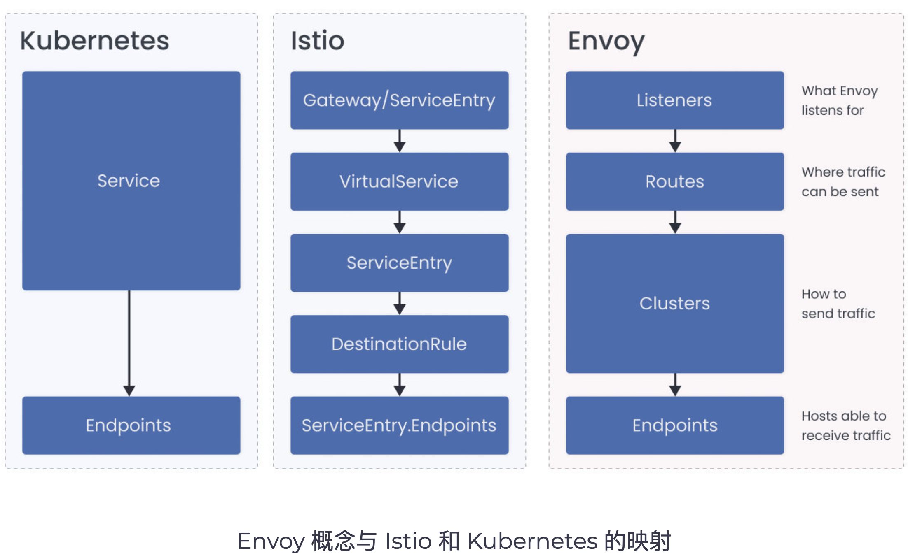
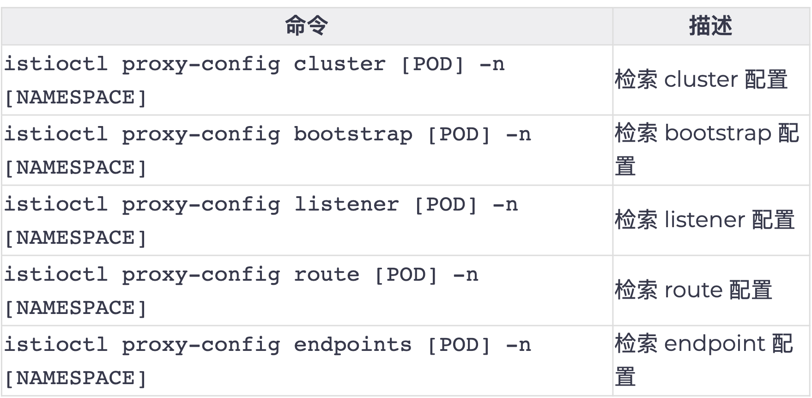
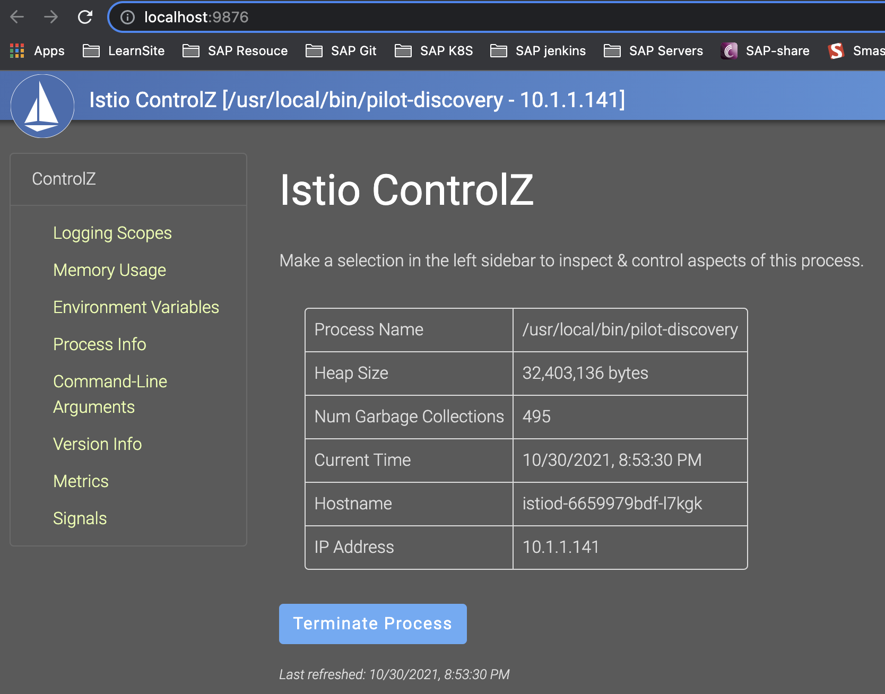

# **第八节 Istio 问题排查**


## **1、Envoy基础** 

为了排除Istio的问题，对Envoy的工作原理有一个基本的了解是很有帮助的。Envoy配置是 一个JSON文件，分为多个部分。我们需要了解Envoy的基本概念是监听器、路由、集群和端点。 


这些概念映射到istio和Kubernetes资源，如下图所示。 

 


### **Basics of Envoy** 


* JSON configuration 
* Basic concepts:
	* Listeners 
	* Routes 
	* Cluster
	* Endpoints 


* Multiple listeners for each sidecar 
	* Inbound: `0.0.0.0:15006` 
	* Outbound: `0.0.0.0:15001` 

* Listeners hands off requests off to a virtual listener 
* Default: **PassthroughCluster** 


监听器是命名的网络位置，通常是一个IP和端口。Envoy对这些位置进行监听，这是它接收和连接和请求的地方。 
 
* 每个sidecar都有多个监听器生成。**每个sidecar都有一个监听器**，它被绑定到 `0.0.0.0:15006`。
* 这是`IP Tables`将所有入站流量发送到Pod的地址。第二个监听器被绑定到`0.0.0.0:15001`，这是所有从Pod中出站的流量地址。

 
当一个请求被重定向（使用IP Tables配置）到15001端口时，监听器会把它交给与请求的原始目的地最匹配的虚拟监听器。**<mark>如果它找不到目的地，它就根据配置的 `OutboundTrafficPolicy`来发送流量。默认情况下，请求被发送到`PassthroughCluster`, 该集群连接到应用程序选择的目的地，Envoy没有进行任何负载均衡</mark>**。 

## **2、Envoy实例**

**让我们以`Web`前端和`customers`服务为例，看看`Envoy`如何确定将请求从Web前端发送到`customers`服务（`customers.default.svc.cluster.local`）的位置。**

**`1gateway.yaml`**

```
apiVersion: networking.istio.io/v1alpha3
kind: Gateway
metadata:
  name: gateway
spec:
  selector:
    istio: ingressgateway
  servers:
    - port:
        number: 80
        name: http
        protocol: HTTP
      hosts:
        - '*'
```

**`2webfrontend.yaml`**

```
apiVersion: v1
kind: ServiceAccount
metadata:
  name: web-frontend
---
apiVersion: apps/v1
kind: Deployment
metadata:
  name: web-frontend
  labels:
    app: web-frontend
spec:
  replicas: 1
  selector:
    matchLabels:
      app: web-frontend
  template:
    metadata:
      labels:
        app: web-frontend
        version: v1
    spec:
      serviceAccountName: web-frontend
      containers:
        - image: gcr.io/tetratelabs/web-frontend:1.0.0
          imagePullPolicy: Always
          name: web
          ports:
            - containerPort: 8080
          env:
            - name: CUSTOMER_SERVICE_URL
              value: 'http://customers.default.svc.cluster.local'
---
kind: Service
apiVersion: v1
metadata:
  name: web-frontend
  labels:
    app: web-frontend
spec:
  selector:
    app: web-frontend
  ports:
    - port: 80
      name: http
      targetPort: 8080
---
apiVersion: networking.istio.io/v1alpha3
kind: VirtualService
metadata:
  name: web-frontend
spec:
  hosts:
    - '*'
  gateways:
    - gateway
  http:
    - route:
        - destination:
            host: web-frontend.default.svc.cluster.local
            port:
              number: 80
```

**`3customersv1.yaml`**

```
apiVersion: apps/v1
kind: Deployment
metadata:
  name: customers-v1
  labels:
    app: customers
    version: v1
spec:
  replicas: 3
  selector:
    matchLabels:
      app: customers
      version: v1
  template:
    metadata:
      labels:
        app: customers
        version: v1
    spec:
      containers:
        - image: gcr.io/tetratelabs/customers:1.0.0
          imagePullPolicy: Always
          name: svc
          ports:
            - containerPort: 3000
---
kind: Service
apiVersion: v1
metadata:
  name: customers
  labels:
    app: customers
spec:
  selector:
    app: customers
  ports:
    - port: 80
      name: http
      targetPort: 3000
---
apiVersion: networking.istio.io/v1alpha3
kind: VirtualService
metadata:
  name: customers
spec:
  hosts:
    - 'customers.default.svc.cluster.local'
  http:
    - route:
        - destination:
            host: customers.default.svc.cluster.local
            port:
              number: 80
```

```
kubectl apply -f *.yaml 
```

### **2-1 `istioctl proxy-config`列出监听器**

使用 `istioctl proxy-config`命令，我们可以列出web前端pod的所有监听器。 


```
$ istioctl proxy-config listeners web-frontend-74dd5cbcdc-8mfpb
ADDRESS        PORT  MATCH                                                                                           DESTINATION
10.96.0.10     53    ALL                                                                                             Cluster: outbound|53||kube-dns.kube-system.svc.cluster.local
0.0.0.0        80    Trans: raw_buffer; App: HTTP                                                                    Route: 80
0.0.0.0        80    ALL                                                                                             PassthroughCluster
10.104.176.79  443   ALL                                                                                             Cluster: outbound|443||istio-egressgateway.istio-system.svc.cluster.local
10.105.159.70  443   ALL                                                                                             Cluster: outbound|443||istio-ingressgateway.istio-system.svc.cluster.local
10.96.0.1      443   ALL                                                                                             Cluster: outbound|443||kubernetes.default.svc.cluster.local
10.96.216.110  443   ALL                                                                                             Cluster: outbound|443||istiod.istio-system.svc.cluster.local
10.106.113.25  3000  Trans: raw_buffer; App: HTTP                                                                    Route: grafana.istio-system.svc.cluster.local:3000
10.106.113.25  3000  ALL                                                                                             Cluster: outbound|3000||grafana.istio-system.svc.cluster.local
0.0.0.0        8383  Trans: raw_buffer; App: HTTP                                                                    Route: 8383
0.0.0.0        8383  ALL                                                                                             PassthroughCluster
10.100.136.154 9000  Trans: raw_buffer; App: HTTP                                                                    Route: minio.velero.svc.cluster.local:9000
10.100.136.154 9000  ALL                                                                                             Cluster: outbound|9000||minio.velero.svc.cluster.local
10.100.136.154 9001  Trans: raw_buffer; App: HTTP                                                                    Route: minio.velero.svc.cluster.local:9001
10.100.136.154 9001  ALL                                                                                             Cluster: outbound|9001||minio.velero.svc.cluster.local
0.0.0.0        9090  Trans: raw_buffer; App: HTTP                                                                    Route: 9090
0.0.0.0        9090  ALL                                                                                             PassthroughCluster
10.96.0.10     9153  Trans: raw_buffer; App: HTTP                                                                    Route: kube-dns.kube-system.svc.cluster.local:9153
10.96.0.10     9153  ALL                                                                                             Cluster: outbound|9153||kube-dns.kube-system.svc.cluster.local
0.0.0.0        9411  Trans: raw_buffer; App: HTTP                                                                    Route: 9411
0.0.0.0        9411  ALL                                                                                             PassthroughCluster
0.0.0.0        15001 ALL                                                                                             PassthroughCluster
0.0.0.0        15001 Addr: *:15001                                                                                   Non-HTTP/Non-TCP
0.0.0.0        15006 Addr: *:15006                                                                                   Non-HTTP/Non-TCP
0.0.0.0        15006 Trans: tls; App: istio-http/1.0,istio-http/1.1,istio-h2; Addr: 0.0.0.0/0                        InboundPassthroughClusterIpv4
0.0.0.0        15006 Trans: raw_buffer; App: HTTP; Addr: 0.0.0.0/0                                                   InboundPassthroughClusterIpv4
0.0.0.0        15006 Trans: tls; App: TCP TLS; Addr: 0.0.0.0/0                                                       InboundPassthroughClusterIpv4
0.0.0.0        15006 Trans: raw_buffer; Addr: 0.0.0.0/0                                                              InboundPassthroughClusterIpv4
0.0.0.0        15006 Trans: tls; Addr: 0.0.0.0/0                                                                     InboundPassthroughClusterIpv4
0.0.0.0        15006 Trans: tls; App: istio,istio-peer-exchange,istio-http/1.0,istio-http/1.1,istio-h2; Addr: *:8080 Cluster: inbound|8080||
0.0.0.0        15006 Trans: raw_buffer; Addr: *:8080                                                                 Cluster: inbound|8080||
0.0.0.0        15010 Trans: raw_buffer; App: HTTP                                                                    Route: 15010
0.0.0.0        15010 ALL                                                                                             PassthroughCluster
10.96.216.110  15012 ALL                                                                                             Cluster: outbound|15012||istiod.istio-system.svc.cluster.local
0.0.0.0        15014 Trans: raw_buffer; App: HTTP                                                                    Route: 15014
0.0.0.0        15014 ALL                                                                                             PassthroughCluster
0.0.0.0        15021 ALL                                                                                             Inline Route: /healthz/ready*
10.105.159.70  15021 Trans: raw_buffer; App: HTTP                                                                    Route: istio-ingressgateway.istio-system.svc.cluster.local:15021
10.105.159.70  15021 ALL                                                                                             Cluster: outbound|15021||istio-ingressgateway.istio-system.svc.cluster.local
0.0.0.0        15090 ALL                                                                                             Inline Route: /stats/prometheus*
10.105.159.70  15443 ALL                                                                                             Cluster: outbound|15443||istio-ingressgateway.istio-system.svc.cluster.local
0.0.0.0        20001 Trans: raw_buffer; App: HTTP                                                                    Route: 20001
0.0.0.0        20001 ALL                                                                                             PassthroughCluster
10.105.159.70  31400 ALL                                                                                             Cluster: outbound|31400||istio-ingressgateway.istio-system.svc.cluster.local
```

从Web前端到customers的请求是一个向外的HTTP请求，端口为80。

**这意味着它被移交给了`0.0.0.0:80`的虚拟监听器。我们可以使用`Istio CLI`按地址和端口来过滤监听器。**

 

你可以 添加`-o json`来获得监听器的JSON表示： 


```
$ istioctl proxy-config listeners web-frontend-74dd5cbcdc-8mfpb --address 0.0.0.0 --port 80 -o json

...
"statPrefix": "outbound_0.0.0.0_80",
"rds": {
    "configSource": {
        "ads": {},
        "initialFetchTimeout": "0s",
        "resourceApiVersion": "V3"
    },
    "routeConfigName": "80"
},
...
```


Listener使用RDS（路由发现服务）来寻找路由配置（在我们的例子中是80)。**路由附属于监听器，包含将虚拟主机映射到集群的规则。这允许我们创建流量路由规则，因为Envoy可以查看头文件或路径（请求元数据）并对流量进行路由。**

 
**路由（route)选择集群（cluster)。集群是一组接受流量的类似的上游主机——它是一个端点的集合。例如，Web前端服务的所有实例的集合就是一个集群。我们可以在一个集群内配置弹性功能，如断路器、离群检测和TLS配置**。

 
**使用routes命令，我们可以通过名称过滤所有的路由来获得路由的详细信息**。 


```
$ istioctl proxy-config routes web-frontend-74dd5cbcdc-8mfpb --address 0.0.0.0 --port 80 -o json


[
    {
        "name": "80",
        "virtualHosts": [
            {
                "name": "allow_any",
                "domains": [
                    "*"
                ],
                "routes": [
                    {
                        "name": "allow_any",
                        "match": {
                            "prefix": "/"
                        },
                        "route": {
                            "cluster": "PassthroughCluster",
                            "timeout": "0s",
                            "maxGrpcTimeout": "0s"
                        }
                    }
                ],
                "includeRequestAttemptCount": true
            },
            {
                "name": "customers.default.svc.cluster.local:80",
                "domains": [
                    "customers.default.svc.cluster.local",
                    "customers.default.svc.cluster.local:80",
                    "customers",
                    "customers:80",
                    "customers.default.svc",
                    "customers.default.svc:80",
                    "customers.default",
                    "customers.default:80",
                    "10.109.29.3",
                    "10.109.29.3:80"
                ],
                "routes": [
                    {
                        "match": {
                            "prefix": "/"
                        },
                        "route": {
                            "cluster": "outbound|80||customers.default.svc.cluster.local",
                            "timeout": "0s",
                            "retryPolicy": {
                                "retryOn": "connect-failure,refused-stream,unavailable,cancelled,retriable-status-codes",
                                "numRetries": 2,
                                "retryHostPredicate": [
                                    {
                                        "name": "envoy.retry_host_predicates.previous_hosts"
                                    }
                                ],
                                "hostSelectionRetryMaxAttempts": "5",
                                "retriableStatusCodes": [
                                    503
                                ]
                            },
                            "maxGrpcTimeout": "0s"
                        },
                        ]
.....
```

路由80配置为每个服务都有一个虚拟主机。

**然而，由于我们的请求被发送到`customers.default.svc.cluster.local`, Envoy会选择与其中一个域匹配的虚拟主机 (`customers.default.svc.cluster.local:80`）**。

 
一旦域被匹配，特殊的路由规则`Envoy`就会查看路由，并选择第一个匹配请求的路由。由于我们没有定义任何它匹配第一个（也是唯一的）定义的路由，并指示Envoy将请求发送到名为的集群。`outbound|80|v1|customers.default.svc.cluster.local`的集群

 
> 注意集群名称中的v1是因为我们部署了一个`DestinationRule`来创建`v1`子集。如果一个服务没有子集，这部分就留空： 
> 
> outbound|80||customers.default.svc.cluster.local

现在我们有了集群的名称，我们可以查询更多的细节。 为了得到一个清楚显示FQDN、端口、子集和其他信息的输出，你可以省略`-o json`标志。 


```
$ istioctl proxy-config cluster web-frontend-74dd5cbcdc-8mfpb --fqdn customers.default.svc.cluster.loc
al
SERVICE FQDN                            PORT     SUBSET     DIRECTION     TYPE     DESTINATION RULE
customers.default.svc.cluster.local     80       -          outbound      EDS
```

最后，使用集群的名称，我们可以查询请求最终将到达的实际端点： 


```
$ istioctl proxy-config endpoints web-frontend-74dd5cbcdc-8mfpb --cluster "outbound|80|v1|customers.default.svc.cluster.local"
ENDPOINT            STATUS      OUTLIER CHECK     CLUSTER
10.1.1.152:3000     HEALTHY     OK                outbound|80||customers.default.svc.cluster.local
```

端点地址等于customers应用程序正在运行的pod IP。如果我们扩展customers的部署额外的端点会出现在输出中，像这样： 


```
$ kubectl get pod
NAME                            READY   STATUS    RESTARTS   AGE
curl-6cd5b579fb-2xcx9           2/2     Running   3          9d
customers-v1-7b5b4b76fc-dslg9   2/2     Running   0          24m
customers-v1-7b5b4b76fc-rh8zb   2/2     Running   0          18s
customers-v1-7b5b4b76fc-x7jb8   2/2     Running   0          18s
web-frontend-74dd5cbcdc-8mfpb   2/2     Running   0          24m
```


```
$ istioctl proxy-config endpoints web-frontend-74dd5cbcdc-8mfpb --cluster "outbound|80||customers.defa
ult.svc.cluster.local"
ENDPOINT            STATUS      OUTLIER CHECK     CLUSTER
10.1.1.152:3000     HEALTHY     OK                outbound|80||customers.default.svc.cluster.local
10.1.1.153:3000     HEALTHY     OK                outbound|80||customers.default.svc.cluster.local
10.1.1.154:3000     HEALTHY     OK                outbound|80||customers.default.svc.cluster.local
```


## **3、调试备忘录** 

每当你遇到配置问题时，你可以使用这组步骤来浏览和解决问题。在第一部分，我们要检查配 置是否有效。如果配置是有效的，下一步就是看看运行时是如何处理配置的，为此，你需要对 Envoy配置有基本的了解。 

**Checklist for debugging**

* Configuration validation 
* Runtime validation 


### **3-1 配置** 

**1．配置是否有效？** 

Istio CLI有一个叫validate的命令，我们可以用它来验证.YAML配置。YAML最常见的问题是缩进和数组符号相关的问题。要验证一个配置，请将YAML文件传递给validate命令，像这样： 

```
$ istioctl validate -f myresource.yaml
validation succeed
```


如果资源是无效的，CLI会给我们一个详细的错误。例如，如果我们拼错了一个字段名： 

```
unknown field "worloadSelector" in v1alpha3.ServiceEntry
```

**我们可以使用另一个命令`istioctl analyze`。**

使用这个命令，我们可以检测Istio配置的潜 在问题。我们可以针对本地的一组配置文件或实时集群运行它。同时，寻找来自istiod的任何警告或错误。 


下面是该命令的一个输出样本，它捕捉到了目的地主机名称中的一个错字： 

```
$ istioctl analyze
Error [IST0101] (VirtualService customers.default) Referenced host not found: "cusomers.default.svc.cluster.local"
Error [IST0101] (VirtualService customers.default) Referenced host+subset in destinationrule not found: "cusomers.default.svc.cluster.local+v1"
Error: Analyzers found issues when analyzing namespace: default.
See https://istio.io/docs/reference/config/analysis for more information about causes and resolutions.
```


**2．命名是否正确？资源是否在正确的命名空间**？ 


* Nearly all Istio resources are namespace scoped 
* Selectors are also namespaced 
* Common misconfiguration: 
	* Publishing VirtualService in **default**, binding to a gateway in **istio-system**
	* Deploying Sidecar in **istio-system**, referencing VirtualService from application namespace 

 
几乎所有的Istio资源都是命名空间范围的。确保它们与你正在处理的服务处于同一命名空间。将Istio资源放在同一命名空间中尤其重要，因为选择器也是有命名空间的。 

**一个常见的错误配置是在应用程序的命名空间中发布VirtualService（例如default)，然后使用`istio: ingressgateway`选择器来绑定到`istio-system`命名空间中的ingress网关部署。这只有在你的`VirtualService`也在`istio-system`命名空间中时才有效。** 


同样地，不要在`istio-system`命名空间中部署引用用应用程序命名空间中的`VirtualService `的Sidecar资源。相反，为每个需要入口的应用程序部署一组Envoy网关。 


**3．资源选择器是否正确？** 

验证部署中的pod是否有正确的标签设置。正如上一步提到的，资源选择器与资源发布的命名 空间绑定。 

在这一点上，我们应该有理由相信，配置是正确的。接下来的步骤是进一步研究运行时系统是 如何处理配置的。 


### **3-2 运行时** 

Istio CLI 的一个实验性功能可以提供信息，帮助我们了解影响Pod或服务的配置。下面是一个针对Pod运行describe命令的例子，这个Pod的主机名称中有一个错字： 

```
$ istioctl x describe pod customers-v1-64455cd4c6-xvjzm.default
Pod: customers-v1-64455cd4c6-xvjzm
  Pod Ports: 3000 (svc), 15090 (istio-proxy)
--------------------
Service: customers
  Port: http 80/HTTP targets pod port 3000
DestinationRule: customers for "customers.default.svc.cluster.local"
  Matching subsets: v1
  No Traffic Policy
VirtualService: customers
  WARNING: No destinations match pod subsets (checked 1 HTTP routes)
    Route to cusomers.default.svc.cluster.local
···
```

```
$ istioctl x describe pod customers-v1-7b5b4b76fc-dslg9
Pod: customers-v1-7b5b4b76fc-dslg9
   Pod Ports: 3000 (svc), 15090 (istio-proxy)
--------------------
Service: customers
   Port: http 80/HTTP targets pod port 3000
VirtualService: customers
   1 HTTP route(s)
```

**1. Envoy是否接受（ACK）该配置？** 

你可以使用`istioctl proxy-status`命令来检查状态，看看Envoy是否接受配置。我们希望所有东西的状态都设置为SYNCHED。任何其他值都可能表明有错误，你应该检查Pilot的日日志。 

```
$ istioctl proxy-status
NAME                                                  CDS        LDS        EDS        RDS          ISTIOD                      VERSION
curl-6cd5b579fb-2xcx9.default                         SYNCED     SYNCED     SYNCED     SYNCED       istiod-6659979bdf-l7kgk     1.10.3
customers-v1-7b5b4b76fc-dslg9.default                 SYNCED     SYNCED     SYNCED     SYNCED       istiod-6659979bdf-l7kgk     1.10.3
customers-v1-7b5b4b76fc-rh8zb.default                 SYNCED     SYNCED     SYNCED     SYNCED       istiod-6659979bdf-l7kgk     1.10.3
customers-v1-7b5b4b76fc-x7jb8.default                 SYNCED     SYNCED     SYNCED     SYNCED       istiod-6659979bdf-l7kgk     1.10.3
istio-egressgateway-5547fcc8fc-7kj9c.istio-system     SYNCED     SYNCED     SYNCED     NOT SENT     istiod-6659979bdf-l7kgk     1.10.3
istio-ingressgateway-8f568d595-b2d6q.istio-system     SYNCED     SYNCED     SYNCED     SYNCED       istiod-6659979bdf-l7kgk     1.10.3
web-frontend-74dd5cbcdc-8mfpb.default                 SYNCED     SYNCED     SYNCED     SYNCED       istiod-6659979bdf-l7kgk     1.10.3
```


列表显示所有连接到`Pilot`实例的代理。如果列表中缺少一个代理，这意昧着它没有连接到Pilot，也没有收到任何配置。如果任何一个代理被标记为STALE，可能有网络问题，或者我们 需要扩展Pilot


如果Envoy接受了配置，但我们仍然看到问题，我们需要确保配置在Envoy中的表现符合预期。

 
**2．配置在Envoy中的表现和预期的一样吗？** 


我们可以使用`proxy-config`命令来检索特定`Envoy`实例的信息。请参考下面的表格，我们可以检索不同的代理配置。 

 


该命令从`Envoy`的管理端点（主要是`/config_dump`）收集数据，它包含了很多有用的信息。 

另外，请参考显示Envoy和Istio资源之间映射的图。例如，许多`VirtualService`规则将表现为`Envoy`路由，而`DestinationRules`和`ServiceEntries`则表现为Cluster

> **`DestinationRules`不会出现在配置中，除非其主机的`ServiceEntry`首先存在**。 

让我们以客户的`VirtualService`为例。 

```
apiVersion: networking.istio.io/v1alpha3
kind: VirtualService
metadata:
  name: customers
spec:
  hosts:
   - 'customers.default.svc.cluster.local'
  http:
   - route:
    - destination:
      host: customers.default.svc.cluster.local
      port:
       number: 80
      subset: v1
     weight: 80
    - destination:
      host: customers.default.svc.cluster.local
      port:
       number: 80
      subset: v2
     weight: 20
    timeout: 5s
```

**如果你运行`istioctl proxy-config routes[POD］-o json`命令，你会看到加权目的地和超时是如何在配置中体现的：**

```
..
{
  "name": "80",
  "virtualHosts": [
    {
   "name": "customers.default.svc.cluster.local:80",
   "domains": [
     "customers.default.svc.cluster.local",
     ...
    ],
   "routes": [
     {
      "match": {"prefix": "/"},
      "route": {
         "weightedClusters": {
           "clusters": [
             {
               "name": "outbound|80|v1|customers.default.svc.cluster.local",
               "weight": 80
             },
             {
               "name": "outbound|80|v2|customers.default.svc.cluster.local",
               "weight": 20
             }
           ]
          },
         "timeout": "5s",
...
```


当你评估VirtualService时，你要寻找主机名是否像你写的那样出现在Envoy配置中（例如 
`customers.default.svc.cluster.local`)，以及路由是否存在(见输出中的80-20流量分割），你也可以使用之前的例子，通过监听器、路由和集群(和端点）来追踪调用。 


**Envoy过滤器会表现在你告诉Istio把它们放在哪里（EnvoyFilter资源中的applyTo字段。通常情况下，一个坏的过滤器会表现为Envoy拒绝配置（即不显示SYNCED状态）。在这种情况下，你需要检查Istiod日志中的错误**


**3. Istiod (Pilot）中是否有错误？** 

从Pilot查看错误的最快方法是跟踪日志（使用`--follow`标志），然后应用配置。下面是一个来自Pilot的错误的例子，这是由于过滤器的内联代码中的一个错字而导致的。 

```
2020-11-20T21:49:16.017487Z   warn   ads   ADS:LDS: ACK ERROR sidecar~10.120.1.8~web-frontend-58d497b6f8-lwqkg.default~default.svc.cluster.local-4 Internal:Error adding/updating listener (s) virtualInbound: script load error: [string"fction envoy_on_response (response_handle)..."]:1: '=' expected near 'envoy_on_response'
```

如果配置根本没有出现在Envoy中（Envoy没有ACK它），或者它是一个EnvoyFilter配置，那么这个配置很可能是无效的。Istio无法从语法上验证EnvoyFilter内部的配置。另一个问题可能是，过滤器在Envoy的配置中位于错误的位置。 

无论哪种情况，Envoy都会拒绝该配置，因为它是无效的，Pilot会记录这个错误。一般来 说，你可以搜索你的资源的名称来找到错误。
 
在这里，你必须使用判断力来确定它是你写的配置中的错误，还是Pilot的错误导致它产生了 一个无效的配置。 


### **3-3 检查Envoy日志** 

要检查Envoy代理的日志，我们可以使用`kubectl logs`命令： 

```
kubect1 logs PODNAME -c istio-proxy 一n NAMESPACE 

```

要了解访问日志的格式和响应标志，我们可以参考Envoy访问日志的内容 


最常见的响应标志。 

* NP：没有配置路由，检查DestinationRule或VirtualService 
* UO：上游溢出并断路。检查DestinationRule中的断路器配置。 
* UF:上游连接失败，如果使用Istio认证，检查mTLS配置。
* UH：没有健康的上游主机。 

### **3-4 配置 istiod 日志**

我们可以使用ControlZ仪表板，通过**Logging Scopes**菜单配置堆栈跟踪级别和日志级别。 

要打开仪表板，请运行： 

```
istioctl dashboard controlz $(kubectl -n istio-system get pods -l app=istiod -o jsonpath='{.items [0].metadata.name}').istio-system
```

仪表板打开后，点击Logging Scopes选项，调整日志级别和堆栈跟踪级别。 
 
 

## **4、问题检测检测**


**1、如果虚拟监听器找不到请求的目的地会怎样？** 

* A 抛弃该请求 
* B 跳转到第二接近的请求 
* **C 根据OutboundTrafficPolicy发送流量**
* D 根据虚拟服务的要求发送流量 

> 当一个请求被重定向（使用IP Tables配置）到15001端口时，监听器会把它交给与请求的原始目的地最匹配的虚拟监听器。**<mark>如果它找不到目的地，它就根据配置的 `OutboundTrafficPolicy`来发送流量。


**2、你可以使用哪个Istio CLI命令来列出所有监听器？**

* A istiocti get listeners 
* **B istiocti proxy-config listeners** 
* C istiocti describe listeners 
* D istioctl config listeners

> `istioctl proxy-config`列出监听器


**3、监听器使用哪个服务来寻找路由配置？** 

* A SDS
* **B RDS(route discovery service)** 
* C Listener service 
* D Envoy service 

> Listener使用RDS（路由发现服务）来寻找路由配置（在我们的例子中是80)


**4、Envoy的基本概念是什么？**

* **A listener、route、cluster和endpoint** 
* B request、response和endpoint 
* C request、header和cookies 
* D header、cluster和route 

**5、Envoy为每个sidecar生成一个监听器。（对/错）**

* A True 
* **B False** 

> 每个sidecar都有多个监听器生成。**每个sidecar都有一个监听器**，它被绑定到 `0.0.0.0:15006`。


**6、Where are the circuit breakers defined?**

* A In virtual listeners 
* B In endpoint configuration 
* **C In clusters configuration** 
* D In routes configuration


**7、什么类型的流量会被路由到15006端口？**

* **A 入站Pod流量**
* B 出站Pod 流量
* C 所有流量 
* D 没有流量 


