# **第九节 实际案例** 


在本模块中，我们将部署名为[`Online Boutique`](https://github.com/GoogleCloudPlatform/microservices-demo)的微服务演示应用程序，试用Istio的不同功能 


`Online Boutique`是一个云原生微服务演示应用程序。`Online Boutique`是一个由10个微服 务组成的应用。该应用是一个基于Web的电子商务应用，用户可以浏览商品，将其添加到购物车，并购买商品。 

* Deploy microservices demo application(Online Boutique) 
* Demonstrate how to use lstio features; 
	* Traffic routing 
	* Fault injection 
	* Resiliency 


## **1、创建集群**

我们将使用谷歌云平台来托管Kubernetes集群。打开并登录到你的GCP控制台账户，并按照以下步骤创建一个Kubernetes集群。 

* 1．从导航中，选择Kubernetes Engine
* 2．点击创建集群。 
* 3．将集群命名为`Boutique-demo` 
* 4．选择区域选项，选择最接近你的位置的区域。 
* 5．点击`default-pool`，在节点数中输入5 
* 6．点击Nodes（节点）。 
* 7．点击机器配置机器类型下拉，选择`e2-medium` (2 vCPU, 4 GB memory)。 
* 8．点击”Create”来创建集群。 

集群的创建将需要几分钟的时间。一旦安装完成，集群将显示在列表中，如下图所示。 

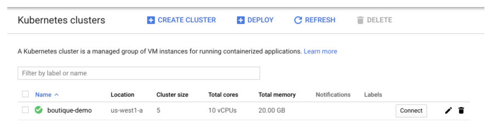 

> 你也可以将Online Boutique应用程序部署到托管在其他云平台上的Ku bernetes集 群，如Azure或AWS。 

### **访问集群** 

我们有两种方式来访问集群。我们可以从浏览器中使用Cloud Shell。要做到这一点，点击集 群旁边的Connect，然后点击Run in Cloud Shell按钮。点击该按钮可以打开Cloud Shell，并配置Kubernetes CLI来访问该集群。 

第二个选择是在你的电脑上安装gcloud CLI，然后从你的电脑上运行相同的命令。 

## **2、安装Istio**

安装Istlo 我们将使用GetMesh CLI在集群中安装`Istio 1.1O.3`。 

**1．下载GetMesh CLI:**

```
curl -sL https://istio.tetratelabs.io/getmesh/install.sh | bash
```


**2．安装Istio:** 

```
istioctl install --set profile=demo
```


安装完成后，给默认命名空间设置上`istio-injection=enabled`标签： 

```
kubectl label namespace default istio-injection=enabled
```

## **3、部署`Online Boutique` 应用** 

在集群和Istio准备好后，我们可以克隆在`Online Boutique`应用库。 

### **3-1 克隆仓库** 

```
git clone https://github.com/GoogleCloudPlatform/microservices-demo.git
```


### **3-2 前往`microservices-demo`目录** 

```
cd microservices-demo 
```

### **3-3 创建Kubernetes资源**：

``` 
kubectl apply -f release/kubernetes-manifests.yaml 
```

### **3-4 检查所有Pod都在运行：** 

```
$ kubectl get pods
NAME                   READY  STATUS   RESTARTS  AGE
adservice-5c9c7c997f-n627f        2/2   Running  0      2m15s
cartservice-6d99678dd6-767fb       2/2   Running  2      2m16s
checkoutservice-779cb9bfdf-l2rs9     2/2   Running  0      2m18s
currencyservice-5db6c7d559-9drtc     2/2   Running  0      2m16s
emailservice-5c47dc87bf-dk7qv      2/2   Running  0      2m18s
frontend-5fcb8cdcdc-8c9dk        2/2   Running  0      2m17s
loadgenerator-79bff5bd57-q9qkd      2/2   Running  4      2m16s
paymentservice-6564cb7fb9-f6dwr     2/2   Running  0      2m17s
productcatalogservice-5db9444549-hkzv7  2/2   Running  0      2m17s
recommendationservice-ff6878cf5-jsghw  2/2   Running  0      2m18s
redis-cart-57bd646894-zb7ch       2/2   Running  0      2m15s
shippingservice-f47755f97-dk7k9     2/2   Running  0      2m15s
```


### **3-5 创建Istio资源**： 

```
kubectl apply -f ./istio-maifest
```

部署了一切后，我们就可以得到入口网关的IP地址并打开前端服务： 

```
INGRESS_HOST="$(kubectl -n istio-system get service istio-ingressgateway \
  -o jsonpath='{.status.loadBalancer.ingress[0].ip}')"
echo "$INGRESS_HOST"
```


在浏览器中打开`INGRESS_HOST`，你会看到前端服务，如下图所示。 


 

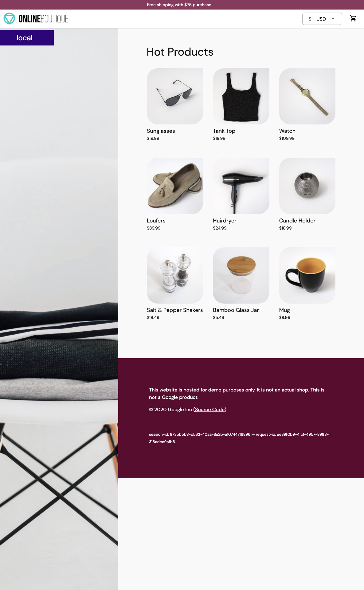 

我们需要做的最后一件事是删除`frontend-external`服务。`frontend-external`服务是一个`LoadBalancer`服务，它暴露了前端。由于我们正在使用Istio的入口网关，我们不再需要这个LoadBalancer服务了。 


删除服务，运行：

``` 
kubectl delete svc frontend-external 
```

`Online Boutique`应用清单还包括一个负载发生器，它正在生成对所有服务的请求―这是为了让我们能够模拟网站的流量。 


```
$ istioctl dashboard kiali
http://localhost:20001/kiali
```


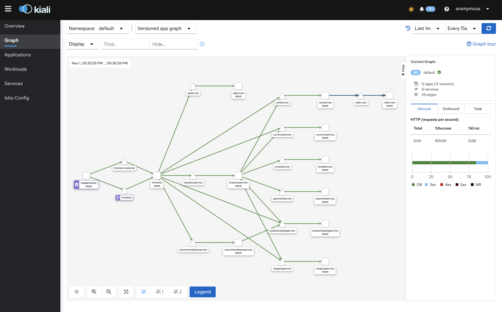 

## **4、路由流量** 

我们已经建立了一个新的Docker镜像，它使用了与当前运行的前端服务不同的标头。让我们看看如何部署所需的资源并将一定比例的流量路由到不同的前端服务版本。 


在我们创建任何资源之前，让我们删除现有的前端部署（`kubectl delete deploy frontend`)，并创建一个版本标签设置为`original`。

```
$ kubectl delete deploy frontend
deployment.apps "frontend" deleted
```
```
$ curl localhost
no healthy upstream
```

**`1frontendoriginal.yaml`**

```
apiVersion: apps/v1
kind: Deployment
metadata:
  name: frontend
spec:
  selector:
    matchLabels:
      app: frontend
      version: original
  template:
    metadata:
      labels:
        app: frontend
        version: original
      annotations:
        sidecar.istio.io/rewriteAppHTTPProbers: "true"
    spec:
      containers:
        - name: server
          image: gcr.io/google-samples/microservices-demo/frontend:v0.2.1
          ports:
          - containerPort: 8080
          readinessProbe:
            initialDelaySeconds: 10
            httpGet:
              path: "/_healthz"
              port: 8080
              httpHeaders:
              - name: "Cookie"
                value: "shop_session-id=x-readiness-probe"
          livenessProbe:
            initialDelaySeconds: 10
            httpGet:
              path: "/_healthz"
              port: 8080
              httpHeaders:
              - name: "Cookie"
                value: "shop_session-id=x-liveness-probe"
          env:
          - name: PORT
            value: "8080"
          - name: PRODUCT_CATALOG_SERVICE_ADDR
            value: "productcatalogservice:3550"
          - name: CURRENCY_SERVICE_ADDR
            value: "currencyservice:7000"
          - name: CART_SERVICE_ADDR
            value: "cartservice:7070"
          - name: RECOMMENDATION_SERVICE_ADDR
            value: "recommendationservice:8080"
          - name: SHIPPING_SERVICE_ADDR
            value: "shippingservice:50051"
          - name: CHECKOUT_SERVICE_ADDR
            value: "checkoutservice:5050"
          - name: AD_SERVICE_ADDR
            value: "adservice:9555"
          - name: ENV_PLATFORM
            value: "gcp"
          resources:
            requests:
              cpu: 100m
              memory: 64Mi
            limits:
              cpu: 200m
              memory: 128Mi
``` 

 

**现在我们准备创建一个`DestinationRule`，定义两个版本的前端——现有的original和新的（v1)。 **

`frontenddr.yaml`

```
apiVersion: networking.istio.io/v1alpha3
kind: DestinationRule
metadata:
  name: frontend
spec:
  host: frontend.default.svc.cluster.local
  subsets:
    - name: original
      labels:
        version: original
    - name: v1
      labels:
        version: 1.0.0
```

```
$ kubectl apply -f 2frontenddr.yaml 
destinationrule.networking.istio.io/frontend created
```

接下来，我们将更新VirtualService，并指定将所有流量路由到的子集。在这种情况下，我们将把所有流量路由到原始版本的前端。 


**`3frontendvs.yaml`**

```
apiVersion: networking.istio.io/v1alpha3
kind: VirtualService
metadata:
  name: frontend-ingress
spec:
  hosts:
    - '*'
  gateways:
    - frontend-gateway
  http:
  - route:
    - destination:
        host: frontend
        port:
          number: 80
        subset: original
```


```
$ kubectl apply -f 3frontendvs.yaml 
virtualservice.networking.istio.io/frontend-ingress configured
```


现在我们将新创建新的`VirtualService`配置为将所有进入的流量路由到original子集，我们可以安全地创建新的前端部署

```
apiVersion: apps/v1
kind: Deployment
metadata:
  name: frontend-v1
spec:
  selector:
    matchLabels:
      app: frontend
      version: 1.0.0
  template:
    metadata:
      labels:
        app: frontend
        version: 1.0.0
      annotations:
        sidecar.istio.io/rewriteAppHTTPProbers: "true"
    spec:
      containers:
        - name: server
          image: gcr.io/tetratelabs/boutique-frontend:1.0.0
          ports:
          - containerPort: 8080
          readinessProbe:
            initialDelaySeconds: 10
            httpGet:
              path: "/_healthz"
              port: 8080
              httpHeaders:
              - name: "Cookie"
                value: "shop_session-id=x-readiness-probe"
          livenessProbe:
            initialDelaySeconds: 10
            httpGet:
              path: "/_healthz"
              port: 8080
              httpHeaders:
              - name: "Cookie"
                value: "shop_session-id=x-liveness-probe"
          env:
          - name: PORT
            value: "8080"
          - name: PRODUCT_CATALOG_SERVICE_ADDR
            value: "productcatalogservice:3550"
          - name: CURRENCY_SERVICE_ADDR
            value: "currencyservice:7000"
          - name: CART_SERVICE_ADDR
            value: "cartservice:7070"
          - name: RECOMMENDATION_SERVICE_ADDR
            value: "recommendationservice:8080"
          - name: SHIPPING_SERVICE_ADDR
            value: "shippingservice:50051"
          - name: CHECKOUT_SERVICE_ADDR
            value: "checkoutservice:5050"
          - name: AD_SERVICE_ADDR
            value: "adservice:9555"
          - name: ENV_PLATFORM
            value: "gcp"
          resources:
            requests:
              cpu: 100m
              memory: 64Mi
            limits:
              cpu: 200m
              memory: 128Mi
```

```
$ kubectl apply -f 4frontendv1.yaml 
deployment.apps/frontend-v1 created
```

```
$ kubectl get pod | grep front
frontend-8658d97d64-rbwjw                2/2     Running            0          16m
frontend-v1-664f8ff6c6-lvnwr             2/2     Running            0          61s
```

如果我们在浏览器中打开 VirtualService中的权重`INGRESS_HOST`, 我们仍然会看到原始版本的前端。让我们更新，开始将30％的流量路由到`v1`的子集。 


`5frontend.yaml`

```
apiVersion: networking.istio.io/v1alpha3
kind: VirtualService
metadata:
  name: frontend-ingress
spec:
  hosts:
    - '*'
  gateways:
    - frontend-gateway
  http:
  - route:
    - destination:
        host: frontend
        port:
          number: 80
        subset: original
      weight: 70
    - destination:
        host: frontend
        port:
          number: 80
        subset: v1
      weight: 30

```

```
$ kubectl apply -f 5frontend30.yaml 
virtualservice.networking.istio.io/frontend-ingress configured
```

如果我们刷新几次网页，我们会注意到来自前端v1的更新标头 

 


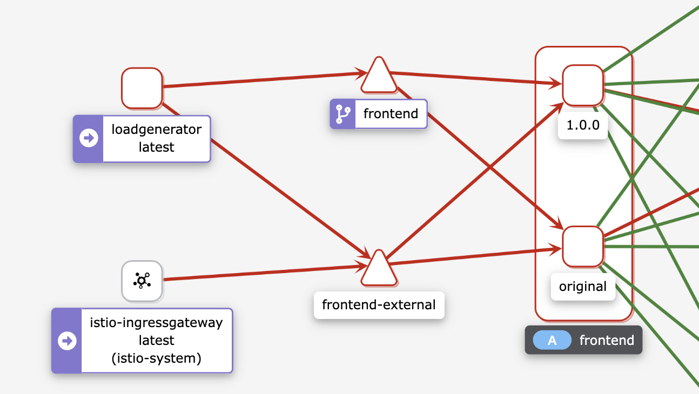 


## **5、故障注入** 


在本节中，我们将为推荐服务引入5秒的延迟。Envoy将为50％的请求注入延迟。 

**`recommendationdelay.yaml`**

```
apiVersion: networking.istio.io/v1alpha3
kind: VirtualService
metadata:
  name: recommendationservice
spec:
  hosts:
  - recommendationservice
  http:
  - route:
      - destination:
          host: recommendationservice
    fault:
      delay:
        percentage:
          value: 50
        fixedDelay: 5s
```

```
$ kubectl get vs
NAME                    GATEWAYS               HOSTS                                    AGE
frontend                                       ["frontend.default.svc.cluster.local"]   28h
frontend-ingress        ["frontend-gateway"]   ["*"]                                    28h
recommendationservice                          ["recommendationservice"]                84s
```


我们可以在浏览器中打开`INGRESS_HOST`，然后点击其中一个产品。推荐服务的结果显示在屏幕底部的”Other Products You Might Light“部分。

**<mark>如果我们刷新几次页面，我们会注意到，该页面要么立即加载，要么有一个延迟加载页面。这个延迟是由于我们注入了5秒的延迟</mark>**。 

我们可以打开Grafana (`istioctl dash grafana`)和Istio服务仪表板。确保从服务列表中选择`recommendationsservice`，在Reporter下拉菜单中选择source，并查看显示延迟的**Client Request Duration**，如下图所示。 

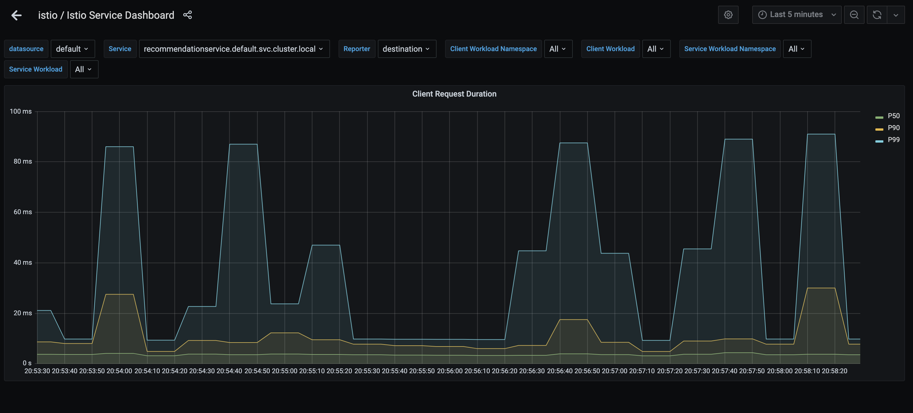 


同样地，我们可以注入一个中止。在下面的例子中，我们为发送到产品目录服务的50％的请求注入一个`HTTP 5000` 

`productcatalogserviceabort.yaml`

```
apiVersion: networking.istio.io/v1alpha3
kind: VirtualService
metadata:
  name: productcatalogservice
spec:
  hosts:
  - productcatalogservice
  http:
  - route:
      - destination:
          host: productcatalogservice
    fault:
      abort:
        percentage:
          value: 50
        httpStatus: 500
```

```
$ kubectl apply -f 7productcatalogserviceabort.yaml 
virtualservice.networking.istio.io/productcatalogservice created

$ kubectl get vs
NAME                    GATEWAYS               HOSTS                                    AGE
frontend                                       ["frontend.default.svc.cluster.local"]   28h
frontend-ingress        ["frontend-gateway"]   ["*"]                                    28h
productcatalogservice                          ["productcatalogservice"]                12s
recommendationservice                          ["recommendationservice"]                11m
```

如果我们刷新几次产品页面，我们应该得到如下图所示的错误信息。 


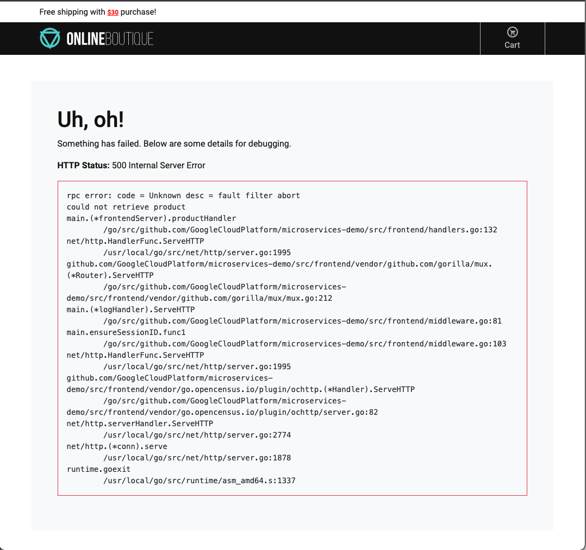 


请注意，错误信息说，失败的原因是故障过滤器中止。如果我们打开Grafana (`istioctl dash grafana`)，我们也会注意到图中报告的错误。 

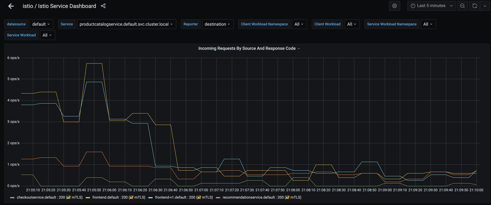 


## **6、弹性** 

为了演示弹性功能，我们将在产品目录服务部署中添加一个名为`EXTRA LATENCY`的环境变量。这个变量会在每次调用服务时注入一个额外的体眠。 

通过运行`kubectl edit deploy productcatalogservice`来编辑产品目录服务部署。 这将打开一个编辑器。滚动到有环境变量的部分，添加`EXTRA_LATENCY`环境变量。 

```
...
   spec:
    containers:
    - env:
     - name: EXTRA_LATENCY
      value: 6s
...
```

```
$ kubectl edit deploy productcatalogservice
deployment.apps/productcatalogservice edited
```


保存并推出编辑器。 

如果我们刷新页面，我们会发现页面需要6秒的时间来加载——那是由于我们注入的延迟。 

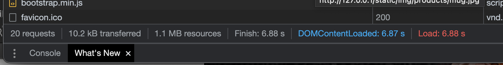 

让我们给产品目录服务添加一个2秒的超时。 

`productcatalogservice-timeout.yaml`

```
apiVersion: networking.istio.io/v1alpha3
kind: VirtualService
metadata:
  name: productcatalogservice
spec:
  hosts:
  - productcatalogservice
  http:
  - route:
   - destination:
     host: productcatalogservice
   timeout: 2s
```

如果我们刷新页面，我们会注意到一个错误信息的出现 

```
$ kubectl apply -f 8productcatalogservice-timeout.yaml 
virtualservice.networking.istio.io/productcatalogservice created

$ kubectl get vs
NAME                    GATEWAYS               HOSTS                                    AGE
frontend                                       ["frontend.default.svc.cluster.local"]   29h
frontend-ingress        ["frontend-gateway"]   ["*"]                                    18m
productcatalogservice                          ["productcatalogservice"]                18s
```


**该错误表明对产品目录服务的请求超时了。我们修改了服务，增加了6秒的延迟，并将超时设置为2秒。**

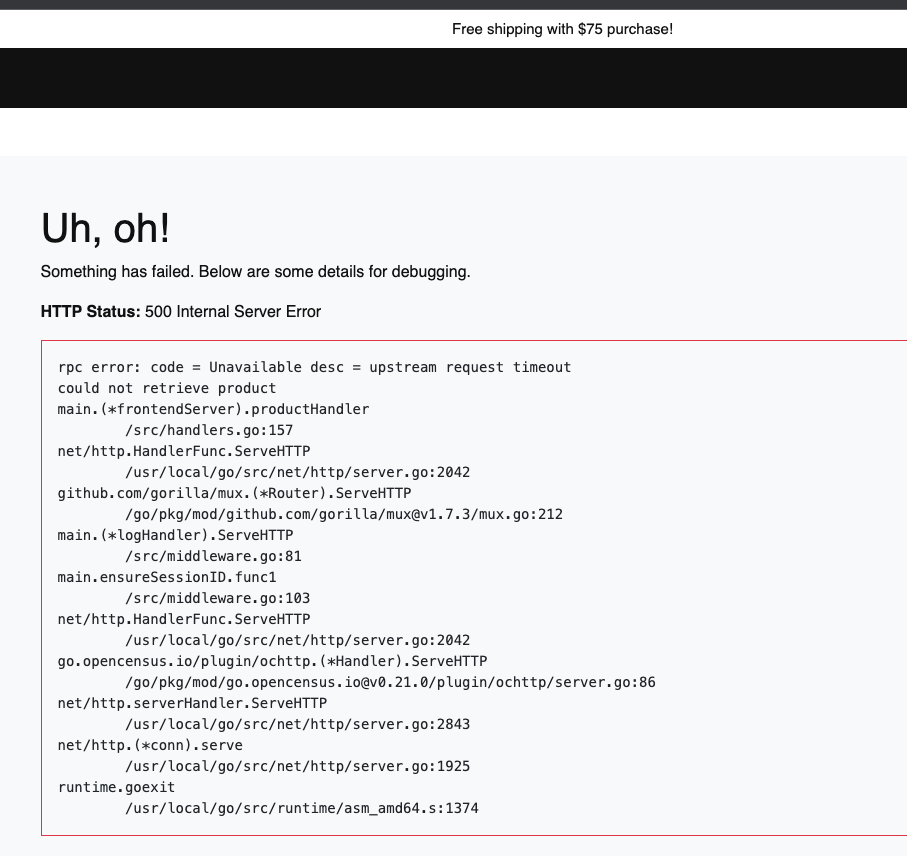 


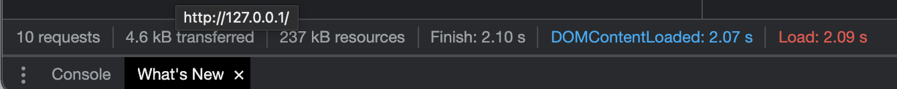 

**让我们定义一个重试策略，有三次尝试，每次尝试的超时为1秒。** 


```
apiVersion: networking.istio.io/v1alpha3
kind: VirtualService
metadata:
  name: productcatalogservice
spec:
  hosts:
  - productcatalogservice
  http:
  - route:
    - destination:
        host: productcatalogservice
    retries:
      attempts: 3
      perTryTimeout: 1s
```

```
$ kubectl apply -f 9productcatalogservice-att.yaml 
virtualservice.networking.istio.io/productcatalogservice configured
```

**由于我们在产品目录服务部署中留下了额外的延迟，我们仍然会看到错误。让我们打开`Zipkin`中的追踪，看看重试策略的作用。**


**使用`istioctl dash zipkin`来打开Zipkin仪表盘。点击十按钮，选择`serviceName`和`frontend.default`。为了只得到至少一秒钟的响应（这就是我们的`perTryTimeout`)，选择`minDuration`，在文本框中输入1s。点击搜索按钮，显示所有追踪。**


**点击Filter按钮**，从下拉菜单中选择`productCatalogService.default`。你应该看到花了1秒钟的trace。这些trace对应于我们之前定义的`perTryTimeout`


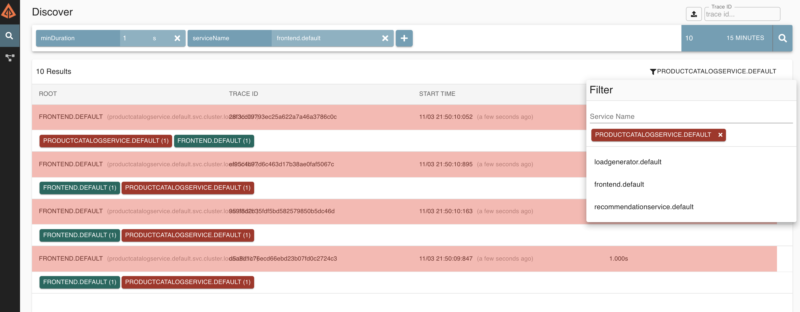 