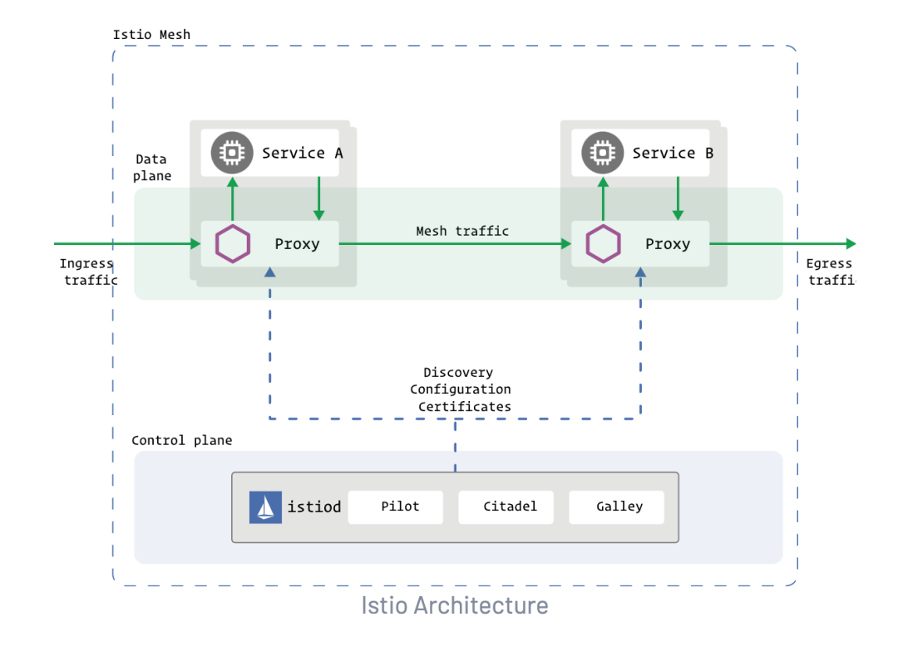

# **第一节 istio浅析 (Slide备案）**

## **1、istio简介**

**istio是一个开源服务网格平台，它可以控制微服务之间数据的共享方式，其附带的 API 可以将 Istio 集成到任何日志记录平台、遥测或策略系统中**。

在设计上，Istio 可以在多种环境中运行：企业本地、云托管、Kubernetes容器，或虚拟机上运行的服务等。 

 

**Istio 提供一种简单的方式来为已部署的服务建立网络，该网络具有负载均衡、服务间认证、监控等功能**，

只需要对服务的代码进行一点或不需要做任何改动，让服务支持 Istio，**只需要在环境中部署一个特殊的 sidecar 代理，使用 Istio 控制平面功能配置和管理代理，拦截微服务之间的所有网络通信**：

* HTTP、gRPC、WebSocket 和 TCP 流量的自动负载均衡。
* **通过丰富的路由规则、重试、故障转移和故障注入，可以对流量行为进行细粒度控制**。
* 可插入的策略层和配置 API，支持访问控制、速率限制和配额。
* 对出入集群入口和出口中所有流量的自动度量指标、日志记录和追踪。
* 通过强大的基于身份的验证和授权，在集群中实现安全的服务间通信。

## **2、istio 框架**

### **2-1 istio数据平面和控制平面**

* **数据平面 由一组智能代理（Envoy）组成，被部署为 sidecar**。这些代理负责协调和控制微服务之间的所有网络通信。他们还收集和报告所有网格流量的遥测数据。
* **控制平面 管理并配置代理来进行流量路由。**

 

istio 中的流量分为数据平面流量和控制平面流量。

* 数据平面流量是指工作负载的业务逻辑发送和接收的消息
* **控制平面流量是指在 Istio 组件之间发送的配置和控制消息用来编排网格的行为**。

Istio 中的流量管理特指数据平面流量。

## **3、Envoy**

Istio 使用 Envoy 代理的扩展版本。Envoy 是用 C++ 开发的高性能代理，用于协调服务网格中所有服务的入站和出站流量。**Envoy 代理是唯一与数据平面流量交互的 Istio 组件**。

**Envoy 代理被部署为服务的 sidecar**，在逻辑上为服务增加了 Envoy 的许多内置特性，例如:

* 动态服务发现
* 负载均衡
* TLS 终端
* HTTP/2 与 gRPC 代理
* 熔断器
* 健康检查
* 基于百分比流量分割的分阶段发布
* 故障注入
* 丰富的指标

这种 sidecar 部署允许 Istio 提取大量关于流量行为的信号作为属性。

Istio 可以使用这些属性来实施策略决策，并将其发送到监视系统以提供有关整个网格行为的信息。

**sidecar 代理模型可以实现现有的部署添加 Istio 功能，而不需要重新设计架构或重写代码**。

## **4、Pilot**

**Pilot 为 Envoy sidecar 提供服务发现、用于智能路由的流量管理功能（例如，A/B 测试、金丝雀发布等）以及弹性功能（超时、重试、熔断器等）**。

**Pilot 将控制流量行为的高级路由规则转换为特定于环境的配置，并在运行时将它们传播到 sidecar。**

Pilot 将特定于平台的服务发现机制抽象出来，并将它们合成为任何符合 Envoy API 的 sidecar 都可以使用的标准格式。

 

平台启动一个服务的新实例，该实例通知其平台适配器。

1. 平台适配器使用 Pilot 抽象模型注册实例。
2. **Pilot 将流量规则和配置派发给 Envoy 代理，来传达此次更改**。
3. 这种松耦合允许 Istio 在 Kubernetes、Consul 或 Nomad 等多种环境中运行，同时维护相同的 operator 接口来进行流量管理。可以使用 Istio 的流量管理 API 来指示 Pilot 优化 Envoy 配置，以便对服务网格中的流量进行更细粒度地控制。

## **5、Citadel**

Citadel 通过内置的身份和证书管理，可以支持强大的服务到服务以及最终用户的身份验证，可以使用 Citadel 来升级服务网格中的未加密流量，**使用 Citadel，operator 可以执行基于服务身份的策略，而不是相对不稳定的 3 层或 4 层网络标识**。

## **6、Galley**

**Galley 是 Istio 的配置验证、提取、处理和分发组件**。它负责将其余的 Istio 组件与从底层平台（例如 Kubernetes）获取用户配置的细节隔离开来。

## **7、Istio设计目标**

几个关键的设计目标形成了 Istio 的架构。这些目标对于使系统能够大规模和高性能地处理服务是至关重要的。

### **1. 透明度最大化**

为了采用 Istio，运维人员或开发人员需要做尽可能少的工作，才能从系统中获得真正的价值。为此，Istio 可以自动将自己注入到服务之间的所有网络路径中。Istio 使用 sidecar 代理来捕获流量，并在可能的情况下，在不更改已部署的应用程序代码的情况下，自动对网络层进行配置，以实现通过这些代理来路由流量。

在 Kubernetes 中，代理被注入到pods中，通过编写iptables规则来捕获流量。

**一旦 sidecar 代理被注入以及流量路由被编程，Istio 就可以协调所有的流量。这个原则也适用于性能**。当将 Istio 应用于部署时，运维人员会看到所提供功能的资源成本增加的最小。组件和 API 的设计必须考虑到性能和可伸缩性。

### **2 可扩展性**

随着运维人员和开发人员越来越依赖于 Istio 提供的功能，系统必须随着他们的需求而增长。

在继续添加新特性时，最大的需求是扩展策略系统的能力，与其他策略和控制源的集成，以及将关于网格行为的信号传播到其他系统进行分析的能力。策略运行时支持用于接入其他服务的标准扩展机制。此外，它允许扩展其词汇表，允许根据网格生成的新信号执行策略。

### **3 可移植性**

使用 Istio 的生态系统在许多方面都有所不同。Istio 必须在任何云环境或本地环境中通过最小的努力就能运行起来。将基于 Istio 的服务移植到新环境的任务必须是容易实现的。

使用 Istio，可以操作部署到多个环境中的单个服务。例如，可以在多个云上部署来实现冗余。

策略一致性：将策略应用于服务之间的 API 调用提供了对网格行为的大量控制。然而，将策略应用在区别于 API 层上的资源也同样重要。例如，在机器学习训练任务消耗的 CPU 数量上应用配额比在发起任务的请求调用上应用配额更有用。为此，Istio 使用自己的 API 将策略系统维护为一个独立的服务，而不是将策略系统集成到 sidecar 代理中，从而允许服务根据需要直接与之集成。

## **8、istio组件详解**

### **8-1 Istio的sidecar代理**

**网络模型发展**

 

我们回顾计算网络的发展史。在分组交换网络的出现后，需要用户自己来使用握手、重传和因特网将一堆数据包转换为有序的字节流。出于互操作性和简单性的考虑，又出现了“最佳实践”流数据包：TCP。TCP的标准化使得一代程序员摆脱了滑动窗口，重试和拥塞崩溃的实现。

接着，许多请求/响应在TCP协议之上运行，其中许多最终迁移到HTTP（或HTTP/2或gRPC）。HTTP协议不仅仅用于基于浏览器的应用程序，还有像Mongo这样的数据库也提供HTTP接口，极大的提升了开发的便利性和标准化。

而微服务的通信模式中的 API 和相关实现形成了新的通信层，服务网格（ServiceMesh）可以视作这些新要素的集大成者。

通讯层的实现方式，有以下选择：

* 用库的形式在微服务应用程序中导入使用。
* 用节点代理或守护程序的形式为特定节点/计算机上的所有容器提供服务。
* **用Sidecar容器的形式运行，和应用容器一同运行**。

**服务网格实现方式**

* **lib模式**

 

使用客户端库有两个好处：每项服务都使用本地资源，并且开发人员有权自行选择现有库或者构建新的特定于语言的库。

而其最大的缺点是基础设施与应用程序代码紧密耦合在一起，客户端库的不统一，特定语言的设计使得他们的功能和行为无法保持一致。大规模采用特定于语言的弹性库的代价很高，一般是很难嵌入未开发的应用程序中，或者完全不能合并到现有的架构中。并且在大型环境中，协调升级客户端库也是很困难的。

如何在为每个应用程序实例使用服务代理，应用程序不再需要特定于语言的弹性库来处理熔断，超时，重试，服务发现，负载均衡等。其中Kubernetes使用节点代理proxy的模式，istio使用Sidecar注入的模式。

* **proxy 模式**

 

在此架构中，每个节点上都运行一个单独的代理（通常是用户进程），为异构的服务提供负载。相比之下，该模型与库模型相反：它不关心应用程序的语言，可以为许多不同的微服务租户提供服务。例如，Kubernetes默认的kube-proxy代理。

优点

* 通过节点共享开销（尤其是内存）
* 更少、更容易扩展和分发配置信息

缺点

* 对共享资源的管理复杂，易出现单点故障

* **Sidecar模式**

 

在Sidecar模式下，增加服务代理要做两个事情：Sidecar注入和网络流量捕获。Sidecar注入是将一个代理添加到一个给定的应用程序的方法，而网络流量的捕获则是一种将入站流量定向到代理并将出站流量也定向到代理的方法。

## **9、为什么需要istio？**

我们已经有了容器的协调器，例如Kubernetes，为什么还需要另一个基础设施呢？随着微服务和容器成为主流，容器协调器提供了集群（节点和容器）所需的大部分的功能，这些功能主要是集中在基础设施级别的调度，发现和健康状况，而缺少微服务所需的服务级别的功能。istio是专用于服务之间的通信变得更加安全，快速，高效的基础设施。

## **10、Sidecar 注入及流量劫持步骤概述**

istio sidecar注入的方法，可以为手动注入，自动注入。

下面是从 Sidecar 注入、Pod 启动到 Sidecar proxy 拦截流量及 Envoy 处理路由的步骤概览。

* Kubernetes 通过 Admission Controller 自动注入，或者用户使用 istioctl 命令手动注入 sidecar 容器。
* 应用 YAML 配置部署应用，此时 Kubernetes API server 接收到的服务创建配置文件中已经包含了 Init 容器及 sidecar proxy
* 在 sidecar proxy 容器和应用容器启动之前，首先运行init-container，init-container用于设置 iptables（Istio 中默认的流量拦截方式，还可以使用 BPF、IPVS 等方式） 将进入 pod 的流量劫持到 Envoy sidecar proxy。所有 TCP 流量（Envoy 目前只支持 TCP 流量）将被 sidecar 劫持，其他协议的流量将按原来的目的地请求。
* 启动 Pod 中的 Envoy sidecar proxy 和应用程序容器。
* 不论是进入还是从 Pod 发出的 TCP 请求都会被 iptables 劫持，inbound 流量被劫持后经 Inbound Handler 处理后转交给应用程序容器处理，outbound 流量被 iptables 劫持后转交给 Outbound Handler 处理，并确定转发的 upstream 和 Endpoint。
* Sidecar proxy 请求 Pilot 使用 xDS 协议同步 Envoy 配置，其中包括 LDS、EDS、CDS 等，不过为了保证更新的顺序，Envoy 会直接使用 ADS 向 Pilot 请求配置更新。

## **11、Envoy**

**Envoy 架构**

 

* **Downstream/下游：下游主机连接到 Envoy，发送请求并接收响应。**
* **Upstream/上游：上游主机接收来自 Envoy 的连接和请求，并返回响应**。
* **Listener/监听器：监听器是命名网地址（例如，端口、unix domain socket等)，可以被下游客户端连接。Envoy 暴露一个或者多个监听器给下游主机连接**
* Cluster/集群：集群是指 Envoy 连接到的逻辑上相同的一组上游主机。Envoy 通过服务发现来发现集群的成员。可以选择通过主动健康检查来确定集群成员的健康状态。Envoy 通过负载均衡策略决定将请求路由到哪个集群成员。

## **12、Envoy在istio的工作原理**

Listener是一个可以接收下游客户端连接的指定的网络位置（例如，端口，unix域套接字等）。Envoy公开一个或多个Listener，大部分情况下是对外开放端口，外部客户可以使用该端口建立连接。可以选择为Listener配置一系列的的监听器过滤器Listener Filter，用于操作连接元数据，在不对核心进行变更的情况下提供更好的系统集成。

**可以使用静态配置文件或者通过API动态配置设置监听器（Listerens），路由（routes），集群（clusters），端点（endpoints），这些API包括监听器发现服务（LDS），路由发现服务（RDS），集群发现服务（CDS），端点发现服务（EDS），这些服务发现的集合称为xDS**。

## **13、Istiod**

注：istio的网络架构有多次大的演进，目前版本v1.8是如下的架构模式。架构演进的目的可以参考下文的文献(介绍 istiod：简化控制平面)。

本章节主要介绍pilot的实现。

 

Pilot负责对istio中部署的数据平面、入口网关、出口网关、以及服务代理进行编程。主要是如下3个配置，

* 网格配置：服务网格的一组全局配置
* 网络配置：serviceEntry、DestinationRule、VirtualService、Gateway和服务代理的配置
* 服务发现：来自注册表的有关一个或者多个底层平台中的服务目录的位置和元数据信息。

 

Pilot根据网格配置、网络配置、服务发现这三个配置创建资源和部署状的模型。当服务代理异步地部署到集群中，他们将连接到Pilot。Pilot根据标签和服务代理附属的服务将服务代理进行分组。Pilot使用这个模型为每组连接的服务代理，生成发现服务（xDS）响应，当服务代理连接后，Pilot发送环境的当前的状态和配置。如果基础平台的状态变化时，模型会以一定的频率进行更新，更新模型需要更新当前的xDS的配置集，当xDS配置改变后，Pilot会计算受影响的服务代理组，并将更新后的配置推送给他们。
