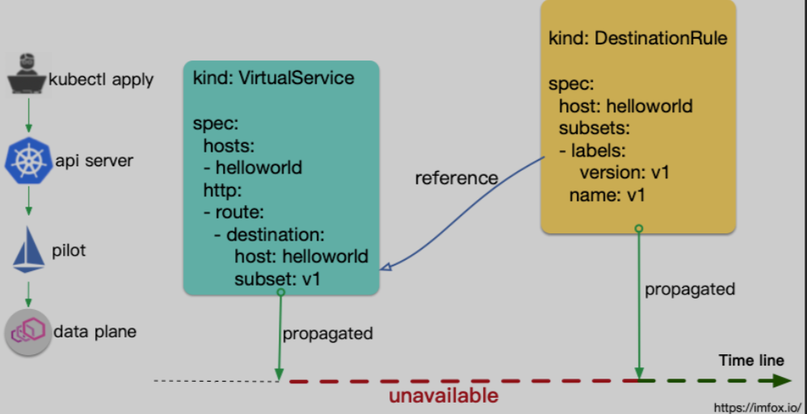
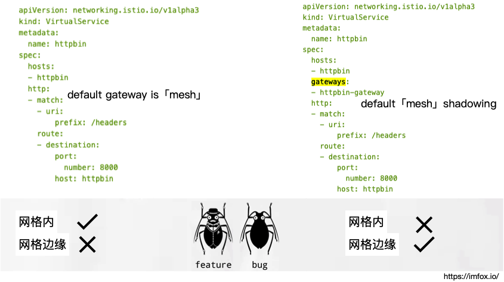
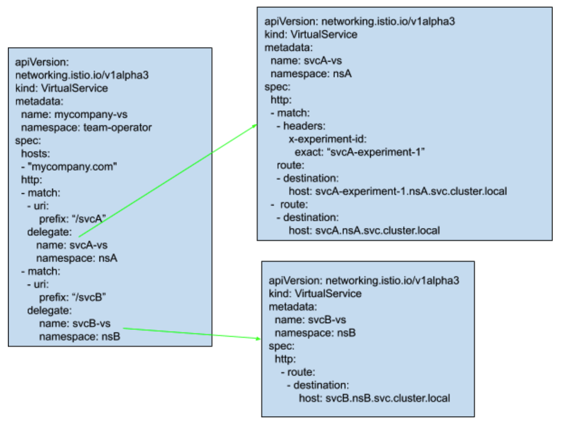
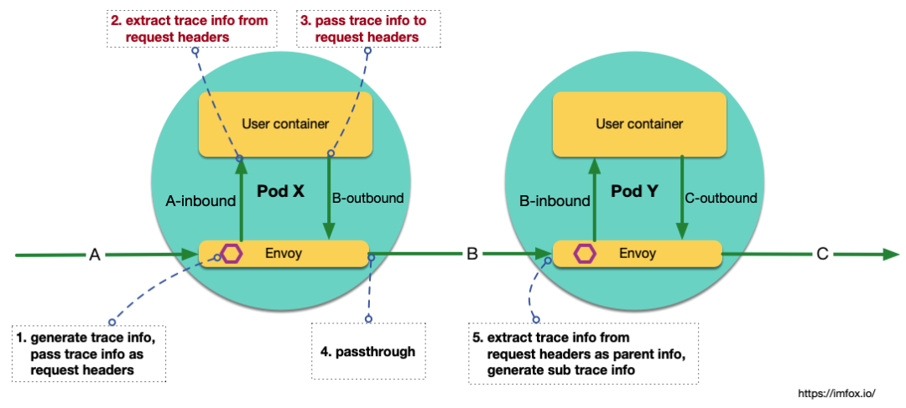
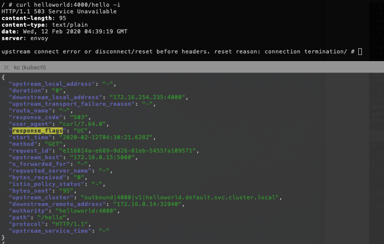
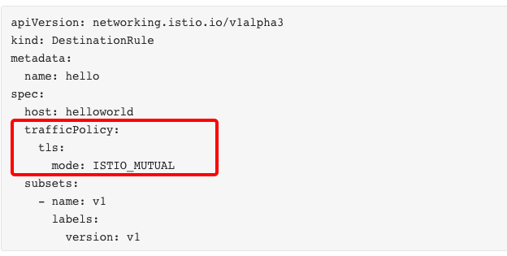
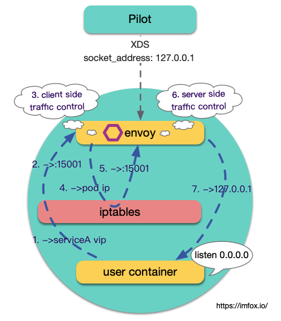

# **第五节 Istio 常见的 10 个异常分析**


## **1、Service 端口命名约束**

Istio 支持多平台，不过 Istio 和 Kubernetes 的兼容性是最优的，不管是设计理念，核心团队还是社区， 都有一脉相承的意思。

**但  `Istio` 和 `Kubernetes `的适配并非完全没有冲突，一个典型问题就是 `Istio` 需要 `Kubernetes Service` 按照协议进行端口命名（`Port Naming`）**。


**端口命名不满足约束而导致的流量异常，是使用 `Mesh` 过程中最常见的问题，其现象是协议相关的流控规则不生效，这通常可以通过检查该 `Port LDS` 中 `filter` 的类型来定位**。

### **1-1 原因**

**`Kubernetes` 的网络对应用层是无感知的**，`Kubernetes` 的主要流量转发逻辑发生在 `Node` 上，由 `iptables/IPVS` 来实现，这些规则并不关心应用层里是什么协议。


**`Istio` 的核心能力是对 `7 `层流量进行管控，但前提条件是 `Istio` 必须知道每个受管控的服务是什么协议，`Istio` 会根据端口协议的不同，下发不同的流控功能（`Envoy filter`），而 `Kubernetes `资源定义里并不包括七层协议信息，所以 `Istio` 需要用户显式提供。**


**Istio 的解决方案：Protocol Sniffing**

协议嗅探概要：

* 检测 `TLS CLIENT_HELLO` 提取 SNI、ALPN、NPN 等信息
* 基于常见协议的已知典型结构，尝试检测应用层 `Plaintext` 内容：
	* 基于`HTTP2 spec: Connection Preface`，判断是否为 `HTTP/2`
	* 基于 `HTTP header` 结构，判断是否是 `HTTP/1.x`
* 过程中会设置超时控制和检测包大小限制， 默认按照协议 `TCP` 处理

### **1-2 最佳实践**

`Protocol Sniffing `减少了新手使用 `Istio` 所需的配置，但是可能会带来不确定的行为。不确定的行为在生产环境中是应该尽量避免的。

**一些嗅探失效的例子：**

* 客户端和服务端使用着某类非标准的七层协议，客户端和服务端都可以正确解析，但是不能确保 Istio 自动嗅探逻辑认可这类非标准协议。比如对于 `HTTP` 协议，标准的换行分隔是用 `CRLF （0x0d 0x0a`, 但是大部分 `HTTP` 类库会使用并认可 `LF（0x0a）`作为分隔。
* 某些自定义私有协议，数据流的起始格式和 HTTP 报文格式类似，但是后续数据流是自定义格式：
	* 未开启嗅探时：数据流按照 `L4 TCP` 进行路由，符合用户期望
	* 如果开启嗅探：数据流最开始会被认定为` L7 http` 协议，但是后续数据不符合 `HTTP` 格式，流量将被中断


**建议生产环境不使用协议嗅探，接入 `Mesh` 的 `Service` 应该按照约定使用协议前缀进行命名**。

## **2、流控规则下发顺序问题**

### **2-1 异常描述**

**在批量更新流量规则的过程中，偶尔会出现流量异常（`503`），`Envoy` 日志中 `RESPONSE_FLAGS` 包含`「NR」`标志（`No route configured`），持续时间不长，会自动恢复。**

### **2-2 原因分析**

当用户使用 `kubectl apply -f multiple-virtualservice-destinationrule.yaml` 时

**这些对象的传播和生效先后顺序是不保证的，所谓最终一致性，比如 `VirtualService` 中引用了某一个 `DestinationRule` 定义的子版本，但是这个 `DestinationRule` 资源的传播和生效可能在时间上落后于该 `VirtualService` 资源。**



最佳实践：**Make Before Break**

将更新过程从批量单步拆分为多步骤，**确保整个过程中不会引用不存在的 subset**：

* 当新增 `DestinationRule subset` 时，**应该先 `apply DestinationRule subset`，等待 `subset` 生效后，再 `apply `引用了该 `subset` 的 `VirtualService`。**
* **当删除 `DestinationRule subset` 时，应该先 删除 `VirtualService` 中对该 `subset` 的引用，等待 `VirtualService ` 的修改生效后，在执行删除 `DestinationRule subset`**。


## **3. 请求中断分析**

**请求异常，到底是 Istio 流控规则导致，还是业务应用的返回，流量断点出现在哪个具体的 Pod？**

这是使用` Mesh` 最常见的困境，在微服务中引入 `Envoy`作为代理后，当流量访问和预期行为不符时，用户很难快速确定问题是出在哪个环节。客户端收到的异常响应，诸如 `403`、`404`、`503` 或者连接中断等，可能是链路中任一 `Sidecar` 执行流量管控的结果， 但也有可能是来自某个服务的合理逻辑响应。

**Envoy 流量模型**

**Envoy 接受请求流量叫做 `Downstream`，`Envoy` 发出请求流量叫做`Upstream`。在处理 `Downstream` 和 `Upstream` 过程中，分别会涉及 `2` 个流量端点，即请求的发起端和接收端**：


在这个过程中，` Envoy` 会根据用户规则，计算出符合条件的转发目的主机集合，这个集合叫做 `UPSTREAM_CLUSTER`，并根据负载均衡规则，从这个集合中选择一个 `host` 作为流量转发的接收端点，这个 `host` 就是 `UPSTREAM_HOST`。

以上就是 `Envoy` 请求处理的流量五元组信息， 这是 `Envoy` 日志里最重要的部分，通过这个五元组我们可以准确的观测流量「从哪里来」和「到哪里去」。

* `UPSTREAM_CLUSTER`
* `DOWNSTREAM_REMOTE_ADDRESS`
* `DOWNSTREAM_LOCAL_ADDRESS`
* `UPSTREAM_LOCAL_ADDRESS`
* `UPSTREAM_HOST`

**日志分析示例**


通过日志重点观测 2 个信息：

* 断点是在哪里 ？

* 原因是什么？


### **示例一：一次正常的 `client-server` 请求。**


可以看到 `2` 端日志包含相同的 `request ID`，因此可以将流量分析串联起来。

### **示例二：`no healthy upstream`，比如目标 `deployment` 健康副本数为 `0`**。


日志中 `flag「UH」`表示 `upstream cluster` 中没有健康的` host`。

### **示例三：`No route configured`，比如 `DestinationRule` 缺乏对应的 `subset`**


**日志中 `flag「NR」`表示找不到路由。**

### **示例四：`Upstream connection failure`，比如服务未正常监听端口。**


**日志中 `flag「UF」`表示 `Upstream `连接失败，据此可以判断出流量断点位置。**

## **4、 `Sidecar` 和 `User Container` 启动顺序**

###** 4-1 异常描述**

`Sidecar` 模式在 `Kubernetes` 世界很流行，但对目前的 `Kubernetes（V1.17）`来说，并没有 `Sidecar` 的概念，`Sidecar` 容器的角色是用户主观赋予的。

对 `Istio `用户来说，一个常见的困扰是：**`Sidecar `和用户容器的启动顺序：**


`Sidecar（Envoy）` 和用户容器的启动顺序是不确定的，如果用户容器先启动了，`Envoy` 还未完成启动，这时候用户容器往外发送请求，请求仍然会被拦截，发往未启动的 `Envoy`，请求异常。

**在 `Pod `终止阶段，也会有类似的异常，根源仍然是 `Sidecar `和普通容器的生命周期的不确定性。**


### **4-2 解决方案**

目前常规的规避方案主要是有这样几种：


* **业务容器延迟几秒启动，或者失败重试**
* 启动脚本中主动探测 `Envoy` 是否 `ready`，如 `127.0.0.1:15020/healthz/ready`


无论哪种方案都显得很蹩脚，为了彻底解决上述痛点，**从 `Kubernetes 1.18` 版本开始，`Kubernetes` 内置的 `Sidecar` 功能将确保 `Sidecar` 在正常业务流程开始之前就启动并运行，即通过更改 `Pod` 的启动生命周期，在` init` 容器完成后启动 `Sidecar` 容器，在 `Sidecar` 容器就绪后启动业务容器，从启动流程上保证顺序性**。

**<mark>`init` 容器 =>  `Sidecar` 容器 => 业务容器</mark>**

而 Pod 终止阶段，只有当所有普通容器都已到达终止状态（`Succeeded for restartPolicy=OnFailure` 或 `Succeeded/Failed for restartPolicy=Never`），才会向 `Sidecar` 容器发送 `SIGTERM` 信号。


## **5、 Ingress Gateway 和 Service 端口联动**

`Ingress Gateway` 规则不生效的一个常见原因是：**`Gateway` 的监听端口在对应的 `Kubernetes Service` 上没有开启，首先我们需要理解 `Istio Ingress Gateway` 和 `Kubernetes Service` 的关系：**


上图中，虽然 `Gateway` 定义期望管控端口 `b` 和 `c`，但是它对应的 `Service` （通过腾讯云 CLB）只开启了端口 `a` 和` b`，因此最终从 `LB` 端口 `b` 进来的流量才能被 `Istio Gateway `管控。

* **`Istio Gateway` 和 `Kubernetes Service` 没有直接的关联，二者都是通过 `selector` 去绑定 `Pod`，实现间接关联。**
* **`Istio CRD Gateway` 只实现了将用户流控规则下发到网格边缘节点，流量仍需要通过` LB` 控制才能进入网**格。
* 腾讯云 `TKE Mesh` 实现了 `Gateway-Service` 定义中的 `Port `动态联动，让用户聚焦在网格内的配置。

## **6、 VirtualService 作用域**

`VirtualService` 包含了大部分 `outbound `端的流量规则，它既可以应用到网格内部数据面代理中， 也可以应用到网格边缘的代理中。

`VirtualService` 的属性 `Gateways` 用于指定 `VirtualService` 的生效范围：

* 如果 `VirtualService.gateways` 为空，则 `Istio` 为其赋默认值 `Mesh`，代表生效范围为网格内部
* 如果希望 `VirtualService` 应用到具体边缘网关上，则需要显示为其赋值：`gateway-name1`，`gateway-name2`
* 如果希望 `VirtualService` 同时应用到网格内部和边缘网关上，则需要显示地把 `Mesh `值加入 `VirtualService.gateways`，如 `Mesh`，`gateway-name1`，`gateway-name2`

一个常见的问题是以上的第三种情况，`VirtualService` 最开始作用于网关内部，后续要将其规则扩展到边缘网关上，用户往往只会添加具体 `Gateway Name`，而遗漏 `Mesh`：




`Istio` 自动给 `VirtualService.gateways `设置默认值，本意是为了简化用户的配置，但是往往会导致用户应用不当，一个 `feature` 一不小心会被用成了` bug`。


## **7、 `VirtualService` 不支持 `Host Fragment`**

### **7-1 异常案例**

对某一` host `新增、修改 `VirtualService`，发现规则始终无法生效，排查发现存在其他 `VirtualService` 也对该 `host` 应用了其他规则，规则内容可能不冲突，但还是可能出现其中一些规则无法生效的情况。

### **7-2 背景**

* `VirtualService` 里的规则，按照 `host` 进行聚合
* **随着业务的增长，`VirtualService` 的内容会快速增长，一个 `host` 的流控规则，可能会由不同的团队分布维护。如安全规则和业务规则分开，不同业务按照子 `path `分开**

目前 `Istio` 对 `cross-resource VirtualService` 的支持情况：

* **在网格边缘（`Gateway`），同一个 `host` 的流控规则，支持分布到多个 `VirtualService` 对象中，`Istio` 自动聚合，但依赖定义顺序以及用户自行避免冲突**。
* **在网格内部（`for Sidecar`），同一个 `host` 的流控规则，不支持分布到多个 `VirtualService` 对象中，如果同一个 `host` 存在多个 `VirtualService`，只有第一个 `VirtualService` 生效，且没有冲突检测。**

`VirtualService` 不能很好支持 `host` 规则分片，使得团队的维护职责不能很好的解耦，配置人员需要知悉目标 `host` 的所有流控规则，才有信心去修改 `VirtualService`。

`Istio` 解决方案：`Virtual Service chaining（plan in 1.6）`



Istio 计划在 1.6 中支持 Virtual Service 代理链：

* `Virtual Service` 支持分片定义 + 代理链
* 支持团队对同一 host 的 `Virtual Service` 进行灵活分片，比如按照 `SecOps/Netops/Business` 特性分离，各团队维护各种独立的 `Virtual Service`

## **8、全链路跟踪并非完全透明接入**

### **8-1 异常案例**

微服务接入 Service Mesh 后，链路跟踪数据没有形成串联。

### **8-2 原因**

`Service Mesh `遥测系统中，对调用链跟踪的实现，并非完全的零入侵，需要用户业务作出少量的修改才能支持，具体地，在用户发出（`HTTP/gRPC`）` RPC` 时， 需要主动将上游请求中存在的 `B3 trace headers写`入下游 `RPC` 请求头中，这些 `headers` 包括：


有部分用户难以理解：既然 `inbound` 流量和 `outbound` 流量已经完全被拦截到` Envoy`，`Envoy `可以实现完全的流量管控和修改，为什么还需要应用显示第传递` headers`？



对于 Envoy 来说，`inbound `请求和 `outbound` 请求完全是独立的，`Envoy` 无法感知请求之间的关联。实际上这些请求到底有无上下级关联，完全由应用自己决定。

举一个特殊的业务场景，如果 `Pod X` 接收到 请求 `A`，触发的业务逻辑是：每隔` 10 `秒 发送一个请求到 `Pod Y`，如 `B1`，`B2`，`B3`，那么这些扇出的请求` Bx（x=1，2，3……）`，和请求` A `是什么关系？业务可能有不同的决策：认为` A` 是` Bx` 的父请求，或者认为 `Bx` 是独立的顶层请求。


## **9、 mTLS 导致连接中断**

在开启 `Istio mTLS` 的用户场景中，访问出现 `connection termination` 是一个高频的异常：




这个异常的原因和 `DestinationRule` 中的 `mTLS` 配置有关，是 `Istio` 中一个不健壮的接口设计。

* 当通过 `MeshPolicy` 开启全局 `mTLS`， 如果网格中没有定义其他的 `DestinationRule`，`mTLS` 正常运行

* **如果后续网格中新增了 `DestinationRule`，而 `DestinationRule` 中可以覆盖子版本的 `mTLS` 值（默认是不开启！），用户在使用 `DestinationRule` 时，往往很少去关注 `mTLS `属性（留空）。最终导致增 `DestinationRule` 后 `mTLS `变成了不开启，导致 c`onnection termination`**

* 为了修复以上问题，用户不得不在所有 `DestinationRule` 中增加 `mTLS` 属性并设置为开启




这种 `Istio mTLS` 用户接口极度不友好，虽然 `mTLS` 默认做到了全局透明，业务感知不到 `mTLS` 的存在，但是一旦业务定义了 `DestinationRule`，`DestinationRule` 就必须要知道当前 `mTLS `是否开启，并作出调整。试想 `mTLS` 配置交由安全团队负责，而业务团队负责各自的 `DestinationRule`，团队间的耦合会非常严重。


## **10、 用户服务监听地址限制**


### **10-1 异常描述**

如果用户容器中业务进程监听的地址是具体IP（Pod IP），而不是 `0.0.0.0`，该用户容器无法正常接入 Istio，流量路由失败。

这是又一个挑战 `Istio` 最大透明化（`Maximize Transparency`）设计目标 的场景。

### **10-2 原因分析**

`Istio-proxy` 中的一段` iptables`：


**其中，`ISTIO_IN_REDIRECT` 是 `virtualInbound`，端口 `15006；ISTIO_REDIRECT` 是 `virtualOutbound`，端口 `15001`。**

关键点是规则二：如果 `destination` 不是 `127.0.0.1/32`，转给 `15006`（`virtualInbound`，`Envoy`监听），这里导致了对 `Pod IP` 的流量始终会回到 `Envoy`。

对该规则的解释：

```
# Redirect app calls back to itself via Envoy when using the service VIP or endpoint

# address, e.g. appN => Envoy (client) => Envoy (server) => appN.
```

该规则是希望在这里起作用：假设当前 `Pod a `属于 `service A`，`Pod` 中用户容器通过服务名访问服务` A`，`Envoy` 中负载均衡逻辑将这次访问转发到了当前的 `Pod IP`，`Istio` 希望这种场景服务端仍然有流量管控能力。如图示：



### **10-3 改造建议**

建议应用在接入 Istio 之前，调整服务监听地址，使用 `0.0.0.0` 而不是具体 `IP`。