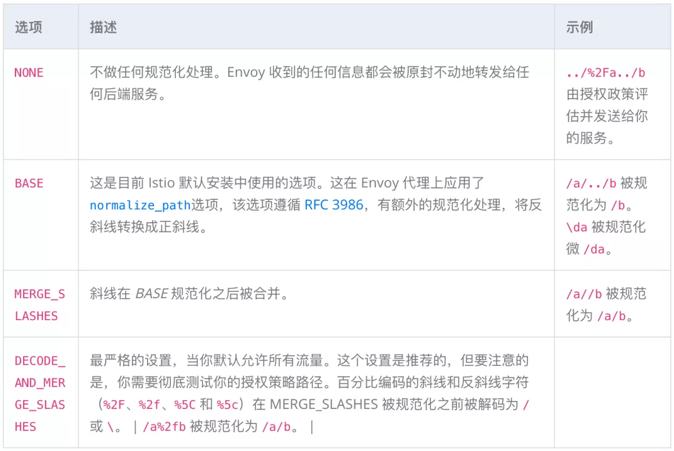
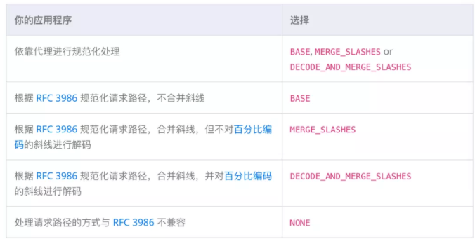
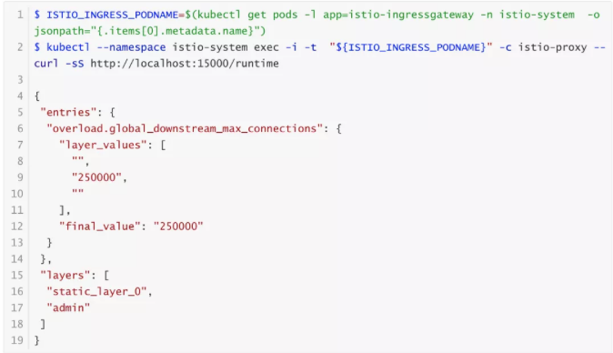

# **第二节 Istio 安全最佳实践**

Istio 的安全功能提供了强大的身份、策略、透明的 TLS 加密以及认证、授权和审计（AAA）工具来保护你的服务和数据。然而，为了充分安全地利用这些功能，必须注意遵循最佳实践

## **1、双向 TLS**

Istio 将尽可能使用 **双向TLS** 对流量进行自动加密。**然而，代理在默认情况下被配置为许可模式（`Permissive Mode`），这意味着他们将接受双向 TLS 和明文流量**。

**然而，仅靠双向 TLS 并不足以保证流量的安全，因为它只提供认证，而不是授权。这意味着，任何拥有有效证书的人仍然可以访问一个服务。**

**为了完全锁定流量，建议配置授权策略**。这允许创建细粒度的策略来允许或拒绝流量。例如，你可以只允许来自 app 命名空间的请求访问 `hello-world` 服务。

## **2、授权策略**

Istio 授权在 Istio 安全中起着关键作用。它需要努力配置正确的授权策略，以最好地保护你的集群。了解这些配置的影响是很重要的，因为 Istio 无法确定所有用户的正确授权。请全程关注本节内容。


### **2-1 应用默认拒绝的授权策略**

我们建议你按照 `default-deny` 模式定义你的 Istio 授权策略，以增强集群的安全态势。

**默认拒绝授权模式意味着你的系统默认拒绝所有请求，而你定义了允许请求的条件**。如果你错过了一些条件，**流量将被意外地拒绝，而不是流量被意外地允许**。后者通常是一个安全事件，而前者可能会导致糟糕的用户体验、服务中断或不符合你的 SLO/SLA。

例如，在 HTTP 流量的授权任务中，名为 `allow-nothing` 的授权策略确保所有流量在默认情况下被拒绝。从这里开始，其他授权策略根据特定条件允许流量。


### **2-2 在路径规范化上定制你的系统**

**Istio 授权策略可以基于 HTTP 请求中的 URL 路径。路径规范化（又称 URI 规范化）**对传入请求的路径进行修改和标准化，从而使规范化后的路径能够以标准方式进行处理。语法上不同的路径在路径规范化后可能是等同的。

Istio 支持以下请求路径的规范化方案，然后再根据授权策略进行评估和路由请求：


 

**该配置是通过 mesh 配置中的 `pathNormalization` 字段指定的。**

为了强调这一点，规范化算法是按照以下顺序进行的：

* 百分比解码 `%2F`、`%2f`、`%5C` 和 `%5c`
* 合并斜线

### **2-3 配置的例子**

确保 Envoy 规范化请求路径以符合你的后端服务的期望，对你的系统安全至关重要。下面的例子可以作为你配置系统的参考。规范化的 URL 路径，如果选择了` NONE`，则是原始的 URL 路径将：

* 用来对照授权策略进行检查
* 转发到后端应用程序

 

### **2-4 如何配置**

你可以使用 istioctl 来更新 mesh 配置

```
$ istioctl upgrade --set meshConfig.pathNormalization.normalization=DECODE_AND_MERGE_SLASHES
```

或通过改变你的 Operator 重写文件

```
$ cat <<EOF > iop.yaml
apiVersion: install.istio.io/v1alpha1
kind: IstioOperator
spec:
  meshConfig:
    pathNormalization:
      normalization: DECODE_AND_MERGE_SLASHES
EOF
$ istioctl install -f iop.yaml
```


另外，如果你想直接编辑 Mesh 配置，你可以将 `pathNormalization` 添加到 `mesh` 配置中，该配置是 `istio-<REVISION_ID> `的 `CongfigMap`，在 istio-system 命名空间。例如，如果你选择 `DECODE_AND_MERGE_SLASHES` 选项，你修改 mesh 配置如下：

```
apiVersion: v1
  data:
    mesh: |-
      ...
      pathNormalization:
        normalization: DECODE_AND_MERGE_SLASHES
      ...     
```

### **2-5 不太常见的规范化配置**

**大小写规范化**

**在某些环境中，以不区分大小写的方式比较授权策略中的路径可能是有用的。例如，将 `https://myurl/get` 和 `https://myurl/GeT` 等同对待。**

在这些情况下，可以使用下面的 `EnvoyFilter。`这个过滤器将改变用于比较的路径和呈现给应用程序的路径。

```
apiVersion: networking.istio.io/v1alpha3
kind: EnvoyFilter
metadata:
  name: ingress-case-insensitive
  namespace: istio-system
spec:
  configPatches:
  - applyTo: HTTP_FILTER
    match:
      context: GATEWAY
      listener:
        filterChain:
          filter:
            name: "envoy.filters.network.http_connection_manager"
            subFilter:
              name: "envoy.filters.http.router"
    patch:
      operation: INSERT_BEFORE
      value:
        name: envoy.lua
        typed_config:
            "@type": "type.googleapis.com/envoy.extensions.filters.http.lua.v3.Lua"
            inlineCode: |
              function envoy_on_request(request_handle)
                local path = request_handle:headers():get(":path")
                request_handle:headers():replace(":path", string.lower(path))
              end              
```
 
 
## **3、了解流量采集的限制**

Istio sidecar 的工作原理是捕获入站流量和出站流量，并通过 sidecar 代理引导它们。

然而，并不是所有的流量都被捕获：

* 重定向只处理基于 TCP 的流量。任何 UDP 或 ICMP 数据包都不会被捕获或修改。
* **Sidecar 使用的许多端口以及 `22` 号端口的入站捕获被禁用。这个列表可以通过 `traffic.sidecar.istio.io/excludeInboundPorts` 等选项来扩展**。
* **出站捕获同样可以通过 `traffic.sidecar.istio.io/excludeOutboundPorts` 等设置或其他方式减少。**

一般来说，应用程序和其 sidecar 代理之间的安全边界最小。

对 sidecar 的配置是以每个模块为基础的，并且两者都在同一个网络 / 进程命名空间中运行。因此，应用程序可能有能力删除重定向规则，并删除、改变、终止或替换 sidecar 代理。

这允许一个 pod 故意绕过它的 sidecar 的出站流量或故意让入站流量绕过它的 sidecar。

**因此，依靠 Istio 无条件地捕获所有流量是不安全的。相反，安全边界是客户端不能绕过另一个 pod 的 sidecar。**

例如，如果我在 9080 端口运行 review 应用程序，我可以假设来自 productpage 应用程序的所有流量将被 sidecar 代理捕获，其中 Istio 认证和授权策略可能适用。


### **3-1 利用 NetworkPolicy 进行深度防御**

为了进一步确保流量安全，Istio 策略可以与 Kubernetes 网络策略分层。这实现了一个强大的深度防御策略，可以用来进一步加强你的网格的安全性。

例如，你可以选择只允许流量到我们 review 应用程序的 9080 端口。如果集群中的 Pod 被破坏或存在安全漏洞，这可能会限制或阻止攻击者的进展。

### **3-2 确保出口流量的安全**

一个常见的误解是，像 `outboundTrafficPolicy: REGISTRY_ONLY` 作为一个安全策略，防止所有对未申报服务的访问。然而，如上所述，这并不是一个强大的安全边界，应该被认为是尽力而为。

虽然这对防止意外的依赖性很有用，但如果你想保证出口流量的安全，并强制要求所有出站流量通过代理，**你应该依靠 Egress Gateway**。

**当与网络策略相结合时，你可以强制所有的流量，或一些子集，通过出口网关。这确保了即使客户意外地或恶意地绕过他们的 sidecar，该请求也会被阻止。**


## **4、当使用 TLS 发起时，在目的地规则中配置 TLS 验证**

**Istio 提供了从一个 sidecar 代理或网关发起 TLS 的能力。这使得发送纯文本 HTTP 流量的应用程序能够透明地 “升级 “到 HTTPS。**

**在配置 `DestinationRule` 的` tls` 设置时，必须注意指定 `caCertificates` 字段。如果没有设置，服务器的证书将不会被验证。**

```
apiVersion: networking.istio.io/v1beta1
kind: DestinationRule
metadata:
  name: google-tls
spec:
  host: google.com
  trafficPolicy:
    tls:
      mode: SIMPLE
      caCertificates: /etc/ssl/certs/ca-certificates.crt
```

## **5、网关**

在运行 Istio 网关时，涉及一些资源：

* **Gateways，它控制网关的端口和 TLS 设置**。
* **VirtualServices，控制路由逻辑。这些都是通过在网关字段中的直接引用和在网关和VirtualService 的 hosts 字段中的相互约定与 Gateway 相关联的**。


### **5-1 限制 Gateway 创建权限**

**建议将 Gateway 资源的创建限制在受信任的集群管理员。这可以通过 Kubernetes RBAC 策略或 Open Policy Agent等工具实现。**

### **5-2 避免过于宽泛的 hosts 配置**

在可能的情况下，避免在 Gateway 中进行过于广泛的 hosts 设置。

例如，这种配置将允许任何 VirtualService 绑定到 Gateway，可能会暴露出意外的域：

```
servers:
- port:
    number: 80
    name: http
    protocol: HTTP
  hosts:
  - "*"
```

这应该被锁定，只允许特定域或特定命名空间。

```
servers:
- port:
    number: 80
    name: http
    protocol: HTTP
  hosts:
  - "foo.example.com" # 只允许 foo.example.com 的 VirtualServices
  - "default/bar.example.com" # 只允许 default 命名空间 bar.example.com 的 VirtualServices
  - "route-namespace/*" # 只允许 route-namespace 命名空间的 VirtualServices
```

### **5-3 隔离敏感服务**

可能需要对敏感服务实施更严格的物理隔离。例如，你可能想为敏感的 `payment.example.com` 运行一个专用的网关实例，而为不太敏感的域名如 `blog.example.com` 和 `store.example.com `使用一个单一的共享网关实例。

这可以提供一个更强大的深度防御，并有助于满足某些监管合规准则。


### **5-4 在放宽的 SNI 主机匹配下，明确地禁用所有敏感的 http 主机**

**在不同的主机上使用多个 `Gateways` 来定义双向 TLS 和简单 TLS 是合理的。例如，对 SNI 主机 `admin.example.com` 使用双向 TLS，对 SNI 主机 `*.example.com` 使用简单 `TLS`。**

```
kind: Gateway
metadata:
  name: guestgateway
spec:
  selector:
    istio: ingressgateway
  servers:
  - port:
      number: 443
      name: https
      protocol: HTTPS
    hosts:
    - "*.example.com"
    tls:
      mode: SIMPLE
---
kind: Gateway
metadata:
  name: admingateway
spec:
  selector:
    istio: ingressgateway
  servers:
  - port:
      number: 443
      name: https
      protocol: HTTPS
    hosts:
    - admin.example.com
    tls:
      mode: MUTUAL
```


如果有必要进行上述操作，强烈建议在附加到 `*.example.com` 的 `VirtualService `中明确禁用 `http` 主机 `admin.example.com`。

原因是目前底层的 `envoy `代理不需要 `http 1 `头 `Host` 或 `http 2` 伪头`:authority` 的 `SNI` 约束后，攻击者可以重新使用 `guest-SNI TLS` 连接来访问 `admin VirtualService`。

http 响应代码 421 是为这种 `Host SNI` 不匹配而设计的，可以用来实现禁用。

```
apiVersion: networking.istio.io/v1alpha3
kind: VirtualService
metadata:
  name: disable-sensitive
spec:
  hosts:
  - "admin.example.com"
  gateways:
  - guestgateway
  http:
  - match:
    - uri:
        prefix: /
    fault:
      abort:
        percentage:
          value: 100
        httpStatus: 421
    route:
    - destination:
        port:
          number: 8000
        host: dest.default.cluster.local
```

## **6、协议检测**

Istio 会自动确定它所看到的流量的协议。为了避免意外或故意的漏检，可能会导致意外的流量行为，建议在可能的情况下明确声明协议。

## **7、CNI**

为了透明地捕获所有流量，Istio 依赖于 `istio-init initContainer `所配置的 `iptables` 规则。这增加了一个要求，即 `NET_ADMIN` 和 `NET_RAW`的能力必须对 pod 可用。

为了减少授予 pod 的权限，Istio 提供了一个 CNI 插件，它消除了这个要求。

Istio CNI 插件目前是一个 alpha 功能。

## **8、使用加固的 docker 镜像**

Istio 的默认 docker 镜像，包括那些由控制平面、网关和 sidecar 代理运行的镜像，都是基于 ubuntu 的。这提供了各种工具，如 bash 和 curl，这以方便为代价，增加了攻击面。

Istio 还提供了一个基于无发行版镜像的小型镜像，减少了镜像中的依赖性。

无发行版的镜像目前是一个 alpha 功能。


## **9、发布和安全策略**

为了确保你的集群有最新的已知漏洞的安全补丁，重要的是保持在 Istio 的最新补丁版本上，并确保你在一个支持的版本上，仍在接收安全补丁。

## **10、检测无效配置**

虽然 Istio 在创建资源时提供了验证，但这些检查不能抓住所有阻止配置在网格中分布的问题。这可能导致应用的策略被意外地忽略，从而导致意外的结果。

* **在应用配置之前或之后运行 `istioctl analyze`，以确保配置有效**。
* **监控控制平面的拒绝配置。除了日志之外，这些都是通过 `pilot_total_xds_rejects` 指标来显示的**。
* 测试你的配置，以确保它给出预期的结果。对于安全策略来说，运行正面和负面的测试是有用的，以确保你不会意外地限制过多或过少的流量。

## **11、锁定端口**

Istio 配置了各种可能被锁定的端口，以提高安全性。

### **11-1 控制平面**

Istiod 为方便起见，默认暴露了几个未经认证的明文端口。如果需要，这些端口可以被关闭。

* **`8080` 端口暴露了调试接口，它提供了对集群状态的各种细节的读取权限。这可以通过在 Istiod 上设置环境变量 `ENABLE_DEBUG_ON_HTTP=false` 来禁用。警告：许多 istioctl 命令都依赖于这个接口，如果它被禁用，将无法运行**。
* **`15010` 端口通过明文暴露 `XDS` 服务。这可以通过在 Istiod 部署中添加 `--grpcAddr=""` 标志来禁用。注意：高度敏感的服务，如证书签署和分发服务，绝不通过明文提供**。

### **11-2 数据平面**

该代理暴露了各种端口。对外暴露的是 `15090` 端口（遥测）和 `15021` 端口（健康检查）。

端口 15020 和 15000 提供调试端点。这些端口只在本地主机上暴露。因此，运行在与代理相同的 pod 中的应用程序可以访问；在 `sidecar` 和应用程序之间没有信任边界。

## **12 配置第三方服务账户令牌**

为了与 Istio 控制平面进行认证，Istio 代理将使用服务账户令牌。Kubernetes 支持这种令牌的两种形式：

* **第三方令牌，有一个范围内的受众和到期时间**。
* **第一方令牌，没有过期，并被安装到所有的 Pod 中**。

由于第一方令牌的属性不太安全，Istio 将默认使用第三方令牌。然而，这个功能并不是在所有的 Kubernetes 平台上都启用的。

**如果你使用 `istioctl` 来安装，将会自动检测到支持。这也可以手动完成，通过传递 `--set values.global.jwtPolicy=third-party-jwt` 或 `--set values.global.jwtPolicy=first-party-jwt `进行配置。**


要确定你的集群是否支持第三方令牌，寻找 `TokenRequest API`。如果这没有返回响应，那么该功能就不被支持。

```
$ kubectl get --raw /api/v1 | jq '.resources[] | select(.name | index("serviceaccounts/token"))'
{
    "name": "serviceaccounts/token",
    "singularName": "",
    "namespaced": true,
    "group": "authentication.k8s.io",
    "version": "v1",
    "kind": "TokenRequest",
    "verbs": [
        "create"
    ]
}
```

## **13 配置下游连接的限制**

默认情况下，Istio（和 Envoy）对下游连接的数量没有限制。这可能被恶意行为者利用。为了解决这个问题，你必须为你的环境配置一个适当的连接限制。

* 通过下载 `custom-bootstrap-runtime.yaml ` 创建一个 ConfigMap。根据你的部署中各个网关实例所需的并发连接数，更新 `ConfigMap` 中的 `global_downstream_max_connections`。一旦达到限制，Envoy 将开始拒绝 tcp 连接。

```
$ kubectl -n istio-system apply -f custom-bootstrap-runtime.yaml
```


* 入口网关部署打补丁，以使用上述配置。下载 `gateway-patch.yaml `并使用以下命令应用它。

```
$ kubectl --namespace istio-system patch deployment istio-ingressgateway --patch "$(cat gateway-patch.yaml)"
```

* 确认新的限制已经到位。


 
