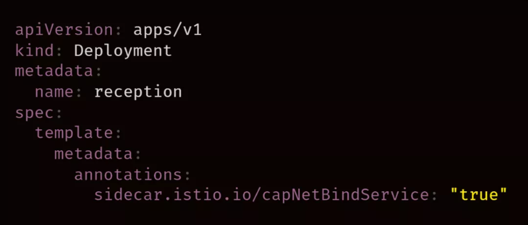
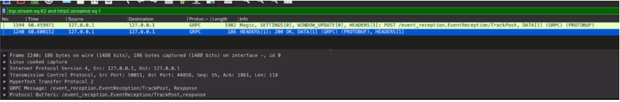
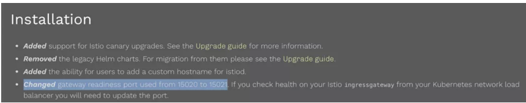
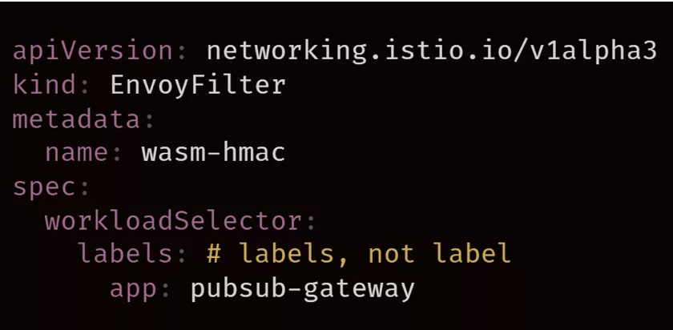
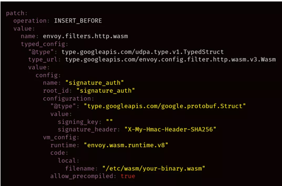
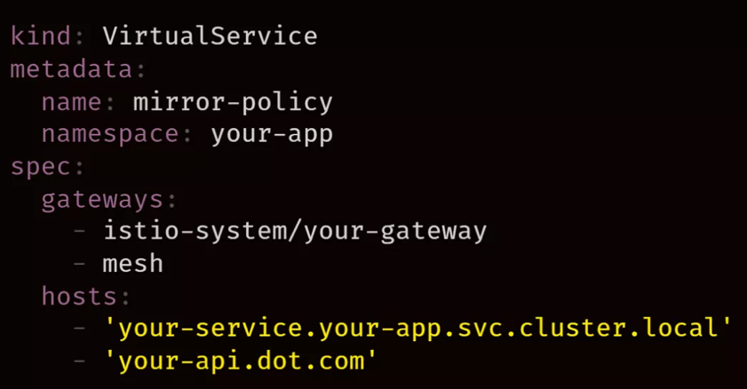
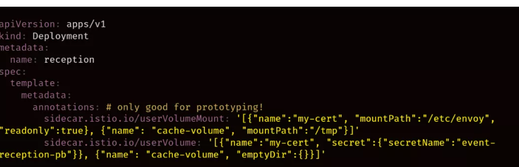

# **第四节 使用 Istio 的十个技巧**

## **1、使用 Kubectl Sniff 和 Wireshark**

不知道大家有没有听说过 Wireshark。Sniff 提供了一种抽象概念，让我们可以侦听那些通过 Wireshark 进入离开 Istio 代理的数据包。

`Sniff` 非常适合于底层分析，它可以将问题的根本原因隔离到应用程序级和 Envoy 级。

首先通过 `global.proxy.privileged=true` 在 `IstioOperator CRD` 上启用特权模式，然后将以下注释添加到 `Deployment`。

 

**在 Wireshark 中，我们可以捕捉 GRPC 请求并进行过滤，然后通过请求的生命周期来确定 ingress 和 egress，最后移植本地服务，使用 BloomRPC 或 Postman 隔离连接问题。**

 

### **1-1 首先使用 Envoy**

通过在 docker-compose 文件中运行 Envoy 了解如何配置 Envoy 过滤器链（filter chain），可以更容易地对请求镜像和 WASM 等更改进行原型改变（prototype change）。在将 Envoy 转换为 Istio 配置的过程中，对 Envoy 足够了解可以提供很多帮助。

### **1-2 认真阅读发行说明**

在之前的 Istio 升级过程中，很多人不小心错过了一个更改，即 Envoy 状态端口修改（`15020->15021`）。

 

## **2、在 Istio Operator 上使用 Istioctl 生成声明文件**

最近有人从 v1.6 到 v1.7 进行了升级，**并注意到 Operator 由于结构（标签->实物标签：EnvoyFilter）的更改而无法完成调协（reconciliation loop），希望 Operator 能够以向后兼容的方式处理此升级**。生成的声明文件很容易通过 Istio Overlay API 或 Kustomize 来处理未通过 Operator CRD 公开的字段。

 

**找到示例声明文件后，确认示例与代理容器中的 Envoy API/Protobuf 版本对齐**。

 

**如果将 Istio Ingress Gateway 用作 GKE 上集群的 Ingress，并要启用 HTTPS，请在 Istio Ingress Gateway 服务的单个上游设置一个 Ingress 对象。**

添加静态 IP 计算地址（Static IP Compute Address）、证书管理（Managed Certificate）和 BackendConfig（设置运行状况检查），可以方便我们通过负载均衡器提供安全访问。

**请求镜像是在生产环境中进行测试的有力手段。**

如果在安装中启用了此功能，但出现下游服务拒绝请求的情况，注意查看主机头（Host Header）。Envoy 将 `“-shadow”` 附加到主机头。

如果使用的是 Vanilla Envoy，那可以通过创建一个单独的侦听器来解决该问题。我们也可以通过 Istio 添加一个单独的 Envoy 部署来重写标头。

**同样，如果要使用` istio-ingressgateway` 集群镜像在边缘实现请求镜像，要在 mesh 虚拟服务中添加本地服务名称和关键字。**

 

**JWT 验证提供了一个有趣的抽象概念，它允许 service 知道它是否通过身份验证。**

与“退出（opt out）”基于工作负载选择器标签方案相比，“加入（opt in）”可能会暴露的经过身份验证的 service。

**使用 `Open Policy Agent` 之类的工具可以在工作负载上强制使用必需的标签，以确保所有 service 上都带有身份验证标签。**

**GRPC JSON 转码器可以帮助工程师将程序代码从 JSON 转码为 GRPC。**

不过，将部署更改到 proto descriptor 的过程有些笨重。有种解决方法是用 base64 编码 proto descriptor 并将其作为 secret 安装，但由于在 Protobuf 定义更改时，需要对二进制文件进行 base64 编码，这非常麻烦，因此这种方法不太好。有种稍微好一点的方法是使用描述符（descriptor）构建容器镜像，并将其作为具有共享内存量的 initContainer 运行。在 pod 启动后，initContainer 会将二进制文件复制到共享卷空间中，并且 Istio 代理容器可以进行访问。

 

**Envoy 为过滤器（filter）提供了一种修改虚拟主机特定配置的方法。**

从 Istio 来说，这意味着可以更改特定虚拟主机路径上现有过滤器功能。此功能适用于特定过滤器，但不适用于 WASM 等过滤器。
